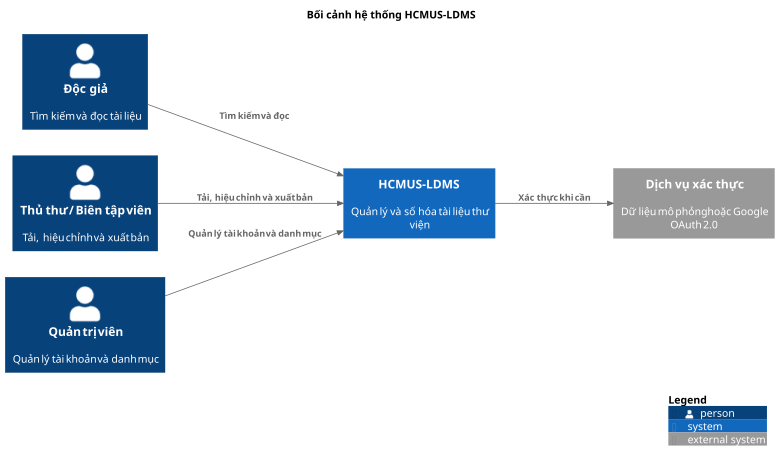
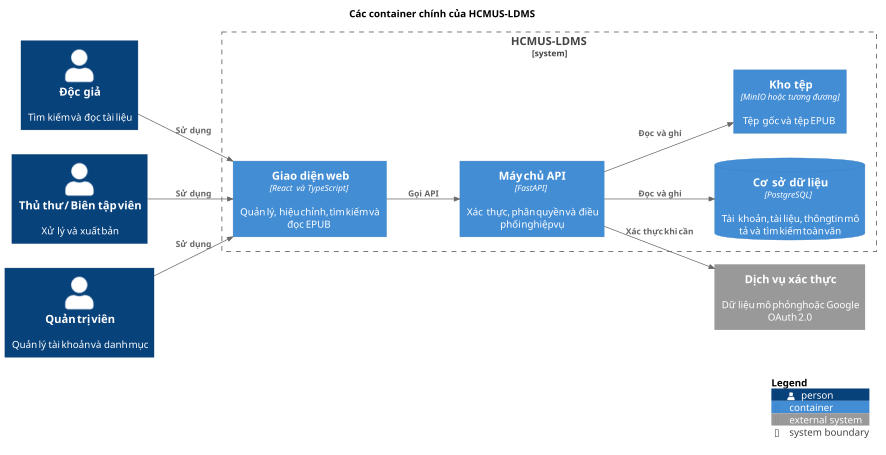
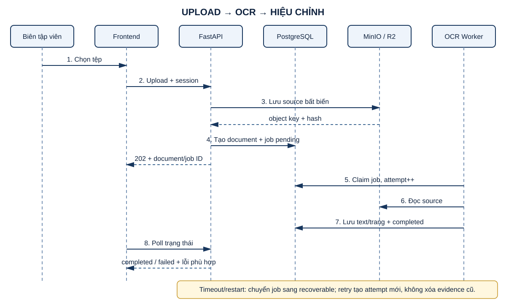
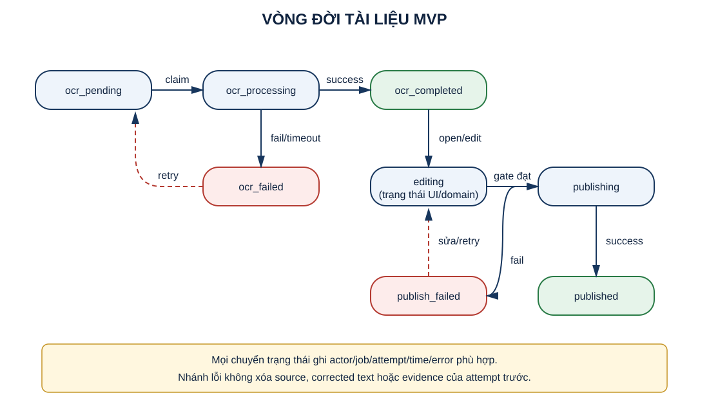
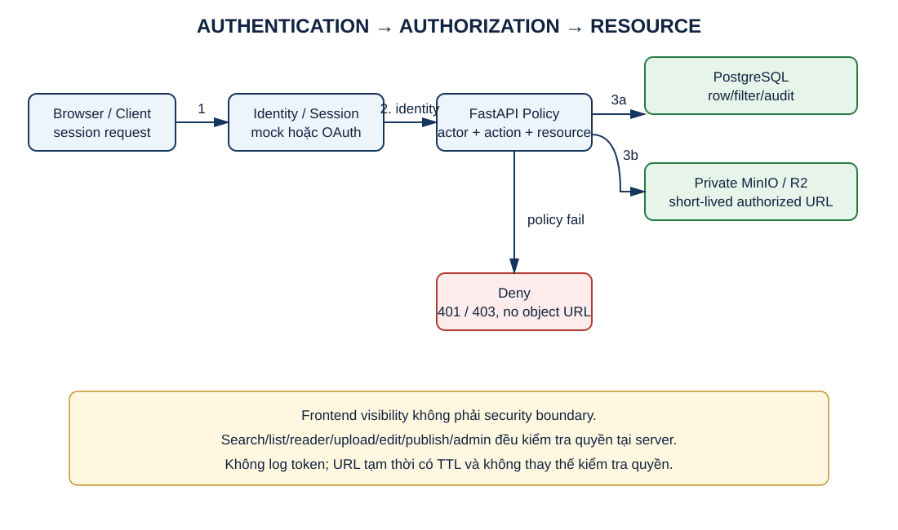
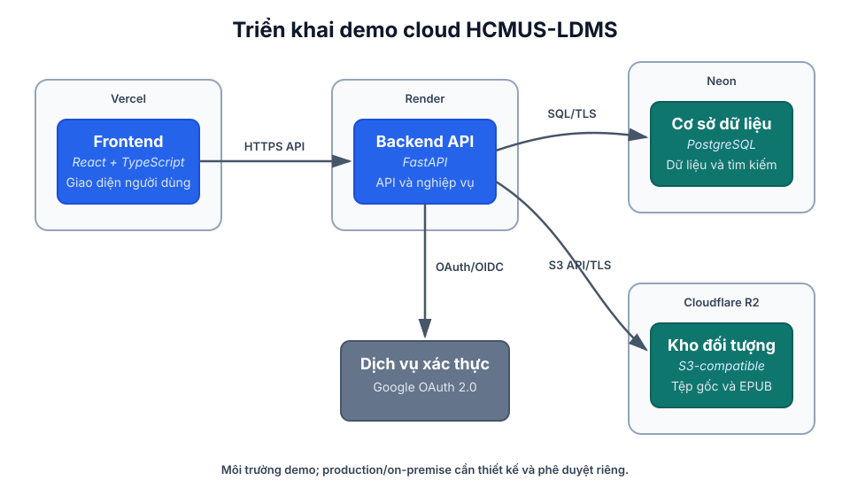

# TÀI LIỆU KIẾN TRÚC PHẦN MỀM

## Hệ thống Quản lý và Số hóa Tài liệu Thư viện HCMUS (HCMUS-LDMS)

### THÔNG TIN TÀI LIỆU

| Trường thông tin | Nội dung |
|---|---|
| Mã tài liệu | `HCMUS-LDMS-SAD` |
| Tên tài liệu | Tài liệu kiến trúc phần mềm |
| Dự án | HCMUS-LDMS |
| Đơn vị soạn thảo | Sebros – Nhóm sinh viên đề xuất dự án |
| Người thực hiện | Mạch Quốc Tấn |
| Người xem xét | Đại diện nhóm Sebros và Đại diện nghiệp vụ Thư viện |
| Trạng thái tài liệu | Bản dự thảo để xem xét |
| Phạm vi | Phiên bản đầu tiên trong 11 tuần |

### LỊCH SỬ PHIÊN BẢN

| Phiên bản | Ngày | Mô tả thay đổi | Người thực hiện |
|---|---|---|---|
| 1.0 | 21/08/2026 | Rà soát kiến trúc theo các tài liệu dự án; rút gọn nội dung dư thừa, thống nhất phạm vi phiên bản đầu tiên, Kanban 11 tuần và bổ sung các sơ đồ C4 bằng PlantUML với kích thước phù hợp khi xuất PDF. | Mạch Quốc Tấn |
| 2.0 | 22/08/2026 | Phân biệt local/demo/production, bổ sung vòng đời dữ liệu, xử lý job/recovery và đồng bộ SOW 11 tuần. | Mạch Quốc Tấn |
| 3.0 | 22/08/2026 | Bổ sung sequence upload–OCR, state model, authorization model và liên kết ADR/operations/test. | Mạch Quốc Tấn |

## Mục lục

- [Mục đích và phạm vi](#1-mục-đích-và-phạm-vi)
- [Định hướng và ràng buộc kiến trúc](#2-định-hướng-và-ràng-buộc-kiến-trúc)
- [Mô hình ca sử dụng](#3-mô-hình-ca-sử-dụng)
- [Kiến trúc logic và công nghệ](#4-kiến-trúc-logic-và-công-nghệ)
- [Bảo mật và dữ liệu](#5-bảo-mật-và-dữ-liệu)
  - [Luồng upload và OCR](#55-luồng-upload-và-ocr)
  - [Mô hình trạng thái tài liệu](#56-mô-hình-trạng-thái-tài-liệu)
  - [Mô hình xác thực và phân quyền](#57-mô-hình-xác-thực-và-phân-quyền)
- [Mô hình triển khai](#6-mô-hình-triển-khai)
- [Kiểm chứng kỹ thuật](#7-kiểm-chứng-kỹ-thuật)
- [Truy vết và tài liệu tham khảo](#8-truy-vết-và-tài-liệu-tham-khảo)

## 1. Mục đích và phạm vi

Tài liệu mô tả cách HCMUS-LDMS được phân chia thành các thành phần và cách các thành phần phối hợp để đáp ứng [Yêu cầu phần mềm](04-software-requirements.md). Tài liệu dùng làm cơ sở thống nhất cho thiết kế, lập trình, kiểm thử và bàn giao; không thay thế yêu cầu phần mềm hoặc hướng dẫn vận hành chính thức.

Phạm vi kiến trúc phiên bản đầu tiên gồm: đăng nhập và phân quyền, tải tài liệu, nhận dạng ký tự, hiệu chỉnh, nhập thông tin mô tả tài liệu, tạo EPUB, xuất bản, tìm kiếm toàn văn và đọc trực tuyến. Các chức năng lưu vị trí đọc, ghi chú, trích dẫn và mở rộng công cụ tìm kiếm chỉ được xem xét sau khi phạm vi bắt buộc ổn định.

## 2. Định hướng và ràng buộc kiến trúc

### 2.1. Định hướng

- Dùng một ứng dụng gồm nhiều mô-đun để phù hợp với nhóm 6 sinh viên và thời gian 11 tuần.
- Tách giao diện, API, nghiệp vụ và dữ liệu để dễ phát triển, kiểm thử và thay đổi.
- Tách tệp gốc và tệp EPUB khỏi dữ liệu quản lý; không ghi đè làm mất bản gốc.
- Xử lý nhận dạng ký tự và tạo EPUB bằng tác vụ nền; giao diện luôn hiển thị trạng thái xử lý.
- Kiểm tra quyền ở máy chủ trước các thao tác xem, sửa, xuất bản và quản trị.

### 2.2. Ràng buộc

- Nhóm thực hiện gồm 6 sinh viên chuyên ngành Kỹ thuật phần mềm.
- Phiên bản đầu tiên được thực hiện trong 11 tuần theo luồng Kanban, không chia theo Sprint.
- Đây là dự án phục vụ môn học nên chưa có ngân sách sơ bộ cụ thể.
- Môi trường local dùng Docker Compose, PostgreSQL và MinIO. Môi trường demo cloud có thể dùng Vercel, Render, Neon và Cloudflare R2 sau khi smoke test đạt. Production/on-premise ngoài phạm vi MVP và cần quyết định riêng.
- Không tự đưa vào kiến trúc các công cụ hoặc chức năng chưa có trong yêu cầu phần mềm và danh mục công việc.

## 3. Mô hình ca sử dụng

Hệ thống có ba nhóm người dùng chính:

- **Độc giả:** tìm kiếm tài liệu đã xuất bản và đọc trực tuyến theo quyền được cấp.
- **Thủ thư hoặc biên tập viên:** tải tài liệu, theo dõi nhận dạng ký tự, hiệu chỉnh, nhập thông tin mô tả và xuất bản.
- **Quản trị viên:** quản lý tài khoản, vai trò, quyền và danh mục dùng chung.

## 4. Kiến trúc logic và công nghệ

### 4.1. Sơ đồ container và phân tầng logic

| Tầng | Trách nhiệm |
|---|---|
| Giao diện | Hiển thị khu vực quản lý, màn hình hiệu chỉnh, tìm kiếm và trình đọc EPUB. |
| API | Tiếp nhận yêu cầu, kiểm tra dữ liệu, xác thực, phân quyền và trả kết quả. |
| Nghiệp vụ | Quản lý tài liệu, nhận dạng ký tự, hiệu chỉnh, tạo EPUB, xuất bản và tìm kiếm. |
| Dữ liệu | Lưu tài khoản, vai trò, tài liệu, thông tin mô tả, trạng thái, nội dung và tệp. |

Việc dùng một ứng dụng gồm nhiều mô-đun giúp nhóm giảm số thành phần phải triển khai. Các mô-đun được tách theo trách nhiệm để sau này có thể thay đổi hoặc mở rộng khi có nhu cầu thực tế. DSpace, Lạc Việt Vebrary và phương án ghép công cụ chỉ là các phương án cạnh tranh trong đề xuất dự án, không phải thành phần phụ thuộc của kiến trúc này.

### 4.2. Công nghệ dự kiến

| Thành phần | Công nghệ dự kiến | Vai trò |
|---|---|---|
| Giao diện | React và TypeScript | Xây dựng giao diện quản lý, hiệu chỉnh và đọc tài liệu. |
| Trình đọc | Epub.js | Hiển thị EPUB trực tuyến. |
| Máy chủ API | FastAPI | Cung cấp API và điều phối nghiệp vụ. |
| Cơ sở dữ liệu | Neon PostgreSQL | Cung cấp cơ sở dữ liệu PostgreSQL trên nền tảng Neon. |
| Nhận dạng ký tự | Tesseract OCR | Chuyển ảnh hoặc PDF thành văn bản để hiệu chỉnh. |
| Tạo EPUB | Pandoc hoặc công cụ tương đương đã kiểm chứng | Tạo EPUB từ nội dung đã hiệu chỉnh. |
| Lưu trữ tệp | Cloudflare R2 | Lưu tệp gốc và tệp EPUB riêng biệt, truy cập qua giao diện tương thích S3. |
| Xác thực | Dữ liệu mô phỏng khi phát triển; Google OAuth 2.0 khi được cấu hình | Đăng nhập và tạo phiên làm việc. |
| Triển khai giao diện | Vercel | Xây dựng và phân phối frontend. |
| Triển khai máy chủ | Render | Chạy backend và các tác vụ API của hệ thống. |

Các phiên bản thư viện và cấu hình cụ thể được chốt trong mã nguồn; bảng này không phải cam kết về phiên bản sản phẩm bên ngoài.

### 4.3. Luồng xử lý chính

1. Người có quyền tải tệp lên; máy chủ kiểm tra loại tệp và lưu bản gốc.
2. Hệ thống tạo tác vụ nhận dạng ký tự, lưu trạng thái và thực hiện ở nền.
3. Biên tập viên đối chiếu bản gốc với văn bản, sửa lỗi và lưu nội dung.
4. Người có quyền nhập thông tin mô tả, phân loại và kiểm tra điều kiện xuất bản.
5. Hệ thống tạo EPUB và chỉ cho phép xuất bản khi các điều kiện bắt buộc đạt.
6. Độc giả tìm kiếm và đọc tài liệu đã xuất bản; máy chủ kiểm tra quyền trước khi cung cấp nội dung.

## 5. Bảo mật và dữ liệu

### 5.1. Bảo mật

- Phiên đăng nhập và vai trò được kiểm tra ở phía máy chủ.
- Tài liệu chưa xuất bản không xuất hiện trong kết quả tìm kiếm.
- Tệp gốc và EPUB được lưu trong vùng không công khai.
- Trình đọc không hiển thị nút tải tệp EPUB gốc; đây không phải cơ chế chống sao chép tuyệt đối.
- Dữ liệu thử nghiệm được tách khỏi dữ liệu thật của Thư viện.

### 5.2. Nhóm dữ liệu

| Nhóm dữ liệu | Nội dung |
|---|---|
| Tài khoản và vai trò | Người dùng, vai trò, quyền và trạng thái. |
| Tài liệu | Tệp gốc, trạng thái xử lý, người tạo và thời điểm cập nhật. |
| Thông tin mô tả tài liệu | Tên, tác giả, năm, thể loại, từ khóa và mô tả. |
| Nội dung nhận dạng | Văn bản theo tài liệu hoặc trang và trạng thái hiệu chỉnh. |
| Bản xuất bản | Tệp EPUB, trạng thái xuất bản và người xác nhận. |
| Tác vụ và nhật ký | Loại tác vụ, trạng thái, lỗi chính, người thực hiện và thời điểm. |

Tệp gốc không bị ghi đè trong quá trình nhận dạng, hiệu chỉnh hoặc tạo EPUB. Với phạm vi học tập, nhóm lưu cấu hình, dữ liệu mẫu và hướng dẫn khôi phục; lịch sao lưu chính thức được xác định trong tài liệu vận hành khi triển khai thực tế.

### 5.3. Vòng đời và tính toàn vẹn

- Tài liệu dùng các trạng thái tối thiểu: `ocr_pending`, `ocr_processing`, `ocr_completed`, `ocr_failed`, `publishing`, `published`, `publish_failed`.
- Job OCR/publish lưu loại job, lần thử, trạng thái, thời điểm, lỗi và tài liệu liên quan.
- Job `pending/processing` bị gián đoạn bởi restart phải được phát hiện và chuyển sang trạng thái có thể retry; không để treo vô hạn.
- Retry tạo hoặc ghi nhận attempt mới, không xóa evidence của attempt cũ.
- Publish chỉ thành công sau khi EPUB được kiểm tra cấu trúc và dữ liệu bắt buộc đạt.
- Database và object storage phải giữ quan hệ truy vết bằng document/job/version ID.

### 5.4. Xử lý nền và phục hồi

Trong MVP, xử lý nền có thể chạy cùng backend nếu PoC chứng minh đáp ứng dữ liệu mẫu. Đây không phải hàng đợi bền vững cho production. Kiểm chứng bắt buộc gồm timeout, process restart, job thất bại, retry và bảo toàn source/corrected text. Khi tải hoặc concurrency vượt khả năng mô hình này, nhóm phải đánh giá worker/queue riêng bằng Change Request kiến trúc.

### 5.5. Luồng upload và OCR

Luồng tách việc tiếp nhận HTTP khỏi xử lý dài. API chỉ trả kết quả tiếp nhận sau khi source đã được lưu và document/job record đã được tạo nhất quán. Worker claim job theo attempt; trạng thái và lỗi phù hợp được lưu để UI theo dõi. Các tình huống lưu object thành công nhưng tạo record thất bại, job treo và retry trùng phải được kiểm thử theo [Kế hoạch kiểm thử và UAT](20-test-plan.md).

### 5.6. Mô hình trạng thái tài liệu

Các trạng thái trong sơ đồ là baseline tối thiểu. `editing` thể hiện giai đoạn nghiệp vụ/UI giữa OCR và publish; triển khai có thể lưu bằng trường riêng hoặc suy ra từ version nội dung nhưng không được làm mất các trạng thái job chuẩn trong SRS. Mọi lần retry giữ attempt/error trước để phục vụ truy vết.

### 5.7. Mô hình xác thực và phân quyền

Frontend không phải security boundary. Backend xác định actor, action và resource rồi mới truy vấn dữ liệu hoặc cấp URL object tạm thời. Search/list phải áp dụng bộ lọc quyền ngay tại phía máy chủ; không lấy dữ liệu trái quyền về client rồi mới ẩn. Chi tiết secrets, logging, incident và restore nằm trong [Kế hoạch vận hành và bảo mật](15-devops-and-operations.md).

## 6. Mô hình triển khai

Kiến trúc phân biệt ba profile:

| Profile | Thành phần | Mục đích/điều kiện |
|---|---|---|
| Local development/test | Frontend local, FastAPI, PostgreSQL, MinIO qua Docker Compose | Nguồn chuẩn để phát triển và chạy kiểm tra local. |
| Demo cloud | Vercel, Render, Neon, Cloudflare R2 | Chỉ tuyên bố sẵn sàng khi có smoke test và cấu hình được kiểm soát. |
| Production/on-premise | Chưa chốt | Ngoài phạm vi; cần threat model, backup, monitoring, cost và phê duyệt riêng. |

Môi trường demo cloud dùng các dịch vụ dự kiến:

- **Vercel:** xây dựng và phân phối frontend.
- **Render:** chạy backend, cung cấp API và điều phối tác vụ xử lý nền.
- **Neon:** cung cấp cơ sở dữ liệu PostgreSQL.
- **Cloudflare R2:** lưu tệp gốc và tệp EPUB; backend cấp quyền truy cập tạm thời khi người dùng đã được kiểm tra quyền.

Frontend trên Vercel gọi API trên Render. Backend trên Render kết nối đến Neon, Cloudflare R2 và dịch vụ xác thực thông qua biến môi trường được quản lý riêng. Khóa bí mật, chuỗi kết nối và thông tin xác thực không được đưa vào mã nguồn hoặc frontend. Kết quả local không được dùng thay cho bằng chứng demo cloud.

## 7. Kiểm chứng kỹ thuật

Nhóm thực hiện hai kiểm chứng nhỏ trước hoặc trong quá trình phát triển:

1. **Kiểm chứng nhận dạng ký tự:** tải một tài liệu mẫu, tạo tác vụ nền, theo dõi trạng thái, lưu văn bản và mở lại kết quả.
2. **Kiểm chứng luồng đọc:** đăng nhập bằng dữ liệu thử nghiệm, tìm tài liệu đã xuất bản, kiểm tra quyền và mở EPUB trên trình đọc.

Mỗi kiểm chứng phải ghi môi trường, dữ liệu dùng thử, thao tác, kết quả mong đợi và kết quả thực tế. Không xem kiểm chứng là bằng chứng cho hiệu năng sản phẩm thật nếu chưa có bộ dữ liệu và phép đo phù hợp.

Tại thời điểm cập nhật tài liệu, hai kiểm chứng vẫn ở trạng thái `Not Run` trong kế hoạch; không được diễn giải phần này là kết quả PoC đã đạt.

## 8. Truy vết và tài liệu tham khảo

| Quyết định kiến trúc | Yêu cầu liên quan |
|---|---|
| Phân tách giao diện, API, nghiệp vụ và dữ liệu | YC-PN-07, YC-PN-09 |
| Kiểm tra phiên và quyền ở máy chủ | YC-HT-01 đến YC-HT-04, YC-PN-01 |
| Lưu tệp gốc riêng và không ghi đè | YC-TL-03, YC-PN-08 |
| Tác vụ nhận dạng ký tự và tạo EPUB ở nền | YC-ND-01, YC-ND-02, YC-PH-04, YC-PN-03 |
| Tìm kiếm toàn văn và lọc theo quyền | YC-TC-01 đến YC-TC-04, YC-PN-04 |
| Kiểm tra điều kiện xuất bản và đọc trực tuyến | YC-PH-01 đến YC-PH-06, YC-TC-05, YC-TC-06 |

Tài liệu tham khảo:

- [Đề xuất dự án](01-project-proposal.md)
- [Tài liệu viễn cảnh và phạm vi](02-vision-and-scope.md)
- [Ủy nhiệm dự án](03-project-charter.md)
- [Yêu cầu phần mềm](04-software-requirements.md)
- [Danh mục công việc](04-product-backlog.md)
- [Nghiên cứu tính khả thi](08-feasibility-study.md)
- [Sổ đăng ký rủi ro](18-risk-management-plan.md)
- [Kế hoạch quản lý chất lượng](19-quality-management-plan.md)
- [Kế hoạch kiểm thử và UAT](20-test-plan.md)
- [Nhật ký quyết định và ADR](A1-decision-log-and-adr.md)
- [Kế hoạch vận hành và bảo mật](15-devops-and-operations.md)
