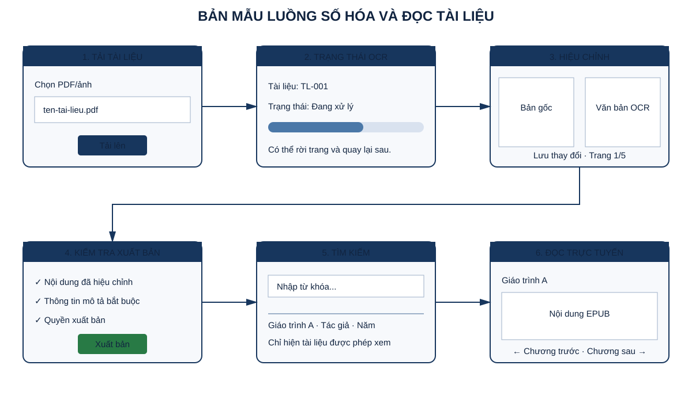

# TÀI LIỆU BẢN MẪU GIAO DIỆN

## Hệ thống Quản lý và Số hóa Tài liệu Thư viện HCMUS (HCMUS-LDMS)

### Thông tin tài liệu

| Trường | Nội dung |
|---|---|
| Mã tài liệu | `HCMUS-LDMS-PROTO` |
| Chủ sở hữu | Frontend Lead — Ngô Nguyễn Thế Khoa |
| Người xem xét | Đại diện nghiệp vụ Thư viện và QA |
| Phiên bản | 1.0 — 22/08/2026 |
| Trạng thái | Bản mẫu để lấy phản hồi; chưa phải bằng chứng hệ thống đã chạy |

## Mục lục

- [1. Mục tiêu và phạm vi](#1-mục-tiêu-và-phạm-vi)
- [2. Căn cứ thiết kế](#2-căn-cứ-thiết-kế)
- [3. Luồng bản mẫu cốt lõi](#3-luồng-bản-mẫu-cốt-lõi)
- [4. Quy tắc cho từng màn hình](#4-quy-tắc-cho-từng-màn-hình)
- [5. Kịch bản đánh giá](#5-kịch-bản-đánh-giá)
- [6. Nhật ký phản hồi](#6-nhật-ký-phản-hồi)
- [7. Phân biệt bản mẫu và sản phẩm](#7-phân-biệt-bản-mẫu-và-sản-phẩm)

## 1. Mục tiêu và phạm vi

Bản mẫu làm rõ luồng từ tải tài liệu đến đọc trực tuyến, cách hiển thị trạng thái/lỗi và ranh giới quyền. Nó dùng để trao đổi với người dùng trước khi chốt chi tiết giao diện. Bản mẫu không chứng minh API, OCR, lưu trữ hoặc phân quyền đã hoạt động.

## 2. Căn cứ thiết kế

- Người dùng: Độc giả, Biên tập viên/Thủ thư và Quản trị viên.
- Yêu cầu: SRS, 15 story Bắt buộc, trạng thái tài liệu và tiêu chí chấp nhận.
- Nguyên tắc: trạng thái rõ, lỗi có hướng xử lý, không ẩn rủi ro, thao tác nguy hiểm cần xác nhận.
- Accessibility: dùng được bằng bàn phím, focus nhìn thấy, nhãn rõ, màu không là tín hiệu duy nhất và hỗ trợ zoom 200%.

## 3. Luồng bản mẫu cốt lõi

Luồng đề xuất: Biên tập viên tải tài liệu → theo dõi OCR → hiệu chỉnh → kiểm tra điều kiện và xuất bản → Độc giả tìm kiếm → đọc EPUB trực tuyến. Các nhánh lỗi/quyền phải được thiết kế cùng happy path.

## 4. Quy tắc cho từng màn hình

| Màn hình | Thông tin bắt buộc | Trạng thái/lỗi cần thể hiện | Requirement/Story |
|---|---|---|---|
| Tải tài liệu | Loại, kích thước, nguồn/quyền, tiến trình | Sai loại, vượt giới hạn, upload lỗi | LDMS-002 |
| Danh sách/trạng thái | Tên, người tạo, job state, cập nhật | Empty, loading, failed, retry được | LDMS-003, 026 |
| Hiệu chỉnh | Bản gốc, văn bản, trang, save state | Lỗi save, dữ liệu chưa lưu, mapping trang | LDMS-004, 005 |
| Metadata/xuất bản | Trường bắt buộc, danh mục, publish gate | Danh sách điều kiện thiếu, sai quyền | LDMS-011, 013 |
| Tìm kiếm | Từ khóa, metadata nhận biết, phân trang | Không kết quả, lỗi, tài liệu bị lọc quyền | LDMS-015, 016 |
| Trình đọc | Tiêu đề, nội dung, điều hướng | EPUB lỗi, hết phiên, không đủ quyền | LDMS-008, 014 |

## 5. Kịch bản đánh giá

| Mã | Người thử | Nhiệm vụ | Quan sát cần ghi | Trạng thái |
|---|---|---|---|---|
| PT-01 | Biên tập viên | Tải một PDF và tìm trạng thái OCR | Hiểu bước tiếp theo, thông báo/lỗi | Chưa thực hiện |
| PT-02 | Biên tập viên | Sửa trang 2 và xuất bản | Nhận biết save state và điều kiện còn thiếu | Chưa thực hiện |
| PT-03 | Độc giả | Tìm và mở tài liệu được phép | Tìm đúng kết quả và điều hướng reader | Chưa thực hiện |
| PT-04 | Người sai quyền | Cố mở draft/private | Thông báo phù hợp, không lộ dữ liệu | Chưa thực hiện |
| PT-05 | Người dùng bàn phím | Hoàn thành core flow không dùng chuột | Focus/order/label | Chưa thực hiện |

Đánh giá ghi thời gian, điểm vướng, câu nói/nhận xét, lỗi quan sát, mức nghiêm trọng và thay đổi đề xuất. Không tạo số người dùng hoặc tỷ lệ thành công khi chưa thử.

## 6. Nhật ký phản hồi

| Ngày | Người/nhóm phản hồi | Kịch bản | Phản hồi | Quyết định | Story/AC cập nhật |
|---|---|---|---|---|---|
| Chưa có buổi đánh giá được xác minh | Chưa ghi nhận | Chưa ghi nhận | Chưa ghi nhận | Chưa ghi nhận | Chưa ghi nhận |

## 7. Phân biệt bản mẫu và sản phẩm

Bản mẫu SVG thể hiện cấu trúc và luồng, không phải ảnh chụp hệ thống chạy. Khi có giao diện thực tế, nhóm phải in ảnh có build/commit và môi trường, so sánh với bản mẫu, ghi khác biệt và phản hồi. Kết quả đánh giá bản mẫu được cập nhật vào [Backlog](04-product-backlog.md), [SRS](04-software-requirements.md), [Kế hoạch kiểm thử](20-test-plan.md) và [Bài học kinh nghiệm](21-lessons-learned.md).
