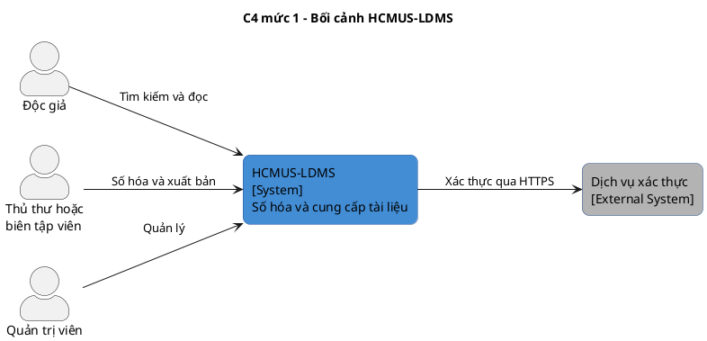
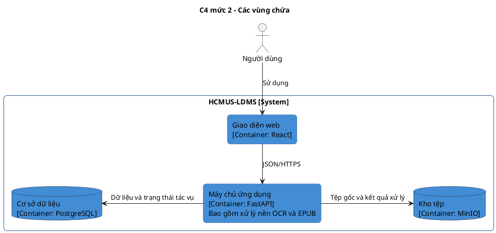
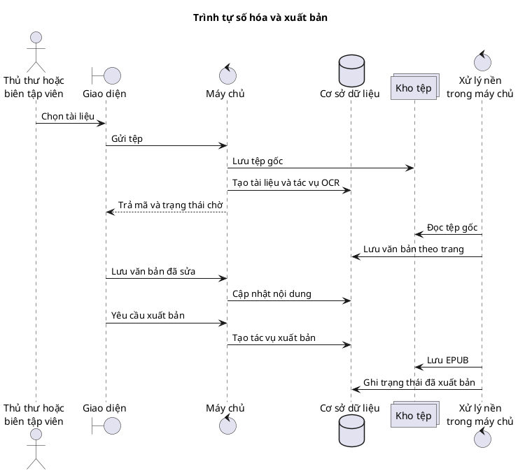
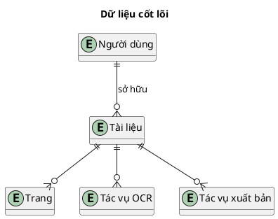

# KIẾN TRÚC PHẦN MỀM

## Hệ thống Quản lý và Số hóa Tài liệu Thư viện HCMUS (HCMUS-LDMS)

### Thông tin tài liệu

| Trường thông tin    | Nội dung                                 |
| ------------------- | ---------------------------------------- |
| Mã tài liệu         | `HCMUS-LDMS-SAD`                         |
| Tên tài liệu        | Kiến trúc phần mềm                       |
| Đơn vị thực hiện    | Nhóm Sebros                              |
| Người phụ trách     | Mạch Quốc Tấn — Đại diện nhóm Sebros     |
| Người xem xét       | Các thành viên nhóm Sebros               |
| Trạng thái          | Baseline nội bộ đã được nhóm xác nhận    |
| Thời gian thực hiện | 11 tuần                                  |
| Mục đích            | Phục vụ học tập và quản lý dự án môn học |

### Lịch sử phiên bản

| Phiên bản | Ngày       | Mô tả thay đổi                                                                                        | Người thực hiện |
| --------- | ---------- | ----------------------------------------------------------------------------------------------------- | --------------- |
| 1.0       | 21/08/2026 | Khởi tạo kiến trúc logic, công nghệ và mô hình triển khai.                                            | Mạch Quốc Tấn   |
| 2.0       | 22/08/2026 | Bổ sung vòng đời dữ liệu, xử lý tác vụ, phục hồi và mô hình phân quyền.                               | Mạch Quốc Tấn   |
| 3.0       | 22/08/2026 | Bổ sung luồng xử lý, trạng thái tài liệu và truy vết yêu cầu.                                         | Mạch Quốc Tấn   |
| 4.0       | 24/08/2026 | Viết lại theo baseline 15/6/5, đồng bộ hệ thống thực tế và loại bỏ nội dung ngoài mục đích kiến trúc. | Mạch Quốc Tấn   |
| 4.1       | 24/08/2026 | Chuẩn hóa từ ngữ tiếng Việt, giải thích thuật ngữ kỹ thuật và làm rõ các câu có thể gây mơ hồ.        | Mạch Quốc Tấn   |
| 4.2       | 24/08/2026 | Chuyển bốn sơ đồ cốt lõi sang PlantUML và rút gọn các góc nhìn trùng lặp.                             | Mạch Quốc Tấn   |
| 4.3       | 24/08/2026 | Đồng bộ xử lý nền, dữ liệu cốt lõi và cấu hình Nginx với cách triển khai thực tế.                     | Mạch Quốc Tấn   |
| 4.4       | 24/08/2026 | Loại bỏ tham chiếu tới tài liệu vận hành chưa thuộc bộ hồ sơ hiện tại.                                | Mạch Quốc Tấn   |

## Mục lục

- [1. Mục đích và phạm vi](#1-mục-đích-và-phạm-vi)
- [2. Động lực và ràng buộc kiến trúc](#2-động-lực-và-ràng-buộc-kiến-trúc)
- [3. Bối cảnh hệ thống](#3-bối-cảnh-hệ-thống)
- [4. Kiến trúc tổng thể](#4-kiến-trúc-tổng-thể)
- [5. Phân rã máy chủ theo mô-đun](#5-phân-rã-máy-chủ-theo-mô-đun)
- [6. Luồng xử lý chính](#6-luồng-xử-lý-chính)
- [7. Kiến trúc dữ liệu](#7-kiến-trúc-dữ-liệu)
- [8. Bảo mật](#8-bảo-mật)
- [9. Triển khai và vận hành](#9-triển-khai-và-vận-hành)
- [10. Quyết định và truy vết kiến trúc](#10-quyết-định-và-truy-vết-kiến-trúc)
- [11. Giới hạn và hướng mở rộng](#11-giới-hạn-và-hướng-mở-rộng)
- [12. Tài liệu tham khảo](#12-tài-liệu-tham-khảo)

---

## 1. Mục đích và phạm vi

Tài liệu mô tả cấu trúc của HCMUS-LDMS, trách nhiệm của từng thành phần, cách dữ liệu được trao đổi và các quyết định kỹ thuật chính. Tài liệu giải thích cách tổ chức hệ thống để đáp ứng **Yêu cầu phần mềm**; không thay thế **Product Backlog**, thiết kế giao diện, đặc tả giao diện lập trình ứng dụng (API) hoặc hướng dẫn vận hành.

Dự án được thực hiện trước hết để phục vụ học tập. Vì vậy, kiến trúc ưu tiên việc dễ cài đặt, dễ kiểm thử, dễ truy vết và thuận tiện phối hợp trong nhóm sáu sinh viên; khả năng vận hành ở quy mô lớn chưa phải mục tiêu của phiên bản này.

Baseline kiến trúc hỗ trợ 15 hạng mục Bắt buộc trong 11 tuần. Chức năng thuộc nhóm Nên có hoặc Có thể xem xét được bố trí trong mô-đun riêng và không được làm thay đổi luồng bắt buộc khi chưa được nhóm đưa vào phạm vi thực hiện.

## 2. Động lực và ràng buộc kiến trúc

### 2.1. Động lực

| Động lực                      | Ảnh hưởng đến kiến trúc                                                                   |
| ----------------------------- | ----------------------------------------------------------------------------------------- |
| Thời gian 11 tuần             | Chọn ứng dụng mô-đun thay vì nhiều dịch vụ độc lập.                                       |
| Nhóm sáu sinh viên            | Dùng một quy trình cài đặt và một tập công nghệ thống nhất.                               |
| Tệp và tác vụ xử lý dài       | Tách dữ liệu tệp khỏi cơ sở dữ liệu và xử lý OCR, tạo EPUB dưới dạng tác vụ nền.          |
| Nội dung có giới hạn truy cập | Kiểm tra xác thực, vai trò, quyền sở hữu và trạng thái xuất bản tại máy chủ.              |
| Yêu cầu bảo toàn tài liệu gốc | Không ghi đè tài liệu gốc; kết quả OCR và EPUB được lưu thành dữ liệu riêng.              |
| Cần tìm kiếm nội dung         | Lưu văn bản OCR trong PostgreSQL và dùng tìm kiếm toàn văn cho baseline.                  |
| Mục đích học tập              | Ưu tiên giải pháp dễ giải thích, dễ kiểm thử và có thể tái tạo trong môi trường của nhóm. |

### 2.2. Ràng buộc

- Giao diện sử dụng React và TypeScript.
- Máy chủ sử dụng FastAPI và Python.
- PostgreSQL lưu dữ liệu quan hệ và nội dung cần tìm kiếm.
- Kho tệp tương thích S3 lưu tài liệu gốc, ảnh trang và EPUB; môi trường nội bộ sử dụng MinIO.
- Tesseract thực hiện OCR; Pandoc tạo EPUB.
- Môi trường baseline có thể khởi chạy bằng Docker Compose.
- Khóa bí mật và chuỗi kết nối không được đưa vào mã nguồn hoặc giao diện.
- Công cụ tìm kiếm riêng, hàng đợi phân tán và hạ tầng vận hành quy mô lớn không thuộc baseline.

### 2.3. Thuật ngữ kỹ thuật

| Thuật ngữ      | Cách hiểu trong tài liệu                                                                                    |
| -------------- | ----------------------------------------------------------------------------------------------------------- |
| API            | Giao diện lập trình ứng dụng; tập hợp điểm truy cập để giao diện web trao đổi dữ liệu với máy chủ.          |
| OCR            | Nhận dạng ký tự quang học; chuyển chữ trong PDF hoặc ảnh quét thành văn bản có thể hiệu chỉnh.              |
| EPUB           | Định dạng sách điện tử dùng để đóng gói và hiển thị nội dung đã xuất bản.                                   |
| JWT            | Chuỗi thông tin xác thực có chữ ký, dùng để máy chủ xác định người dùng và vai trò trong thời hạn cho phép. |
| S3             | Chuẩn giao tiếp với kho tệp dạng đối tượng; MinIO cung cấp cách giao tiếp tương thích chuẩn này.            |
| JSON           | Định dạng văn bản có cấu trúc dùng để giao diện web và máy chủ trao đổi dữ liệu.                            |
| HTTP/HTTPS     | Giao thức trao đổi dữ liệu giữa trình duyệt và máy chủ; HTTPS bổ sung mã hóa trong quá trình truyền.        |
| Mô-đun         | Nhóm chức năng có cùng trách nhiệm trong một ứng dụng; không phải một dịch vụ được triển khai độc lập.      |
| Khóa đối tượng | Mã dùng để xác định vị trí của một tệp trong kho tệp; mã này độc lập với tên tệp do người dùng cung cấp.    |

## 3. Bối cảnh hệ thống

Góc nhìn C4 mức 1 cho biết ai sử dụng HCMUS-LDMS và hệ thống bên ngoài nào trao đổi dữ liệu với phần mềm. Trong sơ đồ, HCMUS-LDMS đại diện cho toàn bộ phần mềm do nhóm xây dựng. Dịch vụ xác thực bên ngoài chỉ hỗ trợ đăng nhập khi được cấu hình và không thuộc phần mềm do nhóm quản lý. Độc giả chỉ được tiếp cận tài liệu đã xuất bản trong phạm vi được phép. Đăng nhập bằng dữ liệu mô phỏng vẫn là cơ chế bắt buộc của môi trường học tập.

## 4. Kiến trúc tổng thể

Hệ thống sử dụng kiến trúc ứng dụng mô-đun gồm giao diện web, máy chủ cung cấp API, cơ sở dữ liệu và kho tệp. OCR và tạo EPUB được thực hiện dưới dạng tác vụ nền để giao diện không phải chờ cho đến khi toàn bộ quá trình hoàn tất.

Góc nhìn C4 mức 2 cho biết các ứng dụng và nơi lưu trữ có thể được triển khai hoặc vận hành riêng. “Vùng chứa” trong C4 là đơn vị chạy hoặc lưu trữ, không đồng nghĩa với Docker container.

### 4.1. Trách nhiệm các thành phần

| Thành phần              | Trách nhiệm                                                                                                                   |
| ----------------------- | ----------------------------------------------------------------------------------------------------------------------------- |
| Giao diện web           | Hiển thị đăng nhập, danh sách tài liệu, tải lên, hiệu chỉnh, tìm kiếm, đọc EPUB và trạng thái xử lý.                          |
| API                     | Tiếp nhận yêu cầu từ giao diện, kiểm tra dữ liệu, gọi chức năng nghiệp vụ và trả kết quả theo cấu trúc thống nhất.            |
| Xác thực và phân quyền  | Xác minh phiên, vai trò, quyền sở hữu và quyền truy cập tài liệu.                                                             |
| Mô-đun nghiệp vụ        | Điều phối tài liệu, OCR, hiệu chỉnh, thông tin mô tả, xuất bản, tìm kiếm và đọc.                                              |
| Xử lý nền trong máy chủ | FastAPI thực hiện OCR hoặc tạo EPUB ở nền, cập nhật trạng thái và ghi lỗi mà không cần dịch vụ xử lý riêng.                   |
| PostgreSQL              | Lưu người dùng, tài liệu, trang, thông tin mô tả, tác vụ, trạng thái và dữ liệu truy vết.                                     |
| Kho tệp                 | Lưu tài liệu gốc, ảnh trang và EPUB bằng khóa đối tượng; thông tin bí mật để truy cập kho tệp chỉ nằm trong cấu hình máy chủ. |
| Tesseract và Pandoc     | Thực hiện xử lý chuyên biệt dưới sự điều phối của bộ xử lý nền.                                                               |

### 4.2. Nguyên tắc phụ thuộc

- Giao diện chỉ giao tiếp với máy chủ qua API; không truy cập trực tiếp cơ sở dữ liệu hoặc kho tệp riêng tư.
- Lớp tiếp nhận API chuyển yêu cầu tới mô-đun nghiệp vụ; quy tắc nghiệp vụ không được đặt toàn bộ trong lớp định tuyến.
- Mô-đun nghiệp vụ đọc và ghi dữ liệu thông qua lớp truy cập dữ liệu và thành phần quản lý kho tệp.
- Xử lý nền chạy trong cùng máy chủ FastAPI bằng cơ chế tác vụ nền và sử dụng chung quy tắc nghiệp vụ, cấu trúc dữ liệu với phần tiếp nhận yêu cầu.
- Tệp được nhận diện bằng khóa đối tượng; cơ sở dữ liệu chỉ lưu thông tin quản lý và quan hệ truy vết.

## 5. Phân rã máy chủ theo mô-đun

Phần này không dùng thêm sơ đồ thành phần để tránh lặp lại góc nhìn vùng chứa. Bảng dưới đây mô tả cách máy chủ được chia thành các mô-đun nghiệp vụ, trách nhiệm của từng mô-đun và yêu cầu liên quan. Đây là cách phân chia trách nhiệm trong mã nguồn, không phải danh sách dịch vụ triển khai độc lập.

| Mô-đun             | Trách nhiệm chính                                                                                  | Yêu cầu liên quan                      |
| ------------------ | -------------------------------------------------------------------------------------------------- | -------------------------------------- |
| Danh tính và quyền | Đăng nhập, JWT, vai trò, quyền sở hữu và kiểm tra truy cập.                                        | `YC-009`, `YC-010`, `YC-014`, `YC-018` |
| Tài liệu           | Tải lên, lưu tài liệu gốc, danh sách và trạng thái tài liệu.                                       | `YC-002`, `YC-026`                     |
| OCR                | Tạo tác vụ, nhận dạng, lưu kết quả theo trang, lỗi và xử lý lại.                                   | `YC-003`, `YC-004`, `YC-022`           |
| Hiệu chỉnh         | Đọc, sửa, lưu và chuyển trang trong quá trình hiệu chỉnh.                                          | `YC-005`, `YC-006`, `YC-017`           |
| Thông tin mô tả    | Quản lý tên tài liệu, tác giả, danh mục và dữ liệu mô tả khác.                                     | `YC-011`, `YC-012`                     |
| Xuất bản           | Kiểm tra điều kiện, tạo EPUB, ghi trạng thái và cho phép người có quyền đọc bản đã xuất bản.       | `YC-007`, `YC-013`                     |
| Tìm kiếm và đọc    | Tìm kiếm toàn văn bằng PostgreSQL, lọc theo quyền, trả kết quả và cung cấp nội dung cho trình đọc. | `YC-008`, `YC-015`, `YC-016`           |
| Dữ liệu cá nhân    | Thiết lập đọc, vị trí đọc, đánh dấu và ghi chú khi hạng mục được đưa vào phạm vi.                  | `YC-019`, `YC-020`, `YC-021`           |
| Nhật ký và mở rộng | Ghi thao tác quan trọng, tạo trích dẫn và tích hợp công cụ tìm kiếm mở rộng.                       | `YC-023`, `YC-024`, `YC-025`           |

Mỗi mô-đun tập hợp các chức năng có cùng trách nhiệm trong một ứng dụng. Các mô-đun không được triển khai thành những dịch vụ riêng. Nhóm chỉ xem xét việc tách dịch vụ khi số liệu tải, nhu cầu mở rộng hoặc yêu cầu vận hành cho thấy kiến trúc hiện tại không còn phù hợp.

## 6. Luồng xử lý chính

### 6.1. Số hóa và xuất bản

Nếu tệp đã được lưu nhưng bản ghi quản lý không thể tạo, hệ thống phải ghi nhận lỗi để nhóm có thể tìm và xử lý tệp không còn liên kết với tài liệu. Nếu tác vụ bị gián đoạn, khi khởi động lại, hệ thống phải phát hiện tác vụ chưa hoàn tất và chuyển tác vụ sang trạng thái cho phép xử lý lại.

### 6.2. Tìm kiếm và đọc

1. Độc giả gửi từ khóa hoặc mở danh sách tài liệu.
2. Máy chủ xác định danh tính và phạm vi quyền truy cập.
3. PostgreSQL tìm theo thông tin mô tả và nội dung OCR.
4. Máy chủ loại bỏ tài liệu chưa xuất bản hoặc ngoài phạm vi quyền.
5. Giao diện hiển thị tên tài liệu, tác giả và đoạn nội dung liên quan đến từ khóa khi có dữ liệu.
6. Khi độc giả mở tài liệu, máy chủ kiểm tra lại quyền trước khi trả nội dung hoặc tạo liên kết có thời hạn.
7. Trình đọc Epub.js hiển thị EPUB; giao diện không cung cấp nút tải trực tiếp tệp gốc.

### 6.3. Trạng thái tài liệu và tác vụ

| Giai đoạn          | Trạng thái        | Chuyển tiếp chính                                 |
| ------------------ | ----------------- | ------------------------------------------------- |
| Tiếp nhận          | Đã tiếp nhận      | Tạo tác vụ OCR → Chờ OCR                          |
| OCR                | Chờ OCR, Đang OCR | Hoàn tất → OCR hoàn tất; lỗi → OCR thất bại       |
| Xử lý lại OCR      | OCR thất bại      | Người có quyền yêu cầu → Chờ OCR                  |
| Xuất bản           | Đang xuất bản     | Thành công → Đã xuất bản; lỗi → Xuất bản thất bại |
| Xử lý lại xuất bản | Xuất bản thất bại | Người có quyền yêu cầu → Đang xuất bản            |

Trạng thái nghiệp vụ của tài liệu và trạng thái từng tác vụ phải được phân biệt. Mỗi lần xử lý lại tăng số lần thử và giữ thông tin lỗi trước đó để truy vết.

## 7. Kiến trúc dữ liệu

### 7.1. Mô hình dữ liệu khái niệm

Sơ đồ chỉ thể hiện các thực thể dữ liệu cốt lõi thuộc baseline. Danh mục, vị trí đọc, đánh dấu và ghi chú được bổ sung vào mô hình khi các hạng mục tương ứng được nhóm đưa vào phạm vi. Ràng buộc cột, chỉ mục, khóa ngoại và thay đổi lược đồ chi tiết được quản lý trong mã nguồn và đặc tả dữ liệu.

### 7.2. Quy tắc toàn vẹn

- Mỗi trang thuộc đúng một tài liệu và có số trang duy nhất trong tài liệu đó.
- Mỗi tác vụ OCR hoặc xuất bản thuộc đúng một tài liệu và có số lần thử.
- Khóa đối tượng của tài liệu gốc và EPUB được lưu riêng; tạo EPUB không thay đổi tài liệu gốc.
- Xóa hoặc thay đổi danh mục không được làm mất nội dung tài liệu.
- Tài liệu chỉ chuyển sang đã xuất bản sau khi thông tin mô tả bắt buộc, nội dung và EPUB hợp lệ.
- Dữ liệu vị trí đọc, đánh dấu và ghi chú luôn gắn với người dùng sở hữu.

### 7.3. Phân chia nơi lưu trữ

| Nơi lưu trữ | Dữ liệu                                                                                            |
| ----------- | -------------------------------------------------------------------------------------------------- |
| PostgreSQL  | Người dùng, quyền, thông tin tài liệu, trang, văn bản OCR, trạng thái, tác vụ và dữ liệu truy vết. |
| Kho tệp     | Tài liệu gốc, ảnh theo trang và tệp EPUB.                                                          |
| Trình duyệt | Phiên giao diện và thiết lập hiển thị không nhạy cảm; không lưu khóa bí mật của máy chủ.           |

## 8. Bảo mật

### 8.1. Phạm vi kiểm soát và mức độ tin cậy

- Máy chủ không mặc nhiên tin cậy dữ liệu do trình duyệt hoặc người dùng gửi lên; mọi dữ liệu phải được kiểm tra trước khi xử lý.
- Máy chủ chịu trách nhiệm xác thực, phân quyền và kiểm tra dữ liệu.
- PostgreSQL và kho tệp chỉ được máy chủ truy cập bằng thông tin cấu hình phía máy chủ.
- Liên kết tạm thời tới tệp không thay thế việc kiểm tra quyền trước khi cấp liên kết.

### 8.2. Xác thực và phân quyền

1. Máy chủ xác minh JWT và thời hạn phiên.
2. Máy chủ xác định vai trò độc giả (`reader`), biên tập viên (`editor`) hoặc quản trị viên (`admin`).
3. Máy chủ kiểm tra hành động, tài nguyên, quyền sở hữu và trạng thái xuất bản.
4. Chỉ sau khi đạt các điều kiện trên, máy chủ mới đọc dữ liệu hoặc cấp quyền truy cập tệp.

Giao diện có thể ẩn thao tác mà người dùng không được phép thực hiện để tránh nhầm lẫn. Tuy nhiên, máy chủ vẫn phải kiểm tra quyền vì việc ẩn thao tác trên giao diện không đủ để bảo vệ hệ thống.

### 8.3. Bảo vệ dữ liệu

- Kiểm tra loại tệp, kích thước và tên tệp trước khi tiếp nhận.
- Sinh khóa đối tượng độc lập với tên tệp do người dùng cung cấp.
- Không ghi khóa bí mật, mật khẩu hoặc nội dung nhạy cảm vào mã nguồn và nhật ký.
- Không đưa tài liệu chưa xuất bản vào kết quả tìm kiếm công khai.
- Không cung cấp liên kết công khai lâu dài cho tệp riêng tư.
- Dữ liệu thử nghiệm phải được phân biệt với dữ liệu thật.

## 9. Triển khai và vận hành

### 9.1. Môi trường baseline

| Nút triển khai              | Thành phần                     | Trao đổi chính                                    |
| --------------------------- | ------------------------------ | ------------------------------------------------- |
| Thiết bị người dùng         | Trình duyệt và giao diện React | HTTP hoặc HTTPS tới máy chủ                       |
| Máy chạy Docker Compose     | FastAPI, PostgreSQL và MinIO   | Kết nối dữ liệu và trao đổi tệp trong mạng nội bộ |
| Cấu hình triển khai mở rộng | Nginx                          | Chuyển tiếp HTTP/HTTPS tới FastAPI khi được bật   |

Bảng triển khai cho biết các thành phần chạy ở đâu trong môi trường baseline. Cấu hình có thể tách giao diện và máy chủ sang các nền tảng khác, nhưng trách nhiệm và quan hệ giữa các vùng chứa vẫn giữ nguyên.

Docker Compose cung cấp FastAPI, PostgreSQL và MinIO trong môi trường phát triển. Nginx chỉ được sử dụng khi bật cấu hình triển khai tương ứng. Giao diện có thể chạy riêng bằng Vite hoặc được đóng gói cùng máy chủ web. Kiểm tra sức khỏe chỉ xác nhận thành phần sẵn sàng kết nối; không thay thế kiểm thử nghiệp vụ.

### 9.2. Cấu hình

Các nhóm cấu hình chính gồm:

- Kết nối PostgreSQL.
- Địa chỉ truy cập, vùng lưu trữ (bucket) và thông tin xác thực kho tệp.
- Địa chỉ giao diện được phép gửi yêu cầu đến API.
- Ngôn ngữ, độ phân giải và thời hạn xử lý OCR.
- Thời hạn tạo EPUB.
- Khóa ký JWT, thời hạn phiên và chế độ xác thực.
- Cấu hình Google OAuth 2.0 khi chức năng được bật.

Môi trường học tập có thể dùng giá trị mô phỏng. Mọi môi trường chia sẻ hoặc mở rộng phải thay các giá trị mặc định, quản lý bí mật riêng và tắt cơ chế đăng nhập mô phỏng khi không còn phù hợp.

### 9.3. Theo dõi và phục hồi

- API cung cấp kiểm tra sức khỏe và số liệu kỹ thuật cơ bản.
- Lỗi tác vụ lưu trạng thái và thông báo phù hợp để người có quyền theo dõi.
- Khi máy chủ khởi động, tác vụ đang xử lý bị gián đoạn phải được đánh dấu thất bại hoặc đưa về trạng thái có thể xử lý lại.
- Khôi phục dữ liệu cần xét đồng thời PostgreSQL và kho tệp để tránh mất quan hệ giữa bản ghi và đối tượng.
- Ngưỡng cảnh báo, chu kỳ sao lưu và mục tiêu khôi phục chỉ được chốt khi có môi trường vận hành thực tế.

### 9.4. Môi trường đám mây

Giao diện, máy chủ, PostgreSQL và kho tệp có thể được triển khai trên các dịch vụ đám mây phù hợp. Đây là phương án triển khai thay thế và không làm thay đổi trách nhiệm của các thành phần hoặc quy tắc bảo mật. Một môi trường chỉ được xem là sẵn sàng sử dụng sau khi cấu hình đúng, chuyển dữ liệu thành công, các thành phần hoạt động, các luồng chính vượt qua kiểm thử và thông tin bí mật được bảo vệ.

## 10. Quyết định và truy vết kiến trúc

| Quyết định kiến trúc                              | Lý do chính                                                                    | Yêu cầu liên quan                                |
| ------------------------------------------------- | ------------------------------------------------------------------------------ | ------------------------------------------------ |
| Ứng dụng mô-đun thay vì nhiều dịch vụ độc lập     | Phù hợp thời gian, quy mô nhóm và khả năng kiểm thử.                           | `YC-001`, `YCP-09`, `YCP-10`                     |
| React cho giao diện và FastAPI cho máy chủ        | Phù hợp năng lực nhóm và tách rõ giao diện với nghiệp vụ.                      | `YC-001`, `YC-005`, `YC-008`, `YC-026`           |
| PostgreSQL cho dữ liệu và tìm kiếm trong baseline | Giảm số thành phần, hỗ trợ dữ liệu quan hệ và tìm kiếm toàn văn.               | `YC-011`, `YC-012`, `YC-015`, `YC-016`           |
| Kho tệp tương thích S3 cho tài liệu và EPUB       | Tách tệp lớn khỏi dữ liệu quản lý và hỗ trợ truy cập có hạn.                   | `YC-002`, `YC-007`, `YC-014`, `YCP-03`, `YCP-04` |
| OCR và tạo EPUB dưới dạng tác vụ nền              | Giúp API trả trạng thái sớm mà không chờ thao tác dài hoàn tất.                | `YC-003`, `YC-007`, `YC-022`, `YCP-07`           |
| JWT và kiểm tra quyền tại máy chủ                 | Bảo đảm quyền vẫn được kiểm tra khi người dùng bỏ qua hoặc thay đổi giao diện. | `YC-009`, `YC-010`, `YC-014`, `YC-018`, `YCP-01` |
| Bảo toàn tài liệu gốc                             | Cho phép đối chiếu, xử lý lại và phục hồi khi có lỗi.                          | `YC-002`, `YC-004`, `YC-005`, `YC-022`, `YCP-04` |
| Mã yêu cầu dùng xuyên suốt tài liệu và kiểm thử   | Hỗ trợ truy vết phạm vi, kết quả và thay đổi.                                  | `YCP-10`                                         |

Chi tiết lý do, phương án thay thế và quyết định thay đổi được trình bày trong tài liệu **Nhật ký quyết định kiến trúc**.

## 11. Giới hạn và hướng mở rộng

### 11.1. Giới hạn hiện tại

- Xử lý nền chạy trong tiến trình FastAPI; hệ thống chưa có dịch vụ xử lý hoặc hàng đợi riêng có khả năng lưu và khôi phục tác vụ độc lập.
- PostgreSQL là công cụ tìm kiếm trong baseline; nhóm chưa cam kết khả năng đáp ứng khi khối lượng dữ liệu lớn.
- Không khẳng định độ chính xác OCR hoặc hiệu năng nếu chưa có dữ liệu đo.
- Liên kết tạm thời và việc ẩn nút tải không thể ngăn tuyệt đối việc sao chép nội dung đã hiển thị.
- Môi trường Docker Compose phù hợp phát triển và kiểm thử, không tự động đáp ứng yêu cầu vận hành thực tế.

### 11.2. Điều kiện mở rộng

Chỉ xem xét thay đổi kiến trúc khi có dữ liệu hoặc yêu cầu mới, ví dụ:

- Tách bộ xử lý và hàng đợi khi tải đồng thời hoặc nhu cầu phục hồi vượt khả năng mô hình hiện tại.
- Dùng công cụ tìm kiếm riêng khi số liệu chứng minh PostgreSQL không đáp ứng.
- Bổ sung lưu trữ phiên bản nội dung khi cần lịch sử hiệu chỉnh chi tiết.
- Bổ sung sao lưu, giám sát và mục tiêu khôi phục khi có môi trường vận hành thực tế.
- Tích hợp hệ thống danh tính hoặc kho thư viện bên ngoài khi dự án được mở rộng.

Mọi mở rộng phải được nhóm xác nhận, cập nhật baseline và truy vết tới **Yêu cầu phần mềm**, **Product Backlog**, **Kế hoạch kiểm thử** cùng các tài liệu bị ảnh hưởng.

## 12. Tài liệu tham khảo

- Đề xuất dự án.
- Viễn cảnh và phạm vi.
- Ủy nhiệm dự án.
- Yêu cầu phần mềm.
- Product Backlog.
- Nghiên cứu tính khả thi.
- Bản mô tả công việc.
- Kế hoạch dự án.
- Kế hoạch kiểm thử.
- Kế hoạch quản lý chất lượng.
- Kế hoạch quản lý rủi ro.
- Nhật ký dự án.
- Nhật ký quyết định kiến trúc.
