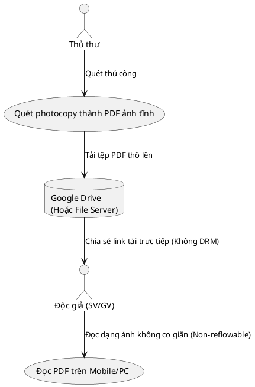
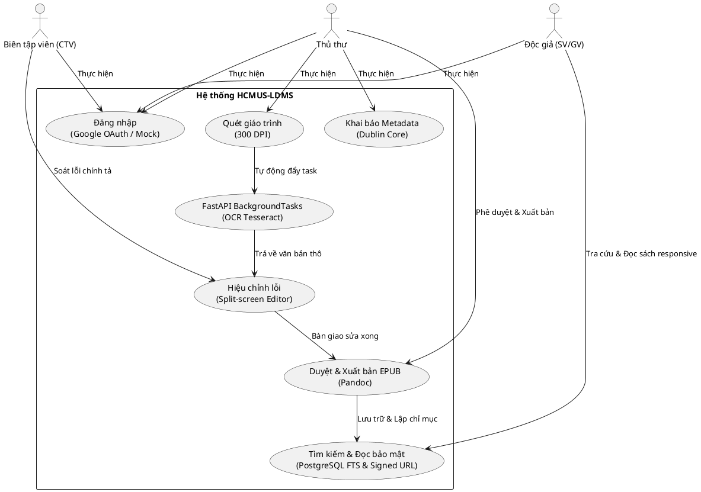

# TẦM NHÌN VÀ PHẠM VI DỰ ÁN (PROJECT VISION & SCOPE)

## Hệ thống Quản lý và Số hóa Tài liệu Thư viện HCMUS (HCMUS-LDMS)

### THÔNG TIN TÀI LIỆU (DOCUMENT CONTROL)

| Trường thông tin (Field)                   | Nội dung đặc tả (Description)                               |
| :----------------------------------------- | :---------------------------------------------------------- |
| **Mã tài liệu (Document ID)**              | `HCMUS-LDMS-VSD`                                            |
| **Tên tài liệu (Document Title)**          | Tầm nhìn và Phạm vi dự án (Project Vision & Scope Document) |
| **Dự án (Project Name)**                   | HCMUS-LDMS                                                  |
| **Đơn vị soạn thảo (Author/Organization)** | Thư viện & Phòng Công nghệ Thông tin - HCMUS                |
| **Người xem xét (Reviewer)**               | Trưởng phòng CNTT & Giám đốc Thư viện                       |
| **Người phê duyệt (Approver)**             | Ban Giám hiệu Trường ĐH Khoa học Tự nhiên                   |
| **Cấp độ bảo mật (Security Class)**        | Internal (Nội bộ trường)                                    |
| **Trạng thái tài liệu (Status)**           | Under Review (Đang thẩm định)                               |

### LỊCH SỬ PHIÊN BẢN (REVISION HISTORY)

| Phiên bản (Version) | Ngày phát hành (Date) | Mô tả thay đổi (Description of Change)                                                                                                                       | Người thực hiện (Author) |
| :-----------------: | :-------------------: | :----------------------------------------------------------------------------------------------------------------------------------------------------------- | :----------------------: |
|         1.0         |      07/07/2026       | Khởi tạo dự thảo tầm nhìn và phạm vi ban đầu (v1.0).                                                                                                         |      Mạch Quốc Tấn       |
|         2.0         |      14/07/2026       | Cập nhật Domain Model, Glossary, As-is/To-be; chuẩn hóa và Việt hóa theo mẫu IEEE/RUP.                                                                       |      Mạch Quốc Tấn       |
|         3.0         |      17/07/2026       | Bổ sung bước Đăng nhập To-Be, tách riêng vai trò/workflow của Thủ thư và Biên tập viên, đồng bộ tech stack mới và thêm bảng đối chuẩn Workflow Benchmarking. |    Ân Tiến Nguyên An     |

---

## Mục lục

---

## 1. Giới thiệu

Tài liệu Tầm nhìn và Phạm vi này đặc tả hệ thống **HCMUS-LDMS** (Library Document Management & Digitization System). Hệ thống hướng tới việc xây dựng một quy trình số hóa tài liệu học thuật tự động hóa, chuyển đổi từ các trang giáo trình in sang định dạng sách điện tử responsive chuẩn EPUB 3.0, đáp ứng trải nghiệm đọc di động mọi lúc mọi nơi cho sinh viên và bảo vệ bản quyền số của nhà trường.

### 1.1 Tài liệu tham khảo

- Đề xuất dự án HCMUS-LDMS (Project Proposal).
- Luật Sở hữu trí tuệ Việt Nam số 50/2005/QH11 và Luật sửa đổi, bổ sung năm 2022.
- Chuẩn mô tả siêu dữ liệu Dublin Core Metadata Element Set (ISO 15836).
- Báo cáo khảo sát trải nghiệm học liệu số của sinh viên HCMUS năm 2025.

---

## 2. Định vị sản phẩm

### 2.1 Phát biểu bài toán

Khảo sát thực tế tại Thư viện HCMUS cho thấy các nút thắt sau:

| Thuộc tính (Attribute)                           | Nội dung chi tiết (Details)                                                                                                                                                                          |
| :----------------------------------------------- | :--------------------------------------------------------------------------------------------------------------------------------------------------------------------------------------------------- |
| **Vấn đề (The problem of)**                      | Nguồn học liệu giấy bị hao mòn vật lý; kho lưu trữ kệ sách Quận 5 bị quá tải diện tích; sinh viên cơ sở Thủ Đức khó tiếp cận sách độc bản; tài liệu PDF scan hiện tại không responsive trên di động. |
| **Ảnh hưởng đến (Affects)**                      | Độc giả (Sinh viên, Giảng viên) gặp rào cản địa lý và giảm chất lượng học tập; Thủ thư tốn nhiều công sức bảo trì và xử lý mượn trả thủ công.                                                        |
| **Hậu quả (The impact of which is)**             | Tỷ lệ tiếp cận tri thức bị hạn chế; rủi ro rách hỏng học liệu gốc tăng cao; thư viện thiếu không gian cải tạo thành phòng tự học thông minh.                                                         |
| **Giải pháp thành công (A successful solution)** | Tự động hóa quy trình quét tài liệu sang EPUB 3.0 reflowable; tích hợp công cụ kiểm duyệt OCR Split-screen; bảo mật DRM Signed URL và tra cứu Elasticsearch dưới 3 giây.                             |

### 2.2 Phát biểu định vị sản phẩm

- **Dành cho:** Sinh viên, giảng viên và cán bộ thư viện trường HCMUS.
- **Những người:** Đang gặp khó khăn trong việc tra cứu, bảo quản giáo trình giấy độc bản và trải nghiệm đọc số kém tiện ích trên thiết bị di động.
- **Sản phẩm HCMUS-LDMS là:** Hệ thống web nội bộ số hóa và quản lý tài liệu học thuật tập trung.
- **Mang lại:** Khả năng tự động hóa luồng chuyển đổi sách giấy thành sách điện tử responsive (EPUB 3.0 reflowable), hỗ trợ tra cứu toàn văn siêu tốc bằng Elasticsearch và trình xem web đọc sách bảo mật cao.
- **Khác với:** Việc lưu trữ file scan PDF ảnh tĩnh khó đọc trên di động và hệ thống thư viện truyền thống OPAC cũ.
- **Chúng tôi:** Tích hợp quy trình số hóa khép kín với các module sửa lỗi OCR trực quan và cơ chế kiểm soát DRM Signed URL bảo vệ bản quyền số học liệu của trường.

---

### 2.3 Phân tích Quy trình Hiện tại (As-Is) và Quy trình Tương lai (To-Be)

#### 2.3.1 Quy trình vận hành hiện tại (As-Is Workflow) và các Vấn đề cốt lõi

Trong mô hình vận hành hiện nay của Thư viện HCMUS, việc số hóa tài liệu học thuật diễn ra hoàn toàn thủ công và rời rạc, cụ thể:

##### 2.3.1.1 Quy trình vận hành As-Is đối với Thủ thư

1. **Tiếp nhận & Lưu trữ vật lý thô sơ:** Thủ thư tiếp nhận sách giấy từ các khoa gửi lên, xếp trực tiếp lên các kệ sách lưu trữ vật lý mà không có quy trình đánh giá hiện trạng hay phòng chống ẩm mốc chuyên sâu.

2. **Quét tài liệu thủ công bằng máy photocopy:** Khi nhận được yêu cầu số hóa phục vụ giảng dạy, thủ thư mang sách giáo trình đến máy photocopy văn phòng thông thường để quét thủ công từng trang thành file PDF dạng ảnh quét tĩnh (Image-only PDF).

3. **Đăng tải bừa bãi không bảo mật:** Các tệp PDF thô này được upload lên các thư mục chia sẻ công cộng của thư viện hoặc lưu trực tiếp trên Google Drive cá nhân của thủ thư, hoàn toàn không được phân quyền truy cập an toàn hay mã hóa dữ liệu.

##### 2.3.1.2 Quy trình vận hành As-Is đối với Sinh viên / Độc giả

1. **Tra cứu mã sách thủ công:** Sinh viên phải tra cứu mã sách trên hệ thống OPAC cũ của thư viện, sau đó đi bộ đến tận các kệ sách vật lý tại cơ sở Quận 5 hoặc Thủ Đức để tìm sách giấy. Nếu sách đã bị mượn hết, sinh viên phải chờ đợi rất lâu.

2. **Sao chép học liệu thủ công bên ngoài trường:** Đối với các giáo trình độc bản giới hạn mượn về nhà, sinh viên bắt buộc phải mang sách đến các cửa hàng photocopy dịch vụ bên ngoài khuôn viên trường để photocopy cả cuốn hoặc chụp ảnh lại từng trang bằng điện thoại cá nhân để mang về tự học.

3. **Đọc và ghi chú học tập thủ công:** Sinh viên tự học bằng cách lật mở các trang tài liệu photocopy giấy hoặc phóng to ảnh chụp từng trang trên điện thoại di động. Việc tô sáng (highlight) phải dùng bút dạ quang trực tiếp lên giấy, rất khó quản lý, hệ thống hóa thông tin và không thể tìm kiếm nhanh từ khóa nội dung khi ôn thi.

**Các vấn đề cốt lõi (Pain Points) từ quy trình As-Is:**

1. **Vi phạm Bản quyền nghiêm trọng (Bảo mật DRM bằng không):** Do phân phối qua Google Drive hoặc link tải trực tiếp, nhà trường hoàn toàn không kiểm soát được điểm đến của tài liệu. Học viên dễ dàng phát tán các file PDF giáo trình độc quyền của HCMUS lên mạng xã hội hoặc các diễn đàn chia sẻ tài liệu công cộng, vi phạm nghiêm trọng Luật sở hữu trí tuệ và gây thất thoát tài sản trí tuệ của nhà trường.

2. **Trải nghiệm đọc kém (Không responsive trên di động):** Tài liệu PDF scan thực chất là một chuỗi ảnh tĩnh lớn. Khi đọc trên điện thoại hoặc máy tính bảng, sinh viên phải liên tục phóng to (zoom), kéo màn hình qua trái qua phải để đọc từng dòng chữ. Điều này gây mỏi mắt và ức chế cho người đọc trong thời gian dài.

3. **Mất khả năng tra cứu (Không tìm kiếm được nội dung):** Vì tài liệu là ảnh quét thô và không được chạy nhận dạng ký tự OCR, sinh viên không thể sử dụng chức năng tìm kiếm nhanh từ khóa (`Ctrl + F`) để tra cứu thông tin hay định vị định nghĩa, công thức cụ thể bên trong giáo trình.

4. **Không có hệ thống quản lý siêu dữ liệu chuẩn hóa:** Các tệp tin được đặt tên tùy tiện (ví dụ: `giao_trinh_toan_A_chuan.pdf`), thiếu hoàn toàn cấu trúc siêu dữ liệu chuẩn (như Dublin Core) để phân loại theo môn học, tác giả hay khoa ngành khoa học, khiến việc quản lý thủ công của thủ thư cực kỳ vất vả.

---

#### 2.3.2 Đề xuất Quy trình vận hành tương lai (To-Be Workflow) và các Tính năng mới

Để giải quyết triệt để 4 vấn đề lớn trên, HCMUS-LDMS đề xuất một quy trình số hóa tự động hóa khép kín có sự hỗ trợ của công nghệ AI và mô hình giám sát chất lượng con người (Human-in-the-loop):

#### 2.3.3 Quy trình vận hành To-Be chi tiết dành cho Thủ thư và Biên tập viên

Quy trình số hóa khép kín được tổ chức phân cấp rõ rệt nhằm phân tách trách nhiệm giữa cán bộ quản lý (Thủ thư) và nhân sự tác nghiệp (Biên tập viên/Sinh viên CTV):

##### A. Phân đoạn Số hóa & Chuẩn bị (Trách nhiệm của Thủ thư)

1. **Tiếp nhận tài liệu thủ công & Bảo quản vật lý:**
   - _Mô tả:_ Thủ thư tiếp nhận giáo trình, sách cổ từ các khoa. Kiểm tra hiện trạng, gán số phân loại tạm thời để định danh vật lý, và lưu kho bảo quản chuyên dụng.
2. **Số hóa giáo trình vật lý (Scan chữ V):**
   - _Mô tả:_ Thủ thư sử dụng máy quét chuyên dụng dạng chữ V quét sách thành file PDF/ảnh 300 DPI tiêu chuẩn, được tự động canh chỉnh thẳng hàng và tăng độ tương phản.
3. **Đăng nhập hệ thống & Tải lên tệp scan:**
   - _Mô tả:_ Thủ thư đăng nhập dashboard qua Google OAuth 2.0 (tài khoản `@hcmus.edu.vn`), thực hiện upload file scan gốc lên hệ thống (lưu vào MinIO Storage).
4. **Khai báo thông tin siêu dữ liệu (Metadata):**
   - _Mô tả:_ Thủ thư nhập các trường thông tin chuẩn hóa Dublin Core (Tên sách, Tác giả, Nhà xuất bản, v.v.) lưu trữ trực tiếp vào CSDL PostgreSQL.
5. **Kích hoạt tiến trình OCR tự động:**
   - _Mô tả:_ Thủ thư kích hoạt tác vụ OCR. Hệ thống tự động đẩy file vào xử lý nền `FastAPI BackgroundTasks` bằng engine Tesseract OCR để bóc tách văn bản thô theo từng trang, sau đó phân công tài liệu cho Biên tập viên.

##### B. Phân đoạn Hiệu chỉnh & Soát lỗi (Trách nhiệm của Biên tập viên)

6. **Đăng nhập Workspace & Nhận nhiệm vụ:**
   - _Mô tả:_ Biên tập viên (BTV/Sinh viên CTV) đăng nhập hệ thống (bằng tài khoản Google trường hoặc Mock Auth), truy cập vào Workspace cá nhân để nhận danh sách tài liệu/trang được phân công soát lỗi.
7. **Hiệu chỉnh lỗi chính tả (Giao diện Split-screen):**
   - _Mô tả:_ BTV sử dụng màn hình chia đôi (ảnh scan bên trái, văn bản OCR bên phải) để soát sửa lỗi nhận dạng sai, định dạng tiêu đề (H1, H2, H3) và chèn lại các hình ảnh minh họa cần thiết. Sau khi hoàn tất, BTV nhấn **"Gửi yêu cầu phê duyệt"** để chuyển trạng thái tài liệu sang "Chờ duyệt".

##### C. Phân đoạn Kiểm duyệt & Xuất bản (Trách nhiệm của Thủ thư)

8. **Kiểm duyệt chất lượng & Phê duyệt xuất bản:**
   - _Mô tả:_ Thủ thư đăng nhập lại dashboard, mở danh sách tài liệu "Chờ duyệt", thực hiện kiểm tra ngẫu nhiên chất lượng soát lỗi của BTV. Nếu đạt yêu cầu, Thủ thư nhấn nút **"Phê duyệt xuất bản"**.
9. **Biên dịch tự động & Lập chỉ mục:**
   - _Mô tả:_ Hệ thống gọi Pandoc biên dịch tự động văn bản đã duyệt sang chuẩn EPUB 3.0 reflowable, đẩy lên MinIO Storage, cập nhật trạng thái "Published" lên PostgreSQL và cập nhật nội dung chữ vào PostgreSQL Full-Text Search.

---

#### 2.3.4 Quy trình vận hành To-Be chi tiết dành cho Độc giả và Sinh viên

Quy trình tra cứu học liệu số hóa của sinh viên được thiết kế thông minh, trực quan và tối đa hóa trải nghiệm đọc:

1. **Đăng nhập hệ thống (Google OAuth 2.0 / Mock Auth):**
   - _Mô tả:_ Sinh viên truy cập vào HCMUS-LDMS Web Portal, thực hiện đăng nhập bằng tài khoản Google trường (@hcmus.edu.vn) hoặc Mock Auth (trong môi trường phát triển). Hệ thống tự động xác thực danh tính để phân quyền tương ứng.
2. **Tìm kiếm toàn văn nâng cao (PostgreSQL FTS):**
   - _Mô tả:_ Sinh viên nhập từ khóa cần tìm kiếm. Hệ thống sử dụng PostgreSQL Full-Text Search quét toàn bộ cơ sở dữ liệu nội dung sách, trả về các kết quả có chứa từ khóa đó (phản hồi dưới 3 giây). Sinh viên có thể lọc kết quả theo cây danh mục môn học hoặc tên giảng viên biên soạn.
3. **Thẩm định phân quyền & Cấp quyền đọc bảo mật (Signed URL):**
   - _Mô tả:_ Khi sinh viên chọn một cuốn sách để đọc, backend kiểm tra phân quyền RBAC (Role-Based Access Control). Nếu hợp lệ, backend FastAPI gọi MinIO sinh một đường dẫn Signed URL giới hạn thời hạn hiệu lực tối đa là **15 phút**.
4. **Đọc sách responsive thông minh (Epub.js Web Reader):**
   - _Mô tả:_ Trình đọc Web Reader dựa trên Epub.js tải tệp EPUB bằng Signed URL được cấp và hiển thị dạng Reflowable (tự co giãn vừa vặn màn hình). Sinh viên có thể tùy biến font chữ, tăng giảm kích thước chữ, chuyển chế độ nền đọc ban đêm hoặc Sepia.
5. **Tương tác trực quan & Lưu trữ cá nhân:**
   - _Mô tả:_ Sinh viên bôi đen văn bản để tô sáng (Highlight), thêm các ghi chú học tập cá nhân (Notes) hoặc đánh dấu trang (Bookmark).
6. **Sinh trích dẫn tự động (Auto Citation):**
   - _Mô tả:_ Sinh viên bấm chọn "Trích dẫn" để hệ thống tự động biên soạn và định dạng chuỗi trích dẫn chuẩn khoa học (APA, IEEE) phục vụ viết luận văn hay báo cáo.

**Tóm tắt các tính năng mới phục vụ tương lai:**

- **Bảo mật DRM & Signed URL:** Chống tải lậu file sách, bảo vệ tối đa bản quyền tài liệu của trường.

- **Đọc sách responsive EPUB 3.0 Reflowable:** Tự động co giãn cỡ chữ, căn chỉnh bố cục vừa vặn với mọi màn hình thiết bị di động của sinh viên.

- **Tìm kiếm toàn văn Elasticsearch:** Sinh viên tìm kiếm từ khóa chính xác đến từng trang sách bất kỳ chỉ trong vài giây.

- **Giao diện biên tập Split-screen:** Tăng năng suất soát lỗi chính tả của thủ thư lên 60% nhờ quy trình human-in-the-loop đối chiếu ảnh-văn bản trực quan.

---

## 3. Mô tả các bên liên quan và Người dùng

### 3.1 Tóm tắt về các bên liên quan

- **Ban Giám hiệu nhà trường:** Người phê duyệt dự án, cung cấp ngân sách CapEx/OpEx (dưới 100M VNĐ) và ký duyệt chủ trương số hóa.
- **Ban Giám đoàn Thư viện:** Người bảo trợ nghiệp vụ, đưa ra yêu cầu kiểm soát chất lượng số hóa và giám sát bản quyền học liệu.
- **Phòng Công nghệ Thông tin:** Đơn vị phát triển hệ thống, chịu trách nhiệm vận hành hạ tầng máy chủ ảo hóa VMware vSphere và bảo mật.

### 3.2 Tóm tắt về người dùng

- **Độc giả (Reader - Sinh viên/Giảng viên):** Người thụ hưởng cuối cùng, thực hiện tra cứu toàn văn, hiển thị vị trí vật lý sách giấy và đọc sách responsive, lưu bookmark, highlight.
- **Thủ thư (Librarian):** Nhân sự chính thức của thư viện, chịu trách nhiệm tiếp nhận, quét sách chữ V, nhập metadata, kiểm duyệt chất lượng soát lỗi, và thực hiện phê duyệt xuất bản (Publish) chính thức lên hệ thống.
- **Biên tập viên (Editor - Sinh viên CTV):** Nhân sự cộng tác viên bán thời gian, thực hiện hiệu chỉnh lỗi chính tả thô của văn bản OCR trên giao diện Split-screen của các trang sách được phân công.
- **Quản trị viên (Admin):** Thiết lập tài khoản, phân quyền quản trị nhóm người dùng, quản lý cây danh mục và nhãn metadata.

### 3.3 Môi trường người dùng

- **Thủ thư/Biên tập viên/Admin:** Thao tác trên máy tính để bàn (PC/Laptop) tại văn phòng thư viện hoặc các máy trạm số hóa kết nối mạng nội bộ.
- **Sinh viên/Giảng viên:** Truy cập Web Portal từ xa qua kết nối Internet/Intranet trên mọi thiết bị di động (Smartphone, Tablet) hoặc laptop.

### 3.4 Tóm tắt nhu cầu cốt lõi của các bên liên quan hoặc Người dùng

| Người dùng (User) | Nỗi đau cốt lõi (Core Need)                                                          | Tính năng đáp ứng (Feature Response)                                         |
| :---------------- | :----------------------------------------------------------------------------------- | :--------------------------------------------------------------------------- |
| **Sinh viên**     | Đọc giáo trình trên di động không cần zoom; tra cứu nhanh nội dung bên trong sách.   | Đọc EPUB 3.0 responsive; PostgreSQL FTS dưới 3 giây.                         |
| **Thủ thư**       | Quản lý quy trình số hóa, duyệt chất lượng sách trước khi xuất bản nhanh chóng.      | Dashboard quản lý, kiểm duyệt chất lượng và nút phê duyệt xuất bản một chạm. |
| **Biên tập viên** | Hiệu chỉnh lỗi chính tả OCR thô dễ dàng mà không bị nhầm lẫn dòng.                   | Trình soạn thảo Split-screen đối chiếu ảnh-văn bản trực quan.                |
| **Giảng viên**    | Bảo vệ bản quyền giáo trình tự biên soạn, tránh bị sao chép hoặc phát tán trái phép. | Bảo mật DRM: Signed URL MinIO 15 phút; chặn chuột phải copy, in ấn.          |
| **BGĐ Thư viện**  | Thu hồi diện tích kho kệ vật lý để nâng cấp phòng tự học.                            | Số hóa toàn phần 500 giáo trình cốt lõi giai đoạn MVP.                       |

### 3.5 Các phương án thay thế và Đối thủ cạnh tranh

- **Các giải pháp thương mại (như Lạc Việt Vebrary, DSpace):** Chi phí triển khai lớn (vượt quá ngân sách 100M VNĐ), khó tùy biến và không tích hợp sẵn cơ chế soát lỗi OCR tiếng Việt Split-screen.
- **Phương án kết hợp công cụ có sẵn (Abbyy FineReader + Google Drive):** Rời rạc, tốn thời gian thao tác thủ công, và đặc biệt là rủi ro rò rỉ file sách gốc rất cao do Google Drive không hỗ trợ bảo mật DRM chặt chẽ.

### 3.6 So sánh đối chuẩn quy trình nghiệp vụ (Workflow Benchmarking)

Để làm rõ sự khác biệt và tối ưu hóa của quy trình nghiệp vụ đề xuất, bảng dưới đây đối chiếu chi tiết luồng vận hành của HCMUS-LDMS với 3 phương án còn lại:

| Tiêu chí đối chiếu                       | Quy trình thủ công hiện tại (As-Is)                                                  | Kết hợp công cụ rời rạc (Abbyy + Drive)                                                                 | Giải pháp thương mại đối thủ (Lạc Việt/DSpace)                                     | Giải pháp đề xuất (HCMUS-LDMS)                                                                                         |
| :--------------------------------------- | :----------------------------------------------------------------------------------- | :------------------------------------------------------------------------------------------------------ | :--------------------------------------------------------------------------------- | :--------------------------------------------------------------------------------------------------------------------- |
| **1. Quét sách & Nhập Metadata**         | Photocopy thô $\rightarrow$ Tệp PDF tĩnh, đặt tên tùy tiện, không có metadata chuẩn. | Scan máy VP $\rightarrow$ Upload thủ công. Không hỗ trợ Dublin Core.                                    | Quét thủ công $\rightarrow$ Nhập metadata trên module quản trị cồng kềnh.          | Máy scan chữ V không tháo gáy $\rightarrow$ Tự động đẩy file $\rightarrow$ Nhập Dublin Core nhanh.                     |
| **2. Nhận dạng & Soát lỗi OCR**          | Không có (Giữ nguyên tệp ảnh quét tĩnh).                                             | Chạy OCR offline bằng phần mềm Abbyy $\rightarrow$ Xuất text $\rightarrow$ Soát lỗi trên Word thủ công. | Không tích hợp sẵn engine OCR tiếng Việt chuyên sâu hoặc khó hiệu chỉnh lỗi thô.   | Engine AI Tesseract chạy ngầm qua BackgroundTasks $\rightarrow$ Sửa lỗi nhanh trên **Split-screen Workspace** cho BTV. |
| **3. Đóng gói & Định dạng đầu ra**       | File PDF scan ảnh tĩnh cực nặng, không co giãn chữ được.                             | Thủ thư tự dùng phần mềm Calibre để convert sang EPUB thủ công (dễ lỗi font, vỡ ảnh).                   | Thường chỉ lưu trữ file PDF gốc hoặc EPUB tĩnh, không tối ưu hiển thị động.        | **Pandoc** tự động biên dịch sang **EPUB 3.0 reflowable** chuẩn hóa chỉ bằng 1 nút nhấn.                               |
| **4. Tìm kiếm & Tra cứu**                | Tra mã sách trên OPAC $\rightarrow$ Phải tìm sách giấy trực tiếp tại kệ.             | Tìm file theo tên tệp trên Google Drive (không tìm được nội dung bên trong).                            | Tìm kiếm cơ bản hoặc qua Elasticsearch (yêu cầu hạ tầng lớn, đắt đỏ).              | **PostgreSQL Full-Text Search (FTS)** tìm kiếm toàn văn siêu tốc dưới 3 giây trực tiếp trong database.                 |
| **5. Bảo mật & Chống tải lậu (DRM)**     | Không bảo mật (chia sẻ link trực tiếp hoặc photocopy giấy tự do).                    | Google Drive không chặn được tải tệp gốc, dễ bị sinh viên copy và phát tán link công cộng.              | Chặn copy cơ bản nhưng thường phân phối cả tệp PDF gốc, dễ bị cào dữ liệu qua API. | **MinIO Signed URL (hết hạn 15 phút)**, chặn chuột phải, phím tắt `Ctrl+C`/`Ctrl+P` bảo vệ bản quyền tuyệt đối.        |
| **6. Nỗ lực vận hành (Manual Overhead)** | **Rất cao** (100% thủ công từ tra cứu, mượn trả đến in ấn).                          | **Rất cao** (Tốn 2-3 giờ/cuốn cho việc convert, sửa lỗi rời rạc và gửi email).                          | **Trung bình** (Quy trình đóng, thủ thư phải tự làm nhiều bước nghiệp vụ).         | **Rất thấp** (Phân rã rõ ràng: BTV chỉ soát lỗi, Thủ thư duyệt xuất bản 1-click).                                      |

---

## 4. Tổng quan sản phẩm

### 4.1 Góc nhìn sản phẩm

HCMUS-LDMS là hệ thống được phát triển theo mô hình Modular Monolith độc lập nhằm tối ưu chi phí hạ tầng. Hệ thống tích hợp trực tiếp với các dịch vụ sẵn có của nhà trường bao gồm cụm máy chủ ảo hóa VMware vSphere, xác thực thông qua tài khoản Google trường (Google OAuth 2.0), cơ sở dữ liệu PostgreSQL (lưu trữ và FTS), và hệ thống lưu trữ MinIO Storage.

### 4.2 Các giả định và Sự phụ thuộc

- **Giả định:** Luật SHTT Việt Nam cho phép số hóa phục vụ nghiên cứu nội bộ phi thương mại; tỷ lệ nhận dạng chữ OCR đạt trung bình >= 85% với các tài liệu in rõ nét.
- **Phụ thuộc:** Tiến độ dự án phụ thuộc vào năng suất vận hành máy scan chữ V của con người.

---

## 5. Các tính năng của sản phẩm

### 5.1 Tính năng chính (MVP)

- **Đăng nhập Google OAuth 2.0 / Mock Auth:** Xác thực người dùng qua tài khoản Google trường và phân quyền truy cập theo vai trò.
- **Quản lý tải lên (Scan Upload):** Cho phép thủ thư tải lên tệp ảnh thô hoặc PDF scan sách gốc.
- **Nhận dạng ký tự tự động (OCR Pipeline):** FastAPI BackgroundTasks xử lý bất đồng bộ gọi Tesseract OCR tiếng Việt.
- **Biên tập Split-screen:** Màn hình chia đôi đối so ảnh gốc và văn bản OCR để sửa lỗi thô.
- **Đóng gói EPUB tự động:** Biên dịch markdown sau hiệu chỉnh sang chuẩn EPUB 3.0 reflowable bằng Pandoc.
- **Tra cứu PostgreSQL FTS:** Tìm kiếm toàn văn nhanh chóng và chỉ ra vị trí vật lý của sách giấy tại kho kệ.
- **Trình đọc Web Reader bảo mật:** Epub.js Reader hiển thị sách dạng HTML không cho tải tệp gốc, tích hợp MinIO Signed URL (DRM).

### 5.2 Tính năng mở rộng

- **Tùy chỉnh giao diện đọc:** Cho phép độc giả đổi font chữ (Roboto, OpenDyslexic) và nền (Dark/Sepia).
- **Đánh dấu trang & Highlight:** Lưu vết CFI của trang đọc dở và đánh dấu ghi chú.
- **Trích dẫn tự động (Citation Generator):** Sinh chuỗi trích dẫn học thuật chuẩn APA/IEEE.
- **Tìm kiếm AI/RAG:** Tra cứu ngữ nghĩa thông minh và tổng hợp nội dung giáo trình.
- **Tích hợp chống đạo văn:** Kết nối API mở với hệ thống Turnitin.

---

## 6. Các yêu cầu phi chức năng

### 6.1 Yêu cầu về nền tảng và phần cứng

- **Môi trường ảo hóa máy chủ VMware vSphere:**
  - _VM-Staging:_ 4 vCPU, 16 GB RAM, 200 GB SSD.
  - _VM-Production:_ 8 vCPU, 32 GB RAM, 2 TB HDD + 500 GB SSD.
- **Hệ điều hành máy chủ:** Ubuntu Server 22.04 LTS chạy Docker Engine 24.x.

### 6.2 Yêu cầu về hiệu năng

- Thời gian phản hồi kết quả tìm kiếm toàn văn (PostgreSQL FTS) nhỏ hơn **3 giây** ở điều kiện vận hành bình thường.
- Thời gian phản hồi tải trang Web Portal đọc sách nhỏ hơn **2 giây**.

### 6.3 Yêu cầu về khả năng sử dụng (UI/UX)

- Giao diện responsive tương thích hoàn hảo trên các kích thước màn hình phổ biến từ thiết bị di động (viewport rộng tối thiểu 320px) đến màn hình desktop (lên tới 2560px).
- Điểm số khả năng truy cập (Accessibility Score) đạt tối thiểu 90 theo chuẩn Google Lighthouse.

### 6.4 Độ tin cậy, Tính bền vững và Khả năng chịu lỗi

- Hệ thống sao lưu CSDL tự động PgBackRest chạy định kỳ lúc 01:00 hàng ngày, đảm bảo RPO (Recovery Point Objective) < 24 giờ.
- Cơ chế retry của hệ thống hỗ trợ thử lại tối đa 3 lần đối với các tác vụ OCR bị lỗi do tệp tin tải lên bị hỏng.

### 6.5 Yêu cầu về bảo mật

- Xác thực phân quyền qua Google OAuth 2.0 hoặc Mock Auth (roadmap: Keycloak OIDC).
- Sử dụng MinIO Signed URL thời hạn hết hiệu lực tối đa 15 phút đối với mọi tài nguyên file sách gốc.
- Không hiển thị nút Download tệp tin EPUB gốc trên UI reader.

### 6.6 Khả năng mở rộng và Dễ bảo trì

- Cấu trúc Modular Monolith cho phép dễ dàng đóng gói và tách biệt cơ sở dữ liệu để nâng cấp lên kiến trúc Microservices/Celery/Elasticsearch trong tương lai.
- Tuân thủ tiêu chuẩn code sạch SOLID và DRY.

### 6.7 Khả năng quốc tế hóa

- Giao diện Portal hỗ trợ song ngữ Tiếng Việt và Tiếng Anh (i18n).

### 6.8 Yêu cầu về tài liệu hướng dẫn

- API Backend được đặc tả tự động bằng Swagger UI tương tác.
- Cung cấp 01 bộ tài liệu Hướng dẫn sử dụng cho độc giả và 01 bộ tài liệu Vận hành hệ thống cho thủ thư.

### 6.9 Các ràng buộc bên ngoài

- **Pháp lý:** Tuân thủ quy định về giới hạn bản quyền số hóa phi thương mại theo Luật Sở hữu Trí tuệ Việt Nam.
- **Ngân sách:** Tổng chi phí đầu tư CapEx và OpEx năm đầu tiên bắt buộc phải nằm dưới **100.000.000 VNĐ** nhằm đáp ứng giới hạn tài chính của nhà trường.

## 7. Khai báo phạm vi chi tiết (Scope Statement & Deliverables)

- **Sản phẩm bàn giao (Deliverables):**
  - Hệ thống mã nguồn Frontend React (TypeScript) và Backend FastAPI (Python).
  - Bộ cài đặt container Docker Compose (PostgreSQL, MinIO).
  - Bộ cài đặt container Docker Compose (PostgreSQL, MinIO).
  - 02 máy quét sách chuyên dụng chữ V bàn giao và hướng dẫn vận hành tại thư viện.
  - Kho tài liệu 500 giáo trình CNTT số hóa sang EPUB 3.0 hoàn chỉnh.
  - Bộ tài liệu thiết kế, API Swagger và Cẩm nang hướng dẫn sử dụng.
- **Phạm vi loại trừ (Exclusions):** Tích hợp chống đạo văn; số hóa tài liệu hành chính trường; quy trình thanh lý sách giấy cũ; tìm kiếm AI/RAG.
- **Ràng buộc (Constraints):** Tiến độ phụ thuộc đường găng WP4 (năng suất scan/OCR của con người); hạ tầng server vật lý ảo hóa dùng chung bị giới hạn RAM/CPU.
- **Giả định (Assumptions):** Luật SHTT Việt Nam cho phép sử dụng nội bộ phi thương mại; tỷ lệ OCR đạt trung bình >= 85% với sách rõ chữ.

## 8. Thiết kế giao diện và Thử nghiệm công nghệ

### 8.1 Thiết kế giao diện (Mockups)

- **Giao diện Split-screen Editor:** Thiết kế chia đôi màn hình giúp thủ thư kiểm soát lỗi OCR. Bên trái hiển thị hình ảnh scan gốc từ MinIO (hỗ trợ zoom/rotate); bên phải là trình soạn thảo văn bản hỗ trợ định dạng heading và công cụ crop-image để cắt hình minh họa nhúng vào text.
- **Giao diện Web EPUB Reader:** Giao diện responsive trên di động. Thanh bên (sidebar) chứa mục lục sách. Thanh công cụ trên cùng hỗ trợ đổi cỡ chữ (80% - 200%), font chữ (Roboto, Inter, OpenDyslexic dành cho người khó đọc) và 3 chế độ nền (Light, Sepia bảo vệ mắt, Dark).

### 8.2 Thử nghiệm công nghệ (Proof of Concept - PoC)

- **PoC 1 - OCR Tesseract tiếng Việt:** Kiểm thử nhận dạng trên 50 trang tài liệu mẫu. Sách in từ năm 2010 đạt độ chính xác CAR >= 88%; sách in cũ trước năm 2000 đạt khoảng 72-78%. Rút ra kết luận: cần tích hợp module tiền xử lý ảnh scan (khử nhiễu, tăng tương phản) trước khi OCR.
- **PoC 2 - Đóng gói EPUB bằng Pandoc:** Thử nghiệm đóng gói văn bản markdown chứa bảng biểu và ảnh sang EPUB 3.0. File EPUB vượt qua công cụ kiểm tra `epubcheck` của IDPF và hiển thị responsive tốt trên Epub.js.
