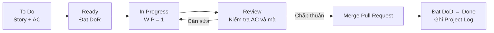

<strong>[CÂU 9]</strong>

# ĐỊNH NGHĨA QUY TRÌNH PHÁT TRIỂN PHẦN MỀM

## Hệ thống Quản lý và Số hóa Tài liệu Thư viện HCMUS (HCMUS-LDMS)

### THÔNG TIN TÀI LIỆU (DOCUMENT CONTROL)

| Trường thông tin | Nội dung |
| :--- | :--- |
| **Mã tài liệu** | `HCMUS-LDMS-SPD` |
| **Tên tài liệu** | Định nghĩa Quy trình Phát triển Phần mềm |
| **Người thực hiện** | Ân Tiến Nguyên An — Solution Architect / Backend Developer |
| **Nguồn quy trình** | Product Backlog, Sprint Plan, Team Contract và Project Log |
| **Trạng thái** | Ready for Review |

### LỊCH SỬ SỬA ĐỔI (REVISION HISTORY)

| Phiên bản | Ngày | Người thực hiện | Mô tả thay đổi |
| :---: | :---: | :--- | :--- |
| 1.0 | 20/08/2026 | Ân Tiến Nguyên An | Tổng hợp quy trình Kanban, DoR, DoD, luồng phát triển và cơ chế đánh giá từ các tài liệu dự án hiện hành. |

## Mục lục

- [1. Mục đích và phạm vi](#1-mục-đích-và-phạm-vi)
- [2. Mô hình cơ sở](#2-mô-hình-cơ-sở)
- [3. Vai trò và sản phẩm công việc](#3-vai-trò-và-sản-phẩm-công-việc)
- [4. Quy trình thực hiện](#4-quy-trình-thực-hiện)
- [5. Chính sách kiểm soát](#5-chính-sách-kiểm-soát)
- [6. Lịch trình áp dụng](#6-lịch-trình-áp-dụng)
- [7. Đánh giá và cập nhật quy trình](#7-đánh-giá-và-cập-nhật-quy-trình)
- [8. Tài liệu tham chiếu](#8-tài-liệu-tham-chiếu)

---

## 1. Mục đích và phạm vi

Tài liệu này trả lời năm câu hỏi quản lý cốt lõi của quy trình phát triển HCMUS-LDMS:

1. Công việc tiếp theo là gì?
2. Công việc dự kiến mất bao lâu?
3. Công việc được thực hiện và kiểm tra như thế nào?
4. Công việc tạo ra sản phẩm gì?
5. Ai chịu trách nhiệm thực hiện và phê duyệt?

Quy trình áp dụng cho các User Story từ lúc được chọn trong Product Backlog đến khi mã nguồn được hợp nhất, chạy được trên môi trường local và được ghi nhận vào Project Log.

## 2. Mô hình cơ sở

Nhóm sử dụng **Agile Kanban** làm mô hình cơ sở vì dự án cần một luồng công việc liên tục, dễ quan sát và phù hợp với nhóm nhỏ. Kanban được hiệu chỉnh bằng ba quy tắc:

- Mỗi thành viên chỉ giữ tối đa **một card ở trạng thái In Progress**.
- Card chỉ được bắt đầu khi đạt **Definition of Ready (DoR)**.
- Card chỉ được tính vào throughput khi đạt đủ **Definition of Done (DoD)**.

AI Coding Assistant được dùng để hỗ trợ phân tích đặc tả, tạo mã ban đầu và rà soát. AI không thay thế Acceptance Criteria, kiểm tra của kỹ sư hoặc quyết định hợp nhất mã nguồn.

## 3. Vai trò và sản phẩm công việc

| Vai trò | Trách nhiệm trong quy trình | Sản phẩm chính |
| :--- | :--- | :--- |
| Product Owner / Lead Frontend | Làm rõ nhu cầu, độ ưu tiên và Acceptance Criteria | User Story, AC, quyết định ưu tiên |
| Mạch Quốc Tấn — Project Manager | Điều phối luồng, xử lý blocker và tổng hợp báo cáo | Kế hoạch, báo cáo tiến độ |
| Ân Tiến Nguyên An — Solution Architect / Backend Developer | Kiểm tra kiến trúc, phát triển Backend và review Pull Request | API, quyết định kỹ thuật, ghi nhận review |
| Nguyễn Tuấn Anh — Backend Developer / DevOps | Phát triển Backend, cấu hình môi trường và CI/CD | API, Docker, workflow CI/CD |
| Ngô Nguyễn Thế Khoa — Frontend Developer | Phát triển giao diện React | Giao diện và tài liệu module |
| Nguyễn Lê Hồ Anh Khoa — Frontend Developer | Phát triển giao diện React và Reader | Giao diện và tài liệu module |
| Nguyễn Quang Thái — DevOps / QA / Tester | Hỗ trợ môi trường, kiểm tra AC và UAT | Kết quả kiểm tra, lỗi và phản hồi |

Các sản phẩm có thể được tạo ra trong một card gồm schema dữ liệu, API FastAPI, giao diện React, cấu hình Docker, tài liệu README và bản ghi effort trong Project Log.

## 4. Quy trình thực hiện

### Bước 1 — Chuẩn bị card

Nhóm chọn card theo thứ tự ưu tiên và kiểm tra ID, Acceptance Criteria, dependency và kích thước. Card quá lớn phải được tách trước khi chuyển sang `Ready`.

### Bước 2 — Triển khai theo đặc tả

Kỹ sư triển khai story từ AC và quy tắc kiến trúc hiện hành. AI Coding Assistant có thể hỗ trợ tạo khung mã hoặc gợi ý kiểm tra, nhưng kỹ sư chịu trách nhiệm về kết quả cuối cùng.

### Bước 3 — Kiểm tra

Kỹ sư chạy hệ thống local, kiểm tra toàn bộ AC và rà soát phần thay đổi. Nếu không đạt, card quay lại `In Progress` thay vì được ghi nhận hoàn thành.

### Bước 4 — Review, hợp nhất và ghi log

Mã nguồn được đưa qua Pull Request và self-review checklist. Khi review được chấp thuận, thay đổi được hợp nhất vào nhánh chính; sau đó nhóm xác nhận đủ DoD và ghi effort vào Project Log để tính throughput.

## 5. Chính sách kiểm soát

### 5.1. Definition of Ready

Một card chỉ được kéo vào `In Progress` khi:

1. Có Story ID.
2. Có Acceptance Criteria rõ ràng.
3. Các dependency trong `depends_on` đã hoàn thành, nếu có.
4. Có kích thước S hoặc M, tương ứng không quá hai ngày; card lớn hơn phải được tách.

### 5.2. Definition of Done

Một card chỉ được chuyển sang `Done` khi đáp ứng đủ năm điều kiện:

1. Toàn bộ Acceptance Criteria đã được kiểm tra đạt.
2. Mã nguồn đã merge qua Pull Request và hoàn thành self-review checklist.
3. Chức năng chạy được trên môi trường local.
4. Endpoint hoặc trang mới đã được ghi nhận trong README của module.
5. Thời gian thực hiện và token AI, nếu có, đã được ghi vào Project Log.

### 5.3. Giới hạn công việc đang làm

`WIP = 1 card/người`. Khi bị blocker, thành viên báo cho PM thay vì tự kéo thêm card mới. Chính sách này làm rõ điểm nghẽn và giảm chi phí chuyển đổi ngữ cảnh.

## 6. Lịch trình áp dụng

Quy trình được áp dụng xuyên suốt lộ trình 20 tuần:

| Giai đoạn | Thời gian | Kết quả chính |
| :--- | :---: | :--- |
| Khảo sát và bản quyền | Tuần 1–2 | Phạm vi, ràng buộc pháp lý, hạ tầng ban đầu |
| Xây dựng MVP và thí điểm | Tuần 3–12 | Phần mềm cốt lõi và 500 sách thí điểm |
| Số hóa diện rộng | Tuần 13–18 | Quy trình vận hành và 2.000 giáo trình tiếp theo |
| Nghiệm thu và chuyển giao | Tuần 19–20 | UAT, đào tạo và go-live |

Trong Sprint 1, bốn kỹ sư làm theo mô hình full-stack cho story của mình; Sprint kéo dài chín ngày với 17 stories trong phạm vi cam kết.

## 7. Đánh giá và cập nhật quy trình

### 7.1. Phương pháp đánh giá

| Cách đánh giá | Nội dung kiểm tra | Nguồn bằng chứng |
| :--- | :--- | :--- |
| Kiểm tra tuân thủ | DoR, WIP và DoD có được áp dụng hay không | Backlog, Pull Request, Project Log |
| Đo hiệu suất dòng chảy | Throughput, Cycle Time và số blocker | Báo cáo tuần |
| Đánh giá chất lượng | AC pass, khả năng chạy local, lỗi phải làm lại | Kết quả review và kiểm tra |
| Kiểm soát chi phí AI | Token theo session và xu hướng tiêu thụ | Project Log |

Snapshot tuần 1 ghi nhận **12/26 stories**, **440.000 tokens** và chi phí ước tính khoảng **300.000 VNĐ**. Đây là snapshot ngày 16–17/07/2026, không phải tổng tích lũy hiện tại của Project Log.

### 7.2. Cơ chế cập nhật

Quy trình được cập nhật khi có một trong các tín hiệu: card thường xuyên bị trả lại, Cycle Time vượt ngưỡng, dependency không rõ, chi phí AI tăng bất thường hoặc công nghệ MVP thay đổi. Mọi thay đổi phải cập nhật Revision History của tài liệu liên quan và ghi một dòng vào Project Log.

Product Backlog cho thấy quy trình đã được hiệu chỉnh qua các phiên bản 3.0, 3.1 và 4.0: bổ sung Kanban/throughput, siết Acceptance Criteria và đơn giản hóa tech stack MVP.

## 8. Tài liệu tham chiếu

- [Product Backlog — Quy tắc Kanban, DoR và DoD](03-product-backlog.md)
- [Sprint Plan — Phạm vi và phân công Sprint 1](../03-execution-monitoring/01-sprint-plan.md)
- [Project Log — Dữ liệu effort và token](../03-execution-monitoring/02-project-log.md)
- [Team Contract — Vai trò và phương pháp làm việc](../01-initiation/05-team-contract.md)
- [Kế hoạch Chi phí, Tiến độ và Nguồn lực](04-cost-time-resource.md)
