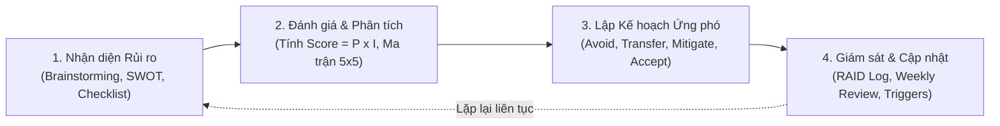
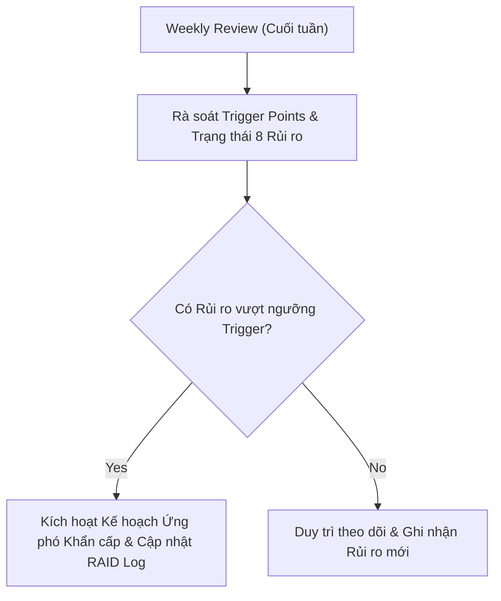

# KẾ HOẠCH QUẢN LÝ RỦI RO (SOFTWARE RISK MANAGEMENT PLAN)

## Hệ thống Quản lý và Số hóa Tài liệu Thư viện HCMUS (HCMUS-LDMS)

### THÔNG TIN TÀI LIỆU (DOCUMENT CONTROL)

| Trường thông tin (Field)                   | Nội dung đặc tả (Description)                               |
| :----------------------------------------- | :---------------------------------------------------------- |
| **Mã tài liệu (Document ID)**              | `HCMUS-LDMS-RSK`                                            |
| **Tên tài liệu (Document Title)**          | Kế hoạch Quản lý Rủi ro (Software Risk Management Plan)    |
| **Dự án (Project Name)**                   | HCMUS-LDMS                                                  |
| **Đơn vị soạn thảo (Author/Organization)** | Nhóm Phát triển Dự án HCMUS-LDMS                            |
| **Người xem xét (Reviewer)**               | Mạch Quốc Tấn (Project Manager)                             |
| **Người phê duyệt (Approver)**             | Toàn bộ thành viên nhóm (đồng thuận)                        |
| **Cấp độ bảo mật (Security Class)**        | Internal (Nội bộ nhóm)                                      |
| **Trạng thái tài liệu (Status)**           | Active (Có hiệu lực)                                        |

### LỊCH SỬ PHIÊN BẢN (REVISION HISTORY)

| Phiên bản (Version) | Ngày phát hành (Date) | Mô tả thay đổi (Description of Change)                                                                                                    | Người thực hiện (Author) |
| :-----------------: | :-------------------: | :---------------------------------------------------------------------------------------------------------------------------------------- | :----------------------: |
|         1.0         |      20/08/2026       | Khởi tạo Kế hoạch Quản lý Rủi ro hoàn chỉnh: Quy trình 4 bước, Ma trận P×I, RAID Log chi tiết 8 rủi ro và Kế hoạch phản ứng khẩn cấp. |      Mạch Quốc Tấn       |

---

## Mục lục

- [1. Tổng quan & Mục tiêu](#1-tổng-quan--mục-tiêu)
- [2. Khung quy trình Quản lý Rủi ro 4 bước](#2-khung-quy-trình-quản-lý-rủi-ro-4-bước)
- [3. Thang đo Xác suất & Mức độ Tác động (Probability & Impact Matrix)](#3-thang-đo-xác-suất--mức-độ-tác-động-probability--impact-matrix)
- [4. Bảng Đăng ký Rủi ro Dự án (Project Risk Register / RAID Log)](#4-bảng-đăng-ký-rủi-ro-dự-án-project-risk-register--raid-log)
- [5. Kế hoạch Ứng phó Chi tiết cho 3 Rủi ro Cốt lõi](#5-kế-hoạch-ứng-phó-chi-tiết-cho-3-rủi-ro-cốt-lõi)
  - [5.1. Rủi ro 1: Bản quyền Học liệu Số & Rò rỉ Tài liệu (R-01)](#51-rủi-ro-1-bản-quyền-học-liệu-số--rò-rỉ-tài-liệu-r-01)
  - [5.2. Rủi ro 2: Sai lệch Tỷ lệ Ký tự OCR Tiếng Việt trên Sách Scan Cũ (R-02)](#52-rủi-ro-2-sai-lệch-tỷ-lệ-ký-tự-ocr-tiếng-việt-trên-sách-scan-cũ-r-02)
  - [5.3. Rủi ro 3: Bùng nổ Chi phí Token AI vượt Ngân sách (R-03)](#53-rủi-ro-3-bùng-nổ-chi-phí-token-ai-vượt-ngân-sách-r-03)
- [6. Cơ chế Giám sát, Kiểm soát & Kích hoạt Ứng phó (Risk Monitoring & Triggers)](#6-cơ-chế-giám-sát-kiểm-soát--kích-hoạt-ứng-phó-risk-monitoring--triggers)

---

## 1. Tổng quan & Mục tiêu

Kế hoạch Quản lý Rủi ro xác định phương pháp tiếp cận có hệ thống nhằm nhận diện, phân tích, đánh giá, lập kế hoạch ứng phó và giám sát các rủi ro có khả năng đe dọa đến sự thành công của dự án **HCMUS-LDMS** (về Phạm vi, Lịch trình, Chi phí và Chất lượng).

- **Khái niệm Rủi ro (Risk):** Sự kiện bất định có khả năng xảy ra trong tương lai ($0\% < P < 100\%$). Nếu xảy ra, nó sẽ gây tác động tiêu cực (Threat) hoặc tích cực (Opportunity) đến mục tiêu dự án.
- **Phân biệt với Vấn đề (Problem / Issue):** Vấn đề là sự kiện **đã xảy ra ở hiện tại** ($P = 100\%$) và đang trực tiếp gây thiệt hại, đòi hỏi hành động khắc phục tức thì.
- **Mục tiêu quản lý:** Chủ động biến "rủi ro chưa xảy ra" thành các kịch bản có sẵn phương án giảm thiểu, ngăn không để rủi ro biến thành khủng hoảng dự án.

---

## 2. Khung quy trình Quản lý Rủi ro 4 bước

1. **Nhận diện (Identify):** Thu thập danh sách rủi ro tiềm ẩn qua phân tích WBS, SWOT, PEST, phỏng vấn thủ thư và bài học lịch sử.
2. **Phân tích (Analyze):** Đo lường xác suất $P$ (1–5) và mức độ tác động $I$ (1–5) để tính điểm ưu tiên:
   $$\text{Risk Score} = P \times I \quad (\text{Thang điểm từ } 1 \text{ đến } 25)$$
3. **Ứng phó (Plan Response):** Xác định chiến lược can thiệp (Né tránh, Chuyển giao, Giảm thiểu, Chấp nhận) kèm người phụ trách (Risk Owner) và ngân sách dự phòng.
4. **Giám sát (Monitor & Control):** Định kỳ đánh giá lại trạng thái rủi ro tại mỗi cuộc họp Weekly Review và theo dõi các dấu hiệu cảnh báo sớm (Risk Triggers).

---

## 3. Thang đo Xác suất & Mức độ Tác động (Probability & Impact Matrix)

### 3.1. Thang đo Xác suất (Probability - P)
- **1 - Rất thấp (Very Low):** $P \le 10\%$ (Hiếm khi xảy ra).
- **2 - Thấp (Low):** $10\% < P \le 30\%$ (Khó xảy ra).
- **3 - Trung bình (Medium):** $30\% < P \le 50\%$ (Có thể xảy ra).
- **4 - Cao (High):** $50\% < P \le 70\%$ (Nhiều khả năng xảy ra).
- **5 - Rất cao (Very High):** $P > 70\%$ (Gần như chắc chắn xảy ra).

### 3.2. Thang đo Tác động (Impact - I)
- **1 - Không đáng kể (Negligible):** Trượt tiến độ $< 3$ ngày, chi phí tăng $< 2\%$, không ảnh hưởng tính năng.
- **2 - Nhỏ (Minor):** Trượt tiến độ $< 1$ tuần, chi phí tăng $< 5\%$, giải quyết bằng nguồn lực dự phòng.
- **3 - Vừa phải (Moderate):** Trượt tiến độ 1–2 tuần, chi phí tăng $5\% - 15\%$, ảnh hưởng tính năng Should-have.
- **4 - Lớn (Major):** Trượt tiến độ $> 2$ tuần, chi phí tăng $15\% - 30\%$, ảnh hưởng trực tiếp đến 16 Must-have stories.
- **5 - Nghiêm trọng (Critical):** Dự án bị đình chỉ, vi phạm pháp luật bản quyền, hoặc thất bại toàn diện.

### 3.3. Ma trận Đánh giá Rủi ro $5 \times 5$

| Tác động \ Xác suất | 1 (Rất thấp) | 2 (Thấp) | 3 (Trung bình) | 4 (Cao) | 5 (Rất cao) |
| :------------------ | :----------: | :------: | :------------: | :-----: | :---------: |
| **5 (Nghiêm trọng)** | 5 (Vừa)      | 10 (Cao) | 15 (Cao)       | 20 (Rất cao) | 25 (Rất cao) |
| **4 (Lớn)**          | 4 (Thấp)     | 8 (Vừa)  | 12 (Cao)       | 16 (Cao)     | 20 (Rất cao) |
| **3 (Vừa phải)**     | 3 (Thấp)     | 6 (Vừa)  | 9 (Vừa)        | 12 (Cao)     | 15 (Cao)     |
| **2 (Nhỏ)**          | 2 (Thấp)     | 4 (Thấp) | 6 (Vừa)        | 8 (Vừa)      | 10 (Cao)     |
| **1 (Không đáng kể)**| 1 (Thấp)     | 2 (Thấp) | 3 (Thấp)       | 4 (Thấp)     | 5 (Vừa)      |

- **Điểm 1 – 4 (Xanh):** Rủi ro Thấp — Chấp nhận và theo dõi định kỳ.
- **Điểm 5 – 9 (Vàng):** Rủi ro Trung bình — Lập biện pháp phòng ngừa giảm thiểu.
- **Điểm 10 – 16 (Cam):** Rủi ro Cao — Bắt buộc có kế hoạch ứng phó chủ động và giám sát hàng tuần.
- **Điểm 20 – 25 (Đỏ):** Rủi ro Nghiêm trọng — Báo cáo ngay cho PM/Sponsor, kích hoạt giải pháp dự phòng khẩn cấp.

---

## 4. Bảng Đăng ký Rủi ro Dự án (Project Risk Register / RAID Log)

| Mã Rủi ro | Hạng mục | Mô tả Rủi ro | P | I | Score | Mức độ | Chiến lược | Biện pháp Giảm thiểu & Dự phòng | Người phụ trách (Owner) |
| :---: | :--- | :--- | :---: | :---: | :---: | :---: | :---: | :--- | :--- |
| **R-01** | **Pháp lý** | **Bản quyền học liệu:** Sinh viên tải file EPUB lậu phát tán ra ngoài trường, vi phạm bản quyền tác giả. | 3 | 5 | **15** | **Cao** | **Mitigate** | Sử dụng MinIO Presigned URL có thời hạn ngắn (15 phút), DRM Web Reader mã hóa, chặn tải trực tiếp. | Mạch Quốc Tấn (PM) |
| **R-02** | **Kỹ thuật** | **Chất lượng OCR:** Sách scan cũ, ố vàng bị nhòe chữ khiến CER $> 10\%$, văn bản vỡ cấu trúc. | 4 | 4 | **16** | **Cao** | **Mitigate** | Pipeline tiền xử lý ảnh (OpenCV binarization/deskew) + Giao diện Split-screen Editor cho thủ thư sửa tay. | Ân Tiến Nguyên An (SA) |
| **R-03** | **Tài chính** | **Chi phí Token AI:** Dev chat lan man hoặc lặp vòng lặp vô tận làm vượt ngân sách AI 5M VNĐ. | 3 | 3 | **9** | **Vừa** | **Avoid** | Áp dụng Prompt RACFT có Spec chi tiết, giới hạn context, log token bắt buộc trong 12h vào `project-log.md`. | Nguyễn Tuấn Anh (DevOps) |
| **R-04** | **Tiến độ** | **Đường găng WP4 trễ hạn:** Khối lượng số hóa 500 giáo trình quá lớn làm trễ mốc bàn giao tuần 17. | 3 | 4 | **12** | **Cao** | **Mitigate** | Chia theo đợt ưu tiên (MVP 50 cuốn cốt lõi trước); tuyển thêm CTV sinh viên hỗ trợ đối soát scan. | Ngô Nguyễn Thế Khoa |
| **R-05** | **Nhân sự** | **Thành viên bận đột xuất / nghỉ bệnh:** Thiếu nhân lực lập trình trong giai đoạn nước rút. | 3 | 3 | **9** | **Vừa** | **Mitigate** | Quy tắc Availability Policy (báo trước 24h); tài liệu hóa kiến trúc rõ ràng; hỗ trợ chéo chéo cặp (pair-work). | Mạch Quốc Tấn (PM) |
| **R-06** | **Hạ tầng** | **Mất mát dữ liệu CSDL / MinIO:** Sự cố hỏng ổ đĩa máy chủ làm mất các file sách đã số hóa. | 1 | 5 | **5** | **Vừa** | **Transfer/Mitigate** | Script sao lưu tự động hàng ngày (`scripts/backup-postgres.sh`, `backup-minio.sh`) lưu ra ổ đĩa thứ cấp. | Nguyễn Quang Thái (QA) |
| **R-07** | **Tích hợp** | **Xung đột mã nguồn khi merge:** Nhiều dev sửa chung file core gây hỏng build staging. | 3 | 2 | **6** | **Vừa** | **Avoid** | GitFlow branch riêng, CI Pipeline chạy Ruff/ESLint/Pytest chặn merge nếu test fail. | Nguyễn Tuấn Anh (DevOps) |
| **R-08** | **Nghiệp vụ** | **Thủ thư từ chối sử dụng (Kháng cự đổi mới):** Giao diện quá phức tạp, thủ thư quen cách làm giấy. | 2 | 4 | **8** | **Vừa** | **Mitigate** | Thiết kế Prototype sớm, lấy feedback trực tiếp từ cô thủ thư Mai, cung cấp tài liệu User Guide trực quan. | Nguyễn Lê Hồ Anh Khoa |

---

## 5. Kế hoạch Ứng phó Chi tiết cho 3 Rủi ro Cốt lõi

### 5.1. Rủi ro 1: Bản quyền Học liệu Số & Rò rỉ Tài liệu (R-01)
- **Bối cảnh:** Tài liệu nội bộ trường ĐHKHTN có bản quyền nghiêm ngặt. Nếu hệ thống cho phép download file sách raw (EPUB/PDF) trực tiếp, nguy cơ bị rò rỉ lên mạng xã hội là rất cao.
- **Biện pháp phòng ngừa (Proactive Mitigation):**
  - Không công khai đường dẫn lưu trữ tĩnh. Tất cả tài liệu trong MinIO Object Storage đều đặt ở chế độ `Private`.
  - Khi đọc sách, Backend tạo ra một **Presigned URL chỉ có hiệu lực trong 15 phút**, gắn với Token xác thực của phiên đăng nhập.
  - Phía Frontend sử dụng `Epub.js` dựng trực tiếp trên DOM Canvas mà không lưu cache file hoàn chỉnh xuống đĩa người dùng.
- **Kế hoạch dự phòng (Contingency Plan):** Nếu phát hiện tài khoản có hành vi cào dữ liệu (scraping), hệ thống tự động khóa tài khoản và thu hồi quyền truy cập (Role Downgrade).

### 5.2. Rủi ro 2: Sai lệch Tỷ lệ Ký tự OCR Tiếng Việt trên Sách Scan Cũ (R-02)
- **Bối cảnh:** Giáo trình thập niên 90 bị ố vàng, mực in mờ, font chữ cũ khiến engine Tesseract nhận diện sai dấu thanh tiếng Việt (ví dụ: "ươ", "â", "đ").
- **Biện pháp phòng ngừa (Proactive Mitigation):**
  - Xây dựng module tiền xử lý ảnh (Image Preprocessing): Tự động xoay thẳng trang (deskew), tăng độ tương phản, khử nhiễu hạt trước khi đưa vào OCR.
  - Thiết kế màn hình **Split-screen Editor (Biên tập Đối soát Song song)**: Cửa sổ bên trái hiển thị ảnh chụp scan gốc, cửa sổ bên phải hiển thị văn bản OCR có đánh dấu các từ có độ tin cậy thấp (Low-confidence tokens) để thủ thư dễ dàng hiệu đính.
- **Kế hoạch dự phòng (Contingency Plan):** Đối với các trang quá nát không thể OCR, cho phép thủ thư nhập tóm tắt thủ công hoặc chuyển sang chế độ chỉ xem ảnh scan (Image-only mode).

### 5.3. Rủi ro 3: Bùng nổ Chi phí Token AI vượt Ngân sách (R-03)
- **Bối cảnh:** Dự án kết hợp AI Coding Assistants. Nếu dev đưa toàn bộ codebase nặng vào context hoặc prompt vô tội vạ, ngân sách 5.000.000 VNĐ sẽ nhanh chóng cạn kiệt.
- **Biện pháp phòng ngừa (Proactive Mitigation):**
  - Chuẩn hóa Prompt theo khung **RACFT (Role - Ask - Context - Format - Tone)**.
  - Kỹ thuật **Context Engineering cực đoan**: Chỉ nạp file đặc tả (Spec/AC) và interface cần thiết thay vì đưa toàn bộ project.
  - Quy tắc Relay 2 model: Dùng model rẻ hơn (Claude Sonnet) để lập dàn ý spec và chỉ dùng model đắt hơn (Claude Opus) để sinh code logic phức tạp.
  - Ràng buộc kỷ luật: Ghi log token sau mỗi phiên vào `02-project-log.md`.
- **Kế hoạch dự phòng (Contingency Plan):** Nếu tổng token chạm ngưỡng $70\%$ ngân sách (3.5M VNĐ), PM ngay lập tức áp dụng cơ chế phê duyệt trước cho các phiên dùng model Opus.

---

## 6. Cơ chế Giám sát, Kiểm soát & Kích hoạt Ứng phó (Risk Monitoring & Triggers)

- **Ngưỡng kích hoạt (Trigger Points):**
  - *Trigger R-01:* Có yêu cầu tải sách raw từ hơn 5 IP lạ trong 1 giờ $\rightarrow$ Kích hoạt bảo mật WAF.
  - *Trigger R-02:* Đo lường CER mẫu trên 10 trang ngẫu nhiên $> 5\%$ $\rightarrow$ Bật chế độ Preprocessing nâng cao.
  - *Trigger R-03:* Tổng chi phí token trong 1 tuần vượt quá $1.000.000\text{ VNĐ}$ $\rightarrow$ Họp khẩn siết quy trình prompt.
- **Tần suất báo cáo:** PM cập nhật trạng thái RAID Log hàng tuần trong buổi Weekly Review và gửi báo cáo tóm tắt trong Status Report cho toàn nhóm.
