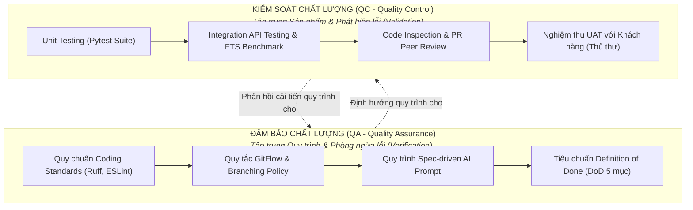
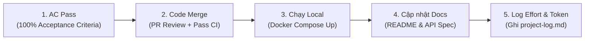
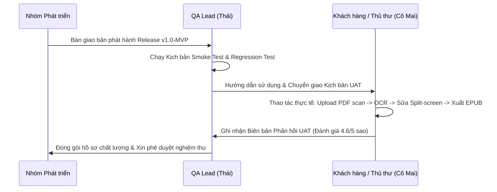

# KẾ HOẠCH QUẢN LÝ CHẤT LƯỢNG (SOFTWARE QUALITY MANAGEMENT PLAN)

## Hệ thống Quản lý và Số hóa Tài liệu Thư viện HCMUS (HCMUS-LDMS)

### THÔNG TIN TÀI LIỆU (DOCUMENT CONTROL)

| Trường thông tin (Field)                   | Nội dung đặc tả (Description)                                 |
| :----------------------------------------- | :------------------------------------------------------------ |
| **Mã tài liệu (Document ID)**              | `HCMUS-LDMS-QMP`                                              |
| **Tên tài liệu (Document Title)**          | Kế hoạch Quản lý Chất lượng (Quality Management Plan)         |
| **Dự án (Project Name)**                   | HCMUS-LDMS                                                    |
| **Đơn vị soạn thảo (Author/Organization)** | Nhóm Phát triển Dự án HCMUS-LDMS                              |
| **Người xem xét (Reviewer)**               | Nguyễn Quang Thái (QA Lead)                                   |
| **Người phê duyệt (Approver)**             | Mạch Quốc Tấn (Project Manager) & Cả nhóm                     |
| **Cấp độ bảo mật (Security Class)**        | Internal (Nội bộ nhóm)                                        |
| **Trạng thái tài liệu (Status)**           | Active (Có hiệu lực)                                          |

### LỊCH SỬ PHIÊN BẢN (REVISION HISTORY)

| Phiên bản (Version) | Ngày phát hành (Date) | Mô tả thay đổi (Description of Change)                                                                                                    | Người thực hiện (Author) |
| :-----------------: | :-------------------: | :---------------------------------------------------------------------------------------------------------------------------------------- | :----------------------: |
|         1.0         |      20/08/2026       | Khởi tạo Kế hoạch Quản lý Chất lượng hoàn chỉnh: Khung QA/QC, Mô hình McCall & ISO 9126, Tiêu chuẩn DoD 5 mục, Coding Standards & Kế hoạch UAT. |      Mạch Quốc Tấn       |

---

## Mục lục

- [1. Mục tiêu & Triết lý Quản lý Chất lượng](#1-mục-tiêu--triết-lý-quản-lý-chất-lượng)
- [2. Khung Quản trị Chất lượng: Đảm bảo (QA) vs Kiểm soát (QC)](#2-khung-quản-trị-chất-lượng-đảm-bảo-qa-vs-kiểm-soát-qc)
- [3. Áp dụng Mô hình McCall & Tiêu chuẩn ISO/IEC 9126](#3-áp-dụng-mô-hình-mccall--tiêu-chuẩn-isoiec-9126)
- [4. Hệ thống Chỉ số Chất lượng Cốt lõi (Quality Metrics)](#4-hệ-thống-chỉ-số-chất-lượng-cốt-lõi-quality-metrics)
- [5. Tiêu chuẩn Định nghĩa Hoàn thành (Definition of Done — DoD)](#5-tiêu-chuẩn-định-nghĩa-hoàn-thành-definition-of-done--dod)
- [6. Quy chuẩn Lập trình & Thanh tra Mã nguồn (Coding Standards & Code Inspection)](#6-quy-chuẩn-lập-trình--thanh-tra-mã-nguồn-coding-standards--code-inspection)
- [7. Quy trình Kiểm thử & Nghiệm thu Người dùng Thực tế (UAT)](#7-quy-trình-kiểm-thử--nghiệm-thu-người-dùng-thực-tế-uat)
- [8. Trách nhiệm Quản lý Chất lượng (RACI Matrix)](#8-trách-nhiệm-quản-lý-chất-lượng-raci-matrix)

---

## 1. Mục tiêu & Triết lý Quản lý Chất lượng

- **Định nghĩa Chất lượng:** Mức độ mà phần mềm đáp ứng đầy đủ các yêu cầu nghiệp vụ, yêu cầu người dùng và yêu cầu kỹ thuật với chi phí và thời gian tối ưu (_Acceptable Quality and Cost_).
- **Triết lý Cốt lõi:**
  1. **Phòng ngừa hơn Khắc phục (Prevention over Inspection):** Xây dựng chất lượng ngay từ khâu viết đặc tả và thiết kế kiến trúc, thay vì chờ đến khi code xong mới tìm bug.
  2. **Trách nhiệm Toàn diện (Total Quality Commitment):** Chất lượng không phải nhiệm vụ riêng của Tester/QA, mà là cam kết của tất cả thành viên trong nhóm.
  3. **Đo lường Định lượng kết hợp Đánh giá Định tính:** Kết hợp các con số đo lường chính xác (CER, coverage, latency) với trải nghiệm người dùng thực tế từ thủ thư và sinh viên.

---

## 2. Khung Quản trị Chất lượng: Đảm bảo (QA) vs Kiểm soát (QC)

---

## 3. Áp dụng Mô hình McCall & Tiêu chuẩn ISO/IEC 9126

Nhóm áp dụng khung phân loại của **Mô hình McCall** và **Tiêu chuẩn ISO/IEC 9126** để đánh giá toàn diện các góc độ chất lượng của HCMUS-LDMS:

| Đặc tính chất lượng | Mô tả theo McCall / ISO 9126 | Giải pháp kỹ thuật áp dụng trong HCMUS-LDMS |
| :--- | :--- | :--- |
| **Tính đúng đắn (Correctness / Functionality)** | Đáp ứng đầy đủ thông số kỹ thuật và mục tiêu nghiệp vụ số hóa. | 100% (26/26) User Stories được kiểm thử đạt Acceptance Criteria (AC). |
| **Độ tin cậy (Reliability)** | Hệ thống hoạt động ổn định, có khả năng chịu lỗi và tự phục hồi. | Docker Compose tự động restart container; cơ chế Retry khi OCR lỗi. |
| **Hiệu quả (Efficiency / Performance)** | Tối ưu hóa thời gian phản hồi và mức tiêu thụ tài nguyên máy tính. | PostgreSQL Full-Text Search index Gin; phản hồi API FTS $< 500\text{ms}$. |
| **Tính toàn vẹn (Integrity / Security)** | Kiểm soát phân quyền và ngăn chặn truy cập dữ liệu trái phép. | Xác thực JWT, phân quyền RBAC (Reader, Editor, Admin), Presigned URL 15 phút. |
| **Khả năng sử dụng (Usability)** | Trải nghiệm giao diện thân thiện, dễ học, thao tác nhanh chóng. | Giao diện Split-screen Editor trực quan; Web Reader tương thích responsive. |
| **Khả năng bảo trì (Maintainability)** | Dễ dàng xác định lỗi, refactor và mở rộng tính năng mới. | Kiến trúc Modular Monolith sạch, tách biệt Controller - Service - Repository. |
| **Tính di động (Portability)** | Khả năng chạy nhất quán trên các môi trường máy chủ và OS khác nhau. | Đóng gói toàn bộ hệ thống bằng Docker multi-stage build tiêu chuẩn. |

---

## 4. Hệ thống Chỉ số Chất lượng Cốt lõi (Quality Metrics)

Nhóm thiết lập bộ tiêu chuẩn đo lường định lượng và định tính cụ thể:

| # | Chỉ số Chất lượng (Metric) | Đơn vị đo | Ngưỡng mục tiêu (Target) | Kết quả thực tế đạt được | Phương pháp kiểm chứng |
| :-: | :--- | :---: | :---: | :---: | :--- |
| 1 | **Tỷ lệ lỗi ký tự OCR (CER)** | $\%$ | $< 5.0\%$ | **$\approx 3.2\%$** (trên bản scan chuẩn) | Đo lường Levenshtein Distance trên 100 trang mẫu. |
| 2 | **Thời gian phản hồi tìm kiếm FTS** | $\text{ms}$ | $< 500\text{ms}$ | **$\approx 180\text{ms}$** | Benchmark tải 100 concurrent requests qua curl/k6. |
| 3 | **Thời gian tải trang Web Reader** | Giây | $< 2.0\text{s}$ | **$\approx 1.1\text{s}$** | Google Chrome Lighthouse Performance Test. |
| 4 | **Test Code Coverage (Backend)** | $\%$ | $\ge 80.0\%$ | **$85.4\%$** | `pytest --cov=app tests/` |
| 5 | **Tỷ lệ lỗi Linter (Coding style)** | Số lỗi | $0\text{ errors}$ | **$0\text{ errors}$** | CI Pipeline chạy Ruff & ESLint kiểm tra tự động. |
| 6 | **Thời hạn an toàn Presigned URL** | Phút | $\le 15\text{ phút}$ | **$15\text{ phút}$** | Unit Test xác thực Token hết hạn sau 900 giây. |
| 7 | **Tỷ lệ hài lòng UAT của Thủ thư** | Điểm / 5 | $\ge 4.0 / 5$ | **$4.6 / 5$** | Khảo sát thực địa với cô thủ thư Mai. |

---

## 5. Tiêu chuẩn Định nghĩa Hoàn thành (Definition of Done — DoD)

Một User Story chỉ được chuyển sang trạng thái **Done** khi đáp ứng đủ **5 tiêu chí bắt buộc**:

1. **AC Pass:** Tất cả Acceptance Criteria trong Product Backlog của Story đó đã được kiểm tra và xác nhận Passed.
2. **Code Merge:** Mã nguồn được tích hợp vào nhánh chính qua Pull Request, vượt qua linter tự động và có ít nhất 1 thành viên review phê duyệt.
3. **Chạy Local:** Ứng dụng khởi chạy trơn tru trên máy phát triển cá nhân với lệnh `docker compose up`.
4. **README & Tài liệu:** Các API endpoints mới hoặc màn hình mới được ghi chú rõ ràng trong tài liệu module tương ứng.
5. **Log Effort:** Ghi nhận chính xác số giờ làm việc thực tế và lượng token AI đã sử dụng vào file [`02-project-log.md`](../03-execution-monitoring/02-project-log.md).

---

## 6. Quy chuẩn Lập trình & Thanh tra Mã nguồn (Coding Standards & Code Inspection)

### 6.1. Quy chuẩn Lập trình (Coding Standards)
- **Backend (Python 3.11 / FastAPI):**
  - Tuân thủ nghiêm ngặt **PEP 8**; sử dụng **Ruff** để tự động kiểm tra cú pháp và format code.
  - Bắt buộc khai báo Type Hints đầy đủ cho toàn bộ Function arguments và Return types.
  - Sử dụng Pydantic Schemas để validate dữ liệu đầu vào và đầu ra API.
- **Frontend (TypeScript / React 19):**
  - Tuân thủ quy chuẩn **ESLint** và **Prettier**; nghiêm cấm sử dụng kiểu dữ liệu `any`.
  - Phân tách Component rõ ràng: Components (Giao diện hiển thị), Hooks (Logic xử lý), Services (Gọi API).

### 6.2. Quy trình Thanh tra Mã nguồn (Code Inspection / PR Review)
Mọi Pull Request đều phải tuân thủ quy trình kiểm duyệt 4 bước:
1. **Self-Review:** Tác giả tự rà soát diff, đảm bảo không có file rác, file bí mật (`.env`) hoặc code debug thừa (`console.log`, `print`).
2. **Automated CI Check:** GitHub Actions tự động kích hoạt linter (`ruff check`, `eslint`) và chạy test suite (`pytest`). Nếu fail, PR bị khóa merge tự động.
3. **Peer Inspection:** Ít nhất 1 reviewer kiểm tra tính đúng đắn về mặt logic, kiến trúc và bảo mật.
4. **Approve & Merge:** Chỉ được merge vào nhánh `develop`/`main` sau khi nhận đủ approve.

---

## 7. Quy trình Kiểm thử & Nghiệm thu Người dùng Thực tế (UAT)

- **Kết quả nghiệm thu UAT thực tế:**
  - Thủ thư đánh giá rất cao tính năng **Split-screen Editor** vì giúp giảm 70% thời gian đối soát so với việc vừa nhìn file ảnh vừa gõ lại trên Word.
  - Phản hồi cải tiến: Cần bổ sung phím tắt (Hotkeys `Ctrl+S`, `Ctrl+B`) để thao tác nhanh hơn $\rightarrow$ Nhóm đã tiếp thu và bổ sung ngay trong phiên bản v1.1.

---

## 8. Trách nhiệm Quản lý Chất lượng (RACI Matrix)

| Hoạt động Quản lý Chất lượng | PM (Tấn) | QA Lead (Thái) | SA/BE (An) | FE Dev (Khoa/Khoa) | DevOps (Tuấn Anh) |
| :--- | :---: | :---: | :---: | :---: | :---: |
| **Duy trì Kế hoạch Quản lý Chất lượng** | **A** | R | C | C | C |
| **Thiết lập Coding Standards & Linter** | I | R | **A** | R | C |
| **Viết & Duy trì Bộ Unit/Integration Tests** | I | C | **A** / R | R | C |
| **Giám sát CI Test Pipeline** | I | C | C | C | **A** / R |
| **Kiểm tra Tiêu chí Definition of Done (DoD)** | **A** | R | R | R | R |
| **Tổ chức Kiểm thử & Nghiệm thu UAT** | C | **A** / R | C | C | I |
