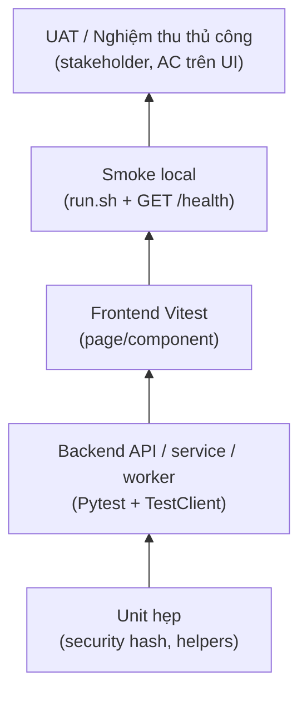
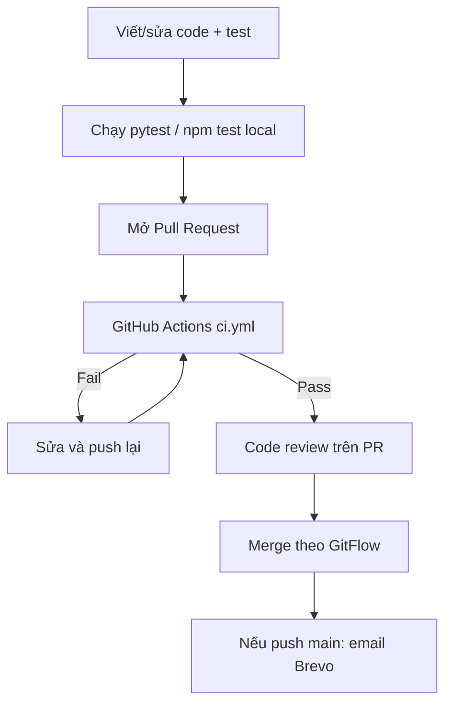

# KẾ HOẠCH KIỂM THỬ (TEST PLAN)

## Hệ thống Quản lý và Số hóa Tài liệu Thư viện HCMUS (HCMUS-LDMS)

### THÔNG TIN TÀI LIỆU (DOCUMENT CONTROL)

| Trường thông tin (Field)                   | Nội dung đặc tả (Description)                          |
| :----------------------------------------- | :----------------------------------------------------- |
| **Mã tài liệu (Document ID)**              | `LDMS_TSP_B1.0`                                        |
| **Tên tài liệu (Document Title)**          | Kế hoạch Kiểm thử (Test Plan)                          |
| **Dự án (Project Name)**                   | HCMUS-LDMS                                             |
| **Đơn vị soạn thảo (Author/Organization)** | Nhóm Phát triển Dự án HCMUS-LDMS                       |
| **Người xem xét (Reviewer)**               | DevOps / QA (Nguyễn Quang Thái); Tech Lead             |
| **Cấp độ bảo mật (Security Class)**        | Internal (Nội bộ nhóm)                                 |
| **Trạng thái tài liệu (Status)**           | Active — phản ánh suite kiểm thử hiện có trong repo    |

### LỊCH SỬ PHIÊN BẢN (REVISION HISTORY)

| Phiên bản (Version) | Ngày phát hành (Date) | Mô tả thay đổi (Description of Change)                                                                                         | Người thực hiện (Author) |
| :-----------------: | :-------------------: | :----------------------------------------------------------------------------------------------------------------------------- | :----------------------: |
|         1.0         |      20/08/2026       | Khởi tạo Test Plan từ thực trạng codebase: Pytest (backend), Vitest (frontend), cổng CI GitHub Actions; ghi rõ khoảng trống. |    Nguyễn Tuấn Anh     |
|         1.1         |      20/08/2026       | Smoke prod-like: dùng `scripts/run-prod.sh` + `docker-compose.prod.yml` (sau rebase main). |    Nguyễn Tuấn Anh     |

---

## Mục lục

- [1. Mục đích và Phạm vi](#1-mục-đích-và-phạm-vi)
- [2. Tài liệu tham chiếu](#2-tài-liệu-tham-chiếu)
- [3. Chiến lược kiểm thử](#3-chiến-lược-kiểm-thử)
- [4. Cấp độ kiểm thử và Phạm vi chi tiết](#4-cấp-độ-kiểm-thử-và-phạm-vi-chi-tiết)
- [5. Môi trường và Công cụ](#5-môi-trường-và-công-cụ)
- [6. Tiêu chí đạt / không đạt](#6-tiêu-chí-đạt--không-đạt)
- [7. Quy trình thực hiện và Cổng chất lượng](#7-quy-trình-thực-hiện-và-cổng-chất-lượng)
- [8. Theo dõi lỗi (Defect Tracking)](#8-theo-dõi-lỗi-defect-tracking)
- [9. Vai trò và Trách nhiệm](#9-vai-trò-và-trách-nhiệm)
- [10. Rủi ro và Khoảng trống hiện tại](#10-rủi-ro-và-khoảng-trống-hiện-tại)
- [11. Lịch sử đánh giá tài liệu](#11-lịch-sử-đánh-giá-tài-liệu)

---

## 1. Mục đích và Phạm vi

### 1.1 Mục đích

Tài liệu này mô tả **cách nhóm HCMUS-LDMS kiểm thử sản phẩm** trong giai đoạn MVP: mục tiêu chất lượng, cấp độ test, công cụ, cổng CI, và tiêu chí gắn với Definition of Done (DoD) trong [`05-team-contract.md`](../01-initiation/05-team-contract.md).

Kế hoạch không mô tả một “hệ thống QA doanh nghiệp” chưa có, mà **ghi nhận những gì nhóm đã thực thi trong mã nguồn và pipeline**, đồng thời nêu rõ phần còn thiếu.

### 1.2 Phạm vi bao gồm (In-Scope)

- Kiểm thử tự động backend (FastAPI) bằng **Pytest**.
- Kiểm thử tự động frontend (React/Vite) bằng **Vitest** + Testing Library.
- Kiểm tra tĩnh: **Ruff** (Python), **ESLint** / build TypeScript (frontend).
- Cổng chất lượng trên **GitHub Actions** (`.github/workflows/ci.yml`).
- Smoke thủ công khi khởi động stack bằng `./scripts/run.sh` (health check API).

### 1.3 Phạm vi loại trừ (Out-of-Scope) trong MVP hiện tại

- Pipeline E2E tự động (Playwright/Cypress) trên trình duyệt thật.
- Đo và bắt buộc **code coverage %** trên CI (chưa cấu hình ngưỡng 80–90% trong workflow).
- Unit test riêng cho thời hạn MinIO Signed URL 15 phút (tính năng đã có trong code/README; chưa có test expiry chuyên biệt).
- Load / performance / penetration test chính thức.
- Môi trường Staging/Production VMware chạy test tự động từ CI.

---

## 2. Tài liệu tham chiếu

| Tài liệu | Vai trò với Test Plan |
| -------- | --------------------- |
| [`03-product-backlog.md`](./03-product-backlog.md) | Acceptance Criteria từng User Story — nguồn đầu vào cho case kiểm thử. |
| [`05-team-contract.md`](../01-initiation/05-team-contract.md) §4.2 | DoD: AC pass, PR merge, chạy local, README, log effort. |
| [`02-architecture.md`](./02-architecture.md) §5.1, §8.2 | Bảo mật (JWT, Signed URL 15’), GitFlow / nhánh CI. |
| [`.github/workflows/ci.yml`](../../.github/workflows/ci.yml) | Cổng CI thực tế. |
| [`src/backend/tests/`](../../src/backend/tests/) | Suite backend. |
| Root [`README.md`](../../README.md) | Hướng dẫn chạy local và smoke OCR. |

---

## 3. Chiến lược kiểm thử

Nhóm áp dụng **kim tự tháp kiểm thử (Test Pyramid)** ở mức phù hợp đồ án nhỏ:

**Nguyên tắc:**

1. **Nhiều test nhanh ở đáy** — chạy trên CI mỗi PR, không cần Postgres/MinIO thật (SQLite in-memory + `InMemoryStorage`).
2. **Ít kiểm thử đắt ở đỉnh** — UAT và smoke compose do người thực hiện khi cần nghiệm thu.
3. **AI hỗ trợ viết test**, nhưng **CI là cổng bắt buộc** trước khi merge (không tin “AI nói đã đúng”).

---

## 4. Cấp độ kiểm thử và Phạm vi chi tiết

### 4.1 Unit Test (hẹp)

| Khu vực | Ví dụ trong repo | Mục tiêu |
| ------- | ---------------- | -------- |
| `tests/core/` | `test_security.py` — hash/verify password | Logic thuần, không phụ thuộc HTTP. |

### 4.2 Service / Worker Test

| Khu vực | Ví dụ | Mục tiêu |
| ------- | ----- | -------- |
| `tests/services/` | auth, Google OAuth, document service | Nghiệp vụ với fake dependency. |
| `tests/workers/` | OCR, publish | Job nền; background thật bị stub trong fixture API. |

### 4.3 API / Integration nhẹ (TestClient)

| Khu vực | Ví dụ | Mục tiêu |
| ------- | ----- | -------- |
| `tests/api/` | auth, documents, OCR, publish, categories, tags, highlights, profile, role requests, health, editor, metadata | HTTP status, JWT role header, RBAC cơ bản. |

**Cách cô lập:** fixture `api_context` trong `conftest.py` tạo engine SQLite, override `get_db`, thay MinIO bằng `InMemoryStorage`, tắt worker nền thật.

**Quy mô tại thời điểm soạn tài liệu:** `uv run pytest --collect-only` thu thập **141 tests** backend.

### 4.4 Frontend Test

| Công cụ | Phạm vi |
| ------- | ------- |
| Vitest (`npm test`) | Khoảng 18 file `*.test.tsx` (pages/components/context): Login, Register, Dashboard, Documents, Reader, Upload, AuthCallback, RequireRole, v.v. |

### 4.5 Smoke / System (thủ công, có script hỗ trợ)

| Bước | Cách làm |
| ---- | -------- |
| Khởi động stack | `./scripts/run.sh` — chờ `http://localhost:8000/health` trả thành công, chạy Alembic, mở Vite. |
| Prod-like | `./scripts/run-prod.sh` + `docker-compose.prod.yml` (xem Deployment Guide). |
| OCR smoke | Theo README: upload `samples/two-page.pdf`, poll job OCR. |

### 4.6 Acceptance / UAT

- Đối chiếu AC từng story trên UI với tài khoản editor/reader/admin (mock JWT hoặc đăng ký local).
- Ghi nhận phản hồi trên **GitHub Issues**; biên bản UAT phối hợp thành viên phụ trách chất lượng (Người 6 trong ma trận ôn tập).

### 4.7 Security-related checks (đã có một phần)

| Chủ đề | Trạng thái kiểm thử |
| ------ | ------------------- |
| JWT phát hành / role | Có trong `tests/api/test_auth.py` và các header fixture editor/admin/reader. |
| Password hashing | `tests/core/test_security.py`. |
| RBAC ownership | Có trong các test API/document/editor liên quan. |
| MinIO Signed URL 15 phút | **Implement** trong reader service / README; **chưa** có test expiry chuyên biệt trong suite. |

---

## 5. Môi trường và Công cụ

| Thành phần | Dev local | CI (GitHub Actions) |
| ---------- | --------- | ------------------- |
| OS runner | macOS/Linux của thành viên | `ubuntu-latest` |
| Backend runtime | Docker Compose + `uv` | `astral-sh/setup-uv` + `uv sync` + `pytest` |
| Frontend | Node 20+, `npm` | `actions/setup-node@v4` (Node 20) |
| DB trong test tự động | SQLite in-memory | Giống local test (không spin Postgres trên CI) |
| DB khi chạy app | PostgreSQL 16 (Compose) | Không dùng cho unit/API test |
| Object storage test | `InMemoryStorage` | Giống local test |
| Thông báo kết quả | — | Job `notify` + Brevo khi **push `main`** |

---

## 6. Tiêu chí đạt / không đạt

### 6.1 Đạt (Pass) để merge PR

- Job **backend** trên CI: `ruff format --check`, `ruff check`, `pytest` — tất cả thành công.
- Job **frontend** trên CI: `npm run lint`, `npm run build`, `npm test` — tất cả thành công.
- Self-review / peer review trên PR (DoD).

### 6.2 Không đạt (Fail)

- Bất kỳ bước CI đỏ → **không merge** vào `develop`/`main`.
- Story chưa thỏa AC trên môi trường local (DoD mục 1, 3) dù CI xanh.

### 6.3 Nghiệm thu MVP (ngoài CI)

- Smoke `run.sh` thành công; luồng số hóa–xuất bản mẫu chạy được theo README.
- Stakeholder xác nhận các Must-have story chính (theo backlog).

---

## 7. Quy trình thực hiện và Cổng chất lượng

**Khi nào cập nhật Test Plan / suite:**

- Thêm story hoặc endpoint mới → bổ sung test tương ứng trước hoặc cùng PR.
- Đổi hành vi bảo mật/auth → cập nhật `tests/api/test_auth.py` và service tests.
- Phát hiện bug từ UAT → mở Issue, thêm regression test khi sửa.

---

## 8. Theo dõi lỗi (Defect Tracking)

| Kênh | Mục đích |
| ---- | -------- |
| **GitHub Issues** | Bug, cải tiến, theo dõi sau review/UAT (theo team contract §5.1). |
| **Pull Request conversation** | Code Inspection / góp ý line-level trước merge. |
| **CI run URL** | Bằng chứng fail build (đính kèm trong Issue khi cần). |

Mức ưu tiên đề xuất (thực hành nhóm):

1. **P0** — không đăng nhập / mất dữ liệu / không publish được tài liệu.  
2. **P1** — sai RBAC, OCR fail hàng loạt, UI chặn luồng chính.  
3. **P2** — lỗi giao diện phụ, copy, edge case.

---

## 9. Vai trò và Trách nhiệm

| Vai trò | Trách nhiệm kiểm thử |
| ------- | -------------------- |
| Developer (mỗi thành viên) | Viết/cập nhật test cho phần mình đụng; đảm bảo CI xanh trước khi nhờ review. |
| DevOps / Backend (Nguyễn Tuấn Anh) | Duy trì `ci.yml`, fixture test backend, hướng dẫn chạy suite. |
| DevOps / QA (Nguyễn Quang Thái) | Hỗ trợ UAT, quan sát chất lượng, phối hợp Issues. |
| Reviewer trên PR | Code Inspection; từ chối merge nếu thiếu test cho thay đổi rủi ro. |

---

## 10. Rủi ro và Khoảng trống hiện tại

| Rủi ro / khoảng trống | Tác động | Hướng xử lý ngắn hạn |
| --------------------- | -------- | -------------------- |
| Chưa có E2E tự động | Regression UI chỉ bắt bằng Vitest + UAT thủ công | Giữ smoke `run.sh` + checklist UAT trước demo |
| Chưa bắt coverage trên CI | Không đo được “đủ test” định lượng | Có thể bổ sung `pytest-cov` sau; hiện dựa vào số lượng case và review |
| Chưa test Signed URL expiry | Rủi ro DRM thời hạn chưa được regression | Ưu tiên thêm test khi chạm `reader_service` |
| Test dùng SQLite, prod dùng PostgreSQL | Khác biệt SQL/FTS có thể lọt | Smoke thật trên Compose Postgres trước release |
| Chưa có file Test Plan trước 20/08/2026 | Thiếu artifact nộp thi câu 20 | Tài liệu này (v1.0) khắc phục |

---

## 11. Lịch sử đánh giá tài liệu

| Ngày | Người đánh giá | Kết luận |
| ---- | -------------- | -------- |
| 20/08/2026 | Nguyễn Tuấn Anh (soạn thảo) | Khớp với suite và CI hiện có; ghi rõ out-of-scope để tránh phóng đại khi vấn đáp. |
| _(chờ)_ | Peer review nhóm (đọc chéo Người 6) | Cập nhật sau buổi cross-review. |

**Câu hỏi đánh giá Test Plan (theo đề thi câu 20):**

1. Tài liệu đã trả lời được phạm vi, cấp độ, môi trường, tiêu chí pass/fail, công cụ và theo dõi defect chưa? → **Có** (các mục 1–8).  
2. Đầu vào tạo kế hoạch là gì? → Backlog AC, DoD, architecture bảo mật, tech stack đã chọn.  
3. Đã được đánh giá thế nào? → Đối chiếu codebase + CI; peer review nhóm theo lịch ôn tập.  
4. Vì sao cần? → Thống nhất “xong nghĩa là gì”, giảm regression khi nhiều người và AI cùng sửa code.  
5. Dùng/cập nhật thế nào trong dự án? → Mỗi PR mở rộng suite; CI enforce; cập nhật mục 4/10 khi thêm loại test mới.
