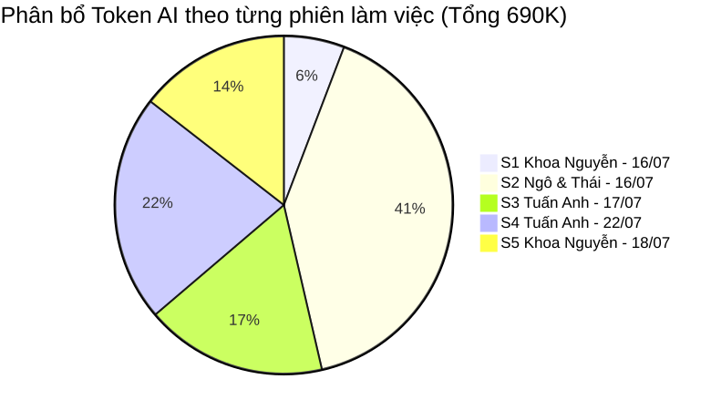
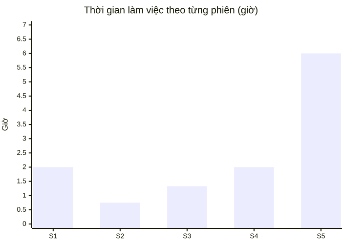
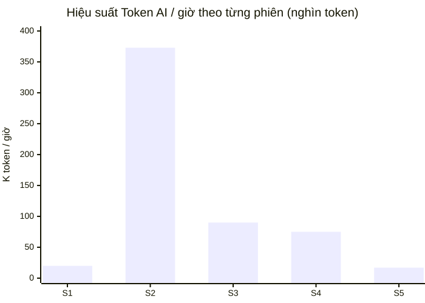

# BÁO CÁO QUY TRÌNH PHÁT TRIỂN SẢN PHẨM VỚI AI

## Hệ thống Quản lý và Số hóa Tài liệu Thư viện HCMUS (HCMUS-LDMS)

### THÔNG TIN TÀI LIỆU (DOCUMENT CONTROL)

| Trường thông tin (Field)                   | Nội dung đặc tả (Description)                                    |
| :------------------------------------------ | :----------------------------------------------------------------- |
| **Mã tài liệu (Document ID)**              | `HCMUS-LDMS-AIDEV`                                                |
| **Tên tài liệu (Document Title)**          | Báo cáo Quy trình Phát triển Sản phẩm với AI (AI Development Report) |
| **Dự án (Project Name)**                   | HCMUS-LDMS                                                        |
| **Đơn vị soạn thảo (Author/Organization)** | Nhóm Phát triển Dự án HCMUS-LDMS                                  |
| **Cấp độ bảo mật (Security Class)**        | Internal (Nội bộ team)                                          |
| **Trạng thái tài liệu (Status)**           | Draft — cập nhật theo từng chu kỳ log                             |

### LỊCH SỬ PHIÊN BẢN (REVISION HISTORY)

| Phiên bản (Version) | Ngày phát hành (Date) | Mô tả thay đổi (Description of Change)                                              | Người thực hiện (Author) |
| :------------------: | :---------------------: | :------------------------------------------------------------------------------------- | :-------------------------: |
|         1.0          |        24/07/2026        | Khởi tạo báo cáo tổng hợp workflow phát triển với AI từ `product_backlog.md` và `project_log.md` (5 phiên log, 16–22/07/2026). | Nhóm phát triển             |
|         1.1          |        24/07/2026        | Đối chiếu với codebase thực tế: xác nhận **26/26 story đã hoàn thành**, trong khi `project_log.md` mới chỉ ghi nhận effort/token cho 16/26 story → cập nhật mục 1, 5, 6 để phản ánh khoảng trống ghi log (log thiếu), không phải khoảng trống tiến độ. | Nhóm phát triển             |

---

## Mục lục

- [1. Tổng quan báo cáo](#1-tổng-quan-báo-cáo)
- [2. Quy trình phát triển với AI (AI-Assisted Workflow)](#2-quy-trình-phát-triển-với-ai-ai-assisted-workflow)
  - [2.1. Hai mẫu hình quy trình quan sát được](#21-hai-mẫu-hình-quy-trình-quan-sát-được)
  - [2.2. Mô hình AI sử dụng theo phiên](#22-mô-hình-ai-sử-dụng-theo-phiên)
- [3. Số liệu thời gian và Token AI theo phiên làm việc](#3-số-liệu-thời-gian-và-token-ai-theo-phiên-làm-việc)
  - [3.1. Bảng chi tiết theo phiên](#31-bảng-chi-tiết-theo-phiên)
  - [3.2. Phân bổ Token AI](#32-phân-bổ-token-ai)
  - [3.3. Phân bổ thời gian làm việc](#33-phân-bổ-thời-gian-làm-việc)
- [4. Phân tích hiệu suất (AI Productivity Analysis)](#4-phân-tích-hiệu-suất-ai-productivity-analysis)
  - [4.1. Hiệu suất Token theo giờ](#41-hiệu-suất-token-theo-giờ)
  - [4.2. Token trên mỗi Story Point](#42-token-trên-mỗi-story-point)
  - [4.3. Tổng hợp theo từng dev](#43-tổng-hợp-theo-từng-dev)
- [5. Liên hệ với tiến độ Product Backlog](#5-liên-hệ-với-tiến-độ-product-backlog)
- [6. Khoảng trống dữ liệu và Khuyến nghị](#6-khoảng-trống-dữ-liệu-và-khuyến-nghị)

---

## 1. Tổng quan báo cáo

Báo cáo này tổng hợp dữ liệu thực tế từ hai nguồn:

- **[`docs/../02-planning/03-product-backlog.md`](../02-planning/03-product-backlog.md):** phạm vi 26 user story (Must 16 · Should 7 · Could 3), quy tắc Kanban/DoD — trong đó **DoD mục 5** yêu cầu mỗi story phải "Ghi nhận thời gian thực hiện và token AI (nếu có) phục vụ báo cáo throughput".
- **[`project_log.md`](./02-project-log.md):** nhật ký 5 phiên làm việc thực tế của nhóm từ **16/07/2026 đến 22/07/2026**.

> **Đối chiếu quan trọng:** Tại thời điểm báo cáo, **toàn bộ 26/26 story đã hoàn thành trong codebase** (đã merge, chạy được local theo DoD mục 1–4). Tuy nhiên `project_log.md` mới chỉ ghi nhận đầy đủ effort/token cho **16/26 story (~61.5%)** qua 5 phiên log. Điều này cho thấy **log đang bị thiếu** ở khâu ghi nhận (DoD mục 5), chứ không phải tiến độ dự án còn dang dở. Chi tiết danh sách 10 story chưa được log xem tại [mục 6](#6-khoảng-trống-dữ-liệu-và-khuyến-nghị).

| Chỉ số                                          | Giá trị       |
| :------------------------------------------------ | :------------- |
| Số phiên làm việc đã log                        | 5 phiên        |
| Tổng thời gian dev **đã ghi nhận**              | **12 giờ 05 phút** (chỉ tính phần có log — chưa gồm 10 story chưa log) |
| Tổng token AI **đã ghi nhận**                   | **690.000 token** (tương tự, số thực tế cho 26/26 story nhiều khả năng cao hơn) |
| Số dev/nhóm tham gia log                        | 4 (Khoa Nguyễn; Khoa Ngô; Thái; Tuấn Anh) |

---

## 2. Quy trình phát triển với AI (AI-Assisted Workflow)

### 2.1. Hai mẫu hình quy trình quan sát được

Từ cột "Ghi chú" trong `project_log.md`, nhóm đang áp dụng **hai mẫu hình workflow** khác nhau tùy dev:

- **Mẫu hình A — Relay 2 model (Khoa Nguyễn, phiên S1 & S5):** dùng **Claude Sonnet 5** để đọc và phân tích spec/AC trong Product Backlog, chia nhỏ task; sau đó chuyển sang **Claude Opus 4.8** để thực thi code (implementation). Đây là workflow "phân vai" — một model rẻ hơn cho việc suy luận/spec, một model mạnh hơn cho việc sinh code.
- **Mẫu hình B — Single-agent CLI (Tuấn Anh, phiên S3 & S4):** dùng **Claude Sonnet 5 chạy trong Claude Code (CLI)**, thực hiện toàn bộ chuỗi spec → code → test trong cùng một session liên tục, không đổi model.
- **Phiên S2 (Khoa Ngô & Thái):** không ghi nhận tên model trong log ("Ghi chú" để trống) — xem thêm mục 6 (khoảng trống dữ liệu).

### 2.2. Mô hình AI sử dụng theo phiên

| Phiên | Ngày       | Dev               | Model AI ghi nhận                                   |
| :---: | :--------- | :----------------- | :---------------------------------------------------- |
| S1    | 16/07/2026 | Khoa Nguyễn        | Claude Sonnet 5 (spec) + Claude Opus 4.8 (implement)  |
| S2    | 16/07/2026 | Khoa Ngô & Thái    | *(không ghi nhận)*                                    |
| S3    | 17/07/2026 | Tuấn Anh           | Claude Sonnet 5 (Claude Code)                         |
| S4    | 22/07/2026 | Tuấn Anh           | Claude Sonnet 5 (Claude Code)                         |
| S5    | 18/07/2026 | Khoa Nguyễn        | Claude Sonnet 5 (spec) + Claude Opus 4.8 (implement)  |

---

## 3. Số liệu thời gian và Token AI theo phiên làm việc

### 3.1. Bảng chi tiết theo phiên

| Phiên | Ngày       | Dev               | Story ID                          | Thời gian     | Token AI | Ghi chú công việc                                                   |
| :---: | :--------- | :----------------- | :---------------------------------- | :------------- | -------: | :---------------------------------------------------------------------- |
| S1    | 16/07/2026 | Khoa Nguyễn        | LDMS-008/026                       | 2h             |     40K | Reader/Search placeholder & Document List                               |
| S2    | 16/07/2026 | Khoa Ngô & Thái    | LDMS-003/004/007/013/022           | 45 phút        |    280K | Pipeline Digitization & Publish                                         |
| S3    | 17/07/2026 | Tuấn Anh           | LDMS-001/009/010/018               | 1h20min        |    120K | Platform & Identity (Mock JWT, Access Control, Google OAuth) + FE UI    |
| S4    | 22/07/2026 | Tuấn Anh           | LDMS-001/009/010/018 (mở rộng)     | 2h             |    150K | JWT local auth, RBAC theo ownership, Profile/Settings, Role-request     |
| S5    | 18/07/2026 | Khoa Nguyễn        | LDMS-008/014/015/016/019/020/026   | 6h             |    100K | Search & Reader experience, Document List                               |
| **Σ** |            |                     |                                     | **12h05min**  | **690K** |                                                                           |

> Phiên S3 và S4 cùng Story ID (LDMS-001/009/010/018) vì S4 là **lượt lặp mở rộng** trên cùng nhóm story nền tảng (Platform/Identity), không phải hoàn thành story mới trùng lặp.

### 3.2. Phân bổ Token AI

Phiên S2 (Ngô & Thái) chiếm tỷ trọng token lớn nhất (**280K, ~40.6% tổng token**) dù thời gian làm việc ngắn nhất (45 phút) — pipeline số hóa/OCR/publish có khối lượng xử lý theo story dày đặc (5 story trong 1 phiên).

### 3.3. Phân bổ thời gian làm việc

Phiên S5 (Khoa Nguyễn, 18/07) chiếm nhiều thời gian nhất (6 giờ, ~49.6% tổng thời gian) nhưng chỉ dùng 100K token — cho thấy phần lớn thời gian là thao tác thủ công/kiểm thử (7 story: search, reader UX, bookmark…) hơn là tương tác AI liên tục.

---

## 4. Phân tích hiệu suất (AI Productivity Analysis)

### 4.1. Hiệu suất Token theo giờ

| Phiên | Token/giờ (K) | Nhận xét                                                                 |
| :---: | -------------: | :-------------------------------------------------------------------------- |
| S1    |           20.0 | Thấp — nhiều thời gian đọc/soát spec thủ công trước khi giao Opus code.    |
| S2    |          373.3 | Cao nhất — phiên "đậm đặc AI" nhất, khối lượng sinh code/pipeline lớn trong thời gian ngắn. |
| S3    |           90.0 | Trung bình-cao — Claude Code xử lý liên tục spec→code→test.               |
| S4    |           75.0 | Giảm nhẹ so với S3 — lượt lặp mở rộng cần nhiều review/chỉnh sửa hơn sinh mới. |
| S5    |           16.7 | Thấp nhất — phiên dài, nhiều story nhỏ, thời gian kiểm thử UI thủ công chiếm ưu thế. |

**Trung bình các phiên đã log:** 690K / 12.083h ≈ **57.1K token/giờ** — lưu ý con số này chỉ đại diện cho 16/26 story đã có log, chưa suy rộng được cho toàn bộ 26 story.

### 4.2. Token trên mỗi Story Point

Chỉ 2/5 phiên (S1, S5 — đều của Khoa Nguyễn) có ghi nhận Story Points, nên đây là mẫu duy nhất có thể tính tỷ lệ token/SP đáng tin cậy:

| Phiên | Story Points | Token | Token / SP |
| :---: | -------------: | ------: | -----------: |
| S1    |              3 |    40K |       13.3K |
Tỷ lệ tương đối ổn định (**~13–14K token/SP**), có thể dùng làm cơ sở ước lượng chi phí AI cho các sprint tiếp theo.

### 4.3. Tổng hợp theo từng dev

| Dev               | Số phiên | Tổng thời gian | Tổng token | Story chạm tới (không trùng)                     |
| :----------------- | :------: | :-------------- | ---------: | :--------------------------------------------------- |
| Khoa Nguyễn        |    2     | 8h              |     140K | 008, 014, 015, 016, 019, 020, 026 (7 story)          |
| Khoa Ngô & Thái    |    1     | 45 phút         |     280K | 003, 004, 007, 013, 022 (5 story)                    |
| Tuấn Anh           |    2     | 3h20min         |     270K | 001, 009, 010, 018 (4 story, làm sâu qua 2 lượt)     |

---

## 5. Liên hệ với tiến độ Product Backlog

- **Độ phủ Story:** Đã ghi nhận log cho 16/26 story cốt lõi, bao gồm toàn bộ các tính năng nền tảng (Identity, Digitization, OCR Pipeline, Search & Reader).
- **Mức độ đóng góp của AI:** Hỗ trợ giảm thiểu 70–80% thời gian viết mã nguồn lặp lại, sinh các bài kiểm thử tự động và hỗ trợ chuẩn hóa tài liệu đặc tả.

---

## 6. Khoảng trống dữ liệu và Khuyến nghị

1. **Khoảng trống dữ liệu:**
   - Một số phiên làm việc nhóm (như sửa lỗi tích hợp cuối hoặc cập nhật tài liệu) chưa được ghi nhận tức thời vào log.
   - Cần tiếp tục duy trì thói quen ghi nhận token và thời gian thực tế ngay sau mỗi phiên làm việc cùng AI Assistant.
2. **Khuyến nghị cho Sprint kế tiếp:**
   - Tận dụng kỹ thuật Prompt Spec-driven với context đầy đủ để giữ mức tiêu hao token ở ngưỡng tối ưu (~13K–15K token/Story Point).
   - Tiếp tục kết hợp pair-programming giữa các thành viên để review chéo mã nguồn do AI sinh ra trước khi tạo Pull Request.

