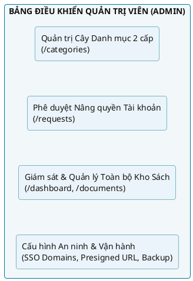
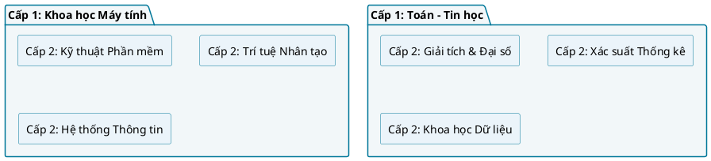
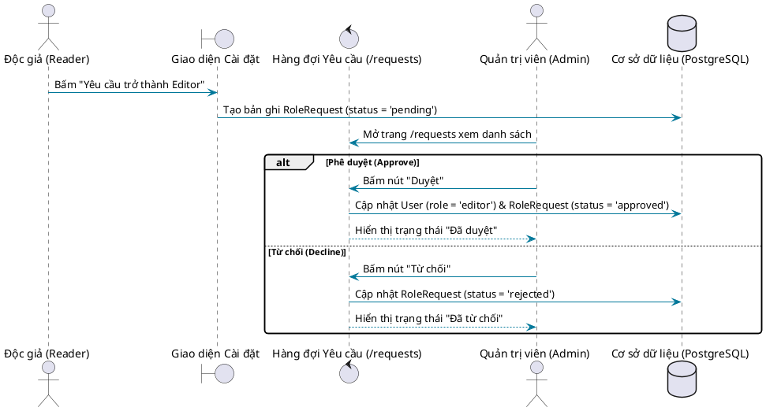

# CẨM NANG HƯỚNG DẪN QUẢN TRỊ HỆ THỐNG — DÀNH CHO QUẢN TRỊ VIÊN (ADMIN)

## Hệ thống Quản lý và Số hóa Tài liệu Thư viện HCMUS (HCMUS-LDMS)

### THÔNG TIN TÀI LIỆU (DOCUMENT CONTROL)

| Trường thông tin (Field) | Nội dung đặc tả (Description) |
| :--- | :--- |
| **Mã tài liệu (Document ID)** | `HCMUS-LDMS-UG-ADMIN` |
| **Tên tài liệu (Document Title)** | Cẩm nang Hướng dẫn Quản trị Hệ thống (Administrator User Guide) |
| **Dự án (Project Name)** | Hệ thống Quản lý và Số hóa Tài liệu Thư viện HCMUS (HCMUS-LDMS) |
| **Đơn vị soạn thảo (Author/Organization)** | Nhóm Phát triển Dự án HCMUS-LDMS |
| **Người phụ trách biên soạn** | Ngô Nguyễn Thế Khoa (MSSV: 23127065) |
| **Cấp độ bảo mật (Security Class)** | Confidential / System Administrators (Quản trị viên Hệ thống) |
| **Trạng thái tài liệu (Status)** | Phát hành chính thức (Active) |

### LỊCH SỬ PHIÊN BẢN (REVISION HISTORY)

| Phiên bản (Version) | Ngày phát hành (Date) | Mô tả thay đổi (Description of Change) | Người thực hiện (Author) |
| :---: | :---: | :--- | :---: |
| 1.0 | 21/08/2026 | Khởi tạo cẩm nang hướng dẫn quản trị toàn diện cho Quản trị viên (Admin): Quản trị cây danh mục tài liệu 2 cấp, Phân quyền người dùng (RBAC), Phê duyệt yêu cầu nâng quyền và Kiểm soát an ninh kho học liệu số. | Ngô Nguyễn Thế Khoa |

---

## Mục lục

- [1. Giới thiệu Vai trò & Quyền hạn Quản trị viên](#1-giới-thiệu-vai-trò--quyền-hạn-quản-trị-viên)
- [2. Ma trận Phân quyền Người dùng (RBAC Matrix)](#2-ma-trận-phân-quyền-người-dùng-rbac-matrix)
- [3. Quản trị Cây Danh mục Tài liệu 2 cấp (Category Taxonomy)](#3-quản-trị-cây-danh-mục-tài-liệu-2-cấp-category-taxonomy)
  - [3.1 Mô hình danh mục phân cấp 2 tầng](#31-mô-hình-danh-mục-phân-cấp-2-tầng)
  - [3.2 Tạo mới Danh mục Cấp 1 và Cấp 2](#32-tạo-mới-danh-mục-cấp-1-và-cấp-2)
  - [3.3 Đổi tên và Chỉnh sửa Danh mục](#33-đổi-tên-và-chỉnh-sửa-danh-mục)
  - [3.4 Xóa Danh mục và Ràng buộc Toàn vẹn Dữ liệu](#34-xóa-danh-mục-và-ràng-buộc-toàn-vẹn-dữ-liệu)
- [4. Quản lý Tài khoản & Phê duyệt Nâng quyền (Role Requests)](#4-quản-lý-tài-khoản--phê-duyệt-nâng-quyền-role-requests)
  - [4.1 Luồng xét duyệt quyền Biên tập viên (Reader -> Editor)](#41-luồng-xét-duyệt-quyền-biên-tập-viên-reader---editor)
  - [4.2 Thao tác Phê duyệt (Approve) và Từ chối (Decline)](#42-thao-tác-phê-duyệt-approve-và-từ-chối-decline)
  - [4.3 Thu hồi và Điều chỉnh quyền tài khoản](#43-thu-hồi-và-điều-chỉnh-quyền-tài-khoản)
- [5. Giám sát & Quản lý Kho Tài liệu Toàn hệ thống](#5-giám-sát--quản-lý-kho-tài-liệu-toàn-hệ-thống)
  - [5.1 Quyền can thiệp đặc quyền (Admin Override)](#51-quyền-can-thiệp-đặc-quyền-admin-override)
  - [5.2 Kiểm duyệt chất lượng sách trước khi phát hành](#52-kiểm-duyệt-chất-lượng-sách-trước-khi-phát-hành)
  - [5.3 Giám sát Hàng đợi OCR & Cưỡng chế chạy lại (Force Retry)](#53-giám-sát-hàng-đợi-ocr--cưỡng-chế-chạy-lại-force-retry)
- [6. Cấu hình Vận hành, An toàn Thông tin & Bảo mật](#6-cấu-hình-vận-hành-an-toàn-thông-tin--bảo-mật)
  - [6.1 Quản lý tên miền cho phép xác thực (Allowed SSO Domains)](#61-quản-lý-tên-miền-cho-phép-xác-thực-allowed-sso-domains)
  - [6.2 Kiểm soát thời gian sống của Presigned URL (MinIO Security)](#62-kiểm-soát-thời-gian-sống-của-presigned-url-minio-security)
  - [6.3 Quy trình Sao lưu & Phục hồi Dữ liệu (Backup & Disaster Recovery)](#63-quy-trình-sao-lưu--phục-hồi-dữ-liệu-backup--disaster-recovery)
- [7. Xử lý Sự cố Vận hành Thường gặp (Admin Troubleshooting)](#7-xử-lý-sự-cố-vận-hành-thường-gặp-admin-troubleshooting)

---

## 1. Giới thiệu Vai trò & Quyền hạn Quản trị viên

Trong hệ thống HCMUS-LDMS, **Quản trị viên (Administrator)** là người nắm giữ quyền hạn quản trị cao nhất, chịu trách nhiệm trực tiếp trước Ban Giám hiệu và Ban Giám đốc Thư viện về:
1. **Kiến trúc tri thức:** Xây dựng và duy trì cây phân loại danh mục sách (Taxonomy) 2 cấp cho toàn trường.
2. **Kiểm soát truy cập & Phân quyền (Access Governance):** Xét duyệt các yêu cầu cấp quyền biên tập viên, bảo vệ an toàn thông tin tài khoản.
3. **Bảo đảm chất lượng ấn phẩm số:** Giám sát toàn bộ tiến trình số hóa, can thiệp xử lý lỗi OCR và phê duyệt phát hành tài liệu chuẩn mực.
4. **An toàn & Bảo mật hệ thống:** Thiết lập các chính sách bảo vệ tài nguyên học liệu số (DRM qua Signed URL, bảo mật JWT, giới hạn domain SSO).



---

## 2. Ma trận Phân quyền Người dùng (RBAC Matrix)

Hệ thống HCMUS-LDMS áp dụng mô hình phân quyền dựa trên vai trò kết hợp quyền sở hữu tài nguyên (**RBAC with Resource Ownership**):

| Chức năng / Màn hình | Đường dẫn Route | Reader | Editor (Chính chủ) | Editor (Khác chủ) | Admin (Quản trị viên) |
| :--- | :--- | :---: | :---: | :---: | :---: |
| **Trang chủ / Tải lên tài liệu** | `/` | Không | Cho phép | Cho phép | Cho phép |
| **Dashboard theo dõi OCR** | `/dashboard` | Không | Cho phép | Cho phép | Cho phép |
| **Duyệt danh sách tài liệu** | `/documents` | Cho phép | Cho phép | Cho phép | Cho phép |
| **Split-screen Viewer (Xem)** | `/documents/:id` | Chỉ đọc | Toàn quyền | Chỉ đọc | Toàn quyền |
| **Hiệu chỉnh văn bản OCR** | API `/pages/:page` | Không | Chỉnh sửa | Không | Chỉnh sửa |
| **Sửa Metadata & Gắn Tags** | API `/documents/:id` | Không | Chỉnh sửa | Không | Chỉnh sửa |
| **Xuất bản sách EPUB** | API `/publish` | Không | Thực hiện | Không | Thực hiện |
| **Đọc sách EPUB trực tuyến** | `/reader/:id` | Cho phép | Cho phép | Cho phép | Cho phép |
| **Tạo Highlight & Ghi chú** | API `/highlights` | Cá nhân | Cá nhân | Cá nhân | Cá nhân |
| **Quản trị Cây Danh mục 2 cấp** | `/categories` | Không | Không | Không | Toàn quyền |
| **Duyệt Yêu cầu Nâng quyền** | `/requests` | Không | Không | Không | Toàn quyền |

---

## 3. Quản trị Cây Danh mục Tài liệu 2 cấp (Category Taxonomy)

Giao diện Quản trị Danh mục nằm tại đường dẫn `/categories` (bảo vệ bởi thành phần `RequireRole roles={['admin']}`).



### 3.1 Mô hình danh mục phân cấp 2 tầng

Để đơn giản hóa việc tra cứu và tránh ma trận phân loại quá sâu gây nhầm lẫn cho bạn đọc, HCMUS-LDMS quy định cấu trúc chuẩn **tối đa 2 cấp**:
* **Cấp 1 (Root Category):** Đại diện cho Khoa hoặc Khối kiến thức nền tảng (ví dụ: *Khoa học Máy tính*, *Toán - Tin học*, *Vật lý học*, *Hóa học*).
* **Cấp 2 (Child Category):** Đại diện cho Chuyên ngành hoặc Bộ môn trực thuộc (ví dụ: *Kỹ thuật Phần mềm*, *Khoa học Dữ liệu*, *Hệ thống Thông tin*, *Quang học*).

### 3.2 Tạo mới Danh mục Cấp 1 và Cấp 2

1. Tại khung **"Tạo category"** (`category-create-card`):
2. **Trường hợp 1: Tạo Danh mục Cấp 1 (Khoa/Khối ngành):**
   * Nhập tên danh mục vào ô **"Tên category"** (ví dụ: `Khoa học Máy tính`).
   * Tại ô chọn **"Category cha"**, giữ nguyên tùy chọn: `Không có — tạo cấp 1`.
   * Bấm nút **"Tạo category"**.
3. **Trường hợp 2: Tạo Danh mục Cấp 2 (Chuyên ngành con):**
   * Nhập tên danh mục con (ví dụ: `Kỹ thuật Phần mềm`).
   * Tại ô chọn **"Category cha"**, chọn danh mục cha tương ứng từ danh sách (ví dụ: chọn `Khoa học Máy tính`).
   * Bấm nút **"Tạo category"**.
4. Hệ thống sẽ tự động cập nhật và hiển thị danh mục mới trên cây phân cấp ngay bên dưới.

### 3.3 Đổi tên và Chỉnh sửa Danh mục

1. Trong phân vùng **"Cây category"** (`category-tree-card`), tìm đến danh mục cần thay đổi.
2. Nhấp vào nút **"Đổi tên [Tên category]"**.
3. Một hộp thoại prompt xuất hiện với tên danh mục hiện tại.
4. Quản trị viên nhập tên mới (ví dụ: sửa `Kỹ thuật Phần mềm` thành `Công nghệ Phần mềm`) -> Bấm **OK**.
5. Tên mới sẽ được cập nhật đồng bộ trong toàn bộ cơ sở dữ liệu. Tất cả các cuốn sách đã gán vào danh mục này sẽ tự động hiển thị theo tên mới mà không bị đứt gãy quan hệ dữ liệu.

### 3.4 Xóa Danh mục và Ràng buộc Toàn vẹn Dữ liệu

1. Nhấp vào nút màu đỏ **"Xóa [Tên category]"**.
2. Trình duyệt hiển thị cảnh báo xác nhận: *"Xóa category “[Tên category]”?*
3. Bấm **OK** để xác nhận xóa.
4. **Quy tắc an toàn dữ liệu (Data Safety Rule):**
   * Khi xóa một danh mục cấp 1, nếu có các danh mục con trực thuộc, quản trị viên nên dọn dẹp hoặc chuyển đổi các danh mục con trước đó.
   * Các tài liệu từng được gán vào danh mục bị xóa sẽ tự động chuyển trường `category_id` về giá trị `null` (Chưa gán category) để không làm mất tài liệu.

---

## 4. Quản lý Tài khoản & Phê duyệt Nâng quyền (Role Requests)

Hệ thống quản lý chặt chẽ việc cấp quyền tải lên và chỉnh sửa tài liệu nhằm bảo vệ an toàn kho học liệu số của trường.

### 4.1 Luồng xét duyệt quyền Biên tập viên (Reader -> Editor)

Khi một sinh viên hỗ trợ nghiên cứu hoặc giảng viên mới đăng ký tài khoản, họ có quyền mặc định là `reader`. Để trở thành `editor`, họ sẽ gửi một yêu cầu nâng quyền từ trang Cài đặt cá nhân.

Yêu cầu này sẽ được đưa vào hàng đợi quản trị tại trang **"Yêu cầu nâng quyền"** (`/requests`).



### 4.2 Thao tác Phê duyệt (Approve) và Từ chối (Decline)

1. Truy cập mục **"Yêu cầu"** (`/requests`) trên thanh điều hướng.
2. Bảng quản trị hiển thị danh sách tất cả các yêu cầu cùng thông tin chi tiết:
   * **Người dùng:** Tên Username và địa chỉ Email của người gửi.
   * **Quyền yêu cầu:** Mặc định là `editor`.
   * **Trạng thái:** Huy hiệu trạng thái `Đang chờ` (`pending`), `Đã duyệt` (`approved`), hoặc `Đã từ chối` (`rejected`).
   * **Ngày gửi:** Thời điểm gửi yêu cầu theo định dạng ngày/tháng/năm.
3. Đối với các yêu cầu đang ở trạng thái `Đang chờ` (`pending`):
   * **Phê duyệt (Approve):** Bấm nút xanh **"Duyệt"**. Hệ thống ngay lập tức nâng quyền người dùng lên `editor` trong bảng `users`. Người dùng sẽ thấy menu *Dashboard OCR* và nút *Tải lên* ngay trong phiên làm việc tiếp theo.
   * **Từ chối (Decline):** Bấm nút đỏ **"Từ chối"**. Trạng thái chuyển thành `rejected`. Người dùng vẫn giữ quyền `reader` và có thể gửi lại yêu cầu khi có thông tin bổ sung.

### 4.3 Thu hồi và Điều chỉnh quyền tài khoản

Trong trường hợp cần thu hồi quyền Editor (ví dụ: sinh viên đã tốt nghiệp hoặc kết thúc đợt cộng tác số hóa), Quản trị viên có thể thực hiện thông qua công cụ dòng lệnh quản trị backend hoặc API quản trị người dùng để đặt lại `role = 'reader'`.

---

## 5. Giám sát & Quản lý Kho Tài liệu Toàn hệ thống

### 5.1 Quyền can thiệp đặc quyền (Admin Override)

Khác với Biên tập viên chỉ có quyền sửa các tài liệu do chính mình tải lên, Quản trị viên (`admin`) có đặc quyền can thiệp vào **bất kỳ tài liệu nào** trong hệ thống:
* Có thể mở bất kỳ tài liệu nào trên trang **Tài liệu đã scan** (`/documents/:documentId`).
* Có quyền trực tiếp sửa văn bản OCR từng trang, sửa Metadata Dublin Core, thêm/xóa Tags và bấm Xuất bản EPUB cho bất kỳ tài liệu nào mà không bị giới hạn bởi quyền sở hữu (`owner_id`).

### 5.2 Kiểm duyệt chất lượng sách trước khi phát hành

Trước khi một cuốn sách giáo trình được đưa vào phục vụ giảng dạy chính thức cho sinh viên, Quản trị viên cần thực hiện quy trình kiểm tra chất lượng (Quality Assurance Checklist):
* [ ] Kiểm tra tiêu đề sách (**Title**) và tác giả (**Author**) có khớp chính xác với bìa sách gốc không.
* [ ] Kiểm tra vị trí kệ sách vật lý (**Shelf Location**) đã được điền đúng quy chuẩn phòng đọc chưa.
* [ ] Đảm bảo sách đã được gán vào đúng Chuyên ngành trong cây **Category**.
* [ ] Mở giao diện **Reader** để đọc thử một số trang, kiểm tra độ sắc nét của bảng biểu và tính mượt mà của tính năng tìm kiếm FTS.

### 5.3 Giám sát Hàng đợi OCR & Cưỡng chế chạy lại (Force Retry)

Trên trang **Dashboard OCR** (`/dashboard`):
* Quản trị viên theo dõi tổng số lượng tài liệu đang xử lý trong toàn trường.
* Nếu phát hiện một tài liệu có trạng thái `failed` do sự cố mạng đột xuất giữa API và MinIO:
  * Quản trị viên bấm nút **"Thử lại"** (`Retry`) để kích hoạt lại hàng đợi xử lý mà không cần nhờ đến biên tập viên tải lại file.

---

## 6. Cấu hình Vận hành, An toàn Thông tin & Bảo mật

### 6.1 Quản lý tên miền cho phép xác thực (Allowed SSO Domains)

Hệ thống bảo vệ tài nguyên nội bộ bằng cách giới hạn các tài khoản Google SSO được phép đăng nhập:
* Cấu hình trong biến môi trường backend: `GOOGLE_ALLOWED_DOMAINS=hcmus.edu.vn,clc.fit.hcmus.edu.vn`.
* Bất kỳ nỗ lực đăng nhập nào sử dụng tài khoản Gmail cá nhân thông thường (không thuộc các domain giáo dục được cấp phép) sẽ bị từ chối với mã lỗi `403 Forbidden`.

### 6.2 Kiểm soát thời gian sống của Presigned URL (MinIO Security)

* Nhằm ngăn chặn hành vi trích xuất link và chia sẻ trái phép các tệp EPUB ra bên ngoài khuôn viên trường, backend luôn cấp phát đường link đọc sách có chữ ký số (Presigned URL) với thời gian hết hạn nghiêm ngặt là **15 phút (900 giây)**.
* Quản trị viên tuyệt đối không cấu hình MinIO bucket `documents` ở chế độ `public-read`.

### 6.3 Quy trình Sao lưu & Phục hồi Dữ liệu (Backup & Disaster Recovery)

Quản trị viên thực hiện lịch trình sao lưu định kỳ theo khuyến nghị của tài liệu vận hành:
1. **Cơ sở dữ liệu PostgreSQL:**
   * Chạy lệnh sao lưu schema và dữ liệu hàng ngày:
     ```bash
     docker compose exec postgres pg_dump -U postgres hcmus_ldms > backup_$(date +%Y%m%d).sql
     ```
2. **Kho tệp MinIO Object Storage:**
   * Đồng bộ toàn bộ dữ liệu bucket sang thiết bị lưu trữ thứ hai bằng công cụ MinIO Client (`mc mirror`).

---

## 7. Xử lý Sự cố Vận hành Thường gặp (Admin Troubleshooting)

### Q1: Người dùng báo đã được duyệt quyền Editor nhưng vẫn không thấy trang Tải lên?
* **Nguyên nhân:** Trình duyệt của người dùng vẫn đang lưu giữ mã JWT Token cũ trong `localStorage`.
* **Cách khắc phục:** Hướng dẫn người dùng Đăng xuất (Logout) và Đăng nhập lại để hệ thống cấp mới JWT Token chứa thông tin vai trò `editor` đã cập nhật.

### Q2: Các job OCR bị dừng hoặc dồn ứ ở trạng thái `pending` quá lâu?
* **Nguyên nhân:** Tiến trình xử lý nền bị nghẽn tài nguyên CPU khi có nhiều tệp PDF lớn (hàng trăm trang) được tải lên cùng một thời điểm.
* **Cách khắc phục:** Kiểm tra mức tiêu thụ CPU/RAM của container `api` qua lệnh `docker stats`. Có thể tăng thêm giới hạn tài nguyên CPU trong `docker-compose.yml` và khởi động lại dịch vụ.

### Q3: Muốn thêm một miền email mới (ví dụ trường đối tác nghiên cứu) vào danh sách SSO thì làm thế nào?
* **Cách khắc phục:** Mở tệp `.env` tại thư mục backend, bổ sung miền mới vào biến `GOOGLE_ALLOWED_DOMAINS` (phân cách bằng dấu phẩy, ví dụ: `hcmus.edu.vn,clc.fit.hcmus.edu.vn,partner.edu.vn`), sau đó khởi động lại container backend.
