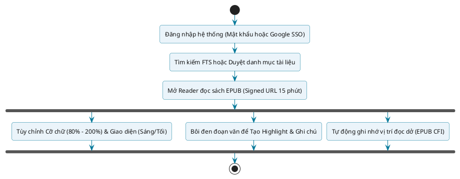
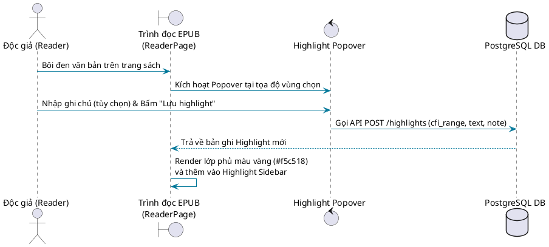

# CẨM NANG HƯỚNG DẪN SỬ DỤNG HỆ THỐNG — DÀNH CHO ĐỘC GIẢ (READER)

## Hệ thống Quản lý và Số hóa Tài liệu Thư viện HCMUS (HCMUS-LDMS)

### THÔNG TIN TÀI LIỆU (DOCUMENT CONTROL)

| Trường thông tin (Field) | Nội dung đặc tả (Description) |
| :--- | :--- |
| **Mã tài liệu (Document ID)** | `HCMUS-LDMS-UG-READER` |
| **Tên tài liệu (Document Title)** | Cẩm nang Hướng dẫn Sử dụng dành cho Độc giả (Reader User Guide) |
| **Dự án (Project Name)** | Hệ thống Quản lý và Số hóa Tài liệu Thư viện HCMUS (HCMUS-LDMS) |
| **Đơn vị soạn thảo (Author/Organization)** | Nhóm Phát triển Dự án HCMUS-LDMS |
| **Người phụ trách biên soạn** | Ngô Nguyễn Thế Khoa (MSSV: 23127065) |
| **Cấp độ bảo mật (Security Class)** | Public / Internal Readers (Độc giả Thư viện) |
| **Trạng thái tài liệu (Status)** | Phát hành chính thức (Active) |

### LỊCH SỬ PHIÊN BẢN (REVISION HISTORY)

| Phiên bản (Version) | Ngày phát hành (Date) | Mô tả thay đổi (Description of Change) | Người thực hiện (Author) |
| :---: | :---: | :--- | :---: |
| 1.0 | 21/08/2026 | Khởi tạo cẩm nang hướng dẫn sử dụng chi tiết cho nhóm người dùng Độc giả (Reader): Tìm kiếm toàn văn (FTS), Đọc sách EPUB responsive, Tùy biến giao diện & Highlight/Ghi chú học tập. | Ngô Nguyễn Thế Khoa |

---

## Mục lục

- [1. Giới thiệu Tổng quan & Quyền hạn Độc giả](#1-giới-thiệu-tổng-quan--quyền-hạn-độc-giả)
- [2. Đăng ký, Đăng nhập & Quản lý Tài khoản](#2-đăng-ký-đăng-nhập--quản-lý-tài-khoản)
  - [2.1 Đăng ký tài khoản nội bộ](#21-đăng-ký-tài-khoản-nội-bộ)
  - [2.2 Đăng nhập hệ thống (Mật khẩu & Google SSO)](#22-đăng-nhập-hệ-thống-mật-khẩu--google-sso)
  - [2.3 Quản lý Hồ sơ cá nhân & Đổi mật khẩu](#23-quản-lý-hồ-sơ-cá-nhân--đổi-mật-khẩu)
  - [2.4 Gửi yêu cầu nâng quyền lên Biên tập viên (Editor)](#24-gửi-yêu-cầu-nâng-quyền-lên-biên-tập-viên-editor)
- [3. Tra cứu & Khám phá Tài liệu Thư viện](#3-tra-cứu--khám-phá-tài-liệu-thư-viện)
  - [3.1 Duyệt kho tài liệu đã số hóa](#31-duyệt-kho-tài-liệu-đã-số-hóa)
  - [3.2 Tìm kiếm toàn văn (Full-Text Search - FTS)](#32-tìm-kiếm-toàn-văn-full-text-search---fts)
  - [3.3 Xem trích đoạn ngữ cảnh nổi bật](#33-xem-trích-đoạn-ngữ-cảnh-nổi-bật)
- [4. Trải nghiệm Đọc sách EPUB trên Trình duyệt](#4-trải-nghiệm-đọc-sách-epub-trên-trình-duyệt)
  - [4.1 Mở sách và không gian đọc trực tuyến](#41-mở-sách-và-không-gian-đọc-trực-tuyến)
  - [4.2 Điều hướng và lật trang](#42-điều-hướng-và-lật-trang)
  - [4.3 Cơ chế Tự động đánh dấu vị trí đọc dở (Auto-bookmarking)](#43-cơ-chế-tự-động-đánh-dấu-vị-trí-đọc-dở-auto-bookmarking)
- [5. Tùy chỉnh Giao diện & Trải nghiệm Đọc](#5-tùy-chỉnh-giao-diện--trải-nghiệm-đọc)
  - [5.1 Điều chỉnh kích thước cỡ chữ](#51-điều-chỉnh-kích-thước-cỡ-chữ)
  - [5.2 Chuyển đổi Giao diện Sáng / Tối (Light/Dark Theme)](#52-chuyển-đổi-giao-diện-sáng--tối-lightdark-theme)
  - [5.3 Cơ chế lưu trữ cấu hình cá nhân](#53-cơ-chế-lưu-trữ-cấu-hình-cá-nhân)
- [6. Đánh dấu (Highlight) & Ghi chú (Notes)](#6-đánh-dấu-highlight--ghi-chú-notes)
  - [6.1 Tạo mới Đánh dấu và Ghi chú](#61-tạo-mới-đánh-dấu-và-ghi-chú)
  - [6.2 Quản lý danh sách Highlight qua Thanh bên (Sidebar)](#62-quản-lý-danh-sách-highlight-qua-thanh-bên-sidebar)
  - [6.3 Chỉnh sửa ghi chú và Xóa đánh dấu](#63-chỉnh-sửa-ghi-chú-và-xóa-đánh-dấu)
  - [6.4 Cơ chế xử lý Đánh dấu không định vị được (Orphaned Highlights)](#64-cơ-chế-xử-lý-đánh-dấu-không-định-vị-được-orphaned-highlights)
- [7. Cơ chế Bảo mật & Quản lý Phiên đọc (Signed URL)](#7-cơ-chế-bảo-mật--quản-lý-phiên-đọc-signed-url)
- [8. Xử lý sự cố thường gặp & Câu hỏi phổ biến (FAQ)](#8-xử-lý-sự-cố-thường-gặp--câu-hỏi-phổ-biến-faq)

---

## 1. Giới thiệu Tổng quan & Quyền hạn Độc giả

Hệ thống Quản lý và Số hóa Tài liệu Thư viện HCMUS (**HCMUS-LDMS**) cung cấp cho bạn đọc (sinh viên, học viên cao học, nghiên cứu sinh, giảng viên và cán bộ nghiên cứu) một nền tảng đọc sách điện tử chất lượng cao, linh hoạt và tiện ích. Thay vì phải đọc các tệp PDF scan thô sơ, nặng nề và khó tra cứu, bạn đọc có thể:

* **Tra cứu toàn văn (Full-Text Search - FTS):** Tìm kiếm tức thì từ khóa xuất hiện ở bất kỳ trang nào của toàn bộ kho sách điện tử.
* **Đọc sách EPUB thích ứng (Responsive EPUB Reader):** Sách tự động co giãn theo kích thước màn hình máy tính, máy tính bảng hoặc điện thoại.
* **Cá nhân hóa trải nghiệm đọc:** Tùy chỉnh tăng/giảm cỡ chữ và đổi màu nền sáng/tối để chống mỏi mắt.
* **Học tập chủ động:** Bôi đen tạo highlight đoạn văn tâm đắc, viết ghi chú phân tích và quản lý trích dẫn dễ dàng.
* **Tự động nhớ trang sách:** Hệ thống tự động ghi nhớ vị trí đọc dở chính xác theo đoạn văn bản (chuẩn EPUB CFI).

### Bảng tóm tắt quyền hạn của Độc giả (Reader Role)

| Tính năng | Quyền hạn Độc giả | Ghi chú |
| :--- | :---: | :--- |
| Tìm kiếm tài liệu theo từ khóa / FTS | **Có** | Tìm trong tiêu đề, tác giả và toàn văn nội dung |
| Duyệt danh mục tài liệu đã xuất bản | **Có** | Xem thông tin sách, ảnh bìa, vị trí kệ sách |
| Đọc sách EPUB trực tuyến | **Có** | Bảo vệ bản quyền qua Signed URL 15 phút |
| Tùy chỉnh cỡ chữ (80% - 200%) | **Có** | Lưu cấu hình tự động vào trình duyệt |
| Đổi giao diện Sáng / Tối | **Có** | Phù hợp đọc ban ngày và ban đêm |
| Tạo, sửa, xóa Highlight & Note | **Có** | Gắn liền với tài khoản cá nhân |
| Tự động lưu Bookmark vị trí đọc | **Có** | Tự phục hồi vị trí khi mở lại sách |
| Tải tài liệu lên / OCR / Biên tập | *Không* | Cần gửi yêu cầu nâng quyền lên `editor` |
| Quản trị danh mục & phê duyệt | *Không* | Dành riêng cho `admin` |

---

## 2. Đăng ký, Đăng nhập & Quản lý Tài khoản

### 2.1 Đăng ký tài khoản nội bộ

Nếu chưa có tài khoản, độc giả thực hiện các bước sau:

1. Truy cập đường dẫn trang đăng ký: `http://<domain-he-thong>/register`.
2. Điền đầy đủ các trường thông tin:
   * **Email:** Nhập email cá nhân hoặc email trường (ví dụ: `nguyenvana@student.hcmus.edu.vn`).
   * **Username:** Tên định danh người dùng (viết liền không dấu hoặc có dấu gạch ngang).
   * **Password:** Mật khẩu bảo vệ (tối thiểu 8 ký tự, khuyến nghị bao gồm chữ hoa, chữ thường và chữ số).
   * **Confirm Password:** Nhập lại chính xác mật khẩu đã đặt.
3. Bấm nút **"Đăng ký tài khoản"**. Hệ thống sẽ tự động khởi tạo tài khoản với quyền mặc định là **Reader** và tự động chuyển hướng đến trang chủ.

### 2.2 Đăng nhập hệ thống (Mật khẩu & Google SSO)

Độc giả truy cập trang Đăng nhập tại `http://<domain-he-thong>/login` bằng một trong hai hình thức:

1. **Đăng nhập bằng Mật khẩu:**
   * Nhập Email hoặc Username và Mật khẩu.
   * Bấm nút **"Đăng nhập"**.
2. **Đăng nhập bằng Google SSO (Khuyến nghị cho sinh viên/giảng viên HCMUS):**
   * Bấm nút **"Đăng nhập với Google"**.
   * Chọn tài khoản Google thuộc tên miền trường quản lý (ví dụ `@hcmus.edu.vn`, `@clc.fit.hcmus.edu.vn`).
   * Hệ thống sẽ tự động xác thực và cấp mã JWT mà không cần nhớ mật khẩu riêng.

### 2.3 Quản lý Hồ sơ cá nhân & Đổi mật khẩu

Sau khi đăng nhập thành công, độc giả có thể tùy chỉnh thông tin tài khoản:

1. Nhấp vào tên tài khoản hoặc biểu tượng hồ sơ ở góc trên bên phải thanh điều hướng (`Site Header`).
2. Chọn menu **"Cài đặt"** để mở hộp thoại cấu hình (`SettingsModal`).
3. Tại tab **"Hồ sơ"** (`ProfileTab`):
   * **Cập nhật Username:** Nhập username mới -> Bấm **"Lưu"**.
   * **Đổi Mật khẩu:** Nhập Mật khẩu hiện tại, Mật khẩu mới (tối thiểu 8 ký tự) và Xác nhận mật khẩu mới -> Bấm **"Đổi mật khẩu"**.

### 2.4 Gửi yêu cầu nâng quyền lên Biên tập viên (Editor)

Nếu độc giả là sinh viên hỗ trợ thủ thư hoặc giảng viên phụ trách số hóa học liệu:

1. Trong hộp thoại **"Cài đặt"**, chuyển sang tab **"Yêu cầu"** (`RequestTab`).
2. Nếu trạng thái hiện tại là `reader`, bấm nút **"Yêu cầu trở thành Editor"**.
3. Hệ thống sẽ gửi yêu cầu đến Quản trị viên (`admin`) và hiển thị nhãn **"Yêu cầu đang chờ duyệt"** (`status-pending`).
4. Khi Quản trị viên phê duyệt, tài khoản sẽ được kích hoạt quyền Editor ngay trong phiên làm việc tiếp theo.

---

## 3. Tra cứu & Khám phá Tài liệu Thư viện

### 3.1 Duyệt kho tài liệu đã số hóa

1. Trên thanh điều hướng, chọn mục **"Tài liệu"** (hoặc truy cập `/documents`).
2. Giao diện hiển thị danh sách các tài liệu số hóa dưới dạng lưới thẻ trực quan (`Document Grid`):
   * **Ảnh bìa thu nhỏ (Thumbnail):** Trích xuất tự động từ trang đầu tiên của bản scan hoặc biểu tượng định dạng sách.
   * **Tên tài liệu / Tên file gốc:** Tiêu đề sách đã được chuẩn hóa.
   * **Mã định danh (Document ID):** Mã duy nhất để tra cứu nhanh.
   * **Trạng thái xuất bản:** Nhãn trạng thái tài liệu (`Đã xử lý`, `Hoàn tất`).
3. **Thanh lọc và tìm kiếm nhanh:**
   * Hộp tìm kiếm (`input[type="search"]`): Nhập tên file hoặc mã số tài liệu để lọc tức thì trên giao diện.
   * Bộ nút lọc trạng thái: `Tất cả`, `Đang chờ`, `Đang xử lý`, `Đã xử lý`, `Lỗi`.

### 3.2 Tìm kiếm toàn văn (Full-Text Search - FTS)

Tính năng Tìm kiếm toàn văn cho phép độc giả tìm kiếm bất kỳ từ khóa nào xuất hiện sâu bên trong nội dung văn bản của toàn bộ sách:

1. Trên giao diện trang tìm kiếm (`/search`):
2. Nhập từ khóa cần tra cứu vào ô tìm kiếm (Ví dụ: `giới hạn hàm số`, `giải thuật di truyền`, `cơ sở dữ liệu`).
3. Bấm nút **"Tìm"** (hoặc nhấn phím `Enter`).
4. Hệ thống sử dụng công cụ PostgreSQL FTS5 tối ưu hóa cho tiếng Việt, hỗ trợ nhận diện từ khóa cả khi người dùng gõ có dấu hoặc không dấu với tốc độ phản hồi dưới **3 giây**.

### 3.3 Xem trích đoạn ngữ cảnh nổi bật

Kết quả tìm kiếm trả về danh sách các tài liệu phù hợp kèm:
* **Tiêu đề tài liệu:** Liên kết nhấp chuột trực tiếp dẫn vào phòng đọc sách.
* **Đoạn trích ngữ cảnh (Snippet):** Hiển thị câu văn hoặc đoạn văn chứa từ khóa trong sách, trong đó từ khóa tìm kiếm được tô vàng nổi bật bằng thẻ `<mark>`.
* Nhấp vào tiêu đề tài liệu để chuyển ngay đến giao diện đọc sách EPUB.

---

## 4. Trải nghiệm Đọc sách EPUB trên Trình duyệt

### 4.1 Mở sách và không gian đọc trực tuyến

Khi độc giả nhấp vào một tài liệu đã xuất bản hoặc chọn từ kết quả tìm kiếm, hệ thống sẽ mở màn hình Đọc sách (`/reader/:documentId`).

Giao diện đọc sách được thiết kế tối giản, tập trung vào nội dung:
* **Thanh công cụ trên cùng (Reader Toolbar):**
  * Nút `← Về danh sách`: Quay lại kho tài liệu.
  * `Tiêu đề sách`: Tên cuốn sách đang mở.
  * Bộ công cụ cỡ chữ `A−` / `A+`.
  * Bộ chuyển đổi màu nền `Nền tối` / `Nền sáng` (Theme Selector).
* **Khung hiển thị nội dung sách (`Reader Body`):** Khung cuộn văn bản EPUB thích ứng hiển thị trung tâm, chiếm 70%–80% chiều cao màn hình.
* **Thanh bên ghi chú (`Highlight Sidebar`):** Nằm ở cạnh phải, hỗ trợ theo dõi các trích đoạn đã lưu.

### 4.2 Điều hướng và lật trang

* **Chế độ cuộn liên tục (Scrolled Document Flow):** Nội dung chương sách được dàn trang liên tục, độc giả có thể dùng con lăn chuột hoặc vuốt cảm ứng để cuộn đọc mượt mà.
* **Nút chuyển trang dưới đáy (`Reader Nav`):**
  * Nút **`← Trang trước`**: Lùi về phân đoạn/chương trước đó.
  * Nút **`Trang sau →`**: Tiến tới phân đoạn/chương tiếp theo.

### 4.3 Cơ chế Tự động đánh dấu vị trí đọc dở (Auto-bookmarking)

Độc giả không cần phải nhớ số trang hoặc đặt bookmark thủ công:

1. Trong quá trình đọc, mỗi khi độc giả cuộn trang hoặc dừng lại ở một đoạn văn, trình đọc tự động tính toán vị trí theo chuẩn **EPUB CFI (Canonical Fragment Identifier)** — ví dụ: `epubcfi(/6/2[chapter1]!/4/2/10/1:0)`.
2. Khi độc giả đóng trình duyệt hoặc chuyển sang trang khác, hệ thống sẽ tự động đồng bộ vị trí CFI này lên cơ sở dữ liệu.
3. Khi độc giả mở lại cuốn sách đó ở bất kỳ thiết bị nào, hệ thống sẽ tự động tải lại và cuộn màn hình đến chính xác câu chữ mà độc giả đang đọc dở trước đó.

---

## 5. Tùy chỉnh Giao diện & Trải nghiệm Đọc

Để đáp ứng nhu cầu thị giác và điều kiện môi trường đọc khác nhau, HCMUS-LDMS cung cấp bộ tùy biến giao diện mạnh mẽ:

### 5.1 Điều chỉnh kích thước cỡ chữ

* Nhấn nút **`A−`**: Giảm kích thước phông chữ đi 10% (giới hạn tối thiểu là **80%** so với cỡ chuẩn).
* Nhấn nút **`A+`**: Tăng kích thước phông chữ thêm 10% (giới hạn tối đa là **200%** so với cỡ chuẩn).
* Toàn bộ các dòng chữ và đoạn văn trong sách sẽ tự động co giãn và dàn lại trang tức thì mà không bị vỡ bố cục hay tràn khung.

### 5.2 Chuyển đổi Giao diện Sáng / Tối (Light/Dark Theme)

* Nhấn nút **`Nền tối (Dark Mode)`**: Chuyển sang giao diện Dark Mode với nền màu đen sẫm (`#141414`) và chữ màu xám sáng (`#e6e6e6`). Giúp bảo vệ mắt khi đọc sách vào ban đêm hoặc trong phòng thiếu sáng.
* Nhấn nút **`Nền sáng (Light Mode)`**: Chuyển sang giao diện Light Mode với nền trắng tinh khôi (`#ffffff`) và chữ màu than đen tiêu chuẩn (`#1a1a1a`). Phù hợp đọc tài liệu ban ngày.

### 5.3 Cơ chế lưu trữ cấu hình cá nhân

Mọi thay đổi về **Cỡ chữ** (`ldms_reader_font_size`) và **Giao diện màu nền** (`ldms_reader_theme`) đều được tự động lưu trữ trong bộ nhớ cục bộ (`localStorage`) của trình duyệt. Bạn chỉ cần thiết lập một lần duy nhất, các cuốn sách mở sau đó sẽ tự động áp dụng đúng sở thích hiển thị của bạn.

---

## 6. Đánh dấu (Highlight) & Ghi chú (Notes)

### 6.1 Tạo mới Đánh dấu và Ghi chú

Tính năng đánh dấu hỗ trợ độc giả trích dẫn và ghi chép học tập hiệu quả:

1. Dùng chuột bôi đen (select) đoạn văn bản cần đánh dấu trong sách.
2. Một cửa sổ nhỏ nổi lên (`HighlightPopover`) ngay tại vị trí con trỏ chuột.
3. Độc giả có thể:
   * Nhập nội dung suy nghĩ / bình luận vào ô ghi chú (tùy chọn).
   * Bấm nút **"Lưu highlight"** (hoặc tạo highlight nhanh không cần ghi chú).
4. Đoạn văn bản trong sách sẽ lập tức được phủ lớp màu vàng hổ phách nhạt (`#f5c518` độ mờ 40%), đồng thời được lưu vào cơ sở dữ liệu.

### 6.2 Quản lý danh sách Highlight qua Thanh bên (Sidebar)

Thanh bên **Highlight Sidebar** ở bên phải màn hình hiển thị toàn bộ các ghi chú trong sách:
* Trích đoạn văn bản gốc được đánh dấu.
* Nội dung ghi chú cá nhân đi kèm.
* Thời điểm tạo ghi chú.
* Nhấp vào một thẻ ghi chú trong sidebar để làm nổi bật vị trí tương ứng trong sách.

### 6.3 Chỉnh sửa ghi chú và Xóa đánh dấu

* **Sửa ghi chú:** Nhấp vào nút chỉnh sửa trên thẻ highlight trong Sidebar -> Nhập nội dung ghi chú mới -> Nhấn "Lưu".
* **Xóa highlight:** Nhấp vào nút biểu tượng thùng rác hoặc nút "Xóa" trên thẻ highlight trong Sidebar -> Hệ thống sẽ gỡ bỏ lớp màu vàng trên trang sách và xóa bản ghi khỏi cơ sở dữ liệu.

### 6.4 Cơ chế xử lý Đánh dấu không định vị được (Orphaned Highlights)

Theo tiêu chuẩn đặc tả `FR-011`:
* Nếu cuốn sách được ban biên tập hiệu đính và tái xuất bản phiên bản mới, một số đoạn văn bản cũ có thể đã bị dời vị trí hoặc chỉnh sửa từ ngữ, khiến mã định vị CFI không còn gắn chính xác vào trang.
* Hệ thống sẽ **không tự ý xóa bỏ** ghi chú của độc giả. Thay vào đó, các đánh dấu này được chuyển vào nhóm **"Đánh dấu không định vị được"** trên Sidebar để độc giả vẫn xem lại được toàn bộ nội dung trích dẫn và ghi chép học tập đã lưu trước đây.

---

## 7. Cơ chế Bảo mật & Quản lý Phiên đọc (Signed URL)

Nhằm bảo vệ bản quyền tài liệu và giáo trình số hóa của Trường ĐH Khoa học Tự nhiên:

1. **Không để lộ đường link tĩnh:** Hệ thống không cung cấp link tải trực tiếp file EPUB gốc.
2. **Cơ chế Signed URL tạm thời:** Khi độc giả mở sách, backend tạo một đường dẫn truy xuất có chữ ký điện tử an toàn từ MinIO Storage, có thời hạn hiệu lực chính xác là **15 phút** (900 giây).
3. **Bảo vệ chống tải lậu tự động:** Sau 15 phút, đường link cũ sẽ hết hạn. Nếu độc giả vẫn đang tiếp tục đọc sách, các phân đoạn đã tải vào bộ nhớ trình duyệt vẫn hiển thị bình thường. Khi tải chương tiếp theo hoặc làm mới trang, hệ thống sẽ tự động cấp một Signed URL mới hoàn toàn trong suốt với người dùng.

---

## 8. Xử lý sự cố thường gặp & Câu hỏi phổ biến (FAQ)

### Q1: Tại sao tôi mở sách nhưng màn hình báo lỗi "Không mở được tài liệu"?
* **Nguyên nhân:** Phiên đăng nhập của bạn có thể đã hết hạn hoặc đường link ký điện tử (Signed URL) đã quá thời gian hiệu lực.
* **Cách khắc phục:** Nhấn phím `F5` hoặc nút Làm mới của trình duyệt để hệ thống tự động cấp phát phiên đọc mới. Nếu vẫn lỗi, vui lòng đăng xuất và đăng nhập lại.

### Q2: Tại sao một số sách tôi không thấy xuất hiện trên thanh tìm kiếm?
* **Nguyên nhân:** Sách đó có thể đang trong quá trình biên tập OCR, đang chờ thủ thư rà soát lỗi hoặc chưa được quản trị viên phê duyệt phát hành (`status != published`).
* **Cách khắc phục:** Chỉ những tài liệu đã hoàn tất quy trình xuất bản EPUB mới xuất hiện công khai trên kho tìm kiếm của Độc giả.

### Q3: Tôi có thể tải toàn bộ tệp EPUB về máy tính để đọc offline không?
* **Trả lời:** Để tuân thủ Luật Sở hữu Trí tuệ và thỏa thuận bản quyền giáo trình của HCMUS, hệ thống hiện tại hỗ trợ đọc trực tiếp bảo mật trên trình duyệt web và không hỗ trợ tải tệp nguồn về máy cá nhân.

### Q4: Tôi dùng điện thoại di động có đọc được sách không?
* **Trả lời:** Hoàn toàn được. Giao diện Reader được xây dựng thích ứng (Responsive Design), tự động căn chỉnh cỡ chữ, khoảng cách lề và kích thước hình ảnh để mang lại trải nghiệm đọc tối ưu trên cả smartphone và máy tính bảng.
