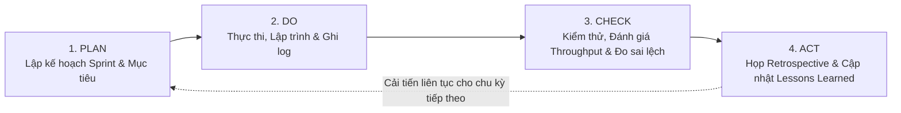

# BÁO CÁO BÀI HỌC KINH NGHIỆM (LESSONS LEARNED REGISTER)

## Hệ thống Quản lý và Số hóa Tài liệu Thư viện HCMUS (HCMUS-LDMS)

### THÔNG TIN TÀI LIỆU (DOCUMENT CONTROL)

| Trường thông tin (Field)                   | Nội dung đặc tả (Description)                                      |
| :----------------------------------------- | :----------------------------------------------------------------- |
| **Mã tài liệu (Document ID)**              | `HCMUS-LDMS-LLR`                                                   |
| **Tên tài liệu (Document Title)**          | Báo cáo Bài học Kinh nghiệm (Lessons Learned Register)             |
| **Dự án (Project Name)**                   | HCMUS-LDMS                                                         |
| **Đơn vị soạn thảo (Author/Organization)** | Nhóm Phát triển Dự án HCMUS-LDMS                                   |
| **Người xem xét (Reviewer)**               | Mạch Quốc Tấn (Project Manager)                                    |
| **Người phê duyệt (Approver)**             | Toàn bộ 6 thành viên nhóm (đồng thuận)                             |
| **Cấp độ bảo mật (Security Class)**        | Internal & Organizational Process Assets (Tài sản Quy trình Nội bộ) |
| **Trạng thái tài liệu (Status)**           | Final Approved (Hoàn tất & Đóng dấu lưu trữ)                        |

### LỊCH SỬ PHIÊN BẢN (REVISION HISTORY)

| Phiên bản (Version) | Ngày phát hành (Date) | Mô tả thay đổi (Description of Change)                                                                                                    | Người thực hiện (Author) |
| :-----------------: | :-------------------: | :---------------------------------------------------------------------------------------------------------------------------------------- | :----------------------: |
|         1.0         |      20/08/2026       | Tổng kết toàn bộ bài học kinh nghiệm sau khi hoàn thành dự án: Quy trình PDCA, 3 bài học đắt giá, đánh giá mô hình và khuyến nghị PMO.  |      Mạch Quốc Tấn       |

---

## Mục lục

- [1. Mục đích & Tầm quan trọng của Báo cáo Bài học Kinh nghiệm](#1-mục-đích--tầm-quan-trọng-của-báo-cáo-bài-học-kinh-nghiệm)
- [2. Quy trình Thu thập & Phân tích Bài học (Khung PDCA & Retrospective)](#2-quy-trình-thu-thập--phân-tích-bài-học-khung-pdca--retrospective)
- [3. Bảng Đăng ký Bài học Kinh nghiệm Toàn diện (Lessons Learned Matrix)](#3-bảng-đăng-ký-bài-học-kinh-nghiệm-toàn-diện-lessons-learned-matrix)
- [4. Phân tích Chi tiết 3 Bài học Kinh nghiệm Đắt giá nhất](#4-phân-tích-chi-tiết-3-bài-học-kinh-nghiệm-đắt-giá-nhất)
  - [4.1. Bài học 1: Ứng dụng AI Coding phải đi đôi với Đặc tả Yêu cầu Chặt chẽ (Spec-Driven AI)](#41-bài-học-1-ứng-dụng-ai-coding-phải-đi-đôi-với-đặc-tả-yêu-cầu-chặt-chẽ-spec-driven-ai)
  - [4.2. Bài học 2: Đơn giản hóa Kiến trúc & Tránh Bẫy "Over-engineering"](#42-bài-học-2-đơn-giản-hóa-kiến-trúc--tránh-bẫy-over-engineering)
  - [4.3. Bài học 3: Minh bạch Nhật ký Dùng AI & Quản trị Lòng tin theo Lý thuyết Y](#43-bài-học-3-minh-bạch-nhật-ký-dùng-ai--quản-trị-lòng-tin-theo-lý-thuyết-y)
- [5. So sánh Đối chuẩn: Quản lý theo Kế hoạch (Plan-driven) vs Quản lý Thích ứng (Agile)](#5-so-sánh-đối-chuẩn-quản-lý-theo-kế-hoạch-plan-driven-vs-quản-lý-thích-ứng-agile)
- [6. Vai trò của Văn phòng Quản lý Dự án (PMO) đối với Tài sản Quy trình Tổ chức (OPA)](#6-vai-trò-của-văn-phòng-quản-lý-dự-án-pmo-đối-với-tài-sản-quy-trình-tổ-chức-opa)

---

## 1. Mục đích & Tầm quan trọng của Báo cáo Bài học Kinh nghiệm

- **Mục đích:** Báo cáo Bài học Kinh nghiệm ghi lại toàn bộ những thành công cần phát huy, những sai lầm/thất bại cần tránh và các phát kiến quy trình hữu ích đã trải qua trong suốt vòng đời dự án **HCMUS-LDMS**.
- **Giá trị thực tiễn:**
  - Trở thành **Tài sản Quy trình Tổ chức (Organizational Process Assets - OPA)** có giá trị tái sử dụng cao cho các dự án phần mềm tương lai.
  - Ngăn ngừa việc "phát minh lại chiếc bánh xe" (reinventing the wheel) hoặc lặp lại các lỗi lầm tốn kém trong ước lượng và thiết kế kiến trúc.
  - Hoàn thiện tri thức cho các kỹ sư phần mềm trẻ về cách phối hợp hiệu quả giữa con người và các trợ lý lập trình trí tuệ nhân tạo (AI Coding Assistants).

---

## 2. Quy trình Thu thập & Phân tích Bài học (Khung PDCA & Retrospective)

Nhóm áp dụng kỹ thuật **Sprint Retrospective** theo khung câu hỏi **"Start - Stop - Continue"**:
1. **Start (Cần bắt đầu làm gì?):** Thiết lập linter tự động trên CI sớm hơn; bắt buộc viết unit test ngay khi code logic nghiệp vụ.
2. **Stop (Cần dừng làm gì?):** Dừng việc nạp toàn bộ codebase lớn vào prompt AI khi chỉ cần sửa một hàm nhỏ (gây tốn token và loãng context).
3. **Continue (Cần tiếp tục duy trì gì?):** Duy trì Daily Standup 15 phút, cập nhật nhật ký `project-log.md` đều đặn trong 12h, và duy trì văn hóa tự giác Lý thuyết Y.

---

## 3. Bảng Đăng ký Bài học Kinh nghiệm Toàn diện (Lessons Learned Matrix)

| Mã | Hạng mục | Tình huống phát sinh (Issue/Event) | Hậu quả / Tác động | Nguyên nhân gốc rễ (Root Cause) | Bài học kinh nghiệm & Khuyến nghị (Actionable Insight) |
| :-: | :--- | :--- | :--- | :--- | :--- |
| **LL-01** | **Phương pháp** | Dùng AI sinh code khi chưa chốt rõ Acceptance Criteria (AC). | AI sinh code sai nghiệp vụ, phải đập đi viết lại, tốn 120K token vô ích. | Thiếu đặc tả kỹ thuật (Spec) rõ ràng; dev ỷ lại hoàn toàn vào AI. | **Nguyên tắc "Spec-First":** Luôn viết rõ Product Backlog và tiêu chí AC trước khi bắt đầu phiên prompt AI. |
| **LL-02** | **Kiến trúc** | Ban đầu dự định dựng Elasticsearch cluster và hệ thống Microservices. | Cấu hình quá phức tạp, máy dev 8GB RAM bị treo khi chạy Docker. | Xu hướng "Over-engineering", chọn công nghệ vượt quá quy mô dự án. | **Nguyên tắc "Đơn giản đủ dùng (KISS)":** Sử dụng PostgreSQL Full-Text Search và Modular Monolith; tiết kiệm 70% RAM mà tốc độ vẫn $< 200\text{ms}$. |
| **LL-03** | **Quản trị nhóm** | Một số thành viên ngại báo cáo khi gặp blocker kỹ thuật ở tuần đầu. | Tiến độ story bị chậm 2 ngày so với kế hoạch ban đầu. | Tâm lý sợ bị đánh giá năng lực kém khi làm việc nhóm. | **Áp dụng Lý thuyết Y & Chính sách Không đổ lỗi (Blameless Culture):** Daily Standup tập trung gỡ khó, tạo môi trường cởi mở giúp báo blocker ngay trong 24h. |
| **LL-04** | **Kiểm thử** | Chỉ test thủ công trên giao diện Web mà không viết Unit Test backend. | Sửa API này làm gãy ngầm API khác mà không phát hiện kịp thời. | Tâm lý "tiết kiệm thời gian" giai đoạn đầu dự án. | **Áp dụng Kim tự tháp Kiểm thử (Test Pyramid):** Yêu cầu AI sinh Pytest fixtures ngay khi viết endpoint; tích hợp CI tự động chặn merge nếu test fail. |
| **LL-05** | **Khảo sát** | Tự suy diễn quy trình số hóa của thủ thư dựa trên tài liệu lý thuyết. | Thiết kế giao diện Editor ban đầu bị thủ thư chê khó dùng vì thiếu ảnh scan gốc. | Thiếu sự tham gia sớm của Stakeholder thực tế. | **Gặp gỡ Stakeholder sớm & Prototype tiến hóa:** Lên gặp trực tiếp cô thủ thư Mai, quan sát thao tác scan thực tế để thiết kế Split-screen Editor. |

---

## 4. Phân tích Chi tiết 3 Bài học Kinh nghiệm Đắt giá nhất

### 4.1. Bài học 1: Ứng dụng AI Coding phải đi đôi với Đặc tả Yêu cầu Chặt chẽ (Spec-Driven AI)
- **Thực trạng:** Khi mới tiếp cận công cụ AI, dev thường có xu hướng "Vibe Coding" — mô tả ý tưởng chung chung cho AI tự suy diễn. Kết quả là mã nguồn sinh ra có vẻ chạy được nhưng lại không ăn khớp với cơ sở dữ liệu và vi phạm luồng nghiệp vụ.
- **Giải pháp đắt giá:** Nhóm chuyển dịch sang mô hình **Spec-Driven AI Development**:
  1. Con người (Dev/PM) đầu tư thời gian suy nghĩ cấu trúc dữ liệu, viết rõ ràng User Story + Acceptance Criteria theo chuẩn INVEST.
  2. Nạp file Spec ngắn gọn vào context của AI Coding Assistant.
  3. AI đóng vai trò là "cặp tay lập trình siêu tốc" sinh code bám sát 100% tiêu chí AC.
  4. Con người rà soát (Code Review) và chạy automated test để nghiệm thu.
- **Kết quả:** Giảm thời gian sửa lỗi từ vài giờ xuống còn vài phút, tỷ lệ token hữu ích tăng từ $40\%$ lên $> 90\%$.

### 4.2. Bài học 2: Đơn giản hóa Kiến trúc & Tránh Bẫy "Over-engineering"
- **Thực trạng:** Giai đoạn lập đề xuất, nhóm bị cuốn vào các thuật ngữ công nghệ thời thượng như Microservices, Apache Kafka, Elasticsearch cluster. Tuy nhiên, khi bắt tay vào triển khai, chi phí tài nguyên phần cứng và độ trễ mạng khiến việc phát triển bị đình trệ.
- **Giải pháp đắt giá:**
  - Tái cấu trúc thành **Modular Monolith** viết bằng **FastAPI** và **React 19**.
  - Thay thế Elasticsearch bằng tính năng có sẵn **PostgreSQL Full-Text Search (tsvector + GIN Index)**.
  - Sử dụng **MinIO Object Storage** cục bộ tương thích hoàn toàn chuẩn S3 API.
- **Kết quả:** Toàn bộ hệ thống chạy mượt mà trên 1 lệnh `docker compose up`, chiếm chưa tới 1.5GB RAM, chi phí hạ tầng = 0 VNĐ nhưng vẫn xử lý mượt mà hơn 500 tài liệu số hóa với tốc độ phản hồi $< 200\text{ms}$.

### 4.3. Bài học 3: Minh bạch Nhật ký Dùng AI & Quản trị Lòng tin theo Lý thuyết Y
- **Thực trạng:** Việc sử dụng AI tạo ra sự hoài nghi ngầm trong nhóm: _"Ai làm nhiều hơn? Ai chỉ bấm nút cho AI làm?"_.
- **Giải pháp đắt giá:** Nhóm thiết lập **Policy 1 — Minh bạch Nhật ký Dự án** (`02-project-log.md`):
  - Bắt buộc ghi nhận thời gian thực tế, số token AI đã tiêu thụ, model sử dụng và mã story hoàn thành sau mỗi phiên làm việc.
  - Áp dụng triệt để **Lý thuyết Y của Douglas McGregor**: Tôn trọng sự tự chủ, cho phép thành viên tự chọn task và tự đánh giá nỗ lực của mình.
- **Kết quả:** Loại bỏ hoàn toàn sự nghi ngờ, dữ liệu log thực tế (14h05m, 730K tokens, ~350K VNĐ) trở thành minh chứng rõ ràng nhất về sự đóng góp công bằng và trách nhiệm giải trình của từng cá nhân.

---

## 5. So sánh Đối chuẩn: Quản lý theo Kế hoạch (Plan-driven) vs Quản lý Thích ứng (Agile)

| Tiêu chí so sánh | Quản lý theo Kế hoạch Chặt chẽ (Plan-driven / Waterfall) | Quản lý Thích ứng theo Kinh nghiệm (Agile / Kanban) | Trải nghiệm thực tế tại Dự án HCMUS-LDMS |
| :--- | :--- | :--- | :--- |
| **Triết lý cốt lõi** | Lập kế hoạch toàn diện từ đầu; kiểm soát nghiêm ngặt sự thay đổi. | Chấp nhận sự thay đổi; học hỏi và tối ưu hóa qua từng vòng lặp ngắn. | Kết hợp hài hòa: Khởi tạo có Charter/SoW chặt chẽ, thực thi theo Kanban linh hoạt. |
| **Xử lý yêu cầu mới** | Yêu cầu quy trình phê duyệt Change Request phức tạp, tăng chi phí. | Đưa vào Product Backlog, tái ưu tiên theo giá trị người dùng. | Dùng cơ chế Change Control trong SoW để bảo vệ ngân sách 100M và hạn chế Scope Creep. |
| **Vai trò tài liệu** | Tài liệu đóng vai trò là hợp đồng pháp lý cố định, chi tiết hóa cao. | Tài liệu tinh gọn, chỉ tạo khi cần thiết và cập nhật liên tục. | Duy trì hệ thống tài liệu `docs/` sống động, cập nhật song song mã nguồn. |
| **Đo lường tiến độ** | Dựa trên phần trăm hoàn thành kế hoạch (EVM: PV, EV, AC). | Dựa trên số lượng tính năng thực tế đã hoàn thành (Throughput, DoD). | Đo lường Throughput thực tế ($T = \text{stories Done / tuần}$) kết hợp theo dõi WBS. |

---

## 6. Vai trò của Văn phòng Quản lý Dự án (PMO) đối với Tài sản Quy trình Tổ chức (OPA)

Trong các tổ chức phần mềm quy mô lớn, **Văn phòng Quản lý Dự án (Project Management Office - PMO)** đóng vai trò sống còn:
1. **Chuẩn hóa & Quản trị Phương pháp luận:** Cung cấp các biểu mẫu chuẩn (Charter, SoW, Risk Register, Quality Plan) giúp các nhóm dự án triển khai nhanh chóng mà không phải tự xây dựng từ đầu.
2. **Quản lý & Tái sử dụng Tài sản Quy trình (OPA):** Lưu trữ tập trung các Báo cáo Bài học Kinh nghiệm (Lessons Learned Register) từ hàng trăm dự án trong quá khứ để làm cơ sở dữ liệu ước lượng (Data Fitting) cho các dự án mới.
3. **Điều phối Nguồn lực Dùng chung:** Tối ưu hóa việc phân bổ nhân sự chủ chốt (Solution Architect, DevOps Lead, Security Specialist) giữa các dự án khác nhau để tránh lãng phí ngân sách.
4. **Giám sát & Đảm bảo Tuân thủ (Governance):** Đóng vai trò là cơ quan thanh tra độc lập kiểm soát chất lượng, tiến độ và rủi ro tuân thủ pháp lý (bản quyền, an toàn thông tin) trên toàn bộ danh mục đầu tư (Portfolio).
