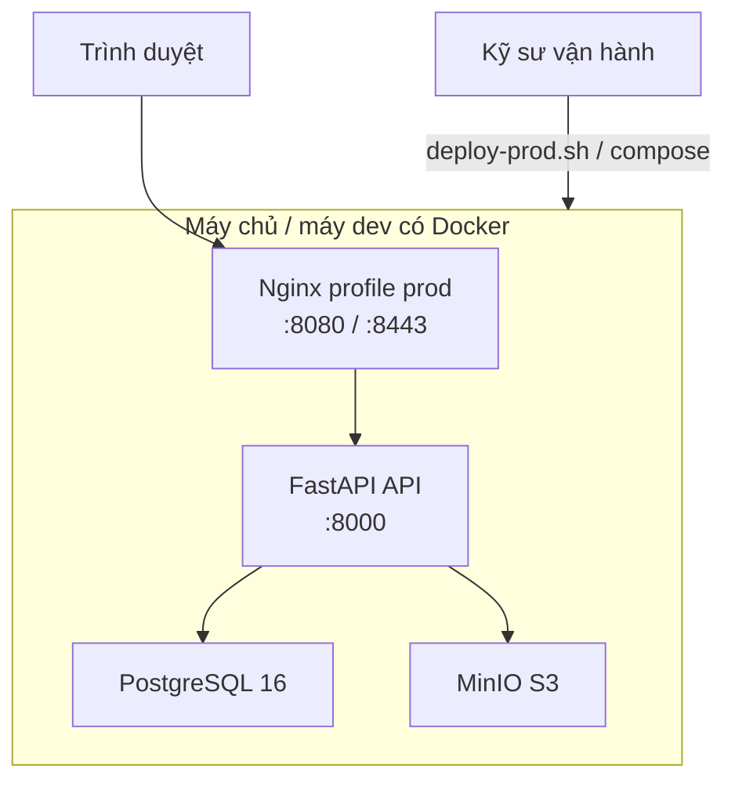

# HƯỚNG DẪN TRIỂN KHAI VÀ VẬN HÀNH

## Hệ thống Quản lý và Số hóa Tài liệu Thư viện HCMUS (HCMUS-LDMS)

### THÔNG TIN TÀI LIỆU (DOCUMENT CONTROL)

| Trường thông tin (Field)                   | Nội dung đặc tả (Description)                                         |
| :----------------------------------------- | :-------------------------------------------------------------------- |
| **Mã tài liệu (Document ID)**              | `HCMUS-LDMS-DEPLOY`                                                   |
| **Tên tài liệu (Document Title)**          | Hướng dẫn Triển khai và Vận hành (Deployment Guide)                   |
| **Dự án (Project Name)**                   | HCMUS-LDMS                                                            |
| **Đơn vị soạn thảo (Author/Organization)** | Nhóm Phát triển Dự án HCMUS-LDMS                                      |
| **Đối tượng đọc**                          | Kỹ sư vận hành / DevOps thành viên nhóm                               |
| **Cấp độ bảo mật (Security Class)**        | Internal                                                              |
| **Trạng thái tài liệu (Status)**           | Active — Continuous Delivery **thủ công**; chưa có CD tự động lên VM  |

### LỊCH SỬ PHIÊN BẢN (REVISION HISTORY)

| Phiên bản (Version) | Ngày phát hành (Date) | Mô tả thay đổi (Description of Change)                                                                 | Người thực hiện (Author) |
| :-----------------: | :-------------------: | :----------------------------------------------------------------------------------------------------- | :----------------------: |
|         1.0         |      20/08/2026       | Mô tả triển khai Compose (dev + profile prod), script deploy-prod, backup MVP; ghi rõ gap CD/monitor. |    Nguyễn Tuấn Anh     |

---

## 1. Mục đích và Phạm vi thực tế

Tài liệu hướng dẫn **triển khai tái lập được** stack HCMUS-LDMS bằng Docker Compose và các script trong `scripts/`.

| Đã có trong repo | Chưa có (roadmap / gap thi câu 14–15) |
| ---------------- | ------------------------------------- |
| `scripts/run.sh` — one-shot **dev** | `.github/workflows/cd.yml` auto-deploy lên VMware |
| `scripts/deploy-prod.sh` — **prod-like local** (Nginx + TLS demo) | Monitoring Grafana/Prometheus |
| Alembic migration khi lên stack | Continuous Deployment không cần người |
| `backup-postgres.sh`, `backup-minio.sh` | PgBackRest / Restic đầy đủ như architecture §5.2 |

Theo tài liệu lý thuyết: nhóm đang ở mức **Continuous Delivery thủ công** (sau CI xanh, một người chạy script để phát hành), **không** phải Continuous Deployment.

---

## 2. Kiến trúc triển khai ngắn



Chi tiết C4 Deployment View (VM Staging/Prod mục tiêu trên VMware): [`02-architecture.md`](../02-planning/02-architecture.md) §6.

Compose file: `src/backend/docker-compose.yml`

| Service | Profile | Vai trò |
| ------- | ------- | ------- |
| `api` | mặc định | FastAPI + OCR/Pandoc/Tesseract trong image |
| `postgres` | mặc định | Metadata, RBAC, FTS |
| `minio` | mặc định | PDF/EPUB object storage |
| `nginx` | **`prod`** | Reverse proxy, TLS, phục vụ FE build tĩnh |

---

## 3. Triển khai môi trường Development

Dành cho lập trình viên — chi tiết đầy đủ ở [06-developer-guide.md](./06-developer-guide.md):

```bash
./scripts/run.sh
```

Health: `http://localhost:8000/health` phải thành công trước khi Alembic chạy.

---

## 4. Triển khai kiểu Production-like (local / demo)

Mục tiêu: gần với kiến trúc Nginx + TLS mô tả trong architecture §5.1, **chạy trên máy bất kỳ có Docker** (bài toán Deployment script buổi 08).

### 4.1 Chuẩn bị

```bash
# Từ gốc repo, mã đã checkout đúng tag/commit cần phát hành
cp src/backend/.env.example src/backend/.env
# Đặt APP_ENV, JWT_SECRET mạnh, tắt mock auth nếu demo gần thật:
#   ENABLE_MOCK_AUTH=false
# Cấu hình Google OAuth nếu cần đăng nhập thật

./scripts/generate-dev-cert.sh   # cert self-signed vào src/backend/nginx/certs/
```

> Cert self-signed **chỉ demo**. Production trường cần CA hợp lệ.

### 4.2 Chạy script deploy

```bash
./scripts/deploy-prod.sh
```

Script thực hiện tuần tự:

1. Kiểm tra Docker / Compose.
2. Đảm bảo có certificate (gọi `generate-dev-cert.sh` nếu thiếu).
3. `docker compose --profile prod up -d --build`.
4. Chờ `GET http://localhost:8000/health` → kỳ vọng HTTP thành công.
5. `alembic upgrade head` trong container `api`.
6. Nếu health fail: in log API/Nginx và **exit ≠ 0** (không tuyên bố deploy thành công).

### 4.3 URL sau khi lên

| Cổng | Ý nghĩa |
| ---- | ------- |
| https://localhost:8443 | Nginx TLS (FE + proxy API) |
| http://localhost:8080 | Nginx HTTP |
| http://localhost:8000/health | Health trực tiếp API (dùng trong script) |

### 4.4 Rollback khi lỗi (thực hành MVP)

Chưa có registry image versioning đầy đủ. Quy trình rollback thực tế hiện tại:

```bash
cd src/backend
docker compose --profile prod down
git checkout <commit-hoặc-tag-trước-đó>
../scripts/deploy-prod.sh
# Nếu cần khôi phục dữ liệu: pg_restore / mirror MinIO từ bản backup (mục 6)
```

Ghi nhận hạn chế này khi vấn đáp: rollback = **compose down + checkout bản ổn định + deploy lại + (tuỳ chọn) restore backup**.

---

## 5. Cấu hình CSDL và Migration

- Engine: **PostgreSQL 16** (Compose service `postgres`).
- Ứng dụng dùng SQLAlchemy + **Alembic**; mọi thay đổi schema qua revision, không sửa tay DB production.
- Lệnh chuẩn sau mỗi lần build/up:

```bash
docker compose --project-directory src/backend --file src/backend/docker-compose.yml \
  exec -T api uv run --no-dev alembic upgrade head
```

(`deploy-prod.sh` và `run.sh` đã gọi tương đương.)

Biến kết nối trong Compose: `DATABASE_URL=postgresql+psycopg://...@postgres:5432/...`.

---

## 6. Sao lưu và Khôi phục (MVP)

Theo root README: đây là **MVP thay thế** PgBackRest/Restic mô tả trong architecture §5.2.

### 6.1 PostgreSQL

```bash
./scripts/backup-postgres.sh
```

- Dùng `pg_dump -Fc` vào `.backups/postgres/` (hoặc `$LDMS_BACKUP_DIR`).
- Xóa bản cũ hơn `$LDMS_BACKUP_RETENTION_DAYS` (mặc định 30).

Khôi phục (ví dụ):

```bash
# Cẩn thận: ghi đè DB — chỉ khi đã dừng ghi hoặc trên máy phục hồi
docker compose --project-directory src/backend --file src/backend/docker-compose.yml \
  exec -T postgres pg_restore -U ldms -d ldms --clean --if-exists < .backups/postgres/ldms-YYYYMMDD-HHMMSS.dump
```

(Điều chỉnh user/db theo `.env`.)

### 6.2 MinIO

```bash
./scripts/backup-minio.sh
```

- `mc mirror` bucket sang `.backups/minio/` (đại diện off-site khi trỏ `$LDMS_BACKUP_DIR` sang NAS).

### 6.3 Mục tiêu RPO/RTO (thiết kế)

Architecture §5.3: RPO ≤ 24h, RTO ≤ 4h — **chỉ tiêu thiết kế** khi vận hành trên hạ tầng trường; MVP local phụ thuộc tần suất chạy hai script trên.

---

## 7. Multi-environment

| Môi trường | Cách nhóm hiện thực | Ghi chú |
| ---------- | ------------------- | ------- |
| **Dev** | Compose mặc định + Vite `npm run dev` | Mock auth có thể bật |
| **Prod-like (local)** | `--profile prod` + Nginx TLS demo | Cùng máy dev/demo |
| **Staging / Production VMware** | Mô tả trong Deployment View | Chưa gắn CD pipeline trong repo |

Không nên trộn `.env` dev (secret yếu, mock auth) với máy coi là production.

---

## 8. Giám sát (Monitor) — trạng thái hiện tại

| Hạng mục | Hiện trạng |
| -------- | ---------- |
| Health check lúc deploy | Có — `/health` trong `run.sh` / `deploy-prod.sh` |
| Email sau merge `main` | Có — Brevo qua job CI `notify` |
| Grafana / Prometheus / alert SLA | **Chưa** — ghi nhận gap buổi 08 |

---

## 9. Checklist vận hành trước demo / phát hành thủ công

- [ ] CI trên commit/tag định phát hành đang **xanh**.
- [ ] `.env` đã đổi `JWT_SECRET`, tắt mock nếu cần.
- [ ] `./scripts/deploy-prod.sh` thành công; mở được https://localhost:8443 (hoặc URL máy chủ).
- [ ] `alembic upgrade head` đã chạy (script đã làm).
- [ ] Đã chạy backup trước khi thao tác rủi ro trên dữ liệu thật.
- [ ] Ghi nhận tag Git (ví dụ `v1.0.0-MVP`) trên commit đã deploy.

---

## 10. Tài liệu liên quan

- [06-developer-guide.md](./06-developer-guide.md)
- [`09-test-plan.md`](../02-planning/09-test-plan.md)
- Root [`README.md`](../../README.md) — mục production-like và backup
- [`.github/workflows/ci.yml`](../../.github/workflows/ci.yml) — tích hợp liên tục (không deploy)
