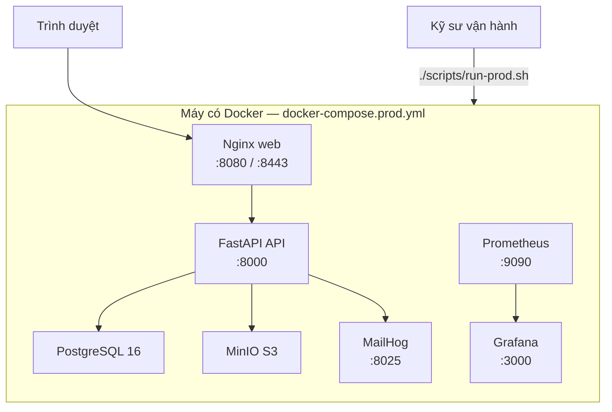

# HƯỚNG DẪN TRIỂN KHAI VÀ VẬN HÀNH

## Hệ thống Quản lý và Số hóa Tài liệu Thư viện HCMUS (HCMUS-LDMS)

### THÔNG TIN TÀI LIỆU (DOCUMENT CONTROL)

| Trường thông tin (Field)                   | Nội dung đặc tả (Description)                                         |
| :----------------------------------------- | :-------------------------------------------------------------------- |
| **Mã tài liệu (Document ID)**              | `HCMUS-LDMS-DEPLOY`                                                   |
| **Tên tài liệu (Document Title)**          | Hướng dẫn Triển khai và Vận hành (Deployment Guide)                   |
| **Dự án (Project Name)**                   | HCMUS-LDMS                                                            |
| **Đơn vị soạn thảo (Author/Organization)** | Nhóm Phát triển Dự án HCMUS-LDMS                                      |
| **Đối tượng đọc**                          | Kỹ sư vận hành / DevOps thành viên nhóm                               |
| **Cấp độ bảo mật (Security Class)**        | Internal                                                              |
| **Trạng thái tài liệu (Status)**           | Active — Continuous Delivery **thủ công** qua `scripts/run-prod.sh`   |

### LỊCH SỬ PHIÊN BẢN (REVISION HISTORY)

| Phiên bản (Version) | Ngày phát hành (Date) | Mô tả thay đổi (Description of Change)                                                                 | Người thực hiện (Author) |
| :-----------------: | :-------------------: | :----------------------------------------------------------------------------------------------------- | :----------------------: |
|         1.0         |      20/08/2026       | Khởi tạo Deployment Guide (bản nháp gắn script tạm).                                                   |    Nguyễn Tuấn Anh     |
|         1.1         |      20/08/2026       | Đồng bộ main: dùng `scripts/run-prod.sh` + `docker-compose.prod.yml` (Web, MailHog, Prometheus, Grafana); bỏ tham chiếu `deploy-prod.sh`. |    Nguyễn Tuấn Anh     |

---

## 1. Mục đích và Phạm vi thực tế

Tài liệu hướng dẫn **triển khai tái lập được** stack HCMUS-LDMS bằng Docker Compose và script chính thức trong repo.

| Đã có trong repo | Chưa có (gap / roadmap) |
| ---------------- | ----------------------- |
| `scripts/run.sh` — one-shot **dev** | `.github/workflows/cd.yml` auto-deploy lên VMware |
| `scripts/run-prod.sh` + `docker-compose.prod.yml` — **prod one-click** | Continuous Deployment không cần người |
| Health check + seed demo sau khi API lên | PgBackRest / Restic đầy đủ như architecture §5.2 |
| Prometheus + Grafana + MailHog trong stack prod | — |
| `backup-postgres.sh`, `backup-minio.sh` | — |

Theo tài liệu lý thuyết: nhóm đang ở mức **Continuous Delivery thủ công** (sau CI xanh, một người chạy `./scripts/run-prod.sh`), **không** phải Continuous Deployment.

---

## 2. Kiến trúc triển khai ngắn



Chi tiết C4 Deployment View (VM Staging/Prod mục tiêu trên VMware): [`02-architecture.md`](../02-planning/02-architecture.md) §6.

| File | Vai trò |
| ---- | ------- |
| `docker-compose.prod.yml` (gốc repo) | Stack production-like đầy đủ |
| `src/backend/docker-compose.yml` | Stack **dev** (API + Postgres + MinIO; Nginx qua profile `prod` cũ nếu còn dùng) |
| `scripts/run-prod.sh` / `scripts/run-prod.ps1` | One-click prod: build/up → health → seed |

### Services trong `docker-compose.prod.yml`

| Service | Vai trò |
| ------- | ------- |
| `web` | Nginx — FE tĩnh + TLS, cổng 8080/8443 |
| `api` | FastAPI (`APP_ENV=production` mặc định) |
| `postgres` | PostgreSQL 16 (volume `postgres_prod_data`) |
| `minio` | Object storage (volume `minio_prod_data`) |
| `mailhog` | SMTP mock + UI `:8025` |
| `prometheus` | Metrics `:9090` |
| `grafana` | Dashboard `:3000` (admin/admin mặc định) |

---

## 3. Triển khai môi trường Development

Chi tiết: [06-developer-guide.md](./06-developer-guide.md).

```bash
./scripts/run.sh
```

Health: `http://localhost:8000/health` → sau đó Alembic `upgrade head` (trong `run.sh`).

---

## 4. Triển khai Production-like (one-click)

Mục tiêu: bài toán Deployment script buổi 08 — **chạy trên máy bất kỳ có Docker** → toàn bộ hệ thống lên (Web, API, DB, storage, mail, monitoring).

### 4.1 Chuẩn bị

```bash
# Checkout đúng tag/commit cần phát hành
# Kiểm tra biến môi trường (file .env / export) trước khi coi là production thật:
#   JWT_SECRET mạnh, ENABLE_MOCK_AUTH=false nếu cần, OAuth Google, v.v.
```

Script tự tạo cert self-signed vào `src/backend/nginx/certs/` nếu thiếu `dev.crt` / `dev.key` (cần `openssl`). Cert này **chỉ demo** — máy trường cần CA hợp lệ.

### 4.2 Chạy script chính thức

```bash
./scripts/run-prod.sh
# Windows: scripts/run-prod.ps1
```

Luồng thực tế trong script:

1. Kiểm tra Docker daemon + Compose plugin.
2. Sinh TLS self-signed nếu thiếu.
3. `docker compose -f docker-compose.prod.yml up -d --build`.
4. Chờ tối đa ~60s tới khi `GET http://localhost:8000/health` thành công; fail → in log `api` và exit ≠ 0.
5. Chạy seed: `uv run python -m app.scripts.seed_data` trong container `api` (cảnh báo nếu đã seed sẵn).

Dừng stack:

```bash
docker compose -f docker-compose.prod.yml down
```

### 4.3 URL sau khi lên (theo output script)

| URL | Ý nghĩa |
| --- | ------- |
| http://localhost:8080 | Web (HTTP) |
| https://localhost:8443 | Web (HTTPS) |
| http://localhost:8000 | API |
| http://localhost:8000/docs | OpenAPI |
| http://localhost:9003 | MinIO Console |
| http://localhost:8025 | MailHog |
| http://localhost:3000 | Grafana |
| http://localhost:9090 | Prometheus |

Tài khoản demo (seed): xem banner cuối `run-prod.sh` (admin / librarian / reader `@hcmus.edu.vn`).

### 4.4 Rollback khi lỗi (thực hành MVP)

Chưa có registry image versioning đầy đủ:

```bash
docker compose -f docker-compose.prod.yml down
git checkout <commit-hoặc-tag-trước-đó>
./scripts/run-prod.sh
# Khôi phục dữ liệu nếu cần: pg_restore / mirror MinIO từ backup (mục 6)
```

---

## 5. Cấu hình CSDL

- Engine: **PostgreSQL 16** (service `postgres` trong compose prod/dev).
- Ứng dụng: SQLAlchemy + Alembic cho schema; `run.sh` (dev) gọi `alembic upgrade head` tường minh.
- `run-prod.sh` sau health chạy **seed dữ liệu demo** (`app.scripts.seed_data`). Khi phát hành schema mới trên môi trường đã có data, vận hành viên vẫn nên xác nhận migration Alembic đã áp dụng (theo quy trình dev / README module backend).

Biến kết nối: `DATABASE_URL=postgresql+psycopg://...@postgres:5432/...`.

---

## 6. Sao lưu và Khôi phục (MVP)

MVP thay thế PgBackRest/Restic (architecture §5.2) — xem thêm root README nếu còn mục backup.

```bash
./scripts/backup-postgres.sh   # pg_dump -Fc → .backups/postgres/
./scripts/backup-minio.sh      # mc mirror → .backups/minio/
```

RPO/RTO thiết kế (architecture §5.3): RPO ≤ 24h, RTO ≤ 4h — phụ thuộc tần suất chạy script khi vận hành thật.

---

## 7. Multi-environment

| Môi trường | Cách nhóm hiện thực | Ghi chú |
| ---------- | ------------------- | ------- |
| **Dev** | `scripts/run.sh` + `src/backend/docker-compose.yml` + Vite | Mock auth có thể bật |
| **Prod-like (local / demo máy bất kỳ)** | `scripts/run-prod.sh` + `docker-compose.prod.yml` | Đủ Web, mail, Grafana/Prometheus |
| **Staging / Production VMware** | Deployment View architecture | Chưa gắn CD pipeline trong repo |

Không dùng chung secret yếu / mock auth của dev trên máy coi là production.

---

## 8. Giám sát (Monitor)

| Hạng mục | Hiện trạng |
| -------- | ---------- |
| Health check lúc deploy | Có — `/health` trong `run.sh` và `run-prod.sh` |
| Email sau merge `main` | Có — Brevo qua job CI `notify` |
| Prometheus + Grafana | Có trong **stack prod** (`docker-compose.prod.yml`) |
| Alert SLA / on-call đầy đủ | Tuỳ cấu hình dashboard — chưa mô tả runbook PagerDuty |

---

## 9. Checklist vận hành trước demo / phát hành thủ công

- [ ] CI trên commit/tag định phát hành đang **xanh**.
- [ ] Secret / `JWT_SECRET` / mock auth đã rà soát nếu demo gần production.
- [ ] `./scripts/run-prod.sh` thành công; mở được https://localhost:8443 (hoặc URL máy chủ).
- [ ] Grafana `:3000` / Prometheus `:9090` phản hồi (xác nhận Monitor).
- [ ] Đã chạy backup trước thao tác rủi ro trên dữ liệu thật.
- [ ] Ghi nhận tag Git (ví dụ `v1.0.0-MVP`) trên commit đã deploy.

---

## 10. Tài liệu liên quan

- [06-developer-guide.md](./06-developer-guide.md)
- [`09-test-plan.md`](../02-planning/09-test-plan.md)
- [`scripts/run-prod.sh`](../../scripts/run-prod.sh)
- [`docker-compose.prod.yml`](../../docker-compose.prod.yml)
- [`.github/workflows/ci.yml`](../../.github/workflows/ci.yml) — CI (không deploy)
