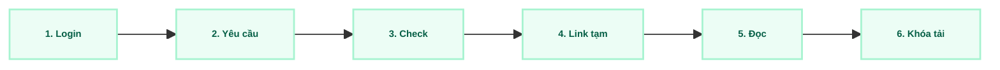

  
03

  

    
Phần 03

    <h1 class="text-4xl font-black text-slate-900 leading-tight mb-4">Architecture & Proof of Concept</h1>
    

    
Phần này giải thích hệ thống được thiết kế như thế nào, và trình bày hai thử nghiệm thực tế (PoC) để chứng minh: (1) công nghệ đã chọn chạy đúng như kiến trúc đề ra, và (2) bài toán khó nhất của dự án — xử lý OCR — có thể giải quyết được.

    

      Sơ đồ kiến trúc (C4 Model)
      PoC 1 — Xử lý OCR không chờ
      PoC 2 — Kết nối toàn trình
      Mã nguồn khung ban đầu
    

  

---

# Mục Tiêu & Giới Hạn Khi Thiết Kế Kiến Trúc

  <h3 class="text-emerald-900 font-bold text-sm border-b border-emerald-200 pb-1.5">Hệ thống phải làm được gì</h3>
  <ul class="space-y-1.5 text-slate-700">
    <li><strong>Tìm kiếm nhanh:</strong> Trả kết quả tìm nội dung sách trong dưới 3 giây, kể cả khi có 500 người dùng cùng lúc (CCU).</li>
    <li><strong>Bảo vệ bản quyền:</strong> Mỗi lượt đọc chỉ được cấp một đường link tạm thời 15 phút (Signed URL), không có nút tải file gốc.</li>
    <li><strong>Không làm chậm hệ thống khi xử lý OCR:</strong> Việc "đọc chữ" từ ảnh scan là tác vụ nặng, phải chạy ngầm phía sau (bất đồng bộ), không bắt người dùng chờ.</li>
    <li><strong>Đọc thoải mái trên mọi thiết bị:</strong> Sách số được đóng gói theo chuẩn EPUB 3.0 — chữ tự co giãn vừa màn hình điện thoại lẫn máy tính.</li>
  </ul>

  <h3 class="text-amber-900 font-bold text-sm border-b border-amber-200 pb-1.5">Điều kiện ràng buộc thực tế</h3>
  <ul class="space-y-1.5 text-slate-700">
    <li><strong>Dùng hạ tầng có sẵn:</strong> Chạy trên cụm máy chủ ảo hóa (VMware) mà trường đã có, không mua thêm máy chủ mới.</li>
    <li><strong>Ngân sách giới hạn:</strong> Tổng chi phí mua sắm và phát triển dưới 100 triệu VNĐ.</li>
    <li><strong>Nhân lực ít:</strong> Chỉ có 4 kỹ sư làm kiêm nhiệm (tương đương khoảng 2 người làm toàn thời gian).</li>
  </ul>

  <strong>CCU</strong>: Concurrent Users (số người dùng truy cập đồng thời)  
  <strong>EPUB</strong>: định dạng sách điện tử co giãn theo màn hình (khác với PDF là ảnh tĩnh cố định)

---

# Vì Sao Chọn Kiến Trúc "Modular Monolith"?

  <strong>Modular Monolith</strong> là cách viết một hệ thống duy nhất (một khối), nhưng bên trong được <strong>chia thành các module rõ ràng, độc lập</strong> với nhau — dễ hiểu hơn nhiều so với việc tách thành hàng chục dịch vụ nhỏ (Microservices) ngay từ đầu.

| Tiêu chí so sánh                      | Kho lưu trữ tĩnh (DSpace) | Nhiều dịch vụ nhỏ (Microservices)                  | Một khối chia module (Lựa chọn)                      |
| :------------------------------------ | :------------------------ | :------------------------------------------------- | :--------------------------------------------------- |
| **Phù hợp với đội chỉ có 4 người**    | Trung bình                | Kém — vận hành và triển khai rất phức tạp          | **Tốt — một codebase, dễ chia việc theo module**     |
| **Xử lý OCR chạy ngầm không chờ**     | Không hỗ trợ              | Tốt                                                | **Tốt — dùng BackgroundTasks có sẵn trong FastAPI**  |
| **Chi phí vận hành hạ tầng**          | Thấp                      | Rất cao (cần nhiều máy chủ, nhiều công cụ quản lý) | **Rất thấp — chạy tốt trên 1–2 máy ảo**              |
| **Có thể tách nhỏ dần sau này không** | Rất khó                   | Đã tách sẵn (nhưng khó quay lại)                   | **Dễ — vì module đã được thiết kế tách biệt từ đầu** |

  <strong>Kết luận:</strong> Với đội ngũ 4 người làm kiêm nhiệm, kiến trúc "một khối chia module" giúp phát triển nhanh nhưng vẫn có thể mở rộng, tách nhỏ khi hệ thống lớn lên trong tương lai.

---

# Các Công Nghệ Được Sử Dụng (Technology Stack)

  <strong class="text-emerald-900 block mb-1">Giao diện người dùng</strong>
  React 18 + Vite
  
Tailwind CSS để tạo giao diện + Epub.js để đọc sách điện tử

  <strong class="text-emerald-900 block mb-1">Máy chủ xử lý (Backend)</strong>
  FastAPI (Python 3.11)
  
Tự có cơ chế chạy tác vụ nền (BackgroundTasks)

  <strong class="text-emerald-900 block mb-1">Cơ sở dữ liệu & Tìm kiếm</strong>
  PostgreSQL 15
  
Dùng chức năng tìm kiếm toàn văn có sẵn (FTS)

  <strong class="text-emerald-900 block mb-1">Kho lưu trữ file</strong>
  MinIO
  
Sinh đường link tạm thời (15 phút) để đọc file an toàn

  <strong>Công cụ hỗ trợ thêm:</strong> Tesseract (công cụ nhận dạng chữ tiếng Việt từ ảnh) + Pandoc (chuyển văn bản thành file EPUB) + Docker Compose (đóng gói, chạy các thành phần cùng lúc).
  100% mã nguồn mở, miễn phí

  <strong>FTS</strong>: Full-Text Search (tìm kiếm toàn văn — tìm theo nội dung chữ trong sách, không chỉ tên sách)  
  <strong>MinIO</strong>: phần mềm lưu trữ file tương thích chuẩn Amazon S3

---

# Sơ Đồ Tổng Quan Hệ Thống

Sơ đồ dưới đây cho thấy các thành phần chính của hệ thống kết nối với nhau như thế nào, ai là người dùng, và dữ liệu đi qua đâu.

  

---

# Hệ Thống Được Chia Thành 4 Nhóm Module

  <strong class="text-emerald-900 text-sm block border-b border-slate-200 pb-1">1. Đăng nhập & Phân quyền</strong>
  
Xử lý đăng nhập bằng Google (hoặc tài khoản thử nghiệm), phân biệt 4 vai trò: Quản trị viên, Thủ thư, Biên tập viên, Độc giả — mỗi vai trò thấy và làm được những việc khác nhau.

  <strong class="text-emerald-900 text-sm block border-b border-slate-200 pb-1">2. Số hóa & Nhận dạng chữ (OCR)</strong>
  
Nhận ảnh scan sách được tải lên, xếp hàng xử lý OCR chạy ngầm, theo dõi trạng thái từng việc: đang chờ / đang xử lý / đã xong / bị lỗi.

  <strong class="text-emerald-900 text-sm block border-b border-slate-200 pb-1">3. Biên tập & Xuất bản</strong>
  
Cung cấp màn hình chỉnh sửa song song (một bên ảnh gốc, một bên chữ đã nhận dạng), sau đó gọi công cụ Pandoc để đóng gói thành file EPUB hoàn chỉnh.

  <strong class="text-emerald-900 text-sm block border-b border-slate-200 pb-1">4. Tìm kiếm & Đọc sách</strong>
  
Lập chỉ mục tìm kiếm nội dung, sinh đường link đọc tạm thời 15 phút, và chặn các thao tác tải/sao chép trái phép.

---

# Bài Toán Khó Nhất: Xử Lý OCR Mà Không Làm Chậm Hệ Thống

  Đây là bài toán kỹ thuật khó nhất của dự án: việc "đọc chữ" từ ảnh sách scan (OCR) tốn rất nhiều thời gian và tài nguyên máy tính. Nếu xử lý sai cách, cả hệ thống sẽ bị đứng chờ mỗi khi có người số hóa sách. Giải pháp là xử lý việc này <strong>chạy ngầm phía sau</strong>, để người dùng không phải chờ.

  Bước 1
  
Thủ thư gửi yêu cầu nhận dạng chữ qua hệ thống. Máy chủ tạo một "việc cần làm" với trạng thái <em>đang chờ</em>, và trả lời ngay lập tức trong dưới 300 mili-giây — không bắt người dùng đứng chờ màn hình.

  Bước 2
  
Máy chủ đẩy việc nhận dạng chữ sang chạy ở một luồng xử lý riêng biệt (tác vụ chạy ngầm), gọi công cụ Tesseract để đọc chữ tiếng Việt trong ảnh — hoàn toàn tách biệt khỏi luồng phục vụ người dùng khác.

  Bước 3
  
Trong lúc chờ, giao diện web tự động hỏi máy chủ mỗi 2–3 giây "việc đã xong chưa?" để cập nhật thanh tiến độ cho người dùng thấy.

  Bước 4
  
Khi xử lý xong, trạng thái chuyển thành <em>hoàn tất</em> — văn bản thô đã sẵn sàng để biên tập viên vào sửa lỗi trên màn hình chỉnh sửa song song.

---

# Màn Hình Biên Tập & Bảo Vệ Bản Quyền (DRM)

<strong class="text-slate-900 text-xs block mt-4 mb-2">Giao diện biên tập song song</strong>

<!-- Hàng 1: Màn hình biên tập song song -->

  

    <strong class="text-slate-900 text-xs block border-b border-slate-300 pb-1">Bên trái: Ảnh scan trang sách gốc</strong>
    
Hiển thị ảnh quét chất lượng cao (300 DPI — độ phân giải quét), có thể phóng to từ 100% đến 300%, xoay ảnh, và cuộn trang đồng bộ với bên phải.

    

      [Khung hiển thị ảnh quét sách gốc]
    

  

  

    <strong class="text-emerald-900 text-xs block border-b border-emerald-300 pb-1">Bên phải: Chỉnh sửa văn bản đã nhận dạng</strong>
    
Trình soạn thảo tô sáng những từ mà máy nhận dạng chưa chắc chắn (độ tin cậy dưới 85%), cho phép biên tập viên sửa trực tiếp và thêm tiêu đề chương/mục.

    

      [Nội dung chữ đã nhận dạng — biên tập viên soát lỗi & lưu nháp]
    

  

<!-- Hàng 2: Cơ chế bảo vệ bản quyền DRM -->

<strong class="text-slate-900 text-xs block mt-4 mb-2">Cơ chế bảo vệ bản quyền sách số (DRM)</strong>

  

    <strong class="text-emerald-950 font-bold block text-[9px] mb-0.5">Link đọc tạm 15 phút</strong>
    Đường link tự động hết hạn, không thể chia sẻ ra ngoài.
  

  

    <strong class="text-emerald-950 font-bold block text-[9px] mb-0.5">Không nút tải xuống</strong>
    Giao diện hoàn toàn không có tùy chọn lưu file gốc về máy.
  

  

    <strong class="text-emerald-950 font-bold block text-[9px] mb-0.5">Chặn thao tác chuột</strong>
    Vô hiệu hóa menu chuột phải và chặn bôi đen sao chép.
  

  <strong>DPI</strong>: Dots Per Inch (đơn vị đo độ phân giải của ảnh, tức là số điểm ảnh trên mỗi inch)  
  <strong>DRM</strong>: Digital Rights Management (cơ chế quản lý và bảo vệ bản quyền số)

---

# Định Dạng EPUB 3.0 & Tìm Kiếm Toàn Văn (PostgreSQL FTS)

<strong class="text-slate-900 text-xs block mt-4 mb-2">Định dạng EPUB 3.0</strong>

<!-- Hàng 1: Định dạng EPUB 3.0 -->

  

    <strong class="text-emerald-900 text-xs block border-b border-slate-200 pb-1">Quy trình đóng gói bằng Pandoc</strong>
    <ul class="space-y-1 text-slate-700 text-[10px] list-disc list-inside">
      <li>Chuyển văn bản đã soát lỗi (Markdown/HTML) sang định dạng chuẩn EPUB 3.0.</li>
      <li>Tự động tạo mục lục tương tác cho từng chương sách.</li>
      <li>Gắn kèm thông tin mô tả sách theo chuẩn Dublin Core (tên sách, tác giả, nhà xuất bản, mã ISBN, quyền sử dụng).</li>
    </ul>
  

  

    <strong class="text-emerald-900 text-xs block border-b border-slate-200 pb-1">Trải nghiệm đọc trên mọi thiết bị</strong>
    <ul class="space-y-1 text-slate-700 text-[10px] list-disc list-inside">
      <li>Chữ tự động ngắt dòng vừa khít mọi kích thước màn hình, từ điện thoại 320px đến màn hình 4K.</li>
      <li>Độc giả có thể tự tăng/giảm cỡ chữ (80%–200%) và giãn dòng.</li>
      <li>Hỗ trợ 3 chế độ nền đọc: sáng, vàng ấm (đọc lâu đỡ mỏi mắt), và tối.</li>
    </ul>
  

<!-- Hàng 2: Tìm kiếm toàn văn FTS -->

<strong class="text-slate-900 text-xs block mt-4 mb-2">Tìm kiếm toàn văn (PostgreSQL FTS)</strong>

  

    <strong class="text-emerald-900 text-xs block border-b border-slate-200 pb-1">1. Lập chỉ mục nội dung sách</strong>
    
Toàn bộ văn bản sách số hóa được chuyển thành một dạng "chỉ mục tìm kiếm" tiếng Việt (loại bỏ dấu câu thừa, loại bỏ các từ không mang nghĩa tìm kiếm).

  

  

    <strong class="text-emerald-900 text-xs block border-b border-slate-200 pb-1">2. Tìm kiếm nhanh nhờ chỉ mục GIN</strong>
    
Nhờ một loại chỉ mục cơ sở dữ liệu tối ưu cho tìm kiếm văn bản (GIN Index), hệ thống trả kết quả tìm kiếm trong dưới 3 giây kể cả khi có 500 người dùng cùng lúc (CCU).

  

  <strong>Dublin Core</strong>: bộ chuẩn mô tả siêu dữ liệu thư viện · <strong>ISBN</strong>: mã số tiêu chuẩn quốc tế định danh sách  
  <strong>GIN Index</strong>: Generalized Inverted Index (chỉ mục cơ sở dữ liệu giúp tìm kiếm văn bản nhanh hơn nhiều lần)

---

# PoC 2: Kiểm Chứng Toàn Bộ Công Nghệ Hoạt Động Liền Mạch

  <strong>Mục tiêu:</strong> chứng minh rằng khi sinh viên bấm nút "Đọc sách", <strong>tất cả các công nghệ đã chọn</strong> (giao diện, đăng nhập, cơ sở dữ liệu, kho lưu trữ, trình đọc sách) phối hợp với nhau thông suốt, không bị đứt đoạn ở khâu nào.

  <strong class="text-emerald-900 text-sm block mb-1">1. Xác thực người dùng</strong>
  
Giao diện web gửi yêu cầu kèm mã định danh đăng nhập (từ Google OAuth) → Máy chủ kiểm tra và xác nhận đúng người dùng.

  <strong class="text-emerald-900 text-sm block mb-1">2. Tra cứu thông tin sách</strong>
  
Máy chủ truy vấn cơ sở dữ liệu để lấy thông tin sách và kiểm tra sách có được phép đọc hay không.

  <strong class="text-emerald-900 text-sm block mb-1">3. Lấy file sách từ kho lưu trữ</strong>
  
Máy chủ yêu cầu kho lưu trữ MinIO tạo một đường link đọc tạm thời (15 phút), rồi gửi link này về cho giao diện web.

  <strong class="text-emerald-900 text-sm block mb-1">4. Hiển thị sách cho người đọc</strong>
  
Giao diện web dùng link đó để tải nội dung sách và hiển thị trực tiếp lên trình duyệt bằng thư viện đọc sách Epub.js.

---

# Hạ Tầng Triển Khai: Máy Ảo & Docker Compose

  <strong class="text-emerald-900 text-sm block border-b border-slate-200 pb-1">Hai máy ảo trên hạ tầng có sẵn của trường</strong>
  <ul class="space-y-1.5 text-slate-700">
    <li><strong>Máy ảo 1 (Ứng dụng):</strong> 8 vCPU, 16GB RAM — chạy giao diện web và máy chủ xử lý chính.</li>
    <li><strong>Máy ảo 2 (Dữ liệu & Lưu trữ):</strong> 8 vCPU, 32GB RAM, 2TB ổ cứng SSD — chạy cơ sở dữ liệu và kho lưu trữ file.</li>
  </ul>

  <strong class="text-emerald-900 text-sm block border-b border-slate-200 pb-1">Đóng gói bằng Docker Compose</strong>
  <ul class="space-y-1.5 text-slate-700">
    <li>Mỗi thành phần của hệ thống chạy trong một "hộp" (container) riêng biệt, dễ cài đặt và di chuyển giữa các máy.</li>
    <li>Có một thành phần trung gian (Nginx) đứng trước để mã hóa kết nối (SSL) và phân bổ tải cho các yêu cầu.</li>
  </ul>

  <strong>vCPU</strong>: Virtual CPU (số nhân xử lý ảo được cấp cho máy ảo)  
  <strong>SSL</strong>: giao thức mã hóa giúp kết nối web an toàn (dấu ổ khóa trên trình duyệt)

---

# Bảng Chú Giải Thuật Ngữ & Từ Viết Tắt

<strong>PoC</strong> — Proof of Concept: thử nghiệm nhỏ để chứng minh một ý tưởng kỹ thuật khả thi trước khi làm chính thức.

<strong>OCR</strong> — Optical Character Recognition: công nghệ nhận dạng chữ viết từ ảnh quét.

<strong>C4 Model</strong> — cách vẽ sơ đồ kiến trúc phần mềm theo 4 mức: bối cảnh, thành phần lớn, thành phần nhỏ, mã nguồn.

<strong>API</strong> — Application Programming Interface: "cổng giao tiếp" để các phần mềm gọi và trao đổi dữ liệu với nhau.

<strong>SPA</strong> — Single Page Application: ứng dụng web chỉ tải một trang, sau đó tự cập nhật nội dung.

<strong>REST</strong> — kiểu thiết kế API phổ biến, dựa trên các thao tác chuẩn (lấy, thêm, sửa, xóa dữ liệu).

<strong>FTS</strong> — Full-Text Search: tìm kiếm theo nội dung chữ bên trong tài liệu, không chỉ theo tiêu đề.

<strong>GIN Index</strong> — một loại chỉ mục cơ sở dữ liệu giúp tìm kiếm văn bản nhanh hơn.

<strong>CCU</strong> — Concurrent Users: số người dùng truy cập hệ thống cùng một thời điểm.

<strong>DRM</strong> — Digital Rights Management: cơ chế bảo vệ bản quyền số, chống sao chép/phát tán trái phép.

<strong>DPI</strong> — Dots Per Inch: độ phân giải khi quét ảnh, số điểm ảnh trên mỗi inch.

<strong>WYSIWYG</strong> — "What You See Is What You Get": trình soạn thảo hiển thị đúng như bản in ra.

<strong>EPUB</strong> — định dạng sách điện tử co giãn theo màn hình đọc (khác PDF là ảnh cố định).

<strong>ISBN</strong> — mã số tiêu chuẩn quốc tế dùng để định danh một cuốn sách.

<strong>OAuth 2.0</strong> — giao thức chuẩn cho phép đăng nhập bằng tài khoản có sẵn (ví dụ Google) một cách an toàn.

<strong>JWT</strong> — JSON Web Token: một loại "vé thông hành" điện tử xác nhận người dùng đã đăng nhập.

<strong>CPU-bound / I/O-bound</strong> — tác vụ tốn nhiều sức tính toán (CPU) so với tác vụ chủ yếu chờ đọc/ghi dữ liệu (I/O).

<strong>vCPU</strong> — Virtual CPU: số nhân xử lý ảo được cấp cho một máy ảo.

<strong>SSL</strong> — giao thức mã hóa giúp kết nối website an toàn hơn.

<strong>ADR</strong> — Architecture Decision Record: văn bản ghi lại lý do lựa chọn một quyết định kiến trúc.

<strong>KPI</strong> — Key Performance Indicator: chỉ số đo lường mức độ đạt mục tiêu đề ra.

