  
04

  

    
Phần 04

    <h1 class="text-4xl font-black text-slate-900 leading-tight mb-4">Phương Pháp Thực Hiện Dự Án</h1>
    

    
Phần này giải thích nhóm tổ chức công việc hàng tuần như thế nào (Kanban theo hướng Spec-Driven, mỗi người sở hữu 1 Epic), cách dùng AI hỗ trợ viết mã nguồn, cách ghi lại nhật ký làm việc, và cách các thành viên gộp mã nguồn với nhau (Git Trunk-based).

    

      Kanban theo Epic + Trợ lý AI
      Spec-Driven Development
      Git Trunk-based
      Ghi nhận thực tế 5 phiên làm việc
    

  

---

# Phương Pháp Vận Hành: Gating + Kanban Spec-Driven Theo Epic

  <h3 class="text-emerald-900 font-bold text-xs border-b border-slate-200 pb-1">Tầng vĩ mô: Các mốc kiểm tra (Gate 0 → Gate 3)</h3>
  <ul class="space-y-1 text-slate-700 list-disc list-inside">
    <li>Dự án chia làm 4 cổng kiểm soát gắn với mốc ngân sách.</li>
    <li>Cần trình bày sản phẩm thực tế đã hoàn thành để giải ngân pha tiếp theo.</li>
    <li>Báo cáo tiến độ Ban Giám hiệu cuối Tuần 2, 12, 18 và 20.</li>
  </ul>

  <h3 class="text-emerald-900 font-bold text-xs border-b border-emerald-200 pb-1">Tầng vi mô: Kanban Spec-Driven, mỗi người own 1 Epic</h3>
  <ul class="space-y-1 text-slate-700 list-disc list-inside">
    <li>Mỗi thành viên nhận toàn quyền sở hữu <strong>1 Epic</strong> (A/B/C/D), gồm nhiều User Story liên quan — không chia lẻ story ngẫu nhiên giữa các thành viên.</li>
    <li>Trong phạm vi Epic của mình, làm theo quy trình <strong>Spec-Driven</strong> (đặc tả yêu cầu → lập kế hoạch → chia task → triển khai) trước khi code, thay vì code trực tiếp theo cảm tính.</li>
  </ul>

  <strong class="text-emerald-900 text-xs block mb-1">1. Giới hạn 1 việc/lúc trong Epic (WIP = 1)</strong>
  
Mỗi thành viên nhận 1 Epic đã xác định trước các user story. Thành viên tự lên kế hoạch hoàn thành hoặc báo bị vướng.

  <strong class="text-emerald-900 text-xs block mb-1">2. Điều kiện để bắt đầu làm (DoR)</strong>
  
Có mã số công việc rõ ràng, tiêu chí hoàn thành cụ thể, việc phụ thuộc đã xong, khối lượng không quá 2 ngày.

  <strong class="text-emerald-900 text-xs block mb-1">3. Điều kiện để coi là xong (DoD theo Epic)</strong>
  
Người sở hữu Epic định nghĩa & chịu trách nhiệm DoD cho toàn bộ Epic đó: từng story con đạt 100% tiêu chí, mã nguồn review & gộp qua Pull Request, chạy tốt trên máy local, cập nhật tài liệu và ghi nhật ký thời gian/token AI — Epic chỉ "Done" khi mọi story con trong Epic đều đạt.

  <strong>Epic</strong>: nhóm User Story lớn theo cùng một mảng nghiệp vụ (VD: Epic B — Số hóa & Xuất bản), do 1 thành viên sở hữu xuyên suốt  
  <strong>Spec-Driven</strong>: quy trình viết đặc tả (spec) và kế hoạch trước khi code, dùng công cụ Spec Kit (specify → plan → tasks → implement)  
  <strong>WIP</strong>: Work In Progress (số việc đang làm dở cùng lúc)  
  <strong>DoR</strong>: Definition of Ready (điều kiện để bắt đầu làm)  
  <strong>DoD</strong>: Definition of Done (điều kiện để coi là xong)

---

# Quy Ước Nhánh Git Trunk-based Cho Đội 4 Người

  Nhóm dùng <strong>Trunk-based Development</strong>: chỉ có 1 nhánh chính (`main`), không dùng nhánh `develop` trung gian như GitFlow. Mọi nhánh Epic/story đều tách ra từ `main`, tồn tại trong thời gian ngắn, và gộp thẳng trở lại `main` qua Pull Request đã review + qua CI.

  <strong class="text-emerald-900">Nhánh `main` (trunk):</strong> Nhánh duy nhất, luôn ở trạng thái deploy được — mọi Epic/story sau khi merge vào đây coi như đã tích hợp xong, không có nhánh tích hợp trung gian.
  Được bảo vệ

  <strong class="text-emerald-900">Nhánh `epic/xxx` hoặc `feature/LDMS-xxx`:</strong> Nhánh ngắn hạn cho từng Epic hoặc từng story cụ thể (theo mã số công việc trên bảng Kanban), tách trực tiếp từ `main` và gộp thẳng lại `main` — không đi qua bước trung gian nào.
  Ngắn hạn

  <strong>Quy tắc kiểm tra mã nguồn:</strong> Mọi yêu cầu gộp mã nguồn (Pull Request) từ nhánh Epic/feature <strong>gộp thẳng vào `main`</strong> bắt buộc phải được ít nhất 1 Trưởng nhóm kỹ thuật (Solution Architect) xem lại trong vòng 24 giờ, và phải vượt qua toàn bộ bài kiểm thử tự động (CI). Merge thường xuyên, từng phần nhỏ để tránh nhánh sống quá lâu và xung đột mã nguồn lớn.

  <strong>Trunk-based Development</strong>: mô hình nhánh Git chỉ dùng 1 nhánh chính (trunk/`main`), nhánh phụ tồn tại ngắn hạn và merge trực tiếp vào trunk — khác GitFlow (vốn có thêm nhánh `develop`, `release` trung gian)  
  <strong>Pull Request (PR)</strong>: yêu cầu đưa mã nguồn từ nhánh riêng vào nhánh chung, kèm bước người khác kiểm tra lại trước khi gộp

---

# Quy Trình Phát Triển Với Sự Hỗ Trợ Của AI

```mermaid
graph LR
    A[Soạn yêu cầu / prompt] --> B[Trợ lý AI viết mã]
    B --> C[Sinh mã nguồn & bài kiểm thử]
    C --> D[Con người kiểm tra lại]
    D --> E[Chạy thử trên máy local/Docker]
    E --> F[Gộp mã nguồn & ghi log]

    classDef default fill:#f8fafc,stroke:#cbd5e1,stroke-width:1px,color:#1e293b,font-size:10px,font-weight:bold;
    classDef start fill:#f0fdf4,stroke:#bbf7d0,stroke-width:1.5px,color:#166534,font-weight:bold;
    classDef main fill:#ecfdf5,stroke:#a7f3d0,stroke-width:1.5px,color:#065f46,font-weight:bold;
    classDef endNode fill:#fffbeb,stroke:#fef3c7,stroke-width:1.5px,color:#92400e,font-weight:bold;

    class A start;
    class B,C,D,E main;
    class F endNode;
```

  <strong class="text-blue-900 text-xs block">AI hỗ trợ những việc gì?</strong>
  
Tự động viết khung mã nguồn lặp lại, hỗ trợ cấu hình Docker, gợi ý hàm xử lý dữ liệu, và viết bài kiểm thử nhanh hơn khoảng 3 lần so với viết tay.

  <strong class="text-emerald-900 text-xs block">Con người vẫn phải kiểm soát điều gì?</strong>
  
Đọc hiểu và review toàn bộ mã do AI sinh ra trước khi gộp; đảm bảo đúng kiến trúc Modular Monolith; và phải giải thích được đoạn mã đó khi được hỏi.

  <strong>AI Coding Assistant</strong>: công cụ trí tuệ nhân tạo hỗ trợ viết mã — trong dự án này con người luôn là người ra quyết định cuối cùng, AI chỉ là công cụ hỗ trợ

---

# Minh Chứng Thực Tế: 2 Cách Nhóm Đang Dùng AI Coding Assistant

    Đây là số liệu <strong>tổng hợp từ nhật ký làm việc thực tế</strong> của nhóm, Nhóm quan sát được 2 cách làm việc khác nhau, tùy thói quen từng thành viên — không có cách nào "đúng duy nhất", miễn là qua được bước con người kiểm tra lại.

  <strong class="text-emerald-900 text-sm block border-b border-slate-200 pb-1">Cách 1 — Chuyển tiếp giữa 2 model (Khoa Nguyễn, phiên 16/07 & 18/07)</strong>
  
Dùng <strong>Claude Sonnet 5</strong> để đọc yêu cầu, phân tích tiêu chí hoàn thành và chia nhỏ công việc trước — sau đó chuyển sang <strong>Claude Opus 4.8</strong> để viết mã nguồn thật. Cách này giống như "một người lên kế hoạch, một người thi công".

  <strong class="text-emerald-900 text-sm block border-b border-emerald-300 pb-1">Cách 2 — Một trợ lý AI làm liên tục (Tuấn Anh, phiên 17/07 & 22/07)</strong>
  
Dùng <strong>Claude Sonnet 5 chạy trong Claude Code</strong> (công cụ AI dùng trực tiếp trên dòng lệnh), để một model xử lý liên tục từ đọc yêu cầu → viết mã → chạy kiểm thử trong cùng một phiên làm việc, không đổi model giữa chừng.

  <strong>Claude Code</strong>: công cụ dùng Claude trực tiếp trên dòng lệnh (CLI) để lập trình

---

# Minh Chứng Thực Tế: Số Liệu Từng Phiên Làm Việc Với AI

<table class="w-full text-left border-collapse text-[9px] mt-2 leading-tight">
  <thead>
    <tr class="bg-slate-900 text-white font-bold">
      <th class="p-1.5 border border-slate-700 text-center whitespace-nowrap">Phiên</th>
      <th class="p-1.5 border border-slate-700 whitespace-nowrap">Ngày</th>
      <th class="p-1.5 border border-slate-700 whitespace-nowrap">Người làm</th>
      <th class="p-1.5 border border-slate-700 whitespace-nowrap">Công việc (Story ID)</th>
      <th class="p-1.5 border border-slate-700 text-center whitespace-nowrap">Thời gian</th>
      <th class="p-1.5 border border-slate-700 text-right whitespace-nowrap">Token AI</th>
      <th class="p-1.5 border border-slate-700 whitespace-nowrap">Nội dung thực hiện</th>
    </tr>
  </thead>
  <tbody>
    <tr class="bg-white">
      <td class="p-1.5 border border-slate-200 text-center">1</td>
      <td class="p-1.5 border border-slate-200 text-slate-700">16/07</td>
      <td class="p-1.5 border border-slate-200 text-slate-900 font-semibold">Khoa Nguyễn</td>
      <td class="p-1.5 border border-slate-200 text-slate-700 font-mono text-[9px]">LDMS-008/026</td>
      <td class="p-1.5 border border-slate-200 text-center">2h</td>
      <td class="p-1.5 border border-slate-200 text-right text-emerald-800 font-semibold">40K</td>
      <td class="p-1.5 border border-slate-200 text-slate-700">Trang danh sách tài liệu & khung Tìm kiếm/Đọc sách</td>
    </tr>
    <tr class="bg-slate-50">
      <td class="p-1.5 border border-slate-200 text-center">2</td>
      <td class="p-1.5 border border-slate-200 text-slate-700">16/07</td>
      <td class="p-1.5 border border-slate-200 text-slate-900 font-semibold">Khoa Ngô & Thái</td>
      <td class="p-1.5 border border-slate-200 text-slate-700 font-mono text-[9px]">LDMS-003/004/007/013/022</td>
      <td class="p-1.5 border border-slate-200 text-center">45p</td>
      <td class="p-1.5 border border-slate-200 text-right text-emerald-800 font-semibold">280K</td>
      <td class="p-1.5 border border-slate-200 text-slate-700">Quy trình số hóa & xuất bản sách</td>
    </tr>
    <tr class="bg-white">
      <td class="p-1.5 border border-slate-200 text-center">3</td>
      <td class="p-1.5 border border-slate-200 text-slate-700">17/07</td>
      <td class="p-1.5 border border-slate-200 text-slate-900 font-semibold">Tuấn Anh</td>
      <td class="p-1.5 border border-slate-200 text-slate-700 font-mono text-[9px]">LDMS-001/009/010/018</td>
      <td class="p-1.5 border border-slate-200 text-center">1h 20p</td>
      <td class="p-1.5 border border-slate-200 text-right text-emerald-800 font-semibold">120K</td>
      <td class="p-1.5 border border-slate-200 text-slate-700">Đăng nhập, phân quyền, đăng nhập Google + giao diện</td>
    </tr>
    <tr class="bg-slate-50">
      <td class="p-1.5 border border-slate-200 text-center">4</td>
      <td class="p-1.5 border border-slate-200 text-slate-700">22/07</td>
      <td class="p-1.5 border border-slate-200 text-slate-900 font-semibold">Tuấn Anh</td>
      <td class="p-1.5 border border-slate-200 text-slate-700 font-mono text-[9px]">LDMS-001/009/010/018 (mở rộng)</td>
      <td class="p-1.5 border border-slate-200 text-center">2h</td>
      <td class="p-1.5 border border-slate-200 text-right text-emerald-800 font-semibold">150K</td>
      <td class="p-1.5 border border-slate-200 text-slate-700">Hoàn thiện đăng nhập, phân quyền theo vai trò</td>
    </tr>
    <tr class="bg-white">
      <td class="p-1.5 border border-slate-200 text-center">5</td>
      <td class="p-1.5 border border-slate-200 text-slate-700">18/07</td>
      <td class="p-1.5 border border-slate-200 text-slate-900 font-semibold">Khoa Nguyễn</td>
      <td class="p-1.5 border border-slate-200 text-slate-700 font-mono text-[9px]">LDMS-008/014/015/016/019/020/026</td>
      <td class="p-1.5 border border-slate-200 text-center">6h</td>
      <td class="p-1.5 border border-slate-200 text-right text-emerald-800 font-semibold">100K</td>
      <td class="p-1.5 border border-slate-200 text-slate-700">Trải nghiệm Tìm kiếm & Đọc sách</td>
    </tr>
    <tr class="bg-emerald-50/80 text-emerald-900 font-bold">
      <td class="p-1.5 border border-slate-200 text-center">Tổng</td>
      <td class="p-1.5 border border-slate-200"></td>
      <td class="p-1.5 border border-slate-200"></td>
      <td class="p-1.5 border border-slate-200"></td>
      <td class="p-1.5 border border-slate-200 text-center">12h 05p</td>
      <td class="p-1.5 border border-slate-200 text-right">690K</td>
      <td class="p-1.5 border border-slate-200"></td>
    </tr>
  </tbody>
</table>

  <strong>Nhận xét thực tế:</strong> Phiên 2 dùng nhiều token nhất (280K, ~40% tổng token) dù chỉ làm trong 45 phút — vì xử lý cùng lúc 5 công việc thuộc quy trình số hóa/OCR. Ngược lại, phiên 5 mất nhiều thời gian nhất (6 giờ) nhưng chỉ dùng 100K token — cho thấy phần lớn thời gian là thao tác thủ công và kiểm thử giao diện, không phải "chat" liên tục với AI.

---

# Nhật Ký Phiên AI & Quy Trình Kiểm Thử Đảm Bảo Chất Lượng

  <strong class="text-emerald-900 text-sm block border-b border-slate-200 pb-1">1. Ghi nhận nhật ký phiên AI (../../03-execution-monitoring/02-project-log.md)</strong>
  
Mỗi khi hoàn thành công việc, thành viên ghi lại một dòng theo mẫu thật sau:

  

    [2026-07-18] [LDMS-008/014/015/016/019/020/026] Khoa Nguyễn hoàn thành Search & Reader experience (Thời gian: 6h, Token AI: 100.000).
  

  <ul class="space-y-1 text-slate-700 list-disc list-inside mt-2 text-[11px]">
    <li>Theo dõi chính xác thời gian thực tế so với ước tính.</li>
    <li>Đo lường mức độ AI đã giúp ích cho công việc.</li>
    <li>Làm minh chứng dữ liệu nghiệm thu tại các mốc Gate.</li>
  </ul>

  <strong class="text-emerald-900 text-sm block border-b border-slate-200 pb-1">2. Kiểm thử tự động & Đảm bảo chất lượng</strong>
  <ul class="space-y-2 text-slate-700">
    <li><strong>Kiểm thử từng phần (Unit Test):</strong> Kiểm tra độc lập từng chức năng nhỏ (Đăng nhập, OCR, Link bảo mật). Tỷ lệ đạt tối thiểu từ 95% trở lên.</li>
    <li><strong>Kiểm thử toàn trình (Playwright E2E):</strong> Tự động giả lập thao tác của người dùng thật trên trình duyệt để kiểm tra hiển thị giao diện.</li>
    <li><strong>Rà soát bảo mật:</strong> Tự động quét các lỗ hổng bảo mật, kiểm tra cơ chế hết hạn của link đọc sách và phân quyền truy cập.</li>
  </ul>

  <strong>Token AI</strong>: đơn vị đo lượng "chữ" mà công cụ AI đã xử lý — dùng để ước tính chi phí/công sức sử dụng AI  
  <strong>E2E</strong>: End-to-End (kiểm thử toàn bộ luồng sử dụng từ đầu đến cuối, giống như người dùng thật sử dụng)

