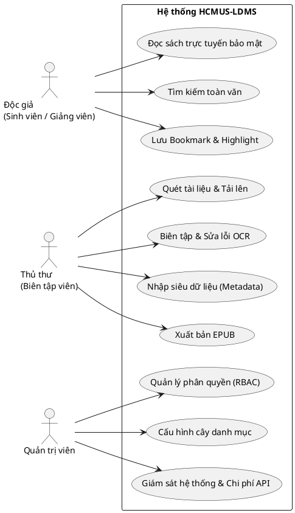
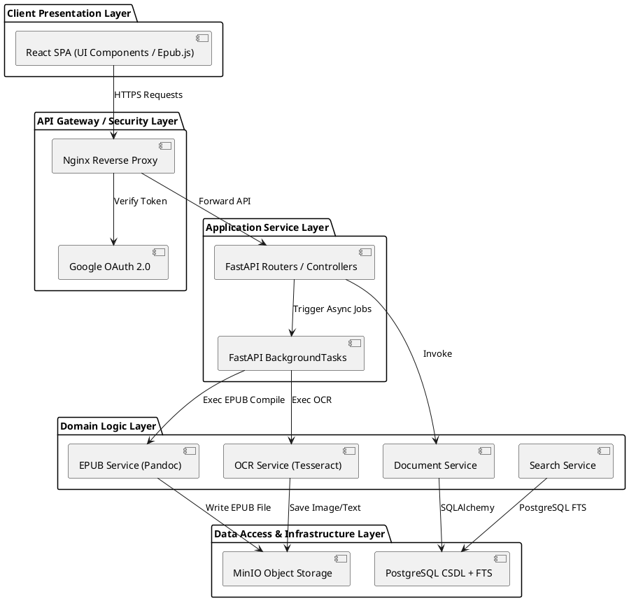
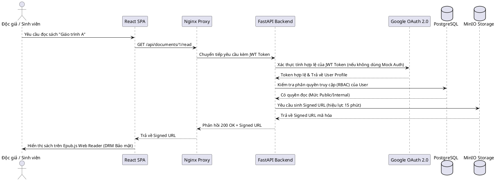

# TÀI LIỆU KIẾN TRÚC PHẦN MỀM (SOFTWARE ARCHITECTURE DOCUMENT)

## Hệ thống Quản lý và Số hóa Tài liệu Thư viện HCMUS (HCMUS-LDMS)

### THÔNG TIN TÀI LIỆU (DOCUMENT CONTROL)

| Trường thông tin (Field)                   | Nội dung đặc tả (Description)                                |
| :----------------------------------------- | :----------------------------------------------------------- |
| **Mã tài liệu (Document ID)**              | `HCMUS-LDMS-SAD`                                             |
| **Tên tài liệu (Document Title)**          | Tài liệu Kiến trúc Phần mềm (Software Architecture Document) |
| **Dự án (Project Name)**                   | HCMUS-LDMS                                                   |
| **Đơn vị soạn thảo (Author/Organization)** | Thư viện & Phòng Công nghệ Thông tin - HCMUS                 |
| **Người xem xét (Reviewer)**               | Trưởng phòng CNTT & Giám đốc Thư viện                        |
| **Người phê duyệt (Approver)**             | Ban Giám hiệu Trường ĐH Khoa học Tự nhiên                    |
| **Cấp độ bảo mật (Security Class)**        | Internal (Nội bộ trường)                                     |
| **Trạng thái tài liệu (Status)**           | Approved (Đã duyệt)                                          |

### LỊCH SỬ PHIÊN BẢN (REVISION HISTORY)

| Phiên bản (Version) | Ngày phát hành (Date) | Mô tả thay đổi (Description of Change)                                                                                                                                                                                                                | Người thực hiện (Author) |
| :-----------------: | :-------------------: | :---------------------------------------------------------------------------------------------------------------------------------------------------------------------------------------------------------------------------------------------------- | :----------------------: |
|         1.0         |      07/07/2026       | Khởi tạo tài liệu kiến trúc ban đầu.                                                                                                                                                                                                                  |      Mạch Quốc Tấn       |
|         2.0         |      14/07/2026       | Cập nhật cấu trúc phân lớp logic, tích hợp các sơ đồ C4 PlantUML (Context, Container, Deployment), sơ đồ tuần tự, sơ đồ Use Case và phân tích phản biện thực thi.                                                                                     |      Mạch Quốc Tấn       |
|         3.0         |      15/07/2026       | Cập nhật tech stack phù hợp đồ án sinh viên: Google OAuth 2.0 thay Keycloak, PostgreSQL FTS thay Elasticsearch, FastAPI BackgroundTasks thay Celery/Redis. Cập nhật toàn bộ sơ đồ C4, Sequence, Deployment. Giữ Modular Monolith và MinIO Signed URL. |     Nhóm phát triển      |
|         4.0         |      17/07/2026       | Tách biệt workflow Thủ thư & BTV, loại bỏ các tech stack cũ, và bổ sung đặc tả kiến trúc PoC 1 & 2 (OCR & luồng liên thông E2E) cùng Skeleton. |    Ân Tiến Nguyên An     |

---

## Mục lục

- [1. Giới thiệu](#1-giới-thiệu)
  - [1.1 Mục đích](#11-mục-đích)
  - [1.2 Phạm vi tài liệu](#12-phạm-vi-tài-liệu)
  - [1.3 Định nghĩa và thuật ngữ viết tắt](#13-định-nghĩa-và-thuật-ngữ-viết-tắt)
- [2. Mục tiêu và Ràng buộc Kiến trúc](#2-mục-tiêu-và-ràng-buộc-kiến-trúc)
  - [2.1 Mục tiêu kiến trúc](#21-mục-tiêu-kiến-trúc)
  - [2.2 Ràng buộc kiến trúc](#22-ràng-buộc-kiến-trúc)
- [3. Mô hình Use-Case hệ thống](#3-mô-hình-use-case-hệ-thống)
- [4. Góc nhìn logic (Logical View - C4 Model)](#4-góc-nhìn-logic-logical-view---c4-model)
  - [4.1 Phong cách kiến trúc hệ thống](#41-phong-cách-kiến-trúc-hệ-thống)
  - [4.2 Ngăn xếp công nghệ chi tiết (Technology Stack)](#42-ngăn-xếp-công-nghệ-chi-tiết-technology-stack)
  - [4.3 Sơ đồ bối cảnh hệ thống (C4 Context Diagram)](#43-sơ-đồ-bối-cảnh-hệ-thống-c4-context-diagram)
  - [4.4 Giải thích các thành phần Kiến trúc logic chi tiết](#44-giải-thích-các-thành-phần-kiến-trúc-logic-chi-tiết)
  - [4.5 Sơ đồ kiến trúc Container (C4 Container Diagram)](#45-sơ-đồ-kiến-trúc-container-c4-container-diagram)
  - [4.6 Sơ đồ tuần tự xử lý số hóa và đọc sách (Sequence Diagram)](#46-sơ-đồ-tuần-tự-xử-lý-số-hóa-và-đọc-sách-sequence-diagram)
  - [4.7 Chi tiết các luồng nghiệp vụ cốt lõi](#47-chi-tiết-các-luồng-nghiệp-vụ-cốt-lõi)
- [5. Giải pháp bảo mật, Sao lưu và Khôi phục thảm họa](#5-giải-pháp-bảo-mật-sao-lưu-và-khôi-phục-thảm-họa)
  - [5.1 Chiến lược bảo mật dữ liệu (Security Layers)](#51-chiến-lược-bảo-mật-dữ-liệu-security-layers)
  - [5.2 Chiến lược sao lưu dữ liệu (Backup Strategy)](#52-chiến-lược-sao-lưu-dữ-liệu-backup-strategy)
  - [5.3 Chỉ số khôi phục thảm họa (Disaster Recovery Targets)](#53-chỉ-số-khôi-phục-thảm-họa-disaster-recovery-targets)
- [6. Góc nhìn Triển khai (Deployment View)](#6-góc-nhìn-triển-khai-deployment-view)
- [7. Góc nhìn Thực thi (Implementation View)](#7-góc-nhìn-thực-thi-implementation-view)
  - [7.1 Cấu trúc thư mục Frontend React](#71-cấu-trúc-thư-mục-frontend-react)
  - [7.2 Cấu trúc thư mục Backend FastAPI](#72-cấu-trúc-thư-mục-backend-fastapi)
  - [7.3 Lý do lựa chọn cấu trúc thư mục & Phân tích phản biện](#73-lý-do-lựa-chọn-cấu-trúc-thư-mục--phân-tích-phản-biện)
- [8. Quản lý cấu hình phần mềm và Chiến lược Git (SCM)](#8-quản-lý-cấu-hình-phần-mềm-và-chiến-lược-git-scm)
- [9. Minh chứng công nghệ (Proof of Concept - PoC) và Cấu trúc mã nguồn khung (Skeleton)](#9-minh-chứng-công-nghệ-proof-of-concept---poc-và-cấu-trúc-mã-nguồn-khung-skeleton)
  - [9.1 Khái niệm và Mục tiêu của Proof of Concept (PoC)](#91-khái-niệm-và-mục-tiêu-của-proof-of-concept-poc)
  - [9.2 PoC 1: Kiến trúc luồng xử lý OCR tiếng Việt bất đồng bộ (Hardest Core Feature)](#92-poc-1-kiến-trúc-luồng-xử-lý-ocr-tiếng-việt-bất-đồng-bộ-hardest-core-feature)
  - [9.3 PoC 2: Kiểm chứng tích hợp liên thông Tech Stack E2E (End-to-End Integration Flow)](#93-poc-2-kiểm-chứng-tích-hợp-liên-thông-tech-stack-e2e-end-to-end-integration-flow)
  - [9.4 Cấu trúc mã nguồn khung (Skeleton Project Layout)](#94-cấu-trúc-mã-nguồn-khung-skeleton-project-layout)

---

## 1. Giới thiệu

Tài liệu này trình bày tổng quan cấu trúc thiết kế kiến trúc của hệ thống **HCMUS-LDMS**. Báo cáo làm rõ sự phân chia các tầng trách nhiệm, định hướng công nghệ lựa chọn và cách thức các module tương tác để hiện thực hóa luồng số hóa tự động hóa khép kín.

### 1.1 Mục đích

Định hình khung kỹ thuật làm cơ sở phát triển đồng bộ cho nhóm lập trình viên Phòng CNTT, đồng thời chứng minh cho Ban Giám hiệu trường về tính khả thi, bảo mật thông tin và khả năng vận hành trơn tru của hệ thống trong điều kiện hạ tầng nội bộ.

### 1.2 Phạm vi tài liệu

Tài liệu bao phủ toàn bộ kiến trúc logic, sơ đồ triển khai phần cứng ảo hóa, cấu trúc tổ chức mã nguồn và các quyết định kỹ thuật liên quan đến hệ thống HCMUS-LDMS.

### 1.3 Định nghĩa và thuật ngữ viết tắt

| Thuật ngữ  | Định nghĩa                                                                             |
| :--------: | :------------------------------------------------------------------------------------- |
|  **LDMS**  | Library Document Management & Digitization System (Hệ thống quản lý số hóa thư viện).  |
|  **SSO**   | Single Sign-On (Xác thực một lần — MVP dùng Google OAuth 2.0, roadmap: Keycloak OIDC). |
|  **DRM**   | Digital Rights Management (Cơ chế quản lý bản quyền số chống sao chép).                |
|  **UCP**   | Use Case Points (Phương pháp ước lượng dựa trên điểm trường hợp sử dụng).              |
| **COCOMO** | Constructive Cost Model (Mô hình toán học ước lượng nỗ lực phần mềm).                  |
|  **SPA**   | Single Page Application (Ứng dụng web trang đơn).                                      |

---

## 2. Mục tiêu và Ràng buộc Kiến trúc

### 2.1 Mục tiêu kiến trúc

- **Hiệu năng cao:** Phản hồi tìm kiếm toàn văn dưới 3 giây (MVP: PostgreSQL FTS, roadmap: Elasticsearch cho scale).
- **Bảo mật bản quyền:** Không hiển thị nút tải EPUB gốc, file serve qua MinIO Signed URL 15 phút.
- **Xử lý bất đồng bộ:** Tác vụ OCR nặng được xử lý dưới nền bằng FastAPI BackgroundTasks (MVP) để không gây nghẽn luồng request chính. Roadmap: Celery + Redis khi cần scale.

### 2.2 Ràng buộc kiến trúc

- **Hạ tầng On-premise:** Triển khai trên máy chủ VMware vSphere có sẵn của trường HCMUS.
- **Ngân sách giới hạn:** Tổng mức chi phí phát triển và mua sắm trang thiết bị ban đầu bắt buộc nằm dưới 100.000.000 VNĐ.

---

## 3. Mô hình Use-Case hệ thống

Mối tương tác giữa các tác nhân và các chức năng nghiệp vụ chính của hệ thống được mô tả trực quan qua sơ đồ Use Case PlantUML dưới đây:

**Ý nghĩa và lý do cần sơ đồ này:**
Sơ đồ Use Case đóng vai trò xác định ranh giới chức năng của hệ thống và phân rõ trách nhiệm của các nhóm người dùng (Độc giả, Thủ thư, Quản trị viên). Nó cung cấp cái nhìn tổng quan đầu tiên về các tính năng cần được thiết kế kiến trúc hỗ trợ, đảm bảo mọi ca sử dụng nghiệp vụ đều được ánh xạ đầy đủ sang cấu trúc các module kỹ thuật.



Hệ thống hỗ trợ 3 tác nhân người dùng chính tương tác qua các ca sử dụng cốt lõi:

- **Thủ thư / Biên tập viên:** Ca sử dụng _Quét tài liệu_, _Biên tập lỗi OCR_, _Nhập Metadata_, _Xuất bản EPUB_.
- **Độc giả (Sinh viên, Giảng viên):** Ca sử dụng _Đọc trực tuyến bảo mật_, _Tìm kiếm toàn văn_, _Lưu Bookmark & Highlight_.
- **Quản trị viên (Admin):** Ca sử dụng _Quản lý phân quyền_, _Cấu hình danh mục_, _Giám sát hệ thống_.

---

## 4. Góc nhìn logic (Logical View - C4 Model)

Mô tả phân lớp chức năng từ giao diện người dùng, xử lý nghiệp vụ trung gian đến lưu trữ dữ liệu nền tảng được thể hiện qua sơ đồ phân lớp kiến trúc logic dưới đây:

**Ý nghĩa và lý do cần sơ đồ phân lớp logic:**
Sơ đồ phân lớp logic giúp phân rã hệ thống thành các tầng trách nhiệm riêng biệt (Presentation, Gateway/Security, Application Service, Domain Logic, Infrastructure/Data Access). Việc phân tầng này đảm bảo tính độc lập phát triển, giúp kiểm soát tốt các luồng phụ thuộc (dependencies) chiều dọc, cô lập các thay đổi công nghệ cơ sở dữ liệu hoặc framework mà không làm ảnh hưởng đến tầng nghiệp vụ và giao diện người dùng.



---

### 4.1 Phong cách kiến trúc hệ thống

Hệ thống HCMUS-LDMS được thiết kế theo mô hình **Modular Monolith** tự xây dựng (custom-built) thay vì sử dụng các phần mềm đóng sẵn có như DSpace hay triển khai kiến trúc Microservices phức tạp.

1. **Vì sao không sử dụng DSpace?**  
   DSpace là một kho lưu trữ số tĩnh, tối ưu cho việc lưu trữ file PDF và siêu dữ liệu (metadata) của luận văn, báo cáo nghiên cứu. DSpace hoàn toàn không hỗ trợ các luồng nghiệp vụ tương tác động phức tạp như: chạy OCR tự động nhận dạng ký tự, biên tập sửa lỗi chính tả trực quan so sánh song song với ảnh quét gốc trên giao diện web, và tự động biên dịch sang định dạng EPUB responsive thông qua Pandoc. Việc phát triển một web app custom giúp nhà trường tối ưu hóa hoàn hảo quy trình nghiệp vụ này.
2. **Vì sao chọn Modular Monolith thay vì Microservices?**  
   Nhóm phát triển kỹ thuật của Phòng CNTT chỉ gồm 4 kỹ sư làm việc kiêm nhiệm (tương đương 2 lập trình viên full-time). Việc triển khai Microservices sẽ gây quá tải trong khâu quản lý hạ tầng mạng, đồng bộ cơ sở dữ liệu và vận hành CI/CD. Kiến trúc Modular Monolith giúp gói gọn toàn bộ logic nghiệp vụ (OCR, Biên tập, Đóng gói, Tìm kiếm, Đọc sách) vào một khối code duy nhất nhưng được phân chia thành các module độc lập rõ ràng. Điều này giúp đơn giản hóa khâu kiểm thử, triển khai và bảo trì, đồng thời dễ dàng tách nhỏ thành các service độc lập ở giai đoạn sau nếu hệ thống phình to.
3. **Xử lý bất đồng bộ các tác vụ nặng (FastAPI BackgroundTasks):**  
   Các tác vụ như chạy OCR trên file PDF hay biên dịch Markdown sang EPUB bằng Pandoc là các tác vụ nặng. Nếu chạy trực tiếp trên luồng API chính sẽ gây nghẽn (block). Hệ thống sử dụng **FastAPI BackgroundTasks** (MVP) để xử lý bất đồng bộ: API trả về trạng thái "Đang xử lý" ngay lập tức, frontend polling trạng thái job. _Roadmap:_ Nếu cần scale (hàng trăm job song song), chuyển sang Celery + Redis.
4. **Tách biệt MinIO Object Storage và PostgreSQL Full-Text Search:**  
   File scan gốc và file EPUB được lưu trên MinIO (S3-compatible). PostgreSQL vừa lưu metadata vừa cung cấp **Full-Text Search** qua `tsvector`/`tsquery` + GIN index — đủ tốt cho vài nghìn documents. _Roadmap:_ Khi dữ liệu > 10.000 documents, bổ sung Elasticsearch (LDMS-025 trong backlog).

### 4.2 Ngăn xếp công nghệ chi tiết (Technology Stack)

| Thành phần          | Lựa chọn công nghệ      |  Phiên bản  | Lý do kỹ thuật                                                                                                                                      |
| :------------------ | :---------------------- | :---------: | :-------------------------------------------------------------------------------------------------------------------------------------------------- |
| **Frontend UI**     | React 18 & TypeScript   |    18.3+    | Xây dựng giao diện Single Page Application (SPA) phản hồi nhanh, kiểm soát kiểu dữ liệu chặt chẽ tránh lỗi runtime.                                 |
| **Web Reader**      | Epub.js                 |    0.3+     | Thư viện nguồn mở tốt nhất hiện tại giúp hiển thị sách EPUB responsive trực tiếp trên trình duyệt, hỗ trợ bookmark, ghi chú.                        |
| **Backend API**     | FastAPI                 | Python 3.11 | Framework API hiệu năng cao, hỗ trợ lập trình bất đồng bộ (async/await), tự động sinh tài liệu Swagger UI.                                          |
| **Web Server**      | Nginx                   |    1.24+    | Reverse Proxy điều phối yêu cầu API, phục vụ static file React và cấu hình mã hóa SSL/TLS 1.3 bảo mật.                                              |
| **Database**        | PostgreSQL              |     16      | Hệ quản trị cơ sở dữ liệu quan hệ mạnh mẽ, lưu trữ thông tin người dùng, phân quyền RBAC, danh mục và siêu dữ liệu sách.                            |
| **OCR Engine**      | Tesseract OCR           |    5.3+     | Engine nhận dạng chữ viết nguồn mở tốt nhất, cấu hình gói tiếng Việt (`vie`) cài đặt cục bộ trực tiếp trên server backend.                          |
| **EPUB Compiler**   | Pandoc & Calibre CLI    | 3.1+ / 6.0+ | Công cụ chuyển đổi định dạng mạnh mẽ, biên dịch Markdown/HTML sang EPUB 3.0 thông qua dòng lệnh.                                                    |
| **Tìm kiếm (MVP)**  | PostgreSQL FTS          |     16      | `tsvector` + `tsquery` + GIN index tích hợp sẵn, không cần service riêng. Đủ tốt cho vài nghìn documents.                                           |
| **Lưu trữ tệp**     | MinIO (On-premise)      |  RELEASE+   | Hệ thống Object Storage tương thích S3, dễ cấu hình và vận hành on-premise trên hạ tầng riêng của trường.                                           |
| **Xác thực (MVP)**  | Google OAuth 2.0        |      —      | Sinh viên/GV có Gmail HCMUS (`@hcmus.edu.vn`). Dùng thư viện `authlib`. Không cần self-host. _Roadmap: Keycloak + LDAP khi triển khai toàn trường._ |
| **Triển khai**      | Docker & Docker Compose |    24.0+    | Đóng gói toàn bộ các service thành container độc lập giúp dễ dàng phân phối và vận hành trên VMware.                                                |
| **Công cụ Sao lưu** | PgBackRest & Restic     |     2.x     | PgBackRest tự động backup gia tăng PostgreSQL hàng ngày. Restic mã hóa và sao lưu MinIO bucket sang máy chủ dự phòng off-site.                      |

### 4.3 Sơ đồ bối cảnh hệ thống (C4 Context Diagram)

**Ý nghĩa và lý do cần sơ đồ này:**
Sơ đồ bối cảnh (System Context Diagram) là mức cao nhất của mô hình C4 (Mức 1). Nó chỉ rõ vị trí của hệ thống HCMUS-LDMS trong môi trường nghiệp vụ thư viện, làm rõ các tác nhân bên ngoài tương tác trực tiếp (Độc giả, Thủ thư, Quản trị viên) và hệ thống xác thực bên ngoài (Google OAuth 2.0), giúp người đọc có cái nhìn tổng quan đầu tiên về ranh giới hệ thống.

```plantuml
@startuml
!includeurl https://raw.githubusercontent.com/plantuml-stdlib/C4-PlantUML/master/C4_Context.puml

Person(reader, "Độc giả (SV, GV)", "Sinh viên, giảng viên trường HCMUS truy cập học liệu")
Person(librarian, "Thủ thư / Biên tập viên", "Cán bộ số hóa tài liệu, duyệt xuất bản")
Person(admin, "Quản trị viên", "Cấu hình hệ thống và phân quyền")

System(ldms, "Hệ thống HCMUS-LDMS", "Hệ thống Quản lý và Số hóa Tài liệu Thư viện, quản lý toàn bộ luồng số hóa khép kín")

System_Ext(google_auth, "Google OAuth 2.0", "Xác thực danh tính qua tài khoản Google HCMUS")

Rel(reader, ldms, "Tìm kiếm và đọc sách trực tuyến bảo mật")
Rel(librarian, ldms, "Upload sách scan, sửa lỗi OCR và xuất bản EPUB")
Rel(admin, ldms, "Quản trị người dùng và cây danh mục")
Rel(ldms, google_auth, "Xác thực danh tính người dùng")

@enduml
```

### 4.4 Giải thích các thành phần Kiến trúc logic chi tiết

Để làm rõ cấu trúc bên trong các sơ đồ container, dưới đây là chi tiết vai trò, nhiệm vụ và lý do cần thiết của từng thành phần con trong hệ thống:

#### 4.3.1. Phân rã thành phần Frontend Client (React & TypeScript)

- **UI Components (Tầng giao diện):**
  - _Nhiệm vụ:_ Chứa các components React có khả năng tái sử dụng (Atomic Design). Nổi bật nhất là màn hình _Split-screen Editor_ và _Web Reader (Epub.js)_.
  - _Tại sao cần:_ Giúp chia nhỏ giao diện thành các phần độc lập, dễ kiểm thử và phát triển song song. Đảm bảo tính nhất quán của UI/UX trên toàn bộ hệ thống.
- **API Services (Tầng dịch vụ API):**
  - _Nhiệm vụ:_ Đóng gói các yêu cầu HTTP (sử dụng thư viện `axios`) gửi đến Backend API Server.
  - _Tại sao cần:_ Tách biệt logic giao tiếp mạng ra khỏi UI components, giúp mã nguồn sạch hơn, dễ thay đổi cấu hình Endpoint và tái sử dụng các phương thức gọi dữ liệu.
- **State Management (Tầng quản lý trạng thái - Zustand/Context):**
  - _Nhiệm vụ:_ Lưu trữ và quản lý trạng thái dùng chung toàn cục như thông tin người dùng đã đăng nhập (User Profile), phiên xác thực (Auth Token), và thiết lập hiển thị (Sepia/Dark mode).
  - _Tại sao cần:_ Tránh hiện tượng "prop drilling" (truyền dữ liệu qua quá nhiều tầng component trung gian), đảm bảo dữ liệu hiển thị đồng bộ trên mọi màn hình.

#### 4.3.2. Phân rã thành phần Backend API Server (FastAPI)

- **Router Layer (Tầng định tuyến):**
  - _Nhiệm vụ:_ Ánh xạ các HTTP requests (GET, POST, PUT, DELETE) gửi tới các Endpoint (ví dụ: `/api/documents/`) đến đúng Controller xử lý tương ứng.
  - _Tại sao cần:_ Là cổng vào duy nhất của API, giúp cấu hình định tuyến tập trung và mạch lạc.
- **Middleware Layer (Tầng kiểm soát trung gian):**
  - _Nhiệm vụ:_ Thực thi các logic kiểm tra chéo (Cross-cutting Concerns) như xác thực JWT (Google OAuth / Mock), phân quyền dựa trên vai trò (RBAC) và kiểm tra kích thước file upload.
  - _Tại sao cần:_ Chặn đứng các yêu cầu không hợp lệ ngay từ vòng ngoài trước khi chúng chạm vào cơ sở dữ liệu hoặc logic nghiệp vụ chính, bảo vệ tài nguyên hệ thống.
- **Controller Layer (Tầng điều phối):**
  - _Nhiệm vụ:_ Tiếp nhận request từ Router, thực hiện kiểm tra định dạng dữ liệu (sử dụng Pydantic Schemas), điều hướng sang Service layer xử lý và trả về HTTP response.
  - _Tại sao cần:_ Đóng vai trò là cầu nối trung gian để chuẩn hóa giao tiếp đầu vào/đầu ra của hệ thống.
- **Service Layer (Tầng nghiệp vụ):**
  - _Nhiệm vụ:_ Nơi chứa 100% logic nghiệp vụ cốt lõi của dự án (gọi engine Tesseract OCR, gọi Pandoc đóng gói sách EPUB, tìm kiếm toàn văn PostgreSQL FTS).
  - _Tại sao cần:_ Đây là lõi nghiệp vụ của toàn dự án, tách biệt hoàn toàn khỏi cơ chế web (HTTP) giúp dễ dàng viết Unit Test và bảo trì lâu dài.
- **Repository Layer (Tầng truy cập dữ liệu):**
  - _Nhiệm vụ:_ Sử dụng SQLAlchemy ORM để truy vấn, cập nhật dữ liệu vào PostgreSQL Database.
  - _Tại sao cần:_ Tránh việc viết các câu lệnh SQL thô phức tạp trong mã nguồn nghiệp vụ, đồng thời trừu tượng hóa các tương tác với CSDL.
- **Model Layer (Tầng thực thể):**
  - _Nhiệm vụ:_ Định nghĩa cấu trúc các bảng dữ liệu trong PostgreSQL (như `Document`, `User`, `ScanPage`, `Category`, `Tag`).
  - _Tại sao cần:_ Khớp nối cấu trúc thực thể trong code với lược đồ vật lý của CSDL.

### 4.5 Sơ đồ kiến trúc Container (C4 Container Diagram)

**Ý nghĩa và lý do cần sơ đồ này:**
Sơ đồ Container C4 cung cấp cái nhìn tổng quan về cấu trúc các thành phần phần mềm (container) độc lập trong hệ thống, chỉ rõ công nghệ được sử dụng (React, FastAPI, PostgreSQL, MinIO) và cách chúng giao tiếp với nhau. Sơ đồ này giúp các lập trình viên và quản trị viên hệ thống hiểu rõ ranh giới của từng dịch vụ, cách thức luồng dữ liệu đi qua reverse proxy Nginx và phân tách trách nhiệm giữa luồng API đồng bộ và tiến trình nền FastAPI BackgroundTasks.

```plantuml
@startuml
!includeurl https://raw.githubusercontent.com/plantuml-stdlib/C4-PlantUML/master/C4_Container.puml

Person(reader, "Độc giả (SV, GV)", "Sinh viên, giảng viên trường HCMUS")
Person(librarian, "Thủ thư / Biên tập viên", "Cán bộ số hóa tài liệu")

System_Boundary(ldms, "Hệ thống HCMUS-LDMS") {
    Container(frontend, "React SPA", "React 18 & TS", "Giao diện Portal & Dashboard, Epub.js Reader")
    Container(nginx, "Nginx Reverse Proxy", "Nginx 1.24", "Reverse Proxy, SSL/TLS, static files")
    Container(backend, "FastAPI Backend", "FastAPI / Python", "Cung cấp REST API, điều phối nghiệp vụ chính, chạy BackgroundTasks")
    ContainerDb(postgres, "PostgreSQL Database", "PostgreSQL 16", "Lưu trữ metadata, users, RBAC & hỗ trợ Full-Text Search (MVP)")
    ContainerDb(minio, "MinIO Object Storage", "MinIO (S3-compatible)", "Lưu trữ ảnh raw scan và file EPUB")
}

System_Ext(google_auth, "Google OAuth 2.0", "Xác thực định danh qua Google Account trường")

Rel(reader, nginx, "HTTPS / Truy cập Portal")
Rel(librarian, nginx, "HTTPS / Truy cập Dashboard")
Rel(nginx, frontend, "Phục vụ static files")
Rel(nginx, backend, "Chuyển tiếp API Requests")
Rel(backend, google_auth, "Xác thực tài khoản Google")
Rel(backend, postgres, "Truy vấn metadata & FTS")
Rel(backend, minio, "Đọc/ghi file scan, file EPUB & sinh Signed URL")
@enduml
```

### 4.6 Sơ đồ tuần tự xử lý số hóa và đọc sách (Sequence Diagram)

**Ý nghĩa và lý do cần sơ đồ này:**
Sơ đồ tuần tự làm rõ trình tự thời gian và luồng gọi API giữa các thành phần khi thực hiện tác vụ nghiệp vụ quan trọng nhất: Yêu cầu đọc sách bảo mật của sinh viên. Nó chỉ rõ cơ chế kiểm tra phân quyền RBAC dựa trên JWT Token được Google OAuth 2.0 (hoặc Mock Auth) cấp, quá trình đối chiếu quyền trong database PostgreSQL, và việc sinh đường dẫn ký số Signed URL có thời hạn (15 phút) từ MinIO Storage để ngăn chặn hành vi tải lậu trực tiếp.



### 4.7 Chi tiết các luồng nghiệp vụ cốt lõi


#### 4.7.1. Quy trình Số hóa và Xuất bản (Thủ thư & Biên tập viên)

1. **Số hóa & Khai báo (Thủ thư):**
   * Thủ thư quét sách giấy vật lý thành tệp PDF/ảnh 300 DPI tiêu chuẩn bằng máy quét chữ V.
   * Đăng nhập hệ thống bằng Google OAuth 2.0, tải tệp lên dashboard (lưu trữ tại MinIO) và nhập metadata chuẩn Dublin Core.
   * Thủ thư kích hoạt tiến trình OCR, Backend FastAPI tạo job chạy ngầm qua `FastAPI BackgroundTasks` để trích xuất văn bản thô theo trang và gán cho Biên tập viên.
2. **Hiệu chỉnh & Bàn giao (Biên tập viên):**
   * Biên tập viên đăng nhập hệ thống, truy cập Workspace riêng, mở giao diện Split-screen để đối chiếu ảnh scan gốc và văn bản OCR, chỉnh sửa lỗi chính tả thô.
   * Sau khi soát lỗi xong, Biên tập viên bấm **"Gửi yêu cầu phê duyệt"**, trạng thái sách chuyển sang "Chờ duyệt".
3. **Kiểm duyệt & Xuất bản (Thủ thư):**
   * Thủ thư mở dashboard danh sách chờ phê duyệt, kiểm tra chất lượng bản dịch. Nếu đạt yêu cầu, nhấn **"Phê duyệt xuất bản"**.
   * Hệ thống kích hoạt Pandoc đóng gói tài liệu thành chuẩn EPUB 3.0, tải lên MinIO Storage, cập nhật trạng thái "Published" lên PostgreSQL và lập chỉ mục FTS trực tiếp trong Postgres.

#### 4.7.2. Quy trình Tìm kiếm và Đọc sách trực tuyến (Sinh viên / Độc giả)

1. **Đăng nhập:** Sinh viên truy cập Web Portal, đăng nhập qua Google OAuth.
2. **Tìm kiếm:** Nhập từ khóa tìm kiếm để truy vấn toàn văn qua PostgreSQL Full-Text Search.
3. **Xác thực quyền đọc:** Khi độc giả bấm đọc, backend kiểm tra phân quyền RBAC. Nếu hợp lệ, backend sinh Signed URL MinIO (hiệu lực 15 phút).
4. **Đọc sách responsive:** Trình xem Epub.js hiển thị sách responsive trên mobile/tablet, cho phép chỉnh font, cỡ chữ, màu nền, bookmark.

---

## 5. Giải pháp bảo mật, Sao lưu và Khôi phục thảm họa

### 5.1 Chiến lược bảo mật dữ liệu (Security Layers)

- **Mã hóa truyền tải:** Cấu hình HTTPS (TLS 1.3) bắt buộc trên Nginx cho mọi luồng truyền tải dữ liệu. Cấu hình tiêu đề bảo mật HSTS (HTTP Strict Transport Security) để ngăn chặn các cuộc tấn công hạ cấp giao thức.
- **Bảo mật truy cập tệp tin (Signed URL):** File EPUB gốc được lưu giữ riêng tư trên MinIO, không công khai URL trực tiếp. Khi độc giả được xác thực quyền đọc sách qua RBAC, Backend FastAPI sẽ sinh một **Signed URL** giới hạn thời gian hiệu lực tối đa là **15 phút**. Trình đọc Epub.js ở frontend dùng URL này để tải file tương ứng của từng chương sách.
- **Vô hiệu hóa tải lậu (Anti-scraping):** Trình xem Epub.js không hiển thị nút tải file EPUB gốc để bảo vệ quyền tác giả. README ghi nhận các rủi ro tồn dư khác (như chụp màn hình).

### 5.2 Chiến lược sao lưu dữ liệu (Backup Strategy)

- **PostgreSQL Database:** Sử dụng công cụ **PgBackRest** tự động chạy sao lưu gia tăng (incremental backup) vào lúc 02:00 AM mỗi ngày, và chạy sao lưu toàn phần (full backup) vào tối Chủ nhật hàng tuần. Các bản sao lưu được nén và mã hóa bằng thuật toán AES-256 trước khi lưu trữ vào cụm lưu trữ độc lập.
- **MinIO Object Storage:** Sử dụng công cụ **Restic** tự động đồng bộ hóa và mã hóa toàn bộ dữ liệu PDF gốc và file EPUB thành phẩm hàng đêm sang hệ thống NAS lưu trữ off-site của trường.
- **Chính sách lưu giữ (Retention Policy):** Bản sao lưu ngày giữ trong 30 ngày; bản sao lưu tuần giữ trong 12 tuần; bản sao lưu tháng giữ trong 12 tháng.

### 5.3 Chỉ số khôi phục thảm họa (Disaster Recovery Targets)

- **RPO (Recovery Point Objective):** Tối đa **24 giờ**. Đảm bảo trong tình huống xấu nhất (cháy nổ máy chủ vật lý), thư viện không bị mất quá 1 ngày làm việc số hóa của các biên tập viên.
- **RTO (Recovery Time Objective):** Tối đa **4 giờ**. Thời gian khôi phục toàn bộ các container và nạp dữ liệu backup từ NAS sang máy chủ dự phòng để hệ thống hoạt động bình thường trở lại.

---

## 6. Góc nhìn Triển khai (Deployment View)

Mô tả phân bổ vật lý và cấu trúc mạng ảo hóa của các container trên hệ thống máy chủ trường ĐH KHTN được thể hiện qua sơ đồ triển khai C4 PlantUML:

```plantuml
@startuml
!includeurl https://raw.githubusercontent.com/plantuml-stdlib/C4-PlantUML/master/C4_Deployment.puml

Deployment_Node(vmware, "Hạ tầng ảo hóa VMware vSphere (HCMUS)", "VMware ESXi") {

    Deployment_Node(vm_prod, "VM-Production (Máy chủ vận hành chính)", "Ubuntu Server 22.04 LTS") {
        Deployment_Node(docker_prod, "Docker Compose Engine", "Docker v24.x") {
            Container(nginx, "Nginx Reverse Proxy", "Nginx 1.24", "Reverse Proxy, SSL/TLS, static files React")
            Container(backend, "FastAPI Backend", "FastAPI / Python", "RESTful API Server & BackgroundTasks")
            ContainerDb(postgres, "PostgreSQL Database", "PostgreSQL 16", "Lưu trữ metadata, RBAC & Postgres FTS")
            ContainerDb(minio, "MinIO Storage", "MinIO (S3-compatible)", "Lưu trữ tài liệu và EPUB")
        }
    }

    Deployment_Node(vm_staging, "VM-Staging (Máy chủ kiểm thử & UAT)", "Ubuntu Server 22.04 LTS") {
        Deployment_Node(docker_staging, "Docker Compose Engine (Staging)", "Docker v24.x") {
            Container(staging_app, "HCMUS-LDMS Stack (Staging)", "React & FastAPI Stack", "Môi trường kiểm thử độc lập cho Developer và UAT")
        }
    }
}

System_Ext(google_auth, "Google OAuth 2.0 API", "Dịch vụ xác thực Google API (ngoài VM dự án)")

Rel(nginx, backend, "Chuyển tiếp API Request", "HTTP / Port 8000")
Rel(backend, google_auth, "Xác thực JWT Token", "HTTPS")
Rel(backend, postgres, "Truy vấn SQL & Full-Text Search", "SQL / Port 5432")
Rel(backend, minio, "Đọc/Ghi dữ liệu tệp", "S3 API / Port 9000")
@enduml
```

---

## 7. Góc nhìn Thực thi (Implementation View)

### 7.1 Cấu trúc thư mục Frontend React

```
/frontend
├── public/                 # Các tệp tĩnh phục vụ trực tiếp
├── src/
│   ├── assets/             # Font chữ, hình ảnh, CSS dùng chung
│   ├── components/         # Component UI nhỏ gọn, tái sử dụng
│   ├── pages/              # Giao diện chính (Dashboard, Editor, Reader)
│   ├── services/           # Kết nối REST API (auth, document, search)
│   ├── context/            # Lưu trữ global state (phiên đăng nhập, UI mode)
│   ├── utils/              # Các hàm bổ trợ
│   ├── App.tsx             # Điểm khởi chạy React
│   └── main.tsx            # Điểm gắn kết DOM
├── package.json            # Thư viện phụ thuộc
└── tsconfig.json           # Cấu hình TypeScript
```

### 7.2 Cấu trúc thư mục Backend FastAPI

```
/backend
├── app/
│   ├── api/                # Định nghĩa Router và Controller
│   │   ├── auth.py         # Xác thực Google OAuth 2.0 / Mock Auth
│   │   ├── document.py     # Quản lý số hóa tài liệu & background jobs
│   │   └── search.py       # Tìm kiếm PostgreSQL FTS
│   ├── core/               # Cấu hình hệ thống và kết nối DB
│   ├── models/             # Định nghĩa cấu trúc PostgreSQL (SQLAlchemy)
│   ├── schemas/            # Định nghĩa Pydantic validation
│   ├── services/           # Xử lý nghiệp vụ chính
│   │   ├── ocr.py          # Tích hợp Tesseract
│   │   └── epub.py         # Gọi Pandoc đóng gói
│   └── background/         # Logic cho FastAPI BackgroundTasks
├── requirements.txt        # Các thư viện Python phụ thuộc
└── docker-compose.yml      # Cấu hình chạy cụm container (API + DB + Storage)
```

---

### 7.3 Lý do lựa chọn cấu trúc thư mục & Phân tích phản biện

Để bảo vệ thiết kế cấu trúc thư mục thực thi của dự án trước các phương án thay thế, dưới đây là chi tiết phân tích phản biện:

1. **Đối với cấu trúc thư mục Frontend React:**
   - _Lựa chọn thiết kế:_ Cấu trúc phân lớp kỹ thuật (Technical Layering: `components/`, `pages/`, `services/`, `context/`).
   - _Phản biện (Counter-argument):_ Một số lập trình viên cho rằng nên áp dụng cấu trúc phân rã theo tính năng nghiệp vụ (Feature-based structure: ví dụ `/features/ocr/`, `/features/reader/` tự chứa các component, service riêng).
   - _Giải trình biện hộ (Refutation):_ Phương án chia theo tính năng (Feature-based) chỉ hiệu quả đối với các hệ thống siêu lớn (Enterprise) với hàng chục lập trình viên làm việc độc lập trên các phân hệ khác nhau. Với dự án HCMUS-LDMS giai đoạn MVP có quy mô nhỏ (dưới 10.000 dòng code frontend), cấu trúc phân lớp kỹ thuật (Technical Layering) giúp:
     - _Tái sử dụng tối đa components:_ Trình biên tập Split-screen và Trình đọc Web Reader Epub.js sử dụng chung rất nhiều components dùng chung (nút bấm, hộp thoại, thanh điều hướng). Việc gom chung vào `components/` giúp tìm kiếm và tái sử dụng dễ dàng.
     - _Giảm thiểu import chéo phức tạp:_ Hạn chế lỗi tham chiếu vòng (circular dependency) thường gặp khi chia nhỏ thư mục theo tính năng.
     - _Đường cong học tập thấp:_ Phù hợp với nhóm phát triển nhỏ 4 người, giúp dễ dàng định vị file cần sửa đổi.

2. **Đối với cấu trúc thư mục Backend FastAPI:**
   - _Lựa chọn thiết kế:_ Kiến trúc phân tầng 3 lớp (3-tier Architecture: `/api`, `/services`, `/models`).
   - _Phản biện (Counter-argument):_ Ý kiến trái chiều cho rằng nên áp dụng kiến trúc lục giác (Hexagonal Architecture / Clean Architecture) để cách ly hoàn toàn business logic khỏi các framework bên ngoài (SQLAlchemy ORM, FastAPI) thông qua các lớp Interfaces và Adapters.
   - _Giải trình biện hộ (Refutation):_ Mặc dù kiến trúc lục giác tăng tính độc lập kiểm thử, nó đòi hỏi viết rất nhiều lớp trung gian (DTOs, Mappers, Interface classes) làm tăng số lượng dòng code boilerplate vô nghĩa lên gấp 2-3 lần. Trong bối cảnh dự án học thuật giới hạn thời gian (20 tuần) và nhân sự bán thời gian:
     - _Tối ưu hóa thời gian phát triển:_ Kiến trúc 3 lớp kết hợp SQLAlchemy ORM giúp lập trình viên viết code nghiệp vụ và kết nối DB cực nhanh, đẩy nhanh tiến độ bàn giao sản phẩm.
     - _Tránh thiết kế quá tải (Over-engineering):_ Hệ thống LDMS sử dụng PostgreSQL cố định, không có nhu cầu thay đổi hệ quản trị cơ sở dữ liệu trong suốt vòng đời dự án. Do đó, việc xây dựng các adapter trung gian chỉ để độc lập DB là không thực tế và lãng phí nỗ lực.

## 8. Quản lý cấu hình phần mềm và Chiến lược Git (SCM)

### 8.1. Quy chuẩn định danh các Hạng mục cấu hình (Configuration Items - CIs)

Để đảm bảo khả năng truy vết và kiểm soát phiên bản trong quá trình phát triển, dự án áp dụng quy tắc đặt mã định danh duy nhất cho các tài liệu và sản phẩm bàn giao:
`LDMS_[LOAI_CI]_[TRANG_THAI]X.Y`

Trong đó:

- `LDMS`: Mã dự án (HCMUS-LDMS).
- `LOAI_CI`: Phân loại hạng mục cấu hình:
  - `PLN`: Kế hoạch dự án (Project Plan).
  - `SRD`: Yêu cầu hệ thống (System Requirements).
  - `SDD`: Thiết kế kiến trúc & hệ thống (System Design).
  - `SRC`: Mã nguồn ứng dụng (Source Code).
  - `TSP`: Kế hoạch kiểm thử (Test Plan).
- `TRANG_THAI`: Ký hiệu trạng thái phát triển: `R` (Release - Chính thức), `A` (Alpha - Sơ khởi), `B` (Beta - Thử nghiệm).
- `X.Y`: Phiên bản chính (X) và phụ (Y).

_Ví dụ:_

- Tài liệu kiến trúc này: `LDMS_SDD_R3.0.md`
- Mã nguồn Backend FastAPI: `LDMS_SRC_B1.0`

### 8.2. Chiến lược nhánh Git (Git Branching Strategy)

Dự án áp dụng mô hình **GitFlow** để điều phối mã nguồn của nhóm phát triển 4 người:

- **`main`**: Nhánh chứa mã nguồn ổn định nhất đang chạy trên môi trường Production. Chỉ được phép merge từ nhánh `release/*` thông qua Pull Request (PR) có sự phê duyệt của Tech Lead (PM/SA). Mỗi lần merge lên `main` sẽ tự động đánh tag phiên bản (ví dụ: `v1.0.0`).
- **`develop`**: Nhánh tích hợp chính cho các tính năng mới trong từng Sprint. Tất cả các developer sẽ tích hợp mã nguồn tại đây sau khi code của họ được review.
- **`feature/*`**: Các nhánh phát triển tính năng riêng lẻ (ví dụ: `feature/ocr-integration`, `feature/epub-reader`). Tạo ra từ nhánh `develop` và merge lại vào `develop` sau khi hoàn tất kiểm thử unit test cục bộ.
- **`release/*`**: Nhánh chuẩn bị phát hành phiên bản (ví dụ: `release/v1.0-MVP`). Nhánh này phục vụ giai đoạn UAT và fix lỗi cuối cùng trước khi chuyển giao chính thức sang `main` và `develop`.
- **`hotfix/*`**: Các nhánh sửa lỗi khẩn cấp trực tiếp từ `main` khi có lỗi bảo mật hoặc sập hệ thống trên Production. Sau khi sửa xong sẽ được merge đồng thời vào `main` và `develop`.

---

## 9. Minh chứng công nghệ (Proof of Concept - PoC) và Cấu trúc mã nguồn khung (Skeleton)

### 9.1. Khái niệm và Mục tiêu của Proof of Concept (PoC)

Để giảm thiểu rủi ro kỹ thuật trong pha thiết kế kiến trúc, dự án LDMS thực hiện các kịch bản kiểm chứng thực nghiệm (PoC) độc lập trước khi triển khai hệ thống quy mô lớn. Hoạt động PoC tập trung vào hai nhánh chính:
1. **PoC Loại 1 (Kiểm chứng tính năng phức tạp nhất):** Xử lý nhận dạng ký tự tiếng Việt bất đồng bộ (FastAPI BackgroundTasks + Tesseract OCR). Mục tiêu là chứng minh việc cô lập các tiến trình tính toán nặng (CPU-bound) không làm ảnh hưởng đến khả năng phản hồi thời gian thực của Web Server (I/O-bound).
2. **PoC Loại 2 (Kiểm chứng tích hợp ngăn xếp công nghệ đơn giản):** Luồng đọc sách bảo mật end-to-end. Mục tiêu là chứng minh khả năng phối hợp liên hoàn giữa xác thực Google OAuth 2.0, cấp quyền truy cập học liệu trong cơ sở dữ liệu PostgreSQL, sinh link ký số bảo mật từ Storage MinIO và hiển thị trực tuyến qua Epub.js mà không lưu trữ file tạm trên thiết bị người dùng.

---

### 9.2. PoC 1: Kiến trúc luồng xử lý OCR tiếng Việt bất đồng bộ (Hardest Core Feature)

Mục tiêu kiểm chứng: Xác nhận khả năng tích hợp thư viện bọc Tesseract OCR trong môi trường Python và chuyển tác vụ chạy sang BackgroundTasks để giải phóng phản hồi HTTP ngay lập tức.

#### Nguyên lý thiết kế luồng xử lý:
1. **Tiếp nhận Yêu cầu (Request Acceptance):** Trình duyệt gửi tệp ảnh/PDF trang sách lên API Endpoint `/api/documents/{id}/ocr`.
2. **Chuyển tác vụ chạy ngầm (Delegation):** FastAPI tiếp nhận, ghi file thô vào vùng đệm tạm thời (hoặc MinIO Storage), sau đó đăng ký một hàm xử lý `run_ocr_task` vào `BackgroundTasks` của hệ thống.
3. **Phản hồi tức thì (Instant Response):** API Endpoint lập tức trả về mã trạng thái `202 Accepted` kèm JSON thông báo tác vụ đã được đưa vào hàng đợi chạy ngầm. Người dùng không cần treo màn hình chờ đợi.
4. **Xử lý bất đồng bộ trong Thread Pool (Async CPU Execution):** Hàm `run_ocr_task` gọi engine Tesseract. Do thao tác OCR là tác vụ ngốn CPU (CPU-bound), hệ thống ứng dụng cơ chế `loop.run_in_executor` của Python asyncio để đẩy việc chạy sang ThreadPoolExecutor độc lập, ngăn chặn hoàn toàn việc block Event Loop chính của ứng dụng.
5. **Cập nhật trạng thái:** Sau khi hoàn tất, kết quả trích xuất văn bản được lưu lại vào PostgreSQL và cập nhật trạng thái tài liệu thành `Processed`.

---

### 9.3. PoC 2: Kiểm chứng tích hợp liên thông Tech Stack E2E (End-to-End Integration Flow)

**Kịch bản kiểm chứng thực tế:** Sinh viên nhấn nút "Đọc sách" trực tuyến trên giao diện Web Portal.

**Mục tiêu kiểm chứng:** Đảm bảo toàn bộ ngăn xếp công nghệ kết nối đồng bộ và truyền nhận dữ liệu thông suốt giữa tất cả thành phần: client gọi API (React) $\rightarrow$ xác thực phiên làm việc (Google OAuth 2.0 / Mock Auth) $\rightarrow$ truy vấn thông tin (PostgreSQL Database) $\rightarrow$ kết nối và lấy tệp tin vật lý (MinIO Storage) $\rightarrow$ render hiển thị trên giao diện (Epub.js).

#### Nguyên lý vận hành tích hợp của ngăn xếp công nghệ:
1. **Xác thực định danh người dùng (Auth Integration):**
   * Client (React) gửi yêu cầu đọc sách kèm mã định danh JWT Token (Google OAuth 2.0 / Mock Auth) qua Header HTTP.
   * FastAPI API Server đóng vai trò Gateway tiếp nhận và giải mã token để xác định thông tin phiên làm việc của người dùng.
2. **Truy xuất thông tin metadata (Database Integration):**
   * API Server sử dụng ORM để thực hiện truy vấn thông tin tệp sách tương ứng trong PostgreSQL Database dựa trên mã ID sách nhận được.
   * Database trả về đường dẫn lưu trữ tệp và trạng thái xuất bản hợp lệ của tài liệu.
3. **Truy xuất tệp tin vật lý (Storage Integration):**
   * API Server gửi yêu cầu đến MinIO Client thông qua kết nối API S3 để tạo một đường dẫn tạm thời (Signed URL) trỏ tới tệp EPUB lưu trữ trong bucket.
   * MinIO trả về Signed URL động cho API Server để gửi ngược về Client.
4. **Hiển thị giao diện người dùng (Frontend Integration):**
   * Client React nhận Signed URL từ phản hồi API, nạp trực tiếp vào thư viện Web Reader (Epub.js).
   * Thư viện Epub.js stream nội dung file và dựng (render) trực tiếp các chương sách lên trình duyệt của sinh viên.

---

### 9.4. Cấu trúc mã nguồn khung (Skeleton Project Layout)

Mã nguồn khung của dự án HCMUS-LDMS được tổ chức theo mô hình Modular Monolith sạch, tách riêng Frontend và Backend trong cùng một repository:

```text
hcmus-projectmanage--lab/
├── docker-compose.yml         # Container PostgreSQL & MinIO chạy Docker
├── .gitignore
├── backend/                   # SKELETON BACKEND (FastAPI)
│   ├── requirements.txt       # Dependencies (fastapi, uvicorn, boto3, pytesseract, sqlalchemy)
│   ├── Dockerfile
│   └── app/
│       ├── main.py            # Entry point chính của ứng dụng
│       ├── core/              # Cấu hình bảo mật JWT, kết nối PostgreSQL, kết nối MinIO
│       ├── api/               # Router endpoints (auth, documents, ocr, reader)
│       ├── models/            # SQLAlchemy database models (User, Role, Document, Metadata)
│       └── services/          # Xử lý nghiệp vụ chính (Background OCR, sinh Signed URL)
└── frontend/                  # SKELETON FRONTEND (React + TypeScript)
    ├── package.json           # Dependencies (react, typescript, tailwindcss, epubjs)
    ├── Dockerfile
    ├── public/
    └── src/
        ├── index.tsx          # Entry point chính của client SPA
        ├── components/        # Components dùng chung (Layout, Reader, Editor UI)
        ├── pages/             # Các trang chính (Login, Dashboard, Workspace, Portal)
        └── services/          # Quản lý gọi API Client (axios client, auth handler)
```
