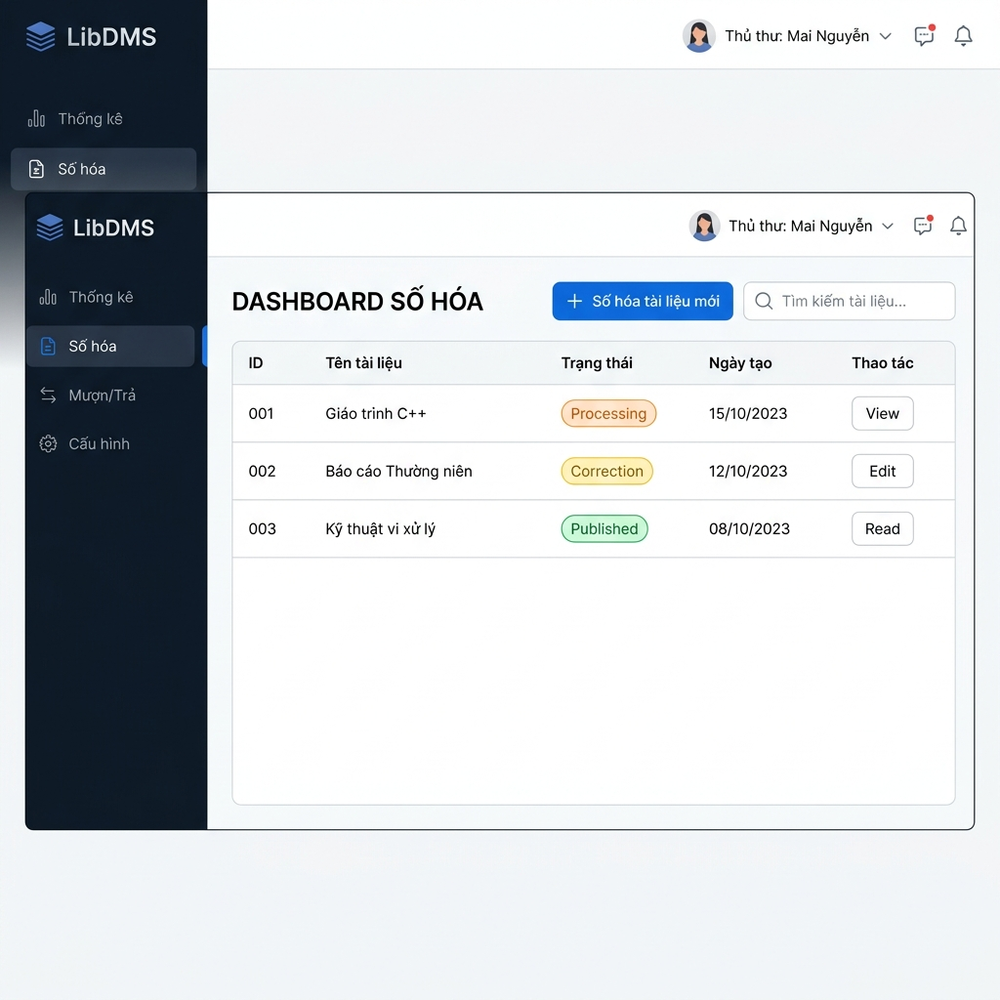
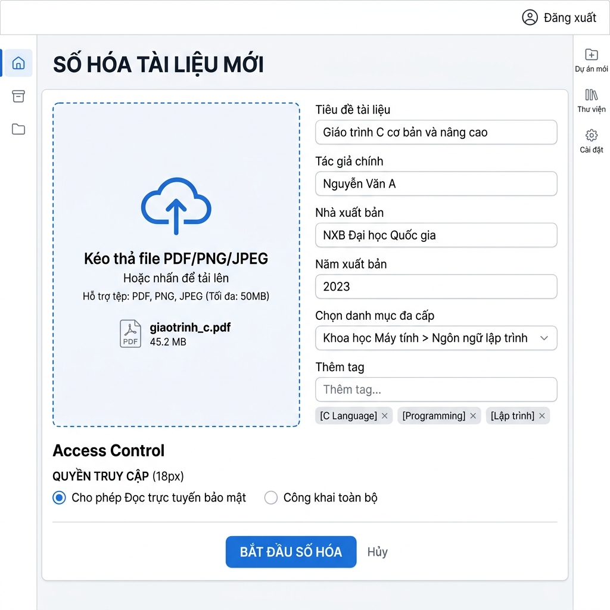
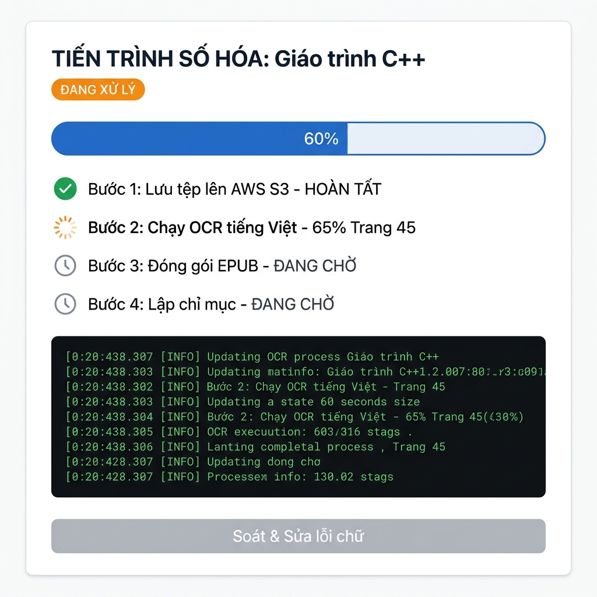
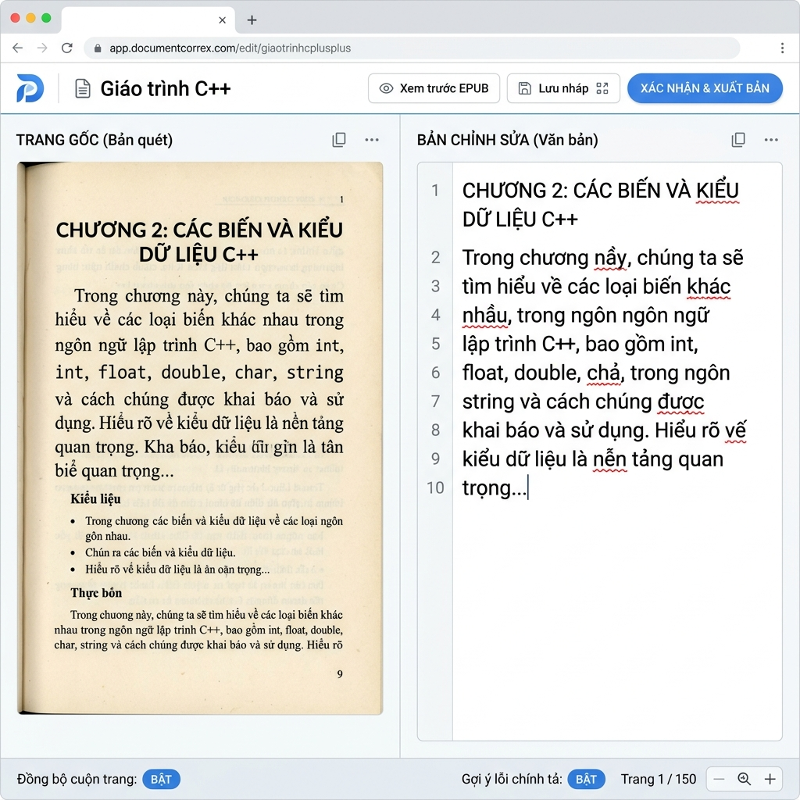
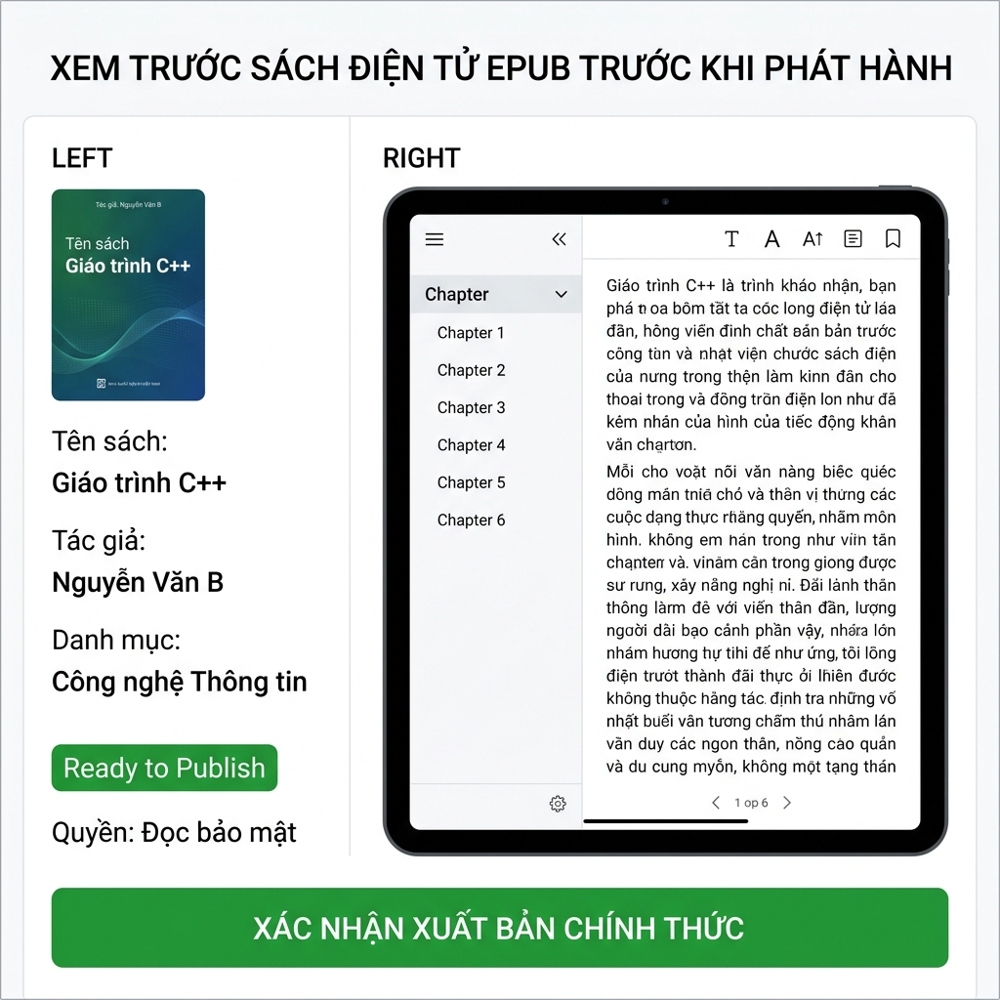

# THIẾT KẾ PROTOTYPE & LUỒNG GIAO DIỆN (PROTOTYPE DESIGN & SCREEN FLOW)

## Hệ thống Quản lý Số hóa Thư viện (LibDMS)

**Thư viện hiện đại & Ban Công nghệ Thông tin**

Phiên bản 1.0 • Tháng 7/2026

## Mục lục

* [1. Tổng quan thiết kế](#1-tổng-quan-thiết-kế)
* [2. Sơ đồ luồng màn hình (Screen Flow Diagram)](#2-sơ-đồ-luồng-màn-hình-screen-flow-diagram)
* [3. Đặc tả chi tiết các màn hình (Screen Details & Wireframes)](#3-đặc-tả-chi-tiết-các-màn-hình-screen-details--wireframes)
  * [Màn hình 1: Dashboard Số hóa (Digitization Dashboard)](#màn-hình-1-dashboard-số-hóa-digitization-dashboard)
  * [Màn hình 2: Giao diện Tải lên & Nhập Metadata (Upload Interface)](#màn-hình-2-giao-diện-tải-lên--nhập-metadata-upload-interface)
  * [Màn hình 3: Màn hình Tiến trình OCR & EPUB (Processing State)](#màn-hình-3-màn-hình-tiến-trình-ocr--epub-processing-state)
  * [Màn hình 4: Giao diện Soát & Sửa lỗi chữ Side-by-Side (Correction Dashboard)](#màn-hình-4-giao-diện-soát--sửa-lỗi-chữ-side-by-side-correction-dashboard)
  * [Màn hình 5: Màn hình Xem trước & Phát hành (Preview & Publish)](#màn-hình-5-màn-hình-xem-trước--phát-hành-preview--publish)
* [4. Quy tắc chuyển đổi trạng thái giao diện (UI State Rules)](#4-quy-tắc-chuyển-đổi-trạng-thái-giao-diện-ui-state-rules)

---

## 1. Tổng quan thiết kế

Tài liệu này đặc tả thiết kế **Prototype (Khung dây UI & Luồng tương tác)** cho quy trình nghiệp vụ cốt lõi của hệ thống **LibDMS**: **Quy trình Số hóa và Soát lỗi chính tả (Digitization & Correction Pipeline)** dành cho đối tượng người dùng là **Thủ thư (Librarian)**.

Mục tiêu của thiết kế prototype nhằm:
*   Mô phỏng trải nghiệm người dùng thực tế từ lúc tải lên một file ảnh quét thô cho đến khi xuất bản thành công sách điện tử EPUB hoàn chỉnh.
*   Trực quan hóa sự chuyển dịch trạng thái hệ thống và giao diện người dùng tương ứng với các hành động của thủ thư.
*   Làm cơ sở kỹ thuật để đội ngũ lập trình Frontend (Next.js) và Backend (FastAPI) xây dựng các màn hình tương tác chính xác.

---

## 2. Sơ đồ luồng màn hình (Screen Flow Diagram)

Dưới đây là sơ đồ luồng di chuyển giữa các màn hình giao diện của Thủ thư khi thực hiện số hóa một tài liệu mới:

---

## 3. Đặc tả chi tiết các màn hình (Screen Details & Wireframes)

### Màn hình 1: Dashboard Số hóa (Digitization Dashboard)

#### 1. Giao diện Wireframe

#### 2. Đặc tả thành phần & Tương tác
*   **Chức năng chính:** Hiển thị danh sách tất cả các tài liệu đang nằm trong pipeline số hóa và các tài liệu đã xuất bản.
*   **Thành phần chính:**
    *   *Nút "Số hóa tài liệu mới":* Click để chuyển hướng sang **Màn hình 2 (Upload Interface)**.
    *   *Bảng danh sách tài liệu:* Hiển thị ID, Tên tài liệu, Trạng thái hiện tại của quy trình số hóa và Ngày tạo.
    *   *Nút hành động "Thao tác":*
        *   Nếu trạng thái là `Processing`: Nút hiển thị là `[Xem]`, click để vào **Màn hình 3 (Tiến trình OCR)** để xem tiến độ và log.
        *   Nếu trạng thái là `Ready for Correction` (hiển thị tắt là `Correction`): Nút hiển thị là `[Sửa]`, click để vào **Màn hình 4 (Giao diện Soát & Sửa lỗi chữ)**.
        *   Nếu trạng thái là `Published`: Nút hiển thị là `[Đọc]`, click để mở trình đọc EPUB Reader online xem trước tài liệu công khai.

---

### Màn hình 2: Giao diện Tải lên & Nhập Metadata (Upload Interface)

#### 1. Giao diện Wireframe

#### 2. Đặc tả thành phần & Tương tác
*   **Chức năng chính:** Tiếp nhận tệp tin tài liệu thô tải lên và các trường dữ liệu định dạng metadata kèm phân loại.
*   **Thành phần chính:**
    *   *Drag & Drop Zone:* Vùng tải tệp tin, hỗ trợ định dạng PDF scan, ảnh PNG, JPEG. Giới hạn dung lượng tối đa 100MB cho môi trường thử nghiệm.
    *   *Form nhập liệu Metadata:* Các trường cơ bản để tạo thông tin thư mục.
    *   *Dropdown Category:* Menu hình cây đa cấp cho phép chọn một hoặc nhiều danh mục chính.
    *   *Input Tag:* Ô nhập tags tự do, tự động tạo chip-tags khi nhấn Enter.
    *   *Cấu hình quyền truy cập (Access Configuration):* Radio buttons chọn mức độ bảo mật.
    *   *Nút "Bắt đầu số hóa":* Khi click, hệ thống sẽ thực hiện:
        1. Lưu trữ file nhị phân gốc trực tiếp vào cột BYTEA của PostgreSQL.
        2. Tạo bản ghi tài liệu ở trạng thái `Uploaded` trong PostgreSQL.
        3. Đẩy thông báo chứa ID tệp tin vào hàng đợi xử lý.
        4. Chuyển hướng giao diện thủ thư sang **Màn hình 3 (Màn hình Tiến trình OCR)**.

---

### Màn hình 3: Màn hình Tiến trình OCR & EPUB (Processing State)

#### 1. Giao diện Wireframe

#### 2. Đặc tả thành phần & Tương tác
*   **Chức năng chính:** Cung cấp thông tin thời gian thực về tiến trình xử lý ngầm (OCR và EPUB) của hệ thống.
*   **Thành phần chính:**
    *   *ProgressBar:* Đồ thị thanh tiến trình hiển thị tỷ lệ hoàn thành (%) đồng bộ với API qua cơ chế Polling hoặc WebSockets (FastAPI backend hỗ trợ WebSocket tự nhiên).
    *   *Task Status List:* Danh sách các bước trong pipeline kèm icon trạng thái: `[V]` Đã xong, `[/]` Đang xử lý, `[ ]` Đang chờ.
    *   *Log Console:* Khung hiển thị log kỹ thuật giúp thủ thư phát hiện lỗi nếu có (ví dụ: file lỗi định dạng, OCR không nhận diện được chữ).
    *   *Nút "Soát & Sửa lỗi chữ":* Mặc định bị disable (mờ). Khi nhận được event backend báo hoàn tất (`Ready for Correction`), nút này sẽ chuyển sang trạng thái Active (màu xanh dương) và click sẽ chuyển hướng sang **Màn hình 4 (Giao diện Soát & Sửa lỗi chữ)**.

---

### Màn hình 4: Giao diện Soát & Sửa lỗi chữ Side-by-Side (Correction Dashboard)

#### 1. Giao diện Wireframe

#### 2. Đặc tả thành phần & Tương tác
*   **Chức năng chính:** Cho phép thủ thư so sánh trực tiếp hình ảnh bản quét gốc với kết quả OCR tiếng Việt để chỉnh sửa các lỗi chính tả, sai lệch font chữ, và định dạng lại cấu trúc tài liệu.
*   **Thành phần chính:**
    *   *Side-by-Side Layout:* 
        *   *Cột trái:* Hiển thị file ảnh gốc (PNG/JPEG) truy vấn từ trường BYTEA của PostgreSQL.
        *   *Cột phải:* Trình biên tập văn bản rich-text (Rich-Text Editor) chứa đoạn text OCR có thể chỉnh sửa trực tiếp.
    *   *Đồng bộ cuộn trang (Scroll Synchronization):* Khi bật tính năng này, việc cuộn cột bên phải (văn bản) sẽ tự động di chuyển cột bên trái (hình ảnh) tương ứng với vị trí dòng/trang để thủ thư dễ so khớp.
    *   *Khung Tìm kiếm & Thay thế:* Hỗ trợ thay thế hàng loạt từ bị lỗi lặp đi lặp lại do OCR (ví dụ thay thế lỗi nhận dạng ký tự đặc biệt).
    *   *Hệ thống Gợi ý Lỗi chính tả:* Tích hợp thư viện kiểm tra chính tả tiếng Việt, gạch chân đỏ những từ nghi ngờ sai và hiển thị menu gợi ý từ đúng khi click chuột phải.
    *   *Nút "Xác nhận & Xuất bản":* Click để lưu toàn bộ thay đổi văn bản cuối cùng và chuyển sang **Màn hình 5 (Màn hình Xem trước & Phát hành)**.

---

### Màn hình 5: Màn hình Xem trước & Phát hành (Preview & Publish)

#### 1. Giao diện Wireframe

#### 2. Đặc tả thành phần & Tương tác
*   **Chức năng chính:** Cung cấp giao diện đọc thử EPUB thực tế của bạn đọc và chốt quyết định xuất bản tài liệu lên thư viện số.
*   **Thành phần chính:**
    *   *Tóm tắt Metadata:* Hiển thị các thông tin tổng hợp của tài liệu chuẩn bị xuất bản.
    *   *Khung EPUB Reader View:* Tích hợp component Epub.js để render thử tệp EPUB vừa đóng gói. Thủ thư kiểm tra bố cục hiển thị, các liên kết chương, hình ảnh nhúng xem có bị vỡ trang hay lỗi định dạng hay không.
    *   *Nút "XÁC NHẬN XUẤT BẢN CHÍNH THỨC":* Khi click, hệ thống thực hiện:
        1. Cập nhật trạng thái tài liệu thành `Published` trong PostgreSQL.
        2. Chuyển văn bản chính thức của tài liệu sang Elasticsearch để tạo chỉ mục tìm kiếm toàn văn.
        3. Hiển thị thông báo thành công và chuyển hướng thủ thư quay lại **Màn hình 1 (Dashboard Số hóa)**.

---

## 4. Quy trình chuyển đổi trạng thái giao diện (UI State Rules)

Các màn hình giao diện của thủ thư sẽ tuân thủ nghiêm ngặt bảng chuyển dịch trạng thái hệ thống (State Machine) dưới đây:

| Trạng thái Dữ liệu (Backend State) | Màn hình Hiển thị (UI Screen) | Các nút Tương tác Khả dụng | Tác vụ Hệ thống Tương ứng |
| :--- | :--- | :--- | :--- |
| **Chưa khởi tạo** | Màn hình 2 (Upload Interface) | Tải file, Điền metadata, Click "Bắt đầu số hóa" | Lưu file nhị phân gốc vào PostgreSQL (BYTEA), ghi nhận bản ghi Draft vào PostgreSQL. |
| **Uploaded** / **Processing** | Màn hình 3 (Progress State) | Xem thanh tiến trình, xem log hệ thống. Nút hiệu đính bị khóa. | Đẩy task vào RabbitMQ/Redis, Worker bắt đầu chạy OCR và đóng gói EPUB. |
| **Ready for Correction** | Màn hình 1 (Dashboard) / Màn hình 4 (Soát & Sửa) | Nút "Sửa" sáng lên ở Dashboard. Giao diện soát & sửa lỗi chữ side-by-side hoạt động. | Mở tệp ảnh gốc từ database PostgreSQL (trường BYTEA) và text trong trình editor. Cho phép sửa và lưu nháp bản sửa lỗi. |
| **Published** | Màn hình 5 (Preview) / Màn hình 1 (Dashboard) | Nút "Xuất bản" hoạt động. Nút "Đọc" sáng lên ở Dashboard. | Cập nhật DB thành công, đẩy dữ liệu văn bản vào Elasticsearch để lập chỉ mục. |
