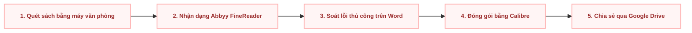

  
01

  

    
Phần 01

    <h1 class="text-4xl font-black text-slate-900 leading-tight mb-4">Project Proposal</h1>
    

    
Trình bày lý do đầu tư, so sánh với đối thủ cạnh tranh và phương án ghép công cụ sẵn có, phân tích các bên liên quan và chi phí – lợi ích.

    

      Ý tưởng đầu tư
      Lợi thế cạnh tranh
      Chi phí – Lợi ích
      Bên liên quan
    

  

---

# Vấn Đề: Nỗi Đau Thực Tế (Persona-driven)

  

    <strong class="text-red-900 text-sm">Sinh viên Nguyễn Văn Linh (CS Linh Trung)</strong>
  

  
"Em phải đi quãng đường xa giữa hai cơ sở chỉ để mượn 1 cuốn giáo trình độc bản. File PDF scan trên mạng thì bị đen, co giãn không được, đọc trên điện thoại mỏi mắt không học nổi!"

  
→ Giảm hiệu suất học tập khi tra cứu xa.

  

    <strong class="text-orange-900 text-sm">Thủ thư Mai (CS Quận 5)</strong>
  

  
"Kho sách đã quá tải diện tích. Phần lớn thời gian thủ thư dành để đi tìm sách và ghi sổ thủ công. Nhìn giáo trình quý rách hỏng từng ngày mà không có bản lưu trữ số an toàn."

  
→ Nguy cơ rách hỏng và mất mát tài liệu vĩnh viễn.

---

# Tại Sao Nên Thực Hiện Dự Án Này?

  <h4 class="font-bold text-emerald-900 text-sm mb-2 border-b border-slate-200 pb-2">1. Xuống Cấp Vật Lý Tri Thức</h4>
  
Giáo trình nội bộ độc bản bị giòn mục, rách trang do thời tiết nóng ẩm và tần suất mượn đọc cao.

  <h4 class="font-bold text-emerald-900 text-sm mb-2 border-b border-slate-200 pb-2">2. Quá Tải Hạ Tầng Lưu Trữ</h4>
  
Diện tích kho bãi đã quá tải công suất thiết kế, hạn chế không gian mở rộng không gian tự học Smart Learning Space cho sinh viên.

  <h4 class="font-bold text-emerald-900 text-sm mb-2 border-b border-slate-200 pb-2">3. Trải Nghiệm Đọc Kém</h4>
  
Ảnh quét PDF tĩnh không hỗ trợ thay đổi cỡ chữ/dòng (non-responsive) trên thiết bị di động, gây khó khăn cho việc tự học của sinh viên.

  <strong class="text-emerald-900 text-sm block mb-1">Tuyên Bố Giá Trị Cốt Lõi:</strong>
  <em>"Bảo tồn tri thức học thuật giấy tĩnh sang học liệu số tương thích động thông qua quy trình số hóa khép kín tự động, kết hợp kiểm soát bản quyền đường dẫn bảo mật 15 phút an toàn tuyệt đối."</em>

---

# Giải Pháp Đề Xuất: Scan-to-EPUB Khép Kín

```mermaid
graph LR
    A[1. Quét tài liệu] --> B[2. Nhận dạng OCR]
    B --> C[3. Soạn thảo soát lỗi]
    C --> D[4. Đóng gói EPUB]
    D --> E[5. Lập chỉ mục FTS]
    E --> F[6. Đọc bảo mật DRM]

    classDef default fill:#f8fafc,stroke:#cbd5e1,stroke-width:1px,color:#1e293b,font-size:11px,font-weight:bold;
    classDef start fill:#f0fdf4,stroke:#bbf7d0,stroke-width:1.5px,color:#166534,font-weight:bold;
    classDef main fill:#ecfdf5,stroke:#a7f3d0,stroke-width:1.5px,color:#065f46,font-weight:bold;
    classDef endNode fill:#fffbeb,stroke:#fef3c7,stroke-width:1.5px,color:#92400e,font-weight:bold;

    class A start;
    class B,C,D,E main;
    class F endNode;
```

  <strong class="text-emerald-900 text-sm block mb-2 font-bold">Trải Nghiệm Đọc Linh Hoạt (Tương Thích Động)</strong>
  <ul class="space-y-1.5 list-disc pl-4 text-slate-700">
    <li>Tự động co giãn dòng chữ (80% – 200%) vừa vặn mọi màn hình di động/máy tính bảng.</li>
    <li>Tùy chọn kiểu chữ và 3 chế độ nền Sáng/Vàng nhạt/Tối.</li>
    <li>Tìm kiếm toàn văn tức thì đến từng câu, từng đoạn sách.</li>
  </ul>

  <strong class="text-emerald-900 text-sm block mb-2 font-bold">Bảo Vệ Bản Quyền Nghiêm Ngặt</strong>
  <ul class="space-y-1.5 list-disc pl-4 text-slate-700">
    <li>Không có nút lưu/tải xuống file sách gốc về máy cá nhân.</li>
    <li>Cấp quyền truy cập tạm thời qua đường dẫn bảo mật tự hủy sau 15 phút.</li>
    <li>Chặn thao tác chuột phải, bôi đen sao chép văn bản số lượng lớn.</li>
  </ul>

  • <strong>FTS (Full-Text Search):</strong> Lập chỉ mục tìm kiếm toàn văn, cho phép người dùng tra cứu từ khóa chính xác đến từng từ trong toàn bộ nội dung sách. 
  • <strong>EPUB (Electronic Publication):</strong> Định dạng sách điện tử chuẩn mã nguồn mở, hỗ trợ tự co giãn văn bản (reflowable) để tối ưu hiển thị trên mọi kích thước màn hình thiết bị di động.

---

# So Sánh Với Đối Thủ Cạnh Tranh

<table class="w-full text-left border-collapse mt-2 border border-slate-200 rounded-lg overflow-hidden">
  <thead>
    <tr class="border-b border-slate-200 bg-slate-50">
      <th class="py-1 px-2 text-[10px] font-bold text-slate-800 border-r border-slate-200 w-1/4">Tiêu Chí So Sánh</th>
      <th class="py-1 px-2 text-[10px] font-bold text-slate-800 border-r border-slate-200 w-2/5">Giải Pháp Khác   (Lạc Việt, DSpace)</th>
      <th class="py-1 px-2 text-[10px] font-bold text-slate-800 w-1/3">HCMUS-LDMS (Đề Xuất)</th>
    </tr>
  </thead>
  <tbody class="text-[10px] text-slate-700 bg-white">
    <tr class="border-b border-slate-200">
      <td class="py-1.5 px-2 font-semibold text-slate-900 border-r border-slate-200 text-[10px]">Chi Phí Khởi Tạo (Ban đầu)</td>
      <td class="py-1.5 px-2 border-r border-slate-200 text-[10px]">Mức giá thương mại rất cao</td>
      <td class="py-1.5 px-2 font-bold text-emerald-800 bg-emerald-50/30 text-[10px]">Tối ưu (Sử dụng công nghệ mã nguồn mở và thuê máy chủ đám mây Cloud VPS chi phí thấp)</td>
    </tr>
    <tr class="border-b border-slate-200">
      <td class="py-1.5 px-2 font-semibold text-slate-900 border-r border-slate-200 text-[10px]">Biên Tập nhận dạng chữ</td>
      <td class="py-1.5 px-2 border-r border-slate-200 text-[10px]">Rất khó / Không hỗ trợ soát lỗi</td>
      <td class="py-1.5 px-2 font-bold text-emerald-800 bg-emerald-50/30 text-[10px]">Hỗ trợ giao diện chia đôi màn hình chuyên dụng</td>
    </tr>
    <tr class="border-b border-slate-200">
      <td class="py-1.5 px-2 font-semibold text-slate-900 border-r border-slate-200 text-[10px]">Bảo Mật Đường Dẫn DRM</td>
      <td class="py-1.5 px-2 border-r border-slate-200 text-[10px]">Không hỗ trợ (chỉ chặn IP cơ bản)</td>
      <td class="py-1.5 px-2 font-bold text-emerald-800 bg-emerald-50/30 text-[10px]">Tích hợp đường dẫn bảo mật tự hủy sau 15 phút</td>
    </tr>
    <tr>
      <td class="py-1.5 px-2 font-semibold text-slate-900 border-r border-slate-200 text-[10px]">Mã Nguồn & Hạ Tầng</td>
      <td class="py-1.5 px-2 border-r border-slate-200 text-[10px]">Phụ thuộc nhà cung cấp</td>
      <td class="py-1.5 px-2 font-bold text-emerald-800 bg-emerald-50/30 text-[10px]">Làm chủ 100% mã nguồn & hạ tầng máy chủ ảo độc lập</td>
    </tr>
  </tbody>
</table>

  <strong>* Chú thích các từ viết tắt:</strong> 
  • <strong>HCMUS-LDMS:</strong> Hệ thống Quản lý và Số hóa Tài liệu Thư viện Trường ĐH KHTN. 
  • <strong>DRM (Digital Rights Management):</strong> Quản lý bản quyền số, ngăn chặn hành vi sao chép và tải tệp tin trái phép. 
  • <strong>DSpace:</strong> Nền tảng nguồn mở chuyên dùng cho việc lưu trữ và phân phối tài liệu số học thuật. 
  • <strong>Lạc Việt Vebrary:</strong> Phần mềm quản lý thư viện tích hợp thương mại phổ biến tại Việt Nam.

---

# Quy Trình Thủ Công: Ghép Công Cụ Rời Rạc

  <strong class="text-red-950 font-bold block mb-1">Quy Trình Rời Rạc</strong>
  Thủ thư phải tự di chuyển dữ liệu thủ công qua lại giữa 4-5 công cụ ngoại tuyến khác nhau.

  <strong class="text-red-950 font-bold block mb-1">Tốn Nhiều Công Sức</strong>
  Mất từ 2-3 giờ lao động thủ công cho mỗi đầu sách để định dạng lại và soát lỗi.

  <strong class="text-red-950 font-bold block mb-1">Không Có Bảo Mật</strong>
  Tệp tin chia sẻ qua Drive dễ dàng bị tải xuống trực tiếp và phát tán bất hợp pháp.

---

# So Sánh Với Phương Án Ghép Công Cụ Rời Rạc (Thủ Công)

  <h3 class="text-red-900 font-bold text-sm mb-2 border-b border-red-200 pb-2">Phương Án Ghép Công Cụ Rời Rạc  (Quét VP → Abbyy FineReader → Calibre → Google Drive)</h3>
  <ul class="space-y-2 text-slate-700">
    <li><strong>Rời rạc & Tốn công:</strong> Tốn nhiều giờ lao động thủ công chuyển qua lại giữa nhiều phần mềm ngoại tuyến độc lập.</li>
    <li><strong>Rủi ro pháp lý cao:</strong> Lưu trữ đám mây thông thường không chặn tải file gốc, nguy cơ phát tán sách tràn lan.</li>
    <li><strong>Tra cứu kém:</strong> Không hỗ trợ tìm kiếm toàn văn đến từng trang sách.</li>
  </ul>

  <h3 class="text-emerald-900 font-bold text-sm mb-2 border-b border-emerald-200 pb-2">Hệ Thống HCMUS-LDMS Khép Kín</h3>
  <ul class="space-y-2 text-slate-700">
    <li><strong>Tự động hóa cao:</strong> Quy trình từ Quét → Soát lỗi → Biên tập → Xuất bản diễn ra trên 1 giao diện web thống nhất.</li>
    <li><strong>Bảo mật đường dẫn 15 phút:</strong> Khóa tải xuống, phân quyền định danh trường nội bộ.</li>
    <li><strong>Tìm kiếm toàn văn siêu tốc:</strong> Lập chỉ mục nội dung tìm kiếm tức thì.</li>
  </ul>

---

# Lợi Thế Cạnh Tranh Bền Vững (MOAT)

  <strong class="text-emerald-900 text-sm block mb-1">1. Nội dung độc quyền (Độc Quyền)</strong>
  
Sở hữu độc quyền kho giáo trình và học liệu nội bộ HCMUS mà các nền tảng thương mại bên ngoài không bao giờ có được.

  <strong class="text-emerald-900 text-sm block mb-1">2. Chi phí chuyển đổi cao</strong>
  
Toàn bộ thói quen tra cứu, ghi chú và lịch sử đọc của sinh viên/giảng viên được gắn liền với tài khoản định danh trường.

  <strong class="text-emerald-900 text-sm block mb-1">3. Lợi thế chi phí tối ưu</strong>
  
Tận dụng công nghệ mã nguồn mở (FastAPI, PostgreSQL, MinIO, Docker) loại bỏ hoàn toàn phí bản quyền hàng năm.

  <strong class="text-emerald-900 text-sm block mb-1">Kết Luận Phòng Thủ Chiến Lược:</strong>
  Đối thủ thương mại có công nghệ nhưng <strong>không có Nội dung độc quyền</strong> của HCMUS. Phương án ghép công cụ rời rạc <strong>không có lợi thế bền vững nào</strong> để bảo vệ tri thức trường.

  * <strong>MOAT (Hào nước bảo vệ thành):</strong> Thuật ngữ ẩn dụ trong kinh doanh, chỉ lợi thế cạnh tranh độc quyền bền vững giúp bảo vệ dự án khỏi sự thay thế hoặc sao chép của đối thủ khác.

---

# Phân Tích Các Bên Liên Quan (Các Bên Liên Quan & RACI)

  <strong class="text-emerald-900 text-sm block border-b border-slate-200 pb-1">Cơ Cấu Các Bên Liên Quan Dự Án</strong>
  <ul class="space-y-1.5 text-slate-700">
    <li><strong>Nhà tài trợ dự án:</strong> Ban Giám hiệu HCMUS (Phê duyệt chủ trương & ngân sách)</li>
    <li><strong>Bên thụ hưởng nghiệp vụ:</strong> Ban Giám đốc Thư viện (Kiểm soát soát lỗi & Biên tập)</li>
    <li><strong>Bên thụ hưởng kỹ thuật:</strong> Phòng Công nghệ Thông tin (Hạ tầng mạng, định danh, tra cứu)</li>
    <li><strong>Cố vấn Pháp lý:</strong> Bộ phận Pháp chế (Thẩm định quy chế sở hữu trí tuệ)</li>
  </ul>

  <strong class="text-emerald-900 text-sm block border-b border-slate-200 pb-1">Phân Phối Ma Trận Trách Nhiệm Rút Gọn</strong>
  <ul class="space-y-1.5 text-slate-700">
    <li><strong>WP1 Khảo sát & Pháp lý:</strong> Thư viện (Trách nhiệm chính), Pháp chế (Tham vấn ý kiến)</li>
    <li><strong>WP2 Hạ tầng & Lưu trữ:</strong> Phòng CNTT (Trách nhiệm chính), Thư viện (Nhận thông tin)</li>
    <li><strong>WP3 Phát triển cốt lõi:</strong> Phòng CNTT (Trách nhiệm chính), Đội ngũ lập trình (Thực hiện trực tiếp)</li>
    <li><strong>WP4 Số hóa tài liệu:</strong> Thư viện (Trách nhiệm chính), Cộng tác viên (Thực hiện trực tiếp)</li>
  </ul>

  <strong class="text-emerald-900 text-sm block mb-1">Khả Thi Thực Tế Từ Góc Độ Các Bên Liên Quan:</strong>
  <ul class="grid grid-cols-3 gap-2 list-none p-0 m-0 text-slate-700 text-[11px]">
    <li><strong>Pháp lý:</strong> Có bộ phận Pháp chế thẩm định bản quyền và điều khoản sử dụng sớm (Gói 1).</li>
    <li><strong>Kỹ thuật:</strong> Phòng CNTT chịu trách nhiệm chính (A) phát triển và triển khai máy chủ Cloud VPS.</li>
    <li><strong>Vận hành:</strong> Thư viện chủ trì nghiệp vụ kết hợp nhân lực CTV sinh viên giải quyết nút thắt số hóa.</li>
  </ul>

  • <strong>WP (Work Package):</strong> Gói công việc nhỏ nhất trong cấu trúc phân rã công việc dự án. 
  • <strong>RACI:</strong> Ma trận phân định trách nhiệm (Thực hiện trực tiếp - R, Trách nhiệm chính - A, Tham vấn ý kiến - C, Nhận thông tin - I).

