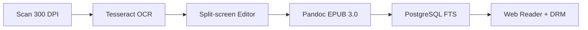
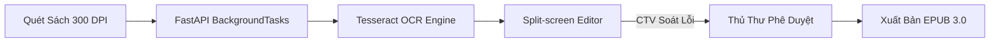

# PHẦN 1: PROJECT PROPOSAL
## Đề Xuất Dự Án HCMUS-LDMS

  
Đề Xuất Dự Án HCMUS-LDMS

  
Đánh giá bối cảnh, 3 nỗi đau thực tế, giải pháp Scan-to-EPUB 3.0 & Phân tích MOAT kinh doanh.

  HCMUS-LDMS
  Phần 1: Proposal

---

# Vấn Đề: Nỗi Đau Thực Tế (Persona-driven)

  

    <strong class="text-red-900 text-sm">Sinh viên Nguyễn Văn Linh (CS Linh Trung)</strong>
  

  
"Em phải đi 15km mất gần 3 tiếng từ Linh Trung về Quận 5 chỉ để mượn 1 cuốn giáo trình độc bản. File PDF scan trên mạng thì bị đen, co giãn không được, đọc trên điện thoại mỏi mắt không học nổi!"

  
→ Giảm 80% hiệu suất học tập khi tra cứu xa.

  

    <strong class="text-orange-900 text-sm">Thủ thư Mai (CS Quận 5)</strong>
  

  
"Kho sách 100% diện tích đã quá tải. 85% thời gian thủ thư dành để đi tìm sách và ghi sổ thủ công. Nhìn giáo trình quý rách hỏng từng ngày mà không có bản lưu trữ số an toàn."

  
→ Nguy cơ rách hỏng và mất mát tài liệu vĩnh viễn.

  

    
40%

    
Giáo trình cũ xuống cấp

  

  

    
100%

    
Kho bãi quá tải diện tích

  

  

    
92%

    
SV muốn đọc số mobile

  

---

# Tại Sao Nên Thực Hiện Dự Án Này?

  <h4 class="font-bold text-emerald-900 text-sm mb-2 border-b border-slate-200 pb-2">1. Xuống Cấp Vật Lý Tri Thức</h4>
  
Hàng ngàn cuốn giáo trình nội bộ độc bản xuất bản trước 2010 bị giòn mục, rách trang do thời tiết nóng ẩm và tần suất mượn đọc cao.

  <h4 class="font-bold text-emerald-900 text-sm mb-2 border-b border-slate-200 pb-2">2. Quá Tải Hạ Tầng Lưu Trữ</h4>
  
Diện tích kho bãi chiếm 100% không gian thư viện Q.5, không còn diện tích mở rộng không gian tự học Smart Learning Space cho sinh viên.

  <h4 class="font-bold text-emerald-900 text-sm mb-2 border-b border-slate-200 pb-2">3. Chiến Lược Đại Học Số</h4>
  
Phù hợp Chiến lược Phát triển Đại học số ĐHQG-HCM giai đoạn 2026–2030 (đạt mốc số hóa >90% toàn bộ học liệu trọng yếu).

  <strong class="text-emerald-900 text-sm block mb-1">Tuyên Bố Giá Trị Cốt Lõi (Value Proposition):</strong>
  <em>"Bảo tồn tri thức học thuật giấy tĩnh sang học liệu số reflowable thông qua quy trình số hóa khép kín tự động, kết hợp kiểm soát bản quyền DRM Signed URL 15 phút an toàn tuyệt đối."</em>

---

# Giải Pháp Đề Xuất: Scan-to-EPUB Khép Kín

  <strong class="text-emerald-900 text-sm block mb-2">Trải Nghiệm Đọc Linh Hoạt (Reflowable)</strong>
  <ul class="space-y-1.5 list-disc pl-4 text-slate-700">
    <li>Tự động co giãn dòng chữ (80% – 200%) vừa vặn mọi màn hình di động/tablet.</li>
    <li>Tùy chọn font chữ (Roboto/Inter/OpenDyslexic) và 3 chế độ nền Light/Sepia/Dark.</li>
    <li>Tìm kiếm toàn văn FTS tức thì đến từng câu, từng đoạn sách.</li>
  </ul>

  <strong class="text-emerald-900 text-sm block mb-2">Bảo Vệ Bản Quyền Nghiêm Ngặt (DRM)</strong>
  <ul class="space-y-1.5 list-disc pl-4 text-slate-700">
    <li>Không có nút lưu/tải xuống file EPUB gốc về máy cá nhân.</li>
    <li>Cấp quyền truy cập tạm thời qua MinIO Signed URL (tự hủy sau 15 phút).</li>
    <li>Chặn thao tác chuột phải, bôi đen copy đoạn văn bản số lượng lớn.</li>
  </ul>

---

# So Sánh Với Đối Thủ Cạnh Tranh (Giải Pháp Thương Mại)

| Tiêu Chí So Sánh | Giải Pháp Thương Mại (Lạc Việt, DSpace) | HCMUS-LDMS (Đề Xuất) |
| :--- | :--- | :--- |
| **Chi Phí Khởi Tạo (CapEx)** | 300 triệu – hơn 1 tỷ VNĐ | **75.000.000 – 95.000.000 VNĐ** (Tiết kiệm > 200 triệu) |
| **Biên Tập OCR Split-screen** | Rất khó / Không hỗ trợ soát lỗi | **Hỗ trợ giao diện Split-screen chuyên dụng** |
| **Bảo Mật DRM Signed URL** | Không hỗ trợ (chỉ chặn IP cơ bản) | **Tích hợp MinIO Temporary Signed URL 15m** |
| **Mã Nguồn & Hạ Tầng** | Phụ thuộc vendor (Vendor lock-in) | **Làm chủ 100% mã nguồn & hạ tầng On-premise** |

  <strong>Lợi thế cạnh tranh:</strong> Làm chủ công nghệ và tối ưu ngân sách cho nhà trường mà không bị phụ thuộc bản quyền phần mềm ngoài.
  Tiết kiệm > 200M

---

# So Sánh Với Phương Án Ghép Công Cụ Rời Rạc (Thủ Công)

  <h3 class="text-red-900 font-bold text-sm mb-2 border-b border-red-200 pb-2">Phương Án Ghép Công Cụ Rời Rạc (Abbyy + Drive)</h3>
  <ul class="space-y-2 text-slate-700">
    <li><strong>Rời rạc & Tốn công:</strong> Mất 2-3 giờ lao động thủ công chuyển qua lại giữa 4 phần mềm offline.</li>
    <li><strong>Rủi ro pháp lý cao:</strong> Google Drive không chặn tải file gốc, nguy cơ phát tán sách tràn lan.</li>
    <li><strong>Tra cứu kém:</strong> Không hỗ trợ tìm kiếm toàn văn FTS đến từng trang sách.</li>
  </ul>

  <h3 class="text-emerald-900 font-bold text-sm mb-2 border-b border-emerald-200 pb-2">Hệ Thống HCMUS-LDMS Khép Kín</h3>
  <ul class="space-y-2 text-slate-700">
    <li><strong>Tự động hóa 100%:</strong> Luồng Scan $\rightarrow$ OCR $\rightarrow$ Editor $\rightarrow$ EPUB diễn ra trên 1 giao diện web.</li>
    <li><strong>Bảo mật Signed URL 15m:</strong> Khóa tải xuống, phân quyền SSO Google OAuth trường.</li>
    <li><strong>Tìm kiếm FTS dưới 3s:</strong> Lập chỉ mục toàn văn PostgreSQL FTS tức thì.</li>
  </ul>

---

# Lợi Thế Cạnh Tranh Bền Vững (MOAT Analysis)

  <strong class="text-emerald-900 text-sm block mb-1">1. Exclusive Content (Độc Quyền 5/5)</strong>
  
Sở hữu độc quyền kho giáo trình và đề thi nội bộ HCMUS mà các nền tảng thương mại bên ngoài không bao giờ có được.

  <strong class="text-emerald-900 text-sm block mb-1">2. Switching Cost Cao (Mức Độ 5/5)</strong>
  
Toàn bộ thói quen tra cứu, ghi chú và lịch sử đọc của sinh viên/giảng viên được gắn liền với tài khoản SSO trường.

  <strong class="text-emerald-900 text-sm block mb-1">3. Lợi Thế Chi Phí (Mức Độ 4/5)</strong>
  
Tận dụng 100% công nghệ mã nguồn mở (FastAPI, PostgreSQL, MinIO, Docker) loại bỏ hoàn toàn phí bản quyền hàng năm.

  <strong class="text-emerald-900 text-sm block mb-1">Kết Luận Phòng Thủ Strategical MOAT:</strong>
  Đối thủ thương mại có công nghệ nhưng <strong>không có Exclusive Content</strong> của HCMUS. Phương án ghép công cụ rời rạc <strong>không có bất kỳ MOAT nào</strong> để bảo vệ tri thức trường.

---

# Phân Tích Các Bên Liên Quan (Stakeholders & RACI)

  <strong class="text-emerald-900 text-sm block border-b border-slate-200 pb-1">Cơ Cấu Stakeholders Dự Án</strong>
  <ul class="space-y-1.5 text-slate-700">
    <li><strong>Sponsor:</strong> Ban Giám hiệu HCMUS (Phê duyệt chủ trương & ngân sách)</li>
    <li><strong>Client Nghiệp vụ:</strong> Ban Giám đốc Thư viện (Kiểm soát OCR & Biên tập)</li>
    <li><strong>Client Kỹ thuật:</strong> Phòng CNTT (Hạ tầng vSphere, OAuth, FTS)</li>
    <li><strong>Cố vấn Pháp lý:</strong> Bộ phận Pháp chế (Thẩm định quy chế SHTT)</li>
  </ul>

  <strong class="text-emerald-900 text-sm block border-b border-slate-200 pb-1">Phân Phối Bảng RACI Rút Gọn</strong>
  <ul class="space-y-1.5 text-slate-700">
    <li><strong>WP1 Khảo sát & Pháp lý:</strong> Thư viện (Accountable), Pháp chế (Consulted)</li>
    <li><strong>WP2 Hạ tầng & Storage:</strong> Phòng CNTT (Accountable), Thư viện (Informed)</li>
    <li><strong>WP3 Core Development:</strong> Phòng CNTT (Accountable), Dev Team (Responsible)</li>
    <li><strong>WP4 Số hóa 2.500 sách:</strong> Thư viện (Accountable), CTV (Responsible)</li>
  </ul>

---

# Phân Tích Chi Phí – Lợi Ích & Điểm Hòa Vốn

  Ngân Sách CapEx
  75 – 95 Tr VNĐ
  Mua 2 máy scan V-shaped + Server

  Chi Phí Vận Hành OpEx
  15 – 30 Tr/năm
  Điện đạm, bảo trì & thù lao CTV

  Tiết Kiệm (Cost Avoidance)
  35 Tr/năm
  Tiết kiệm kho bãi + Giờ công thủ thư

  

    <strong class="text-emerald-900 text-sm block">Thời Gian Hoàn Vốn (Payback Period): 2.5 – 3.8 Năm</strong>
    
Lợi ích định tính: bảo tồn 100% học liệu gốc, nâng cao chỉ số Đại học số ĐHQG-HCM, làm chủ 100% công nghệ.

  

  Hiệu Quả Cao

---

# Lộ Trình Triển Khai Cấp Cao (Roadmap 20 Tuần)

  

    <strong class="text-emerald-900 text-sm">Giai Đoạn 0 (Tuần 1–2): Khảo Sát & Bản Quyền</strong>
    
Khảo sát 2.500 đầu sách, ban hành Quy chế bảo mật bản quyền số nội bộ.

  

  Gate 0

  

    <strong class="text-emerald-900 text-sm">Giai Đoạn 1 (Tuần 3–12): Phát Triển MVP & Thí Điểm Khoa CNTT</strong>
    
Hoàn thiện Core System, số hóa thí điểm 500 giáo trình CNTT trọng yếu.

  

  Gate 1 (MVP)

  

    <strong class="text-emerald-900 text-sm">Giai Đoạn 2 (Tuần 13–18): Số Hóa Diện Rộng</strong>
    
Huy động CTV mở rộng số hóa 2.000 đầu sách thuộc các Khoa Tự nhiên còn lại.

  

  Gate 2

  

    <strong class="text-emerald-900 text-sm">Giai Đoạn 3 (Tuần 19–20): UAT & Go-Live Toàn Trường</strong>
    
Kiểm thử UAT, Pentest bảo mật DRM, bàn giao chính thức cho Thư viện vận hành.

  

  Gate 3 (Go-Live)

---

# Quy Trình AI-Assisted (Human-in-the-loop)

  <strong class="text-blue-900 text-sm block mb-1">AI / Automation Xử Lý (Tesseract + Async)</strong>
  
Đảm nhận 80% khối lượng công việc lặp lại: nhận dạng ký tự tiếng Việt, bóc tách bảng biểu, tự động canh lề và tạo cấu trúc HTML thô.

  <strong class="text-orange-900 text-sm block mb-1">Con Người Kiểm Duyệt (Human Verification)</strong>
  
Biên tập viên/CTV soát lỗi trực quan qua màn hình Split-screen. Thủ thư giữ quyền quyết định duyệt xuất bản cuối cùng (100% chuẩn học thuật).

---

# Danh Mục Rủi Ro Kinh Doanh & Biện Pháp Giảm Thiểu

| Loại Rủi Ro | Mức Độ | Biện Pháp Giảm Thiểu (Mitigation Strategy) |
| :--- | :--- | :--- |
| **Bản Quyền & Pháp Lý** | **Cao** | Chỉ số hóa giáo trình nội bộ HCMUS, phân quyền SSO Google OAuth, khóa tải xuống. |
| **Chất Lượng OCR Tiếng Việt** | **Trung Bình** | Tiền xử lý ảnh (Deskew/Bin) + Giao diện Split-screen cho CTV sửa lỗi nhanh. |
| **Rò Rỉ File Gốc** | **Trung Bình** | Dùng MinIO Temporary Signed URL tự hủy sau 15 phút, chặn chuột phải & Copy. |
| **Nguồn Nhân Lực Quá Tải** | **Trung Bình** | Đội ngũ cam kết 50% thời gian chính thức, tuyển CTV sinh viên theo giờ công. |

---

# Kết Luận & Khuyến Nghị Hành Động (Next Steps)

  BƯỚC 1
  

    <strong class="text-emerald-900 text-base">Phê Duyệt Chủ Trương & Ngân Sách Khởi Động</strong>
    
Thông qua đề xuất dự án & cấp kinh phí CapEx đợt 1 (75.000.000 VNĐ) để triển khai Giai đoạn 0.

  

  BƯỚC 2
  

    <strong class="text-emerald-900 text-base">Ban Hành Quy Châu Bản Quyền Số Nội Bộ</strong>
    
Phòng Pháp chế phối hợp Thư viện ban hành quy chế sử dụng tài liệu số hóa trước Tuần 3.

  

  BƯỚC 3
  

    <strong class="text-emerald-900 text-base">Triển Khai Thí Điểm MVP Khoa CNTT</strong>
    
Hoàn thành số hóa 500 giáo trình CNTT đúng tiến độ Tuần 12 trước khai giảng năm học mới.

  

