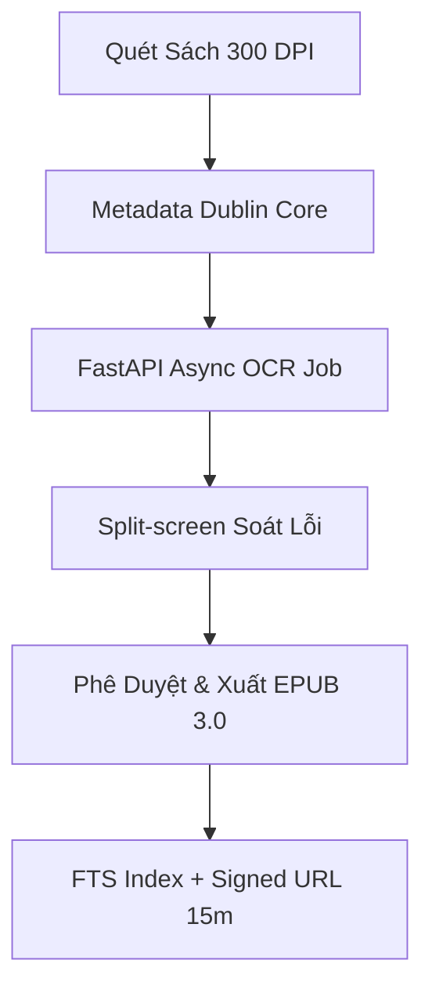

# PHẦN 2: VISION, CHARTER & BACKLOG
## Tầm Nhìn · Điều Lệ Dự Án · Product Backlog

  
Tầm Nhìn · Điều Lệ Dự Án · Product Backlog

  
Định vị sản phẩm, ma trận trách nhiệm RACI, quản trị phạm vi MVP và 26 User Stories chuẩn hóa.

  Vision & Scope
  Project Charter
  Product Backlog

---

# Phát Biểu Định Vị Sản Phẩm (Product Position Statement)

  
<strong class="text-emerald-900 text-sm">DÀNH CHO:</strong> Sinh viên, giảng viên và cán bộ thủ thư Trường ĐH Khoa học Tự nhiên (ĐHQG-HCM).

  
<strong class="text-emerald-900 text-sm">NHỮNG NGHƯỜI ĐANG GẶP VẤN ĐỀ:</strong> Khó khăn trong việc tra cứu giáo trình độc bản, rủi ro hư hại tài liệu giấy cũ và trải nghiệm đọc số kém trên thiết bị di động.

  
<strong class="text-emerald-900 text-sm">SẢN PHẨM HCMUS-LDMS LÀ:</strong> Hệ thống web nội bộ quản lý và số hóa tài liệu học thuật tập trung.

  
<strong class="text-emerald-900 text-sm">GIÚP CUNG CẤP:</strong> Quy trình số hóa khép kín tự động (Scan $\rightarrow$ OCR $\rightarrow$ EPUB 3.0), tìm kiếm toàn văn FTS dưới 3 giây và đọc trực tuyến bảo mật DRM qua Signed URL 15 phút.

  
<strong class="text-emerald-900 text-sm">KHÁC BIỆT SO VỚI:</strong> Các file PDF scan tĩnh công cộng hay hệ thống OPAC truyền thống không hỗ trợ reflowable và phân quyền SSO.

---

# Quy Trình As-Is: Vận Hành Thủ Công Hiện Tại

  <h3 class="text-red-900 font-bold text-sm mb-3 border-b border-red-200 pb-2">Các Bước Vận Hành Hiện Tại (As-Is)</h3>
  <ol class="list-decimal pl-4 space-y-2 text-slate-700">
    <li>Sinh viên di chuyển 15km từ Linh Trung về Q.5 hoặc tra cứu tiêu đề sách thủ công.</li>
    <li>Thủ thư đi tìm từng cuốn sách giấy vật lý trong kho bãi quá tải.</li>
    <li>Sinh viên đọc sách tại chỗ, ghi chép tay công thức/sơ đồ do cấm photocopy.</li>
    <li>Sách giấy liên tục lật giở bị rách hỏng và mục nát theo thời gian.</li>
    <li>Kho bãi chiếm 100% diện tích thư viện, không còn chỗ làm không gian tự học.</li>
  </ol>

  <h3 class="text-slate-900 font-bold text-sm mb-3 border-b border-slate-200 pb-2">4 Nút Thắt Nghiêm Trọng</h3>
  <ul class="space-y-2 text-slate-700">
    <li><strong class="text-red-800">1. Vi phạm bản quyền:</strong> Phát tán tự do file scan PDF không kiểm soát.</li>
    <li><strong class="text-red-800">2. Trải nghiệm mỏi mắt:</strong> PDF ảnh vỡ nét, không co giãn chữ trên mobile.</li>
    <li><strong class="text-red-800">3. Mất khả năng tra cứu:</strong> Không thể tìm kiếm từ khóa bên trong nội dung sách.</li>
    <li><strong class="text-red-800">4. Không có Metadata:</strong> Thiếu chuẩn quản lý dữ liệu Dublin Core thống nhất.</li>
  </ul>

---

# Quy Trình To-Be: Số Hóa Khép Kín Có AI Hỗ Trợ

  <strong class="text-emerald-900 text-sm block mb-1">Làn Nghiệp Vụ Thủ Thư / Admin</strong>
  
Thủ thư quét sách, khai báo chuẩn Metadata Dublin Core và giữ quyền duyệt xuất bản chính thức. Quản trị viên phân quyền SSO Google OAuth.

  <strong class="text-blue-900 text-sm block mb-1">Làn Biên Tập CTV / AI OCR</strong>
  
Tesseract OCR nhận dạng ký tự tự động trong background. Biên tập viên/CTV soát lỗi trực quan qua giao diện Split-screen (+60% hiệu suất).

---

# So Sánh Quy Trình 4 Phương Án (Benchmarking)

| Tiêu Chí Đối Chuẩn | As-Is Thủ Công | Abbyy + Drive | Lạc Việt / DSpace | HCMUS-LDMS |
| :--- | :--- | :--- | :--- | :--- |
| **Tốc Độ Số Hóa** | Rất chậm (3h/sách) | Chậm (2h/sách) | Trung bình | **Nhanh (30m/sách nhờ Split-screen)** |
| **Bảo Mật DRM** | Không có | Rủi ro cao (Drive) | Cơ bản | **Signed URL 15m + Chặn Copy** |
| **Tìm Kiếm FTS** | Không hỗ trợ | Không hỗ trợ | Tìm kiếm tiêu đề | **FTS Toàn văn < 3s (PostgreSQL)** |
| **Nỗ Lực Vận Hành** | Rất cao | Cao | Trung bình | **Rất thấp (Tự động hóa 100%)** |

---

# Chân Dung Stakeholders & Người Dùng System

  <strong class="text-emerald-900 text-sm block border-b border-slate-200 pb-1">Nhóm Quản Trị & Ban Dự Án (Stakeholders)</strong>
  <ul class="space-y-1.5 text-slate-700">
    <li><strong>Sponsor:</strong> Ban Giám hiệu HCMUS — Quan tâm tiến độ & hiệu quả ngân sách.</li>
    <li><strong>Client Nghiệp vụ:</strong> Ban Giám đốc Thư viện — Quan tâm chất lượng OCR & bảo tồn.</li>
    <li><strong>Client Kỹ thuật:</strong> Phòng CNTT — Quan tâm hạ tầng vSphere & an toàn thông tin.</li>
  </ul>

  <strong class="text-emerald-900 text-sm block border-b border-slate-200 pb-1">Nhóm Trực Tiếp Thao Tác (End Users)</strong>
  <ul class="space-y-1.5 text-slate-700">
    <li><strong>Độc giả (SV/GV):</strong> Truy cập mobile/tablet đọc EPUB 24/7 từ xa.</li>
    <li><strong>Thủ thư / Editor:</strong> Thao tác PC văn phòng quét sách, OCR & soát lỗi.</li>
    <li><strong>Quản trị viên (Admin):</strong> Quản lý danh mục, phân quyền & giám sát hệ thống.</li>
  </ul>

---

# Phân Tích Trách Nhiệm RACI & Power/Interest Grid

  <strong class="text-emerald-900 text-sm block border-b border-slate-200 pb-1">Ma Trận Trách Nhiệm RACI</strong>
  
<strong>WP1 Khảo sát & Pháp lý:</strong> Thư viện (A), Pháp chế (C)

  
<strong>WP2 Hạ tầng Storage:</strong> Phòng CNTT (A), Thư viện (I)

  
<strong>WP3 Core Development:</strong> Phòng CNTT (A), Dev Team (R)

  
<strong>WP4 Số hóa 2.500 sách:</strong> Thư viện (A), CTV (R)

  <strong class="text-emerald-900 text-sm block border-b border-slate-200 pb-1">Power / Interest Grid</strong>
  
<strong class="text-emerald-800">Power Cao / Interest Cao (Quản lý sát sao):</strong> BGĐ Thư viện, PM Phòng CNTT.

  
<strong class="text-emerald-800">Power Cao / Interest Vừa (Giữ hài lòng):</strong> Ban Giám hiệu, Bộ phận Pháp chế.

  
<strong class="text-emerald-800">Power Thấp / Interest Cao (Thông báo đầy đủ):</strong> Giảng viên, Sinh viên.

---

# Ma Trận Tác Nhân As-Is vs To-Be (Impact Analysis)

| Tác Nhân | Trạng Thái Hiện Tại (As-Is) | Trạng Thái Tương Lai (To-Be) |
| :--- | :--- | :--- |
| **Độc Giả (Sinh Viên)** | Di chuyển 15km, chép tay thủ công, PDF mỏi mắt. | Đọc responsive 24/7 trên smartphone, FTS < 3s. |
| **Thủ Thư** | Kho quá tải, 85% thời gian ghi sổ thủ công. | Tự động hóa 100% kiểm kê, quản lý file EPUB tập trung. |
| **Biên Tập Viên / CTV** | Sửa lỗi thủ công rời rạc trên nhiều file Word/PDF. | Giao diện Split-screen soát lỗi nhanh (+60% năng suất). |
| **Ban Giám Hiệu** | Lo lắng rò rỉ bản quyền & kho bãi quá tải. | Đạt mốc Đại học số ĐHQG-HCM, bảo mật DRM tuyệt đối. |

---

# Scope Boundary: Tính Năng MVP vs Mở Rộng

  

    <strong class="text-emerald-900 text-sm">Phạm Vi MVP (Must-Have & Should-Have)</strong>
    23 Stories
  

  <ul class="space-y-1 text-slate-700 list-disc pl-4">
    <li>Đăng nhập Google OAuth 2.0 / Mock Auth.</li>
    <li>Upload & pipeline OCR Tesseract bất đồng bộ.</li>
    <li>Giao diện Split-screen Editor biên tập text/ảnh.</li>
    <li>Đóng gói chuẩn EPUB 3.0 reflowable.</li>
    <li>Tìm kiếm toàn văn PostgreSQL FTS < 3s.</li>
    <li>Web Reader bảo mật Signed URL 15m (chặn Copy).</li>
  </ul>

  

    <strong class="text-slate-900 text-sm">Phạm Vi Mở Rộng & Hoãn (Out of Scope MVP)</strong>
    3 Stories
  

  <ul class="space-y-1 text-slate-700 list-disc pl-4">
    <li>Tùy biến theme đọc cá nhân hóa sâu.</li>
    <li>Tích hợp công cụ trích dẫn Citation Generator.</li>
    <li>AI RAG Chatbot hỏi đáp trên nội dung sách (GĐ3).</li>
    <li>Loại trừ: Tích hợp hệ thống chống đạo văn Turnitin.</li>
  </ul>

---

# Yêu Cầu Phi Chức Năng (NFR) Trọng Yếu

  <strong class="text-emerald-900 text-sm block mb-1">Hiệu Năng (Performance)</strong>
  
FTS search < 3s cho 500 CCU đồng thời. Web Reader tải trang < 2s.

  <strong class="text-emerald-900 text-sm block mb-1">Bảo Mật (Security)</strong>
  
Google OAuth 2.0, MinIO Signed URL 15m, 0 sự cố rò rỉ file gốc.

  <strong class="text-emerald-900 text-sm block mb-1">Độ Tin Cậy (Reliability)</strong>
  
PgBackRest backup 01:00 hàng ngày, RPO < 24h, Uptime 99.5%.

  <strong>UI/UX:</strong> Responsive 100% từ mobile 320px đến desktop 4K. Lighthouse Accessibility $\ge 90$.

  <strong>Pháp Lý & Ngân Sách:</strong> Tuân thủ Luật SHTT Việt Nam. Ngân sách phát triển < 100 Tr VNĐ.

---

# Quy Tắc Tổ Chức Backlog: Kanban & DoD

  <strong class="text-emerald-900 text-sm block mb-2">Nguyên Tắc Kanban</strong>
  <ul class="space-y-1.5 text-slate-700">
    <li>WIP = 1 card/người (tránh phân tán).</li>
    <li>Đo throughput thực tế (story Done/tuần).</li>
    <li>Không dùng Story Point để ép tiến độ.</li>
  </ul>

  <strong class="text-emerald-900 text-sm block mb-2">Definition of Done (DoD)</strong>
  <ul class="space-y-1.5 text-slate-700">
    <li>Pass 100% Acceptance Criteria (AC).</li>
    <li>Code merge qua PR & test local ok.</li>
    <li>Cập nhật README & log token AI.</li>
  </ul>

  <strong class="text-emerald-900 text-sm block mb-2">Phân Bổ MoSCoW (26 Stories)</strong>
  <ul class="space-y-1.5 text-slate-700">
    <li><strong>Must-have:</strong> 16 stories (Cốt lõi MVP)</li>
    <li><strong>Should-have:</strong> 7 stories (Trải nghiệm tốt)</li>
    <li><strong>Could-have:</strong> 3 stories (Mở rộng)</li>
  </ul>

---

# Deep-Dive Example: User Story LDMS-003

  LDMS-003: Hàng Đợi OCR Và Trạng Thái Job
  

    Must-Have
    Size M
  

"Là thủ thư, tôi muốn hệ thống chạy OCR nền và theo dõi được trạng thái xử lý để không phải chờ đợi trên giao diện."

  <strong class="text-emerald-900 block">Acceptance Criteria (AC):</strong>
  
<strong>AC1:</strong> Khi kích hoạt OCR, job được khởi tạo ở trạng thái ban đầu <code>pending</code>.

  
<strong>AC2:</strong> Job tự động chuyển <code>processing</code> $\rightarrow$ <code>completed</code> hoặc <code>failed</code>.

  
<strong>AC3:</strong> API trả về kết quả nhanh (< 500ms), không block luồng request chính (Async BackgroundTasks).

  
<strong>AC4:</strong> Nếu job <code>failed</code>, phải lưu vết <code>error_message</code> tường minh để truy vết lỗi.

---

# Bản Đồ Triển Khai Backlog (Implementation Map)

  <strong class="text-emerald-900">Giai Đoạn 1: Nền Tảng & Flow Dữ Liệu</strong> — LDMS-001 (Upload), LDMS-002 (OCR Job), LDMS-003 (Status)
  Tuần 3–5

  <strong class="text-emerald-900">Giai Đoạn 2: Biên Tập & Xuất Bản EPUB</strong> — LDMS-004 (Split-screen), LDMS-005 (Text Editor), LDMS-007 (Build EPUB)
  Tuần 6–8

  <strong class="text-emerald-900">Giai Đoạn 3: Xác Thực & Tra Cứu FTS</strong> — LDMS-010 (OAuth), LDMS-012 (PostgreSQL FTS), LDMS-014 (Signed URL)
  Tuần 9–10

  <strong class="text-emerald-900">Giai Đoạn 4: Web Reader & Phân Quyền</strong> — LDMS-016 (Epub.js Reader), LDMS-018 (Chặn Copy), LDMS-020 (Catalog)
  Tuần 11–12

---

# Governance & KPI Theo Điều Lệ Dự Án (Charter)

  <strong class="text-emerald-900 text-sm block border-b border-slate-200 pb-1">Cơ Cấu Quản Trị Dự Án</strong>
  
Sponsor (BGH) $\rightarrow$ Client Nghiệp vụ (BGĐ Thư viện) $\rightarrow$ PM (Phòng CNTT) $\rightarrow$ Tech Lead $\rightarrow$ Dev Team.

  
<strong>Kiểm soát thay đổi:</strong> Thay đổi > 5% ngân sách/scope cần tờ trình phê duyệt của PM + Giám đốc Thư viện.

  <strong class="text-emerald-900 text-sm block border-b border-emerald-200 pb-1">5 KPI Thành Công Cốt Lõi</strong>
  <ul class="space-y-1 text-slate-800 font-medium">
    <li>1. Số hóa $\ge 90\%$ học liệu trọng yếu năm 2026.</li>
    <li>2. Tốc độ tra cứu FTS $< 3$ giây cho 500 CCU.</li>
    <li>3. Độ chính xác OCR tiếng Việt $\ge 85\%$.</li>
    <li>4. 0 sự cố rò rỉ file EPUB gốc ra ngoài.</li>
    <li>5. Độ hài lòng của sinh viên/thủ thư $\ge 85\%$.</li>
  </ul>

---

# Demo: AI-Assisted Backlog Governance

  <strong class="text-blue-900 text-sm block">1. AI Assistant Rà Soát Nháp</strong>
  
AI tự động quét file backlog, đối chiếu chuẩn DoD, gợi ý bổ sung các AC điều kiện biên (edge cases) và kiểm tra phụ thuộc <code>depends_on</code> giữa các story.

  <strong class="text-emerald-900 text-sm block">2. Con Người (PM / Tech Lead) Duyệt</strong>
  
PM xem xét lại gợi ý của AI, đánh giá tính khả thi theo nguồn lực thực tế của đội ngũ 4 người trước khi chốt card sang trạng thái <code>Ready for Implementation</code>.

