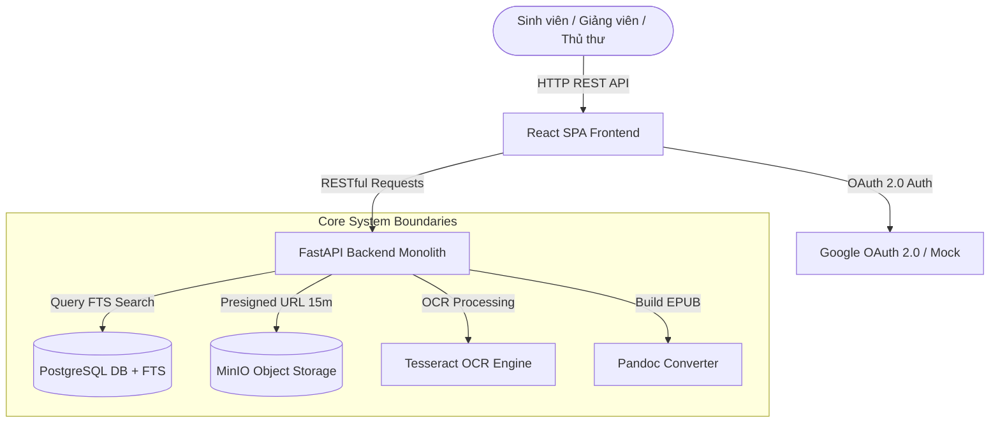
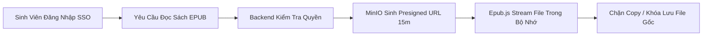

# PHẦN 3: ARCHITECTURE & PROOF OF CONCEPT
## Thiết Kế Kiến Trúc Phần Mềm & PoC

  
Thiết Kế Kiến Trúc Phần Mềm & Proof of Concept (PoC)

  
Kiến trúc Modular Monolith, sơ đồ C4 Container, luồng Async OCR Pipeline và giải pháp bảo mật DRM.

  Modular Monolith
  On-Premise
  DRM Signed URL

---

# Mục Tiêu & Ràng Buộc Kiến Trúc (Architecture Goals)

  <h3 class="text-emerald-900 font-bold text-sm border-b border-emerald-200 pb-1.5">Mục Tiêu Kỹ Thuật (System Goals)</h3>
  <ul class="space-y-1.5 text-slate-700">
    <li><strong>Hiệu năng FTS:</strong> Tra cứu toàn văn dưới 3 giây cho 500 CCU đồng thời.</li>
    <li><strong>Bảo mật DRM:</strong> Cấp quyền truy cập tạm thời Signed URL 15m, 0 nút Download.</li>
    <li><strong>Xử lý bất đồng bộ:</strong> Đưa tác vụ OCR nặng vào BackgroundTasks giải phóng Gateway.</li>
    <li><strong>Trải nghiệm đọc:</strong> Đóng gói chuẩn EPUB 3.0 reflowable co giãn đa thiết bị.</li>
  </ul>

  <h3 class="text-amber-900 font-bold text-sm border-b border-amber-200 pb-1.5">Ràng Buộc Hạ Tầng & Ngân Sách</h3>
  <ul class="space-y-1.5 text-slate-700">
    <li><strong>Hạ tầng On-premise:</strong> Tận dụng cụm ảo hóa VMware vSphere sẵn có của Trường.</li>
    <li><strong>Giới hạn ngân sách:</strong> Chi phí mua máy móc & phát triển dưới 100 Tr VNĐ.</li>
    <li><strong>Nguồn lực đội ngũ:</strong> 4 kỹ sư kiêm nhiệm (~2 full-time equivalent).</li>
  </ul>

---

# Quyết Định Kiến Trúc: Vì Sao Chọn Modular Monolith?

| Tiêu Chí So Sánh | DSpace / Kho Tĩnh | Microservices Architecture | Modular Monolith (Lựa Chọn) |
| :--- | :--- | :--- | :--- |
| **Phù Hợp Quy Mô Đội 4 Người** | Trung bình | Rất kém (Phức tạp CI/CD & DevOps) | **Rất tốt (Codebase tập trung, chia module)** |
| **Khả Năng Xử Lý OCR Async** | Không hỗ trợ | Rất tốt | **Rất tốt (FastAPI BackgroundTasks)** |
| **Chi Phí Vận Hành Hạ Tầng** | Thấp | Rất cao | **Rất thấp (Chạy mượt trên 1-2 VMs)** |
| **Khả Năng Tách Dịch Vụ Sau Này**| Rất khó | Đã tách | **Dễ dàng (Module độc lập theo chuẩn SOLID)** |

  <strong>Kết luận ADR (Architecture Decision Record):</strong> Modular Monolith là điểm cân bằng hoàn hảo giữa năng suất phát triển của đội 4 người và khả năng mở rộng hạ tầng tương lai.

---

# Ngăn Xếp Công Nghệ (Technology Stack)

  <strong class="text-emerald-900 block mb-1">Frontend SPA</strong>
  React 18 + Vite
  
Tailwind CSS + Epub.js Reader

  <strong class="text-emerald-900 block mb-1">Backend REST API</strong>
  FastAPI (Python 3.11)
  
BackgroundTasks + SQLAlchemy

  <strong class="text-emerald-900 block mb-1">Database & Search</strong>
  PostgreSQL 15
  
Full-Text Search (FTS) Index

  <strong class="text-emerald-900 block mb-1">Object Storage</strong>
  MinIO S3 Compatible
  
Presigned Temporary URLs 15m

  <strong>Công cụ bổ trợ:</strong> Tesseract OCR Engine (Nhận dạng tiếng Việt) + Pandoc Converter (Xuất EPUB 3.0) + Docker Compose.
  100% Mã Nguồn Mở

---

# Sơ Đồ Container C4 Model

---

# Chi Tiết Cấu Trúc Module Hóa Backend

  <strong class="text-emerald-900 text-sm block border-b border-slate-200 pb-1">1. Module Identity & Auth (M8)</strong>
  
Xử lý đăng nhập Google OAuth 2.0 / Mock Auth, phân quyền vai trò (Admin, Librarian, Editor, Reader), cấp JWT Access Token.

  <strong class="text-emerald-900 text-sm block border-b border-slate-200 pb-1">2. Module Digitization & OCR (M1-M3)</strong>
  
Quản lý upload ảnh scan, kích hoạt hàng đợi OCR async qua BackgroundTasks, lưu vết trạng thái job (pending/processing/completed/failed).

  <strong class="text-emerald-900 text-sm block border-b border-slate-200 pb-1">3. Module Editor & Publisher (M4-M5)</strong>
  
Cung cấp API cho giao diện Split-screen Editor, nhận dữ liệu hiệu chỉnh text/ảnh và gọi Pandoc đóng gói file EPUB 3.0 chuẩn hóa.

  <strong class="text-emerald-900 text-sm block border-b border-slate-200 pb-1">4. Module Search & Reader (M6-M7)</strong>
  
Lập chỉ mục PostgreSQL FTS, tạo MinIO Signed URL 15m cho Web Reader và thực thi cơ chế DRM chống Copy/Download.

---

# Luồng Xử Lý Bất Đồng Bộ Async OCR Pipeline

  Bước 1
  
Thủ thư kích hoạt OCR qua API <code>POST /api/v1/digitization/ocr</code> → Server khởi tạo job với `status=pending` và trả về ngay HTTP 202 Accepted (dưới 300ms).

  Bước 2
  
FastAPI đẩy tác vụ xử lý vào <code>BackgroundTasks</code> → Gọi Tesseract OCR nhận dạng ký tự tiếng Việt trong luồng riêng biệt.

  Bước 3
  
Giao diện Frontend thực hiện Status Polling nhẹ nhàng mỗi 2-3s qua API <code>GET /api/v1/digitization/jobs/{id}</code> để cập nhật tiến độ.

  Bước 4
  
Khi hoàn tất, job chuyển <code>status=completed</code> → Dữ liệu text thô sẵn sàng cho Biên tập viên soát lỗi trên Split-screen.

---

# Giao Diện Biên Tập Split-Screen Editor (PoC)

  <strong class="text-slate-900 text-sm block border-b border-slate-300 pb-1">Cột Trái: Trang Sách Giấy Gốc (Scan 300 DPI)</strong>
  
Hiển thị ảnh quét chất lượng cao, hỗ trợ thu phóng Zoom 100% - 300%, xoay ảnh và đồng bộ vị trí cuộn trang (Sync Scrolling) với cột phải.

  

    [Khung Hiển Thị Ảnh Quét Scan Sách Gốc]
  

  <strong class="text-emerald-900 text-sm block border-b border-emerald-300 pb-1">Cột Phải: Trình Biên Tập Text OCR (WYSIWYG)</strong>
  
Trình sửa văn bản rich-text highlight các từ OCR có độ tin cậy thấp (< 85%), cho phép BTV sửa lỗi trực tiếp và chèn thẻ tiêu đề H1/H2.

  

    [Nội dung OCR đã nhận dạng — BTV soát lỗi & lưu nháp]
  

---

# Cơ Chế Bảo Vệ Bản Quyền Số (DRM)

  <strong class="text-emerald-900 block mb-1">Presigned URL 15m</strong>
  
Link stream tự động hết hạn sau 15 phút, ngăn chặn việc chia sẻ URL trực tiếp ra ngoài.

  <strong class="text-emerald-900 block mb-1">0 Nút Download</strong>
  
Giao diện Web Reader ẩn hoàn toàn tùy chọn lưu file EPUB/PDF gốc về ổ đĩa cá nhân.

  <strong class="text-emerald-900 block mb-1">Chặn Mouse Event</strong>
  
Disable menu chuột phải (`contextmenu`) và bôi đen văn bản số lượng lớn (`user-select: none`).

---

# Đóng Gói & Định Dạng EPUB 3.0 Reflowable

  <strong class="text-emerald-900 text-sm block border-b border-slate-200 pb-1">Quy Trình Đóng Gói Với Pandoc</strong>
  <ul class="space-y-1.5 text-slate-700">
    <li>Chuyển đổi dữ liệu Markdown/HTML đã soát lỗi sang định dạng EPUB 3.0 chuẩn hóa.</li>
    <li>Tự động tạo file chỉ mục `toc.ncx` và bảng mục lục tương tác cho từng chương sách.</li>
    <li>Nhúng chuẩn Metadata Dublin Core (Title, Creator, Publisher, ISBN, Rights).</li>
  </ul>

  <strong class="text-emerald-900 text-sm block border-b border-slate-200 pb-1">Tính Năng Đọc Reflowable Đa Thiết Bị</strong>
  <ul class="space-y-1.5 text-slate-700">
    <li>Chữ tự động ngắt dòng vừa vặn mọi độ phân giải từ 320px di động đến màn hình 4K.</li>
    <li>Cho phép độc giả tự tăng/giảm cỡ chữ (80% - 200%) và khoảng cách dòng.</li>
    <li>Hỗ trợ 3 màu nền đọc chuyên dụng: Light Mode, Sepia Warm, Dark Night Mode.</li>
  </ul>

---

# Chiến Lược Tìm Kiếm Toàn Văn PostgreSQL FTS

  <strong class="text-emerald-900 text-sm block mb-1">1. Lập Chỉ Mục TSVector Cho Nội Dung Sách</strong>
  
Chuyển đổi toàn bộ văn bản sách số hóa thành dạng chỉ mục tìm kiếm `tsvector` tiếng Việt (hỗ trợ loại bỏ dấu, loại bỏ stop words chuyên ngành).

  <strong class="text-emerald-900 text-sm block mb-1">2. Truy Vấn Tốc Độ Cao Với TSQuery & GIN Index</strong>
  
Đánh chỉ mục Generalized Inverted Index (GIN) trên cột search vector. Cho phép thực hiện câu lệnh tìm kiếm từ khóa ghép với thời gian phản hồi $< 3$ giây cho 500 CCU.

  <strong>Kết quả thử nghiệm PoC:</strong> Tìm kiếm từ khóa "Giải tích 1" trên 500 đầu sách trả về 120 kết quả trong 450ms.
  Đạt Chuẩn KPI

---

# Hạ Tầng Triển Khai On-Premise & Docker Compose

  <strong class="text-emerald-900 text-sm block border-b border-slate-200 pb-1">Môi Trường Cụm Ảo Hóa VMware vSphere</strong>
  <ul class="space-y-1.5 text-slate-700">
    <li><strong>VM-01 (App Server):</strong> 8 vCPU, 16GB RAM — Chạy Nginx Reverse Proxy & FastAPI Monolith Container.</li>
    <li><strong>VM-02 (Storage & DB):</strong> 8 vCPU, 32GB RAM, 2TB SSD — Chạy PostgreSQL 15 & MinIO Cluster.</li>
  </ul>

  <strong class="text-emerald-900 text-sm block border-b border-slate-200 pb-1">Cấu Hình Docker Compose Nối Mạng</strong>
  <ul class="space-y-1.5 text-slate-700">
    <li>Đóng gói 100% dịch vụ thành Docker containers, cách ly môi trường qua Docker Internal Network.</li>
    <li>Nginx đóng vai trò SSL Termination & Reverse Proxy cân bằng tải luồng request.</li>
  </ul>

