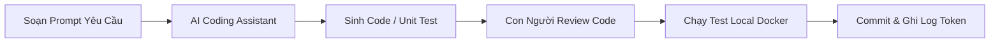

# PHẦN 4: DEVELOPMENT METHOD
## Phương Pháp Phát Triển & Quy Trình Kỹ Thuật

  
Phương Pháp Phát Triển & Quy Trình Kỹ Thuật

  
Phương pháp luận Hybrid (Gating + Kanban WIP=1), chiến lược GitFlow, AI-Assisted Coding và QA Playwright.

  Hybrid Methodology
  Kanban WIP=1
  AI-Assisted Coding

---

# Phương Pháp Luận Hybrid: Gating + Kanban

  <h3 class="text-emerald-900 font-bold text-sm border-b border-slate-200 pb-1.5">Tầng Vĩ Mô: Gating Checkpoints</h3>
  <ul class="space-y-1.5 text-slate-700">
    <li>Khởi tạo 4 cổng kiểm soát (Gate 0 - Gate 3) gắn liền với milestone ngân sách.</li>
    <li>Mỗi cổng yêu cầu nghiệm thu sản phẩm thực tế trước khi giải ngân giai đoạn kế tiếp.</li>
    <li>Báo cáo định kỳ Ban Giám hiệu vào cuối Tuần 2, 12, 18 và 20.</li>
  </ul>

  <h3 class="text-emerald-900 font-bold text-sm border-b border-emerald-200 pb-1.5">Tầng Vi Mô: Kanban Vận Hành hàng Tuần</h3>
  <ul class="space-y-1.5 text-slate-700">
    <li>Vận hành theo bảng Kanban linh hoạt, phù hợp lịch làm việc kiêm nhiệm.</li>
    <li>Thiết lập giới hạn WIP = 1 card/người (hoặc /agent AI) để tránh phân tán nguồn lực.</li>
    <li>Đo Throughput hàng tuần (số story Done/tuần) để dự báo tiến độ chính xác.</li>
  </ul>

---

# Quy Tắc Kanban Chi Tiết: WIP, DoR, DoD

  <strong class="text-emerald-900 text-sm block mb-1">Giới Hạn WIP = 1</strong>
  
Mỗi thành viên chỉ làm duy nhất 1 card tại một thời điểm. Card hiện tại phải `Done` hoặc bị `Block` rõ ràng mới được nhận việc mới.

  <strong class="text-emerald-900 text-sm block mb-1">Definition of Ready (DoR)</strong>
  
Card vào `In Progress` phải có: ID story, Acceptance Criteria (AC) rõ ràng, `depends_on` đã Done, Size $\le$ M (tối đa 2 ngày).

  <strong class="text-emerald-900 text-sm block mb-1">Definition of Done (DoD)</strong>
  
Pass 100% AC, Code được review & merge qua PR, test local thành công, README cập nhật và ghi log nỗ lực/token AI.

---

# Chiến Lược Nhánh Git (GitFlow) Cho Đội 4 Người

  <strong class="text-emerald-900">`main` Branch:</strong> Nhánh sản phẩm chính thức, 100% code đã qua UAT, sẵn sàng deploy lên môi trường Production.
  Protected

  <strong class="text-emerald-900">`develop` Branch:</strong> Nhánh tích hợp liên tục, nơi gộp các tính năng mới đã hoàn thành của sprint/tuần.
  CI Integration

  <strong class="text-emerald-900">`feature/LDMS-xxx` Branch:</strong> Nhánh tính năng cá nhân tạo riêng cho từng User Story ID trên Backlog.
  Short-lived

  <strong>Quy tắc Code Review:</strong> Mọi Pull Request (PR) từ `feature/` vào `develop` bắt buộc phải có ít nhất 1 Tech Lead review và pass toàn bộ tự động kiểm thử.

---

# Quy Trình Phối Hợp AI-Assisted Coding

  <strong class="text-blue-900 text-sm block">Vai Trò Của AI Coding Assistant</strong>
  
Tự động sinh boilerplate code, hỗ trợ cấu hình Docker Compose, gợi ý hàm xử lý dữ liệu và sinh unit test nhanh gấp 3 lần.

  <strong class="text-emerald-900 text-sm block">Kiểm Soát Của Kỹ Sư Con Người</strong>
  
Kỹ sư trực tiếp thẩm định logic, đảm bảo mã nguồn tuân thủ kiến trúc Modular Monolith và không đưa các lỗ hổng bảo mật vào dự án.

---

# Quản Lý Tri Thức Dự Án & Project Log

  <strong class="text-emerald-900 text-sm block border-b border-slate-200 pb-1">Cấu Trúc File Project Log (`project_log.md`)</strong>
  
Mỗi khi hoàn thành 1 User Story, thành viên nhóm ghi nhận 1 dòng log theo chuẩn:

  

    [YYYY-MM-DD] [LDMS-xxx] Thành viên A đã hoàn thành story X (Effort: 4h, AI Token: 12k).
  

  <strong class="text-emerald-900 text-sm block border-b border-slate-200 pb-1">Lợi Ích Của Việc Ghi Log Tri Thức</strong>
  <ul class="space-y-1.5 text-slate-700">
    <li>Theo dõi chính xác nỗ lực thực tế (Actual Hours) vs ước lượng ban đầu.</li>
    <li>Đo lường mức độ đóng góp và hiệu quả ứng dụng AI Assistant.</li>
    <li>Tạo cơ sở dữ liệu số liệu phục vụ báo cáo Gating Checkpoint cho Ban Giám hiệu.</li>
  </ul>

---

# Kiểm Thử Tự Động & Đảm Bảo Chất Lượng (QA)

  <strong class="text-emerald-900 block mb-1">Unit Test (Pytest)</strong>
  
Kiểm thử độc lập từng module backend (Auth, Metadata, OCR Job, DRM URL). Pass rate $\ge 95\%$.

  <strong class="text-emerald-900 block mb-1">Playwright E2E Audit</strong>
  
Tự động giả lập thao tác người dùng duyệt web, kiểm tra responsive màn hình và rà soát lỗi giao diện.

  <strong class="text-emerald-900 block mb-1">Security Audit Script</strong>
  
Rà soát tự động các lỗ hổng bảo mật, kiểm tra thời gian hết hạn Signed URL và phân quyền API.

---

# Quản Trị Rủi Ro Tiến Độ Trong Phát Triển

  <strong class="text-emerald-900 text-sm block mb-1">1. Quản Lý Nguồn Lực Kiêm Nhiệm</strong>
  
Lịch làm việc được chốt cố định theo tuần. Khi có thành viên bị bận việc đột xuất, card đang làm được trả về trạng thái `Ready` để thành viên khác tiếp quản.

  <strong class="text-emerald-900 text-sm block mb-1">2. Nguyên Tắc Cắt Scope Linh Hoạt (Descope Strategy)</strong>
  
Nếu tiến độ bị chậm trễ tại Giai đoạn 1, nhóm sẽ ưu tiên cắt giảm các tính năng `Could-Have` và `Should-Have` để đảm bảo 100% tính năng `Must-Have` MVP sẵn sàng đúng Tuần 12.

