  
04

  

    
Phần 04

    <h1 class="text-4xl font-black text-slate-900 leading-tight mb-4">Phương Pháp Thực Hiện Dự Án</h1>
    

    
Phần này giải thích nhóm tổ chức công việc hàng tuần như thế nào (Kanban), cách dùng AI hỗ trợ viết mã nguồn, cách ghi lại nhật ký làm việc, và cách các thành viên gộp mã nguồn với nhau (GitFlow).

    

      Bảng Kanban + Trợ lý AI
      Nhật ký làm việc
      Quy tắc nhánh Git
      Ghi nhận thực tế Tuần 1
    

  

---

# Phương Pháp Vận Hành: Kết Hợp Gating & Kỷ Luật Kanban

  <h3 class="text-emerald-900 font-bold text-xs border-b border-slate-200 pb-1">Tầng vĩ mô: Các mốc kiểm tra (Gate 0 → Gate 3)</h3>
  <ul class="space-y-1 text-slate-700 list-disc list-inside">
    <li>Dự án chia làm 4 cổng kiểm soát gắn với mốc ngân sách.</li>
    <li>Cần trình bày sản phẩm thực tế đã hoàn thành để giải ngân pha tiếp theo.</li>
    <li>Báo cáo tiến độ Ban Giám hiệu cuối Tuần 2, 12, 18 và 20.</li>
  </ul>

  <h3 class="text-emerald-900 font-bold text-xs border-b border-emerald-200 pb-1">Tầng vi mô: Bảng Kanban vận hành hàng tuần</h3>
  <ul class="space-y-1 text-slate-700 list-disc list-inside">
    <li>Vận hành Kanban linh hoạt cho đội ngũ làm việc kiêm nhiệm.</li>
    <li>Thiết lập giới hạn WIP = 1 để tránh làm dở dang nhiều việc cùng lúc.</li>
    <li>Đo throughput thực tế hàng tuần để forecast tiến độ chính xác.</li>
  </ul>

  <strong class="text-emerald-900 text-xs block mb-1">1. Giới hạn WIP (WIP = 1)</strong>
  
Mỗi thành viên chỉ nhận 1 thẻ công việc cùng lúc. Hoàn thành hoặc báo bị vướng (Block) mới được nhận việc mới.

  <strong class="text-emerald-900 text-xs block mb-1">2. Định nghĩa Sẵn sàng (DoR)</strong>
  
Có mã số công việc rõ ràng, tiêu chí hoàn thành cụ thể, việc phụ thuộc đã xong và khối lượng không quá 2 ngày (Size S/M).

  <strong class="text-emerald-900 text-xs block mb-1">3. Định nghĩa Hoàn thành (DoD)</strong>
  
Đạt 100% tiêu chí AC, code đã review/merge qua PR, chạy tốt local, cập nhật tài liệu và ghi nhật ký thời gian/AI token.

---

# Quy Ước Đặt Tên Nhánh Mã Nguồn (Git) Cho Đội 4 Người

  <strong class="text-emerald-900">Nhánh `main`:</strong> Nhánh chính thức của sản phẩm — mọi mã nguồn ở đây đều đã được kiểm thử người dùng (UAT) và sẵn sàng đưa vào sử dụng thật.
  Được bảo vệ

  <strong class="text-emerald-900">Nhánh `develop`:</strong> Nơi gộp chung các tính năng mới đã hoàn thành trong tuần, trước khi đưa lên nhánh chính thức.
  Tích hợp liên tục

  <strong class="text-emerald-900">Nhánh `feature/LDMS-xxx`:</strong> Nhánh riêng cho từng công việc cụ thể (theo mã số công việc trên bảng Kanban), tồn tại trong thời gian ngắn rồi được gộp lại.
  Ngắn hạn

  <strong>Quy tắc kiểm tra mã nguồn:</strong> Mọi yêu cầu gộp mã nguồn (Pull Request) từ nhánh tính năng vào nhánh `develop` bắt buộc phải được ít nhất 1 Trưởng nhóm kỹ thuật (Tech Lead) xem lại, và phải vượt qua toàn bộ bài kiểm thử tự động.

  <strong>UAT</strong>: User Acceptance Testing (kiểm thử nghiệm thu, do người dùng thật xác nhận sản phẩm đạt yêu cầu)  
  <strong>Pull Request (PR)</strong>: yêu cầu đưa mã nguồn từ nhánh riêng vào nhánh chung, kèm bước người khác kiểm tra lại trước khi gộp

---

# Phát Triển Với AI, Ghi Nhật Ký & Kiểm Thử Tự Động

```mermaid
graph LR
    A[Soạn yêu cầu / prompt] --> B[Trợ lý AI viết mã]
    B --> C[Sinh mã nguồn & bài kiểm thử]
    C --> D[Con người kiểm tra lại]
    D --> E[Chạy thử trên máy local/Docker]
    E --> F[Gộp mã nguồn & ghi log]

    classDef default fill:#f8fafc,stroke:#cbd5e1,stroke-width:1px,color:#1e293b,font-size:10px,font-weight:bold;
    classDef start fill:#f0fdf4,stroke:#bbf7d0,stroke-width:1.5px,color:#166534,font-weight:bold;
    classDef main fill:#ecfdf5,stroke:#a7f3d0,stroke-width:1.5px,color:#065f46,font-weight:bold;
    classDef endNode fill:#fffbeb,stroke:#fef3c7,stroke-width:1.5px,color:#92400e,font-weight:bold;

    class A start;
    class B,C,D,E main;
    class F endNode;
```

  <strong class="text-blue-900 text-xs block">1. Quy trình phát triển với AI</strong>
  
AI tự động viết khung code lặp lại, cấu hình Docker và sinh unit test nhanh hơn 3 lần. Kỹ sư con người trực tiếp review logic và bảo đảm cấu trúc Modular Monolith.

  <strong class="text-emerald-900 text-xs block">2. Nhật ký effort (project_log.md)</strong>
  
Bắt buộc ghi nhận sau mỗi session hoàn thành: <code>[Ngày] [Mã_Story] Dev (Thời gian thực tế, Lượng Token AI đã dùng)</code> để phục vụ giám sát tiến độ.

  <strong class="text-emerald-900 text-xs block">3. Kiểm thử tự động & Đảm bảo chất lượng</strong>
  
Kiểm thử từng phần (Unit Test đạt ≥ 95% độc lập), kiểm thử toàn trình (Playwright E2E giả lập trình duyệt) và tự động rà soát lỗ hổng bảo mật.

  <strong>Token AI</strong>: đơn vị đo lượng "chữ" mà công cụ AI đã xử lý — dùng để ước tính chi phí/công sức sử dụng AI  
  <strong>E2E</strong>: End-to-End (kiểm thử toàn bộ luồng sử dụng từ đầu đến cuối, giả lập người dùng thật)

---

# Bảng Chú Giải Thuật Ngữ & Từ Viết Tắt

<strong>Kanban</strong> — phương pháp quản lý công việc bằng bảng thẻ, chia theo cột trạng thái (Sẵn sàng / Đang làm / Hoàn thành).

<strong>WIP</strong> — Work In Progress: số công việc đang được làm dở cùng một lúc.

<strong>DoR</strong> — Definition of Ready: điều kiện để một công việc đủ điều kiện bắt đầu làm.

<strong>DoD</strong> — Definition of Done: điều kiện để một công việc được coi là hoàn thành.

<strong>GitFlow</strong> — quy ước đặt tên và tổ chức các nhánh mã nguồn trong Git.

<strong>PR</strong> — Pull Request: yêu cầu gộp mã nguồn từ nhánh riêng vào nhánh chung, có bước người khác kiểm tra lại.

<strong>UAT</strong> — User Acceptance Testing: kiểm thử nghiệm thu bởi người dùng thật.

<strong>CI/CD</strong> — Continuous Integration / Continuous Deployment: tự động kiểm tra và triển khai mã nguồn mỗi khi có thay đổi.

<strong>AI Coding Assistant</strong> — công cụ trí tuệ nhân tạo hỗ trợ viết, gợi ý và kiểm tra mã nguồn.

<strong>Token</strong> — đơn vị đo lượng dữ liệu chữ mà công cụ AI xử lý, dùng để ước tính công sức/chi phí dùng AI.

<strong>Unit Test</strong> — bài kiểm thử cho từng phần nhỏ, độc lập của phần mềm.

<strong>E2E Test</strong> — End-to-End: kiểm thử toàn bộ luồng sử dụng, từ đầu đến cuối.

<strong>MVP</strong> — Minimum Viable Product: phiên bản sản phẩm tối thiểu, đủ dùng để đánh giá.

<strong>Modular Monolith</strong> — kiến trúc một hệ thống duy nhất nhưng chia rõ thành nhiều module độc lập bên trong.

