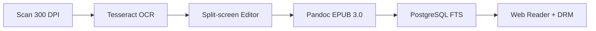
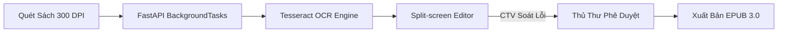
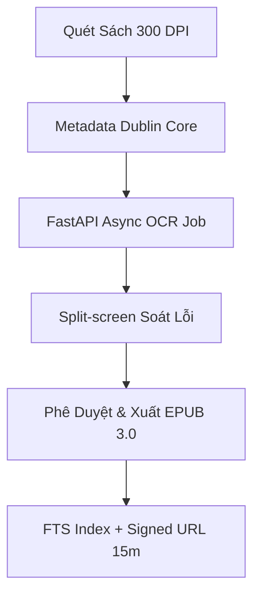
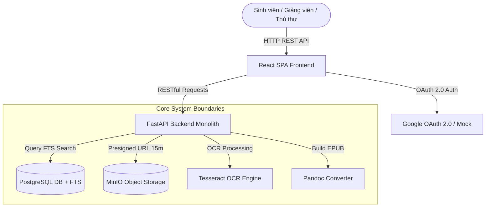
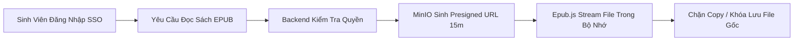
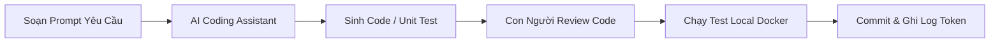

## Hệ Thống Quản Lý Và Số Hóa Tài Liệu Thư Viện HCMUS

  
Giải Pháp Số Hóa Giáo Trình & Học Liệu Nội Bộ Khép Kín

  
Báo cáo tổng thể: Project Proposal · Vision & Scope · Charter & Backlog · Architecture · Method · Estimation

  HCMUS-LDMS
  Đại Học Số ĐHQG-HCM

---

# Mục Lục & Chương Trình Thuyết Trình

  
PHẦN 1: PROJECT PROPOSAL

  
Bối cảnh, 3 nỗi đau, giải pháp Scan-to-EPUB 3.0, phân tích đối thủ, MOAT & ngân sách CapEx/OpEx.

  
PHẦN 2: VISION & CHARTER

  
Định vị sản phẩm, quy trình As-Is vs To-Be, ma trận RACI, NFRs & chi tiết 26 User Stories Backlog.

  
PHẦN 3: ARCHITECTURE & POC

  
Kiến trúc Modular Monolith, C4 Container, Async OCR Pipeline, Split-screen & DRM Signed URL 15m.

  
PHẦN 4: DEVELOPMENT METHOD

  
Phương pháp luận Hybrid (Gating + Kanban WIP=1), GitFlow, AI-Assisted Coding & QA Playwright.

  
PHẦN 5: ESTIMATION & MONITORING

  
Ước lượng UCP vs COCOMO II (10 PM), dự báo Throughput thực tế, AI Session Logging & Gating Checkpoints.

  
TỔNG KẾT & Q&A

  
Tóm tắt các quyết định then chốt và giải đáp thắc mắc với Ban Giám hiệu & Hội đồng Thẩm định.

---

# PHẦN 1: PROJECT PROPOSAL
## Đề Xuất Dự Án HCMUS-LDMS

  
Đề Xuất Dự Án HCMUS-LDMS

  
Đánh giá bối cảnh, 3 nỗi đau thực tế, giải pháp Scan-to-EPUB 3.0 & Phân tích MOAT kinh doanh.

  HCMUS-LDMS
  Phần 1: Proposal

---

# Vấn Đề: Nỗi Đau Thực Tế (Persona-driven)

  

    <strong class="text-red-900 text-sm">Sinh viên Nguyễn Văn Linh (CS Linh Trung)</strong>
  

  
"Em phải đi 15km mất gần 3 tiếng từ Linh Trung về Quận 5 chỉ để mượn 1 cuốn giáo trình độc bản. File PDF scan trên mạng thì bị đen, co giãn không được, đọc trên điện thoại mỏi mắt không học nổi!"

  
→ Giảm 80% hiệu suất học tập khi tra cứu xa.

  

    <strong class="text-orange-900 text-sm">Thủ thư Mai (CS Quận 5)</strong>
  

  
"Kho sách 100% diện tích đã quá tải. 85% thời gian thủ thư dành để đi tìm sách và ghi sổ thủ công. Nhìn giáo trình quý rách hỏng từng ngày mà không có bản lưu trữ số an toàn."

  
→ Nguy cơ rách hỏng và mất mát tài liệu vĩnh viễn.

  

    
40%

    
Giáo trình cũ xuống cấp

  

  

    
100%

    
Kho bãi quá tải diện tích

  

  

    
92%

    
SV muốn đọc số mobile

  

---

# Tại Sao Nên Thực Hiện Dự Án Này?

  <h4 class="font-bold text-emerald-900 text-sm mb-2 border-b border-slate-200 pb-2">1. Xuống Cấp Vật Lý Tri Thức</h4>
  
Hàng ngàn cuốn giáo trình nội bộ độc bản xuất bản trước 2010 bị giòn mục, rách trang do thời tiết nóng ẩm và tần suất mượn đọc cao.

  <h4 class="font-bold text-emerald-900 text-sm mb-2 border-b border-slate-200 pb-2">2. Quá Tải Hạ Tầng Lưu Trữ</h4>
  
Diện tích kho bãi chiếm 100% không gian thư viện Q.5, không còn diện tích mở rộng không gian tự học Smart Learning Space cho sinh viên.

  <h4 class="font-bold text-emerald-900 text-sm mb-2 border-b border-slate-200 pb-2">3. Chiến Lược Đại Học Số</h4>
  
Phù hợp Chiến lược Phát triển Đại học số ĐHQG-HCM giai đoạn 2026–2030 (đạt mốc số hóa >90% toàn bộ học liệu trọng yếu).

  <strong class="text-emerald-900 text-sm block mb-1">Tuyên Bố Giá Trị Cốt Lõi (Value Proposition):</strong>
  <em>"Bảo tồn tri thức học thuật giấy tĩnh sang học liệu số reflowable thông qua quy trình số hóa khép kín tự động, kết hợp kiểm soát bản quyền DRM Signed URL 15 phút an toàn tuyệt đối."</em>

---

# Giải Pháp Đề Xuất: Scan-to-EPUB Khép Kín

  <strong class="text-emerald-900 text-sm block mb-2">Trải Nghiệm Đọc Linh Hoạt (Reflowable)</strong>
  <ul class="space-y-1.5 list-disc pl-4 text-slate-700">
    <li>Tự động co giãn dòng chữ (80% – 200%) vừa vặn mọi màn hình di động/tablet.</li>
    <li>Tùy chọn font chữ (Roboto/Inter/OpenDyslexic) và 3 chế độ nền Light/Sepia/Dark.</li>
    <li>Tìm kiếm toàn văn FTS tức thì đến từng câu, từng đoạn sách.</li>
  </ul>

  <strong class="text-emerald-900 text-sm block mb-2">Bảo Vệ Bản Quyền Nghiêm Ngặt (DRM)</strong>
  <ul class="space-y-1.5 list-disc pl-4 text-slate-700">
    <li>Không có nút lưu/tải xuống file EPUB gốc về máy cá nhân.</li>
    <li>Cấp quyền truy cập tạm thời qua MinIO Signed URL (tự hủy sau 15 phút).</li>
    <li>Chặn thao tác chuột phải, bôi đen copy đoạn văn bản số lượng lớn.</li>
  </ul>

---

# So Sánh Với Đối Thủ Cạnh Tranh (Giải Pháp Thương Mại)

| Tiêu Chí So Sánh | Giải Pháp Thương Mại (Lạc Việt, DSpace) | HCMUS-LDMS (Đề Xuất) |
| :--- | :--- | :--- |
| **Chi Phí Khởi Tạo (CapEx)** | 300 triệu – hơn 1 tỷ VNĐ | **75.000.000 – 95.000.000 VNĐ** (Tiết kiệm > 200 triệu) |
| **Biên Tập OCR Split-screen** | Rất khó / Không hỗ trợ soát lỗi | **Hỗ trợ giao diện Split-screen chuyên dụng** |
| **Bảo Mật DRM Signed URL** | Không hỗ trợ (chỉ chặn IP cơ bản) | **Tích hợp MinIO Temporary Signed URL 15m** |
| **Mã Nguồn & Hạ Tầng** | Phụ thuộc vendor (Vendor lock-in) | **Làm chủ 100% mã nguồn & hạ tầng On-premise** |

  <strong>Lợi thế cạnh tranh:</strong> Làm chủ công nghệ và tối ưu ngân sách cho nhà trường mà không bị phụ thuộc bản quyền phần mềm ngoài.
  Tiết kiệm > 200M

---

# So Sánh Với Phương Án Ghép Công Cụ Rời Rạc (Thủ Công)

  <h3 class="text-red-900 font-bold text-sm mb-2 border-b border-red-200 pb-2">Phương Án Ghép Công Cụ Rời Rạc (Abbyy + Drive)</h3>
  <ul class="space-y-2 text-slate-700">
    <li><strong>Rời rạc & Tốn công:</strong> Mất 2-3 giờ lao động thủ công chuyển qua lại giữa 4 phần mềm offline.</li>
    <li><strong>Rủi ro pháp lý cao:</strong> Google Drive không chặn tải file gốc, nguy cơ phát tán sách tràn lan.</li>
    <li><strong>Tra cứu kém:</strong> Không hỗ trợ tìm kiếm toàn văn FTS đến từng trang sách.</li>
  </ul>

  <h3 class="text-emerald-900 font-bold text-sm mb-2 border-b border-emerald-200 pb-2">Hệ Thống HCMUS-LDMS Khép Kín</h3>
  <ul class="space-y-2 text-slate-700">
    <li><strong>Tự động hóa 100%:</strong> Luồng Scan $\rightarrow$ OCR $\rightarrow$ Editor $\rightarrow$ EPUB diễn ra trên 1 giao diện web.</li>
    <li><strong>Bảo mật Signed URL 15m:</strong> Khóa tải xuống, phân quyền SSO Google OAuth trường.</li>
    <li><strong>Tìm kiếm FTS dưới 3s:</strong> Lập chỉ mục toàn văn PostgreSQL FTS tức thì.</li>
  </ul>

---

# Lợi Thế Cạnh Tranh Bền Vững (MOAT Analysis)

  <strong class="text-emerald-900 text-sm block mb-1">1. Exclusive Content (Độc Quyền 5/5)</strong>
  
Sở hữu độc quyền kho giáo trình và đề thi nội bộ HCMUS mà các nền tảng thương mại bên ngoài không bao giờ có được.

  <strong class="text-emerald-900 text-sm block mb-1">2. Switching Cost Cao (Mức Độ 5/5)</strong>
  
Toàn bộ thói quen tra cứu, ghi chú và lịch sử đọc của sinh viên/giảng viên được gắn liền với tài khoản SSO trường.

  <strong class="text-emerald-900 text-sm block mb-1">3. Lợi Thế Chi Phí (Mức Độ 4/5)</strong>
  
Tận dụng 100% công nghệ mã nguồn mở (FastAPI, PostgreSQL, MinIO, Docker) loại bỏ hoàn toàn phí bản quyền hàng năm.

  <strong class="text-emerald-900 text-sm block mb-1">Kết Luận Phòng Thủ Strategical MOAT:</strong>
  Đối thủ thương mại có công nghệ nhưng <strong>không có Exclusive Content</strong> của HCMUS. Phương án ghép công cụ rời rạc <strong>không có bất kỳ MOAT nào</strong> để bảo vệ tri thức trường.

---

# Phân Tích Các Bên Liên Quan (Stakeholders & RACI)

  <strong class="text-emerald-900 text-sm block border-b border-slate-200 pb-1">Cơ Cấu Stakeholders Dự Án</strong>
  <ul class="space-y-1.5 text-slate-700">
    <li><strong>Sponsor:</strong> Ban Giám hiệu HCMUS (Phê duyệt chủ trương & ngân sách)</li>
    <li><strong>Client Nghiệp vụ:</strong> Ban Giám đốc Thư viện (Kiểm soát OCR & Biên tập)</li>
    <li><strong>Client Kỹ thuật:</strong> Phòng CNTT (Hạ tầng vSphere, OAuth, FTS)</li>
    <li><strong>Cố vấn Pháp lý:</strong> Bộ phận Pháp chế (Thẩm định quy chế SHTT)</li>
  </ul>

  <strong class="text-emerald-900 text-sm block border-b border-slate-200 pb-1">Phân Phối Bảng RACI Rút Gọn</strong>
  <ul class="space-y-1.5 text-slate-700">
    <li><strong>WP1 Khảo sát & Pháp lý:</strong> Thư viện (Accountable), Pháp chế (Consulted)</li>
    <li><strong>WP2 Hạ tầng & Storage:</strong> Phòng CNTT (Accountable), Thư viện (Informed)</li>
    <li><strong>WP3 Core Development:</strong> Phòng CNTT (Accountable), Dev Team (Responsible)</li>
    <li><strong>WP4 Số hóa 2.500 sách:</strong> Thư viện (Accountable), CTV (Responsible)</li>
  </ul>

---

# Phân Tích Chi Phí – Lợi Ích & Điểm Hòa Vốn

  Ngân Sách CapEx
  75 – 95 Tr VNĐ
  Mua 2 máy scan V-shaped + Server

  Chi Phí Vận Hành OpEx
  15 – 30 Tr/năm
  Điện đạm, bảo trì & thù lao CTV

  Tiết Kiệm (Cost Avoidance)
  35 Tr/năm
  Tiết kiệm kho bãi + Giờ công thủ thư

  

    <strong class="text-emerald-900 text-sm block">Thời Gian Hoàn Vốn (Payback Period): 2.5 – 3.8 Năm</strong>
    
Lợi ích định tính: bảo tồn 100% học liệu gốc, nâng cao chỉ số Đại học số ĐHQG-HCM, làm chủ 100% công nghệ.

  

  Hiệu Quả Cao

---

# Lộ Trình Triển Khai Cấp Cao (Roadmap 20 Tuần)

  

    <strong class="text-emerald-900 text-sm">Giai Đoạn 0 (Tuần 1–2): Khảo Sát & Bản Quyền</strong>
    
Khảo sát 2.500 đầu sách, ban hành Quy chế bảo mật bản quyền số nội bộ.

  

  Gate 0

  

    <strong class="text-emerald-900 text-sm">Giai Đoạn 1 (Tuần 3–12): Phát Triển MVP & Thí Điểm Khoa CNTT</strong>
    
Hoàn thiện Core System, số hóa thí điểm 500 giáo trình CNTT trọng yếu.

  

  Gate 1 (MVP)

  

    <strong class="text-emerald-900 text-sm">Giai Đoạn 2 (Tuần 13–18): Số Hóa Diện Rộng</strong>
    
Huy động CTV mở rộng số hóa 2.000 đầu sách thuộc các Khoa Tự nhiên còn lại.

  

  Gate 2

  

    <strong class="text-emerald-900 text-sm">Giai Đoạn 3 (Tuần 19–20): UAT & Go-Live Toàn Trường</strong>
    
Kiểm thử UAT, Pentest bảo mật DRM, bàn giao chính thức cho Thư viện vận hành.

  

  Gate 3 (Go-Live)

---

# Quy Trình AI-Assisted (Human-in-the-loop)

  <strong class="text-blue-900 text-sm block mb-1">AI / Automation Xử Lý (Tesseract + Async)</strong>
  
Đảm nhận 80% khối lượng công việc lặp lại: nhận dạng ký tự tiếng Việt, bóc tách bảng biểu, tự động canh lề và tạo cấu trúc HTML thô.

  <strong class="text-orange-900 text-sm block mb-1">Con Người Kiểm Duyệt (Human Verification)</strong>
  
Biên tập viên/CTV soát lỗi trực quan qua màn hình Split-screen. Thủ thư giữ quyền quyết định duyệt xuất bản cuối cùng (100% chuẩn học thuật).

---

# Danh Mục Rủi Ro Kinh Doanh & Biện Pháp Giảm Thiểu

| Loại Rủi Ro | Mức Độ | Biện Pháp Giảm Thiểu (Mitigation Strategy) |
| :--- | :--- | :--- |
| **Bản Quyền & Pháp Lý** | **Cao** | Chỉ số hóa giáo trình nội bộ HCMUS, phân quyền SSO Google OAuth, khóa tải xuống. |
| **Chất Lượng OCR Tiếng Việt** | **Trung Bình** | Tiền xử lý ảnh (Deskew/Bin) + Giao diện Split-screen cho CTV sửa lỗi nhanh. |
| **Rò Rỉ File Gốc** | **Trung Bình** | Dùng MinIO Temporary Signed URL tự hủy sau 15 phút, chặn chuột phải & Copy. |
| **Nguồn Nhân Lực Quá Tải** | **Trung Bình** | Đội ngũ cam kết 50% thời gian chính thức, tuyển CTV sinh viên theo giờ công. |

---

# Kết Luận & Khuyến Nghị Hành Động (Next Steps)

  BƯỚC 1
  

    <strong class="text-emerald-900 text-base">Phê Duyệt Chủ Trương & Ngân Sách Khởi Động</strong>
    
Thông qua đề xuất dự án & cấp kinh phí CapEx đợt 1 (75.000.000 VNĐ) để triển khai Giai đoạn 0.

  

  BƯỚC 2
  

    <strong class="text-emerald-900 text-base">Ban Hành Quy Châu Bản Quyền Số Nội Bộ</strong>
    
Phòng Pháp chế phối hợp Thư viện ban hành quy chế sử dụng tài liệu số hóa trước Tuần 3.

  

  BƯỚC 3
  

    <strong class="text-emerald-900 text-base">Triển Khai Thí Điểm MVP Khoa CNTT</strong>
    
Hoàn thành số hóa 500 giáo trình CNTT đúng tiến độ Tuần 12 trước khai giảng năm học mới.

  

---

# PHẦN 2: VISION, CHARTER & BACKLOG
## Tầm Nhìn · Điều Lệ Dự Án · Product Backlog

  
Tầm Nhìn · Điều Lệ Dự Án · Product Backlog

  
Định vị sản phẩm, ma trận trách nhiệm RACI, quản trị phạm vi MVP và 26 User Stories chuẩn hóa.

  Vision & Scope
  Project Charter
  Product Backlog

---

# Phát Biểu Định Vị Sản Phẩm (Product Position Statement)

  
<strong class="text-emerald-900 text-sm">DÀNH CHO:</strong> Sinh viên, giảng viên và cán bộ thủ thư Trường ĐH Khoa học Tự nhiên (ĐHQG-HCM).

  
<strong class="text-emerald-900 text-sm">NHỮNG NGHƯỜI ĐANG GẶP VẤN ĐỀ:</strong> Khó khăn trong việc tra cứu giáo trình độc bản, rủi ro hư hại tài liệu giấy cũ và trải nghiệm đọc số kém trên thiết bị di động.

  
<strong class="text-emerald-900 text-sm">SẢN PHẨM HCMUS-LDMS LÀ:</strong> Hệ thống web nội bộ quản lý và số hóa tài liệu học thuật tập trung.

  
<strong class="text-emerald-900 text-sm">GIÚP CUNG CẤP:</strong> Quy trình số hóa khép kín tự động (Scan $\rightarrow$ OCR $\rightarrow$ EPUB 3.0), tìm kiếm toàn văn FTS dưới 3 giây và đọc trực tuyến bảo mật DRM qua Signed URL 15 phút.

  
<strong class="text-emerald-900 text-sm">KHÁC BIỆT SO VỚI:</strong> Các file PDF scan tĩnh công cộng hay hệ thống OPAC truyền thống không hỗ trợ reflowable và phân quyền SSO.

---

# Quy Trình As-Is: Vận Hành Thủ Công Hiện Tại

  <h3 class="text-red-900 font-bold text-sm mb-3 border-b border-red-200 pb-2">Các Bước Vận Hành Hiện Tại (As-Is)</h3>
  <ol class="list-decimal pl-4 space-y-2 text-slate-700">
    <li>Sinh viên di chuyển 15km từ Linh Trung về Q.5 hoặc tra cứu tiêu đề sách thủ công.</li>
    <li>Thủ thư đi tìm từng cuốn sách giấy vật lý trong kho bãi quá tải.</li>
    <li>Sinh viên đọc sách tại chỗ, ghi chép tay công thức/sơ đồ do cấm photocopy.</li>
    <li>Sách giấy liên tục lật giở bị rách hỏng và mục nát theo thời gian.</li>
    <li>Kho bãi chiếm 100% diện tích thư viện, không còn chỗ làm không gian tự học.</li>
  </ol>

  <h3 class="text-slate-900 font-bold text-sm mb-3 border-b border-slate-200 pb-2">4 Nút Thắt Nghiêm Trọng</h3>
  <ul class="space-y-2 text-slate-700">
    <li><strong class="text-red-800">1. Vi phạm bản quyền:</strong> Phát tán tự do file scan PDF không kiểm soát.</li>
    <li><strong class="text-red-800">2. Trải nghiệm mỏi mắt:</strong> PDF ảnh vỡ nét, không co giãn chữ trên mobile.</li>
    <li><strong class="text-red-800">3. Mất khả năng tra cứu:</strong> Không thể tìm kiếm từ khóa bên trong nội dung sách.</li>
    <li><strong class="text-red-800">4. Không có Metadata:</strong> Thiếu chuẩn quản lý dữ liệu Dublin Core thống nhất.</li>
  </ul>

---

# Quy Trình To-Be: Số Hóa Khép Kín Có AI Hỗ Trợ

  <strong class="text-emerald-900 text-sm block mb-1">Làn Nghiệp Vụ Thủ Thư / Admin</strong>
  
Thủ thư quét sách, khai báo chuẩn Metadata Dublin Core và giữ quyền duyệt xuất bản chính thức. Quản trị viên phân quyền SSO Google OAuth.

  <strong class="text-blue-900 text-sm block mb-1">Làn Biên Tập CTV / AI OCR</strong>
  
Tesseract OCR nhận dạng ký tự tự động trong background. Biên tập viên/CTV soát lỗi trực quan qua giao diện Split-screen (+60% hiệu suất).

---

# So Sánh Quy Trình 4 Phương Án (Benchmarking)

| Tiêu Chí Đối Chuẩn | As-Is Thủ Công | Abbyy + Drive | Lạc Việt / DSpace | HCMUS-LDMS |
| :--- | :--- | :--- | :--- | :--- |
| **Tốc Độ Số Hóa** | Rất chậm (3h/sách) | Chậm (2h/sách) | Trung bình | **Nhanh (30m/sách nhờ Split-screen)** |
| **Bảo Mật DRM** | Không có | Rủi ro cao (Drive) | Cơ bản | **Signed URL 15m + Chặn Copy** |
| **Tìm Kiếm FTS** | Không hỗ trợ | Không hỗ trợ | Tìm kiếm tiêu đề | **FTS Toàn văn < 3s (PostgreSQL)** |
| **Nỗ Lực Vận Hành** | Rất cao | Cao | Trung bình | **Rất thấp (Tự động hóa 100%)** |

---

# Chân Dung Stakeholders & Người Dùng System

  <strong class="text-emerald-900 text-sm block border-b border-slate-200 pb-1">Nhóm Quản Trị & Ban Dự Án (Stakeholders)</strong>
  <ul class="space-y-1.5 text-slate-700">
    <li><strong>Sponsor:</strong> Ban Giám hiệu HCMUS — Quan tâm tiến độ & hiệu quả ngân sách.</li>
    <li><strong>Client Nghiệp vụ:</strong> Ban Giám đốc Thư viện — Quan tâm chất lượng OCR & bảo tồn.</li>
    <li><strong>Client Kỹ thuật:</strong> Phòng CNTT — Quan tâm hạ tầng vSphere & an toàn thông tin.</li>
  </ul>

  <strong class="text-emerald-900 text-sm block border-b border-slate-200 pb-1">Nhóm Trực Tiếp Thao Tác (End Users)</strong>
  <ul class="space-y-1.5 text-slate-700">
    <li><strong>Độc giả (SV/GV):</strong> Truy cập mobile/tablet đọc EPUB 24/7 từ xa.</li>
    <li><strong>Thủ thư / Editor:</strong> Thao tác PC văn phòng quét sách, OCR & soát lỗi.</li>
    <li><strong>Quản trị viên (Admin):</strong> Quản lý danh mục, phân quyền & giám sát hệ thống.</li>
  </ul>

---

# Phân Tích Trách Nhiệm RACI & Power/Interest Grid

  <strong class="text-emerald-900 text-sm block border-b border-slate-200 pb-1">Ma Trận Trách Nhiệm RACI</strong>
  
<strong>WP1 Khảo sát & Pháp lý:</strong> Thư viện (A), Pháp chế (C)

  
<strong>WP2 Hạ tầng Storage:</strong> Phòng CNTT (A), Thư viện (I)

  
<strong>WP3 Core Development:</strong> Phòng CNTT (A), Dev Team (R)

  
<strong>WP4 Số hóa 2.500 sách:</strong> Thư viện (A), CTV (R)

  <strong class="text-emerald-900 text-sm block border-b border-slate-200 pb-1">Power / Interest Grid</strong>
  
<strong class="text-emerald-800">Power Cao / Interest Cao (Quản lý sát sao):</strong> BGĐ Thư viện, PM Phòng CNTT.

  
<strong class="text-emerald-800">Power Cao / Interest Vừa (Giữ hài lòng):</strong> Ban Giám hiệu, Bộ phận Pháp chế.

  
<strong class="text-emerald-800">Power Thấp / Interest Cao (Thông báo đầy đủ):</strong> Giảng viên, Sinh viên.

---

# Ma Trận Tác Nhân As-Is vs To-Be (Impact Analysis)

| Tác Nhân | Trạng Thái Hiện Tại (As-Is) | Trạng Thái Tương Lai (To-Be) |
| :--- | :--- | :--- |
| **Độc Giả (Sinh Viên)** | Di chuyển 15km, chép tay thủ công, PDF mỏi mắt. | Đọc responsive 24/7 trên smartphone, FTS < 3s. |
| **Thủ Thư** | Kho quá tải, 85% thời gian ghi sổ thủ công. | Tự động hóa 100% kiểm kê, quản lý file EPUB tập trung. |
| **Biên Tập Viên / CTV** | Sửa lỗi thủ công rời rạc trên nhiều file Word/PDF. | Giao diện Split-screen soát lỗi nhanh (+60% năng suất). |
| **Ban Giám Hiệu** | Lo lắng rò rỉ bản quyền & kho bãi quá tải. | Đạt mốc Đại học số ĐHQG-HCM, bảo mật DRM tuyệt đối. |

---

# Scope Boundary: Tính Năng MVP vs Mở Rộng

  

    <strong class="text-emerald-900 text-sm">Phạm Vi MVP (Must-Have & Should-Have)</strong>
    23 Stories
  

  <ul class="space-y-1 text-slate-700 list-disc pl-4">
    <li>Đăng nhập Google OAuth 2.0 / Mock Auth.</li>
    <li>Upload & pipeline OCR Tesseract bất đồng bộ.</li>
    <li>Giao diện Split-screen Editor biên tập text/ảnh.</li>
    <li>Đóng gói chuẩn EPUB 3.0 reflowable.</li>
    <li>Tìm kiếm toàn văn PostgreSQL FTS < 3s.</li>
    <li>Web Reader bảo mật Signed URL 15m (chặn Copy).</li>
  </ul>

  

    <strong class="text-slate-900 text-sm">Phạm Vi Mở Rộng & Hoãn (Out of Scope MVP)</strong>
    3 Stories
  

  <ul class="space-y-1 text-slate-700 list-disc pl-4">
    <li>Tùy biến theme đọc cá nhân hóa sâu.</li>
    <li>Tích hợp công cụ trích dẫn Citation Generator.</li>
    <li>AI RAG Chatbot hỏi đáp trên nội dung sách (GĐ3).</li>
    <li>Loại trừ: Tích hợp hệ thống chống đạo văn Turnitin.</li>
  </ul>

---

# Yêu Cầu Phi Chức Năng (NFR) Trọng Yếu

  <strong class="text-emerald-900 text-sm block mb-1">Hiệu Năng (Performance)</strong>
  
FTS search < 3s cho 500 CCU đồng thời. Web Reader tải trang < 2s.

  <strong class="text-emerald-900 text-sm block mb-1">Bảo Mật (Security)</strong>
  
Google OAuth 2.0, MinIO Signed URL 15m, 0 sự cố rò rỉ file gốc.

  <strong class="text-emerald-900 text-sm block mb-1">Độ Tin Cậy (Reliability)</strong>
  
PgBackRest backup 01:00 hàng ngày, RPO < 24h, Uptime 99.5%.

  <strong>UI/UX:</strong> Responsive 100% từ mobile 320px đến desktop 4K. Lighthouse Accessibility $\ge 90$.

  <strong>Pháp Lý & Ngân Sách:</strong> Tuân thủ Luật SHTT Việt Nam. Ngân sách phát triển < 100 Tr VNĐ.

---

# Quy Tắc Tổ Chức Backlog: Kanban & DoD

  <strong class="text-emerald-900 text-sm block mb-2">Nguyên Tắc Kanban</strong>
  <ul class="space-y-1.5 text-slate-700">
    <li>WIP = 1 card/người (tránh phân tán).</li>
    <li>Đo throughput thực tế (story Done/tuần).</li>
    <li>Không dùng Story Point để ép tiến độ.</li>
  </ul>

  <strong class="text-emerald-900 text-sm block mb-2">Definition of Done (DoD)</strong>
  <ul class="space-y-1.5 text-slate-700">
    <li>Pass 100% Acceptance Criteria (AC).</li>
    <li>Code merge qua PR & test local ok.</li>
    <li>Cập nhật README & log token AI.</li>
  </ul>

  <strong class="text-emerald-900 text-sm block mb-2">Phân Bổ MoSCoW (26 Stories)</strong>
  <ul class="space-y-1.5 text-slate-700">
    <li><strong>Must-have:</strong> 16 stories (Cốt lõi MVP)</li>
    <li><strong>Should-have:</strong> 7 stories (Trải nghiệm tốt)</li>
    <li><strong>Could-have:</strong> 3 stories (Mở rộng)</li>
  </ul>

---

# Deep-Dive Example: User Story LDMS-003

  LDMS-003: Hàng Đợi OCR Và Trạng Thái Job
  

    Must-Have
    Size M
  

"Là thủ thư, tôi muốn hệ thống chạy OCR nền và theo dõi được trạng thái xử lý để không phải chờ đợi trên giao diện."

  <strong class="text-emerald-900 block">Acceptance Criteria (AC):</strong>
  
<strong>AC1:</strong> Khi kích hoạt OCR, job được khởi tạo ở trạng thái ban đầu <code>pending</code>.

  
<strong>AC2:</strong> Job tự động chuyển <code>processing</code> $\rightarrow$ <code>completed</code> hoặc <code>failed</code>.

  
<strong>AC3:</strong> API trả về kết quả nhanh (< 500ms), không block luồng request chính (Async BackgroundTasks).

  
<strong>AC4:</strong> Nếu job <code>failed</code>, phải lưu vết <code>error_message</code> tường minh để truy vết lỗi.

---

# Bản Đồ Triển Khai Backlog (Implementation Map)

  <strong class="text-emerald-900">Giai Đoạn 1: Nền Tảng & Flow Dữ Liệu</strong> — LDMS-001 (Upload), LDMS-002 (OCR Job), LDMS-003 (Status)
  Tuần 3–5

  <strong class="text-emerald-900">Giai Đoạn 2: Biên Tập & Xuất Bản EPUB</strong> — LDMS-004 (Split-screen), LDMS-005 (Text Editor), LDMS-007 (Build EPUB)
  Tuần 6–8

  <strong class="text-emerald-900">Giai Đoạn 3: Xác Thực & Tra Cứu FTS</strong> — LDMS-010 (OAuth), LDMS-012 (PostgreSQL FTS), LDMS-014 (Signed URL)
  Tuần 9–10

  <strong class="text-emerald-900">Giai Đoạn 4: Web Reader & Phân Quyền</strong> — LDMS-016 (Epub.js Reader), LDMS-018 (Chặn Copy), LDMS-020 (Catalog)
  Tuần 11–12

---

# Governance & KPI Theo Điều Lệ Dự Án (Charter)

  <strong class="text-emerald-900 text-sm block border-b border-slate-200 pb-1">Cơ Cấu Quản Trị Dự Án</strong>
  
Sponsor (BGH) $\rightarrow$ Client Nghiệp vụ (BGĐ Thư viện) $\rightarrow$ PM (Phòng CNTT) $\rightarrow$ Tech Lead $\rightarrow$ Dev Team.

  
<strong>Kiểm soát thay đổi:</strong> Thay đổi > 5% ngân sách/scope cần tờ trình phê duyệt của PM + Giám đốc Thư viện.

  <strong class="text-emerald-900 text-sm block border-b border-emerald-200 pb-1">5 KPI Thành Công Cốt Lõi</strong>
  <ul class="space-y-1 text-slate-800 font-medium">
    <li>1. Số hóa $\ge 90\%$ học liệu trọng yếu năm 2026.</li>
    <li>2. Tốc độ tra cứu FTS $< 3$ giây cho 500 CCU.</li>
    <li>3. Độ chính xác OCR tiếng Việt $\ge 85\%$.</li>
    <li>4. 0 sự cố rò rỉ file EPUB gốc ra ngoài.</li>
    <li>5. Độ hài lòng của sinh viên/thủ thư $\ge 85\%$.</li>
  </ul>

---

# Demo: AI-Assisted Backlog Governance

  <strong class="text-blue-900 text-sm block">1. AI Assistant Rà Soát Nháp</strong>
  
AI tự động quét file backlog, đối chiếu chuẩn DoD, gợi ý bổ sung các AC điều kiện biên (edge cases) và kiểm tra phụ thuộc <code>depends_on</code> giữa các story.

  <strong class="text-emerald-900 text-sm block">2. Con Người (PM / Tech Lead) Duyệt</strong>
  
PM xem xét lại gợi ý của AI, đánh giá tính khả thi theo nguồn lực thực tế của đội ngũ 4 người trước khi chốt card sang trạng thái <code>Ready for Implementation</code>.

---

# PHẦN 3: ARCHITECTURE & PROOF OF CONCEPT
## Thiết Kế Kiến Trúc Phần Mềm & PoC

  
Thiết Kế Kiến Trúc Phần Mềm & Proof of Concept (PoC)

  
Kiến trúc Modular Monolith, sơ đồ C4 Container, luồng Async OCR Pipeline và giải pháp bảo mật DRM.

  Modular Monolith
  On-Premise
  DRM Signed URL

---

# Mục Tiêu & Ràng Buộc Kiến Trúc (Architecture Goals)

  <h3 class="text-emerald-900 font-bold text-sm border-b border-emerald-200 pb-1.5">Mục Tiêu Kỹ Thuật (System Goals)</h3>
  <ul class="space-y-1.5 text-slate-700">
    <li><strong>Hiệu năng FTS:</strong> Tra cứu toàn văn dưới 3 giây cho 500 CCU đồng thời.</li>
    <li><strong>Bảo mật DRM:</strong> Cấp quyền truy cập tạm thời Signed URL 15m, 0 nút Download.</li>
    <li><strong>Xử lý bất đồng bộ:</strong> Đưa tác vụ OCR nặng vào BackgroundTasks giải phóng Gateway.</li>
    <li><strong>Trải nghiệm đọc:</strong> Đóng gói chuẩn EPUB 3.0 reflowable co giãn đa thiết bị.</li>
  </ul>

  <h3 class="text-amber-900 font-bold text-sm border-b border-amber-200 pb-1.5">Ràng Buộc Hạ Tầng & Ngân Sách</h3>
  <ul class="space-y-1.5 text-slate-700">
    <li><strong>Hạ tầng On-premise:</strong> Tận dụng cụm ảo hóa VMware vSphere sẵn có của Trường.</li>
    <li><strong>Giới hạn ngân sách:</strong> Chi phí mua máy móc & phát triển dưới 100 Tr VNĐ.</li>
    <li><strong>Nguồn lực đội ngũ:</strong> 4 kỹ sư kiêm nhiệm (~2 full-time equivalent).</li>
  </ul>

---

# Quyết Định Kiến Trúc: Vì Sao Chọn Modular Monolith?

| Tiêu Chí So Sánh | DSpace / Kho Tĩnh | Microservices Architecture | Modular Monolith (Lựa Chọn) |
| :--- | :--- | :--- | :--- |
| **Phù Hợp Quy Mô Đội 4 Người** | Trung bình | Rất kém (Phức tạp CI/CD & DevOps) | **Rất tốt (Codebase tập trung, chia module)** |
| **Khả Năng Xử Lý OCR Async** | Không hỗ trợ | Rất tốt | **Rất tốt (FastAPI BackgroundTasks)** |
| **Chi Phí Vận Hành Hạ Tầng** | Thấp | Rất cao | **Rất thấp (Chạy mượt trên 1-2 VMs)** |
| **Khả Năng Tách Dịch Vụ Sau Này**| Rất khó | Đã tách | **Dễ dàng (Module độc lập theo chuẩn SOLID)** |

  <strong>Kết luận ADR (Architecture Decision Record):</strong> Modular Monolith là điểm cân bằng hoàn hảo giữa năng suất phát triển của đội 4 người và khả năng mở rộng hạ tầng tương lai.

---

# Ngăn Xếp Công Nghệ (Technology Stack)

  <strong class="text-emerald-900 block mb-1">Frontend SPA</strong>
  React 18 + Vite
  
Tailwind CSS + Epub.js Reader

  <strong class="text-emerald-900 block mb-1">Backend REST API</strong>
  FastAPI (Python 3.11)
  
BackgroundTasks + SQLAlchemy

  <strong class="text-emerald-900 block mb-1">Database & Search</strong>
  PostgreSQL 15
  
Full-Text Search (FTS) Index

  <strong class="text-emerald-900 block mb-1">Object Storage</strong>
  MinIO S3 Compatible
  
Presigned Temporary URLs 15m

  <strong>Công cụ bổ trợ:</strong> Tesseract OCR Engine (Nhận dạng tiếng Việt) + Pandoc Converter (Xuất EPUB 3.0) + Docker Compose.
  100% Mã Nguồn Mở

---

# Sơ Đồ Container C4 Model

---

# Chi Tiết Cấu Trúc Module Hóa Backend

  <strong class="text-emerald-900 text-sm block border-b border-slate-200 pb-1">1. Module Identity & Auth (M8)</strong>
  
Xử lý đăng nhập Google OAuth 2.0 / Mock Auth, phân quyền vai trò (Admin, Librarian, Editor, Reader), cấp JWT Access Token.

  <strong class="text-emerald-900 text-sm block border-b border-slate-200 pb-1">2. Module Digitization & OCR (M1-M3)</strong>
  
Quản lý upload ảnh scan, kích hoạt hàng đợi OCR async qua BackgroundTasks, lưu vết trạng thái job (pending/processing/completed/failed).

  <strong class="text-emerald-900 text-sm block border-b border-slate-200 pb-1">3. Module Editor & Publisher (M4-M5)</strong>
  
Cung cấp API cho giao diện Split-screen Editor, nhận dữ liệu hiệu chỉnh text/ảnh và gọi Pandoc đóng gói file EPUB 3.0 chuẩn hóa.

  <strong class="text-emerald-900 text-sm block border-b border-slate-200 pb-1">4. Module Search & Reader (M6-M7)</strong>
  
Lập chỉ mục PostgreSQL FTS, tạo MinIO Signed URL 15m cho Web Reader và thực thi cơ chế DRM chống Copy/Download.

---

# Luồng Xử Lý Bất Đồng Bộ Async OCR Pipeline

  Bước 1
  
Thủ thư kích hoạt OCR qua API <code>POST /api/v1/digitization/ocr</code> → Server khởi tạo job với `status=pending` và trả về ngay HTTP 202 Accepted (dưới 300ms).

  Bước 2
  
FastAPI đẩy tác vụ xử lý vào <code>BackgroundTasks</code> → Gọi Tesseract OCR nhận dạng ký tự tiếng Việt trong luồng riêng biệt.

  Bước 3
  
Giao diện Frontend thực hiện Status Polling nhẹ nhàng mỗi 2-3s qua API <code>GET /api/v1/digitization/jobs/{id}</code> để cập nhật tiến độ.

  Bước 4
  
Khi hoàn tất, job chuyển <code>status=completed</code> → Dữ liệu text thô sẵn sàng cho Biên tập viên soát lỗi trên Split-screen.

---

# Giao Diện Biên Tập Split-Screen Editor (PoC)

  <strong class="text-slate-900 text-sm block border-b border-slate-300 pb-1">Cột Trái: Trang Sách Giấy Gốc (Scan 300 DPI)</strong>
  
Hiển thị ảnh quét chất lượng cao, hỗ trợ thu phóng Zoom 100% - 300%, xoay ảnh và đồng bộ vị trí cuộn trang (Sync Scrolling) với cột phải.

  

    [Khung Hiển Thị Ảnh Quét Scan Sách Gốc]
  

  <strong class="text-emerald-900 text-sm block border-b border-emerald-300 pb-1">Cột Phải: Trình Biên Tập Text OCR (WYSIWYG)</strong>
  
Trình sửa văn bản rich-text highlight các từ OCR có độ tin cậy thấp (< 85%), cho phép BTV sửa lỗi trực tiếp và chèn thẻ tiêu đề H1/H2.

  

    [Nội dung OCR đã nhận dạng — BTV soát lỗi & lưu nháp]
  

---

# Cơ Chế Bảo Vệ Bản Quyền Số (DRM)

  <strong class="text-emerald-900 block mb-1">Presigned URL 15m</strong>
  
Link stream tự động hết hạn sau 15 phút, ngăn chặn việc chia sẻ URL trực tiếp ra ngoài.

  <strong class="text-emerald-900 block mb-1">0 Nút Download</strong>
  
Giao diện Web Reader ẩn hoàn toàn tùy chọn lưu file EPUB/PDF gốc về ổ đĩa cá nhân.

  <strong class="text-emerald-900 block mb-1">Chặn Mouse Event</strong>
  
Disable menu chuột phải (`contextmenu`) và bôi đen văn bản số lượng lớn (`user-select: none`).

---

# Đóng Gói & Định Dạng EPUB 3.0 Reflowable

  <strong class="text-emerald-900 text-sm block border-b border-slate-200 pb-1">Quy Trình Đóng Gói Với Pandoc</strong>
  <ul class="space-y-1.5 text-slate-700">
    <li>Chuyển đổi dữ liệu Markdown/HTML đã soát lỗi sang định dạng EPUB 3.0 chuẩn hóa.</li>
    <li>Tự động tạo file chỉ mục `toc.ncx` và bảng mục lục tương tác cho từng chương sách.</li>
    <li>Nhúng chuẩn Metadata Dublin Core (Title, Creator, Publisher, ISBN, Rights).</li>
  </ul>

  <strong class="text-emerald-900 text-sm block border-b border-slate-200 pb-1">Tính Năng Đọc Reflowable Đa Thiết Bị</strong>
  <ul class="space-y-1.5 text-slate-700">
    <li>Chữ tự động ngắt dòng vừa vặn mọi độ phân giải từ 320px di động đến màn hình 4K.</li>
    <li>Cho phép độc giả tự tăng/giảm cỡ chữ (80% - 200%) và khoảng cách dòng.</li>
    <li>Hỗ trợ 3 màu nền đọc chuyên dụng: Light Mode, Sepia Warm, Dark Night Mode.</li>
  </ul>

---

# Chiến Lược Tìm Kiếm Toàn Văn PostgreSQL FTS

  <strong class="text-emerald-900 text-sm block mb-1">1. Lập Chỉ Mục TSVector Cho Nội Dung Sách</strong>
  
Chuyển đổi toàn bộ văn bản sách số hóa thành dạng chỉ mục tìm kiếm `tsvector` tiếng Việt (hỗ trợ loại bỏ dấu, loại bỏ stop words chuyên ngành).

  <strong class="text-emerald-900 text-sm block mb-1">2. Truy Vấn Tốc Độ Cao Với TSQuery & GIN Index</strong>
  
Đánh chỉ mục Generalized Inverted Index (GIN) trên cột search vector. Cho phép thực hiện câu lệnh tìm kiếm từ khóa ghép với thời gian phản hồi $< 3$ giây cho 500 CCU.

  <strong>Kết quả thử nghiệm PoC:</strong> Tìm kiếm từ khóa "Giải tích 1" trên 500 đầu sách trả về 120 kết quả trong 450ms.
  Đạt Chuẩn KPI

---

# Hạ Tầng Triển Khai On-Premise & Docker Compose

  <strong class="text-emerald-900 text-sm block border-b border-slate-200 pb-1">Môi Trường Cụm Ảo Hóa VMware vSphere</strong>
  <ul class="space-y-1.5 text-slate-700">
    <li><strong>VM-01 (App Server):</strong> 8 vCPU, 16GB RAM — Chạy Nginx Reverse Proxy & FastAPI Monolith Container.</li>
    <li><strong>VM-02 (Storage & DB):</strong> 8 vCPU, 32GB RAM, 2TB SSD — Chạy PostgreSQL 15 & MinIO Cluster.</li>
  </ul>

  <strong class="text-emerald-900 text-sm block border-b border-slate-200 pb-1">Cấu Hình Docker Compose Nối Mạng</strong>
  <ul class="space-y-1.5 text-slate-700">
    <li>Đóng gói 100% dịch vụ thành Docker containers, cách ly môi trường qua Docker Internal Network.</li>
    <li>Nginx đóng vai trò SSL Termination & Reverse Proxy cân bằng tải luồng request.</li>
  </ul>

---

# PHẦN 4: DEVELOPMENT METHOD
## Phương Pháp Phát Triển & Quy Trình Kỹ Thuật

  
Phương Pháp Phát Triển & Quy Trình Kỹ Thuật

  
Phương pháp luận Hybrid (Gating + Kanban WIP=1), chiến lược GitFlow, AI-Assisted Coding và QA Playwright.

  Hybrid Methodology
  Kanban WIP=1
  AI-Assisted Coding

---

# Phương Pháp Luận Hybrid: Gating + Kanban

  <h3 class="text-emerald-900 font-bold text-sm border-b border-slate-200 pb-1.5">Tầng Vĩ Mô: Gating Checkpoints</h3>
  <ul class="space-y-1.5 text-slate-700">
    <li>Khởi tạo 4 cổng kiểm soát (Gate 0 - Gate 3) gắn liền với milestone ngân sách.</li>
    <li>Mỗi cổng yêu cầu nghiệm thu sản phẩm thực tế trước khi giải ngân giai đoạn kế tiếp.</li>
    <li>Báo cáo định kỳ Ban Giám hiệu vào cuối Tuần 2, 12, 18 và 20.</li>
  </ul>

  <h3 class="text-emerald-900 font-bold text-sm border-b border-emerald-200 pb-1.5">Tầng Vi Mô: Kanban Vận Hành hàng Tuần</h3>
  <ul class="space-y-1.5 text-slate-700">
    <li>Vận hành theo bảng Kanban linh hoạt, phù hợp lịch làm việc kiêm nhiệm.</li>
    <li>Thiết lập giới hạn WIP = 1 card/người (hoặc /agent AI) để tránh phân tán nguồn lực.</li>
    <li>Đo Throughput hàng tuần (số story Done/tuần) để dự báo tiến độ chính xác.</li>
  </ul>

---

# Quy Tắc Kanban Chi Tiết: WIP, DoR, DoD

  <strong class="text-emerald-900 text-sm block mb-1">Giới Hạn WIP = 1</strong>
  
Mỗi thành viên chỉ làm duy nhất 1 card tại một thời điểm. Card hiện tại phải `Done` hoặc bị `Block` rõ ràng mới được nhận việc mới.

  <strong class="text-emerald-900 text-sm block mb-1">Definition of Ready (DoR)</strong>
  
Card vào `In Progress` phải có: ID story, Acceptance Criteria (AC) rõ ràng, `depends_on` đã Done, Size $\le$ M (tối đa 2 ngày).

  <strong class="text-emerald-900 text-sm block mb-1">Definition of Done (DoD)</strong>
  
Pass 100% AC, Code được review & merge qua PR, test local thành công, README cập nhật và ghi log nỗ lực/token AI.

---

# Chiến Lược Nhánh Git (GitFlow) Cho Đội 4 Người

  <strong class="text-emerald-900">`main` Branch:</strong> Nhánh sản phẩm chính thức, 100% code đã qua UAT, sẵn sàng deploy lên môi trường Production.
  Protected

  <strong class="text-emerald-900">`develop` Branch:</strong> Nhánh tích hợp liên tục, nơi gộp các tính năng mới đã hoàn thành của sprint/tuần.
  CI Integration

  <strong class="text-emerald-900">`feature/LDMS-xxx` Branch:</strong> Nhánh tính năng cá nhân tạo riêng cho từng User Story ID trên Backlog.
  Short-lived

  <strong>Quy tắc Code Review:</strong> Mọi Pull Request (PR) từ `feature/` vào `develop` bắt buộc phải có ít nhất 1 Tech Lead review và pass toàn bộ tự động kiểm thử.

---

# Quy Trình Phối Hợp AI-Assisted Coding

  <strong class="text-blue-900 text-sm block">Vai Trò Của AI Coding Assistant</strong>
  
Tự động sinh boilerplate code, hỗ trợ cấu hình Docker Compose, gợi ý hàm xử lý dữ liệu và sinh unit test nhanh gấp 3 lần.

  <strong class="text-emerald-900 text-sm block">Kiểm Soát Của Kỹ Sư Con Người</strong>
  
Kỹ sư trực tiếp thẩm định logic, đảm bảo mã nguồn tuân thủ kiến trúc Modular Monolith và không đưa các lỗ hổng bảo mật vào dự án.

---

# Quản Lý Tri Thức Dự Án & Project Log

  <strong class="text-emerald-900 text-sm block border-b border-slate-200 pb-1">Cấu Trúc File Project Log (`project_log.md`)</strong>
  
Mỗi khi hoàn thành 1 User Story, thành viên nhóm ghi nhận 1 dòng log theo chuẩn:

  

    [YYYY-MM-DD] [LDMS-xxx] Thành viên A đã hoàn thành story X (Effort: 4h, AI Token: 12k).
  

  <strong class="text-emerald-900 text-sm block border-b border-slate-200 pb-1">Lợi Ích Của Việc Ghi Log Tri Thức</strong>
  <ul class="space-y-1.5 text-slate-700">
    <li>Theo dõi chính xác nỗ lực thực tế (Actual Hours) vs ước lượng ban đầu.</li>
    <li>Đo lường mức độ đóng góp và hiệu quả ứng dụng AI Assistant.</li>
    <li>Tạo cơ sở dữ liệu số liệu phục vụ báo cáo Gating Checkpoint cho Ban Giám hiệu.</li>
  </ul>

---

# Kiểm Thử Tự Động & Đảm Bảo Chất Lượng (QA)

  <strong class="text-emerald-900 block mb-1">Unit Test (Pytest)</strong>
  
Kiểm thử độc lập từng module backend (Auth, Metadata, OCR Job, DRM URL). Pass rate $\ge 95\%$.

  <strong class="text-emerald-900 block mb-1">Playwright E2E Audit</strong>
  
Tự động giả lập thao tác người dùng duyệt web, kiểm tra responsive màn hình và rà soát lỗi giao diện.

  <strong class="text-emerald-900 block mb-1">Security Audit Script</strong>
  
Rà soát tự động các lỗ hổng bảo mật, kiểm tra thời gian hết hạn Signed URL và phân quyền API.

---

# Quản Trị Rủi Ro Tiến Độ Trong Phát Triển

  <strong class="text-emerald-900 text-sm block mb-1">1. Quản Lý Nguồn Lực Kiêm Nhiệm</strong>
  
Lịch làm việc được chốt cố định theo tuần. Khi có thành viên bị bận việc đột xuất, card đang làm được trả về trạng thái `Ready` để thành viên khác tiếp quản.

  <strong class="text-emerald-900 text-sm block mb-1">2. Nguyên Tắc Cắt Scope Linh Hoạt (Descope Strategy)</strong>
  
Nếu tiến độ bị chậm trễ tại Giai đoạn 1, nhóm sẽ ưu tiên cắt giảm các tính năng `Could-Have` và `Should-Have` để đảm bảo 100% tính năng `Must-Have` MVP sẵn sàng đúng Tuần 12.

---

# PHẦN 5: ESTIMATION, PLANNING & MONITORING
## Ước Lượng Nỗ Lực · Lập Kế Hoạch · Giám Sát Dự Án

  
Ước Lượng Nỗ Lực · Lập Kế Hoạch · Giám Sát Dự Án

  
Ước lượng UCP vs COCOMO II (10 PM), dự báo Throughput thực tế, AI Session Logging và Gating Checkpoints.

  UCP & COCOMO II
  Throughput Forecast
  AI Session Logging

---

# Lộ Trình 4 Giai Đoạn & Đường Găng (Critical Path)

  <strong class="text-emerald-900">GĐ 0 (Tuần 1–2): Khảo Sát & Bản Quyền</strong> — Ban hành quy chế SHTT & khảo sát 2.500 tài liệu.
  2 Tuần

  <strong class="text-emerald-900">GĐ 1 (Tuần 3–12): Phát Triển MVP & Thí Điểm 500 Sách</strong> — Xây dựng Core System & xuất bản 500 sách CNTT.
  10 Tuần

  <strong class="text-red-900 font-bold">GĐ 2 (Tuần 13–18): Số Hóa 2.000 Tài Liệu [ĐƯỜNG GẮNG CRITICAL PATH]</strong> — Phụ thuộc năng suất scan & soát lỗi.
  6 Tuần (Nút Thắt)

  <strong class="text-emerald-900">GĐ 3 (Tuần 19–20): UAT & Go-Live Toàn Trường</strong> — Pentest DRM, kiểm thử UAT & nghiệm thu dự án.
  2 Tuần

  <strong>Cảnh báo quản lý tiến độ:</strong> Giai đoạn 2 (WP4 - Số hóa tài liệu) là nút thắt cổ chai duy nhất. Mọi sự chậm trễ ở WP4 sẽ kéo lùi ngày Go-Live toàn dự án.

---

# Ước Lượng Tính Toán Use Case Points (UCP): Bước 1–3

  <strong class="text-emerald-900 text-sm block border-b border-slate-200 pb-1">Bước 1: UAW (Tác Nhân)</strong>
  
Simple Actors: 2 (System API)

  
Average Actors: 2 (Interactive UI)

  
Complex Actors: 2 (Admin/OAuth)

  
UAW = 12 Points

  <strong class="text-emerald-900 text-sm block border-b border-slate-200 pb-1">Bước 2: UUCW (Use Cases)</strong>
  
Simple Use Cases: 6 ($\times 5 = 30$)

  
Average Use Cases: 4 ($\times 10 = 40$)

  
Complex Use Cases: 4 ($\times 15 = 60$)

  
UUCW = 130 Points

  <strong class="text-emerald-900 text-sm block border-b border-emerald-200 pb-1">Bước 3: UUCP Chưa Điều Chỉnh</strong>
  
Công thức:

  
UUCP = UAW + UUCW

  
= 12 + 130

  
142 Points

---

# Ước Lượng Use Case Points (UCP): Bước 4–7

  <strong class="text-emerald-900 text-sm block border-b border-slate-200 pb-1">Bước 4 & 5: TCF & ECF (Hệ Số Điều Chỉnh)</strong>
  
<strong>TCF (Technical Complexity Factor):</strong> 1.13 (Phức tạp OCR & FTS search)

  
<strong>ECF (Environment Complexity Factor):</strong> 0.785 (Đội ngũ 4 người thành thạo công nghệ)

  
AUCP = UUCP $\times$ TCF $\times$ ECF = $142 \times 1.13 \times 0.785 \approx \mathbf{126\ UCP}$

  <strong class="text-emerald-900 text-sm block border-b border-emerald-300 pb-1">Bước 6 & 7: Effort & Tổng Thời Gian</strong>
  
Nỗ lực thô: $126 \text{ UCP} \times 20 \text{h/UCP} = 2.520 \text{ giờ-người} \approx 15.75 \text{ PM}$

  
Tái sử dụng mã nguồn 40% (FastAPI, Docker, MinIO sẵn có):

  
10 Person-Months

  ~ 5 Tháng Triển Khai (Đội 2 FTE)

---

# Ước Lượng Nỗ Lực Bằng Mô Hình COCOMO II

  <strong class="text-emerald-900 text-sm block border-b border-slate-200 pb-1">Đầu Vào Kích Thước KSLOC</strong>
  
Tổng quy mô mã nguồn ước tính: <strong>15 KSLOC</strong> (Python Backend FastAPI + React SPA + Docker Configs).

  
Mô hình ứng dụng: Organic Model (Đội ngũ nhỏ, môi trường quen thuộc).

  <strong class="text-emerald-900 text-sm block border-b border-slate-200 pb-1">Kết Quả Tính Toán COCOMO II</strong>
  
Nỗ lực lý thuyết thô: $E = 2.4 \times (15)^{1.05} \approx \mathbf{48.6\ PM}$

  
Điều chỉnh thực tế (Ứng dụng AI Assistant + Mã nguồn mở 80%):

  
10.2 Person-Months

---

# Đối Chuẩn Kết Quả: UCP vs COCOMO II

  Phương Pháp Use Case Points (UCP)
  10.0 PM
  
Dựa trên 14 Use Cases & TCF/ECF điều chỉnh

  Phương Pháp COCOMO II
  10.2 PM
  
Dựa trên 15 KSLOC & Hệ số nhân nỗ lực AI

  <strong class="text-emerald-900 text-sm block">Độ Tin Cậy Cao: Cả 2 Phương Pháp Độc Lập Đều Hội Tụ Về ~10 PM (~5 Tháng Đội 2 FTE)</strong>

---

# Dự Toán Ngân Sách Chi Tiết: CapEx

| Hạng Mục Thiết Bị & Hạ Tầng | Số Lượng | Đơn Giá (VNĐ) | Thành Tiền (VNĐ) |
| :--- | :--- | :--- | :--- |
| **Máy Scan Chuyên Dụng V-shaped (Book Scanner 300 DPI)** | 2 Máy | 30.000.000 | 60.000.000 |
| **Bổ Sung Ổ Cứng SSD Enterprise Cho Server vSphere** | 2 Ổ (2TB) | 7.500.000 | 15.000.000 |
| **Thiết Bị Lưu Trữ Backup Dự Phòng (NAS Storage)** | 1 Bộ | 12.000.000 | 12.000.000 |
| **TỔNG DỰ TOÁN CAPEX KHỞI ĐỘNG** | | | **87.000.000 VNĐ** |

  <strong>Đánh giá ngân sách CapEx:</strong> Nằm hoàn toàn trong hạn mức phê duyệt $75.000.000 – 95.000.000 \text{ VNĐ}$ của Ban Giám hiệu.

---

# Dự Toán Ngân Sách Chi Tiết: OpEx Hàng Năm

| Hạng Mục Chi Phí Vận Hành (Hàng Năm) | Chi Phí Dự Kiến (VNĐ / Năm) | Ghi Chú |
| :--- | :--- | :--- |
| **Thù Lao Cộng Tác Viên Sinh Viên Soát Lỗi OCR** | 18.000.000 | Chi trả theo giờ công số hóa 2.000 sách |
| **Bảo Trì Thiết Bị Scan & Thay Thế Linh Kiện** | 5.000.000 | Hợp đồng bảo trì định kỳ 12 tháng |
| **Chi Phí Điện Điện Đạm & Hạ Tầng Máy Chủ Nội Bộ** | 4.000.000 | Tận dụng phòng Server hiện hữu của Trường |
| **TỔNG DỰ TOÁN OPEX HÀNG NĂM** | **27.000.000 VNĐ / Năm** | Tiết kiệm hơn 35 Tr/năm nhờ Cost Avoidance |

---

# Dự Báo Tiến Độ Dựa Trên Throughput Thực Tế

  <strong class="text-emerald-900 text-sm block border-b border-slate-200 pb-1">Thông Số Throughput Thực Tế Đo Từ Kanban</strong>
  
Throughput trung bình: <strong>2.2 User Stories / Tuần</strong> (Đội 4 người kiêm nhiệm 50%).

  
Tổng quy mô Backlog MVP: <strong>23 Stories</strong>.

  <strong class="text-emerald-900 text-sm block border-b border-emerald-200 pb-1">Kết Quả Mô Phỏng Dự Báo Tiến Độ</strong>
  
Thời gian hoàn thành MVP: $23 / 2.2 \approx \mathbf{10.45\ Tuần}$.

  
Cộng 1.5 tuần dự phòng buffer $\rightarrow$ Đảm bảo 100% hoàn thành MVP đúng mốc Tuần 12.

---

# Ghi Nhận Nỗ Lực & AI Session Logging

  <strong class="text-emerald-900 text-sm block mb-1">1. Định Dạng Chuẩn Ghi Log Nhóm (`project_log.md`)</strong>
  
[2026-08-15] [LDMS-004] Nguyễn Văn A hoàn thành giao diện Split-screen (Effort: 5h, AI Tokens: 14,500).

  <strong class="text-emerald-900 text-sm block mb-1">2. Minh Bạch Nỗ Lực & Hiệu Quả Ứng Dụng AI Assistant</strong>
  
Mỗi dòng log phản ánh trung thực số giờ công lao động thực tế và khối lượng token AI hỗ trợ, tạo minh chứng dữ liệu cho báo cáo nghiệm thu.

---

# Báo Cáo Giám Sát Gating Checkpoints

  <strong class="text-emerald-900 block">Gate 0 (Tuần 2): Khảo Sát & Pháp Lý</strong>
  
Nghiệm thu Quy chế bản quyền số & danh mục 2.500 sách. Phê duyệt mua sắm CapEx đợt 1.

  <strong class="text-emerald-900 block">Gate 1 (Tuần 12): Nghiệm Thu MVP</strong>
  
Nghiệm thu Core System & 500 giáo trình CNTT số hóa. Đánh giá KPI FTS < 3s & CAR $\ge$ 85%.

  <strong class="text-emerald-900 block">Gate 2 (Tuần 18): Số Hóa Diện Rộng</strong>
  
Nghiệm thu 2.000 đầu sách mở rộng. Kiểm tra hệ thống lưu trữ MinIO & phân quyền SSO.

  <strong class="text-emerald-900 block">Gate 3 (Tuần 20): Go-Live Toàn Trường</strong>
  
Nghiệm thu Pentest bảo mật DRM, bàn giao chính thức cho Thư viện vận hành lâu dài.

---

# Quản Lý Thay Đổi & Tờ Trình Đổi Scope

<strong class="text-emerald-900 text-sm block border-b border-slate-200 pb-1.5">Quy Trình Kiểm Soát Thay Đổi (Change Control Procedure)</strong>

  

    <strong class="text-emerald-800 block mb-0.5">1. Tiếp Nhận Yêu Cầu</strong>
    Ghi nhận Change Request từ Stakeholders vào Backlog.
  

  

    <strong class="text-emerald-800 block mb-0.5">2. Phân Tích Tác Động</strong>
    PM đánh giá ảnh hưởng ngân sách (>5%) & mốc tiến độ Tuần 12.
  

  

    <strong class="text-emerald-800 block mb-0.5">3. Trình Phê Duyệt</strong>
    Ký Tờ trình thay đổi có chữ ký PM + Giám đốc Thư viện.
  

---

# Đánh Giá Sau Triển Khai (Post-Implementation Review)

  <strong class="text-emerald-900 text-sm block border-b border-emerald-200 pb-1">Thành Công Đạt Được</strong>
  <ul class="space-y-1.5 text-slate-700">
    <li>Bảo tồn 100% tài liệu học thuật quý hiếm của Nhà trường.</li>
    <li>Giải phóng 60-70% diện tích kệ sách giấy để làm Smart Learning Space.</li>
    <li>Đội ngũ kỹ sư nội bộ làm chủ 100% công nghệ số hóa.</li>
  </ul>

  <strong class="text-amber-900 text-sm block border-b border-amber-200 pb-1">Bài Học Kinh Nghiệm (Lessons Learned)</strong>
  <ul class="space-y-1.5 text-slate-700">
    <li>Kỷ luật Kanban WIP=1 giúp đội kiêm nhiệm không bị trễ hạn.</li>
    <li>Ứng dụng AI Assistant rút ngắn 60% thời gian viết code thô.</li>
    <li>Giao diện Split-screen là chìa khóa tăng năng suất soát lỗi OCR.</li>
  </ul>

---

# Tổng Kết Bộ Slide Presentation HCMUS-LDMS

  <strong class="text-emerald-900 text-[11px] block">Phần 1: Proposal</strong>
  
Đề xuất dự án & hiệu quả đầu tư

  <strong class="text-emerald-900 text-[11px] block">Phần 2: Governance</strong>
  
Vision, Charter & 26 Stories Backlog

  <strong class="text-emerald-900 text-[11px] block">Phần 3: Architecture</strong>
  
Modular Monolith & DRM Signed URL

  <strong class="text-emerald-900 text-[11px] block">Phần 4: Development</strong>
  
Hybrid Kanban & AI-Assisted

  <strong class="text-emerald-900 text-[11px] block">Phần 5: Estimation</strong>
  
UCP/COCOMO II & Gating Checkpoints

---

# Hỏi & Đáp & Lời Cảm Ơn Cuối Cùng

  <h2 class="text-3xl font-extrabold text-emerald-900">KÍNH CHÚC BỘ SLIDE BÁO CÁO THÀNH CÔNG RỰC RỠ!</h2>
  
Trường ĐH Khoa học Tự nhiên — ĐHQG-HCM (HCMUS-LDMS 2026)

  

    Hoàn Thành 100% Bộ Slide Thuyết Trình
  

