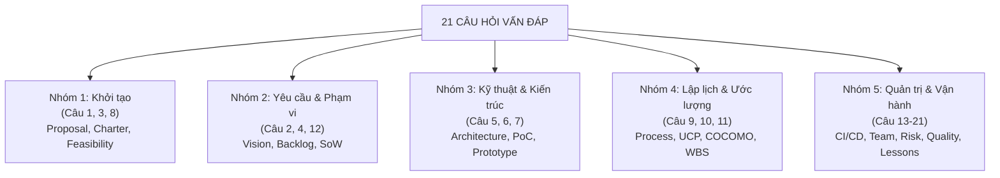

# TÓM TẮT ĐỀ THI VẤN ĐÁP — QUẢN LÝ DỰ ÁN PHẦN MỀM

## Môn học: Quản lý Dự án Phần mềm (Software Project Management)

**Giảng viên:** TS. Ngô Huy Biên — Năm học 2026

---

## TỔNG QUAN ĐỀ THI

- **Hình thức thi:** Vấn đáp cá nhân 1-1 với Giảng viên (kèm giấy viết A4 và bản in tài liệu/giao diện liên quan).
- **Quy mô đề thi:** **21 câu hỏi lớn** bao quát toàn bộ vòng đời quản lý dự án phần mềm từ Khởi tạo, Lập kế hoạch, Ước lượng, Thực thi, CI/CD, Quản trị nhân sự đến Đánh giá chất lượng và Rút ra bài học kinh nghiệm.
- **Thời gian chuẩn bị tại phòng thi:** 10 phút viết ra giấy A4 + 2 phút chọn bản in nộp kèm.
- **Thời gian vấn đáp:** 5 – 10 phút giải thích và trả lời chất vấn của Giảng viên.
- **Thang điểm:** 0 – 10 điểm (Đổi đề bị trừ 2 điểm/lần, tối đa đổi 2 lần).

---

## QUY TẮC BẮT BUỘC KHI CHỈNH SỬA TÀI LIỆU TRONG DOCS

> **QUY TẮC BẢO TOÀN LỊCH SỬ (DOCUMENT REVISION HISTORY):**
>
> 1. Mọi thành viên khi **tạo mới** hoặc **chỉnh sửa** bất kỳ tài liệu nào trong thư mục [`docs/`](../docs/) bắt buộc phải cập nhật bảng **Lịch sử sửa đổi tài liệu (Document Revision History)** ở đầu file (bao gồm: Phiên bản, Ngày, Người thực hiện, Mô tả tóm tắt nội dung thay đổi).
> 2. Ghi nhận dòng nhật ký làm việc (log entry) tương ứng vào file [`docs/03-execution-monitoring/02-project-log.md`](../docs/03-execution-monitoring/02-project-log.md) để đảm bảo tính minh bạch và truy vết của toàn dự án.

---

## MA TRẬN PHÂN LOẠI 21 CÂU HỎI THEO 5 NHÓM CHUYÊN MÔN

---

## BẢNG TỔNG HỢP CHI TIẾT 21 CÂU HỎI & BẢN IN NỘP KÈM

|  Câu   | Chủ đề câu hỏi                                    | Nội dung trọng tâm                                                                                | Bản in nộp kèm từ Repo HCMUS-LDMS & Nhiệm vụ bổ sung                                                                                                          |
| :----: | :------------------------------------------------ | :------------------------------------------------------------------------------------------------ | :------------------------------------------------------------------------------------------------------------------------------------------------------------ |
| **01** | **Đề xuất dự án (Project Proposal)**              | Lý do đầu tư, đối chuẩn đối thủ, phân tích Stakeholders, phương pháp đánh giá đề xuất với AI.     | In [`docs/01-initiation/02-project-proposal.md`](../docs/01-initiation/02-project-proposal.md) (Mục 2 & 3).                                                   |
| **02** | **Viễn cảnh & Phạm vi (Vision & Scope)**          | Quy trình As-Is vs To-Be, so sánh với giải pháp có sẵn, phạm vi MVP vs mở rộng.                   | In [`docs/02-planning/01-vision-and-scope.md`](../docs/02-planning/01-vision-and-scope.md) (Mục 2 & 3).                                                       |
| **03** | **Ủy nhiệm dự án (Project Charter)**              | Mục tiêu SMART, quyền hạn PM, ma trận RACI Stakeholders, ngân sách trần 100M.                     | In [`docs/01-initiation/04-project-charter.md`](../docs/01-initiation/04-project-charter.md) (Mục 3, 5 & 6).                                                  |
| **04** | **Yêu cầu phần mềm (Product Backlog)**            | Cấu trúc Epic/User Story, Acceptance Criteria (AC), Definition of Done (DoD), MoSCoW.             | In [`docs/02-planning/03-product-backlog.md`](../docs/02-planning/03-product-backlog.md) + **In Hướng dẫn sử dụng User Guide**.                               |
| **05** | **Kiến trúc phần mềm (Software Architecture)**    | Tech stack (FastAPI, React, MinIO, Postgres FTS, OCR), 4+1 Views, bảo mật Signed URL DRM.         | In [`docs/02-planning/02-architecture.md`](../docs/02-planning/02-architecture.md) (Sơ đồ kiến trúc & Mục 3).                                                 |
| **06** | **Chứng minh ý tưởng (Proof of Concept - PoC)**   | PoC Pipeline OCR tiếng Việt với Tesseract & Pandoc EPUB, PoC giải bài toán khó nhất.              | In [`docs/02-planning/02-architecture.md`](../docs/02-planning/02-architecture.md) (Mục 5 & 6) + **In log/kết quả chạy PoC**.                                 |
| **07** | **Bản mẫu (Prototype)**                           | Thiết kế UI/UX Editor Split-screen đối soát song song ảnh scan, Reader EPUB reflowable.           | In ảnh chụp giao diện `/documents/:id` (Editor) và `/reader` (Reader) + Phác thảo wireframe.                                                                  |
| **08** | **Báo cáo tính khả thi (Feasibility Study)**      | 5 khía cạnh khả thi: Kỹ thuật, Kinh tế (18.5M/100M), Vận hành, Pháp lý bản quyền, Lịch trình.     | In [`docs/01-initiation/03-feasibility-study.md`](../docs/01-initiation/03-feasibility-study.md).                                                             |
| **09** | **Định nghĩa quy trình phát triển (Process)**     | Mô hình Agile/Kanban Spec-Driven theo Epic, WIP Limit = 1, gating review PR.                      | In [`docs/02-planning/06-software-process-definition.md`](../docs/02-planning/06-software-process-definition.md).                                             |
| **10** | **Ước lượng dự án (Project Estimate)**            | Top-Down (Use Case Points - AUCP 126 điểm) và Bottom-Up (COCOMO II 10.4 PM, 3.5 KLOC).            | In [`10-project-estimate.md`](./preparation/4_Estimation_Planning_Process/printouts/10-project-estimate.md).                                                  |
| **11** | **Kế hoạch dự án (Project Plan)**                 | Phân rã WBS (6 Work Packages), lộ trình 4 giai đoạn, đường găng WP4 (Số hóa).                     | In [`11-project-plan-wbs.md`](./preparation/4_Estimation_Planning_Process/printouts/11-project-plan-wbs.md).                                                  |
| **12** | **Phát biểu công việc (Statement of Work - SoW)** | Ràng buộc Scope–Feature–Resource, ngân sách thống nhất, cơ chế quản lý thay đổi CR.               | In [`docs/02-planning/05-statement-of-work.md`](../docs/02-planning/05-statement-of-work.md) (Mục 3, 7 & 10).                                                 |
| **13** | **Tích hợp liên tục (Continuous Integration)**    | Luồng GitFlow (`feature/*` → `develop` → `main`), linting (ruff, eslint), automated test pytest.  | In Sơ đồ CI, Kịch bản build script, thông báo build và **Hướng dẫn cài đặt môi trường cho Dev**.                                                              |
| **14** | **Chuyển giao liên tục (Continuous Delivery)**    | Đóng gói Docker Compose production profile (`prod`), reverse proxy Nginx TLS 1.3, release tag.    | In Sơ đồ CD, file `docker-compose.yml`, migration script và **Hướng dẫn triển khai cho Kỹ sư vận hành**.                                                      |
| **15** | **Mô hình DevOps**                                | Vòng lặp DevOps (Code → Test → Package → Deploy → Monitor), MinIO Console, pg_dump backup.        | In Sơ đồ DevOps, cây thư mục quản lý hạ tầng và script backup (`scripts/backup-*.sh`).                                                                        |
| **16** | **Quản lý con người & Phát triển nhóm**           | Triết lý Lý thuyết Y (Douglas McGregor), 5 giai đoạn Tuckman, văn hóa tự giác & tôn trọng.        | In [`docs/01-initiation/05-team-contract.md`](../docs/01-initiation/05-team-contract.md) + **Ảnh nhóm, Biên bản họp, Log chat**.                              |
| **17** | **Phân công, theo dõi & kiểm soát công việc**     | Nhật ký hoàn thành Story, đo lường 730K token AI, theo dõi throughput, xử lý blocker.             | In [`docs/03-execution-monitoring/02-project-log.md`](../docs/03-execution-monitoring/02-project-log.md) + **Burndown Chart**.                                |
| **18** | **Quản lý rủi ro (Risk Management Plan)**         | Ma trận xác suất / tác động (P×I), rủi ro bản quyền, rủi ro OCR tiếng Việt, phương án giảm thiểu. | In Kế hoạch quản lý rủi ro (Risk Management Plan).                                                                                                            |
| **19** | **Quản lý chất lượng (Quality Management Plan)**  | Tiêu chuẩn DoD 5 mục, QA/QC, test coverage, chỉ số chất lượng OCR (CER < 5%).                     | In Kế hoạch chất lượng, Tiêu chuẩn DoD, **Biên bản thanh tra code (Code Inspection) & Nghiệm thu UAT**.                                                       |
| **20** | **Kế hoạch kiểm thử (Test Plan)**                 | Unit test API (pytest), Integration test, Component UI test, Smoke test curl commands.            | In Kế hoạch kiểm thử (Test Plan), Báo cáo kết quả chạy `pytest` và biên bản phản hồi khách hàng.                                                              |
| **21** | **Bài học kinh nghiệm (Lessons Learned)**         | Bài học về Prompt Spec-driven, quản lý token AI, tối ưu hóa tech stack, cải tiến quy trình.       | In Báo cáo bài học kinh nghiệm (Lessons Learned Register) & [`03-ai-development-workflow.md`](../docs/03-execution-monitoring/03-ai-development-workflow.md). |

---

## 4 CÂU HỎI VÀNG CẦN TRẢ LỜI CHO MỌI CÂU HỎI VẤN ĐÁP

Giảng viên sẽ đánh giá dựa trên khả năng trả lời gãy gọn 4 khía cạnh cốt lõi:

1. **WHAT (Khái niệm & Định nghĩa):** Đây là tài liệu / quy trình / mô hình gì? Có cấu trúc ra sao?
2. **HOW (Cách làm & Các bước thực hiện):** Nhóm đã thực hiện những bước nào để tạo ra sản phẩm này? Công cụ và kỹ thuật nào đã dùng?
3. **WHY (Lý do & Giá trị mang lại):** Tại sao nhóm lại chọn cách này thay vì cách khác? Thuận lợi và thách thức là gì?
4. **EVIDENCE & NUMBERS (Minh chứng & Số liệu thực tế):** Chỉ rõ số liệu, biểu đồ, bảng biểu hoặc dẫn chứng cụ thể trong dự án HCMUS-LDMS để chứng minh (không nói lý thuyết suông).
