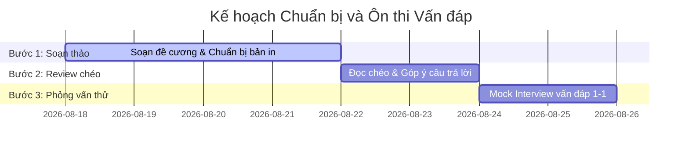

# KẾ HOẠCH PHÂN CHIA CHUẨN BỊ ÔN THI VẤN ĐÁP
## Môn học: Quản lý Dự án Phần mềm — Dự án HCMUS-LDMS

Tài liệu này chi tiết hóa việc phân chia công việc chuẩn bị cho nhóm **6 người** ôn thi vấn đáp môn Quản lý Dự án Phần mềm dựa trên [Tóm tắt đề thi vấn đáp](./01_Final_Exam_Summary.md) và [Bộ câu hỏi gốc](./Final%20Exam%20Questions%20-%20Software%20Project%20Management.md).

---

## DANH SÁCH PHÂN CHIA CÔNG VIỆC CHO 6 THÀNH VIÊN

| Thành viên | Chủ đề phụ trách | Phạm vi câu hỏi | Nội dung & Trọng tâm cần chuẩn bị | Thư mục chi tiết |
| :--- | :--- | :---: | :--- | :---: |
| **Người 1** | **Khởi tạo, Khả thi & Điều lệ Dự án** | **Câu 1, 3, 8** | Lý do đầu tư đề xuất, phân tích đối chuẩn, Stakeholders RACI, 5 khía cạnh tính khả thi. | [Xem chi tiết](./preparation/1_Initiation_Charter_Feasibility/README.md) |
| **Người 2** | **Yêu cầu Nghiệp vụ, Phạm vi & SoW** | **Câu 2, 4, 12** | Quy trình As-Is vs To-Be, cấu trúc Product Backlog (26 User Stories), Acceptance Criteria, Hợp đồng SoW. | [Xem chi tiết](./preparation/2_Requirements_Scope_SoW/README.md) |
| **Người 3** | **Kiến trúc, PoC & Bản mẫu Prototype** | **Câu 5, 6, 7** | Kiến trúc 4+1 Views, tech stack (FastAPI, React, MinIO), PoC giải bài toán khó OCR/DRM, Prototype Editor & Reader. | [Xem chi tiết](./preparation/3_Architecture_PoC_Prototype/README.md) |
| **Người 4** | **Ước lượng, Lập kế hoạch & Quy trình** | **Câu 9, 10, 11** | Quy trình Agile/Kanban Spec-driven, Ước lượng Top-down UCP (126 điểm) & Bottom-up COCOMO II (10.4 PM), WBS và Lộ trình đường găng. | [Xem chi tiết](./preparation/4_Estimation_Planning_Process/README.md) |
| **Người 5** | **CI/CD, DevOps & Kế hoạch Kiểm thử** | **Câu 13, 14, 15, 20** | Mô hình CI/CD GitFlow, Docker Compose Profile `prod`, Vòng lặp DevOps, Kế hoạch kiểm thử (Unit test pytest, Integration test). | [Xem chi tiết](./preparation/5_CICD_DevOps_Testing/README.md) |
| **Người 6** | **Quản trị Nhân sự, Giám sát, Rủi ro & Bài học** | **Câu 16, 17, 18, 19, 21** | Lý thuyết Y (Douglas McGregor), Giám sát tiến độ & tiêu thụ token AI (730K token), Quản lý rủi ro, Tiêu chuẩn chất lượng DoD, Bài học kinh nghiệm. | [Xem chi tiết](./preparation/6_Team_Monitoring_Risk_Lessons/README.md) |

---

## QUY ĐỊNH BẮT BUỘC ĐỐI VỚI MỖI CÂU HỎI

Để đảm bảo đạt điểm tối đa (**8 – 10 điểm**) khi thi vấn đáp, mỗi thành viên khi chuẩn bị phần của mình **bắt buộc** phải tuân thủ các yêu cầu sau:

### 1. Chuẩn bị Bản in kèm theo (Artifact Printouts)
- Đề thi quy định sinh viên được mang **bản in tài liệu liên quan** vào phòng thi và nộp kèm bài viết A4.
- Mỗi thành viên **phải in sẵn ra giấy A4** các tài liệu/sơ đồ thuộc các câu hỏi mình phụ trách (xem cột bản in trong [01_Final_Exam_Summary.md](./01_Final_Exam_Summary.md)).
- Đánh số câu hỏi to, rõ ràng lên góc trên bên phải của từng bản in để trong 2 phút chọn bản in tại phòng thi có thể lấy ngay lập tức mà không bị nhầm lẫn.

### 2. Soạn dàn ý trả lời theo khung 4 câu hỏi (WHAT - HOW - WHY - EVIDENCE)
- **WHAT:** Nêu định nghĩa ngắn gọn, cấu trúc chuẩn của tài liệu/mô hình theo kiến thức lý thuyết đã học.
- **HOW:** Trình bày các bước thực tế nhóm đã làm (Bước 1 $\rightarrow$ Bước 2 $\rightarrow$ Bước 3) và các công cụ hỗ trợ (Claude, Antigravity, Docker, Miro...).
- **WHY:** Giải thích tại sao chọn phương án này, so sánh ưu/nhược điểm với các phương án thay thế khác.
- **EVIDENCE:** Trích dẫn chính xác số liệu, tên bảng, hình vẽ trong dự án HCMUS-LDMS để chứng minh.

### 3. Nắm chắc danh sách "Các câu hỏi thường gặp" (FAQ)
- Đọc kỹ toàn bộ các câu hỏi phụ đi kèm trong [Final Exam Questions - Software Project Management.md](./Final%20Exam%20Questions%20-%20Software%20Project%20Management.md) cho từng câu mình phụ trách.
- Chuẩn bị sẵn câu trả lời súc tích (1–2 phút/câu phụ) để khi Giảng viên hỏi xoáy đáp xoay có thể phản xạ ngay lập tức.

---

## LỘ TRÌNH VÀ KẾ HOẠCH ÔN TẬP NHÓM (3 BƯỚC)

- **Bước 1 — Soạn thảo đề cương cá nhân & In tài liệu:** Mỗi người tự hoàn thiện file `README.md` trong thư mục `preparation/` của mình và in toàn bộ tài liệu liên quan.
- **Bước 2 — Review chéo:** Các cặp thành viên đọc chéo đề cương của nhau để phát hiện các lỗ hổng kiến thức hoặc số liệu chưa khớp.
- **Bước 3 — Mock Interview:** Nhóm tổ chức 1 buổi họp Online/Offline mô phỏng đúng quy trình thi (10 phút viết ra giấy A4 + Giảng viên hỏi xoáy 5-10 phút).
