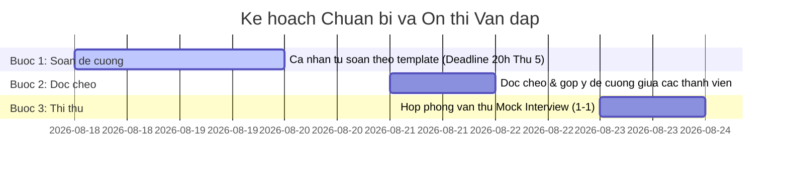

# KẾ HOẠCH PHÂN CHIA CHUẨN BỊ ÔN THI VẤN ĐÁP

## Môn học: Quản lý Dự án Phần mềm — Dự án HCMUS-LDMS

Tài liệu này chi tiết hóa việc phân chia công việc chuẩn bị cho nhóm **6 người** ôn thi vấn đáp môn Quản lý Dự án Phần mềm dựa trên [Tóm tắt đề thi vấn đáp](./01_Final_Exam_Summary.md) và [Bộ câu hỏi gốc](./Final%20Exam%20Questions%20-%20Software%20Project%20Management.md).

---

## MỐC THỜI GIAN VÀ DEADLINE QUAN TRỌNG

- **Hạn chót hoàn thành soạn đề cương cá nhân (Bước 1):** **20:00, Thứ Năm (20/08/2026)**
- **Hạn chót đọc chéo và góp ý (Bước 2):** 20:00, Thứ Bảy (22/08/2026)
- **Họp phỏng vấn thử Mock Interview (Bước 3):** Chủ Nhật (23/08/2026)

---

## QUY ĐỊNH BẮT BUỘC KHI CHỈNH SỬA TÀI LIỆU TRONG DOCS

> **QUY TẮC BẢO TOÀN LỊCH SỬ (DOCUMENT REVISION HISTORY):**
> Khi bất kỳ thành viên nào tiến hành **tạo mới** hoặc **chỉnh sửa bổ sung** nội dung tài liệu trong thư mục [`docs/`](../docs/):
>
> 1. **Bắt buộc phải cập nhật bảng Lịch sử sửa đổi (Document Revision History)** ở ngay đầu file markdown đó (gồm: Version, Ngày sửa, Tác giả thực hiện, Nội dung tóm tắt).
> 2. **Bắt buộc phải ghi 1 dòng log công việc** vào file [`docs/03-execution-monitoring/02-project-log.md`](../docs/03-execution-monitoring/02-project-log.md) để lưu lại thời gian và số lượng token/nỗ lực đã sử dụng.

---

## DANH SÁCH PHÂN CHIA CÔNG VIỆC VÀ TÀI LIỆU CẦN TỰ CHUẨN BỊ CHO 6 THÀNH VIÊN

| Thành viên                                    | Chủ đề phụ trách                                 |      Phạm vi câu hỏi       | Tài liệu đã có sẵn trong `docs/`                                                                   | Nhiệm vụ & Tài liệu cần tự chuẩn bị bổ sung                                                                                                                                                                                                                              |                             Thư mục chi tiết                             |
| :-------------------------------------------- | :----------------------------------------------- | :------------------------: | :------------------------------------------------------------------------------------------------- | :----------------------------------------------------------------------------------------------------------------------------------------------------------------------------------------------------------------------------------------------------------------------- | :----------------------------------------------------------------------: |
| **Người 1:** Nguyễn Quang Thái (23127116)     | **Khởi tạo, Khả thi & Điều lệ Dự án**            |      **Câu 1, 3, 8**       | `01-project-idea.md`, `02-project-proposal.md`, `03-feasibility-study.md`, `04-project-charter.md` | In bản in Proposal, Charter, Feasibility Study; tự soạn dàn ý 100% câu hỏi phụ.                                                                                                                                                                                          | [Xem chi tiết](./preparation/1_Initiation_Charter_Feasibility/README.md) |
| **Người 2:** Ngô Nguyễn Thế Khoa (23127065)   | **Yêu cầu Nghiệp vụ, Phạm vi & SoW**             |      **Câu 2, 4, 12**      | `01-vision-and-scope.md`, `03-product-backlog.md`, `05-statement-of-work.md`                       | Soạn bổ sung tài liệu **Hướng dẫn sử dụng hệ thống (User Guide)** (`04-user-guide.md`) phục vụ Câu 4; chuẩn bị bản in SoW.                                                                                                                                               |     [Xem chi tiết](./preparation/2_Requirements_Scope_SoW/README.md)     |
| **Người 3:** Nguyễn Lê Hồ Anh Khoa (23127211) | **Kiến trúc, PoC & Bản mẫu Prototype**           |      **Câu 5, 6, 7**       | `02-architecture.md`, mã nguồn frontend/backend, sơ đồ `system_architecture.svg`                   | Chuẩn bị **Bản in giao diện/log chạy mã nguồn PoC** (Câu 6) và **Bản in phác thảo giao diện Wireframe ban đầu** (Câu 7).                                                                                                                                                 |   [Xem chi tiết](./preparation/3_Architecture_PoC_Prototype/README.md)   |
| **Người 4:** Ân Tiến Nguyên An (23127148)     | **Ước lượng, Lập kế hoạch & Quy trình**          |     **Câu 9, 10, 11**      | `04-cost-time-resource.md` (UCP & COCOMO), `01-sprint-plan.md`, `03-product-backlog.md`            | Chuẩn bị **Bản in tài liệu Quy trình phát triển phần mềm độc lập** (Câu 9); in bảng tính UCP và sơ đồ WBS đường găng WP4.                                                                                                                                                |  [Xem chi tiết](./preparation/4_Estimation_Planning_Process/README.md)   |
| **Người 5:** Nguyễn Tuấn Anh (23127152)       | **CI/CD, DevOps & Kế hoạch Kiểm thử**            |   **Câu 13, 14, 15, 20**   | `02-architecture.md`, `scripts/run-prod.sh`, `docker-compose.prod.yml`, test suite `src/backend/tests/` | Dùng script **Deploy Manual** có sẵn (`scripts/run-prod.sh`); (tuỳ chọn) CD tự động `.github/workflows/cd.yml`; Soạn **Hướng dẫn Dev & Ops** + **Test Plan**; Chuẩn bị ảnh chụp email/notification CI. |      [Xem chi tiết](./preparation/5_CICD_DevOps_Testing/README.md)       |
| **Người 6:** Mạch Quốc Tấn (23127115)         | **Quản trị Nhân sự, Giám sát, Rủi ro & Bài học** | **Câu 16, 17, 18, 19, 21** | `05-team-contract.md`, `02-project-log.md`, `03-ai-development-workflow.md`                        | Soạn tài liệu **Kế hoạch Quản lý Rủi ro** (Câu 18), **Kế hoạch Quản lý Chất lượng** (Câu 19), **Báo cáo Bài học Kinh nghiệm** (Câu 21); Chuẩn bị ảnh nhóm & biên bản họp.                                                                                                |  [Xem chi tiết](./preparation/6_Team_Monitoring_Risk_Lessons/README.md)  |

---

## QUY ĐỊNH BẮT BUỘC ĐỐI VỚI MỖI THÀNH VIÊN KHI HOÀN THIỆN ĐỀ CƯƠNG

Để đảm bảo đạt điểm tối đa (**8 – 10 điểm**) khi thi vấn đáp, mỗi thành viên khi chuẩn bị phần của mình **bắt buộc** phải tuân thủ các yêu cầu sau:

### 1. Chuẩn bị Bản in kèm theo (Artifact Printouts)

- Đề thi quy định sinh viên được mang **bản in tài liệu liên quan** vào phòng thi và nộp kèm bài viết A4.
- Mỗi thành viên **phải in sẵn ra giấy A4** các tài liệu/sơ đồ thuộc các câu hỏi mình phụ trách.
- Đánh số câu hỏi to, rõ ràng lên góc trên bên phải của từng bản in để trong 2 phút chọn bản in tại phòng thi có thể lấy ngay lập tức mà không bị nhầm lẫn.

### 2. Soạn dàn ý trả lời theo khung 4 câu hỏi (WHAT - HOW - WHY - EVIDENCE)

- **WHAT:** Nêu định nghĩa ngắn gọn, cấu trúc chuẩn của tài liệu/mô hình theo kiến thức lý thuyết đã học.
- **HOW:** Trình bày các bước thực tế nhóm đã làm (Bước 1 $\rightarrow$ Bước 2 $\rightarrow$ Bước 3) và các công cụ hỗ trợ (Claude, Antigravity, Docker, Miro...).
- **WHY:** Giải thích tại sao chọn phương án này, so sánh ưu/nhược điểm với các phương án thay thế khác.
- **EVIDENCE:** Trích dẫn chính xác số liệu, tên bảng, hình vẽ trong dự án HCMUS-LDMS để chứng minh (không nói lý thuyết suông).

### 3. Nắm chắc danh sách "Các câu hỏi thường gặp" (FAQ)

- Đọc kỹ toàn bộ các câu hỏi phụ đi kèm trong [Final Exam Questions - Software Project Management.md](./Final%20Exam%20Questions%20-%20Software%20Project%20Management.md) cho từng câu mình phụ trách.
- Tự hoàn thiện câu trả lời vào các mục `_Trả lời:_` trong file đề cương trước **20:00, Thứ Năm (20/08/2026)**.

### 4. Tham chiếu Lý thuyết từ Bài giảng (materials/)

- Mỗi phiếu bài làm đã liệt kê các file lý thuyết tương ứng trong thư mục [`materials/`](../materials/). Khi soạn câu trả lời, **bắt buộc phải đọc lại lý thuyết** trước khi viết, đặc biệt các câu hỏi mang tính khái niệm (WHAT) và lý do (WHY).
- Đề thi nhấn mạnh sinh viên cần **"tập trung vào các kiến thức lý thuyết đã học, các bài thực hành đã làm"** -- tức phải kết hợp cả lý thuyết (`materials/`) lẫn thực hành (`docs/`).

### 5. Chiến lược Tối ưu 10 Phút Viết Giấy A4

Giảng viên cho **10 phút** viết trên giấy A4 trước khi vấn đáp. Đây là chiến lược phân bổ thời gian tối ưu:

| Thời gian | Hoạt động                                                                                                                                    | Mục đích                                |
| :-------: | :------------------------------------------------------------------------------------------------------------------------------------------- | :-------------------------------------- |
| Phút 1-2  | Viết tiêu đề câu hỏi + Dàn ý 4 mục: WHAT - HOW - WHY - EVIDENCE                                                                              | Tạo khung sườn rõ ràng, tránh lan man   |
| Phút 3-7  | Triển khai mỗi mục 3-4 dòng ngắn gọn. Ưu tiên **HOW** (các bước nhóm đã làm thực tế) và **EVIDENCE** (số liệu, tên file, tên công cụ cụ thể) | GV đánh giá cao kinh nghiệm thực tế     |
| Phút 8-9  | Vẽ 1 sơ đồ nhỏ minh họa (flowchart, bảng so sánh, hoặc ma trận)                                                                              | Sơ đồ giúp giải thích nhanh khi vấn đáp |
|  Phút 10  | Rà soát lại, bổ sung từ khóa quan trọng còn thiếu                                                                                            | Đảm bảo không sót ý chính               |

### 6. Đọc chéo Liên kết giữa các Thành viên

- Mỗi phiếu bài làm đã ghi rõ nên đọc thêm phần của ai. Việc đọc chéo giúp bạn không bị bất ngờ nếu GV hỏi chéo sang chủ đề liên quan.

### 7. Tham chiếu Ghi chú Bài giảng Thực chiến trên Lớp (`note.md`)

- Trong suốt quá trình soạn câu trả lời, các thành viên **bắt buộc đối chiếu thêm file [`note.md`](../note.md)** để đưa vào câu trả lời những ý đắt giá mà Giảng viên đã trực tiếp lưu ý trên lớp:
  - _Phong cách trình bày:_ Trình bày chi tiết theo dạng **câu chuyện tự sự (storytelling)**, có mở đầu - diễn biến - kết thúc, dẫn chứng người thật việc thật (gặp cô thủ thư, 40% tài liệu hư hỏng, 15km khoảng cách 2 cơ sở).
  - _Dẫn chứng số liệu:_ Nhắc đến code, tài liệu phải có số liệu đo lường cụ thể (14h05m thực tế, 730K tokens AI, 350K chi phí, 126 UCP, 10.4 PM COCOMO II).
  - _Không nói lý thuyết suông:_ Phải giải thích được **TẠI SAO** nhóm chọn phương án đó thay vì các phương án khác.

---

## LỘ TRÌNH VÀ KẾ HOẠCH ÔN TẬP NHÓM (3 BƯỚC)

