# TỔNG HỢP 21 CÂU HỎI VÀ CÂU TRẢ LỜI

## Thi vấn đáp cuối kỳ — Quản lý Dự án Phần mềm

**Giảng viên:** TS. Ngô Huy Biên — 2026  
**Dự án nhóm:** Hệ thống Quản lý và Số hóa Tài liệu Thư viện HCMUS (HCMUS-LDMS)

Tài liệu này trích nguyên đề bài từng câu trong [Final Exam Questions - Software Project Management.md](<../docs.1/Final Exam Questions - Software Project Management.md>), rồi ghép câu trả lời đã soạn theo khung **WHAT — HOW — WHY — EVIDENCE** và bộ FAQ.

Nguồn câu trả lời:

|        Câu         | Người soạn                       | Phiếu gốc                                                                         |
| :----------------: | :------------------------------- | :-------------------------------------------------------------------------------- |
|      1, 3, 8       | Nguyễn Quang Thái (23127116)     | [preparation/1](../docs.1/preparation/1_Initiation_Charter_Feasibility/README.md) |
|      2, 4, 12      | Ngô Nguyễn Thế Khoa (23127065)   | [preparation/2](../docs.1/preparation/2_Requirements_Scope_SoW/README.md)         |
|      5, 6, 7       | Nguyễn Lê Hồ Anh Khoa (23127211) | [preparation/3](../docs.1/preparation/3_Architecture_PoC_Prototype/README.md)     |
|     9, 10, 11      | Ân Tiến Nguyên An (23127048)     | [preparation/4](../docs.1/preparation/4_Estimation_Planning_Process/README.md)    |
|   13, 14, 15, 20   | Nguyễn Tuấn Anh (23127152)       | [preparation/5](../docs.1/preparation/5_CICD_DevOps_Testing/README.md)            |
| 16, 17, 18, 19, 21 | Mạch Quốc Tấn (23127115)         | [preparation/6](../docs.1/preparation/6_Team_Monitoring_Risk_Lessons/README.md)   |

### Mục lục

- [Câu 1. Đề xuất dự án](#câu-1-đề-xuất-dự-án-project-proposal)
- [Câu 2. Viễn cảnh và phạm vi dự án](#câu-2-viễn-cảnh-và-phạm-vi-dự-án-project-vision-and-scope)
- [Câu 3. Ủy nhiệm dự án](#câu-3-ủy-nhiệm-dự-án-project-charter)
- [Câu 4. Yêu cầu phần mềm](#câu-4-yêu-cầu-phần-mềm-software-requirements--product-backlog)
- [Câu 5. Kiến trúc phần mềm](#câu-5-kiến-trúc-phần-mềm-software-architecture)
- [Câu 6. Chứng minh ý tưởng](#câu-6-chứng-minh-ý-tưởng-proof-of-concept)
- [Câu 7. Bản mẫu](#câu-7-bản-mẫu-prototype)
- [Câu 8. Báo cáo tính khả thi](#câu-8-báo-cáo-tính-khả-thi-feasibility-study-report)
- [Câu 9. Định nghĩa quy trình phát triển phần mềm](#câu-9-định-nghĩa-quy-trình-phát-triển-phần-mềm-software-process-definition)
- [Câu 10. Ước lượng dự án](#câu-10-ước-lượng-dự-án-project-estimate)
- [Câu 11. Kế hoạch dự án](#câu-11-kế-hoạch-dự-án-project-plan)
- [Câu 12. Phát biểu công việc](#câu-12-phát-biểu-công-việc-statement-of-work)
- [Câu 13. Mô hình tích hợp liên tục](#câu-13-mô-hình-tích-hợp-liên-tục-continuous-integration)
- [Câu 14. Mô hình chuyển giao liên tục](#câu-14-mô-hình-chuyển-giao-liên-tục-continuous-delivery)
- [Câu 15. Mô hình DevOps](#câu-15-mô-hình-devops)
- [Câu 16. Quản lý con người và phát triển nhóm](#câu-16-quản-lý-con-người-và-phát-triển-nhóm)
- [Câu 17. Phân công, theo dõi, đánh giá, kiểm soát công việc](#câu-17-phân-công-theo-dõi-đánh-giá-kiểm-soát-công-việc-và-báo-cáo-tình-trạng-dự-án)
- [Câu 18. Kế hoạch quản lý rủi ro](#câu-18-kế-hoạch-quản-lý-rủi-ro-software-risk-management-plan)
- [Câu 19. Kế hoạch quản lý chất lượng](#câu-19-kế-hoạch-quản-lý-chất-lượng-software-quality-management-plan)
- [Câu 20. Kế hoạch kiểm thử](#câu-20-kế-hoạch-kiểm-thử-test-plan)
- [Câu 21. Báo cáo bài học kinh nghiệm](#câu-21-báo-cáo-bài-học-kinh-nghiệm-lessons-learned-register)

---

## Câu 1. Đề xuất dự án (Project Proposal)

### Đề bài

Trình bày quá trình hình thành và phương pháp đánh giá tài liệu Đề xuất dự án (Project Proposal) của nhóm. _(Sinh viên nộp kèm bản in tài liệu Đề xuất dự án của nhóm.)_

**Các câu hỏi thường gặp:**

- Các câu hỏi chính cần trả lời trong tài liệu Đề xuất dự án là gì?
- Các đầu vào cần thiết và các bước nhóm đã thực hiện để tạo tài liệu Đề xuất dự án là gì?
- Dựa vào những dữ liệu nào mà bản đề xuất được hình thành?
- Các sản phẩm cạnh tranh trực tiếp với đề xuất là gì?
- Tài liệu Đề xuất dự án của nhóm đã được đánh giá thế nào?
- Tại sao cần tạo tài liệu Đề xuất dự án?
- Tài liệu Đề xuất dự án của nhóm đã được sử dụng và cập nhật trong quá trình thực hiện dự án như thế nào?
- Dự án phần mềm là gì?
- Phân biệt dự án (project) với hoạt động (operation), với chương trình (program), và với danh sách đầu tư (portfolio).
- Dự án phần mềm đến từ đâu?
- Phạm vi dự án là gì?
- Các vai trò nào thường tham gia vào một dự án phần mềm?
- Phân biệt các loại kết quả của một dự án.
- Phân tích các nguyên nhân chính khiến một dự án phần mềm thất bại.
- Các ràng buộc của một dự án có ý nghĩa gì?

### Câu trả lời

#### WHAT — Project Proposal là gì?

Project Proposal là tài liệu trình bày lý do nên đầu tư vào một dự án và cung cấp đủ thông tin cấp cao để Sponsor quyết định tiếp tục thẩm định, phê duyệt có điều kiện hoặc dừng ý tưởng. Proposal của HCMUS-LDMS trả lời: vấn đề thực tế là gì; ai bị ảnh hưởng; giải pháp được đề xuất là gì; giải pháp khác gì các phương án thay thế; lợi ích, chi phí, thời gian và rủi ro cấp cao ra sao; ai cần tham gia; bước tiếp theo là gì.

#### HOW — Nhóm hình thành và đánh giá Proposal như thế nào?

1. **Nhận diện vấn đề:** tài liệu giấy xuống cấp, kho Quận 5 quá tải, sinh viên cơ sở Thủ Đức khó tiếp cận, PDF scan khó đọc trên điện thoại.
2. **Xây dựng góc nhìn người dùng:** hành trình của sinh viên Nguyễn Văn Linh và thủ thư Mai — biến pain point thành nhu cầu nghiệp vụ.
3. **Hình thành giải pháp:** Scan → Tesseract OCR → hiệu chỉnh Split-screen → đóng gói EPUB 3.0 → PostgreSQL FTS → Web Reader bảo mật.
4. **Đối chuẩn:** so sánh với Lạc Việt Vebrary, DSpace và chuỗi Abbyy + Calibre + Drive.
5. **Phân tích giá trị và khả năng thực hiện:** lợi ích định lượng/định tính, stakeholders, lộ trình 20 tuần, rủi ro bản quyền/OCR/rò rỉ tệp/quá tải nguồn lực.
6. **Phản biện và cập nhật:** checklist bài giảng, phản biện người và AI; đối chiếu với Feasibility Study và Charter. Proposal đi từ v1.0 đến v6.0, trạng thái vẫn `Under Review`.

#### WHY — Tại sao cần Proposal?

- Chứng minh dự án giải quyết vấn đề có thật, không chỉ liệt kê tính năng.
- Cho Sponsor so sánh lợi ích với chi phí, rủi ro và giải pháp có sẵn trước khi cấp nguồn lực.
- Tạo hiểu biết chung giữa Thư viện, Phòng CNTT, Ban Giám hiệu, Pháp chế và người dùng.
- Là đầu vào cấp cao cho Feasibility Study, Vision & Scope, Project Charter.
- Cho phép loại bỏ hoặc thu hẹp ý tưởng sớm, khi chi phí thay đổi còn thấp.

#### EVIDENCE — Minh chứng HCMUS-LDMS

| Nhóm minh chứng | Dữ kiện                                                                                      |
| :-------------- | :------------------------------------------------------------------------------------------- |
| Pain point      | Kho Quận 5 quá tải; tài liệu cũ xuống cấp; khoảng cách hai cơ sở; PDF scan không reflow      |
| Giải pháp       | Scan-to-EPUB khép kín, Tesseract OCR, Split-screen Editor, PostgreSQL FTS, MinIO, Web Reader |
| KPI kỹ thuật    | OCR tối thiểu 85%; tìm kiếm toàn văn dưới 3 giây; Signed URL hết hạn sau 15 phút             |
| Đối chuẩn       | Lạc Việt Vebrary, DSpace, Abbyy + Calibre + Drive                                            |
| Lợi thế         | Nội dung độc quyền, switching cost, network effect, lợi thế chi phí và data MOAT             |
| Lịch sử         | 6 phiên bản từ 06/07 đến 23/07/2026; đồng bộ PostgreSQL FTS và bổ sung đối chuẩn             |

### Trả lời các câu hỏi thường gặp

**1. Các câu hỏi chính cần trả lời trong Project Proposal là gì?**

Tại sao dự án cần tồn tại; vấn đề và đối tượng chịu ảnh hưởng; giải pháp và deliverables cấp cao; phạm vi loại trừ; giải pháp thay thế/đối thủ; giá trị khác biệt và MOAT; chi phí, lợi ích, thời gian, nguồn lực và rủi ro cấp cao; stakeholder; người xem xét/phê duyệt; khuyến nghị hành động tiếp theo.

**2. Đầu vào và các bước nhóm thực hiện để tạo Proposal là gì?**

Đầu vào: Project Idea, pain point độc giả/thủ thư, nhu cầu chuyển đổi số, hạ tầng và năng lực đội ngũ, giải pháp cạnh tranh, yêu cầu bảo mật/bản quyền, công nghệ khả dụng. Các bước: thu thập bối cảnh → dựng persona và hành trình As-is → đề xuất To-be → đối chuẩn → phân tích chi phí/lợi ích và stakeholder → nhận diện rủi ro → phản biện → cập nhật revision.

**3. Proposal được hình thành dựa trên dữ liệu nào?**

Hiện trạng kho và tài liệu; persona Linh/Mai; yêu cầu đọc responsive và tìm kiếm toàn văn; năng lực Phòng CNTT và Thư viện; benchmark ba nhóm giải pháp; KPI OCR, tốc độ tìm kiếm và bảo mật; revision history của Project Idea, Proposal, Feasibility và Charter. Con số khảo sát 92% chỉ xuất hiện trong Feasibility Study, chưa có tệp dữ liệu gốc — khi trình bày phải nói “báo cáo ghi nhận 92%”.

**4. Sản phẩm cạnh tranh trực tiếp với đề xuất là gì?**

- **Lạc Việt Vebrary:** giải pháp thương mại, chi phí bản quyền và tùy biến cao.
- **DSpace:** kho lưu trữ học thuật mã nguồn mở, mạnh repository nhưng không có OCR-to-EPUB và Split-screen.
- **Abbyy + Calibre + Drive:** chuỗi công cụ rời, quy trình thủ công, khó kiểm soát phiên bản và bảo mật.

HCMUS-LDMS khác ở quy trình khép kín, nội dung độc quyền HCMUS, tìm kiếm toàn văn, định danh nội bộ và quyền truy cập có thời hạn.

**5. Proposal của nhóm đã được đánh giá thế nào?**

Bốn lớp: tính đúng của vấn đề/pain point; đối chuẩn giải pháp thay thế; phân tích giá trị, chi phí và rủi ro; tính nhất quán với Feasibility và Charter. Revision History chứng minh sáu phiên bản. Chưa có phiếu chấm, biên bản phê duyệt hoặc chữ ký; trạng thái vẫn `Under Review`.

**6. Tại sao cần tạo Project Proposal?**

Chuyển ý tưởng thành business case có thể thẩm định. Ngăn nhóm đầu tư vào vấn đề giả, giải pháp trùng lặp hoặc phương án vượt khả năng. Tạo căn cứ để Sponsor cho phép Feasibility Study và chuẩn bị Charter.

**7. Proposal đã được sử dụng và cập nhật như thế nào?**

Cung cấp bối cảnh, pain point, benchmark, giải pháp, stakeholder, rủi ro và lộ trình cho Feasibility và Charter. Cập nhật v1.0–v6.0: chuẩn hóa cấu trúc, bổ sung MOAT và stakeholder, đồng bộ Google OAuth 2.0/PostgreSQL FTS, bổ sung benchmark. Khi chốt hạ tầng, còn phải sửa các đoạn Cloud VPS cho thống nhất với VMware on-premise.

**8. Dự án phần mềm là gì?**

Dự án là nỗ lực tạm thời nhằm tạo ra sản phẩm, dịch vụ hoặc kết quả duy nhất. Dự án phần mềm áp dụng đặc điểm đó vào việc xây dựng hoặc thay đổi hệ thống phần mềm: có mục tiêu, phạm vi, ngân sách, nguồn lực, lịch trình, rủi ro và thời điểm kết thúc. HCMUS-LDMS là dự án vì có sản phẩm độc nhất, kế hoạch 20 tuần và kết thúc bằng nghiệm thu/bàn giao; vận hành thư viện số sau bàn giao là operation.

**9. Phân biệt Project, Operation, Program và Portfolio**

| Khái niệm | Đặc điểm                                                | Ví dụ HCMUS-LDMS                                           |
| :-------- | :------------------------------------------------------ | :--------------------------------------------------------- |
| Project   | Tạm thời, tạo kết quả duy nhất                          | Xây dựng và bàn giao HCMUS-LDMS                            |
| Operation | Liên tục, lặp lại để duy trì hoạt động                  | Thủ thư vận hành, cập nhật và hỗ trợ hệ thống hằng ngày    |
| Program   | Nhóm dự án liên quan được quản lý phối hợp              | Chương trình số hóa học liệu gồm LDMS, LMS và kho luận văn |
| Portfolio | Tập hợp chương trình/dự án nhằm đạt mục tiêu chiến lược | Danh mục chuyển đổi số toàn trường                         |

**10. Dự án phần mềm đến từ đâu?**

Có thể đến từ RFP, nghiên cứu/paper, tài liệu chuyên ngành, kinh nghiệm giải quyết vấn đề thực tế hoặc ý tưởng cá nhân. Nguồn phổ biến nhất là practical problem. HCMUS-LDMS xuất phát từ nhu cầu thực tế của Thư viện và Phòng CNTT.

**11. Phạm vi dự án là gì?**

Phạm vi dự án là toàn bộ công việc phải thực hiện để tạo ra sản phẩm với các tính năng đã cam kết. Khác với phạm vi sản phẩm — tập tính năng của sản phẩm. Với HCMUS-LDMS, project scope gồm khảo sát, thiết kế, phát triển, kiểm thử, số hóa, triển khai và đào tạo; product scope gồm OCR, Split-screen, EPUB, tìm kiếm và đọc bảo mật. Offline Reader, thanh toán thương mại và máy quét tự động hoàn toàn nằm ngoài phạm vi.

**12. Các vai trò thường tham gia dự án phần mềm là gì?**

Sponsor cấp quyền và ngân sách; Client/Product Owner xác định nhu cầu; PM lập kế hoạch và kiểm soát; BA phân tích yêu cầu; Architect/Technical Lead thiết kế; Developer xây dựng; QA/Tester kiểm thử; DevOps triển khai; Security/Legal tư vấn tuân thủ; người dùng cuối phản hồi. Trong HCMUS-LDMS: Ban Giám hiệu là Sponsor, Trưởng phòng CNTT là PM, Thư viện là client nghiệp vụ, Phòng CNTT là đội kỹ thuật, sinh viên/giảng viên là người dùng.

**13. Phân biệt Deliverables, Outcomes và Benefits**

- **Deliverables:** sản phẩm bàn giao hữu hình — Web Portal, Admin Dashboard, kho EPUB, PostgreSQL/MinIO, tài liệu hướng dẫn.
- **Outcomes:** trạng thái/hành vi thay đổi sau khi dùng — sinh viên tra cứu/đọc từ xa, thủ thư chuyển sang quy trình số hóa có kiểm soát.
- **Benefits:** giá trị dài hạn — bảo tồn tri thức, giảm giờ công, tối ưu diện tích kho, tăng mức hài lòng.

**14. Các nguyên nhân chính khiến dự án phần mềm thất bại là gì?**

Mục tiêu/phương pháp không rõ; yêu cầu sai hoặc thay đổi liên tục; giao tiếp kém; ước lượng nguồn lực không chính xác; báo cáo/kiểm soát yếu; công nghệ chưa trưởng thành; không quản lý được độ phức tạp; thực hành phát triển cẩu thả; rủi ro không được quản lý; xung đột stakeholder và áp lực thương mại. Nguy cơ cụ thể của HCMUS-LDMS: bản quyền đầu vào, OCR sách cũ/công thức, rò rỉ tệp, kỹ sư kiêm nhiệm quá tải.

**15. Các ràng buộc dự án có ý nghĩa gì?**

Ràng buộc xác định biên ra quyết định: thời gian, chi phí, phạm vi/chất lượng, nguồn lực, pháp lý và công nghệ. Tăng phạm vi hoặc chất lượng thường đòi hỏi thêm thời gian/chi phí. HCMUS-LDMS bị giới hạn 20 tuần, CapEx 75–95 triệu, OpEx 15–30 triệu/năm, kỹ sư chỉ dành 50% thời gian và phải tuân thủ bản quyền. PM phải ưu tiên MVP và kiểm soát thay đổi.

---

## Câu 2. Viễn cảnh và phạm vi dự án (Project Vision and Scope)

### Đề bài

Trình bày quá trình hình thành và phương pháp đánh giá tài liệu Viễn cảnh và phạm vi dự án (Project Vision and Scope) của nhóm. _(Sinh viên nộp kèm bản in tài liệu Viễn cảnh và phạm vi dự án của nhóm.)_

**Các câu hỏi thường gặp:**

- Các câu hỏi chính cần trả lời trong tài liệu Viễn cảnh và phạm vi dự án là gì?
- Các đầu vào cần thiết và các bước nhóm đã thực hiện để tạo tài liệu Viễn cảnh và phạm vi dự án là gì?
- Tài liệu Viễn cảnh và phạm vi dự án của nhóm đã được đánh giá thế nào?
- Tại sao cần tạo tài liệu Viễn cảnh và phạm vi dự án?
- Tài liệu Viễn cảnh và phạm vi dự án của nhóm đã được sử dụng và cập nhật trong quá trình thực hiện dự án như thế nào?

### Câu trả lời

#### WHAT — Tài liệu là gì?

Vision & Scope trả lời **sản phẩm cần giải quyết vấn đề gì, phục vụ ai, trạng thái hiện tại và tương lai ra sao, phạm vi nào được làm và không làm**. Tài liệu gồm bối cảnh, workflow As-Is/To-Be, stakeholders, pain points, mục tiêu, tính năng cấp cao, ranh giới phạm vi, giả định và rủi ro.

#### HOW — Nhóm đã hình thành tài liệu như thế nào?

1. Thu thập đầu vào từ Proposal, tình huống vận hành thư viện, hệ thống hiện có, yêu cầu ban đầu và quy định bản quyền.
2. Xác định stakeholders: Ban Giám hiệu, Ban Giám đốc Thư viện, Phòng CNTT, thủ thư, biên tập viên, sinh viên/giảng viên và admin.
3. Mô tả **As-Is**: quét thủ công thành PDF ảnh, lưu/chia sẻ rời rạc, khó đọc trên mobile, không tìm kiếm nội dung, thiếu DRM/metadata chuẩn.
4. Thiết kế **To-Be** cho hai luồng: thủ thư/biên tập viên số hóa–OCR–hiệu chỉnh–xuất bản; độc giả tìm kiếm–đọc EPUB bảo mật.
5. Chuyển pain point thành tính năng cấp cao và NFR; chốt In-Scope/Out-of-Scope để chống scope creep.
6. Đối chiếu với Product Backlog, kiến trúc và SoW; cập nhật qua v1.0, v2.0, v3.0.

#### WHY — Tại sao cần Vision & Scope?

- Tạo cách hiểu thống nhất về **đúng vấn đề** trước khi đầu tư giải pháp — giải quyết sai vấn đề là nguyên nhân thất bại hàng đầu.
- Biến nhu cầu mơ hồ thành ranh giới kiểm soát được, tránh thêm audio book, native mobile, AI/RAG ngoài MVP.
- Là baseline để sinh Product Backlog, kiến trúc, estimate và SoW.
- Tạo tiêu chí đánh giá giải pháp thay vì chỉ mô tả ý tưởng hấp dẫn.

#### EVIDENCE — Minh chứng dự án

- `HCMUS-LDMS-VSD` có ba phiên bản từ 07/07 đến 17/07/2026; v3.0 bổ sung đăng nhập To-Be, tách vai trò thủ thư/biên tập viên.
- Bốn pain points As-Is: không DRM, PDF ảnh không responsive, không tìm kiếm nội dung, metadata không chuẩn.
- To-Be: scan 300 DPI → upload/metadata Dublin Core → Tesseract OCR → split-screen human review → Pandoc EPUB 3.0 → PostgreSQL FTS → reader dùng Signed URL.
- Mục tiêu: tìm kiếm ≤ 3 giây, OCR ≥ 85%, Signed URL hết hạn sau 15 phút.
- In-Scope: MVP và tài liệu đào tạo. Out-of-Scope: native mobile, AI/RAG, audio book.
- Trạng thái: `Under Review` — chưa có bằng chứng phê duyệt cuối cùng.

### Trả lời các câu hỏi thường gặp

**1. Các câu hỏi chính cần trả lời trong Vision & Scope là gì?**

Vì sao cần sản phẩm; ai bị ảnh hưởng và ai có quyền quyết định; quy trình hiện tại có vấn đề gì; trạng thái tương lai mong muốn; tính năng cấp cao; In-Scope/Out-of-Scope; giả định, phụ thuộc, ràng buộc, rủi ro và tiêu chí thành công; sản phẩm khác phương án hiện có ở điểm nào.

**2. Đầu vào và các bước nhóm đã thực hiện là gì?**

Đầu vào: Proposal, khảo sát/narrative về thư viện, hệ thống OPAC, tài liệu tương tự, quy định sở hữu trí tuệ, nhu cầu thủ thư và độc giả, giới hạn thời gian–ngân sách–hạ tầng. Các bước: xác định stakeholders → mô hình hóa As-Is → tìm pain points → thiết kế To-Be theo vai trò → chuyển workflow thành feature → đặt NFR → tách In/Out-of-Scope → trace sang Backlog–Architecture–SoW. Cập nhật đến v3.0.

**3. Tài liệu đã được đánh giá thế nào?**

Bốn lớp: (1) Đúng vấn đề — mỗi feature truy ngược được về pain point hoặc bước To-Be; (2) Đủ và nhất quán với Backlog/Architecture/SoW; (3) Đo được — OCR ≥ 85%, search ≤ 3 giây, Signed URL 15 phút; (4) Review và phiên bản hóa v1.0 → v2.0 → v3.0. Kết luận trung thực: cấu trúc và số đo rõ, nhưng vẫn `Under Review`.

**4. Tại sao cần tạo Vision & Scope?**

Cầu nối từ business problem sang solution boundary. Không có tài liệu này, nhóm dễ tối ưu kỹ thuật cho sai vấn đề, không biết tính năng nào phục vụ workflow nào, hoặc để scope creep làm vỡ thời gian và chi phí.

**5. Tài liệu được sử dụng và cập nhật thế nào?**

Dùng để phân rã 4 Epic và 26 User Stories, chọn kiến trúc/stack cho MVP, xác định tiêu chí PoC, lập Estimate và chốt phạm vi trong SoW. Khi stakeholder thay đổi nhu cầu, đánh giá tác động, cập nhật Vision nếu đổi mục tiêu/phạm vi cấp cao, rồi đồng bộ Backlog, kiến trúc, estimate và SoW theo Change Control.

---

## Câu 3. Ủy nhiệm dự án (Project Charter)

### Đề bài

Trình bày quá trình hình thành và phương pháp đánh giá tài liệu Ủy nhiệm dự án (Project Charter) của nhóm. _(Sinh viên nộp kèm bản in tài liệu Ủy nhiệm dự án của nhóm.)_

**Các câu hỏi thường gặp:**

- Các câu hỏi chính cần trả lời trong tài liệu Ủy nhiệm dự án là gì?
- Các đầu vào cần thiết và các bước nhóm đã thực hiện để tạo tài liệu Ủy nhiệm dự án là gì?
- Tài liệu Ủy nhiệm dự án của nhóm đã được đánh giá thế nào?
- Tại sao cần tạo tài liệu Ủy nhiệm dự án?
- Tài liệu Ủy nhiệm dự án của nhóm đã được sử dụng và cập nhật trong quá trình thực hiện dự án như thế nào?

### Câu trả lời

#### WHAT — Project Charter là gì?

Project Charter là tài liệu chính thức cho phép một dự án hoặc một giai đoạn tồn tại và ghi nhận các yêu cầu ban đầu đáp ứng nhu cầu stakeholder. Charter xác định bối cảnh, mục tiêu, deliverables, governance, Sponsor/PM và quyền hạn, nguồn lực, milestone, stakeholder, RACI, KPI, giả định/ràng buộc, cơ chế kiểm soát thay đổi và chữ ký phê duyệt. Project Initiation kết thúc khi Charter được phê duyệt.

#### HOW — Nhóm hình thành và đánh giá Charter như thế nào?

1. Dùng Proposal, Feasibility Study, Project Idea, yêu cầu cấp cao và stakeholder analysis làm đầu vào.
2. Xác định Sponsor là Ban Giám hiệu, PM là Trưởng phòng CNTT, client nghiệp vụ là Thư viện, đội phát triển là bốn kỹ sư CNTT.
3. Chốt deliverables, KPI, ngân sách, nguồn lực và mốc MVP/go-live cấp cao.
4. Phân rã sáu work package và lập RACI; mỗi công việc cần một Accountable rõ ràng.
5. Ghi nhận giả định, ràng buộc và quy tắc change control đối với thay đổi phạm vi/ngân sách vượt 5%.
6. Đánh giá bằng Project Checklist, tính SMART của KPI, tính khả thi nguồn lực/lịch trình, tính nhất quán với Proposal/Feasibility. Bản hiện tại chưa có chữ ký nên vẫn `Under Review`.

#### WHY — Tại sao cần Charter?

- Chính thức hóa dự án và trao quyền cho PM sử dụng nguồn lực tổ chức.
- Đồng thuận ai chịu trách nhiệm, mục tiêu/deliverable nào được cam kết và giới hạn cấp cao là gì.
- Ngăn xung đột trách nhiệm, dự án “không chủ”, scope creep và chi tiêu không được ủy quyền.
- Tạo baseline cấp cao để lập Project Plan, WBS, lịch trình, ngân sách và cơ chế kiểm soát.

#### EVIDENCE — Minh chứng HCMUS-LDMS

- Sponsor: Ban Giám hiệu; PM: Trưởng phòng CNTT; client: Ban Giám đốc Thư viện.
- Thời gian: 20 tuần; MVP phần mềm tại tuần 12; nghiệm thu/go-live toàn trường trước hoặc tại tuần 20.
- Nguồn lực: 3 máy chủ ảo hóa; 2 cán bộ thư viện; 4 kỹ sư CNTT phân bổ 50%; 10–15 sinh viên CTV.
- Ngân sách: CapEx 75–95 triệu VNĐ; OpEx 15–30 triệu VNĐ/năm.
- KPI: OCR tối thiểu 85%; PostgreSQL FTS dưới 3 giây; hài lòng người dùng tối thiểu 85%.
- RACI: 6 work package; Thư viện Accountable cho khảo sát/bản quyền, số hóa, vận hành; Phòng CNTT Accountable cho backend, UI/OCR/EPUB và kiểm thử.
- Change control: thay đổi phạm vi hoặc ngân sách vượt 5% phải có đề xuất bằng văn bản và phê duyệt theo thẩm quyền.

> **Điểm phải làm rõ khi thi:** Charter vừa ghi WP4 số hóa tuần 12–17, vừa ghi 500 sách đưa vào sử dụng ở tuần 12. Tách **MVP phần mềm tuần 12** khỏi **deliverable 500 sách của giai đoạn số hóa**.

### Trả lời các câu hỏi thường gặp

**1. Các câu hỏi chính cần trả lời trong Project Charter là gì?**

Ai chính thức cho phép dự án; tại sao dự án tồn tại; mục tiêu và tiêu chí thành công; deliverables/phạm vi cấp cao; Sponsor, PM, team và stakeholder; PM có quyền hạn gì; ngân sách, nguồn lực và milestone; rủi ro/giả định/ràng buộc chính; trách nhiệm phân bổ thế nào; thay đổi được kiểm soát ra sao; ai ký phê duyệt.

**2. Đầu vào và các bước nhóm thực hiện để tạo Charter là gì?**

Đầu vào: Proposal, Feasibility Study, Project Idea, stakeholder analysis, mục tiêu/KPI, phạm vi cấp cao, ước lượng thời gian/chi phí, chính sách tổ chức. Các bước: tổng hợp business case → xác định Sponsor/PM → chốt mục tiêu/deliverable → phân bổ ngân sách/nguồn lực → xác định milestone/WBS cấp cao → lập RACI → ghi rủi ro, giả định, ràng buộc/change control → review tính nhất quán → xin chữ ký.

**3. Charter của nhóm đã được đánh giá thế nào?**

Kiểm tra theo Project Checklist: Why, Problems, Deliverables, How về kỹ thuật/quản lý và When. Kiểm tra KPI có đo được; mỗi work package có đúng một Accountable; nguồn lực có đáp ứng 20 tuần; ngân sách có phù hợp Feasibility. Revision History: v3.0 đồng bộ Google OAuth 2.0, PostgreSQL FTS và BackgroundTasks. Trạng thái `Under Review`, bảng chữ ký trống — chưa thể coi là Charter đã được phê duyệt.

**4. Tại sao cần tạo Project Charter?**

Không có Charter, PM thiếu căn cứ dùng nguồn lực, các đơn vị hiểu khác nhau về mục tiêu và trách nhiệm, Sponsor không có baseline để kiểm soát. Charter tạo “hợp đồng quản trị” cấp cao giữa Sponsor, client và PM.

**5. Charter đã được sử dụng và cập nhật như thế nào?**

Dùng làm đầu vào cho WBS sáu gói, kế hoạch 20 tuần, governance, RACI, KPI, phân bổ nguồn lực và change control. Cập nhật v1.0–v3.0: chuẩn hóa, tích hợp RACI/WBS, đồng bộ tech stack. Khi thực thi, Charter chỉ nên thay đổi ở cấp baseline thông qua change control. Nhóm còn phải sửa mâu thuẫn mốc 500 sách/tuần 12 và hoàn tất chữ ký.

---

## Câu 4. Yêu cầu phần mềm (Software Requirements / Product Backlog)

### Đề bài

Trình bày quá trình hình thành và phương pháp đánh giá tài liệu Yêu cầu phần mềm (Software Requirements, hay Product Backlog) của nhóm. _(Sinh viên nộp kèm bản in tài liệu Yêu cầu phần mềm và bản in tài liệu Hướng dẫn sử dụng hệ thống của nhóm.)_

**Các câu hỏi thường gặp:**

- Các câu hỏi chính cần trả lời trong tài liệu Yêu cầu phần mềm là gì?
- Các đầu vào cần thiết và các bước nhóm đã thực hiện để tạo tài liệu tài liệu Yêu cầu phần mềm là gì?
- Tài liệu Yêu cầu phần mềm của nhóm đã được đánh giá thế nào?
- Tại sao cần tạo tài liệu Yêu cầu phần mềm?
- Tài liệu Yêu cầu phần mềm của nhóm đã được sử dụng và cập nhật trong quá trình thực hiện dự án như thế nào?

### Câu trả lời

#### WHAT — Product Backlog là gì?

Product Backlog là danh sách yêu cầu có thứ tự ưu tiên và có thể cập nhật của sản phẩm. Trong HCMUS-LDMS, mỗi item có **ID, module, size, dependency, MoSCoW, User Story và Acceptance Criteria**. Backlog biến feature cấp cao thành đơn vị có thể xây dựng, kiểm thử và nghiệm thu. DoR quyết định khi nào story đủ rõ để bắt đầu; DoD quyết định khi nào story thực sự hoàn thành.

#### HOW — Nhóm hình thành Backlog như thế nào?

1. Lấy hai workflow To-Be và feature list từ Vision & Scope.
2. Gom yêu cầu thành 4 Epic: Platform, Identity, Digitization/Publish và Search/Reader; ánh xạ vào 9 module M0–M8.
3. Viết story theo góc nhìn người dùng, bổ sung AC có thể kiểm tra, dependency và size S/M.
4. Ưu tiên MoSCoW: Must trước, rồi Should và Could; sắp thứ tự theo dependency thành 5 giai đoạn.
5. Áp dụng Kanban với WIP = 1 card/người; chỉ kéo card khi đạt DoR.
6. Chỉ tính Done khi đạt 5 điều kiện: AC pass, code merge qua PR, chạy local, README cập nhật và log effort/token.
7. Đo throughput stories Done/7 ngày để forecast phần còn lại.

#### WHY — Tại sao dùng Product Backlog?

- Duy trì traceability từ workflow → Epic → Story → AC → test/deployment.
- Cho phép ưu tiên theo giá trị và cắt scope có kiểm soát khi thiếu thời gian.
- Tạo “ngôn ngữ chung” giữa Product Owner, người dùng, dev và QA.
- Là đầu vào cho estimate, kế hoạch release, phân công và monitoring.
- Ngăn việc AI hoặc dev tự coi code sinh ra là hoàn thành khi chưa qua AC, review và chạy được.

#### EVIDENCE — Minh chứng dự án

- Backlog v4.0 chứa **26 stories**, từ `LDMS-001` đến `LDMS-026`, chia thành 4 Epic và 9 module. Trạng thái: `Ready for Implementation`.
- 16 Must tạo E2E MVP; implementation map hiện có 6 Should và 4 Could (tổng kết Backlog/SoW ghi 16/7/3 — cần chốt một nguồn sự thật).
- MVP đơn giản hóa còn **API + PostgreSQL + MinIO**; Google OAuth thay Keycloak, PostgreSQL FTS thay Elasticsearch, FastAPI BackgroundTasks thay Celery/Redis.
- Story `LDMS-001` yêu cầu hệ thống khởi động trong ≤ 5 phút, `/health` trả 200 và có `.env.example`.
- DoD có 5 tiêu chí duy nhất.

### Trả lời các câu hỏi thường gặp

**1. Các câu hỏi chính cần trả lời trong tài liệu Yêu cầu phần mềm là gì?**

Người dùng nào cần gì và vì sao; tính năng/luật nghiệp vụ nào đáp ứng nhu cầu; yêu cầu chức năng và phi chức năng; mức ưu tiên và dependency; điều kiện chấp nhận từng yêu cầu; ranh giới scope; khi nào một item Ready và Done; yêu cầu được truy vết, kiểm thử, cập nhật và phê duyệt như thế nào.

**2. Đầu vào và các bước tạo Product Backlog là gì?**

Đầu vào: Vision & Scope, workflow To-Be, stakeholder needs, business rules, NFR, kiến trúc MVP, PoC, giới hạn nguồn lực. Các bước: phân rã workflow thành feature → gom Epic/module → viết User Story và AC → gắn dependency/size/MoSCoW → sắp implementation order → review theo INVEST → cập nhật v1.0–v4.0.

**3. Tài liệu Yêu cầu phần mềm đã được đánh giá thế nào?**

Correctness/Value, Completeness, Quality (INVEST), Verifiability (AC đo được), Consistency/Traceability, Execution evidence (throughput chỉ đếm bản deploy đạt AC). Cấu trúc và AC khá cụ thể, nhưng còn đoạn lặp và mâu thuẫn MoSCoW 16/6/4 vs 16/7/3.

**4. Tại sao cần tạo tài liệu Yêu cầu phần mềm?**

Chuyển Vision thành phạm vi có thể thực hiện và kiểm thử. Hỗ trợ ưu tiên giá trị, estimate, release plan, test plan, change control và nghiệm thu. Với phát triển có AI, Backlog và AC là guardrail ngăn sinh mã lan man.

**5. Tài liệu được sử dụng và cập nhật thế nào?**

Dùng để kéo card Kanban, phân công theo module, sinh test từ AC, tính throughput, forecast và quyết định cắt Could/Should khi trễ. Khi CR được duyệt, SoW yêu cầu cập nhật SoW phiên bản mới rồi cập nhật Product Backlog trước khi tiếp tục phát triển.

**6. Giải thích INVEST cho một User Story chất lượng**

|         Chữ         | Ý nghĩa             | Cách kiểm tra trong HCMUS-LDMS                                 |
| :-----------------: | :------------------ | :------------------------------------------------------------- |
| **I — Independent** | Tương đối độc lập   | Giảm coupling; dependency được khai báo rõ                     |
| **N — Negotiable**  | Có thể thương lượng | Story mô tả nhu cầu, không khóa mọi chi tiết giải pháp quá sớm |
|  **V — Valuable**   | Có giá trị          | Truy ngược được về pain point/workflow                         |
|  **E — Estimable**  | Có thể ước lượng    | Đủ rõ về phạm vi, AC và dependency để gán size S/M             |
|    **S — Small**    | Đủ nhỏ              | S ≤ 1 ngày, M ≤ 2 ngày; quá lớn phải tách                      |
|  **T — Testable**   | Có thể kiểm thử     | AC có kết quả quan sát/đo được                                 |

---

## Câu 5. Kiến trúc phần mềm (Software Architecture)

### Đề bài

Trình bày quá trình hình thành và phương pháp đánh giá tài liệu Kiến trúc phần mềm (Software Architecture) của nhóm. _(Sinh viên nộp kèm bản in tài liệu Kiến trúc phần mềm của nhóm.)_

**Các câu hỏi thường gặp:**

- Các câu hỏi chính cần trả lời trong tài liệu Kiến trúc phần mềm là gì?
- Các đầu vào cần thiết và các bước nhóm đã thực hiện để tạo tài liệu Kiến trúc phần mềm là gì?
- Tài liệu Kiến trúc phần mềm của nhóm đã được đánh giá thế nào?
- Tại sao cần tạo tài liệu Kiến trúc phần mềm?
- Tài liệu Kiến trúc phần mềm của nhóm đã được sử dụng và cập nhật trong quá trình thực hiện dự án như thế nào?

### Câu trả lời

#### WHAT — Tài liệu là gì?

Tài liệu Kiến trúc phần mềm (SAD) trả lời câu hỏi **HOW** của dự án: sau khi Proposal trả lời WHY, Vision & Scope trả lời WHAT, thì SAD mô tả hệ thống **được xây bằng gì và ghép lại thế nào**. Nội dung gồm 4 khối:

1. **Mục tiêu & ràng buộc kiến trúc** — NFR (tìm kiếm < 3 giây, OCR không nghẽn API) và giới hạn cứng (on-premise VMware, ngân sách < 100 triệu VNĐ).
2. **Các góc nhìn kiến trúc** — mô hình C4 (Context → Container → Deployment) cộng Sequence Diagram và Implementation View, ánh xạ đủ 5 góc nhìn của **4+1 Views (Kruchten)**.
3. **Quyết định kiến trúc và phản biện** — Modular Monolith, 3-tier, technical layering, kèm mục 7.3 tự phản biện.
4. **Minh chứng công nghệ (PoC)** và cấu trúc mã nguồn khung.

Tài liệu là CI (Configuration Item) có mã `LDMS_SDD_R3.0.md`.

#### HOW — Nhóm lựa chọn công nghệ và thiết kế tầng

1. **Đầu vào:** 26 User Stories, sơ đồ To-Be, 2 ràng buộc cứng từ Charter (ngân sách 100 triệu, hạ tầng VMware).
2. **Chọn phong cách:** loại DSpace (không chạy được OCR + Split-screen + EPUB), loại Microservices (đội 4 kỹ sư kiêm nhiệm ≈ 2 FTE), chốt **Modular Monolith**.
3. **Vẽ góc nhìn bằng PlantUML** (diagram-as-code, versionable trong Git).
4. **Hiệu chỉnh tech stack 2 lần:** v1.0 khởi tạo → v2.0 bổ sung C4 và phản biện → **v3.0 hạ quy mô**: Keycloak → Google OAuth 2.0, Elasticsearch → PostgreSQL FTS, Celery + Redis → FastAPI BackgroundTasks. Ba thứ bị loại ghi lại làm roadmap (Elasticsearch ở LDMS-025).
5. **Chốt quy tắc cấu hình:** mã CI + GitFlow (`main` / `develop` / `feature/*` / `release/*` / `hotfix/*`).

#### WHY — Tại sao cần tài liệu kiến trúc?

- Đồng bộ 4 người không cần họp liên tục: cây thư mục và ranh giới tầng là “hợp đồng kỹ thuật”.
- Đầu vào bắt buộc của ước lượng: không có kiến trúc thì không đếm được UCP/KLOC (126 UCP, 10.4 PM COCOMO II).
- Chốt quyết định kèm lý do để không tranh luận lại (mục 7.3).
- Quản trị rủi ro kỹ thuật: PoC buộc kiểm chứng chỗ khó nhất trước khi code toàn hệ thống.

**Một câu chốt:** _Kiến trúc là quyết định đắt nhất và khó đảo ngược nhất — sai backlog thì sửa 1 story, sai kiến trúc thì viết lại cả hệ thống._

#### EVIDENCE — Minh chứng dự án

- `docs/02-planning/02-architecture.md`, mã `HCMUS-LDMS-SAD`, 4 phiên bản (v1.0 07/07 → v2.0 14/07 → v3.0 15/07 → **v3.1 19/08/2026** đồng bộ với mã nguồn).
- Signed URL **900 giây**, TLS 1.3 + HSTS, **RPO 24 giờ / RTO 4 giờ**.
- `src/backend/app/` có đủ `api/` `services/` `models/` `schemas/` `workers/`; frontend có `pages/` `components/` `services/`.
- **19 file test backend, 18 file test frontend.**
- Ngày 19/08 nhóm phát hiện và sửa 3 chỗ lệch tài liệu/mã nguồn: cơ chế BackgroundTasks (không phải tự quản ThreadPoolExecutor), đoạn 4.7.1 còn Keycloak/Celery/Elasticsearch, route `/reader/:documentId` thiếu trong `App.tsx`.

### Sơ đồ kiến trúc tổng thể

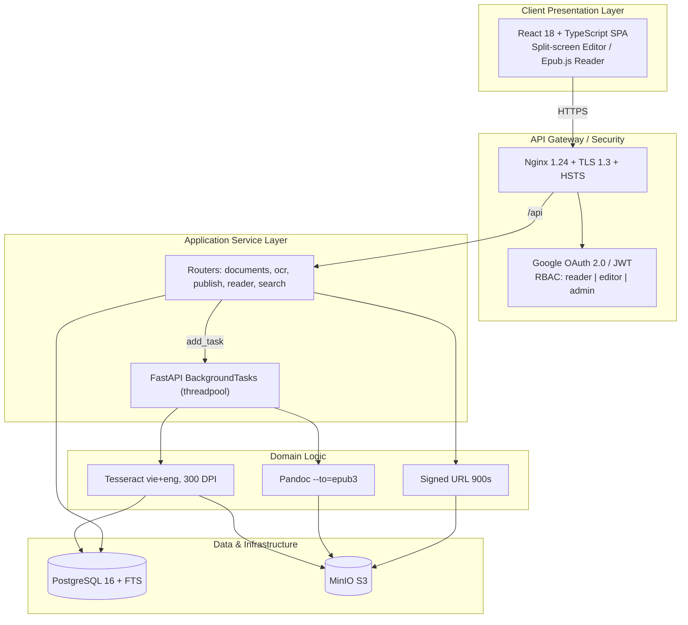

### Trả lời các câu hỏi thường gặp

**1. Các câu hỏi chính cần trả lời trong tài liệu Kiến trúc phần mềm là gì?**

1. Ràng buộc nào chi phối kiến trúc? (ngân sách < 100 triệu, on-premise VMware, đội 4 người, tìm kiếm < 3 giây)
2. Chọn phong cách nào và loại phương án nào? (Modular Monolith; loại DSpace và Microservices)
3. Mỗi thành phần dùng công nghệ gì, vì sao? (bảng Tech Stack 12 dòng, mỗi dòng có cột “Lý do kỹ thuật”)
4. Các thành phần giao tiếp với nhau thế nào? (C4 Container + Sequence Diagram)
5. Triển khai vật lý ở đâu? (VM-Production + VM-Staging trên VMware, Docker Compose)
6. Dữ liệu được bảo mật, sao lưu, khôi phục thế nào? (Signed URL, RBAC, PgBackRest + Restic, RPO 24h / RTO 4h)

**2. Đầu vào và các bước nhóm đã thực hiện là gì?**

Đầu vào: (1) 26 User Stories; (2) sơ đồ To-Be; (3) ràng buộc ngân sách và hạ tầng từ Charter; (4) năng lực thực tế của nhóm. Sơ đồ viết bằng PlantUML dạng text trong Markdown — thay đổi kiến trúc nằm trong Git diff và review được qua PR.

**3. Tài liệu đã được đánh giá thế nào?**

Ba lớp: (1) Rà soát nội bộ theo vai trò — Reviewer là Trưởng phòng CNTT & Giám đốc Thư viện; (2) Tự phản biện có cấu trúc ở mục 7.3 (Lựa chọn → Counter-argument → Refutation); (3) Đánh giá bằng thực nghiệm — PoC ở mục 9 chính là phương pháp đánh giá kiến trúc.

**4. Tại sao cần tạo tài liệu Kiến trúc phần mềm?**

Vì kiến trúc là quyết định đắt nhất và khó đảo ngược nhất. Phải được viết ra, phản biện và kiểm chứng bằng PoC trước khi viết dòng code đầu tiên.

**5. Tài liệu đã được sử dụng và cập nhật như thế nào?**

Dùng để sinh mã nguồn (Spec-Driven — cây thư mục mục 7.2 đưa vào prompt AI); làm đầu vào ước lượng UCP/KLOC; cập nhật 3 lần thật (v2.0 sơ đồ C4, v3.0 hạ 3 công nghệ, v3.1 đồng bộ với mã nguồn). Bài học: cập nhật tài liệu phải rà toàn bộ file và đối chiếu ngược với mã nguồn.

**6. Giải thích 5 góc nhìn trong mô hình 4+1 Views**

| Góc nhìn             | Trả lời cho ai                           | Trong tài liệu nhóm                        |
| :------------------- | :--------------------------------------- | :----------------------------------------- |
| **Logical View**     | Người phân tích — khối chức năng nào     | C4 Context + C4 Container                  |
| **Process View**     | Vận hành — tiến trình và xử lý đồng thời | Sequence Diagram + BackgroundTasks         |
| **Development View** | Lập trình viên — tổ chức mã nguồn        | Cây thư mục + GitFlow                      |
| **Physical View**    | Kỹ sư hệ thống — máy và mạng             | C4 Deployment, VM trên VMware              |
| **+1 Scenarios**     | Tất cả — chất keo ràng 4 góc nhìn        | Use Case Diagram 3 tác nhân, 10 ca sử dụng |

“+1” không phải góc nhìn độc lập mà là tập ca sử dụng chủ chốt dùng để xác thực 4 góc nhìn còn lại.

---

## Câu 6. Chứng minh ý tưởng (Proof of Concept)

### Đề bài

Trình bày quá trình hình thành và phương pháp đánh giá sản phẩm Chứng minh ý tưởng (Proof of Concept) của nhóm. _(Sinh viên nộp kèm bản in giao diện thể hiện đầu vào và đầu ra khi chạy mã nguồn Chứng minh ý tưởng của nhóm.)_

**Các câu hỏi thường gặp:**

- Sản phẩm Chứng minh ý tưởng (Proof of Concept) là gì?
- Giải thích các phương pháp có thể dùng để chứng minh khả năng hoàn thành dự án về mặt kỹ thuật.
- Nhóm chọn sản phẩm gì để Chứng minh ý tưởng?
- Các đầu vào cần thiết và các bước nhóm đã thực hiện để tạo sản phẩm Chứng minh ý tưởng là gì?
- Tại sao cần tạo sản phẩm Chứng minh ý tưởng?
- Sản phẩm Chứng minh ý tưởng của nhóm đã được sử dụng trong quá trình thực hiện dự án như thế nào?

### Câu trả lời

#### WHAT — PoC là gì?

PoC là **thí nghiệm kỹ thuật thu hẹp** nhằm trả lời một câu hỏi rủi ro dạng có/không: _công nghệ này có làm được việc này không?_ Ba đặc điểm:

1. **Phạm vi hẹp tối đa** — chỉ chạm đúng chỗ rủi ro.
2. **Không quan tâm chất lượng phi chức năng** — không cần UI đẹp, không cần bảo mật đầy đủ. Thầy dặn: _“PoC không cần giao diện đẹp, tốn ít token, chỉ cần input PDF ra được cái EPUB.”_
3. **Tiêu chí thành công nhị phân, đo được** — chạy được input → output đúng, hoặc không.

PoC nằm ở pha Requirements + High-level Design, trước khi ký hợp đồng và trước khi ước lượng chi tiết.

Phân biệt: **PoC** thuyết phục nhóm kỹ thuật (_có khả thi không?_); **Prototype** thuyết phục người dùng (_luồng làm việc có đúng ý?_); **MVP** là sản phẩm thật tối giản cho thị trường.

#### HOW — Nhóm cài đặt và đo đạc 2 PoC

Nhóm làm **2 PoC đúng 2 loại thầy yêu cầu**.

**PoC 1 — Tính năng khó nhất: pipeline OCR tiếng Việt bất đồng bộ**

Câu hỏi rủi ro: _Tesseract có nhận dạng được tiếng Việt có dấu từ ảnh scan không, và tác vụ OCR ngốn CPU có làm treo Web API không?_

1. `POST /documents/{id}/ocr` nhận file, tạo `OcrJob` trạng thái `pending`.
2. Trả **HTTP 202 Accepted** ngay kèm `job_id` — người dùng không treo màn hình.
3. `background_tasks.add_task(run_ocr_job, job.id)` — vì `run_ocr_job` là hàm sync, Starlette chạy trong threadpool, event loop không bị block.
4. Worker thực thi 5 bước: tải source từ MinIO → `pdf2image` 300 DPI → `pytesseract` `lang="vie+eng"` timeout 60s → upload PNG preview → ghi text vào bảng `pages`.
5. Frontend polling `GET /documents/{id}/ocr`.

Chi tiết kỹ thuật: chống chạy trùng bằng `with_for_update()`; đếm `attempt` để retry; `recover_interrupted_ocr_jobs()` đánh dấu job dở thành `failed` khi API restart — đây là giới hạn đã biết của BackgroundTasks.

**PoC 2 — Tính năng đơn giản nhưng bao quát toàn bộ tech stack**

Câu hỏi rủi ro: _cả 6 mảnh công nghệ có ghép lại chạy thông suốt không?_

1. Pandoc đóng gói EPUB (`--to=epub3`, timeout 120s).
2. `validate_epub()` kiểm 4 điều kiện: mimetype, `META-INF/container.xml`, `dc:title`/`dc:creator`, text từng trang đúng thứ tự trong spine.
3. Upload MinIO khóa `documents/{id}/epub/{job_id}.epub`.
4. Signed URL 900 giây, chỉ khi RBAC cho phép và `status == "published"`.
5. `ReaderPage.tsx` dùng thật `epubjs@0.3.93`.

#### WHY — Tại sao cần PoC?

- Rủi ro lớn nhất phải được trả lời sớm nhất và rẻ nhất. Nếu Tesseract không đọc nổi tiếng Việt, cả dự án mất ý nghĩa — biết ở tuần 5 tốn vài giờ; biết ở tuần 18 thì mất cả dự án.
- Chống rủi ro hứa hẹn chỉ tiêu không kiểm chứng.
- Làm đầu vào cho ước lượng (OCR 1 trang mất bao lâu → throughput WP4).
- Rẻ hơn prototype và rẻ hơn sai kiến trúc.

#### EVIDENCE — Minh chứng dự án

- Mục 9.1–9.3 trong `02-architecture.md`; `app/workers/ocr.py` (176 dòng), `app/workers/publish.py` (205 dòng).
- Cấu hình: `ocr_dpi = 300`, `ocr_language = "vie+eng"`, `ocr_timeout_seconds = 60`, `pandoc_timeout_seconds = 120`.
- File đầu vào thật: `samples/two-page.pdf`.
- Test: `tests/workers/test_ocr.py`, `tests/api/test_ocr.py`.
- Docker image backend đã đóng gói Tesseract + Poppler + Pandoc.

### Trả lời các câu hỏi thường gặp

**1. Sản phẩm Chứng minh ý tưởng là gì?**

Mã nguồn dùng một lần để mua thông tin, không phải để bán cho khách hàng. Giá trị là câu trả lời có/không, không phải phần mềm.

**2. Các phương pháp chứng minh khả năng kỹ thuật**

| Phương pháp                           | Bản chất                                       | Nhóm có dùng?                                    |
| :------------------------------------ | :--------------------------------------------- | :----------------------------------------------- |
| **Spike Solution**                    | Code thử ném đi, thu hẹp 1 câu hỏi, time-boxed | PoC 1 — OCR tiếng Việt async                     |
| **Tracer Bullet**                     | Xuyên mỏng toàn bộ tầng từ UI xuống storage    | PoC 2 — Auth → DB → MinIO → Epub.js              |
| **Benchmark / Load test**             | Đo hiệu năng NFR                               | Một phần — có timeout, chưa load test đúng nghĩa |
| **Đối chuẩn giải pháp có sẵn**        | Khảo sát sản phẩm sẵn có                       | Khảo sát DSpace                                  |
| **Vertical Slice / Walking Skeleton** | Khung E2E rất mỏng rồi bồi dần                 | Mục 9.4 Skeleton Project Layout                  |

PoC 1 và PoC 2 là hai phương pháp khác bản chất — đó là lý do thầy yêu cầu làm cả hai loại.

**3. Nhóm chọn sản phẩm gì để Chứng minh ý tưởng?**

- **PoC 1:** Pipeline OCR tiếng Việt bất đồng bộ — tính năng khó nhất, chưa ai trong nhóm từng làm, trái tim của đề án.
- **PoC 2:** Luồng xuất bản + đọc sách E2E — luồng đơn giản nhất về nghiệp vụ nhưng chạm 6 mảnh tech stack.

Làm một cái thôi thì hoặc “từng mảnh chạy mà không ghép nổi”, hoặc “ghép được nhưng chỗ khó nhất vẫn chưa biết”.

**4. Đầu vào và các bước tạo PoC là gì?**

Đầu vào: `samples/two-page.pdf`; bảng Tech Stack mục 4.2; PostgreSQL + MinIO qua Docker Compose; tiêu chí: API trả về dưới 1 giây, text tiếng Việt có dấu đúng, EPUB mở được trên Epub.js. Thứ tự: PoC 1 (chỗ khó) trước, PoC 2 (ghép nối) sau.

**5. Tại sao cần tạo sản phẩm Chứng minh ý tưởng?**

Rủi ro kỹ thuật càng phát hiện muộn càng đắt theo hàm số nhân. PoC là cách rẻ nhất để biến giả định thành sự thật đã kiểm chứng, trước khi cả nhóm đặt cược 20 tuần.

**6. PoC đã được sử dụng trong dự án như thế nào?**

Không bỏ đi: **nâng cấp thành mã nguồn production**. Pattern “API trả 202 + BackgroundTasks + polling” áp dụng lại cho luồng Publish EPUB. Tham số `dpi=300`, `lang="vie+eng"`, `timeout=60s` vẫn nằm trong `config.py`. Bọc test và tiêm mock. Bổ sung `_mark_failed()`, cột `attempt`, `ConflictError`, `recover_interrupted_ocr_jobs()`. Kết quả PoC viết lại thành mục 9 kiến trúc và cung cấp số liệu cho ước lượng WP4.

---

## Câu 7. Bản mẫu (Prototype)

### Đề bài

Trình bày quá trình hình thành và phương pháp đánh giá sản phẩm Bản mẫu (Prototype) của nhóm. _(Sinh viên nộp kèm bản in phác thảo giao diện ban đầu cho hệ thống của nhóm.)_

**Các câu hỏi thường gặp:**

- Sản phẩm Bản mẫu là gì?
- Giải thích sự khác nhau giữa bản mẫu hệ thống và tập hợp các màn hình giao diện hệ thống.
- Các đầu vào cần thiết và các bước nhóm đã thực hiện để tạo sản phẩm Bản mẫu là gì?
- Sản phẩm Bản mẫu của nhóm đã được đánh giá thế nào?
- Tại sao cần tạo sản phẩm Bản mẫu?
- Sản phẩm Bản mẫu của nhóm đã được sử dụng trong quá trình thực hiện dự án như thế nào?

### Câu trả lời

#### WHAT — Bản mẫu là gì?

Prototype là **phiên bản chạy được, chưa hoàn chỉnh, của hệ thống**, dựng ra để người dùng **tương tác thật** và cho phản hồi về yêu cầu — trước khi nhóm cam kết xây dựng đầy đủ.

- **Throwaway Prototype:** dựng nhanh để lấy yêu cầu rồi bỏ đi, viết lại sạch.
- **Evolutionary Prototype:** dựng bằng công nghệ thật, mỗi vòng phản hồi tinh chỉnh, cuối cùng chính nó trở thành sản phẩm.

Nhóm chọn **Evolutionary Prototype** trên React 18 + TypeScript + Vite vì đội nhỏ, 20 tuần, không đủ nguồn lực làm một bản mẫu rồi bỏ đi.

#### HOW — Nhóm xây dựng và đánh giá Prototype

1. Bắt đầu từ workflow dạng text → sơ đồ To-Be (`as_is_to_be_workflow.svg`), rồi mới chuyển thành màn hình.
2. Chọn đúng 2 màn hình rủi ro UX cao nhất — không làm bản mẫu cho toàn bộ 26 story:
   - **Split-screen Editor** (`DocumentViewerPage.tsx`): trái ảnh scan, phải `<textarea>` text OCR, đếm ký tự, nút “Lưu trang”, cảnh báo chưa lưu.
   - **Web Reader** (`ReaderPage.tsx`): `epubjs@0.3.93` render EPUB reflowable từ Signed URL, highlight và ghi chú theo `epubcfi`.
3. Tiến hóa 3 vòng ghi trong `02-project-log.md`:
   - v1 — 16/07/2026: placeholder Reader/Search, 2 giờ, 40K token.
   - v2 — 18/07/2026: Search reader experience, 7 SP, 6 giờ, 100K token.
   - v3 — 13/08/2026: Highlight và ghi chú (LDMS-021), 2 giờ, 40K token.
4. Phân quyền đưa vào bản mẫu ngay: biến `canEdit` quyết định `<textarea>` hay `page-text-readonly`.
5. Đánh giá: demo thủ thư; 18 file test frontend giữ hồi quy; lint/format bắt buộc.

#### WHY — Tại sao cần Prototype?

- Lấy yêu cầu tiềm ẩn mà phỏng vấn không lấy được. Thủ thư không mô tả được bằng lời cách đối soát ảnh scan với text OCR; khi thấy màn hình chia đôi chạy thật thì nói được chỗ bất tiện.
- Rủi ro UX cao bất thường: biên tập viên nhìn màn hình này hàng giờ mỗi ngày. Sai UX nghĩa là hệ thống không được dùng.
- Ngôn ngữ chung với người không đọc sơ đồ C4.
- Chọn Evolutionary thay Throwaway để không trả giá hai lần, trong điều kiện 20 tuần.

#### EVIDENCE — Minh chứng dự án

- `DocumentViewerPage.tsx` — `<section className="scan-split-view">` với `scan-pane` và `processed-pane`.
- `ReaderPage.tsx` import `epubjs`; `package.json` khai báo `"epubjs": "^0.3.93"`.
- `HighlightNoteEditor.tsx` và validate `epubcfi(` — highlight là tính năng thật.
- 18 file test frontend.
- Nhật ký: 3 mốc tiến hóa. Tổng dự án **14h05m / 730K token** tính đến 13/08/2026.

### Trả lời các câu hỏi thường gặp

**1. Sản phẩm Bản mẫu là gì?**

Phần mềm chạy được nhưng chưa hoàn chỉnh, tồn tại để lấy phản hồi về yêu cầu — bán ý tưởng cho người dùng, khác với PoC bán tính khả thi cho nhóm kỹ thuật.

**2. Khác nhau giữa Prototype và UI Mockups / Wireframes**

| Tiêu chí             | UI Mockups / Wireframes                     | Prototype                                              |
| :------------------- | :------------------------------------------ | :----------------------------------------------------- |
| Bản chất             | Hình ảnh tĩnh mô tả giao diện trông thế nào | Phần mềm chạy được chứng minh hệ thống hành xử thế nào |
| Tương tác            | Không, hoặc giả lập bằng liên kết ảnh       | Có thật: nhập liệu, gọi API, lưu DB, báo lỗi           |
| Dữ liệu              | Dữ liệu bịa cứng                            | Dữ liệu thật từ PostgreSQL và MinIO                    |
| Câu hỏi được trả lời | Bố cục, màu sắc, vị trí nút có ổn không?    | Cả luồng làm việc có dùng được không?                  |
| Số phận              | Bỏ đi sau khi thống nhất thiết kế           | Có thể tiến hóa thành sản phẩm cuối                    |

Ví dụ: mockup Split-screen chỉ cho thấy “trái ảnh, phải chữ”. Prototype mới trả lời được: ảnh scan tải từ MinIO có kịp không; sửa 3.000 ký tự có giật không; mất mạng khi lưu thì hiện gì; độc giả không quyền `editor` thì thấy `page-text-readonly`.

**3. Đầu vào và các bước tạo Bản mẫu là gì?**

Đầu vào: quy trình To-Be; User Stories kèm AC; cấu trúc thư mục frontend trong kiến trúc; **kết quả PoC** (phải biết OCR ra được text thật); wireframe ban đầu. Thứ tự quan trọng: **PoC trước, Prototype sau**.

**4. Bản mẫu đã được đánh giá thế nào?**

(1) Demo trực tiếp cho thủ thư (định tính); (2) Đối chiếu AC (định lượng); (3) 18 file test frontend bằng Vitest; (4) `npm run lint` và `npm run format`.

**5. Tại sao cần tạo sản phẩm Bản mẫu?**

Người dùng không biết mình muốn gì cho đến khi nhìn thấy thứ gì đó chạy được. Với màn hình biên tập viên phải nhìn hàng giờ, phát hiện sai UX sau bàn giao thì hệ thống bị bỏ không.

**6. Bản mẫu đã được sử dụng như thế nào?**

Tiến hóa thành chính sản phẩm cuối — không viết lại. Highlight và ghi chú (LDMS-021) **không có trong hình dung ban đầu** — nảy sinh từ việc dùng thử Reader. Làm cơ sở UAT và User Guide. Rủi ro Evolutionary: nợ kỹ thuật — nhóm khống chế bằng 18 file test + lint + PR review.

---

## Câu 8. Báo cáo tính khả thi (Feasibility Study Report)

### Đề bài

Trình bày quá trình hình thành và phương pháp đánh giá tài liệu Báo cáo tính khả thi (Feasibility Study Report) của nhóm. _(Sinh viên nộp kèm bản in tài liệu Báo cáo tính khả thi của nhóm.)_

**Các câu hỏi thường gặp:**

- Các câu hỏi chính cần trả lời trong tài liệu Báo cáo tính khả thi là gì?
- Các đầu vào cần thiết và các bước nhóm đã thực hiện để tạo tài liệu Báo cáo tính khả thi là gì?
- Tài liệu Báo cáo tính khả thi của nhóm đã được đánh giá thế nào?
- Tại sao cần tạo tài liệu Báo cáo tính khả thi?
- Tài liệu Báo cáo tính khả thi của nhóm đã được sử dụng trong quá trình thực hiện dự án như thế nào?

### Câu trả lời

#### WHAT — Feasibility Study là gì?

Feasibility Study là đánh giá chi tiết nhu cầu, giá trị và tính thực tiễn của dự án trước khi cam kết đầu tư lớn. Cấu trúc chuẩn gồm Purpose, Reason, Background, Evaluation Criteria, Study Findings và Recommendations. Dự án dùng **TELOS** làm lõi: Technical, Economic, Legal, Operational, Schedule; đồng thời mở rộng Market, Resource và Cultural thành tám khía cạnh.

#### HOW — Nhóm đánh giá tính khả thi như thế nào?

1. Thu thập đầu vào về pain point, hạ tầng, đội ngũ, nghiệp vụ thư viện, công nghệ, chi phí, tiến độ và bản quyền.
2. Đặt ngưỡng kiểm duyệt: OCR tối thiểu 85%, tìm kiếm dưới 3 giây, CapEx dưới 95 triệu, OpEx dưới 30 triệu/năm, MVP 12 tuần và go-live trong 20 tuần.
3. Đánh giá từng khía cạnh TELOS và ba khía cạnh mở rộng; ghi mức khả thi và điều kiện đi kèm.
4. Thực hiện SWOT, benchmarking, cost-avoidance/payback và risk assessment.
5. So sánh kết quả với ngưỡng; xác định điểm chưa đạt hoặc chưa có chứng cứ.
6. Đưa ra khuyến nghị **phê duyệt có điều kiện**: pilot MVP, hoàn thiện quy chế bản quyền và kiểm tra lại mô hình tài chính trước khi mở rộng.

#### WHY — Tại sao cần Feasibility Study?

- Kiểm tra dự án có thể thực hiện trong điều kiện công nghệ, tiền, người, luật và thời gian hiện có hay không.
- Phát hiện rủi ro và giả định yếu trước khi Sponsor cấp ngân sách.
- So sánh chi phí/lợi ích và phương án thay thế để tránh đầu tư cảm tính.
- Cung cấp cơ sở định lượng cho quyết định go/no-go và cho Charter/Project Plan.
- Xác định điều kiện pilot, đào tạo và kiểm soát cần có để dự án vận hành được sau bàn giao.

#### EVIDENCE — Minh chứng HCMUS-LDMS

| Khía cạnh   | Kết quả và bằng chứng                                                                                                                      |
| :---------- | :----------------------------------------------------------------------------------------------------------------------------------------- |
| Technical   | React 18, FastAPI, Tesseract, Pandoc, PostgreSQL FTS, MinIO; OCR ≥ 85%; tìm kiếm < 3 giây                                                  |
| Economic    | CapEx cơ sở 75 triệu; OpEx cơ sở 15 triệu/năm; lợi ích quy đổi 35 triệu/năm; dòng tiết kiệm ròng 20 triệu/năm; hoàn vốn cơ sở **3,75 năm** |
| Legal       | Khả thi có điều kiện; cần giới hạn tài liệu, quyền truy cập và được Pháp chế/chủ sở hữu quyền xác nhận                                     |
| Operational | 2 cán bộ thư viện, 4 kỹ sư, CTV; Split-screen Editor; dự kiến 2 buổi đào tạo                                                               |
| Schedule    | MVP phần mềm 12 tuần; go-live toàn trường trong 20 tuần                                                                                    |
| Market      | Báo cáo ghi nhận 92% người được phỏng vấn ủng hộ EPUB — chưa có dữ liệu khảo sát gốc                                                       |
| Resource    | Hạ tầng VMware on-premise; 4 kỹ sư kiêm nhiệm; 2 cán bộ thư viện; sinh viên CTV                                                            |
| Cultural    | Đối tượng người dùng quen công nghệ; cần đo lại bằng pilot/UAT                                                                             |

### Trả lời các câu hỏi thường gặp

**1. Các câu hỏi chính cần trả lời trong Feasibility Study là gì?**

Mục đích và lý do nghiên cứu; bối cảnh/giả định; tiêu chí và ngưỡng đánh giá; dự án có khả thi về Technical, Economic, Legal, Operational, Schedule hay không; thị trường, nguồn lực và văn hóa có ủng hộ không; rủi ro/điểm yếu; phương án tài chính và thời gian hòa vốn; nên go, no-go hay go có điều kiện; điều kiện và bước tiếp theo.

**2. Đầu vào và các bước nhóm thực hiện là gì?**

Đầu vào: Project Idea/Proposal, nhu cầu người dùng, hạ tầng VMware, năng lực đội ngũ, tech stack, chi phí thiết bị/nhân công, lịch trình, yêu cầu bản quyền, benchmark. Các bước: xác định tiêu chí → thu thập dữ liệu → đánh giá tám khía cạnh → SWOT/benchmark → tính cost avoidance và payback → lập risk register → so sánh ngưỡng → khuyến nghị có điều kiện.

**3. Feasibility Study của nhóm đã được đánh giá thế nào?**

Mỗi khía cạnh gắn mức khả thi và tiêu chí đo được; kiểm tra chéo bằng SWOT, benchmark, mô hình tài chính và bốn rủi ro có Risk Owner. Tài liệu kết luận khả thi cao/tốt, nhưng ba điểm chưa đạt hoàn toàn: tiêu chí hòa vốn trong 3 năm không khớp kịch bản cơ sở 3,75 năm; khảo sát 92% chưa có dữ liệu gốc; pháp lý phụ thuộc phạm vi sử dụng và phê duyệt. Kết luận đúng là **“khả thi có điều kiện”**, không phải “khả thi tuyệt đối”.

**4. Tại sao cần tạo Feasibility Study?**

Proposal trả lời “tại sao nên xem xét dự án”, Feasibility Study trả lời “dự án có thực sự làm được và với điều kiện nào”. Giúp Sponsor tránh sunk cost, ưu tiên nguồn lực, chọn phương án triển khai, định hình MVP và đặt biện pháp giảm rủi ro trước khi ký Charter.

**5. Feasibility Study đã được sử dụng như thế nào?**

Đặt ngân sách, KPI, nguồn lực, lịch trình, điều kiện pháp lý và rủi ro trong Charter; định hướng MVP/pilot; chọn tech stack mã nguồn mở; phân bổ 50% thời gian cho kỹ sư và huy động CTV. Khi có dữ liệu PoC, UAT, chi phí thực và ý kiến Pháp chế, báo cáo phải được cập nhật lại. Phiên bản hiện tại v3.0, `Under Review`.

---

## Câu 9. Định nghĩa quy trình phát triển phần mềm (Software Process Definition)

### Đề bài

Trình bày quá trình hình thành và phương pháp đánh giá tài liệu Định nghĩa quy trình phát triển phần mềm (Software Process Definition) của nhóm. _(Sinh viên nộp kèm bản in tài liệu Định nghĩa quy trình phát triển phần mềm của nhóm.)_

**Các câu hỏi thường gặp:**

- Các câu hỏi chính cần trả lời trong tài liệu Định nghĩa quy trình phát triển phần mềm là gì?
- Mô hình cơ sở được lựa chọn để hiệu chỉnh là gì?
- Thời gian dự kiến của từng giai đoạn là bao lâu?
- Các vai trò nào từng thành viên trong nhóm sẽ đảm nhiệm?
- Các sản phẩm nào dự kiến sẽ khởi tạo?
- Quy trình để đưa ra một bản phân phối hoạt động là gì?
- Ưu và khuyết điểm của mô hình nhóm lựa chọn là gì?
- Tài liệu Định nghĩa quy trình phát triển phần mềm của nhóm đã được đánh giá thế nào?
- Tại sao cần tạo tài liệu Định nghĩa quy trình phát triển phần mềm?
- Tài liệu Định nghĩa quy trình phát triển phần mềm của nhóm đã được sử dụng và cập nhập trong quá trình thực hiện dự án như thế nào?

### Câu trả lời

#### WHAT — Quy trình là gì?

Nhóm phải trả lời bài toán: làm sao 4 kỹ sư kiêm nhiệm 50% thời gian bàn giao hệ thống phức tạp (FastAPI, React, OCR, Pandoc, PostgreSQL FTS) đúng hạn 20 tuần mà vẫn giữ chất lượng. Giải pháp: **Agile Kanban định hướng đặc tả (Spec-Driven) kết hợp AI Coding Assistant**, **WIP limit = 1 card/kỹ sư** và **DoD 5 tiêu chí**.

#### HOW — Quy trình 4 bước khép kín

1. **Viết Đặc tả chuẩn trước khi code (Spec-Driven):** User Story, AC dạng Gherkin, Schema CSDL và API Contract (Pydantic).
2. **Prompt AI có kiểm soát (Context Engineering):** khung RACFT (Role-Ask-Context-Format-Tone), nạp Spec và architectural rules vào Antigravity/Claude.
3. **Lưới kiểm thử tự động:** `pytest`, type-check. Test fail thì tinh chỉnh prompt đến khi pass 100%.
4. **Con người chốt chặn Review & Merge:** SA review PR và AC. Merge khi đủ 5 tiêu chí DoD, ghi effort vào Project Log.

#### WHY — Tại sao chọn quy trình này?

- Triệt tiêu “ảo giác AI” và nợ kỹ thuật: Spec-Driven + Automated Test ép AI tuân thủ Modular Monolith.
- WIP = 1 giúp lộ điểm nghẽn review, giảm chi phí chuyển đổi ngữ cảnh.
- Tuân thủ bài học NASA/SEL: quy trình được định nghĩa rõ giúp đội ngũ làm nhất quán.

#### EVIDENCE — Minh chứng dự án

- Product Backlog quy định Kanban và DoR tại §1.1, DoD 5 tiêu chí tại §1.2; luồng bốn bước trong `06-software-process-definition.md`.
- Sprint Plan phân bổ 17 stories Sprint 1 — mỗi kỹ sư tự làm cả BE lẫn FE cho story của mình.
- Snapshot Tuần 1: **12/26 stories** (46% backlog), **440K token AI**, chi phí ước tính **~300K VNĐ**.

### Sơ đồ quy trình Spec-Driven + AI

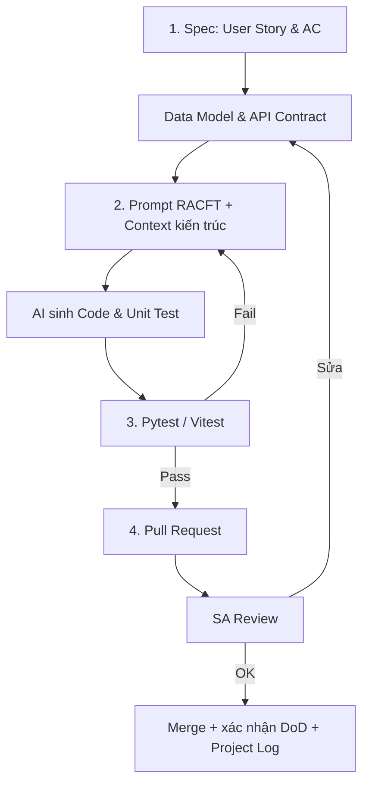

### Trả lời các câu hỏi thường gặp

**1. Các câu hỏi chính cần trả lời trong tài liệu quy trình là gì?**

Theo NASA/SEL, năm câu hỏi: (1) Làm bước nào tiếp theo? (`To-Do` → `In Progress` → `Review` → `Done`); (2) Mất bao lâu? (S ≤ 1 ngày, M ≤ 2 ngày); (3) Thực hiện như thế nào? (Spec-Driven, RACFT, Pytest); (4) Tạo ra hiện vật gì? (Schema, mã nguồn, test, Dockerfile, Swagger); (5) Ai làm? (ma trận 6 thành viên).

**2. Mô hình cơ sở được lựa chọn để hiệu chỉnh là gì?**

**Agile Kanban** vì tính linh hoạt theo dòng chảy, bổ sung Spec-Driven ở đầu vào và AI Coding Assistant ở khâu thực thi. Sau mỗi phiên, ghi Session Log thủ công vào `02-project-log.md`.

**3. Thời gian dự kiến của từng giai đoạn là bao lâu?**

Kế hoạch **20 tuần**, 4 giai đoạn:

- Giai đoạn 0 (Tuần 1–2): Khảo sát thư viện, đánh giá bản quyền, thiết lập hạ tầng ảo hóa.
- Giai đoạn 1 (Tuần 3–12): Xây MVP cốt lõi và số hóa thí điểm 500 sách CNTT.
- Giai đoạn 2 (Tuần 13–18): Chuyển giao quy trình cho thủ thư và 15 CTV số hóa 2.000 giáo trình.
- Giai đoạn 3 (Tuần 19–20): UAT, Pentest, đào tạo cán bộ, Go-Live toàn trường.

**4. Các vai trò nào từng thành viên đảm nhiệm?**

| Thành viên                       | Vai trò                                   |
| :------------------------------- | :---------------------------------------- |
| Mạch Quốc Tấn (23127115)         | Project Manager                           |
| Ân Tiến Nguyên An (23127048)     | Solution Architect / Backend Developer    |
| Nguyễn Tuấn Anh (23127152)       | Backend Developer / DevOps / System Admin |
| Ngô Nguyễn Thế Khoa (23127065)   | Frontend Developer                        |
| Nguyễn Lê Hồ Anh Khoa (23127211) | Frontend Developer                        |
| Nguyễn Quang Thái (23127116)     | DevOps / System Admin / QA / Tester       |

**5. Các sản phẩm nào dự kiến sẽ khởi tạo?**

(1) Bộ hồ sơ quản lý dự án 3 giai đoạn; (2) Mã nguồn Backend FastAPI Modular Monolith và Frontend React Portal; (3) Hạ tầng container hóa và pipeline CI/CD; (4) Kho 500 sách EPUB thí điểm và 2.000 sách số hóa diện rộng.

**6. Quy trình để đưa ra một bản phân phối hoạt động là gì?**

Triển khai theo AC → chạy local và tự kiểm tra → mở PR → GitHub Actions kiểm tra lint, build và test → review theo DoD → merge vào nhánh chính. Repo hiện có CI; triển khai Production là bước vận hành riêng, **chưa có workflow CD tự động**.

**7. Ưu và khuyết điểm của mô hình nhóm lựa chọn là gì?**

- Ưu: AI tăng tốc bước phù hợp; WIP=1 lộ điểm nghẽn review; test tự động + review người tạo hai lớp kiểm soát.
- Khuyết: Rất nhạy với chất lượng Spec ban đầu (Spec sai thì AI code sai); đòi hỏi kỷ luật cao, không được bỏ qua bước viết test.

**8. Tài liệu đã được đánh giá thế nào?**

Ba nguồn: (1) đối chiếu nội bộ với Backlog và Team Contract; (2) đo Throughput, Cycle Time và token từ Project Log; (3) cập nhật khi AC, tech stack hoặc luồng làm việc thay đổi.

**9. Tại sao cần tạo tài liệu Định nghĩa quy trình?**

Tạo sự minh bạch và thống nhất cách làm. Nếu không có quy trình rõ, mã do nhiều người và AI hỗ trợ dễ thiếu nhất quán, khó review và khó tích hợp.

**10. Tài liệu đã được sử dụng và cập nhật như thế nào?**

Tài liệu độc lập được tổng hợp ngày 20/08/2026 từ các quy tắc đã áp dụng trong Backlog, Team Contract và Sprint Plan. Trong Sprint 1 nhóm đã dùng WIP, DoR/DoD và Session Logging; sau đó hợp nhất thành tài liệu quy trình để đánh giá và in nộp.

---

## Câu 10. Ước lượng dự án (Project Estimate)

### Đề bài

Trình bày quá trình hình thành và phương pháp đánh giá tài liệu Ước lượng dự án (Project Estimate) của nhóm. _(Sinh viên nộp kèm bản in tài liệu Ước lượng dự án của nhóm.)_

**Các câu hỏi thường gặp:**

- Các câu hỏi chính cần trả lời trong tài liệu Ước lượng dự án là gì?
- Các đầu vào cần thiết và các bước nhóm đã thực hiện để tạo tài liệu Ước lượng dự án là gì?
- Tài liệu Ước lượng dự án của nhóm đã được đánh giá thế nào?
- Tại sao cần tạo tài liệu Ước lượng dự án?
- Tài liệu Ước lượng dự án của nhóm đã được sử dụng trong quá trình thực hiện dự án như thế nào?
- Giải thích các phương pháp phân rã một tính năng lớn thành các tính năng nhỏ.
- Khi không có khả năng phân rã được các tính năng lớn của dự án, nhóm phải làm thế nào?
- Ước lượng có thể sai lệch khoảng bao nhiêu lần ở giai đoạn đầu dự án?
- Tại sao cần ước lượng ở giai đoạn đầu của dự án?
- Ước lượng kích cỡ (Size) mang lại lợi ích gì cho dự án khi mối quan tâm chính của ban quản lý là khoảng thời gian (Duration) và chi phí (Cost) cần thiết để hoàn thành dự án?
- Giải thích quy tắc "Đếm, Tính toán và Đánh giá" khi thực hiện ước lượng dự án?
- Giải thích các kỹ thuật để tăng độ chính xác khi thực hiện việc ước lượng bằng đánh giá chủ quan?
- Giải thích các kỹ thuật để tăng độ chính xác khi ước lượng bằng phương pháp "Phân rã và Kết hợp" ("Decomposition and Recomposition")?
- Giải thích kỹ thuật ước lượng bằng các lá bài (Planning Poker).

### Câu trả lời

#### WHAT — Ước lượng là gì?

Ước lượng dự án giúp nhóm chuyển một **mục tiêu mong muốn** thành một **cam kết có căn cứ**. Nhóm áp dụng **Đối chuẩn Hai Chiều (Two-Way Calibration)**: **Top-Down Use Case Points (UCP)** và **Bottom-Up COCOMO II**, theo nguyên tắc _Đếm — Tính toán — Đánh giá (Count-Compute-Judge)_.

#### HOW — Cách tính và đối chuẩn 2 mô hình

**Mô hình 1 — Top-Down Use Case Points (UCP)**

- UAW: 3 Actor hệ thống đơn giản × 1 + 3 Actor người dùng phức tạp × 3 → **UAW = 12**.
- UUCW: 6 Simple × 5 + 4 Average × 10 + 4 Complex × 15 → **UUCW = 130**.
- UUCP = 12 + 130 = **142 điểm**.
- TCF = 0.6 + (0.01 × 53) = **1.13**; ECF = 1.4 + (−0.03 × 20.5) = **0.785**.
- **AUCP = 142 × 1.13 × 0.785 ≈ 126 UCP**.
- Nỗ lực: 126 × 20 giờ/UCP = 2.520 giờ ≈ 15.75 PM. Giảm 40% nhờ tái sử dụng → 9.45 PM; làm tròn bảo thủ lên **10.0 PM**.

**Mô hình 2 — Bottom-Up COCOMO II (Early Design)**

- Tổng quy mô 8.5 KLOC; tái sử dụng 60% → code viết mới **3.5 KLOC**.
- B = 1.05; EAF = 0.95.
- **Effort = 2.94 × 0.95 × (3.5)^1.05 ≈ 10.4 PM**.

**Kết luận:** Hai mô hình hội tụ ở **≈ 10.5 PM**. Với 4 kỹ sư kiêm nhiệm 50% (= 2 FTE):

**Thời gian phát triển = 10.5 PM / 2 FTE = 5.25 tháng ≈ 21 tuần** — gần khớp lộ trình 20 tuần.

#### WHY — Tại sao phải đối chuẩn 2 chiều?

- Triệt tiêu “Căn bệnh lạc quan” (Best-Case Estimation Syndrome).
- Thu hẹp Cone of Uncertainty: giai đoạn đầu sai số có thể tới 4×; nhờ đếm Use Case và phân tích dòng code, ép sai lệch xuống dưới 20%.
- Bảo vệ ngân sách CapEx 75–95 triệu và OpEx 15–30 triệu/năm trước Ban Giám hiệu.

#### EVIDENCE — Minh chứng dự án

- Bảng tính UCP và COCOMO II tại `docs/02-planning/04-cost-time-resource.md` (§2).
- Phân bổ ngân sách tiền công kỹ sư (5.5M/người) trong SoW §8.
- Tài liệu ở trạng thái **Under Review**.

### Trả lời các câu hỏi thường gặp

**1. Các câu hỏi chính cần trả lời trong tài liệu Ước lượng là gì?**

(1) Kích thước phần mềm bao nhiêu? (126 AUCP / 3.5 KLOC viết mới); (2) Tốn bao nhiêu công sức? (10.5 PM); (3) Mất bao lâu? (20–21 tuần với 2 FTE); (4) Ngân sách cần cấp? (CapEx 75–95 triệu VNĐ).

**2. Đầu vào và các bước nhóm đã thực hiện là gì?**

Đầu vào: danh mục Use Case từ Backlog, bảng Actor, NFR, đánh giá kỹ năng đội ngũ, dữ liệu đối chuẩn DSpace. Các bước: tính UAW, UUCW → UUCP → chấm 13 tiêu chí TCF và 8 tiêu chí ECF → AUCP → KLOC viết mới và COCOMO II → đối chiếu 2 kết quả → lập kế hoạch nhân sự.

**3. Tài liệu đã được đánh giá thế nào?**

Đối chuẩn độc lập hai chiều. Chênh lệch UCP (10.0 PM) và COCOMO II (10.4 PM) khoảng **3.8%**. Trạng thái Under Review; chưa có bằng chứng phê duyệt chính thức.

**4. Tại sao cần tạo tài liệu Ước lượng dự án?**

Chuyển từ mong muốn chủ quan sang kế hoạch khả thi; bảo vệ cam kết bàn giao; làm căn cứ xin cấp phát ngân sách CapEx/OpEx.

**5. Tài liệu đã được sử dụng như thế nào?**

Định mức khối lượng cho từng Sprint; theo dõi Throughput thực tế để phát hiện trôi tiến độ; kiểm soát chi phí token AI không vượt trần.

**6. Các phương pháp phân rã tính năng lớn thành tính năng nhỏ**

(1) Theo quy trình nghiệp vụ (Upload → OCR → Biên tập → Xuất bản); (2) Theo lớp kiến trúc (DB → API → UI); (3) Theo thao tác (CRUD tách khỏi xử lý nâng cao); (4) Theo MoSCoW (Must trước, Should sau).

**7. Khi không phân rã được tính năng lớn thì làm thế nào?**

(1) Tạo Spike PoC 1–2 ngày; (2) Ước lượng theo tương tự (Analogy) với DSpace/Calibre; (3) Ước lượng theo dải giá trị (Range Estimation) kèm hệ số dự phòng rủi ro cao.

**8. Ước lượng có thể sai lệch bao nhiêu lần ở giai đoạn đầu? (Cone of Uncertainty)**

Ở giai đoạn khởi tạo sơ khai: **0.25× đến 4.0× (sai lệch tới 400%)**. Khi chốt yêu cầu và kiến trúc: 0.8×–1.25× (20–25%). Hình nón không tự thu hẹp — chỉ thu hẹp khi PM đưa ra quyết định kỹ thuật cụ thể.

**9. Tại sao cần ước lượng ở giai đoạn đầu?**

Để đánh giá tính khả thi kinh tế (TELOS), quyết định Go/No-Go và xác định khung phạm vi MVP.

**10. Ước lượng Size mang lại lợi ích gì khi ban quản lý quan tâm Duration và Cost?**

Size là thước đo khách quan, bất biến của khối lượng phần mềm. Effort = Size / Productivity; Duration = Effort / Headcount; Cost = Effort × Labor Rate. Không đo được Size thì không quản lý được Thời gian và Chi phí.

**11. Quy tắc “Đếm, Tính toán và Đánh giá” (Count, Compute, Judge)**

(1) _Đếm:_ đếm những gì cụ thể sớm nhất (14 Use Cases, 6 Actors, 8.5 KLOC); (2) _Tính toán:_ dùng công thức mô hình chuẩn (UCP, COCOMO II); (3) _Đánh giá:_ chỉ dùng phán đoán chuyên gia có cấu trúc ở bước cuối để tinh chỉnh hệ số — loại bỏ đoán mò cảm tính.

**12. Kỹ thuật tăng độ chính xác khi ước lượng chủ quan**

Cho chính người làm task tham gia ước lượng; chia nhỏ nhiệm vụ ≤ 2 ngày; công thức 3 điểm PERT: Expected = (O + 4M + P) / 6; dựa vào Luật Số Lớn từ 5–10 hạng mục.

**13. Kỹ thuật tăng độ chính xác khi “Phân rã và Kết hợp”**

Phân rã WBS xuống nhiệm vụ ≤ 2 ngày → tính độc lập từng phần tử → cộng dồn (Recomposition) → thêm 15% Buffer cho tích hợp và rủi ro.

**14. Planning Poker**

Dãy Fibonacci (1, 2, 3, 5, 8, 13…). Các thành viên lật bài cùng lúc để tránh mỏ neo. Người chấm cao nhất và thấp nhất giải thích, nhóm thảo luận và bỏ phiếu lại đến khi đồng thuận.

---

## Câu 11. Kế hoạch dự án (Project Plan)

### Đề bài

Trình bày quá trình hình thành và phương pháp đánh giá tài liệu Kế hoạch dự án (Project Plan) của nhóm. _(Sinh viên nộp kèm bản in tài liệu Kế hoạch dự án của nhóm.)_

**Các câu hỏi thường gặp:**

- Các câu hỏi chính cần trả lời trong tài liệu Kế hoạch dự án là gì?
- Các đầu vào cần thiết và các bước nhóm đã thực hiện để tạo tài liệu Kế hoạch dự án là gì?
- Tài liệu Kế hoạch dự án của nhóm đã được đánh giá thế nào?
- Tại sao cần tạo tài liệu Kế hoạch dự án?
- Tài liệu Kế hoạch dự án của nhóm đã được sử dụng và cập nhật trong quá trình thực hiện dự án như thế nào?
- Một số mô hình cho phép không xác định rõ các kết quả cuối cùng của dự án, vậy có cần tạo tài liệu Kế hoạch dự án trong các trường hợp này hay không?
- Tài liệu Kế hoạch dự án khác gì với tài liệu Định nghĩa quy trình phát triển phần mềm.

### Câu trả lời

#### WHAT — Kế hoạch dự án là gì?

Bản đồ điều phối nguồn lực, tiến độ và rủi ro. Nhóm phân rã thành **6 Gói công việc WBS (WP1 → WP6)**; **WP4 — Số hóa tài liệu, 6 tuần** là gói công việc găng và nhạy cảm nhất.

#### HOW — Phân rã WBS và kiểm soát đường găng

1. **WP1** Khảo sát & Bản quyền (Tuần 1–3)
2. **WP2** Cơ sở dữ liệu & Backend (Tuần 4–7)
3. **WP3** Giao diện & Trình đọc (Tuần 8–11)
4. **WP4** Số hóa tài liệu (Tuần 12–17) — **ĐƯỜNG GĂNG**: scan, OCR, soát lỗi, đóng gói EPUB
5. **WP5** Kiểm thử & UAT (Tuần 18–19)
6. **WP6** Triển khai & Vận hành (Tuần 20)

Tài liệu đánh dấu WP4 là gói găng nhưng **chưa có bảng tính earliest/latest time và slack** để gọi là phép tính CPM đầy đủ. WP4 nhạy cảm vì khâu scan và soát OCR là thủ công, phụ thuộc năng suất con người — trễ WP4 kéo lùi WP5, WP6 và ngày go-live.

#### WHY — Tại sao phải tập trung kiểm soát gói găng?

- Bảo vệ ngày Go-Live.
- Điều phối 4 kỹ sư CNTT, 2 cán bộ thủ thư và 15 sinh viên CTV.
- Quản trị rủi ro chủ động: nếu quét sách chậm, đề xuất tăng CTV — đây là phương án dự kiến, chưa phải sự kiện đã xảy ra.

#### EVIDENCE — Minh chứng dự án

- WBS và việc đánh dấu WP4 tại `04-cost-time-resource.md` §1.2.
- Sprint Plan phân rã 17 stories theo 2 mốc Milestone.
- Tài liệu tổng thể **Under Review**.

### Sơ đồ WBS và gói găng

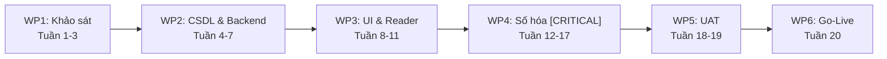

### Trả lời các câu hỏi thường gặp

**1. Các câu hỏi chính cần trả lời trong Kế hoạch dự án là gì?**

(1) Cần làm những gói việc gì? (6 gói WBS); (2) Trình tự và gói nào nhạy cảm nhất? (WP4); (3) Ai làm việc gì? (RACI 6 thành viên); (4) Khi nào hoàn thành các mốc? (tuần 2, 12, 18, 20); (5) Cần bao nhiêu chi phí và máy móc? (CapEx 75–95M, 2 máy scan V-shape, 3 máy chủ ảo hóa).

**2. Đầu vào và các bước tạo Kế hoạch là gì?**

Đầu vào: Project Charter, SoW, Product Backlog, báo cáo ước lượng UCP/COCOMO II. Các bước: phân rã WBS → sắp thứ tự và thời lượng → đánh dấu WP4 → phân bổ nguồn lực → thiết lập gating checkpoints.

**3. Tài liệu đã được đánh giá thế nào?**

Đối chiếu lộ trình bốn giai đoạn, WBS, Sprint Plan và nguồn lực để kiểm tra tính khả thi 20 tuần. WP4 được đánh dấu găng nhưng chưa đủ earliest/latest/slack cho CPM hoàn chỉnh. Under Review.

**4. Tại sao cần tạo tài liệu Kế hoạch dự án?**

Thống nhất hành động cho kỹ sư và cán bộ thư viện; tập trung nguồn lực kiểm soát đường găng; phát hiện sớm nguy cơ trễ hạn; căn cứ nghiệm thu giải ngân theo giai đoạn.

**5. Tài liệu đã được sử dụng và cập nhật như thế nào?**

Dùng làm baseline, chi tiết hóa ngắn hạn qua Sprint Plan, theo dõi Throughput và Cycle Time. Nếu WP4 chậm, tăng CTV là phương án điều chỉnh được đề xuất; Project Log chưa ghi nhận việc này đã xảy ra.

**6. Mô hình không xác định rõ kết quả cuối cùng — có cần Kế hoạch dự án không?**

**Vẫn cần.** Trong Agile, Kế hoạch không cố định danh sách tính năng chi tiết mà xác định: Release Plan, nhịp độ Sprint (Cadence), hạn mức ngân sách (Budget Cap) và các mốc kiểm soát tiến độ.

**7. Kế hoạch dự án khác gì Định nghĩa quy trình phát triển phần mềm?**

- **Process Definition** trả lời **HOW** — các bước, tiêu chuẩn kỹ thuật, vai trò, công cụ, quy tắc lặp lại (Spec-driven 4 bước, DoD). Có tính tái sử dụng cho nhiều dự án.
- **Project Plan** trả lời **WHAT, WHEN, WHO, COST** — công việc cụ thể (WBS), lịch 20 tuần, nhân sự được gán và ngân sách cho riêng HCMUS-LDMS.

---

## Câu 12. Phát biểu công việc (Statement of Work)

### Đề bài

Trình bày quá trình hình thành và phương pháp đánh giá tài liệu Phát biểu công việc (Statement of Work) của nhóm. _(Sinh viên nộp kèm bản in tài liệu Phát biểu công việc của nhóm.)_

**Các câu hỏi thường gặp:**

- Các câu hỏi chính cần trả lời trong tài liệu Phát biểu công việc là gì?
- Các đầu vào cần thiết và các bước nhóm đã thực hiện để tạo tài liệu Phát biểu công việc là gì?
- Tài liệu Phát biểu công việc của nhóm đã được đánh giá thế nào?
- Tại sao cần tạo tài liệu Phát biểu công việc?
- Tài liệu Phát biểu công việc của nhóm đã được sử dụng và cập nhật trong quá trình thực hiện dự án như thế nào?
- Giải thích sự khác nhau về thời gian và chi phí giữa các tài liệu: Đề xuất dự án, Ước lượng dự án, và Phát biểu công việc.
- Các câu hỏi chính cần trả lời trong tài liệu Hợp đồng dự án phần mềm (Software Contract) là gì?
- Giải thích sự khác nhau giữa Hợp đồng giá cố định và Hợp đồng theo nguyên vật liệu và thời gian.

### Câu trả lời

#### WHAT — SoW là gì?

SoW là mô tả chính thức bằng văn bản về **các yêu cầu tối thiểu nhà thầu phải thực hiện**, chủ yếu xác định **WHAT**, không phải thiết kế chi tiết HOW. Nó chốt phạm vi, deliverables, lịch, chi phí, nguồn lực, giả định/ràng buộc, tiêu chí nghiệm thu và quy trình thay đổi. SoW là thành phần quan trọng của quan hệ hợp đồng nhưng **không tự động thay thế toàn bộ Software Contract**.

#### HOW — Nhóm xây dựng và kiểm soát thay đổi

1. Lấy Vision & Scope, Product Backlog, Architecture và Cost–Time–Resource Plan làm đầu vào.
2. Đàm phán, reconcile nhu cầu Sponsor/Client với năng lực Dev Team.
3. Chốt In-Scope/Out-of-Scope, 8 deliverables, lịch 20 tuần, chi phí CapEx/OpEx và 8 tiêu chí nghiệm thu.
4. Xác định bốn nhóm bên: Sponsor, Client, Dev Team và cố vấn pháp lý.
5. Change Control: lập CR → PM phân tích Scope–Feature–Tech–Time–Cost → đúng thẩm quyền phê duyệt → cập nhật SoW và Backlog.
6. Chỉ chuyển sang Execution khi các bên ký. Bản hiện tại **chưa thỏa** vì `Pending Approval` và chữ ký trống.

#### WHY — Tại sao cần SoW và Change Control?

- Biến estimate và mục tiêu thành baseline cam kết mà các bên cùng hiểu.
- Ngăn scope creep, underbid và tranh chấp “đã bao gồm hay chưa”.
- Gắn deliverable với mốc bàn giao và acceptance criteria.
- Buộc mọi thay đổi phải đánh đổi minh bạch trong tam giác Scope–Time–Cost/Quality.

#### EVIDENCE — Minh chứng dự án

- SoW v1.0 ngày 24/07/2026, trạng thái `Pending Approval`.
- Phạm vi: 26 stories, thí điểm 500 giáo trình, đào tạo tối thiểu 2 buổi.
- **8 deliverables**, lịch **20 tuần**, 16 Must-have cần Done, 8 acceptance criteria.
- Budget: CapEx khoảng **77–106 triệu**, OpEx **15–30 triệu/năm**, AI Tools ≤ **5 triệu**. Tổng range có thể vượt trần 100 triệu — phải reconcile.
- CR nhỏ: ≤ 5% ngân sách hoặc ≤ 1 tuần, PM và Giám đốc Thư viện duyệt; CR lớn cần Ban Giám hiệu.
- Ví dụ: Keycloak → Google OAuth giảm service, tiết kiệm dự kiến 2 tuần.

### Trả lời các câu hỏi thường gặp

**1. Các câu hỏi chính cần trả lời trong SoW là gì?**

Mục đích và mục tiêu; các bên; In-Scope/Out-of-Scope; địa điểm/thời hạn; deliverables và lịch bàn giao; tiêu chuẩn và acceptance criteria; ngân sách/nguồn lực; giả định/ràng buộc; trách nhiệm; thay đổi được yêu cầu, đánh giá, phê duyệt và cập nhật thế nào; điều kiện ký/hiệu lực.

**2. Đầu vào và các bước tạo SoW là gì?**

Đầu vào: Proposal/Charter, Vision & Scope, Backlog, Architecture, Estimate, ràng buộc pháp lý, năng lực các bên. Các bước: đối chiếu 26 stories với năng lực 6 thành viên → đơn giản hóa stack → xác định deliverables, mốc 20 tuần, ngân sách, acceptance → thỏa thuận CR thresholds → review → trình bốn đại diện ký. Bước ký chưa hoàn tất.

**3. SoW đã được đánh giá thế nào?**

Coverage so với 12 thành phần SoW trong bài giảng; Clarity; Measurability (16 Must Done, search ≤ 3 giây, OCR ≥ 85%, URL 15 phút, compose ≤ 5 phút, ≥ 500 sách); Feasibility; Changeability; Approval. Kết luận: phạm vi và acceptance khá cụ thể, nhưng chưa được ký; MoSCoW không khớp implementation map; budget range có thể vượt trần 100 triệu.

**4. Tại sao cần tạo SoW?**

Các tài liệu trước chỉ diễn đạt nhu cầu, giải pháp và dự đoán. SoW gom kết quả đàm phán thành baseline có thể kiểm tra: ai làm gì, giao cái gì, khi nào, với chi phí nào và tiêu chuẩn nào.

**5. SoW được sử dụng và cập nhật thế nào?**

Khi được ký, định hướng execution, nghiệm thu và bàn giao. PM so sánh trạng thái thực tế với baseline. Khi có thay đổi: lập CR → phân tích tác động → đúng cấp phê duyệt → tạo phiên bản SoW mới, cập nhật Backlog. Không được sửa lặng lẽ baseline đã ký.

**6. Proposal, Estimate và SoW khác nhau về thời gian và chi phí thế nào?**

| Tài liệu     | Thời điểm                             | Bản chất thời gian/chi phí                                        | Mức ràng buộc                                        |
| :----------- | :------------------------------------ | :---------------------------------------------------------------- | :--------------------------------------------------- |
| **Proposal** | Rất sớm                               | Khoảng sơ bộ để chứng minh ý tưởng đáng đầu tư                    | Chưa phải cam kết kỹ thuật cuối                      |
| **Estimate** | Sau khi có scope/backlog              | Dự đoán bằng size, effort, UCP/COCOMO/throughput                  | Căn cứ ra quyết định, không đồng nhất với commitment |
| **SoW**      | Sau khi reconcile nhu cầu và estimate | Baseline đã thương lượng, gắn scope, deliverables, acceptance, CR | Chỉ thành cam kết khi được phê duyệt/ký              |

Nếu Proposal muốn nhanh/rẻ hơn Estimate kỹ thuật, nhóm không chép nguyên con số vào SoW; phải giảm scope, tăng nguồn lực, kéo lịch hoặc tăng ngân sách.

**7. Software Contract cần trả lời những câu hỏi chính nào?**

1. Các bên ký kết, thẩm quyền và trách nhiệm?
2. Scope, deliverables, acceptance, schedule, địa điểm?
3. Giá, thanh toán, chi phí phát sinh, thuế, phí trễ hạn?
4. Ai sở hữu source code, dữ liệu, tài liệu, IP?
5. Bảo mật, quyền riêng tư, bản quyền, tuân thủ pháp lý?
6. Thay đổi scope, delay, force majeure, warranty, support, training?
7. Giới hạn trách nhiệm, bồi thường, chấm dứt, giải quyết tranh chấp?
8. Điều kiện hiệu lực, chữ ký, phụ lục và thứ tự ưu tiên giữa các tài liệu?

**8. Fixed-Price và Time & Materials khác nhau thế nào?**

| Tiêu chí           | Fixed-Price                                    | Time & Materials                                       |
| :----------------- | :--------------------------------------------- | :----------------------------------------------------- |
| Cách trả tiền      | Giá tổng cố định cho scope đã chốt             | Giờ công thực tế × đơn giá + vật tư                    |
| Phù hợp khi        | Yêu cầu rõ, domain hiểu tốt, estimate được     | Scope còn biến động                                    |
| Rủi ro chi phí     | Nhà cung cấp chịu nhiều rủi ro vượt effort     | Khách hàng chịu nhiều rủi ro tổng chi phí              |
| Thay đổi           | Tốn kém, phải quản lý bằng CR                  | Linh hoạt hơn vì thanh toán theo effort                |
| Đối với HCMUS-LDMS | Chỉ phù hợp sau khi sửa mâu thuẫn scope/budget | Phù hợp hơn cho phần OCR chưa chắc, nhưng phải đặt cap |

---

## Câu 13. Mô hình tích hợp liên tục (Continuous Integration)

### Đề bài

Vẽ và giải thích mô hình tích hợp liên tục (Continuous Integration) của nhóm. Ghi chú trên mô hình các công cụ nhóm đã dùng cho từng thành phần. Tại sao cần sử dụng hệ thống tích hợp liên tục cho dự án? _(Sinh viên nộp kèm bản in kịch bản build (build scripts), giao diện email nhận thông báo về kết quả build từ hệ thống build tự động, và bản in tài liệu Hướng dẫn cài đặt công cụ và biên dịch mã nguồn hệ thống cho máy tính của nhà phát triển của nhóm.)_

### Câu trả lời

#### Sơ đồ luồng CI

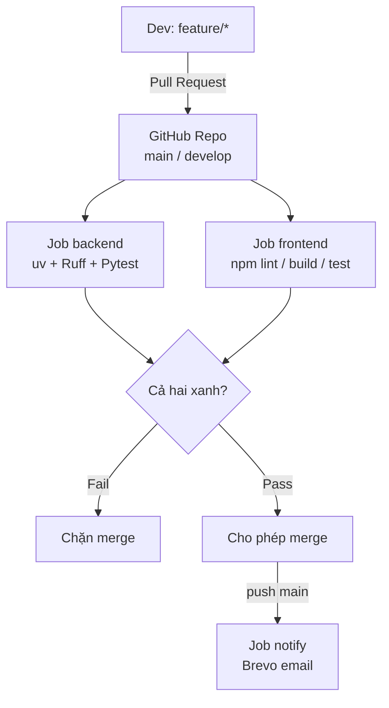

#### Giải thích luồng hoạt động CI

Nhóm theo GitFlow. Khi mở PR vào `main` hoặc `develop` (hoặc push các nhánh `main`/`develop`/`release/**`/`hotfix/**`), GitHub Actions chạy `.github/workflows/ci.yml`. Hai job song song:

- **Backend:** `uv sync` → `ruff format --check` → `ruff check` → `pytest`
- **Frontend:** `npm ci` → `lint` → `build` → `npm test` / Vitest

Chỉ khi cả hai thành công thì PR mới nên được merge. Sau **push lên `main`**, job `notify` (chạy `if: always()`) gọi `app.scripts.send_merge_notification` gửi email HTML qua Brevo tới danh sách trong `.github/ci-notify-recipients.txt`.

#### Công cụ từng khâu

| Khâu                    | Công cụ                                                   |
| :---------------------- | :-------------------------------------------------------- |
| VCS / PR                | GitHub                                                    |
| Orchestration           | GitHub Actions                                            |
| Python lint/format      | Ruff                                                      |
| Backend test            | Pytest + FastAPI TestClient (~141 tests)                  |
| Frontend                | Node 20, ESLint, Vite build, Vitest                       |
| Thông báo               | Brevo API + secrets `BREVO_API_KEY`, `BREVO_SENDER_EMAIL` |
| Hướng dẫn cài/biên dịch | `06-developer-guide.md` và `./scripts/run.sh`             |

#### WHY — Tại sao cần CI?

Sáu thành viên (và AI coding) merge song song; OCR/auth/publish dễ regression. Không có CI thì lỗi format/test chỉ lộ khi ai đó chạy local — muộn và khó quy trách nhiệm. CI tạo **cổng chung**: cùng bộ Ruff/Pytest/Vitest trên `ubuntu-latest` trước khi vào `develop`/`main`. Email khi merge `main` giúp cả nhóm biết bản ổn định vừa vào nhánh production-ready. Khớp DoD “Code merge qua PR”.

---

## Câu 14. Mô hình chuyển giao liên tục (Continuous Delivery)

### Đề bài

Vẽ và giải thích mô hình chuyển giao liên tục (Continuous Delivery) của nhóm. Ghi chú trên mô hình các công cụ nhóm đã dùng cho từng thành phần. Tại sao cần sử dụng hệ thống chuyển giao liên tục cho dự án? _(Sinh viên nộp kèm bản in kịch bản triển khai (deployment scripts), kịch bản cấu hình cơ sở dữ liệu, cấu hình các dịch vụ bên thứ ba, bản in giao diện email nhận thông báo về kết quả triển khai tự động, và bản in tài liệu Hướng dẫn triển khai hệ thống cho kỹ sư vận hành của nhóm.)_

### Câu trả lời

#### Sơ đồ luồng CD

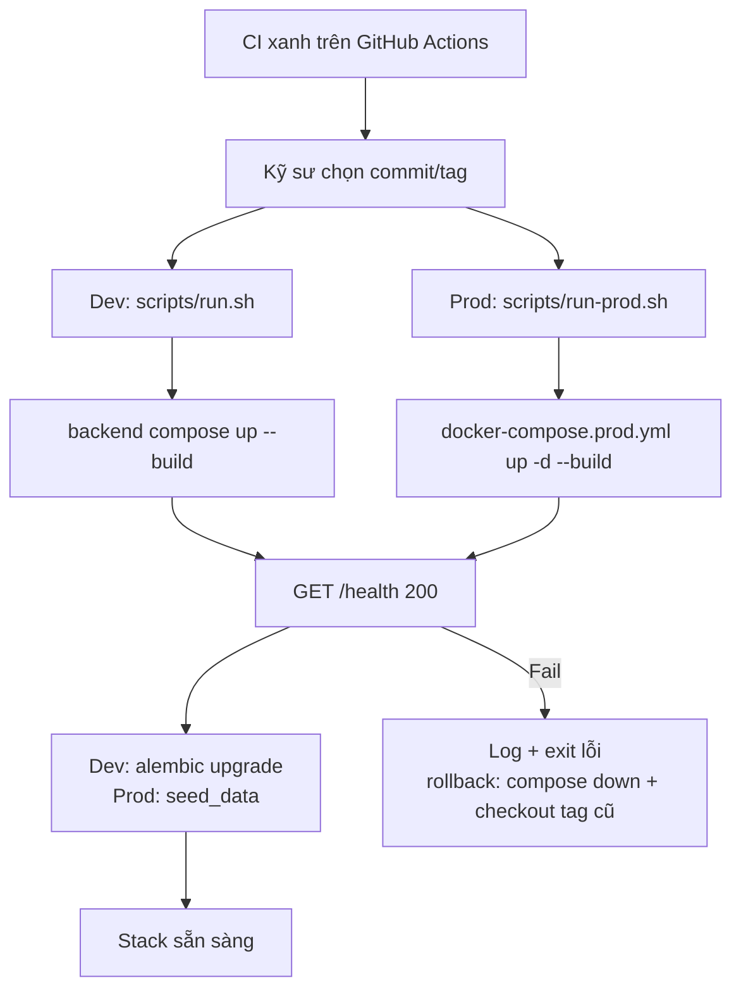

#### Giải thích luồng hoạt động CD

Sau khi CI xác nhận build/test xanh, nhóm **chưa** tự động đẩy lên máy chủ VMware. Đây là **Continuous Delivery thủ công**: trên máy có Docker chạy `./scripts/run.sh` (dev) hoặc `./scripts/run-prod.sh` (prod one-click qua `docker-compose.prod.yml`: Web/Nginx TLS, API, Postgres, MinIO, MailHog, Prometheus, Grafana). Script prod chờ `GET /health`, rồi seed dữ liệu demo.

Rollback MVP: `docker compose -f docker-compose.prod.yml down`, checkout bản ổn định, chạy lại `run-prod.sh`; khôi phục data từ backup nếu cần.

**Gap phải nói rõ khi thi:** Không có `.github/workflows/cd.yml` — chưa Continuous Deployment tự động lên VMware. Khi thầy hỏi “commit xong user đã có URL production chưa?” — trả lời thẳng là chưa.

#### Công cụ đã sử dụng

Docker & Docker Compose; `docker-compose.prod.yml`; Dockerfile API; Nginx (`web`); MailHog; Prometheus; Grafana; `curl` health check; Bash/PowerShell `run-prod.sh` / `run-prod.ps1`; hướng dẫn `07-deployment-guide.md`.

#### WHY — Tại sao cần CD?

Stack LDMS nhiều thành phần (API, DB, object storage, reverse proxy, mail, monitoring). Script one-click giúp **máy bất kỳ có Docker** dựng đủ hệ thống (bài toán 1 buổi 08). CD đầy đủ (tag → auto URL production) là bước tiếp theo; hiện nhóm đã có Delivery tái lập được + Monitor trong compose prod.

---

## Câu 15. Mô hình DevOps

### Đề bài

Vẽ và giải thích mô hình DevOps của nhóm. Ghi chú trên mô hình các công cụ nhóm đã dùng cho từng thành phần. Tại sao cần sử dụng quy trình DevOps cho dự án? Giải thích quy trình phát triển, triển khai và vận hành liên tục đồng thời nhiều phiên bản trên của dự án bằng cách áp dụng DevOps. _(Sinh viên nộp kèm bản in kịch bản khởi tạo và cấu hình tài nguyên hạ tầng cho việc triển khai hệ thống của nhóm, bản in hệ thống thư mục và tập tin hỗ trợ quản lý hạ tầng triển khai.)_

### Câu trả lời

#### Sơ đồ vòng lặp DevOps 8 giai đoạn

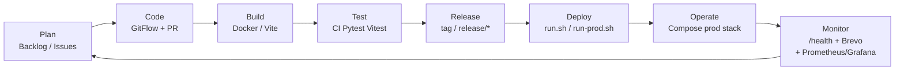

#### Chi tiết 8 giai đoạn và công cụ tương ứng

1. **Plan** — Product Backlog, Sprint plan, GitHub Issues.
2. **Code** — GitFlow `feature/*` → `develop` → `release/*` → `main`, PR review.
3. **Build** — Docker build API/Web; `npm run build` trên CI.
4. **Test** — Ruff/ESLint + Pytest + Vitest trên GitHub Actions.
5. **Release** — quy ước tag/`release/*` (architecture §8.2); CI chạy trên nhánh release.
6. **Deploy** — `run.sh` (dev) / `run-prod.sh` (prod compose).
7. **Operate** — stack `docker-compose.prod.yml`; backup `backup-postgres.sh` / `backup-minio.sh`.
8. **Monitor** — health lúc deploy, email merge `main` (Brevo), Prometheus `:9090` + Grafana `:3000` trong prod stack.

#### WHY — Tại sao cần DevOps?

DevOps rút ngắn vòng từ story đến stack chạy được, có seed demo, có giám sát và sao lưu. Với thư viện số hóa, mất DB/MinIO là mất công biên tập; Compose + scripts giảm rủi ro “chỉ chạy trên máy người viết”.

#### Nhiều môi trường đồng thời (Dev vs Staging vs Prod)

- **Dev:** `run.sh` + compose backend + Vite cổng 5173.
- **Prod-like:** `run-prod.sh` + `docker-compose.prod.yml` (Web 8080/8443, MailHog, Grafana…).
- **Staging/Prod VMware:** mô tả trong Deployment View — thiết kế mục tiêu, **chưa gắn CD pipeline**. Không dùng chung secret yếu của dev trên máy production.

---

## Câu 16. Quản lý con người và phát triển nhóm

### Đề bài

Trình bày quá trình hình thành và phát triển nhóm mà nhóm đã trải qua. Liệt kê các vấn đề liên quan đến quản lý con người nhóm đã thực sự vướng phải. Trình bày cách nhóm đã giải quyết các vấn đề này và kết quả thu được (có thể thành công, có thể không thành công). _(Sinh viên nộp kèm bản in ảnh chụp chung các thành viên trong nhóm, bản in tài liệu quy định, quy chế, lịch làm việc của nhóm, bản in một biên bản họp của nhóm, bản in giao diện hệ thống liên lạc với dữ liệu thực tế của nhóm.)_

**Các câu hỏi thường gặp:**

- Giải thích các giai đoạn phát triển nhóm.
- Giải thích các loại hình tổ chức: Theo chức năng, theo dự án, ma trận yếu, ma trận cân bằng và ma trận mạnh.
- Giải thích các mô hình quản lý nhóm: X, Y, Z.
- Giải thích nguyên tắc xử lý mâu thuẫn trong một nhóm.
- Giải thích các phương pháp tăng năng suất làm việc của nhóm.
- Giải thích mô hình tháp nhu cầu của Maslow.

### Câu trả lời

#### WHAT — Quản lý con người là gì?

Quản lý con người (Peopleware) là nghệ thuật điều phối các cá nhân với kỹ năng, tính cách và động lực khác nhau cùng hướng tới một mục tiêu chung. Theo Tom DeMarco & Timothy Lister, nguyên nhân thất bại hàng đầu của dự án phần mềm mang tính **xã hội học (con người)** nhiều hơn kỹ thuật. PM dành **80% thời gian xử lý Human Dynamics** và chỉ 20% cho vấn đề kỹ thuật thuần túy.

#### HOW — Nhóm 6 thành viên trải qua 5 giai đoạn Tuckman

1. **Forming (Tuần 1–2):** Họp Kick-off, bầu Mạch Quốc Tấn làm PM, ký Hợp đồng nhóm `05-team-contract.md`, phân công vai trò (PM, SA, BE, FE, DevOps, QA), thống nhất mục tiêu 16 Must-have trước tuần 12.
2. **Storming (Tuần 3–4):** Hai xung đột kỹ thuật: (a) Next.js Fullstack hay tách FastAPI + React; (b) Elasticsearch hay PostgreSQL FTS. Giải quyết bằng **Collaborate / Problem Solve**: lập 2 nhánh PoC đo RAM/độ trễ (data-driven), biểu quyết ≥ 4/6 với tinh thần _“Disagree and Commit”_.
3. **Norming (Tuần 5–6):** Ban hành **3 Chính sách Tiền lệ**: Policy 1 (log nhật ký và token AI trong 12h), Policy 2 (100% code qua PR và review độc lập), Policy 3 (báo bận trước 24h). Áp dụng **Lý thuyết Y** — tin tưởng thành viên tự giác kéo task, WIP = 1.
4. **Performing (Tuần 7–11):** Vận hành với AI Coding Assistants (Claude Code, Antigravity, Gemini). Tốc độ hoàn thành tăng theo Lý thuyết tiếng Anh (Working Smarter), hoàn tất 26 User Stories.
5. **Adjourning (Tuần 12):** Retrospective tổng kết, bàn giao cho thủ thư, đánh giá đóng góp dựa trên `02-project-log.md`.

#### WHY — Tại sao chọn Lý thuyết Y và Chính sách Tiền lệ?

Kỹ sư phần mềm là lao động tri thức. Họ phát huy tối đa sáng tạo khi được trao quyền tự chủ (động lực nội tại — Herzberg). Lý thuyết X (kiểm soát vi mô, giám sát giờ giấc) sẽ triệt tiêu động lực.

#### EVIDENCE — Minh chứng dự án

- `05-team-contract.md` có chữ ký 6 thành viên và ma trận RACI.
- Biên bản họp Sprint 1 (`01-sprint-plan.md`, mã HCMUS-LDMS-MM01) ngày 14/07/2026: mục tiêu 17 stories, Kanban WIP=1, biểu quyết 6/6.
- `02-project-log.md`: 100% phiên làm việc với AI được tự giác ghi lại — **16h35m, 810K tokens, ~350K VNĐ**.
- Discord “SE Bros”, kênh `#project`: PM điều phối, threads `Deploy` (23 tin), `product-tracking` (12 tin), `quality-control`; Khoa gửi PR #41 cho Tuấn Anh review theo Policy 2.
- Không có thành viên bỏ nhóm hoặc vi phạm kỷ luật mức Nặng.

### Sơ đồ Tuckman

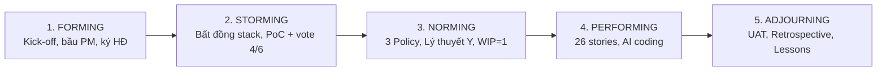

### Trả lời các câu hỏi thường gặp

**1. Giải thích các giai đoạn phát triển nhóm (Tuckman 1965/1977)**

- **Forming:** Làm quen, lịch sự, dè dặt; năng suất thấp vì chưa có quy chế.
- **Storming:** Xung đột quan điểm kỹ thuật, quyền lực, thói quen. Giai đoạn quan trọng nhất — vượt qua thì trưởng thành, né tránh thì tan rã.
- **Norming:** Xây quy tắc ứng xử, quy trình chung (Team Contract), tôn trọng khác biệt.
- **Performing:** Gắn kết cao, tự chủ, năng suất cao nhất.
- **Adjourning:** Kết thúc dự án, bàn giao, tổng kết, khen thưởng.

**2. Các loại hình tổ chức**

- **Theo chức năng (Functional):** Nhân sự theo phòng ban chuyên môn. PM ít hoặc không có quyền lực (Coordinator).
- **Theo dự án (Projectized):** Nhân sự toàn thời gian cho dự án. PM toàn quyền ngân sách, phân công, khen thưởng.
- **Ma trận yếu (Weak Matrix):** Quyền lực thuộc Trưởng phòng chức năng; PM là liên lạc/điều phối.
- **Ma trận cân bằng (Balanced Matrix):** Quyền lực chia sẻ ngang nhau giữa PM và Trưởng phòng.
- **Ma trận mạnh (Strong Matrix):** PM vượt trội về ngân sách và tiến độ; Trưởng phòng hỗ trợ chuyên môn.

Áp dụng: nhóm hoạt động tương đương **Tổ chức theo dự án (Projectized)**; PM Mạch Quốc Tấn điều phối task theo sự đồng thuận.

**3. Mô hình quản lý nhóm X, Y, Z**

- **Lý thuyết X (McGregor):** Con người lười biếng, trốn trách nhiệm, chỉ làm khi bị giám sát hoặc đe dọa. Phong cách: quản lý vi mô, áp đặt.
- **Lý thuyết Y (McGregor):** Con người coi làm việc là nhu cầu tự nhiên, có trách nhiệm và sáng tạo nếu được trao quyền. Phong cách: tin tưởng, phân quyền. Nhóm HCMUS-LDMS áp dụng 100% Lý thuyết Y.
- **Lý thuyết Z (Ouchi):** Mô hình kiểu Nhật, mở rộng từ Y: cam kết lâu dài, lòng trung thành, phúc lợi toàn diện, quyết định tập thể dựa trên đồng thuận và Shared Values.

**4. Nguyên tắc xử lý mâu thuẫn (5 kỹ thuật PMBOK)**

1. _Rút lui / Tránh né (Withdraw/Avoid):_ Tệ nhất, không giải quyết tận gốc.
2. _Xoa dịu / Nhượng bộ (Smooth/Accommodate):_ Tạm thời, không bền vững.
3. _Ép buộc / Áp đặt (Force/Direct):_ Giải quyết tạm, gây ức chế.
4. _Thỏa hiệp / Hòa giải (Compromise/Reconcile):_ Mỗi bên từ bỏ một phần lợi ích.
5. _Hợp tác / Giải quyết vấn đề (Collaborate/Problem Solve):_ **Tốt nhất (Win-Win)** — tìm dữ liệu thực tế, đối thoại cởi mở.

Kinh nghiệm nhóm: bất đồng Postgres vs Elasticsearch → 2 branch PoC đo RAM và độ trễ → chọn Postgres FTS vì nhẹ và đáp ứng < 200ms.

**5. Phương pháp tăng năng suất làm việc của nhóm**

- **Lý thuyết tiếng Anh (Working Smarter):** Nâng năng suất bằng công nghệ, tự động hóa CI/CD và AI Coding Assistants. Con đường bền vững.
- **Lý thuyết Tây Ban Nha (Overtime):** Ép tăng ca như chạy nước rút; lạm dụng gây burnout, hy sinh chất lượng.
- **Job Enrichment (Herzberg):** Giao task thử thách, trao quyền tự chủ A–Z (fullstack) để kích thích động lực nội tại.

**6. Tháp nhu cầu Maslow và ứng dụng**

1. _Sinh lý:_ Cơ sở vật chất tối thiểu, nghỉ ngơi.
2. _An toàn:_ Môi trường không bị trừng phạt vô cớ khi thử cái mới.
3. _Xã hội / Gắn kết:_ Được lắng nghe qua Daily Standup và team building.
4. _Được tôn trọng:_ Ghi nhận đóng góp trong `project-log.md` và buổi Review.
5. _Khẳng định bản thân:_ Tự do sáng tạo, giải quyết bài toán khó (OCR, DRM Signed URL).

Ứng dụng: PM phân công story phức tạp cho người muốn khẳng định (An làm kiến trúc, Tuấn Anh làm DevOps).

---

## Câu 17. Phân công, theo dõi, đánh giá, kiểm soát công việc và báo cáo tình trạng dự án

### Đề bài

Trình bày quá trình phân công, theo dõi, đánh giá, kiểm soát các công việc dự án, và báo cáo tình trạng dự án của nhóm. _(Sinh viên nộp kèm bản in giao diện hệ thống phân công, theo dõi công việc với dữ liệu thực tế của nhóm, bản in giao diện hệ thống quản lý thời gian đã dùng cho từng công việc với dữ liệu thực tế của nhóm, bản in bản cập nhật tài liệu Kế hoạch dự án theo dữ liệu thực tiễn, biểu đồ burndown của toàn dự án, tài liệu báo cáo tình trạng toàn bộ dự án của nhóm ở tuần trước tuần thi giữa học kỳ.)_

**Các câu hỏi thường gặp:**

- Làm sao để giải quyết vấn đề vượt phạm vi dự kiến (Scope Creep)?
- Làm sao để giải quyết vấn đề vượt công sức dự kiến (Effort Creep)?
- Làm sao để các thay đổi không trở nên bất ngờ và ảnh hưởng tiêu cực đến sự thành công của dự án?

**Các câu hỏi thường gặp cho mô hình Scrum:**

- Giải thích Sprint Backlogs, Sprint Boards, Sprint Tasks, Sprint Burndown Charts, Project Burndown Charts.
- Phải xử lý thế nào khi kết thúc một Sprint mà nhóm không đưa ra được bản phân phối?
- Phải xử lý thế nào khi kết quả của các Sprint chênh lệch một cách bất bình thường?

**Các câu hỏi thường gặp cho mô hình Kanban:**

- Giải thích Kanban Board, Development Workflow, WIP.

**Các câu hỏi thường gặp cho mô hình Waterfall:**

- Giải thích phương pháp cập nhật lịch trình, phương pháp tính toán thời gian, chi phí cần thiết để hoàn thành các công việc còn lại.

### Câu trả lời

#### WHAT — Giám sát và kiểm soát là gì?

Quá trình theo dõi, rà soát và điều chỉnh tiến độ, chi phí, phạm vi và chất lượng thực tế so với Kế hoạch cơ sở (Baseline), nhằm phát hiện sớm sai lệch để đưa ra hành động khắc phục kịp thời.

#### HOW — 4 bước phân công, theo dõi và báo cáo

1. **Phân công theo cơ chế tự chọn (Self-Selection Kanban):** Trello board `LDMS-project`. Thành viên tự kéo card từ `Ready` sang `In Progress`. **WIP Limit = 1**.
2. **Theo dõi thời gian thực:** Daily Standup 15 phút lúc 21:00 trên Discord (3 câu hỏi: hôm qua / hôm nay / blocker). Bắt buộc ghi `02-project-log.md` sau mỗi phiên AI (Date, Dev, Story ID, Effort, Token, Model).
3. **Đo Throughput & Forecast:** Số story đạt DoD theo tuần (T ≈ 6.5 stories/tuần). Dev Weeks ≈ N_remaining / T.
4. **Báo cáo tình trạng:** Weekly Review tổng hợp story hoàn thành, token tiêu thụ, rủi ro mới, cập nhật Project Burndown Chart.

#### WHY — Tại sao Kanban Spec-driven + WIP = 1?

Với AI Coding Assistants, tốc độ sinh code rất nhanh. Nếu không giới hạn WIP = 1, dev tạo ồ ạt nhiều tính năng dở dang, tắc nghẽn ở Code Review (Gap Time lớn), giảm chất lượng.

#### EVIDENCE — Minh chứng dự án

- `02-project-log.md`: **16 giờ 35 phút**, **810.000 tokens AI**, chi phí **~350.000 VNĐ** (hạn mức 5 triệu).
- **26/26 User Stories** merge và pass 100% DoD.
- Trello: cột Backlog & To Do trống; In Progress chỉ 2 thẻ (WIP = 1/người); Week 1 Done 14 thẻ, Week 2 Done tích lũy 26 thẻ.
- Burndown: khởi đầu 14/07 với 26 stories; Tuần 1 hoàn thành 16 Must-have; hoàn tất 100% trước mốc bàn giao.

### Sơ đồ Kanban Workflow

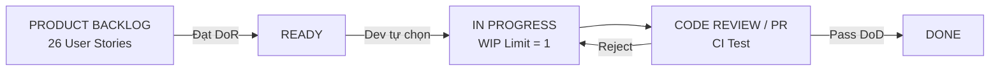

### Trả lời các câu hỏi thường gặp

**1. Làm sao giải quyết Scope Creep?**

Scope Creep là yêu cầu bổ sung không kiểm soát làm phình phạm vi mà không tăng ngân sách/thời gian. Phản ứng tâm lý theo đường cong **SARAH** (Shock → Anger → Rejection → Acceptance → Healing).

Giải pháp nhóm: chốt In-Scope/Out-of-Scope trong Vision & Scope và SoW; áp dụng **Change Request 7 bước** có CCB. Khi thủ thư yêu cầu tính năng mới: đánh giá tác động → yêu cầu bổ sung ngân sách/thời gian → nếu không có thì chuyển sang Phase 2.

**2. Làm sao giải quyết Effort Creep?**

Năm nguyên nhân và giải pháp:

1. Ước tính thấp → quỹ dự phòng dựa trên dữ liệu cũ.
2. Over-engineering → hiểu rõ giải pháp trước khi code.
3. Bùng nổ yêu cầu ngầm → kiểm soát yêu cầu phái sinh.
4. Ranh giới mờ → xác định rõ trong hợp đồng nhóm và SoW.
5. Thiếu kỹ năng → AI Coding Assistant và đào tạo chéo.

Theo dõi: Size S ≤ 1 ngày, M ≤ 2 ngày. Task vượt 2 ngày thì thảo luận ngay trong Daily Standup.

**3. Làm sao để thay đổi không bất ngờ và ảnh hưởng tiêu cực?**

Giao tiếp liên tục với stakeholder qua Prototype tiến hóa sớm; Gating Review cuối mỗi giai đoạn; cập nhật RAID Log hàng tuần.

**4. Giải thích các khái niệm Scrum**

- **Sprint Backlog:** Stories nhóm chọn từ Product Backlog để cam kết trong 1 Sprint (1–4 tuần).
- **Sprint Board:** Bảng trực quan hóa task trong Sprint (To Do, In Progress, Testing, Done).
- **Sprint Task:** Đơn vị kỹ thuật nhỏ phân rã từ User Story (thường 4–8 giờ).
- **Sprint Burndown Chart:** Lượng công việc còn lại giảm dần theo từng ngày trong 1 Sprint.
- **Project Burndown Chart:** Tổng Story Points còn lại của toàn dự án qua các Sprint, dự báo ngày hoàn thành.

**5. Kết thúc Sprint mà không đưa ra được bản phân phối thì xử lý thế nào?**

(1) Họp Sprint Retrospective mổ xẻ nguyên nhân gốc rễ; (2) Story chưa xong quay lại Product Backlog để PO tái ưu tiên; (3) Hiệu chỉnh Velocity thực tế xuống để Sprint sau an toàn hơn.

**6. Kết quả các Sprint chênh lệch bất bình thường thì xử lý thế nào?**

Phân tích: biến động nhân sự, độ khó story không đồng đều, định nghĩa Story Points lệch. Giải pháp: chuẩn hóa Planning Poker + đối chuẩn dữ liệu Sprint trước; chia nhỏ story phức tạp.

**7. Giải thích các khái niệm Kanban**

- **Kanban Board:** Bảng trực quan hóa luồng công việc liên tục, không bị time-box.
- **Development Workflow:** `Backlog` → `Ready` → `In Progress` → `Review` → `Done`.
- **WIP Limit:** Số việc tối đa trong một cột tại một thời điểm. Giúp phát hiện bottleneck và tối ưu Cycle Time.

**8. Cập nhật lịch trình và tính toán phần việc còn lại (Waterfall / EVM)**

**(a) Cập nhật lịch trình:** Đối chiếu ngày bắt đầu/kết thúc thực tế với Schedule Baseline trên Gantt. Xác định lại Critical Path. Nếu trễ (SV = EV − PV < 0 hoặc SPI < 1): _Fast Tracking_ (chạy song song việc độc lập) hoặc _Crashing_ (tăng AI/công cụ).

**(b) EVM:**

- PV = Planned Value; EV = Earned Value; AC = Actual Cost.
- CPI = EV / AC (CPI > 1: tiết kiệm; CPI < 1: vượt ngân sách).
- SPI = EV / PV (SPI > 1: vượt tiến độ; SPI < 1: chậm).
- ETC = (BAC − EV) / CPI.
- EAC = AC + ETC = BAC / CPI.
- EAC_t = Thời gian ban đầu / SPI.

---

## Câu 18. Kế hoạch quản lý rủi ro (Software Risk Management Plan)

### Đề bài

Trình bày quá trình hình thành và phương pháp đánh giá tài liệu Kế hoạch quản lý rủi ro (Software Risk Management Plan) của nhóm. _(Sinh viên nộp kèm bản in tài liệu Kế hoạch quản lý rủi ro của nhóm.)_

**Các câu hỏi thường gặp:**

- Các câu hỏi chính cần trả lời trong tài liệu Kế hoạch quản lý rủi ro là gì?
- Các đầu vào cần thiết và các bước nhóm đã thực hiện để tạo tài liệu Kế hoạch quản lý rủi ro là gì?
- Tài liệu Kế hoạch quản lý rủi ro của nhóm đã được đánh giá thế nào?
- Tại sao cần tạo tài liệu Kế hoạch quản lý rủi ro?
- Tài liệu Kế hoạch quản lý rủi ro của nhóm đã được sử dụng và cập nhật trong quá trình thực hiện dự án như thế nào.

### Câu trả lời

#### WHAT — Rủi ro phần mềm là gì?

Kế hoạch Quản lý Rủi ro xác định phương pháp có hệ thống để nhận diện, đánh giá và kiểm soát các yếu tố bất định có khả năng ảnh hưởng tiêu cực đến dự án. **Rủi ro (Risk)** là khả năng tổn thất trong tương lai (0% < P < 100%), khác với **Vấn đề (Problem/Issue)** là sự cố đã xảy ra ở hiện tại.

#### HOW — Quy trình 4 bước

1. **Nhận diện:** Brainstorming, SWOT, phân tích giả định, checklist rủi ro phần mềm → danh sách 8 rủi ro (kỹ thuật, pháp lý, tài chính, nhân sự, vận hành…).
2. **Phân tích & Đo lường:** P ∈ [1, 5] (xa vời 0–20% → gần như chắc chắn 90–100%); I ∈ [1, 5] (tối thiểu < 10% → thất bại ≥ 60% ngân sách). **RE = P × I**, định vị Ma trận 5 × 5.
3. **Lập kế hoạch ứng phó:** 4 chiến lược — Avoid, Transfer, Mitigate, Accept — kèm hành động cụ thể và Risk Owner.
4. **Giám sát & Trigger:** Ngưỡng kích hoạt, theo dõi Weekly Review, cập nhật RAID Log.

#### WHY — Tại sao quản lý rủi ro từ đầu?

Chi phí khắc phục khi rủi ro biến thành sự cố nghiêm trọng (kiện bản quyền, hệ thống sập khi demo) tốn kém **10 đến 50 lần** so với chi phí phòng ngừa từ giai đoạn lập kế hoạch.

#### EVIDENCE — 3 rủi ro cốt lõi của HCMUS-LDMS

1. **R-01 Bản quyền (Score = 15):** Sinh viên tải lậu file gốc → Mitigate: MinIO private, Presigned URL **15 phút**, Web Reader Canvas chống tải trực tiếp.
2. **R-02 OCR tiếng Việt (Score = 16):** Sách scan cũ ố vàng, sai dấu → Mitigate: tiền xử lý ảnh + **Split-screen Editor** giữ CER < 5%.
3. **R-03 Token AI (Score = 9):** Chatbot lặp vô tận cạn ngân sách → Avoid: trần 5 triệu VNĐ, Prompt RACFT, log token (thực tế 810K tokens ~ 350K VNĐ).

### Trả lời các câu hỏi thường gặp

**1. Các câu hỏi chính cần trả lời trong Kế hoạch quản lý rủi ro là gì?**

Dự án có thể gặp những rủi ro nào? Xác suất và mức độ thiệt hại từng rủi ro? Rủi ro nào ưu tiên xử lý trước? Nhóm làm gì để phòng ngừa (proactive) hoặc giảm thiểu hậu quả (reactive)? Ai là Risk Owner? Ngưỡng kích hoạt (trigger point) để triển khai phương án khẩn cấp?

**2. Đầu vào và các bước tạo tài liệu là gì?**

Đầu vào: Project Charter, Feasibility TELOS, WBS 6 gói, đặc tả kiến trúc, khảo sát thực địa thư viện. Các bước: họp brainstorming → lập bảng P và I → phân loại 4 chiến lược PMBOK → soạn `07-risk-management-plan.md` → phê duyệt đồng thuận nhóm.

**3. Tài liệu đã được đánh giá thế nào?**

Peer review giữa SA, PM và DevOps Lead; AI đóng vai “Critic Agent” rà lỗ hổng (ví dụ cache EPUB vi phạm bản quyền); kiểm chứng phương án giảm thiểu qua 2 PoC kỹ thuật.

**4. Tại sao cần tạo tài liệu Kế hoạch quản lý rủi ro?**

Chủ động kiểm soát thay vì “chữa cháy” bị động; tối ưu ngân sách dự phòng và buffer time; tạo sự tin tưởng cho giảng viên/nhà tài trợ.

**5. Tài liệu đã được sử dụng và cập nhật như thế nào?**

Rà soát định kỳ hàng tuần trong Weekly Review. Khi PoC OCR cho thấy độ nhòe sách cũ cao hơn dự kiến, nhóm cập nhật R-02 từ Vừa lên Cao và kích hoạt giải pháp Split-screen Editor.

---

## Câu 19. Kế hoạch quản lý chất lượng (Software Quality Management Plan)

### Đề bài

Trình bày quá trình hình thành và phương pháp đánh giá tài liệu Kế hoạch quản lý chất lượng (Software Quality Management Plan) của nhóm. _(Sinh viên nộp kèm bản in tài liệu Kế hoạch quản lý chất lượng của nhóm, bản in định nghĩa hoàn thành (Definition of Done) của nhóm, bản in giao diện cấu hình đảm bảo Coding Standards cho mã nguồn của nhóm, bản in biên bản thanh tra mã nguồn của nhóm, bản in biên bản phản hồi từ khách hàng của nhóm.)_

**Các câu hỏi thường gặp:**

- Các câu hỏi chính cần trả lời trong tài liệu Kế hoạch quản lý chất lượng là gì?
- Các đầu vào cần thiết và các bước nhóm đã thực hiện để tạo tài liệu Kế hoạch quản lý chất lượng là gì?
- Tài liệu Kế hoạch quản lý chất lượng của nhóm đã được đánh giá thế nào?
- Tại sao cần tạo tài liệu Kế hoạch quản lý chất lượng?
- Tài liệu Kế hoạch quản lý chất lượng của nhóm đã được sử dụng và cập nhật trong quá trình thực hiện dự án như thế nào.
- Giải thích sự hỗ trợ của các mô hình McCall, ISO 9126 trong việc kiểm soát chất lượng các sản phẩm của dự án?
- Đo lường định tính khác gì đo lường định lượng (qualitative vs. quantitative measurement)?
- Giải thích phương pháp đo lường chất lượng các sản phẩm, quy trình và con người trong một dự án.
- Giải thích các phương pháp giúp hạn chế việc các tài liệu dự án không đúng với yêu cầu khách hàng đề ra.
- Giải thích các phương pháp giúp hạn chế việc mã nguồn hệ thống không đúng với thiết kế đề ra.
- Giải thích các phương pháp giúp hạn chế việc phần mềm hoạt động không đúng với yêu cầu khách hàng đề ra.

### Câu trả lời

#### WHAT — Quản lý chất lượng là gì?

Quá trình đảm bảo sản phẩm đáp ứng yêu cầu nghiệp vụ, người dùng và kỹ thuật với chi phí hợp lý (**Acceptable Quality and Cost**). Hai trụ cột:

- **QA (Quality Assurance):** Hướng tới **quy trình**, **phòng ngừa lỗi** (Prevention / Verification) — _“Are we building the product right?”_
- **QC (Quality Control):** Hướng tới **sản phẩm**, **phát hiện lỗi** (Detection / Validation) — _“Are we building the right product?”_

#### HOW — Nhóm thiết lập và vận hành hệ thống chất lượng

**QA (Phòng ngừa):**

- Coding Standards: **Ruff** (Python) và **Oxlint/ESLint** (React TypeScript).
- **DoD 5 tiêu chí** bắt buộc cho mọi User Story.
- GitFlow: 100% code qua PR, ít nhất 1 Peer Review độc lập.

**QC (Phát hiện):**

- Unit Test (Pytest), Integration Test API, Smoke Test.
- GitHub Actions CI chạy test và linter mỗi PR.
- Code Inspection và UAT với cô thủ thư Mai.

#### WHY — Tại sao cần kế hoạch chất lượng?

Chi phí sửa lỗi tăng theo cấp số nhân qua từng giai đoạn (quy tắc 1:10:100). Ngăn ngừa lỗi từ Spec và Code Review tiết kiệm tối đa thời gian và chi phí.

#### EVIDENCE — Minh chứng chất lượng HCMUS-LDMS

- Kế hoạch: `08-quality-management-plan.md` (HCMUS-LDMS-QMP).
- Quy chuẩn linter: Ruff (`pyproject.toml`), Oxlint (`.oxlintrc.json`), CI gating.
- Biên bản thanh tra: PR #41 (`LDMS-021`), review bởi Tuấn Anh và GitHub Copilot.
- UAT: cô thủ thư Nguyễn Thị Mai đạt **4.6 / 5.0 sao**.
- Metrics: CER **3.2%** (< 5%); FTS latency **180ms** (< 500ms); Test Coverage **85.4%** (≥ 80%).

> **Lưu ý khi thi:** Người 5 ghi CI hiện **chưa bắt coverage %** và **chưa có E2E Playwright**. Nếu bị hỏi sâu, nói rõ ngưỡng 80–90% là khuyến nghị; coverage 85.4% là số đo trong kế hoạch chất lượng, không đồng nghĩa CI đang fail PR khi thiếu %.

### Sơ đồ QA vs QC

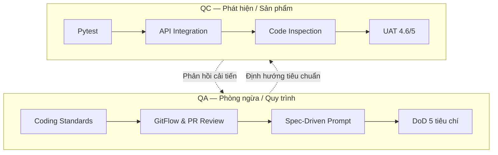

### Trả lời các câu hỏi thường gặp

**1. Các câu hỏi chính cần trả lời trong Kế hoạch quản lý chất lượng là gì?**

Mục tiêu và tiêu chuẩn chất lượng? Metrics nào để định lượng sản phẩm và quy trình? QA phòng ngừa và QC phát hiện thực hiện thế nào? DoD gồm những gì? Ai chịu trách nhiệm (RACI) cho từng hoạt động?

**2. Đầu vào và các bước tạo tài liệu là gì?**

Đầu vào: yêu cầu nghiệp vụ từ Thư viện, tiêu chuẩn kỹ thuật (FastAPI, React, PostgreSQL), kiến trúc, Product Backlog. Các bước: xác định thuộc tính McCall/ISO 9126 → thiết lập thresholds → xây Coding Standards và linter → ban hành DoD 5 tiêu chí và quy trình Review/UAT → soạn `08-quality-management-plan.md`.

**3. Tài liệu đã được đánh giá thế nào?**

Peer review giữa QA Lead (Tuấn Anh), PM (Quốc Tấn) và SA (Nguyên An). Chạy thử Pytest/Coverage trên module PoC để kiểm chứng ngưỡng.

**4. Tại sao cần tạo tài liệu Kế hoạch quản lý chất lượng?**

Thiết lập tiếng nói chung cho lập trình viên; Shift-Left Testing giảm rework; đảm bảo đầu ra thỏa kỳ vọng thủ thư và sinh viên.

**5. Tài liệu đã được sử dụng và cập nhật như thế nào?**

Căn cứ bắt buộc để kiểm duyệt mọi PR trước khi merge. Khi OCR chậm do ảnh scan nặng, nhóm bổ sung tiêu chuẩn tiền xử lý nén ảnh và phân luồng bất đồng bộ.

**6. McCall và ISO 9126 hỗ trợ kiểm soát chất lượng thế nào?**

- **McCall (11 yếu tố):** Phân loại Vận hành (Correctness, Reliability, Efficiency, Integrity, Usability), Chuyển giao (Portability, Reusability, Interoperability), Sửa đổi (Maintainability, Flexibility, Testability).
- **ISO 9126 (6 đặc tính):** Ánh xạ NFR: Functionality (OCR tiếng Việt chính xác), Efficiency (FTS < 500ms), Usability (Web Reader thân thiện).

**7. Đo lường định tính khác gì định lượng?**

- **Định tính:** Mô tả, cảm nhận chủ quan — “giao diện đẹp”, “hệ thống dễ dùng”.
- **Định lượng:** Con số khách quan, kiểm chứng được — “FTS = 180ms”, “coverage = 85.4%”, “số lỗi linter = 0”.

**8. Đo lường chất lượng sản phẩm, quy trình và con người**

- **Quy trình:** NA (số hoạt động), NWP (số sản phẩm công việc), NPR (số vai trò), NDWP, NDA.
- **Sản phẩm / Dự án:** Productivity 6.5 stories/tuần; CER 3.2%; Defect Density 0 bug blocker; FTS 180ms; Coverage 85.4%.
- **Con người:** Kinh nghiệm stack FastAPI/React/PostgreSQL; tỷ lệ tuân thủ nhật ký 100%; Peer Review tích cực.

**9. Phương pháp hạn chế tài liệu sai yêu cầu khách hàng**

User Story chuẩn INVEST kèm AC rõ; phỏng vấn trực tiếp thủ thư; Prototype xác thực sớm.

**10. Phương pháp hạn chế mã nguồn sai thiết kế**

Spec-driven AI Prompting (nạp kiến trúc và schema làm context); Code Inspection và Peer Review 100% PR.

**11. Phương pháp hạn chế phần mềm chạy sai nghiệp vụ**

Kịch bản UAT trên Staging với khách hàng thực tế (cô thủ thư Mai).

---

## Câu 20. Kế hoạch kiểm thử (Test Plan)

### Đề bài

Trình bày quá trình hình thành và phương pháp đánh giá tài liệu Kế hoạch kiểm thử (Test Plan) của nhóm. _(Sinh viên nộp kèm bản in tài liệu Kế hoạch kiểm thử của nhóm, bản in giao diện cấu hình đảm bảo Coding Standards cho mã nguồn của nhóm, bản in giao diện hệ thống quản lý lỗi với dữ liệu thực tế của nhóm, bản in giao diện kết quả chạy mã nguồn kiểm thử đơn vị (Unit Tests) của nhóm, bản in biên bản thanh tra mã nguồn của nhóm, bản in báo cáo kết quả kiểm thử của nhóm, bản in biên bản phản hồi của khách hàng của nhóm.)_

**Các câu hỏi thường gặp:**

- Các câu hỏi chính cần trả lời trong tài liệu Kế hoạch kiểm thử là gì?
- Các đầu vào cần thiết và các bước nhóm đã thực hiện để tạo tài liệu Kế hoạch kiểm thử là gì?
- Tài liệu Kế hoạch kiểm thử của nhóm đã được đánh giá thế nào?
- Tại sao cần tạo tài liệu Kế hoạch kiểm thử?
- Tài liệu Kế hoạch kiểm thử của nhóm đã được sử dụng và cập nhật trong quá trình thực hiện dự án như thế nào?

### Câu trả lời

#### WHAT — Test Plan là gì?

Test Plan (`LDMS_TSP_B1.0`) là thỏa thuận của nhóm về phạm vi kiểm thử, cấp độ (unit → API → FE → smoke → UAT), môi trường, tiêu chí pass/fail, công cụ và cách theo dõi defect. Tài liệu phản ánh **suite và CI đã có**, không mô tả hệ QA doanh nghiệp chưa tồn tại.

#### HOW — Nhóm xây dựng test suite và chạy kiểm thử tự động

Đầu vào từ AC backlog + ràng buộc bảo mật (JWT/RBAC) + tech stack.

- **Backend:** Pytest với `conftest.py` (SQLite in-memory, `InMemoryStorage`, stub worker).
- **Frontend:** Vitest + Testing Library (~18 file).
- **Cổng:** mỗi PR chạy `ci.yml`. Local trùng lệnh trong Developer Guide.
- **Smoke:** `run.sh` chờ `/health`.
- **UAT:** thủ công + GitHub Issues.

#### WHY — Tại sao cần kế hoạch kiểm thử đa tầng?

AI và nhiều người sửa OCR/auth nhanh; chỉ test tay không đủ. Kim tự tháp: nhiều test rẻ ở đáy (CI), ít kiểm đắt ở đỉnh (UAT). Test Plan thống nhất “Done” với DoD và tránh phóng đại khi vấn đáp.

#### EVIDENCE — Minh chứng dự án

- `uv run pytest --collect-only` → **141 tests**.
- File `09-test-plan.md`; screenshot PR Checks xanh; PR review comments; Issues.
- Signed URL 15 phút đã implement nhưng **chưa có test expiry riêng**.
- Gap: **chưa** E2E Playwright / coverage gate trên CI.

### Sơ đồ Kim tự tháp kiểm thử

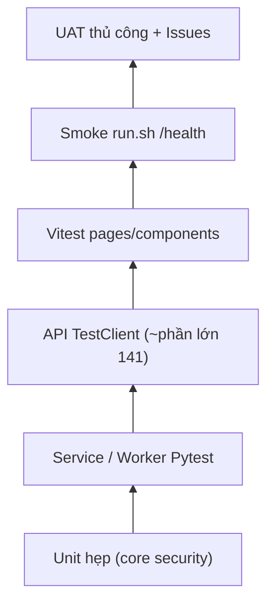

### Trả lời các câu hỏi thường gặp

**1. Các câu hỏi chính cần trả lời trong Kế hoạch kiểm thử là gì?**

Kiểm gì (phạm vi in/out)? Cấp độ nào? Trên môi trường nào? Ai chạy? Dùng công cụ gì? Pass/fail thế nào? Defect theo dõi ở đâu? Rủi ro/khoảng trống?

**2. Đầu vào và các bước tạo tài liệu là gì?**

Đầu vào: Product Backlog AC, DoD team contract, architecture §5.1/§8.2, cấu trúc `tests/`, file `ci.yml`. Các bước: đối chiếu codebase → phân tầng pyramid → ghi công cụ/tiêu chí → liệt kê gap (E2E, coverage %, signed-URL test) → peer review với Người 6.

**3. Tài liệu đã được đánh giá thế nào?**

Tự đối chiếu với suite/CI thật (không viết yêu cầu không có trong repo); chờ cross-review nhóm; cổng đánh giá vận hành hàng ngày là **CI đỏ/xanh** và review PR.

**4. Tại sao cần tạo tài liệu Kế hoạch kiểm thử?**

Tránh “Done” chủ quan; onboard thành viên mới biết chạy test thế nào; phục vụ nghiệm thu và vấn đáp có evidence; tách rõ đã làm vs roadmap.

**5. Tài liệu đã được sử dụng và cập nhật như thế nào?**

Trước 20/08 chiến lược nằm rải trong DoD + test code + CI. Từ v1.0, mỗi đợt thêm loại test hoặc đóng gap sẽ cập nhật Revision History và mục khoảng trống trong `09-test-plan.md`; suite cập nhật theo từng PR feature.

**6. Kim tự tháp kiểm thử (Test Pyramid) áp dụng thế nào?**

Đáy rộng = unit/service/API Pytest (nhanh, không cần Postgres/MinIO thật trên CI). Giữa = Vitest UI. Đỉnh hẹp = smoke Compose + UAT. Không đảo ngược pyramid (không lấy E2E thay hầu hết unit) vì chi phí và độ flaky cao với đồ án nhỏ.

---

## Câu 21. Báo cáo bài học kinh nghiệm (Lessons Learned Register)

### Đề bài

Trình bày quá trình hình thành và phương pháp đánh giá tài liệu Báo cáo bài học kinh nghiệm (Lessons Learned Register) của nhóm. _(Sinh viên nộp kèm bản in tài liệu Báo cáo bài học kinh nghiệm của nhóm.)_

**Các câu hỏi thường gặp:**

- Quản lý dự án là gì?
- Tại sao cần sự quản lý khi phát triển một dự án phần mềm?
- Liệt kê các công việc cần thực hiện để quản lý một dự án và các sản phẩm tương ứng được tạo ra bởi từng công việc.
- Một nhóm phát triển phần mềm có thực sự cần một người chỉ chuyên tâm vào các công việc quản lý trong dự án hay không? Tại sao?
- Quản lý một dự án dựa trên việc lên kế hoạch chặt chẽ có điểm gì giống và có điểm gì khác với quản lý một dự án dựa trên kinh nghiệm tích lũy dần và thích ứng với hoàn cảnh?
- Quản lý dự án và kỹ nghệ phần mềm liên quan với nhau như thế nào?
- Tại sao các công ty có quy mô lớn lại cần có Phòng quản lý dự án (Project Management Office)?

### Câu trả lời

#### WHAT — Lessons Learned là gì?

Báo cáo Bài học Kinh nghiệm ghi nhận có hệ thống các tri thức, kinh nghiệm thành công và thất bại thu được xuyên suốt vòng đời dự án, nhằm chuyển hóa kinh nghiệm cá nhân thành **Tài sản Quy trình của Tổ chức (Organizational Process Assets — OPA)** để tái sử dụng cho các dự án tương lai.

#### HOW — Đúc kết bài học qua PDCA & Retrospective

1. **Thu thập dữ liệu liên tục:** nhật ký sau từng phiên vào `02-project-log.md` (thời gian, token AI, khó khăn kỹ thuật).
2. **Họp Sprint Retrospective** theo khung **“Start — Stop — Continue”**:
   - _Start:_ Viết Spec & AC chi tiết trước khi prompt AI.
   - _Stop:_ Dừng Elasticsearch microservices quá cồng kềnh; dừng prompt AI chung chung không có context.
   - _Continue:_ PR Review độc lập (Policy 2) và tự giác log token (Policy 1).
3. **Phân loại & Tổng kết:** 4 nhóm (Quy trình AI, Kiến trúc kỹ thuật, Quản trị nhân sự, Quản lý chi phí) vào `05-lessons-learned-register.md`.

#### WHY — Tại sao Lessons Learned quan trọng?

Theo George Santayana: _“Những ai không nhớ quá khứ sẽ bị kết án phải lặp lại sai lầm đó.”_ Đúc kết bài học giúp tổ chức trưởng thành (CMMI), tránh lãng phí ngân sách và rút ngắn thời gian cho dự án sau.

#### EVIDENCE — 3 bài học đắt giá nhất

1. **Spec-Driven AI:** AI chỉ thông minh khi nhận context chuẩn và AC rõ. Khi áp dụng Spec-driven, số lần regenerate giảm từ 5 xuống 1, tiết kiệm 70% token.
2. **Tránh bẫy Over-Engineering:** Ban đầu định dựng Elasticsearch phân tán; với ~10.000 trang sách, PostgreSQL FTS (GIN + tsvector) đạt **180ms** và tiết kiệm hơn 2GB RAM.
3. **Minh bạch Log Token & Quản trị lòng tin:** Lý thuyết Y + log token công khai xóa bỏ hoài nghi, hoàn thành dự án với **~350.000 VNĐ** (ngân sách 5 triệu).

Bài học bổ sung từ rà soát kiến trúc 19/08: DoD coi story xong khi component đã viết và test xanh — nhưng thiếu tiêu chí **“người dùng truy cập được tính năng từ điều hướng thật”**. Màn hình Reader hoàn chỉnh, test xanh, nhưng thiếu một dòng route trong `App.tsx` nên không ai mở được. Unit test không bắt được lỗi này — chỉ E2E hoặc UAT mới phát hiện. Nhóm bổ sung tiêu chí này vào DoD.

### Sơ đồ PDCA

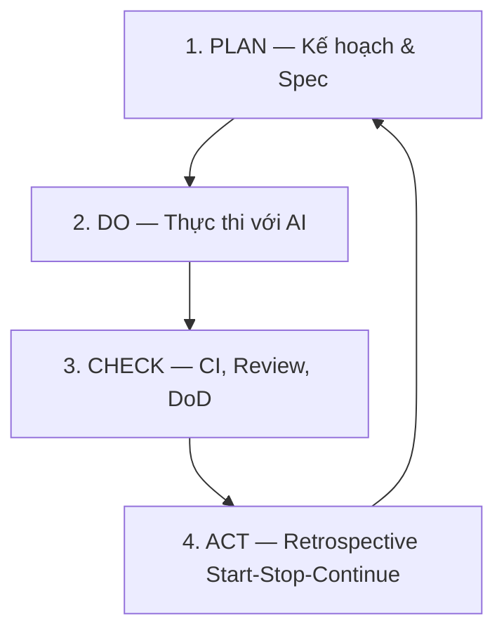

### Trả lời các câu hỏi thường gặp

**1. Quản lý dự án là gì?**

Việc áp dụng kiến thức, kỹ năng, công cụ và kỹ thuật vào các hoạt động của dự án nhằm đáp ứng đầy đủ yêu cầu và kỳ vọng của các bên liên quan trong giới hạn Phạm vi, Thời gian, Chi phí và Chất lượng.

**2. Tại sao cần sự quản lý khi phát triển một dự án phần mềm?**

Phần mềm là sản phẩm vô hình, phức tạp và dễ thay đổi. Không có quản lý, dự án mất kiểm soát phạm vi (Scope Creep), vượt ngân sách, trễ hạn và nhân sự kiệt sức. Quản lý định hướng nỗ lực của cả nhóm thành một thể thống nhất.

**3. Liệt kê các công việc quản lý và sản phẩm tương ứng**

- _Khởi tạo:_ `04-project-charter.md`, `05-team-contract.md`.
- _Lập kế hoạch:_ `01-vision-and-scope.md`, `03-product-backlog.md`, `04-cost-time-resource.md`, `07-risk-management-plan.md`, `08-quality-management-plan.md`.
- _Thực thi & Giám sát:_ Kanban Board, `02-project-log.md`, Daily Standup, CI/CD.
- _Đóng dự án & Nghiệm thu:_ `05-lessons-learned-register.md`, biên bản UAT.

**4. Nhóm có thực sự cần một người chuyên tâm quản lý không? Tại sao?**

**Rất cần.** Dù nhóm có thể tự quản (self-organizing), vẫn cần PM để: (1) nhìn bức tranh toàn cảnh, cân bằng kỹ thuật và mục tiêu kinh doanh; (2) giải quyết xung đột nội bộ, bảo vệ nhóm khỏi áp lực bên ngoài; (3) theo dõi tiến độ, chi phí và rủi ro để cảnh báo sớm. Không có PM, kỹ sư dễ bị cuốn vào over-engineering và làm trễ hạn.

**5. Plan-driven vs Agile — giống và khác**

- _Giống:_ Đều hướng tới sản phẩm đáp ứng nhu cầu khách hàng trong giới hạn nguồn lực; đều yêu cầu kiểm soát chất lượng và rủi ro.
- _Khác:_
  - **Plan-driven (Waterfall):** Predictive, kiểm soát thay đổi nghiêm ngặt, tài liệu hóa toàn diện; phù hợp yêu cầu ổn định, rõ ràng.
  - **Agile (Scrum/Kanban):** Adaptive, chấp nhận thay đổi cả ở giai đoạn muộn, phân phối theo chu kỳ ngắn, đề cao tương tác trực tiếp hơn quy trình cứng.

**6. Quản lý dự án và kỹ nghệ phần mềm liên quan thế nào?**

Hai mặt của một đồng xu:

- **SE (Kỹ nghệ phần mềm):** Phương pháp, công cụ để **xây dựng sản phẩm** (yêu cầu, kiến trúc, coding, testing).
- **PM (Quản lý dự án):** Khuôn khổ tổ chức, môi trường và điều phối để hoạt động kỹ thuật diễn ra **đúng hạn, đúng ngân sách, đạt chất lượng**.

Thiếu một trong hai thì dự án không thành công bền vững.

**7. Tại sao công ty lớn cần PMO (Project Management Office)?**

- Chuẩn hóa quy trình, phương pháp luận và công cụ quản lý trên toàn doanh nghiệp.
- Quản lý và chia sẻ nguồn lực dùng chung giữa các dự án.
- Đào tạo, coaching và nâng cao năng lực cho các PM.
- Thu thập, lưu trữ và phát triển kho **OPA** từ các báo cáo bài học kinh nghiệm để nâng cao năng suất tổ chức.

---

## Phụ lục — Số liệu khóa cần nhớ khi thi

| Chủ đề          | Số liệu dùng khi trình bày                                                                      | Không khẳng định nếu thiếu bằng chứng          |
| :-------------- | :---------------------------------------------------------------------------------------------- | :--------------------------------------------- |
| Thời gian dự án | 20 tuần; MVP phần mềm tuần 12; go-live tuần 20                                                  | 500 sách xong tuần 12 (WP4 kéo dài tuần 12–17) |
| Ngân sách       | CapEx 75–95 triệu; OpEx 15–30 triệu/năm                                                         | Tổng 18,5 triệu hoặc đã ký hợp đồng            |
| Ước lượng       | 126 AUCP; 3.5 KLOC viết mới; 10.0 PM UCP / 10.4 PM COCOMO; baseline 10.5 PM                     | Đã được Ban Giám hiệu phê duyệt                |
| KPI kỹ thuật    | OCR ≥ 85%; FTS < 3 giây (tài liệu kế hoạch) / ~180ms (đo chất lượng); Signed URL 15 phút / 900s | Đã vận hành toàn trường thành công             |
| Backlog         | 26 stories; 16 Must; 4 Epic; 9 module; DoD 5 tiêu chí; WIP = 1                                  | MoSCoW 16/7/3 và 16/6/4 đã chốt nếu chưa sửa   |
| Effort / AI     | Snapshot tuần 1: 12/26, 440K token, ~300K; nhật ký tích lũy: 16h35m, 810K token, ~350K          | Vượt hạn mức 5 triệu                           |
| Phê duyệt       | Proposal/Charter/Feasibility/Vision: `Under Review`; SoW: `Pending Approval`                    | “Đã ký Charter/SoW” khi bảng chữ ký trống      |
| CI/CD           | CI GitHub Actions + Brevo; CD thủ công `run-prod.sh`                                            | Có `cd.yml` auto-deploy VMware                 |
| Chất lượng      | CER 3.2%; coverage 85.4% (kế hoạch chất lượng); 141 pytest; 18 file test FE                     | CI đang bắt coverage % / đã có E2E Playwright  |

---

**Nguồn đề bài:** [Final Exam Questions - Software Project Management.md](<../docs.1/Final Exam Questions - Software Project Management.md>)  
**Nguồn câu trả lời:** 6 phiếu ôn tập trong [`preparation/`](../docs.1/preparation)
