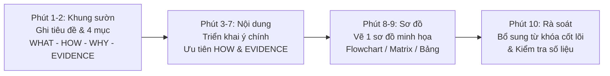
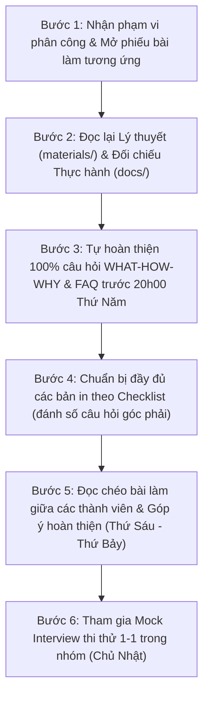

# HƯỚNG DẪN ÔN TẬP VÀ CHUẨN BỊ THI VẤN ĐÁP CUỐI KỲ

## Môn học: Quản lý Dự án Phần mềm (Software Project Management)

**Giảng viên:** TS. Ngô Huy Biên — Năm học 2026  
**Dự án nhóm:** Hệ thống Quản lý và Số hóa Tài liệu Thư viện HCMUS (HCMUS-LDMS)

---

## 1. TỔNG QUAN KỲ THI VẤN ĐÁP

### 1.1 Hình thức thi và Thang điểm

- **Hình thức:** Thi vấn đáp cá nhân 1-1 trực tiếp với Giảng viên.
- **Quy mô đề thi:** Bốc thăm ngẫu nhiên **1 trong 21 câu hỏi** bao quát toàn bộ vòng đời quản lý dự án phần mềm.
- **Thời gian tại phòng thi:**
  - **10 phút:** Tự viết câu trả lời ra giấy trắng A4 (không sử dụng bất kỳ tài liệu nào).
  - **2 phút:** Chọn và nộp kèm các bản in tài liệu/giao diện liên quan đến câu hỏi đã bốc thăm.
  - **5 – 10 phút:** Trình bày và trả lời chất vấn trực tiếp của Giảng viên.
- **Thang điểm:** 0 đến 10 điểm.
  - Trả lời đầy đủ câu hỏi + nộp đủ bản in liên quan: **Từ trên 8 đến 10 điểm**.
  - Trả lời được một phần hoặc thiếu bản in: **Tối đa 8 điểm**.
  - Không nộp giấy A4 hoặc không trả lời được: **0 điểm**.
  - **Quy chế đổi đề:** Được đổi tối đa 2 lần, mỗi lần đổi bị **trừ 2 điểm** vào điểm tổng kết.

### 1.2 Quy trình làm bài 10 phút trên giấy A4

---

## 2. QUY ĐỊNH BẮT BUỘC KHI CHỈNH SỬA TÀI LIỆU DỰ ÁN

Mọi thành viên khi thực hiện bổ sung, hoàn thiện tài liệu trong thư mục [`docs/`](../docs/) phải tuân thủ nghiêm ngặt hai quy tắc sau:

> **QUY TẮC BẢO TOÀN LỊCH SỬ (DOCUMENT REVISION HISTORY):**
>
> 1. Khi tạo mới hoặc chỉnh sửa bất kỳ tài liệu nào trong thư mục [`docs/`](../docs/), **bắt buộc phải cập nhật bảng Document Revision History** ở đầu file đó (gồm: Version, Ngày sửa, Tác giả, Tóm tắt nội dung thay đổi).
> 2. **Bắt buộc phải ghi 1 dòng log công việc** vào file [`docs/03-execution-monitoring/02-project-log.md`](../docs/03-execution-monitoring/02-project-log.md) để lưu lại thời gian thực hiện và số lượng token/nỗ lực đã sử dụng.

---

## 3. HƯỚNG DẪN 6 BƯỚC THỰC HIỆN CHO TỪNG THÀNH VIÊN

### Chi tiết từng bước:

- **Bước 1 — Nhận phân công:** Mở phiếu bài làm cá nhân trong thư mục [`preparation/`](./preparation/) theo bảng phân công ở Mục 4.
- **Bước 2 — Nghiên cứu tài liệu:**
  - Đọc tài liệu lý thuyết tương ứng trong [`materials/`](../materials/) để nắm vững định nghĩa, khái niệm và phương pháp luận.
  - Đọc tài liệu thực hành trong [`docs/`](../docs/) và mã nguồn trong [`src/`](../src/) để lấy dẫn chứng, số liệu thực tế của dự án HCMUS-LDMS.
- **Bước 3 — Biên soạn câu trả lời:**
  - Điền câu trả lời vào tất cả các mục `_Trả lời:_` trong file README cá nhân.
  - Vẽ lại hoặc tùy biến sơ đồ Mermaid minh họa cho từng câu hỏi.
  - **Hạn chót hoàn thành:** **20:00, Thứ Năm (20/08/2026)**.
- **Bước 4 — Chuẩn bị bản in (Printouts):**
  - In ra giấy A4 toàn bộ tài liệu theo Checklist ở đầu mỗi phiếu bài làm.
  - Ghi số câu hỏi to, rõ ràng lên góc trên bên phải từng tờ in (ví dụ: `[Câu 1]`, `[Câu 3]`, `[Câu 8]`).
- **Bước 5 — Đọc chéo (Cross-review):**
  - Đọc bài làm của các thành viên khác theo chỉ dẫn "Đọc chéo liên kết" để sẵn sàng cho các câu hỏi mở rộng hoặc câu hỏi chéo của Giảng viên.
- **Bước 6 — Phỏng vấn thử (Mock Interview):**
  - Tham gia buổi phỏng vấn thử 1-1 do nhóm tổ chức vào Chủ Nhật để rèn luyện phản xạ trình bày trong 5-10 phút.

---

## 4. MA TRẬN PHÂN CÔNG VÀ ĐIỀU HƯỚNG TÀI LIỆU ÔN TẬP

| STT | Thành viên phụ trách                          |      Phạm vi câu hỏi       | Chủ đề chuyên môn                                                                                        |                              Phiếu bài làm chi tiết                               |
| :-: | :-------------------------------------------- | :------------------------: | :------------------------------------------------------------------------------------------------------- | :-------------------------------------------------------------------------------: |
|  1  | **Người 1:** Nguyễn Quang Thái (23127116)     |      **Câu 1, 3, 8**       | Khởi tạo, Điều lệ dự án (Charter) & Báo cáo tính khả thi (TELOS)                                         | [Phiếu bài làm Người 1](./preparation/1_Initiation_Charter_Feasibility/README.md) |
|  2  | **Người 2:** Ngô Nguyễn Thế Khoa (23127065)   |      **Câu 2, 4, 12**      | Viễn cảnh & Phạm vi (Vision & Scope), Product Backlog & Phát biểu công việc (SoW)                        |     [Phiếu bài làm Người 2](./preparation/2_Requirements_Scope_SoW/README.md)     |
|  3  | **Người 3:** Nguyễn Lê Hồ Anh Khoa (23127211) |      **Câu 5, 6, 7**       | Kiến trúc phần mềm (4+1 Views), Chứng minh ý tưởng (PoC) & Bản mẫu (Prototype)                           |   [Phiếu bài làm Người 3](./preparation/3_Architecture_PoC_Prototype/README.md)   |
|  4  | **Người 4:** Ân Tiến Nguyên An (23127148)     |     **Câu 9, 10, 11**      | Quy trình phát triển phần mềm, Ước lượng dự án (UCP, COCOMO II) & Kế hoạch dự án (WBS)                   |  [Phiếu bài làm Người 4](./preparation/4_Estimation_Planning_Process/README.md)   |
|  5  | **Người 5:** Nguyễn Tuấn Anh (23127152)       |   **Câu 13, 14, 15, 20**   | Tích hợp liên tục (CI), Chuyển giao liên tục (CD), Mô hình DevOps & Kế hoạch kiểm thử (Test Plan)        |      [Phiếu bài làm Người 5](./preparation/5_CICD_DevOps_Testing/README.md)       |
|  6  | **Người 6:** Mạch Quốc Tấn (23127115)         | **Câu 16, 17, 18, 19, 21** | Quản trị nhân sự (Tuckman), Giám sát & Báo cáo, Quản lý rủi ro, Quản lý chất lượng & Bài học kinh nghiệm |  [Phiếu bài làm Người 6](./preparation/6_Team_Monitoring_Risk_Lessons/README.md)  |

---

## 5. BẢN ĐỒ TÀI NGUYÊN TOÀN BỘ DỰ ÁN

### 5.1 Tài liệu Đề thi và Kế hoạch Ôn tập (`final-exam/`)

- [`Final Exam Questions - Software Project Management.md`](./Final%20Exam%20Questions%20-%20Software%20Project%20Management.md): Bộ 21 câu hỏi gốc của Giảng viên TS. Ngô Huy Biên.
- [`01_Final_Exam_Summary.md`](./01_Final_Exam_Summary.md): Bản tổng hợp ma trận 21 câu hỏi, phân loại 5 nhóm chuyên môn và checklist bản in.
- [`02_Preparation_Plan.md`](./02_Preparation_Plan.md): Kế hoạch phân chia ôn tập, lộ trình 3 bước, chiến lược viết giấy A4 và quy chế thi.

### 5.2 Tài liệu Thực hành Dự án (`docs/`)

- **Khởi tạo (`docs/01-initiation/`):**
  - [`01-project-idea.md`](../docs/01-initiation/01-project-idea.md): Ý tưởng và bối cảnh dự án HCMUS-LDMS.
  - [`02-project-proposal.md`](../docs/01-initiation/02-project-proposal.md): Đề xuất dự án, đối chuẩn thị trường.
  - [`03-feasibility-study.md`](../docs/01-initiation/03-feasibility-study.md): Đánh giá tính khả thi theo khung TELOS.
  - [`04-project-charter.md`](../docs/01-initiation/04-project-charter.md): Điều lệ dự án, ma trận RACI.
  - [`05-team-contract.md`](../docs/01-initiation/05-team-contract.md): Hợp đồng nhóm, quy chế làm việc và quản trị con người.
- **Lập kế hoạch (`docs/02-planning/`):**
  - [`01-vision-and-scope.md`](../docs/02-planning/01-vision-and-scope.md): Viễn cảnh và phạm vi, so sánh quy trình As-Is vs To-Be.
  - [`02-architecture.md`](../docs/02-planning/02-architecture.md): Kiến trúc phần mềm, mô hình 4+1 Views, PoC pipeline OCR, CI/CD.
  - [`03-product-backlog.md`](../docs/02-planning/03-product-backlog.md): 26 User Stories, MoSCoW, Acceptance Criteria, Definition of Done.
  - [`04-cost-time-resource.md`](../docs/02-planning/04-cost-time-resource.md): Ước lượng Use Case Points (126 UCP), COCOMO II (10.4 PM), 6 gói công việc WBS.
  - [`05-statement-of-work.md`](../docs/02-planning/05-statement-of-work.md): Phát biểu công việc SoW, quy trình Change Request.
  - [`09-test-plan.md`](../docs/02-planning/09-test-plan.md): Kế hoạch kiểm thử (Pytest/Vitest, CI gating, kim tự tháp).
- **Thực thi và Giám sát (`docs/03-execution-monitoring/`):**
  - [`01-sprint-plan.md`](../docs/03-execution-monitoring/01-sprint-plan.md): Kế hoạch thực thi Sprint 1.
  - [`02-project-log.md`](../docs/03-execution-monitoring/02-project-log.md): Nhật ký làm việc thực tế, đo lường nỗ lực và token AI.
  - [`03-ai-development-workflow.md`](../docs/03-execution-monitoring/03-ai-development-workflow.md): Báo cáo quy trình phát triển sản phẩm kết hợp AI Coding Assistant.
  - [`06-developer-guide.md`](../docs/03-execution-monitoring/06-developer-guide.md): Hướng dẫn cài đặt/biên dịch cho lập trình viên (câu 13).
  - [`07-deployment-guide.md`](../docs/03-execution-monitoring/07-deployment-guide.md): Hướng dẫn triển khai/vận hành Compose prod-like (câu 14–15).

### 5.3 Tài liệu Lý thuyết Bài giảng (`materials/`)

- [`02_software_project.md`](../materials/02_software_project.md): Khái niệm dự án phần mềm, Project vs Operation vs Program vs Portfolio.
- [`03_software_project_initiation.md`](../materials/03_software_project_initiation.md): Quy trình khởi tạo dự án, Proposal, Charter, TELOS.
- [`03_1_business_requirements.md`](../materials/03_1_business_requirements.md) & [`03_2_user_requirements.md`](../materials/03_2_user_requirements.md): Yêu cầu nghiệp vụ, Vision & Scope, User Story, INVEST.
- [`04_software_development_life_cycle_model.md`](../materials/04_software_development_life_cycle_model.md) & [`04_01_software_development_models.md`](../materials/04_01_software_development_models.md) & [`04_02_scrum_development_process.md`](../materials/04_02_scrum_development_process.md): Các mô hình phát triển phần mềm (Waterfall, Agile, Scrum, Kanban, Prototyping, PoC).
- [`05_1_work_breakdown_structure.md`](../materials/05_1_work_breakdown_structure.md): Cấu trúc phân rã công việc WBS, Critical Path.
- [`05_2_introduction_to_software_estimation.md`](../materials/05_2_introduction_to_software_estimation.md), [`05_3_agile_estimation.md`](../materials/05_3_agile_estimation.md), [`05_4_model_based_estimation.md`](../materials/05_4_model_based_estimation.md): Phương pháp ước lượng phần mềm (Cone of Uncertainty, Count-Compute-Judge, Planning Poker, Use Case Points, COCOMO II).
- [`06_software_project_planning.md`](../materials/06_software_project_planning.md) & [`06_1_agile_planning.md`](../materials/06_1_agile_planning.md): Lập kế hoạch dự án và kế hoạch Agile.
- [`07_software_configuration_management.md`](../materials/07_software_configuration_management.md): Quản lý cấu hình phần mềm, CI/CD, DevOps.
- [`08_software_team_management.md`](../materials/08_software_team_management.md): Quản trị nhân sự và phát triển nhóm (Tuckman, McGregor X/Y, Ouchi Z, Maslow).
- [`09_software_project_monitoring_and_control.md`](../materials/09_software_project_monitoring_and_control.md) & [`09_1_agile_project_monitoring_and_control.md`](../materials/09_1_agile_project_monitoring_and_control.md): Giám sát và kiểm soát dự án, Burndown Chart, EVM, xử lý Scope Creep.
- [`10_software_risk_management.md`](../materials/10_software_risk_management.md) & [`10_1_agile_risk_management.md`](../materials/10_1_agile_risk_management.md): Quản lý rủi ro phần mềm.
- [`11_software_quality_management.md`](../materials/11_software_quality_management.md) & [`11_1_agile_quality_management.md`](../materials/11_1_agile_quality_management.md): Quản lý chất lượng phần mềm, QA/QC, McCall, ISO 9126, Test Pyramid, Code Inspection.
- [`12_software_project_management.md`](../materials/12_software_project_management.md): Tổng kết quản lý dự án, văn phòng PMO, bài học kinh nghiệm.

### 5.4 Ghi chú Bài giảng Thực chiến trên Lớp (`note.md`)

- [`note.md`](../note.md): Tổng hợp toàn bộ lời dặn dò, bí kíp thực chiến, nhận xét đồ án và hướng dẫn trực tiếp từ Thầy Ngô Huy Biên qua các Buổi 01 đến 10:
  - **Buổi 02-04:** Kỹ thuật Prompt RACFT, Context Engineering cực đoan, giải quyết nỗi đau người dùng (Pain point), khái niệm MOAT và đối chuẩn đối thủ.
  - **Buổi 05 & 10:** Hai loại PoC bắt buộc (Tính năng khó nhất vs Tính năng bao quát tech stack chủ lực), thiết kế Prototype.
  - **Buổi 06 & 08:** Quản lý nhóm (Tuckman, McGregor Y, Maslow), kiểm soát xung đột bằng chính sách sớm, quản lý rủi ro RAID log.
  - **Buổi 07 & 08:** Ước lượng đa chiều (Fibonacci Planning Poker, đối chuẩn COCOMO II trên DSpace, UCP), đo lường throughput và gap time.
  - **Buổi 08 & 10:** 5 bài toán CD/DevOps (Script deploy, Release tag, Monitoring, Multi-environment, Backup), QA/QC với AI Code Review và Test Coverage.
  - **Dặn dò thi vấn đáp:** *Kể chi tiết tự sự như một câu chuyện thực tế, nhắc đến code phải có dẫn chứng (evidence), không nói lý thuyết suông*.
