# PHIẾU BÀI LÀM ÔN TẬP - NGUYỄN QUANG THÁI

## Khởi tạo, Điều lệ và Tính khả thi của dự án HCMUS-LDMS

- **Họ và tên:** Nguyễn Quang Thái
- **MSSV:** 23127116
- **Phạm vi:** Câu 1, Câu 3, Câu 8
- **Phiên bản:** 2.0
- **Ngày hoàn thiện:** 20/08/2026
- **Trạng thái nội dung:** Hoàn thành 100% phần biên soạn; còn bước in tài liệu và luyện vấn đáp cá nhân

### Lịch sử phiên bản

| Phiên bản | Ngày | Tác giả | Nội dung thay đổi |
| :---: | :---: | :--- | :--- |
| 1.0 | 18/08/2026 | Nhóm dự án | Khởi tạo phiếu, câu hỏi và khung trả lời |
| 2.0 | 20/08/2026 | Nguyễn Quang Thái | Hoàn thiện 3 dàn ý, 25 FAQ, 3 sơ đồ và chuẩn hóa dữ kiện theo tài liệu gốc |

## Mục lục

- [1. Hướng dẫn sử dụng phiếu](#1-hướng-dẫn-sử-dụng-phiếu)
- [2. Câu 1 - Đề xuất dự án](#2-câu-1---đề-xuất-dự-án)
- [3. Câu 3 - Điều lệ dự án](#3-câu-3---điều-lệ-dự-án)
- [4. Câu 8 - Báo cáo tính khả thi](#4-câu-8---báo-cáo-tính-khả-thi)
- [5. Bảng khóa dữ kiện trước khi thi](#5-bảng-khóa-dữ-kiện-trước-khi-thi)
- [6. Tài liệu tham chiếu](#6-tài-liệu-tham-chiếu)

## 1. Hướng dẫn sử dụng phiếu

### Bản in cần chuẩn bị

- [ ] In [Đề xuất dự án](../../../docs/01-initiation/02-project-proposal.md), ghi `[Câu 1]` ở góc trên bên phải.
- [ ] In [Điều lệ dự án](../../../docs/01-initiation/04-project-charter.md), ghi `[Câu 3]` ở góc trên bên phải.
- [ ] In [Báo cáo nghiên cứu khả thi](../../../docs/01-initiation/03-feasibility-study.md), ghi `[Câu 8]` ở góc trên bên phải.

### Chiến lược viết giấy A4 trong 10 phút

1. **Phút 1-2:** ghi tiêu đề và bốn mục WHAT-HOW-WHY-EVIDENCE.
2. **Phút 3-7:** triển khai ý chính; HOW phải kể đúng việc nhóm đã làm, EVIDENCE phải có số liệu hoặc tên bảng cụ thể.
3. **Phút 8-9:** vẽ lại sơ đồ tối giản của câu hỏi.
4. **Phút 10:** kiểm tra thuật ngữ, số liệu và kết luận.

> **Nguyên tắc trung thực bằng chứng:** Tài liệu nguồn hiện ghi trạng thái `Under Review`; Charter chưa có chữ ký và repository chưa có dữ liệu khảo sát gốc. Vì vậy, không nói “đã phê duyệt”, “đã khảo sát xác nhận” hoặc “đã vận hành thành công” nếu không có bản chứng minh đi kèm.

## 2. Câu 1 - Đề xuất dự án

> **Đề bài:** Trình bày quá trình hình thành và phương pháp đánh giá tài liệu Đề xuất dự án (Project Proposal) của nhóm.

### 2.1. Dàn ý WHAT-HOW-WHY-EVIDENCE

#### WHAT - Project Proposal là gì?

Project Proposal là tài liệu trình bày lý do nên đầu tư vào một dự án và cung cấp đủ thông tin cấp cao để Sponsor quyết định tiếp tục thẩm định, phê duyệt có điều kiện hoặc dừng ý tưởng. Proposal của HCMUS-LDMS trả lời các câu hỏi: vấn đề thực tế là gì; ai bị ảnh hưởng; giải pháp được đề xuất là gì; giải pháp khác gì các phương án thay thế; lợi ích, chi phí, thời gian và rủi ro cấp cao ra sao; ai cần tham gia; bước tiếp theo là gì.

#### HOW - Nhóm hình thành và đánh giá Proposal như thế nào?

1. **Nhận diện vấn đề:** phân tích tình trạng tài liệu giấy xuống cấp, kho Quận 5 quá tải, sinh viên cơ sở Thủ Đức khó tiếp cận và PDF scan khó đọc trên điện thoại.
2. **Xây dựng góc nhìn người dùng:** mô tả hành trình của sinh viên Nguyễn Văn Linh và thủ thư Mai để biến pain point thành nhu cầu nghiệp vụ cụ thể.
3. **Hình thành giải pháp:** đề xuất quy trình Scan -> Tesseract OCR -> hiệu chỉnh Split-screen -> đóng gói EPUB 3.0 -> PostgreSQL FTS -> Web Reader bảo mật.
4. **Đối chuẩn:** so sánh giải pháp tự xây với Lạc Việt Vebrary, DSpace và chuỗi công cụ rời Abbyy + Calibre + Drive theo chi phí, OCR/biên tập, bảo mật và tìm kiếm toàn văn.
5. **Phân tích giá trị và khả năng thực hiện:** xác định lợi ích định lượng/định tính, stakeholders, lộ trình 20 tuần và các rủi ro bản quyền, OCR, rò rỉ tệp, quá tải nguồn lực.
6. **Phản biện và cập nhật:** sử dụng checklist bài giảng, phản biện con người và AI theo ghi chú môn học; đối chiếu tính nhất quán với Feasibility Study và Charter. Revision History cho thấy Proposal đã đi từ v1.0 đến v6.0, nhưng vẫn ở trạng thái `Under Review`.

#### WHY - Tại sao cần Proposal?

- Chứng minh dự án giải quyết một vấn đề có thật thay vì chỉ liệt kê tính năng hấp dẫn.
- Cho Sponsor cơ sở so sánh lợi ích với chi phí, rủi ro và các giải pháp có sẵn trước khi cấp nguồn lực.
- Tạo hiểu biết chung giữa Thư viện, Phòng CNTT, Ban Giám hiệu, Pháp chế và người dùng.
- Là đầu vào cấp cao cho Feasibility Study, Vision & Scope, Project Charter và kế hoạch dự án.
- Cho phép loại bỏ hoặc thu hẹp ý tưởng sớm, khi chi phí thay đổi còn thấp.

#### EVIDENCE - Minh chứng của HCMUS-LDMS

| Nhóm minh chứng | Dữ kiện sử dụng khi thi |
| :--- | :--- |
| Pain point | Kho Quận 5 quá tải; tài liệu cũ xuống cấp; sinh viên phải di chuyển giữa hai cơ sở; PDF scan không reflow trên điện thoại |
| Giải pháp | Quy trình Scan-to-EPUB khép kín, Tesseract OCR, Split-screen Editor, PostgreSQL FTS, MinIO và Web Reader |
| KPI kỹ thuật | OCR tối thiểu 85%; tìm kiếm toàn văn dưới 3 giây; Signed URL hết hạn sau 15 phút |
| Đối chuẩn | Lạc Việt Vebrary, DSpace, Abbyy + Calibre + Drive |
| Lợi thế | Nội dung độc quyền, switching cost, network effect, lợi thế chi phí và data MOAT |
| Lịch sử | Proposal có 6 phiên bản từ 06/07 đến 23/07/2026; phiên bản mới đồng bộ PostgreSQL FTS và bổ sung đối chuẩn |

### 2.2. Sơ đồ hình thành và đánh giá Proposal

### 2.3. Bộ 15 câu hỏi thường gặp

#### 1. Các câu hỏi chính cần trả lời trong Project Proposal là gì?

Proposal cần trả lời: tại sao dự án cần tồn tại; vấn đề và đối tượng chịu ảnh hưởng là ai; giải pháp và deliverables cấp cao là gì; phạm vi loại trừ là gì; giải pháp thay thế/đối thủ nào đã có; giá trị khác biệt và MOAT là gì; chi phí, lợi ích, thời gian, nguồn lực và rủi ro cấp cao ra sao; ai là stakeholder; ai xem xét/phê duyệt; khuyến nghị hành động tiếp theo là gì.

#### 2. Đầu vào và các bước nhóm thực hiện để tạo Proposal là gì?

Đầu vào gồm Project Idea, pain point của độc giả/thủ thư, nhu cầu chuyển đổi số, hạ tầng và năng lực đội ngũ, giải pháp cạnh tranh, yêu cầu bảo mật/bản quyền và công nghệ có thể sử dụng. Nhóm thực hiện theo chuỗi: thu thập bối cảnh -> dựng persona và hành trình As-is -> đề xuất To-be -> đối chuẩn -> phân tích chi phí/lợi ích và stakeholder -> nhận diện rủi ro -> phản biện -> cập nhật revision.

#### 3. Proposal được hình thành dựa trên dữ liệu nào?

Nguồn dữ liệu trong bộ tài liệu gồm: hiện trạng kho và tài liệu; câu chuyện persona Linh/Mai; yêu cầu đọc responsive và tìm kiếm toàn văn; năng lực của Phòng CNTT và Thư viện; benchmark ba nhóm giải pháp; các KPI OCR, tốc độ tìm kiếm và bảo mật; revision history của Project Idea, Proposal, Feasibility và Charter. Con số khảo sát 92% chỉ xuất hiện trong Feasibility Study, chưa có tệp dữ liệu khảo sát gốc trong repository, nên khi trình bày phải nói “báo cáo ghi nhận 92%”.

#### 4. Sản phẩm cạnh tranh trực tiếp với đề xuất là gì?

- **Lạc Việt Vebrary:** giải pháp thương mại quản lý thư viện, chi phí bản quyền và tùy biến cao.
- **DSpace:** nền tảng kho lưu trữ học thuật mã nguồn mở, mạnh về repository nhưng không có quy trình OCR-to-EPUB và biên tập Split-screen chuyên biệt.
- **Abbyy + Calibre + Drive:** chuỗi công cụ rời có thể OCR, chuyển đổi và lưu trữ, nhưng quy trình thủ công, khó kiểm soát phiên bản và bảo mật tệp gốc.

HCMUS-LDMS khác biệt ở quy trình khép kín, nội dung độc quyền HCMUS, tìm kiếm toàn văn, tích hợp định danh nội bộ và quyền truy cập có thời hạn.

#### 5. Proposal của nhóm đã được đánh giá thế nào?

Tài liệu được đánh giá theo bốn lớp: tính đúng của vấn đề/pain point; đối chuẩn với giải pháp thay thế; phân tích giá trị, chi phí và rủi ro; tính nhất quán với Feasibility Study và Charter. Ghi chú bài giảng yêu cầu dùng người đánh giá, AI phản biện chéo, tiêu chí rõ và revision. Revision History chứng minh tài liệu đã được chỉnh sáu phiên bản. Tuy nhiên, chưa có phiếu chấm, biên bản phê duyệt hoặc chữ ký cuối trong repository; trạng thái chính thức vẫn là `Under Review`.

#### 6. Tại sao cần tạo Project Proposal?

Proposal giúp chuyển một ý tưởng thành business case có thể thẩm định. Nó ngăn nhóm đầu tư vào vấn đề giả, giải pháp trùng lặp hoặc phương án vượt khả năng tài chính/kỹ thuật. Proposal cũng tạo căn cứ để Sponsor cho phép thực hiện Feasibility Study và chuẩn bị Charter.

#### 7. Proposal đã được sử dụng và cập nhật như thế nào?

Proposal cung cấp bối cảnh, pain point, benchmark, giải pháp, stakeholder, rủi ro và lộ trình cho Feasibility Study và Charter. Tài liệu được cập nhật từ v1.0 đến v6.0: chuẩn hóa cấu trúc; chuyển trách nhiệm sang tài liệu phù hợp; bổ sung MOAT và stakeholder; đồng bộ Google OAuth 2.0/PostgreSQL FTS; bổ sung benchmark và Việt hóa. Khi baseline hạ tầng được chốt, Proposal còn phải sửa các đoạn Cloud VPS để thống nhất với phương án VMware on-premise trong Feasibility và Charter.

#### 8. Dự án phần mềm là gì?

Dự án là một nỗ lực tạm thời nhằm tạo ra sản phẩm, dịch vụ hoặc kết quả duy nhất. Dự án phần mềm áp dụng đặc điểm đó vào việc xây dựng hoặc thay đổi hệ thống phần mềm: có mục tiêu, phạm vi, ngân sách, nguồn lực, lịch trình, rủi ro và thời điểm kết thúc xác định. HCMUS-LDMS là dự án vì có sản phẩm độc nhất, kế hoạch 20 tuần và kết thúc bằng nghiệm thu/bàn giao; vận hành thư viện số sau bàn giao mới là operation.

#### 9. Phân biệt Project, Operation, Program và Portfolio

| Khái niệm | Đặc điểm | Ví dụ HCMUS-LDMS |
| :--- | :--- | :--- |
| Project | Tạm thời, tạo kết quả duy nhất | Xây dựng và bàn giao HCMUS-LDMS |
| Operation | Liên tục, lặp lại để duy trì hoạt động | Thủ thư vận hành, cập nhật và hỗ trợ hệ thống hằng ngày |
| Program | Nhóm dự án liên quan được quản lý phối hợp để tạo lợi ích chung | Chương trình số hóa học liệu gồm LDMS, LMS và kho luận văn |
| Portfolio | Tập hợp chương trình/dự án nhằm đạt mục tiêu chiến lược | Danh mục chuyển đổi số toàn trường |

#### 10. Dự án phần mềm đến từ đâu?

Dự án có thể đến từ RFP, nghiên cứu/paper, tài liệu chuyên ngành, kinh nghiệm giải quyết vấn đề thực tế hoặc ý tưởng cá nhân. Nguồn phổ biến nhất là practical problem. HCMUS-LDMS xuất phát từ nhu cầu thực tế của Thư viện và Phòng CNTT: tài liệu xuống cấp, kho quá tải, khoảng cách tiếp cận và trải nghiệm PDF scan kém.

#### 11. Phạm vi dự án là gì?

Phạm vi dự án là toàn bộ công việc phải thực hiện để tạo ra sản phẩm với các tính năng đã cam kết. Cần phân biệt với phạm vi sản phẩm là tập tính năng/chức năng của sản phẩm. Với HCMUS-LDMS, project scope bao gồm khảo sát, thiết kế, phát triển, kiểm thử, số hóa, triển khai và đào tạo; product scope gồm OCR, biên tập Split-screen, EPUB, tìm kiếm và đọc bảo mật. Offline Reader, thanh toán thương mại và máy quét tự động hoàn toàn nằm ngoài phạm vi.

#### 12. Các vai trò thường tham gia dự án phần mềm là gì?

Các vai trò thường có: Sponsor cấp quyền và ngân sách; Client/Product Owner xác định nhu cầu và chấp nhận sản phẩm; PM lập kế hoạch, điều phối và kiểm soát; BA phân tích yêu cầu; Architect/Technical Lead thiết kế; Developer xây dựng; QA/Tester kiểm thử; DevOps triển khai/vận hành; Security/Legal tư vấn tuân thủ; người dùng cuối cung cấp phản hồi. Trong HCMUS-LDMS, Ban Giám hiệu là Sponsor, Trưởng phòng CNTT là PM, Thư viện là client nghiệp vụ, Phòng CNTT là đội kỹ thuật và sinh viên/giảng viên là người dùng.

#### 13. Phân biệt Deliverables, Outcomes và Benefits

- **Deliverables:** sản phẩm bàn giao hữu hình và kiểm tra được, ví dụ Web Portal, Admin Dashboard, kho EPUB, PostgreSQL/MinIO và tài liệu hướng dẫn.
- **Outcomes:** trạng thái hoặc hành vi thay đổi sau khi dùng deliverables, ví dụ sinh viên tra cứu/đọc từ xa và thủ thư chuyển sang quy trình số hóa có kiểm soát.
- **Benefits:** giá trị dài hạn thu được từ outcomes, ví dụ bảo tồn tri thức, giảm giờ công, tối ưu diện tích kho và tăng mức hài lòng.

Deliverable được tạo ra trong dự án; outcome xuất hiện khi deliverable được sử dụng; benefit thường được đo sau một thời gian vận hành.

#### 14. Các nguyên nhân chính khiến dự án phần mềm thất bại là gì?

Nguyên nhân gồm mục tiêu/phương pháp không rõ; yêu cầu sai hoặc thay đổi liên tục; giao tiếp kém; ước lượng nguồn lực không chính xác; báo cáo/kiểm soát yếu; công nghệ chưa trưởng thành; không quản lý được độ phức tạp; thực hành phát triển cẩu thả; rủi ro không được quản lý; xung đột stakeholder và áp lực thương mại. Với HCMUS-LDMS, các nguy cơ cụ thể là bản quyền đầu vào, OCR sách cũ/công thức, rò rỉ tệp và kỹ sư kiêm nhiệm quá tải.

#### 15. Các ràng buộc dự án có ý nghĩa gì?

Ràng buộc xác định biên ra quyết định: thời gian, chi phí, phạm vi/chất lượng, nguồn lực, pháp lý và công nghệ. Các ràng buộc liên hệ với nhau; tăng phạm vi hoặc chất lượng thường đòi hỏi thêm thời gian/chi phí. HCMUS-LDMS bị giới hạn 20 tuần, CapEx 75-95 triệu, OpEx 15-30 triệu/năm, kỹ sư chỉ dành 50% thời gian và phải tuân thủ bản quyền. PM phải ưu tiên MVP và kiểm soát thay đổi thay vì cam kết đồng thời tốt hơn, nhanh hơn và rẻ hơn.

## 3. Câu 3 - Điều lệ dự án

> **Đề bài:** Trình bày quá trình hình thành và phương pháp đánh giá tài liệu Điều lệ dự án (Project Charter) của nhóm.

### 3.1. Dàn ý WHAT-HOW-WHY-EVIDENCE

#### WHAT - Project Charter là gì?

Project Charter là tài liệu chính thức cho phép một dự án hoặc một giai đoạn tồn tại và ghi nhận các yêu cầu ban đầu đáp ứng nhu cầu stakeholder. Charter xác định bối cảnh, mục tiêu, deliverables, governance, Sponsor/PM và quyền hạn, nguồn lực, milestone, stakeholder, RACI, KPI, giả định/ràng buộc, cơ chế kiểm soát thay đổi và chữ ký phê duyệt. Theo ghi chú bài giảng, Project Initiation kết thúc khi Charter được phê duyệt.

#### HOW - Nhóm hình thành và đánh giá Charter như thế nào?

1. Dùng Proposal, Feasibility Study, Project Idea, yêu cầu cấp cao và stakeholder analysis làm đầu vào.
2. Xác định Sponsor là Ban Giám hiệu, PM là Trưởng phòng CNTT, client nghiệp vụ là Thư viện và đội phát triển là bốn kỹ sư CNTT.
3. Chốt deliverables, KPI, ngân sách, nguồn lực và mốc MVP/go-live cấp cao.
4. Phân rã sáu work package và lập RACI; mỗi công việc cần một Accountable rõ ràng, có thể có nhiều Responsible.
5. Ghi nhận giả định, ràng buộc và quy tắc change control đối với thay đổi phạm vi/ngân sách vượt 5%.
6. Đánh giá bằng Project Checklist, tính SMART của KPI, tính khả thi nguồn lực/lịch trình, tính nhất quán với Proposal/Feasibility và kiểm tra chữ ký Sponsor. Bản hiện tại chưa có chữ ký nên vẫn là `Under Review`.

#### WHY - Tại sao cần Charter?

- Chính thức hóa dự án và trao quyền cho PM sử dụng nguồn lực tổ chức.
- Đồng thuận ai chịu trách nhiệm, mục tiêu/deliverable nào được cam kết và giới hạn cấp cao là gì.
- Ngăn xung đột trách nhiệm, dự án “không chủ”, scope creep và chi tiêu không được ủy quyền.
- Tạo baseline cấp cao để lập Project Plan, WBS, lịch trình, ngân sách và cơ chế kiểm soát.

#### EVIDENCE - Minh chứng của HCMUS-LDMS

- Sponsor: Ban Giám hiệu; PM: Trưởng phòng CNTT; client: Ban Giám đốc Thư viện.
- Thời gian: 20 tuần; MVP phần mềm tại tuần 12; nghiệm thu/go-live toàn trường trước hoặc tại tuần 20.
- Nguồn lực: 3 máy chủ ảo hóa; 2 cán bộ thư viện; 4 kỹ sư CNTT phân bổ 50%; 10-15 sinh viên CTV.
- Ngân sách: CapEx 75-95 triệu VNĐ; OpEx 15-30 triệu VNĐ/năm.
- KPI: OCR tối thiểu 85%; PostgreSQL FTS dưới 3 giây; hài lòng người dùng tối thiểu 85%.
- RACI: 6 work package; Thư viện Accountable cho khảo sát/bản quyền, số hóa, vận hành; Phòng CNTT Accountable cho backend, UI/OCR/EPUB và kiểm thử.
- Change control: thay đổi phạm vi hoặc ngân sách vượt 5% phải có đề xuất bằng văn bản và phê duyệt theo thẩm quyền.

> **Điểm phải làm rõ:** Charter vừa ghi WP4 số hóa diễn ra tuần 12-17, vừa ghi 500 sách được đưa vào sử dụng ở tuần 12. Khi trình bày, tách **MVP phần mềm tuần 12** khỏi **deliverable 500 sách của giai đoạn số hóa**, và nêu đây là baseline tiến độ cần được nhóm sửa cho nhất quán.

### 3.2. Sơ đồ quyền hạn và quản trị

### 3.3. Bộ 5 câu hỏi thường gặp

#### 1. Các câu hỏi chính cần trả lời trong Project Charter là gì?

Charter trả lời: ai chính thức cho phép dự án; tại sao dự án tồn tại; mục tiêu và tiêu chí thành công là gì; deliverables/phạm vi cấp cao là gì; Sponsor, PM, team và stakeholder là ai; PM có quyền hạn gì; ngân sách, nguồn lực và milestone nào được cấp; rủi ro/giả định/ràng buộc chính là gì; trách nhiệm được phân bổ thế nào; thay đổi được kiểm soát ra sao; ai ký phê duyệt.

#### 2. Đầu vào và các bước nhóm thực hiện để tạo Charter là gì?

Đầu vào gồm Proposal, Feasibility Study, Project Idea, stakeholder analysis, mục tiêu/KPI, phạm vi cấp cao, ước lượng thời gian/chi phí và chính sách tổ chức. Các bước là tổng hợp business case -> xác định Sponsor/PM -> chốt mục tiêu/deliverable -> phân bổ ngân sách/nguồn lực -> xác định milestone/WBS cấp cao -> lập RACI -> ghi rủi ro, giả định, ràng buộc/change control -> review tính nhất quán -> xin chữ ký.

#### 3. Charter của nhóm đã được đánh giá thế nào?

Charter được kiểm tra theo Project Checklist của bài giảng: Why, Problems, Deliverables, How về kỹ thuật/quản lý và When. Tiếp theo kiểm tra KPI có đo được; mỗi work package có đúng một Accountable; nguồn lực có đáp ứng 20 tuần; ngân sách có phù hợp Feasibility; stakeholder và impact đã đầy đủ; thay đổi có thẩm quyền phê duyệt. Revision History cho thấy v3.0 đã đồng bộ Google OAuth 2.0, PostgreSQL FTS và BackgroundTasks. Tuy nhiên, trạng thái là `Under Review` và bảng chữ ký trống, nên chưa thể coi là Charter đã được phê duyệt thực tế.

#### 4. Tại sao cần tạo Project Charter?

Không có Charter, PM thiếu căn cứ dùng nguồn lực, các đơn vị có thể hiểu khác nhau về mục tiêu và trách nhiệm, còn Sponsor không có baseline để kiểm soát. Charter tạo “hợp đồng quản trị” cấp cao giữa Sponsor, client và PM, giúp dự án chuyển hợp lệ từ khởi tạo sang lập kế hoạch.

#### 5. Charter đã được sử dụng và cập nhật như thế nào?

Charter được dùng làm đầu vào cho WBS sáu gói, kế hoạch 20 tuần, governance, RACI, KPI, phân bổ nguồn lực và change control. Tài liệu được cập nhật từ v1.0 đến v3.0: chuẩn hóa, tích hợp RACI/WBS và đồng bộ tech stack với Product Backlog. Khi thực thi, Charter chỉ nên thay đổi ở cấp baseline thông qua change control; dữ liệu chi tiết hằng ngày thuộc Project Plan, Sprint Plan và Project Log. Nhóm còn phải sửa mâu thuẫn mốc 500 sách/tuần 12 và hoàn tất chữ ký.

## 4. Câu 8 - Báo cáo tính khả thi

> **Đề bài:** Trình bày quá trình hình thành và phương pháp đánh giá Báo cáo nghiên cứu khả thi (Feasibility Study Report) của nhóm.

### 4.1. Dàn ý WHAT-HOW-WHY-EVIDENCE

#### WHAT - Feasibility Study là gì?

Feasibility Study là đánh giá chi tiết nhu cầu, giá trị và tính thực tiễn của dự án trước khi cam kết đầu tư lớn. Cấu trúc chuẩn gồm Purpose, Reason, Background, Evaluation Criteria, Study Findings và Recommendations. Dự án dùng TELOS làm lõi: Technical, Economic, Legal, Operational, Schedule; đồng thời mở rộng Market, Resource và Cultural để thành tám khía cạnh.

#### HOW - Nhóm đánh giá tính khả thi như thế nào?

1. Thu thập đầu vào về pain point, hạ tầng, đội ngũ, nghiệp vụ thư viện, công nghệ, chi phí, tiến độ và bản quyền.
2. Đặt ngưỡng kiểm duyệt: OCR tối thiểu 85%, tìm kiếm dưới 3 giây, CapEx dưới 95 triệu, OpEx dưới 30 triệu/năm, MVP 12 tuần và go-live trong 20 tuần.
3. Đánh giá từng khía cạnh TELOS và ba khía cạnh mở rộng; ghi mức khả thi và điều kiện đi kèm.
4. Thực hiện SWOT, benchmarking, cost-avoidance/payback và risk assessment.
5. So sánh kết quả với ngưỡng; xác định điểm chưa đạt hoặc chưa có chứng cứ.
6. Đưa ra khuyến nghị phê duyệt có điều kiện: pilot MVP, hoàn thiện quy chế bản quyền và kiểm tra lại mô hình tài chính trước khi mở rộng.

#### WHY - Tại sao cần Feasibility Study?

- Kiểm tra dự án có thể thực hiện trong điều kiện công nghệ, tiền, người, luật và thời gian hiện có hay không.
- Phát hiện rủi ro và giả định yếu trước khi Sponsor cấp ngân sách.
- So sánh chi phí/lợi ích và phương án thay thế để tránh đầu tư cảm tính.
- Cung cấp cơ sở định lượng cho quyết định go/no-go và cho Charter/Project Plan.
- Xác định điều kiện pilot, đào tạo và kiểm soát cần có để dự án vận hành được sau bàn giao.

#### EVIDENCE - Minh chứng của HCMUS-LDMS

| Khía cạnh | Kết quả và bằng chứng |
| :--- | :--- |
| Technical | React 18, FastAPI, Tesseract, Pandoc, PostgreSQL FTS, MinIO; OCR tối thiểu 85%; tìm kiếm dưới 3 giây |
| Economic | CapEx cơ sở 75 triệu; OpEx cơ sở 15 triệu/năm; lợi ích quy đổi 35 triệu/năm; dòng tiết kiệm ròng 20 triệu/năm; hoàn vốn cơ sở 3,75 năm |
| Legal | Khả thi có điều kiện; cần giới hạn tài liệu, quyền truy cập và được Pháp chế/chủ sở hữu quyền xác nhận |
| Operational | 2 cán bộ thư viện, 4 kỹ sư, CTV; Split-screen Editor; dự kiến 2 buổi đào tạo |
| Schedule | MVP phần mềm 12 tuần; go-live toàn trường trong 20 tuần; deliverable số hóa cần baseline lại |
| Market | Báo cáo ghi nhận 92% người được phỏng vấn ủng hộ EPUB, nhưng chưa có dữ liệu khảo sát gốc trong repository |
| Resource | Hạ tầng VMware on-premise; 4 kỹ sư kiêm nhiệm; 2 cán bộ thư viện; sinh viên CTV |
| Cultural | Đối tượng người dùng quen công nghệ; cần đo lại bằng pilot/UAT thay vì chỉ dự báo |

### 4.2. Sơ đồ đánh giá TELOS

### 4.3. Bộ 5 câu hỏi thường gặp

#### 1. Các câu hỏi chính cần trả lời trong Feasibility Study là gì?

Báo cáo phải trả lời: mục đích và lý do nghiên cứu; bối cảnh/giả định; tiêu chí và ngưỡng đánh giá; dự án có khả thi về Technical, Economic, Legal, Operational, Schedule hay không; thị trường, nguồn lực và văn hóa có ủng hộ không; rủi ro/điểm yếu là gì; phương án tài chính và thời gian hòa vốn ra sao; nên go, no-go hay go có điều kiện; điều kiện và bước tiếp theo là gì.

#### 2. Đầu vào và các bước nhóm thực hiện để tạo Feasibility Study là gì?

Đầu vào gồm Project Idea/Proposal, nhu cầu người dùng, hạ tầng VMware, năng lực đội ngũ, tech stack, chi phí thiết bị/nhân công, lịch trình, yêu cầu bản quyền và benchmark. Nhóm xác định tiêu chí -> thu thập dữ liệu -> đánh giá tám khía cạnh -> SWOT/benchmark -> tính cost avoidance và payback -> lập risk register -> so sánh ngưỡng -> đưa ra khuyến nghị có điều kiện.

#### 3. Feasibility Study của nhóm đã được đánh giá thế nào?

Mỗi khía cạnh được gắn mức khả thi và tiêu chí đo được; kết quả được kiểm tra chéo bằng SWOT, benchmark, mô hình tài chính và bốn rủi ro có Risk Owner. Tài liệu kết luận khả thi cao/tốt, nhưng có ba điểm chưa thể coi là đạt hoàn toàn: tiêu chí hòa vốn trong 3 năm không khớp kịch bản cơ sở 3,75 năm; khảo sát 92% chưa có dữ liệu gốc; pháp lý phụ thuộc phạm vi sử dụng và phê duyệt. Vì vậy kết luận đúng là “khả thi có điều kiện”, không phải “khả thi tuyệt đối”.

#### 4. Tại sao cần tạo Feasibility Study?

Proposal trả lời “tại sao nên xem xét dự án”, còn Feasibility Study trả lời “dự án có thực sự làm được và với điều kiện nào”. Báo cáo giúp Sponsor tránh sunk cost, ưu tiên nguồn lực, chọn phương án triển khai, định hình MVP và đặt biện pháp giảm rủi ro trước khi ký Charter hoặc cấp ngân sách lớn.

#### 5. Feasibility Study đã được sử dụng như thế nào?

Kết quả khả thi được dùng để đặt ngân sách, KPI, nguồn lực, lịch trình, điều kiện pháp lý và rủi ro trong Charter; định hướng MVP/pilot; lựa chọn tech stack mã nguồn mở; quyết định phân bổ 50% thời gian cho kỹ sư và huy động CTV. Khi có dữ liệu PoC, UAT, chi phí thực và ý kiến Pháp chế, báo cáo phải được cập nhật lại. Phiên bản hiện tại là v3.0, trạng thái `Under Review`, chưa phải quyết định phê duyệt cuối.

## 5. Bảng khóa dữ kiện trước khi thi

| Nội dung | Dữ kiện dùng | Không dùng hoặc phải nói có điều kiện |
| :--- | :--- | :--- |
| Tìm kiếm | PostgreSQL FTS dưới 3 giây | Không dùng dưới 2 giây |
| Chi phí | CapEx 75-95 triệu; OpEx 15-30 triệu/năm | Không dùng tổng 18,5 triệu hoặc 300 triệu khi không có nguồn hiện hành |
| Hòa vốn | Kịch bản cơ sở 3,75 năm; tài liệu nêu khoảng 2,5-3,8 năm khi tính thêm lợi ích | Không khẳng định chắc chắn đạt dưới 3 năm |
| Hạ tầng | VMware/on-premise theo Feasibility và Charter | Proposal còn Cloud VPS, cần cập nhật để đồng bộ |
| Tiến độ | MVP phần mềm tuần 12; go-live toàn trường tuần 20 | Không khẳng định 500 sách hoàn thành tuần 12 khi WP4 kéo dài tuần 12-17 |
| Phê duyệt | Tài liệu đang `Under Review` | Không nói Charter đã ký khi bảng chữ ký trống |
| Khảo sát | “Feasibility Study ghi nhận 92%” | Không nói đã kiểm chứng nếu không có dữ liệu gốc |
| Pháp lý | Khả thi có điều kiện, cần Pháp chế/chủ sở hữu quyền xác nhận | Không nói Signed URL tự động làm cho việc số hóa hợp pháp |

## 6. Tài liệu tham chiếu

- [Hướng dẫn thi cuối kỳ](../../README.md)
- [Bộ câu hỏi thi gốc](../../Final%20Exam%20Questions%20-%20Software%20Project%20Management.md)
- [Project Idea](../../../docs/01-initiation/01-project-idea.md)
- [Project Proposal](../../../docs/01-initiation/02-project-proposal.md)
- [Feasibility Study](../../../docs/01-initiation/03-feasibility-study.md)
- [Project Charter](../../../docs/01-initiation/04-project-charter.md)
- [Lý thuyết dự án phần mềm](../../../materials/02_software_project.md)
- [Lý thuyết khởi tạo dự án](../../../materials/03_software_project_initiation.md)
- [Ghi chú bài giảng](../../../note.md)
