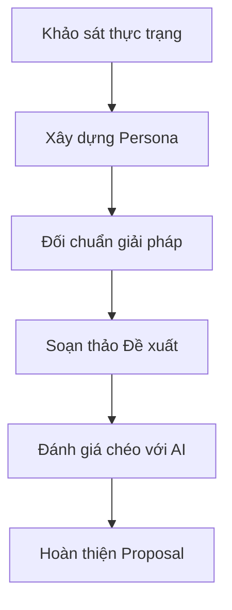
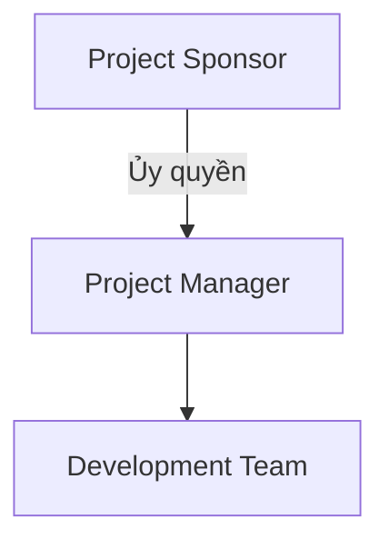
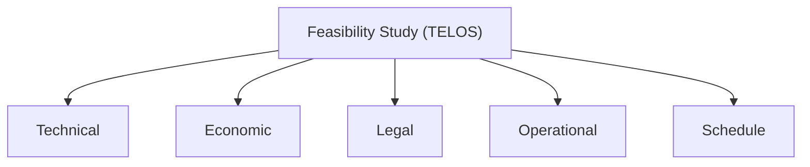

# PHIẾU BÀI LÀM ÔN TẬP — NGƯỜI 1: KHỞI TẠO, ĐIỀU LỆ & TÍNH KHẢ THI

- **Họ và tên thành viên:** Nguyễn Quang Thái
- **Mã số sinh viên:** 23127116
- **Phạm vi phụ trách:** **Câu 1, Câu 3, Câu 8**
- **Hạn chót hoàn thành (Bước 1):** **20:00, Thứ Năm (20/08/2026)**
- **Lưu ý quan trọng khi sửa `docs/`:** Nếu bạn chỉnh sửa hoặc tạo mới file trong thư mục `docs/`, **bắt buộc phải ghi lại bảng Document Revision History** ở đầu file và **ghi 1 dòng log công việc** vào file [`docs/03-execution-monitoring/02-project-log.md`](../../../docs/03-execution-monitoring/02-project-log.md).
- **Tài liệu tham chiếu trong dự án (thực hành):**
  - [`docs/01-initiation/01-project-idea.md`](../../../docs/01-initiation/01-project-idea.md) (Ý tưởng và bối cảnh nhu cầu)
  - [`docs/01-initiation/02-project-proposal.md`](../../../docs/01-initiation/02-project-proposal.md) (Đề xuất dự án)
  - [`docs/01-initiation/03-feasibility-study.md`](../../../docs/01-initiation/03-feasibility-study.md) (Báo cáo tính khả thi TELOS)
  - [`docs/01-initiation/04-project-charter.md`](../../../docs/01-initiation/04-project-charter.md) (Ủy nhiệm dự án & RACI)
- **Tài liệu lý thuyết tham chiếu (từ bài giảng):**
  - [`materials/02_software_project.md`](../../../materials/02_software_project.md) (Dự án phần mềm là gì, Project vs Operation vs Program vs Portfolio, Ràng buộc dự án, Nguyên nhân thất bại)
  - [`materials/03_software_project_initiation.md`](../../../materials/03_software_project_initiation.md) (Quy trình Khởi tạo dự án, Proposal, Charter, Feasibility Study, Stakeholder Analysis)
- **Ghi chú bài giảng trên lớp ([`note.md`](../../../note.md)):**
  - **Buổi 02, 03, 04:** Kỹ thuật prompt RACFT (Role-Ask-Context-Format-Tone), Context Engineering cực đoan, phân tích nỗi đau người dùng (Pain point, fear, high cost, time consuming), định giá TCO, khái niệm MOAT (hào bảo vệ sản phẩm), quy tắc Storytelling khi vấn đáp.
  - **Buổi 05:** Khởi tạo dự án kết thúc khi có Project Charter; 5 khía cạnh TELOS và đối chuẩn đối thủ (Lạc Việt, DSpace).
- **Đọc chéo liên kết:** Nên đọc thêm phần của **Người 2** (Câu 2: Vision & Scope) vì GV có thể hỏi chéo về mối liên hệ giữa Proposal và Vision & Scope, và phần của **Người 4** (Câu 11: Kế hoạch dự án) vì Charter đặt nền tảng cho Project Plan.
- **Checklist bản in nộp kèm khi thi:**
  - [ ] Bản in tài liệu Đề xuất dự án (`02-project-proposal.md`) -- danh dau so cau hoi "1" o goc tren phai.
  - [ ] Bản in tài liệu Ủy nhiệm dự án (`04-project-charter.md`) -- danh dau so cau hoi "3" o goc tren phai.
  - [ ] Bản in tài liệu Báo cáo tính khả thi (`03-feasibility-study.md`) -- danh dau so cau hoi "8" o goc tren phai.
- **Chiến lược 10 phút viết giấy A4:** Phút 1-2: Viết tiêu đề câu + dàn ý WHAT-HOW-WHY-EVIDENCE. Phút 3-7: Triển khai mỗi mục 3-4 dòng ngắn gọn, ưu tiên HOW (các bước nhóm đã làm) và EVIDENCE (số liệu cụ thể). Phút 8-9: Vẽ 1 sơ đồ nhỏ minh họa. Phút 10: Rà soát, bổ sung từ khóa quan trọng còn thiếu.

---

## CÂU 1: ĐỀ XUẤT DỰ ÁN (PROJECT PROPOSAL)

> **Đề bài:** Trình bày quá trình hình thành và phương pháp đánh giá tài liệu Đề xuất dự án (Project Proposal) của nhóm. _(Sinh viên nộp kèm bản in tài liệu Đề xuất dự án của nhóm.)_

### 1. Gợi ý định hướng & Từ khóa cốt lõi:

- **Tài liệu đối chiếu:** `02-project-proposal.md` (Mã HCMUS-LDMS-02).
- **Từ khóa:** Nỗi đau Thư viện (40% sách cũ nát, 15km đi lại), Persona (SV Linh, Cô Mai, BGH), Đối chuẩn (Lạc Việt, DSpace), Kỹ thuật RACFT prompt AI chéo, Tiết kiệm ngân sách (18.5M vs 300M+).

### 2. Không gian tự biên soạn câu trả lời:

#### A. Dàn ý trình bày trên giấy A4 (WHAT - HOW - WHY - EVIDENCE)

- **WHAT (Là gì?):**
  _Viết câu trả lời của bạn vào đây:_

- **HOW (Quá trình nhóm thực hiện 4 bước):**
  _Viết câu trả lời của bạn vào đây:_

- **WHY (Tại sao phải làm đề xuất dự án?):**
  _Viết câu trả lời của bạn vào đây:_

- **EVIDENCE (Số liệu minh chứng cụ thể trong dự án):**
  _Viết câu trả lời của bạn vào đây:_

#### B. Sơ đồ tư duy / Luồng hình thành và đánh giá Đề xuất dự án

_Vẽ sơ đồ Mermaid hoặc phác thảo luồng vào đây:_

#### C. Trả lời chi tiết 100% Bộ câu hỏi thường gặp của Giảng viên

1. **Các câu hỏi chính cần trả lời trong tài liệu Đề xuất dự án là gì?**
   - _Trả lời:_

2. **Các đầu vào cần thiết và các bước nhóm đã thực hiện để tạo tài liệu Đề xuất dự án là gì?**
   - _Trả lời:_

3. **Dựa vào những dữ liệu nào mà bản đề xuất được hình thành?**
   - _Trả lời:_

4. **Các sản phẩm cạnh tranh trực tiếp với đề xuất là gì?**
   - _Trả lời:_

5. **Tài liệu Đề xuất dự án của nhóm đã được đánh giá thế nào?**
   - _Trả lời:_

6. **Tại sao cần tạo tài liệu Đề xuất dự án?**
   - _Trả lời:_

7. **Tài liệu Đề xuất dự án của nhóm đã được sử dụng và cập nhật trong quá trình thực hiện dự án như thế nào?**
   - _Trả lời:_

8. **Dự án phần mềm là gì?**
   - _Trả lời:_

9. **Phân biệt dự án (project) với hoạt động (operation), với chương trình (program), và với danh mục đầu tư (portfolio):**
   - _Trả lời:_

10. **Dự án phần mềm đến từ đâu?**
    - _Trả lời:_

11. **Phạm vi dự án là gì?**
    - _Trả lời:_

12. **Các vai trò nào thường tham gia vào một dự án phần mềm?**
    - _Trả lời:_

13. **Phân biệt các loại kết quả của một dự án (Deliverables vs Outcomes vs Benefits):**
    - _Trả lời:_

14. **Phân tích các nguyên nhân chính khiến một dự án phần mềm thất bại:**
    - _Trả lời:_

15. **Các ràng buộc của một dự án có ý nghĩa gì?**
    - _Trả lời:_

---

## CÂU 3: ỦY NHIỆM DỰ ÁN (PROJECT CHARTER)

> **Đề bài:** Trình bày quá trình hình thành và phương pháp đánh giá tài liệu Ủy nhiệm dự án (Project Charter) của nhóm. _(Sinh viên nộp kèm bản in tài liệu Ủy nhiệm dự án của nhóm.)_

### 1. Gợi ý định hướng & Từ khóa cốt lõi:

- **Tài liệu đối chiếu:** `04-project-charter.md` (Mã HCMUS-LDMS-04).
- **Từ khóa:** Sponsor phê duyệt, Trao quyền cho PM, Mục tiêu SMART (500 giáo trình, tra cứu < 2s), Ma trận RACI, Ngân sách trần 100M, Lộ trình 20 tuần.

### 2. Không gian tự biên soạn câu trả lời:

#### A. Dàn ý trình bày trên giấy A4 (WHAT - HOW - WHY - EVIDENCE)

- **WHAT (Là gì?):**
  _Viết câu trả lời của bạn vào đây:_

- **HOW (Quá trình nhóm thực hiện):**
  _Viết câu trả lời của bạn vào đây:_

- **WHY (Tại sao cần Project Charter?):**
  _Viết câu trả lời của bạn vào đây:_

- **EVIDENCE (Minh chứng trong dự án):**
  _Viết câu trả lời của bạn vào đây:_

#### B. Sơ đồ Ma trận Quyền hạn & Phân bổ Trách nhiệm RACI

_Vẽ sơ đồ Mermaid hoặc bảng RACI vào đây:_

#### C. Trả lời chi tiết 100% Bộ câu hỏi thường gặp của Giảng viên

1. **Các câu hỏi chính cần trả lời trong tài liệu Ủy nhiệm dự án là gì?**
   - _Trả lời:_

2. **Các đầu vào cần thiết và các bước nhóm đã thực hiện để tạo tài liệu Ủy nhiệm dự án là gì?**
   - _Trả lời:_

3. **Tài liệu Ủy nhiệm dự án của nhóm đã được đánh giá thế nào?**
   - _Trả lời:_

4. **Tại sao cần tạo tài liệu Ủy nhiệm dự án?**
   - _Trả lời:_

5. **Tài liệu Ủy nhiệm dự án của nhóm đã được sử dụng và cập nhật trong quá trình thực hiện dự án như thế nào?**
   - _Trả lời:_

---

## CÂU 8: BÁO CÁO TÍNH KHẢ THI (FEASIBILITY STUDY REPORT)

> **Đề bài:** Trình bày quá trình hình thành và phương pháp đánh giá tài liệu Báo cáo tính khả thi của nhóm. _(Sinh viên nộp kèm bản in tài liệu Báo cáo tính khả thi của nhóm.)_

### 1. Gợi ý định hướng & Từ khóa cốt lõi:

- **Tài liệu đối chiếu:** `03-feasibility-study.md` (Mã HCMUS-LDMS-03).
- **Từ khóa:** Khung TELOS (Technical, Economic, Legal, Operational, Schedule), TCO (Capex 12.5M + Opex 6M = 18.5M), Bản quyền DRM Signed URL 15m, Tesseract OCR.

### 2. Không gian tự biên soạn câu trả lời:

#### A. Dàn ý trình bày trên giấy A4 (WHAT - HOW - WHY - EVIDENCE)

- **WHAT (Là gì?):**
  _Viết câu trả lời của bạn vào đây:_

- **HOW (Phân tích 5 khía cạnh TELOS):**
  _Viết câu trả lời của bạn vào đây:_

- **WHY (Tại sao cần làm Báo cáo tính khả thi?):**
  _Viết câu trả lời của bạn vào đây:_

- **EVIDENCE (Minh chứng trong dự án):**
  _Viết câu trả lời của bạn vào đây:_

#### B. Sơ đồ Khung Đánh giá Tính Khả thi TELOS

#### C. Trả lời chi tiết 100% Bộ câu hỏi thường gặp của Giảng viên

1. **Các câu hỏi chính cần trả lời trong tài liệu Báo cáo tính khả thi là gì?**
   - _Trả lời:_

2. **Các đầu vào cần thiết và các bước nhóm đã thực hiện để tạo tài liệu Báo cáo tính khả thi là gì?**
   - _Trả lời:_

3. **Tài liệu Báo cáo tính khả thi của nhóm đã được đánh giá thế nào?**
   - _Trả lời:_

4. **Tại sao cần tạo tài liệu Báo cáo tính khả thi?**
   - _Trả lời:_

5. **Tài liệu Báo cáo tính khả thi của nhóm đã được sử dụng trong quá trình thực hiện dự án như thế nào?**
   - _Trả lời:_
