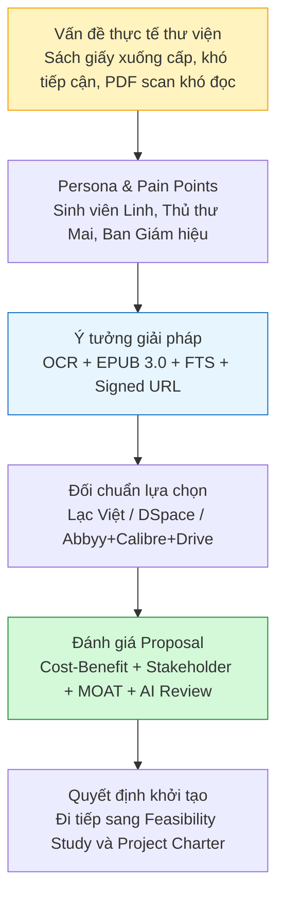
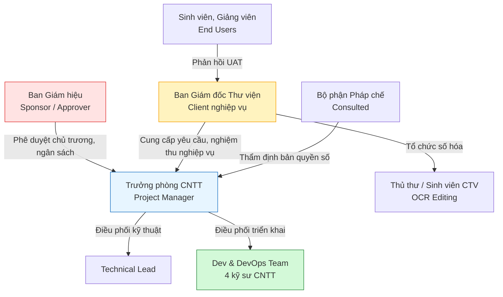
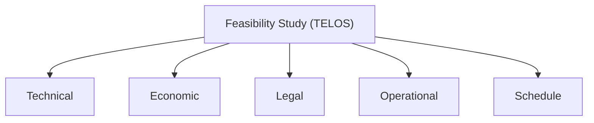

# PHIẾU BÀI LÀM ÔN TẬP — NGƯỜI 1: KHỞI TẠO, ĐIỀU LỆ & TÍNH KHẢ THI

- **Họ và tên thành viên:** Nguyễn Quang Thái
- **Mã số sinh viên:** 23127116
- **Phạm vi phụ trách:** **Câu 1, Câu 3, Câu 8**
- **Hạn chót hoàn thành (Bước 1):** **20:00, Thứ Năm (20/08/2026)**
- **Lưu ý quan trọng khi sửa `docs/`:** Nếu bạn chỉnh sửa hoặc tạo mới file trong thư mục `docs/`, **bắt buộc phải ghi lại bảng Document Revision History** ở đầu file và **ghi 1 dòng log công việc** vào file [`docs/03-execution-monitoring/02-project-log.md`](../../../docs/03-execution-monitoring/02-project-log.md).
- **Tài liệu tham chiếu trong dự án (thực hành):**
  - [`docs/01-initiation/01-project-idea.md`](../../../docs/01-initiation/01-project-idea.md) (Ý tưởng và bối cảnh nhu cầu)
  - [`docs/01-initiation/02-project-proposal.md`](../../../docs/01-initiation/02-project-proposal.md) (Đề xuất dự án)
  - [`docs/01-initiation/03-feasibility-study.md`](../../../docs/01-initiation/03-feasibility-study.md) (Báo cáo tính khả thi TELOS)
  - [`docs/01-initiation/04-project-charter.md`](../../../docs/01-initiation/04-project-charter.md) (Ủy nhiệm dự án & RACI)
- **Tài liệu lý thuyết tham chiếu (từ bài giảng):**
  - [`materials/02_software_project.md`](../../../materials/02_software_project.md) (Dự án phần mềm là gì, Project vs Operation vs Program vs Portfolio, Ràng buộc dự án, Nguyên nhân thất bại)
  - [`materials/03_software_project_initiation.md`](../../../materials/03_software_project_initiation.md) (Quy trình Khởi tạo dự án, Proposal, Charter, Feasibility Study, Stakeholder Analysis)
- **Ghi chú bài giảng trên lớp ([`note.md`](../../../note.md)):**
  - **Buổi 02, 03, 04:** Kỹ thuật prompt RACFT (Role-Ask-Context-Format-Tone), Context Engineering cực đoan, phân tích nỗi đau người dùng (Pain point, fear, high cost, time consuming), định giá TCO, khái niệm MOAT (hào bảo vệ sản phẩm), quy tắc Storytelling khi vấn đáp.
  - **Buổi 05:** Khởi tạo dự án kết thúc khi có Project Charter; 5 khía cạnh TELOS và đối chuẩn đối thủ (Lạc Việt, DSpace).
- **Đọc chéo liên kết:** Nên đọc thêm phần của **Người 2** (Câu 2: Vision & Scope) vì GV có thể hỏi chéo về mối liên hệ giữa Proposal và Vision & Scope, và phần của **Người 4** (Câu 11: Kế hoạch dự án) vì Charter đặt nền tảng cho Project Plan.
- **Checklist bản in nộp kèm khi thi:**
  - [ ] Bản in tài liệu Đề xuất dự án (`02-project-proposal.md`) -- danh dau so cau hoi "1" o goc tren phai.
  - [ ] Bản in tài liệu Ủy nhiệm dự án (`04-project-charter.md`) -- danh dau so cau hoi "3" o goc tren phai.
  - [ ] Bản in tài liệu Báo cáo tính khả thi (`03-feasibility-study.md`) -- danh dau so cau hoi "8" o goc tren phai.
- **Chiến lược 10 phút viết giấy A4:** Phút 1-2: Viết tiêu đề câu + dàn ý WHAT-HOW-WHY-EVIDENCE. Phút 3-7: Triển khai mỗi mục 3-4 dòng ngắn gọn, ưu tiên HOW (các bước nhóm đã làm) và EVIDENCE (số liệu cụ thể). Phút 8-9: Vẽ 1 sơ đồ nhỏ minh họa. Phút 10: Rà soát, bổ sung từ khóa quan trọng còn thiếu.

---

## CÂU 1: ĐỀ XUẤT DỰ ÁN (PROJECT PROPOSAL)

> **Đề bài:** Trình bày quá trình hình thành và phương pháp đánh giá tài liệu Đề xuất dự án (Project Proposal) của nhóm. _(Sinh viên nộp kèm bản in tài liệu Đề xuất dự án của nhóm.)_

### 1. Gợi ý định hướng & Từ khóa cốt lõi:

- **Tài liệu đối chiếu:** `02-project-proposal.md` (Mã HCMUS-LDMS-02).
- **Từ khóa:** Nỗi đau Thư viện (40% sách cũ nát, 15km đi lại), Persona (SV Linh, Cô Mai, BGH), Đối chuẩn (Lạc Việt, DSpace), Kỹ thuật RACFT prompt AI chéo, Tiết kiệm ngân sách (18.5M vs 300M+).

### 2. Không gian tự biên soạn câu trả lời:

#### A. Dàn ý trình bày trên giấy A4 (WHAT - HOW - WHY - EVIDENCE)

- **WHAT (Là gì?):**
  Đề xuất dự án là tài liệu khởi tạo dùng để chứng minh một ý tưởng phần mềm **đáng làm, có vấn đề thật, có người hưởng lợi thật và có cơ sở để đầu tư**. Với HCMUS-LDMS, Proposal trả lời câu hỏi: vì sao HCMUS cần xây dựng hệ thống quản lý và số hóa tài liệu thư viện thay vì tiếp tục vận hành kho sách giấy, PDF scan rời rạc hoặc mua một hệ thống thương mại đắt tiền. Tài liệu này mô tả bối cảnh, nỗi đau người dùng, giải pháp đề xuất, đối chuẩn đối thủ, chi phí-lợi ích, stakeholder, rủi ro kinh doanh và khuyến nghị triển khai.

- **HOW (Quá trình nhóm thực hiện 4 bước):**
  Nhóm hình thành Proposal theo 4 bước. **Bước 1:** xuất phát từ vấn đề thực tế của Thư viện HCMUS: tài liệu giấy xuống cấp, sinh viên cơ sở Thủ Đức khó tiếp cận tài liệu ở Quận 5, PDF scan khó đọc trên điện thoại và thủ thư mất nhiều thời gian xử lý thủ công. **Bước 2:** chuyển các vấn đề đó thành persona và hành trình người dùng: sinh viên Linh cần tra cứu từ xa, cô thủ thư Mai cần giảm tải vận hành, Ban Giám hiệu cần chuyển đổi số tiết kiệm chi phí. **Bước 3:** đối chuẩn với Lạc Việt Vebrary, DSpace và phương án ghép công cụ rời rạc như Abbyy + Calibre + Drive để chứng minh hướng tự xây HCMUS-LDMS có lợi thế về chi phí, bảo mật bản quyền, quy trình OCR/EPUB khép kín và tìm kiếm toàn văn. **Bước 4:** đánh giá đề xuất bằng Cost-Benefit, Stakeholder Analysis, MOAT Analysis và rà soát chéo bằng AI theo prompt RACFT để làm rõ tính thuyết phục trước khi chuyển sang Feasibility Study và Project Charter.

- **WHY (Tại sao phải làm đề xuất dự án?):**
  Cần Proposal vì ở giai đoạn khởi tạo, nhóm chưa nên nhảy ngay vào thiết kế hoặc code. Proposal giúp trả lời câu hỏi quản trị quan trọng nhất: **có nên đầu tư dự án này không?** Nếu không có Proposal, dự án dễ thất bại vì mục tiêu mơ hồ, stakeholder không thống nhất, phạm vi bị phình và không có lý do kinh doanh rõ ràng. Với HCMUS-LDMS, Proposal đóng vai trò “cửa lọc đầu tiên”: chỉ khi chứng minh được nỗi đau thư viện là thật, giải pháp tự xây có lợi thế hơn mua ngoài, chi phí nằm trong khả năng và rủi ro có thể kiểm soát thì dự án mới xứng đáng đi tiếp sang Charter, Backlog, Architecture và Project Plan.

- **EVIDENCE (Số liệu minh chứng cụ thể trong dự án):**
  - Tài liệu gốc: [`docs/01-initiation/02-project-proposal.md`](../../../docs/01-initiation/02-project-proposal.md), mã tài liệu `HCMUS-LDMS-PRP`, trạng thái `Đang thẩm định`.
  - Nỗi đau người dùng: sinh viên phải di chuyển từ Linh Trung về Quận 5 để tiếp cận tài liệu độc bản; thủ thư gặp quá tải kho kệ, xử lý mượn/trả và tra cứu thủ công.
  - Giải pháp đề xuất: OCR bằng Tesseract, giao diện soát lỗi chia đôi màn hình, đóng gói EPUB 3.0, tìm kiếm toàn văn PostgreSQL FTS, đọc trực tuyến bảo mật bằng Signed URL tự hủy sau 15 phút.
  - Đối chuẩn: HCMUS-LDMS được so với Lạc Việt Vebrary, DSpace và Abbyy + Calibre + Drive theo các tiêu chí chi phí, OCR/soát lỗi, DRM, tìm kiếm toàn văn, khả năng tùy biến.
  - Kết quả kỳ vọng: tra cứu toàn văn dưới 3 giây, OCR thô tối thiểu 85%, giảm rủi ro rò rỉ file gốc và tối ưu chi phí bằng công nghệ mã nguồn mở.

#### B. Sơ đồ tư duy / Luồng hình thành và đánh giá Đề xuất dự án

#### C. Trả lời chi tiết 100% Bộ câu hỏi thường gặp của Giảng viên

1. **Các câu hỏi chính cần trả lời trong tài liệu Đề xuất dự án là gì?**
   - _Trả lời:_ Proposal cần trả lời 6 câu hỏi chính: (1) vấn đề thực tế là gì; (2) ai đang bị ảnh hưởng; (3) giải pháp phần mềm đề xuất là gì; (4) vì sao giải pháp này tốt hơn phương án thay thế; (5) chi phí, lợi ích và rủi ro cấp cao ra sao; (6) có nên cho phép dự án đi tiếp sang giai đoạn lập điều lệ và lập kế hoạch hay không.

2. **Các đầu vào cần thiết và các bước nhóm đã thực hiện để tạo tài liệu Đề xuất dự án là gì?**
   - _Trả lời:_ Đầu vào gồm ý tưởng dự án, bối cảnh thư viện, persona sinh viên/thủ thư/Ban Giám hiệu, phân tích đối thủ và bài học lý thuyết về khởi tạo dự án. Các bước nhóm làm là: thu thập pain points, mô tả giải pháp LDMS, phân tích cost-benefit, đối chuẩn với giải pháp thương mại/nguồn mở/công cụ rời rạc, nhận diện stakeholder và rủi ro, sau đó chốt khuyến nghị đầu tư.

3. **Dựa vào những dữ liệu nào mà bản đề xuất được hình thành?**
   - _Trả lời:_ Bản đề xuất dựa trên dữ liệu nghiệp vụ và kỹ thuật: tình trạng sách giấy và kho kệ thư viện, rào cản đi lại giữa hai cơ sở, khó khăn khi đọc PDF scan trên điện thoại, nhu cầu tìm kiếm toàn văn, yêu cầu bảo vệ bản quyền số, khả năng dùng công nghệ mã nguồn mở như FastAPI, React, PostgreSQL FTS, MinIO, Tesseract OCR và Pandoc.

4. **Các sản phẩm cạnh tranh trực tiếp với đề xuất là gì?**
   - _Trả lời:_ Có 3 nhóm phương án cạnh tranh: (1) phần mềm thương mại như Lạc Việt Vebrary; (2) nền tảng nguồn mở như DSpace; (3) phương án ghép công cụ rời rạc như Abbyy OCR, Calibre và Google Drive. Proposal kết luận HCMUS-LDMS phù hợp hơn vì tích hợp khép kín OCR, soát lỗi, EPUB, tìm kiếm toàn văn và bảo mật đọc trực tuyến theo đúng nghiệp vụ thư viện HCMUS.

5. **Tài liệu Đề xuất dự án của nhóm đã được đánh giá thế nào?**
   - _Trả lời:_ Tài liệu được đánh giá bằng 4 lớp: Cost-Benefit Analysis để xem lợi ích có xứng đáng với chi phí; Benchmarking để so với Lạc Việt, DSpace và phương án ghép công cụ; Stakeholder Analysis để xác định ai hưởng lợi và ai phê duyệt; MOAT Analysis để kiểm tra lợi thế bền vững như nội dung độc quyền, chi phí chuyển đổi cao và dữ liệu tích lũy.

6. **Tại sao cần tạo tài liệu Đề xuất dự án?**
   - _Trả lời:_ Proposal là cơ sở xin chủ trương đầu tư. Nó giúp nhóm không khởi động dự án chỉ vì “có ý tưởng hay”, mà phải chứng minh ý tưởng giải quyết vấn đề thật, có khách hàng/người dùng thật, có giá trị kinh tế hoặc vận hành, có đối thủ để so sánh và có đủ lý do để sponsor cấp quyền đi tiếp.

7. **Tài liệu Đề xuất dự án của nhóm đã được sử dụng và cập nhật trong quá trình thực hiện dự án như thế nào?**
   - _Trả lời:_ Proposal được dùng làm nền cho các tài liệu sau: Vision & Scope kế thừa mục tiêu và phạm vi; Feasibility Study kiểm tra tính khả thi TELOS; Project Charter chuyển đề xuất thành ủy quyền chính thức; Product Backlog chuyển giải pháp thành user stories. Tài liệu cũng đã được cập nhật nhiều phiên bản, từ bản nháp ban đầu đến bản Việt hóa, bổ sung đối chuẩn đối thủ và đồng bộ công nghệ mới.

8. **Dự án phần mềm là gì?**
   - _Trả lời:_ Dự án phần mềm là một nỗ lực tạm thời để tạo ra một sản phẩm, dịch vụ hoặc kết quả phần mềm duy nhất. Nó có thời điểm bắt đầu/kết thúc, ngân sách, nguồn lực, phạm vi, lịch trình và sản phẩm bàn giao rõ ràng. HCMUS-LDMS là dự án phần mềm vì nó có mục tiêu cụ thể, thời lượng 20 tuần, ngân sách giới hạn và sản phẩm bàn giao là hệ thống thư viện số.

9. **Phân biệt dự án (project) với hoạt động (operation), với chương trình (program), và với danh mục đầu tư (portfolio):**
   - _Trả lời:_ Project là nỗ lực tạm thời tạo ra kết quả duy nhất, ví dụ xây HCMUS-LDMS trong 20 tuần. Operation là hoạt động lặp lại liên tục, ví dụ thư viện vận hành mượn/trả sách hằng ngày sau khi hệ thống go-live. Program là nhóm nhiều dự án liên quan được quản lý phối hợp, ví dụ chương trình chuyển đổi số toàn trường gồm thư viện số, LMS và cổng sinh viên. Portfolio là tập hợp các chương trình/dự án để đạt mục tiêu chiến lược, ví dụ danh mục đầu tư CNTT của HCMUS.

10. **Dự án phần mềm đến từ đâu?**
    - _Trả lời:_ Dự án phần mềm có thể đến từ RFP, nhu cầu tổ chức, nghiên cứu, kinh nghiệm chuyên ngành, ý tưởng cá nhân hoặc vấn đề thực tế trong vận hành. HCMUS-LDMS đến từ vấn đề thực tế của thư viện: tài liệu giấy khó bảo quản, khó tiếp cận từ xa, khó tìm kiếm nội dung và khó bảo vệ bản quyền khi số hóa bằng cách rời rạc.

11. **Phạm vi dự án là gì?**
    - _Trả lời:_ Phạm vi dự án là toàn bộ công việc cần làm để tạo ra sản phẩm bàn giao. Cần phân biệt với phạm vi sản phẩm: phạm vi sản phẩm là các tính năng của HCMUS-LDMS như OCR, EPUB, tìm kiếm, đọc online; còn phạm vi dự án là các công việc khảo sát, thiết kế, phát triển, kiểm thử, số hóa thí điểm, triển khai và đào tạo.

12. **Các vai trò nào thường tham gia vào một dự án phần mềm?**
    - _Trả lời:_ Các vai trò thường có gồm Sponsor, Client/Product Owner, Project Manager, Business Analyst, Software Architect, Developer, Tester/QA, DevOps, người dùng cuối và các bên tham vấn như pháp chế/bảo mật. Trong HCMUS-LDMS, Sponsor là Ban Giám hiệu, nghiệp vụ là Thư viện, kỹ thuật là Phòng CNTT, người dùng cuối là sinh viên/giảng viên.

13. **Phân biệt các loại kết quả của một dự án (Deliverables vs Outcomes vs Benefits):**
    - _Trả lời:_ Deliverables là sản phẩm bàn giao cụ thể, ví dụ Web Portal, Admin Dashboard, EPUB, tài liệu hướng dẫn. Outcomes là thay đổi sau khi dùng sản phẩm, ví dụ sinh viên tra cứu tài liệu từ xa, thủ thư số hóa và xuất bản sách nhanh hơn. Benefits là lợi ích dài hạn, ví dụ bảo tồn tri thức, giảm tải kho sách, tăng trải nghiệm học tập và hỗ trợ chuyển đổi số.

14. **Phân tích các nguyên nhân chính khiến một dự án phần mềm thất bại:**
    - _Trả lời:_ Dự án phần mềm thường thất bại do mục tiêu không rõ, giao tiếp kém, ước lượng sai nguồn lực, báo cáo tiến độ yếu, dùng công nghệ chưa trưởng thành, yêu cầu thay đổi liên tục, quản lý rủi ro kém và thực hành phát triển cẩu thả. Proposal của HCMUS-LDMS cố tình xử lý sớm các nguyên nhân này bằng cách làm rõ problem, stakeholder, scope, đối thủ, chi phí-lợi ích và rủi ro ngay từ giai đoạn khởi tạo.

15. **Các ràng buộc của một dự án có ý nghĩa gì?**
    - _Trả lời:_ Ràng buộc là các giới hạn mà PM phải quản lý khi ra quyết định, thường gồm thời gian, chi phí, phạm vi/chất lượng, nguồn lực và rủi ro. Ý nghĩa của chúng là buộc nhóm phải đánh đổi có kiểm soát: nếu muốn nhanh hơn thì có thể phải giảm phạm vi hoặc tăng nguồn lực; nếu muốn rẻ hơn thì phải dùng công nghệ mã nguồn mở và chấp nhận giới hạn nhất định. Với HCMUS-LDMS, các ràng buộc chính là thời gian 20 tuần, ngân sách hữu hạn, đội kỹ sư kiêm nhiệm và yêu cầu bảo mật bản quyền.

---

## CÂU 3: ỦY NHIỆM DỰ ÁN (PROJECT CHARTER)

> **Đề bài:** Trình bày quá trình hình thành và phương pháp đánh giá tài liệu Ủy nhiệm dự án (Project Charter) của nhóm. _(Sinh viên nộp kèm bản in tài liệu Ủy nhiệm dự án của nhóm.)_

### 1. Gợi ý định hướng & Từ khóa cốt lõi:

- **Tài liệu đối chiếu:** `04-project-charter.md` (Mã HCMUS-LDMS-04).
- **Từ khóa:** Sponsor phê duyệt, Trao quyền cho PM, Mục tiêu SMART (500 giáo trình, tra cứu < 2s), Ma trận RACI, Ngân sách trần 100M, Lộ trình 20 tuần.

### 2. Không gian tự biên soạn câu trả lời:

#### A. Dàn ý trình bày trên giấy A4 (WHAT - HOW - WHY - EVIDENCE)

- **WHAT (Là gì?):**
  Project Charter là tài liệu chính thức **ủy quyền cho dự án được tồn tại** và trao quyền cho PM điều phối nguồn lực. Nếu Proposal trả lời “dự án này có đáng làm không?”, thì Charter trả lời “ai phê duyệt, ai chịu trách nhiệm, phạm vi cấp cao là gì, dùng nguồn lực nào, khi nào hoàn thành và tiêu chí thành công là gì?”. Với HCMUS-LDMS, Charter chính thức hóa mục tiêu xây hệ thống thư viện số, xác định sponsor, PM, stakeholder, RACI, WBS 20 tuần, ngân sách trần và KPIs.

- **HOW (Quá trình nhóm thực hiện):**
  Nhóm tạo Project Charter bằng cách kế thừa Proposal và Feasibility Study rồi chuyển thành quyết định quản trị. **Bước 1:** lấy bối cảnh, lý do đầu tư và giải pháp cấp cao từ Proposal. **Bước 2:** dùng Feasibility Study để xác nhận dự án khả thi về kỹ thuật, kinh tế, pháp lý, vận hành và tiến độ. **Bước 3:** xác định cơ cấu quản trị gồm Sponsor, Client nghiệp vụ, PM, Technical Lead, Dev/DevOps Team. **Bước 4:** phân bổ tài nguyên, ngân sách, WBS, RACI, KPIs và quy chế kiểm soát thay đổi để PM có cơ sở điều hành dự án.

- **WHY (Tại sao cần Project Charter?):**
  Cần Charter vì một dự án không thể vận hành chỉ bằng ý tưởng. Charter tạo tính chính danh: PM được trao quyền, nguồn lực được cấp, stakeholder biết trách nhiệm, phạm vi cấp cao được khóa lại và mọi thay đổi lớn phải qua kiểm soát. Nếu thiếu Charter, nhóm dễ rơi vào tình trạng ai cũng có ý kiến nhưng không ai chịu trách nhiệm cuối cùng, dẫn đến trễ tiến độ, vượt chi phí và scope creep.

- **EVIDENCE (Minh chứng trong dự án):**
  - Tài liệu gốc: [`docs/01-initiation/04-project-charter.md`](../../../docs/01-initiation/04-project-charter.md), mã tài liệu `HCMUS-LDMS-PCH`.
  - Charter nêu tuyên bố ủy quyền chính thức, cơ cấu governance, tài nguyên được cấp, stakeholder analysis, RACI, WBS, KPIs, phương pháp quản lý Hybrid/Kanban và change control.
  - Nguồn lực: ngân sách CapEx **75–95 triệu VNĐ**, OpEx **15–30 triệu VNĐ/năm**, 02 máy quét sách chữ V, 03 máy chủ ảo hóa, 04 kỹ sư CNTT kiêm nhiệm 50%, 10–15 sinh viên cộng tác viên.
  - Mục tiêu/kết quả: số hóa thí điểm 500 cuốn sách CNTT, triển khai trong 20 tuần, tìm kiếm dưới 3 giây, OCR tối thiểu 85%, đọc trực tuyến bảo mật bằng Signed URL.
  - Quy chế kiểm soát thay đổi: thay đổi phạm vi/ngân sách vượt 5% phải có tờ trình và phê duyệt.

#### B. Sơ đồ Ma trận Quyền hạn & Phân bổ Trách nhiệm RACI

#### C. Trả lời chi tiết 100% Bộ câu hỏi thường gặp của Giảng viên

1. **Các câu hỏi chính cần trả lời trong tài liệu Ủy nhiệm dự án là gì?**
   - _Trả lời:_ Charter cần trả lời: dự án được ủy quyền bởi ai; PM là ai và có quyền gì; mục tiêu và deliverables cấp cao là gì; stakeholder chính là ai; tài nguyên/ngân sách nào được cấp; WBS và mốc thời gian ra sao; tiêu chí thành công là gì; giả định, ràng buộc và quy chế kiểm soát thay đổi như thế nào.

2. **Các đầu vào cần thiết và các bước nhóm đã thực hiện để tạo tài liệu Ủy nhiệm dự án là gì?**
   - _Trả lời:_ Đầu vào gồm Proposal, Project Idea, Feasibility Study, stakeholder list, WBS sơ bộ, dự toán chi phí và định hướng công nghệ. Nhóm thực hiện bằng cách: xác nhận lý do đầu tư; xác định sponsor/client/PM/team; phân bổ nguồn lực; lập RACI; đưa ra WBS 20 tuần; đặt KPIs; ghi giả định, ràng buộc và quy trình change control.

3. **Tài liệu Ủy nhiệm dự án của nhóm đã được đánh giá thế nào?**
   - _Trả lời:_ Charter được đánh giá theo 5 tiêu chí quản trị: mục tiêu có rõ và đo được không; quyền hạn PM có đủ để điều phối không; nguồn lực có khớp với phạm vi không; RACI có tránh chồng chéo trách nhiệm không; và cơ chế kiểm soát thay đổi có ngăn scope creep không. Ngoài ra, Charter được đối chiếu với Feasibility Study để bảo đảm dự án khả thi trước khi ủy quyền.

4. **Tại sao cần tạo tài liệu Ủy nhiệm dự án?**
   - _Trả lời:_ Charter cần thiết vì nó biến một đề xuất thành một dự án chính thức. Nó cấp quyền cho PM, xác nhận nguồn lực, thống nhất stakeholder, khóa phạm vi cấp cao và tạo điểm tham chiếu khi có tranh cãi. Trong HCMUS-LDMS, Charter đặc biệt quan trọng vì dự án liên quan nhiều bên: Ban Giám hiệu, Thư viện, Phòng CNTT, Pháp chế, sinh viên và giảng viên.

5. **Tài liệu Ủy nhiệm dự án của nhóm đã được sử dụng và cập nhật trong quá trình thực hiện dự án như thế nào?**
   - _Trả lời:_ Charter được dùng làm nền để lập Project Plan, WBS, Sprint Plan, RACI và tiêu chí kiểm soát chất lượng. Khi công nghệ thay đổi theo hướng đơn giản hóa như Google OAuth 2.0, PostgreSQL FTS và FastAPI BackgroundTasks, Charter được cập nhật để đồng bộ với Product Backlog và Architecture. Trong quá trình thực hiện, nhóm dùng Charter như “hợp đồng quản trị nội bộ” để kiểm tra xem công việc có còn đúng mục tiêu, nguồn lực và phạm vi ban đầu không.

---

## CÂU 8: BÁO CÁO TÍNH KHẢ THI (FEASIBILITY STUDY REPORT)

> **Đề bài:** Trình bày quá trình hình thành và phương pháp đánh giá tài liệu Báo cáo tính khả thi của nhóm. _(Sinh viên nộp kèm bản in tài liệu Báo cáo tính khả thi của nhóm.)_

### 1. Gợi ý định hướng & Từ khóa cốt lõi:

- **Tài liệu đối chiếu:** `03-feasibility-study.md` (Mã HCMUS-LDMS-03).
- **Từ khóa:** Khung TELOS (Technical, Economic, Legal, Operational, Schedule), TCO (Capex 12.5M + Opex 6M = 18.5M), Bản quyền DRM Signed URL 15m, Tesseract OCR.

### 2. Không gian tự biên soạn câu trả lời:

#### A. Dàn ý trình bày trên giấy A4 (WHAT - HOW - WHY - EVIDENCE)

- **WHAT (Là gì?):**
  _Viết câu trả lời của bạn vào đây:_

- **HOW (Phân tích 5 khía cạnh TELOS):**
  _Viết câu trả lời của bạn vào đây:_

- **WHY (Tại sao cần làm Báo cáo tính khả thi?):**
  _Viết câu trả lời của bạn vào đây:_

- **EVIDENCE (Minh chứng trong dự án):**
  _Viết câu trả lời của bạn vào đây:_

#### B. Sơ đồ Khung Đánh giá Tính Khả thi TELOS

#### C. Trả lời chi tiết 100% Bộ câu hỏi thường gặp của Giảng viên

1. **Các câu hỏi chính cần trả lời trong tài liệu Báo cáo tính khả thi là gì?**
   - _Trả lời:_

2. **Các đầu vào cần thiết và các bước nhóm đã thực hiện để tạo tài liệu Báo cáo tính khả thi là gì?**
   - _Trả lời:_

3. **Tài liệu Báo cáo tính khả thi của nhóm đã được đánh giá thế nào?**
   - _Trả lời:_

4. **Tại sao cần tạo tài liệu Báo cáo tính khả thi?**
   - _Trả lời:_

5. **Tài liệu Báo cáo tính khả thi của nhóm đã được sử dụng trong quá trình thực hiện dự án như thế nào?**
   - _Trả lời:_
