# PHIẾU BÀI LÀM ÔN TẬP — NGƯỜI 2: YÊU CẦU NGHIỆP VỤ, PHẠM VI & SOW

| Thông tin | Nội dung |
| :-- | :-- |
| **Phiên bản** | 1.0 |
| **Ngày hoàn thiện** | 18/08/2026 |
| **Người phụ trách** | Ngô Nguyễn Thế Khoa — MSSV 23127065 |
| **Phạm vi** | Câu 2, Câu 4, Câu 12 |
| **Trạng thái** | Đã hoàn thiện đề cương ôn tập; cần in và luyện vấn đáp |

## Mục lục

- [1. Thông tin chuẩn bị](#1-thông-tin-chuẩn-bị)
- [2. Nguyên tắc trả lời và lưu ý về bằng chứng](#2-nguyên-tắc-trả-lời-và-lưu-ý-về-bằng-chứng)
- [3. Câu 2 — Viễn cảnh và phạm vi dự án](#3-câu-2--viễn-cảnh-và-phạm-vi-dự-án)
- [4. Câu 4 — Yêu cầu phần mềm và Product Backlog](#4-câu-4--yêu-cầu-phần-mềm-và-product-backlog)
- [5. Câu 12 — Phát biểu công việc](#5-câu-12--phát-biểu-công-việc)
- [6. Checklist bản in và luyện tập](#6-checklist-bản-in-và-luyện-tập)

---

## 1. Thông tin chuẩn bị

- **Họ và tên:** Ngô Nguyễn Thế Khoa
- **Mã số sinh viên:** 23127065
- **Hạn chót Bước 1:** **20:00, Thứ Năm, 20/08/2026**
- **Chiến lược 10 phút:** Phút 1–2 dựng khung WHAT–HOW–WHY–EVIDENCE; phút 3–7 triển khai HOW và EVIDENCE; phút 8–9 vẽ sơ đồ; phút 10 rà soát từ khóa.
- **Đọc chéo:** Phần Người 1 vì Proposal là đầu vào của Vision & Scope; phần Người 4 vì Backlog là đầu vào của ước lượng.

### 1.1. Tài liệu thực hành phải đối chiếu

- [Vision & Scope — `HCMUS-LDMS-VSD`](../../../docs/02-planning/01-vision-and-scope.md)
- [Product Backlog — `HCMUS-LDMS-PBL`](../../../docs/02-planning/03-product-backlog.md)
- [Statement of Work — `HCMUS-LDMS-SOW`](../../../docs/02-planning/05-statement-of-work.md)
- [Ghi chú bài giảng trên lớp](../../../note.md)
- [Bộ câu hỏi thi cuối kỳ](../../Final%20Exam%20Questions%20-%20Software%20Project%20Management.md)

### 1.2. Tài liệu lý thuyết phải đối chiếu

- [Yêu cầu kinh doanh](../../../materials/03_1_business_requirements.md)
- [Yêu cầu người dùng](../../../materials/03_2_user_requirements.md)
- [Lập kế hoạch dự án phần mềm](../../../materials/06_software_project_planning.md)
- [Ước lượng phần mềm](../../../materials/05_2_introduction_to_software_estimation.md)
- [Lập kế hoạch Agile và hợp đồng linh hoạt](../../../materials/06_1_agile_planning.md)

> Quy định cập nhật Revision History và Project Log chỉ áp dụng khi sửa tài liệu trong `docs/`. Phiếu ôn tập này nằm trong `final-exam/`, nên việc hoàn thiện phiếu không làm thay đổi lịch sử các tài liệu dự án gốc.

---

## 2. Nguyên tắc trả lời và lưu ý về bằng chứng

1. **Kể theo câu chuyện thực tế:** bắt đầu từ quy trình thư viện thủ công, đi qua cách nhóm chuyển workflow thành phạm vi và backlog, rồi kết thúc ở SoW dùng để chốt cam kết.
2. **Phân biệt tài liệu với kết quả đã xác minh:** tài liệu ghi mục tiêu hoặc kế hoạch không đồng nghĩa mục tiêu đã đạt. Chỉ nói “đã nghiệm thu”, “đã ký” hoặc “đã được người dùng chấp nhận” khi có biên bản hoặc bằng chứng tương ứng.
3. **Nêu cả điểm mạnh lẫn sai lệch phát hiện được:** đây là bằng chứng nhóm biết đánh giá tài liệu, không chỉ đọc lại nội dung.
4. **Ưu tiên số liệu có thể chỉ đúng vị trí:** 26 stories; 16 Must-have; 3 services MVP; Signed URL 15 phút; tìm kiếm mục tiêu ≤ 3 giây; OCR mục tiêu ≥ 85%; kế hoạch 20 tuần; 8 deliverables trong SoW.

### 2.1. Các điểm cần nói trung thực khi vấn đáp

| Tài liệu | Trạng thái ghi trong tài liệu | Kết luận được phép nói |
| :-- | :-- | :-- |
| Vision & Scope v3.0 | `Under Review` | Đã trải qua ba phiên bản và có người xem xét/phê duyệt được chỉ định; chưa có bằng chứng phê duyệt cuối cùng. |
| Product Backlog v4.0 | `Ready for Implementation` | Đã sẵn sàng làm đầu vào triển khai theo tài liệu; vẫn còn lỗi chất lượng tài liệu cần sửa. |
| SoW v1.0 | `Pending Approval`, bảng chữ ký còn trống | Mới là bản cam kết dự thảo/chờ ký; chưa được gọi là hợp đồng có hiệu lực. |

### 2.2. Các sai lệch đã phát hiện khi đánh giá chéo

- Product Backlog lặp tiêu đề, lặp nội dung DoD và lặp một số đoạn Forecast/Size.
- Bảng triển khai thực tế phân loại **16 Must, 6 Should, 4 Could**, nhưng phần tổng kết Backlog và SoW ghi **16 Must, 7 Should, 3 Could**. Cần rà soát và chốt một nguồn sự thật trước khi in tài liệu gốc.
- SoW hiện liệt kê **8 deliverables**, không phải 6 như mô tả tóm tắt ban đầu trong kế hoạch chuẩn bị.
- SoW đặt tổng CapEx khoảng **77–106 triệu** và OpEx năm khoảng **15–30 triệu**, trong khi lại yêu cầu CapEx + OpEx năm đầu không vượt **100 triệu**. Hai khoảng này tạo tổng **92–136 triệu**, nên phải tái cơ sở hóa ngân sách hoặc làm rõ cấu hình ngân sách được phê duyệt.
- SoW có bảng chữ ký trống và trạng thái chờ phê duyệt, vì vậy không được khẳng định dự án đã hoàn tất Project Planning bằng hợp đồng đóng dấu.

---

## 3. Câu 2 — Viễn cảnh và phạm vi dự án

> **Đề bài:** Trình bày quá trình hình thành và phương pháp đánh giá tài liệu Viễn cảnh và phạm vi dự án của nhóm. Nộp kèm bản in tài liệu Vision & Scope.

### 3.1. Dàn ý A4 theo WHAT–HOW–WHY–EVIDENCE

#### WHAT — Tài liệu là gì?

Vision & Scope trả lời **sản phẩm cần giải quyết vấn đề gì, phục vụ ai, trạng thái hiện tại và tương lai ra sao, phạm vi nào được làm và không làm**. Theo bài giảng, phải hiểu công việc trước rồi mới chọn sản phẩm hỗ trợ; vì vậy tài liệu bao gồm bối cảnh, workflow As-Is/To-Be, stakeholders, pain points, mục tiêu, tính năng cấp cao, ranh giới phạm vi, giả định và rủi ro.

#### HOW — Nhóm đã hình thành tài liệu như thế nào?

1. Thu thập đầu vào từ Proposal, tình huống vận hành thư viện, hệ thống hiện có/tương tự, yêu cầu ban đầu và quy định bản quyền.
2. Xác định stakeholders và người dùng: Ban Giám hiệu, Ban Giám đốc Thư viện, Phòng CNTT, thủ thư, biên tập viên, sinh viên/giảng viên và admin.
3. Mô tả **As-Is**: quét thủ công thành PDF ảnh, lưu/chia sẻ rời rạc, khó đọc trên mobile, không tìm kiếm nội dung và thiếu DRM/metadata chuẩn.
4. Thiết kế **To-Be** cho hai luồng chính: thủ thư/biên tập viên số hóa–OCR–hiệu chỉnh–xuất bản; độc giả tìm kiếm–đọc EPUB bảo mật.
5. Chuyển pain point thành tính năng cấp cao và yêu cầu phi chức năng; chốt In-Scope/Out-of-Scope để chống scope creep.
6. Đối chiếu workflow với Product Backlog, kiến trúc và SoW; cập nhật qua các phiên bản 1.0, 2.0 và 3.0.

#### WHY — Tại sao cần Vision & Scope?

- Tạo một cách hiểu thống nhất về **đúng vấn đề** trước khi đầu tư vào giải pháp; bài giảng nhấn mạnh giải quyết sai vấn đề là nguyên nhân thất bại hàng đầu.
- Biến nhu cầu mơ hồ thành ranh giới kiểm soát được, tránh thêm audio book, native mobile, AI/RAG hoặc tính năng ngoài MVP không qua đánh giá.
- Là baseline để sinh Product Backlog, kiến trúc, estimate và SoW; nếu Vision sai, toàn bộ tài liệu hạ nguồn sẽ sai theo.
- Tạo tiêu chí để đánh giá giải pháp thay vì chỉ mô tả ý tưởng hấp dẫn.

#### EVIDENCE — Minh chứng dự án

- Tài liệu `HCMUS-LDMS-VSD` có ba phiên bản từ **07/07 đến 17/07/2026**; v3.0 bổ sung đăng nhập To-Be, tách vai trò thủ thư/biên tập viên và cập nhật stack.
- Bốn pain points As-Is được mô tả rõ: không DRM, PDF ảnh không responsive, không tìm kiếm nội dung, metadata không chuẩn.
- To-Be tạo quy trình khép kín: scan 300 DPI → upload/metadata Dublin Core → Tesseract OCR → split-screen human review → Pandoc EPUB 3.0 → PostgreSQL FTS → reader dùng Signed URL.
- Mục tiêu định lượng trong tài liệu gồm tìm kiếm **≤ 3 giây**, OCR **≥ 85%** và Signed URL hết hạn sau **15 phút**.
- In-Scope xác định MVP và tài liệu đào tạo; Out-of-Scope hoãn native mobile, AI/RAG, audio book và các hạng mục không phục vụ luồng cốt lõi.

### 3.2. Sơ đồ As-Is và To-Be

**Cách vẽ nhanh trên giấy:** chia tờ giấy thành hai hàng. Hàng As-Is có 4 ô “Scan thủ công → PDF ảnh → Drive/link trực tiếp → khó tìm/khó đọc”. Hàng To-Be có 6 ô “Scan → OCR → Human review → EPUB → Search → Reader bảo mật”. Khoanh tròn ba điểm khác biệt: tự động hóa, khả năng tra cứu và kiểm soát bản quyền.

### 3.3. Trả lời bộ câu hỏi thường gặp

#### 1. Các câu hỏi chính cần trả lời trong Vision & Scope là gì?

Tài liệu phải trả lời: **Vì sao** cần sản phẩm; **ai** bị ảnh hưởng và ai có quyền quyết định; **quy trình hiện tại** có vấn đề gì; **trạng thái tương lai** mong muốn ra sao; sản phẩm cung cấp **tính năng cấp cao** nào; **In-Scope/Out-of-Scope** ở đâu; có giả định, phụ thuộc, ràng buộc, rủi ro và tiêu chí thành công nào; sản phẩm khác phương án hiện có ở điểm nào. Với HCMUS-LDMS, trọng tâm là chuyển workflow số hóa thủ công thành chuỗi OCR–hiệu chỉnh–xuất bản–tra cứu–đọc bảo mật.

#### 2. Đầu vào và các bước nhóm đã thực hiện là gì?

Đầu vào gồm Proposal, khảo sát/narrative về thư viện, hệ thống OPAC và lưu file hiện hữu, tài liệu tương tự, quy định sở hữu trí tuệ, nhu cầu của thủ thư và độc giả, cùng giới hạn thời gian–ngân sách–hạ tầng. Nhóm xác định stakeholders, mô hình hóa As-Is, tìm pain points, thiết kế To-Be theo từng vai trò, chuyển workflow thành feature, đặt NFR và tiêu chí đo, tách In/Out-of-Scope, rồi trace sang Backlog–Architecture–SoW. Sau phản biện, nhóm cập nhật đến v3.0.

#### 3. Tài liệu đã được đánh giá thế nào?

Nhóm có thể trình bày bốn lớp đánh giá:

1. **Đúng vấn đề:** mỗi feature phải truy ngược được về pain point hoặc bước To-Be.
2. **Đủ và nhất quán:** stakeholders, workflow, phạm vi, NFR và deliverables không mâu thuẫn với Backlog/Architecture/SoW.
3. **Đo được:** dùng các ngưỡng OCR ≥ 85%, search ≤ 3 giây, Signed URL 15 phút và luồng EPUB đọc được.
4. **Review và phiên bản hóa:** v1.0 → v2.0 → v3.0, có reviewer/approver được chỉ định.

Kết luận trung thực: tài liệu có cấu trúc và số đo rõ, nhưng trạng thái vẫn là `Under Review`; ghi chú lớp còn phê bình Vision có phần quy trình hiện tại dài. Vì vậy cần rút gọn bản trình bày và lấy xác nhận stakeholder trước khi gọi là approved.

#### 4. Tại sao cần tạo Vision & Scope?

Vì nó là cầu nối từ business problem sang solution boundary. Không có tài liệu này, nhóm dễ tối ưu kỹ thuật cho sai vấn đề, không biết tính năng nào phục vụ workflow nào, hoặc để scope creep làm vỡ thời gian và chi phí. Nó cũng cung cấp baseline để đánh giá thay đổi: thay đổi nào vẫn phục vụ vision, thay đổi nào phải hoãn hoặc lập Change Request.

#### 5. Tài liệu được sử dụng và cập nhật thế nào?

Vision & Scope được dùng để phân rã 4 Epic và 26 User Stories, chọn kiến trúc/stack cho MVP, xác định tiêu chí PoC, lập Estimate và chốt phạm vi trong SoW. Lịch sử phiên bản cho thấy tài liệu được cập nhật khi nhóm làm rõ Domain Model, Glossary, As-Is/To-Be, vai trò người dùng và stack. Trong thực thi, khi stakeholder thay đổi nhu cầu, nhóm phải đánh giá tác động, cập nhật Vision nếu thay đổi mục tiêu/phạm vi cấp cao, sau đó đồng bộ Backlog, kiến trúc, estimate và SoW theo Change Control.

### 3.4. Câu chuyện trình bày 60–90 giây

“Nhóm em bắt đầu từ vấn đề tài liệu thư viện đang được quét thành PDF ảnh và chia sẻ rời rạc. Sinh viên khó tìm kiếm, khó đọc trên điện thoại, còn thư viện khó bảo vệ bản quyền. Từ workflow As-Is đó, nhóm phỏng theo nhu cầu của thủ thư, biên tập viên và độc giả để thiết kế To-Be: scan, OCR, con người hiệu chỉnh, xuất EPUB, tìm kiếm và đọc qua URL có thời hạn. Nhóm chốt ranh giới MVP và đưa native mobile, AI/RAG ra ngoài phạm vi. Tài liệu này trở thành baseline cho 26 backlog items và SoW. Khi đánh giá, nhóm kiểm tra traceability, tính đo được và sự nhất quán; hiện tài liệu đã lên v3.0 nhưng vẫn Under Review nên em không coi đó là phê duyệt cuối cùng.”

---

## 4. Câu 4 — Yêu cầu phần mềm và Product Backlog

> **Đề bài:** Trình bày quá trình hình thành và phương pháp đánh giá tài liệu Yêu cầu phần mềm/Product Backlog. Nộp kèm Product Backlog và User Guide.

### 4.1. Dàn ý A4 theo WHAT–HOW–WHY–EVIDENCE

#### WHAT — Product Backlog là gì?

Product Backlog là danh sách yêu cầu có thứ tự ưu tiên và có thể cập nhật của sản phẩm. Trong HCMUS-LDMS, mỗi item có **ID, module, size, dependency, MoSCoW, User Story và Acceptance Criteria**. Backlog biến feature cấp cao thành đơn vị có thể xây dựng, kiểm thử và nghiệm thu. DoR quyết định khi nào story đủ rõ để bắt đầu; DoD quyết định khi nào story thực sự hoàn thành.

#### HOW — Nhóm hình thành Backlog như thế nào?

1. Lấy hai workflow To-Be và feature list từ Vision & Scope.
2. Gom yêu cầu thành 4 Epic: Platform, Identity, Digitization/Publish và Search/Reader; ánh xạ vào 9 module M0–M8.
3. Viết story theo góc nhìn người dùng, bổ sung AC có thể kiểm tra, dependency và size S/M.
4. Ưu tiên MoSCoW: làm Must trước, sau đó Should và Could; sắp thứ tự theo dependency thành 5 giai đoạn.
5. Áp dụng Kanban với WIP = 1 card/người; chỉ kéo card khi đạt DoR.
6. Chỉ tính Done khi đạt 5 điều kiện duy nhất: AC pass, code merge qua PR, chạy local, README cập nhật và log effort/token.
7. Đo throughput stories Done/7 ngày để forecast phần còn lại; cập nhật backlog khi scope hoặc bằng chứng thực thi thay đổi.

#### WHY — Tại sao dùng Product Backlog?

- Duy trì traceability từ workflow → Epic → Story → AC → test/deployment.
- Cho phép ưu tiên theo giá trị và cắt scope có kiểm soát khi thiếu thời gian.
- Tạo “ngôn ngữ chung” giữa Product Owner, người dùng, dev và QA.
- Là đầu vào cho estimate, kế hoạch release, phân công và monitoring.
- Ngăn việc AI hoặc dev tự coi code sinh ra là hoàn thành khi chưa qua AC, review và chạy được.

#### EVIDENCE — Minh chứng dự án

- Backlog v4.0 chứa **26 stories**, từ `LDMS-001` đến `LDMS-026`, chia thành 4 Epic và 9 module.
- 16 Must tạo E2E MVP; implementation map hiện có 6 Should và 4 Could.
- MVP được đơn giản hóa còn **API + PostgreSQL + MinIO**; Google OAuth thay Keycloak, PostgreSQL FTS thay Elasticsearch, FastAPI BackgroundTasks thay Celery/Redis.
- Story `LDMS-001` yêu cầu hệ thống khởi động trong ≤ 5 phút, `/health` trả 200 và có `.env.example`.
- DoD có 5 tiêu chí duy nhất và throughput chỉ đếm story thỏa toàn bộ DoD trong 7 ngày.

### 4.2. Sơ đồ truy vết yêu cầu

**Cách vẽ nhanh trên giấy:** vẽ sáu ô nối tiếp: “Pain point → Workflow → Epic → User Story → AC/Test → Done”. Bên dưới User Story ghi “INVEST”; bên dưới Done ghi “5 điều kiện DoD”.

### 4.3. Trả lời bộ câu hỏi thường gặp

#### 1. Các câu hỏi chính cần trả lời trong tài liệu Yêu cầu phần mềm là gì?

Tài liệu phải cho biết người dùng nào cần gì và vì sao; tính năng/luật nghiệp vụ nào đáp ứng nhu cầu; yêu cầu chức năng và phi chức năng là gì; mức ưu tiên và dependency ra sao; điều kiện chấp nhận từng yêu cầu là gì; ranh giới scope ở đâu; khi nào một item Ready và Done; yêu cầu được truy vết, kiểm thử, cập nhật và phê duyệt như thế nào.

#### 2. Đầu vào và các bước tạo Product Backlog là gì?

Đầu vào gồm Vision & Scope, workflow To-Be của thủ thư/biên tập viên/độc giả, stakeholder needs, business rules, NFR, kiến trúc MVP, PoC và giới hạn nguồn lực. Nhóm phân rã workflow thành feature, gom thành Epic/module, viết User Story và AC, gắn dependency/size/MoSCoW, sắp implementation order, review theo INVEST và tính kiểm thử, rồi cập nhật qua các phiên bản 1.0–4.0. Mỗi lần scope thay đổi, Backlog phải được đồng bộ với Vision, Architecture, Estimate và SoW.

#### 3. Tài liệu Yêu cầu phần mềm đã được đánh giá thế nào?

- **Correctness/Value:** story phải phục vụ một người dùng và một bước workflow thật.
- **Completeness:** item có ID, module, size, dependency, priority, story và AC.
- **Quality:** review theo INVEST; story quá lớn phải tách để đạt S/M và DoR.
- **Verifiability:** AC phải quan sát/đo được; Done chỉ khi AC pass, merge, chạy local, docs và effort log đầy đủ.
- **Consistency/Traceability:** dependency không đứt; Epic/story phải khớp Vision, Architecture và SoW.
- **Execution evidence:** throughput chỉ đếm bản deploy đạt AC, không đếm code đang viết.

Kết quả đánh giá hiện tại: cấu trúc triển khai và AC khá cụ thể, nhưng tài liệu còn đoạn lặp và mâu thuẫn MoSCoW. Do đó trạng thái “Ready for Implementation” không có nghĩa tài liệu hoàn hảo; nhóm cần loại bỏ duplicate và chốt lại 16/6/4 hay 16/7/3.

#### 4. Tại sao cần tạo tài liệu Yêu cầu phần mềm?

Nó chuyển Vision thành phạm vi có thể thực hiện và kiểm thử, giúp các bên thống nhất “xây cái gì” và “thế nào là đạt”. Nó hỗ trợ ưu tiên giá trị, estimate, release plan, test plan, change control và nghiệm thu. Với phát triển có AI, Backlog và AC còn là guardrail để ngăn sinh mã lan man hoặc dừng ở một bản demo chưa đủ chất lượng.

#### 5. Tài liệu được sử dụng và cập nhật thế nào?

Backlog được dùng để kéo card Kanban, phân công theo module, xác định thứ tự phụ thuộc, sinh test từ AC, tính throughput, forecast thời gian và quyết định cắt Could/Should khi trễ. Các phiên bản cho thấy nhóm đã chuẩn hóa story/AC/DoD, thêm Kanban và đơn giản hóa stack. Khi CR được duyệt, SOW yêu cầu cập nhật SOW phiên bản mới rồi cập nhật Product Backlog trước khi tiếp tục phát triển.

#### 6. Giải thích INVEST cho một User Story chất lượng

| Chữ | Ý nghĩa | Cách kiểm tra trong HCMUS-LDMS |
| :--: | :-- | :-- |
| **I — Independent** | Tương đối độc lập | Giảm coupling; dependency được khai báo rõ. |
| **N — Negotiable** | Có thể thương lượng | Story mô tả nhu cầu, không khóa mọi chi tiết giải pháp quá sớm. |
| **V — Valuable** | Có giá trị | Truy ngược được về pain point/workflow của thủ thư, biên tập viên hoặc độc giả. |
| **E — Estimable** | Có thể ước lượng | Đủ rõ về phạm vi, AC và dependency để gán size S/M. |
| **S — Small** | Đủ nhỏ | S ≤ 1 ngày, M ≤ 2 ngày theo Backlog; quá lớn phải tách. |
| **T — Testable** | Có thể kiểm thử | AC có kết quả quan sát/đo được như HTTP 200, thời gian ≤ 5 phút hoặc quyền truy cập bị từ chối. |

### 4.4. Câu chuyện trình bày 60–90 giây

“Từ hai workflow To-Be, nhóm em phân rã thành 4 Epic, 9 module và 26 User Stories. Mỗi story có người dùng, giá trị, AC, dependency, size và MoSCoW. Nhóm dùng Kanban, WIP một card mỗi người; chỉ bắt đầu khi đạt DoR và chỉ tính Done khi AC pass, merge qua PR, chạy local, cập nhật README và log effort/token. Backlog giúp nhóm trace từ pain point đến test và forecast bằng throughput. Khi đánh giá em phát hiện implementation map là 16 Must, 6 Should, 4 Could, nhưng tổng kết lại ghi 16/7/3, đồng thời có đoạn lặp. Vì vậy trước khi in bản chính, nhóm phải sửa sự không nhất quán này.”

---

## 5. Câu 12 — Phát biểu công việc

> **Đề bài:** Trình bày quá trình hình thành và phương pháp đánh giá Statement of Work của nhóm. Nộp kèm bản in SoW.

### 5.1. Dàn ý A4 theo WHAT–HOW–WHY–EVIDENCE

#### WHAT — SoW là gì?

Theo bài giảng, SoW là mô tả chính thức bằng văn bản về **các yêu cầu tối thiểu nhà thầu phải thực hiện**, chủ yếu xác định **WHAT**, không phải thiết kế chi tiết HOW. Nó chốt phạm vi, deliverables, lịch, chi phí, nguồn lực, giả định/ràng buộc, tiêu chí nghiệm thu và quy trình thay đổi. SoW là một thành phần quan trọng của quan hệ hợp đồng nhưng không tự động thay thế toàn bộ Software Contract.

#### HOW — Nhóm xây dựng và kiểm soát thay đổi như thế nào?

1. Lấy Vision & Scope, Product Backlog, Architecture và Cost–Time–Resource Plan làm đầu vào.
2. Đàm phán, reconcile nhu cầu của Sponsor/Client với năng lực Dev Team: phạm vi, stack MVP, thời gian, ngân sách và nhân lực.
3. Chốt In-Scope/Out-of-Scope, 8 deliverables, lịch 20 tuần, chi phí CapEx/OpEx và 8 tiêu chí nghiệm thu.
4. Xác định bốn nhóm bên tham gia: Sponsor, Client, Dev Team và cố vấn pháp lý.
5. Thiết lập Change Control: lập CR → PM phân tích Scope–Feature–Tech–Time–Cost → đúng thẩm quyền phê duyệt → cập nhật SoW và Backlog.
6. Chỉ chuyển sang Execution khi các bên ký; bản hiện tại chưa thỏa bước này vì `Pending Approval` và chữ ký trống.

#### WHY — Tại sao cần SoW và Change Control?

- Biến estimate và mục tiêu thành baseline cam kết mà các bên cùng hiểu.
- Ngăn scope creep, underbid và tranh chấp về “đã bao gồm hay chưa”.
- Gắn deliverable với mốc bàn giao và acceptance criteria để nghiệm thu khách quan.
- Buộc mọi thay đổi phải đánh đổi minh bạch trong tam giác Scope–Time–Cost/Quality.
- Là cơ sở quản trị nhà cung cấp, chi phí, tiến độ, trách nhiệm và bàn giao.

#### EVIDENCE — Minh chứng dự án

- SoW v1.0 ngày **24/07/2026**, trạng thái `Pending Approval`.
- Phạm vi ghi 26 stories, thí điểm 500 giáo trình và đào tạo tối thiểu 2 buổi.
- Có **8 deliverables**, lịch **20 tuần**, 16 Must-have cần Done và 8 acceptance criteria.
- Budget ghi CapEx khoảng **77–106 triệu**, OpEx **15–30 triệu/năm**, AI Tools ≤ **5 triệu**.
- CR nhỏ: ≤ 5% ngân sách hoặc ≤ 1 tuần, PM và Giám đốc Thư viện duyệt; CR lớn cần Ban Giám hiệu.
- Ví dụ thay đổi Keycloak → Google OAuth làm giảm service, tiết kiệm dự kiến 2 tuần và tránh server riêng.

### 5.2. Sơ đồ kiểm soát thay đổi

**Cách vẽ nhanh trên giấy:** vẽ “CR → Impact Analysis → Small/Large?”. Nhánh Small đi đến PM + Library Director; nhánh Large đi đến Sponsor. Hai nhánh nhập lại tại “Approved? → New SoW version + Backlog update”; nếu No thì giữ baseline.

### 5.3. Trả lời bộ câu hỏi thường gặp

#### 1. Các câu hỏi chính cần trả lời trong SoW là gì?

SoW cần trả lời: mục đích và mục tiêu là gì; ai là các bên; công việc nào In-Scope/Out-of-Scope; địa điểm/thời hạn thực hiện; deliverables và lịch bàn giao; tiêu chuẩn và acceptance criteria; ngân sách/nguồn lực; giả định/ràng buộc; trách nhiệm; thay đổi được yêu cầu, đánh giá, phê duyệt và cập nhật thế nào; điều kiện ký/hiệu lực ra sao.

#### 2. Đầu vào và các bước tạo SoW là gì?

Đầu vào gồm Proposal/Charter, Vision & Scope, Backlog, Architecture, Estimate/Cost–Time–Resource Plan, risk/legal constraints và năng lực các bên. Nhóm đối chiếu scope mong muốn với 26 stories và năng lực 6 thành viên; đơn giản hóa stack; xác định deliverables, mốc 20 tuần, ngân sách, acceptance; thỏa thuận CR thresholds; review tính đầy đủ/nhất quán; cuối cùng trình bốn đại diện ký. Hiện bước ký chưa hoàn tất.

#### 3. SoW của nhóm đã được đánh giá thế nào?

- **Coverage:** so với 12 thành phần SoW trong bài giảng và truy vết sang Vision/Backlog.
- **Clarity:** In-Scope, Out-of-Scope, deliverable owner/format/date và vai trò các bên phải rõ.
- **Measurability:** nghiệm thu bằng 16 Must Done, search ≤ 3 giây, OCR ≥ 85%, URL 15 phút, compose ≤ 5 phút và ≥ 500 sách.
- **Feasibility:** kiểm tra lịch, nhân lực, dependency, ngân sách và rủi ro.
- **Changeability:** có ngưỡng CR, thẩm quyền và quy tắc versioning.
- **Approval:** kiểm tra chữ ký và ngày hiệu lực.

Kết luận hiện tại: SoW có phạm vi và acceptance khá cụ thể, nhưng chưa được ký; số MoSCoW không khớp implementation map; tổng budget range có thể vượt trần 100 triệu; mốc 500 sách giữa deliverable và schedule cần rà lại. Vì vậy phải sửa/reconcile và xin ký trước khi dùng làm baseline hợp đồng.

#### 4. Tại sao cần tạo SoW?

Vì các tài liệu trước chỉ diễn đạt nhu cầu, giải pháp và dự đoán. SoW gom kết quả đàm phán thành baseline có thể kiểm tra: ai làm gì, giao cái gì, khi nào, với chi phí nào và tiêu chuẩn nào. Nó giảm thời gian tranh luận, làm cơ sở đánh giá đề xuất/nghiệm thu và hạn chế thay đổi tùy tiện.

#### 5. SoW được sử dụng và cập nhật thế nào?

Khi được ký, SoW định hướng execution, procurement, release gate, nghiệm thu và bàn giao. PM so sánh trạng thái thực tế với scope/schedule/cost baseline. Khi có thay đổi, bên yêu cầu lập CR; PM phân tích tác động; đúng cấp phê duyệt; sau đó tạo phiên bản SoW mới, cập nhật Backlog và các kế hoạch liên quan. Không được sửa lặng lẽ baseline đã ký.

#### 6. Proposal, Estimate và SoW khác nhau về thời gian và chi phí thế nào?

| Tài liệu | Thời điểm | Bản chất thời gian/chi phí | Mức ràng buộc |
| :-- | :-- | :-- | :-- |
| **Proposal** | Rất sớm, trước khi lập kế hoạch chi tiết | Mục tiêu hoặc khoảng sơ bộ để chứng minh ý tưởng đáng đầu tư; thường do sponsor/client kỳ vọng. | Chưa phải cam kết kỹ thuật cuối cùng. |
| **Estimate** | Sau khi có scope/backlog và phương pháp ước lượng | Dự đoán bằng size, effort, năng suất, UCP/COCOMO/throughput; nên là khoảng và cập nhật theo dữ liệu mới. | Là căn cứ ra quyết định, không đồng nhất với commitment. |
| **SoW** | Sau khi các bên reconcile nhu cầu và estimate | Baseline thời gian/chi phí đã thương lượng, gắn với scope, deliverables, acceptance và change control. | Chỉ thành cam kết có hiệu lực khi được phê duyệt/ký theo thẩm quyền. |

Trong HCMUS-LDMS, nếu Proposal muốn nhanh/rẻ hơn Estimate kỹ thuật, nhóm không chép nguyên con số vào SoW; phải giảm scope, tăng nguồn lực, kéo lịch hoặc tăng ngân sách rồi ghi kết quả thống nhất.

#### 7. Software Contract cần trả lời những câu hỏi chính nào?

1. Các bên ký kết là ai, có thẩm quyền gì và chịu trách nhiệm gì?
2. Scope, deliverables, acceptance, schedule và địa điểm thực hiện là gì?
3. Giá, hình thức thanh toán, chi phí phát sinh, thuế và phí trễ hạn được xử lý thế nào?
4. Ai sở hữu source code, dữ liệu, tài liệu, IP và quyền sử dụng bên thứ ba?
5. Bảo mật, quyền riêng tư, bản quyền và tuân thủ pháp lý ra sao?
6. Thay đổi scope, delay, force majeure, warranty, support, maintenance và training được xử lý thế nào?
7. Giới hạn trách nhiệm, bồi thường, chấm dứt hợp đồng và giải quyết tranh chấp ra sao?
8. Điều kiện hiệu lực, chữ ký, phụ lục và thứ tự ưu tiên giữa các tài liệu là gì?

#### 8. Fixed-Price và Time & Materials khác nhau thế nào?

| Tiêu chí | Fixed-Price | Time & Materials (T&M) |
| :-- | :-- | :-- |
| **Cách trả tiền** | Giá tổng cố định cho scope/deliverables đã chốt. | Giờ công thực tế × đơn giá + vật tư/thiết bị thực tế và phần lợi nhuận thỏa thuận. |
| **Phù hợp khi** | Yêu cầu rõ, domain/technology hiểu tốt, có thể estimate và plan chi tiết. | Scope còn biến động hoặc không thể mô tả đầy đủ từ đầu. |
| **Rủi ro chi phí** | Nhà cung cấp chịu nhiều rủi ro vượt effort; khách hàng chịu chi phí change request. | Khách hàng chịu nhiều rủi ro tổng chi phí; nhà cung cấp ít động lực tự nhiên để giảm giờ nếu governance yếu. |
| **Thay đổi** | Tốn kém, phải quản lý bằng CR hoặc thay đổi giá/lịch/scope. | Linh hoạt hơn vì thanh toán theo effort thực tế. |
| **Quản trị** | Cần đặc tả và acceptance rõ trước khi ký. | Cần minh bạch timesheet, rate, cap ngân sách và review thường xuyên; đòi hỏi tin cậy cao. |
| **Đối với HCMUS-LDMS** | Chỉ phù hợp sau khi sửa mâu thuẫn scope/budget và đủ bằng chứng estimate. | Phù hợp hơn cho phần nghiên cứu/OCR chưa chắc chắn, nhưng phải đặt cap và checkpoint. |

### 5.4. Câu chuyện trình bày 60–90 giây

“SoW là nơi nhóm em chuyển scope và estimate thành baseline có thể nghiệm thu. Nhóm lấy Vision, 26 backlog items, kiến trúc và kế hoạch chi phí–thời gian để chốt In/Out-of-Scope, 8 deliverables, lịch 20 tuần, budget, acceptance và quy trình CR. Khi scope đổi, PM phải phân tích Feature–Tech–Time–Cost; thay đổi nhỏ và lớn có thẩm quyền ký khác nhau, rồi mới tạo SoW version mới và cập nhật Backlog. Tuy nhiên bản v1.0 hiện vẫn Pending Approval, chữ ký trống và budget range chưa khớp trần 100 triệu. Vì vậy em xem đây là dự thảo cần reconcile, chưa phải hợp đồng đã có hiệu lực.”

---

## 6. Checklist bản in và luyện tập

### 6.1. Bản in cần mang

- [ ] Vision & Scope — ghi số **2** ở góc trên phải.
- [ ] Product Backlog — ghi số **4**; trước khi in phải sửa duplicate và chốt MoSCoW.
- [ ] User Guide — ghi số **4**; hiện kế hoạch yêu cầu file `docs/03-execution-monitoring/04-user-guide.md`, cần kiểm tra/hoàn thiện riêng.
- [ ] Statement of Work — ghi số **12**; đánh dấu rõ trạng thái chờ ký và các điểm cần reconcile.
- [ ] Phiếu ôn tập này và ba sơ đồ SVG để luyện vẽ, không dùng thay bằng chứng dự án gốc.

### 6.2. Tự kiểm tra trước Mock Interview

- [ ] Trả lời mỗi câu theo WHAT–HOW–WHY–EVIDENCE trong tối đa 2 phút.
- [ ] Vẽ mỗi sơ đồ trong tối đa 60 giây.
- [ ] Chỉ đúng vị trí của ít nhất ba số liệu trong từng tài liệu gốc.
- [ ] Giải thích được vì sao “estimate” không đồng nghĩa “commitment”.
- [ ] Nói được một điểm chưa hoàn thiện của mỗi tài liệu và cách sửa.
- [ ] Không nói SoW đã ký hoặc hệ thống đã đạt UAT nếu chưa có bằng chứng.

### 6.3. Ba câu chốt dễ ghi điểm

1. **Vision & Scope:** “Hiểu công việc và vấn đề trước, rồi mới quyết định sản phẩm nào hỗ trợ tốt nhất.”
2. **Product Backlog:** “Code chỉ được tính Done khi AC pass và đủ DoD; không dùng việc AI đã sinh code làm bằng chứng hoàn thành.”
3. **SoW:** “Thay đổi scope luôn kéo theo đánh giá lại feature, technology, time và cost; không sửa baseline đã ký mà không có Change Request.”
