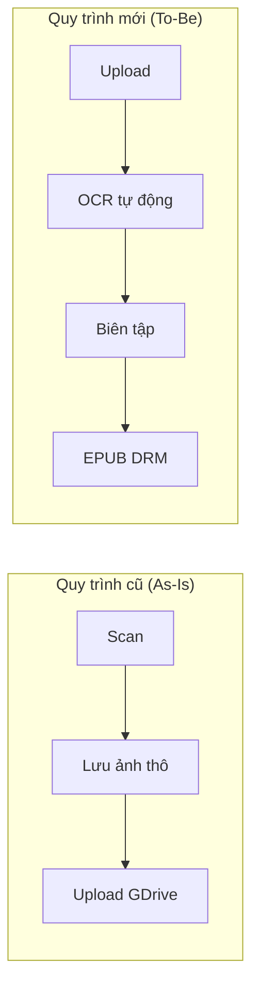
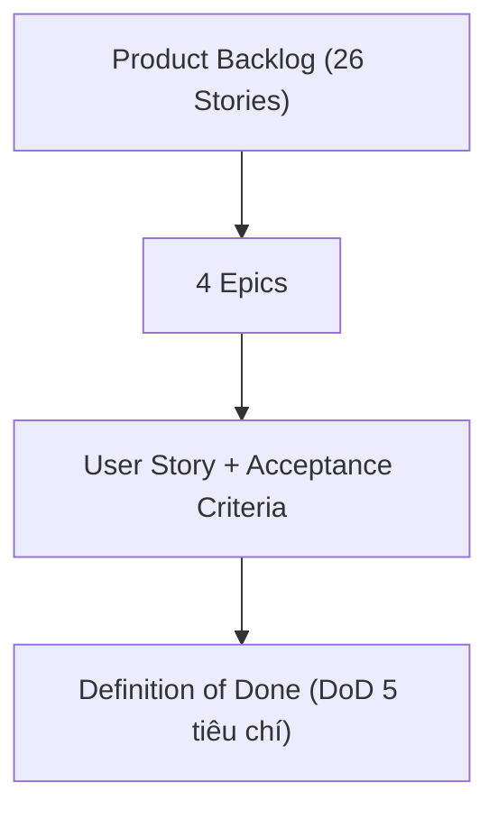
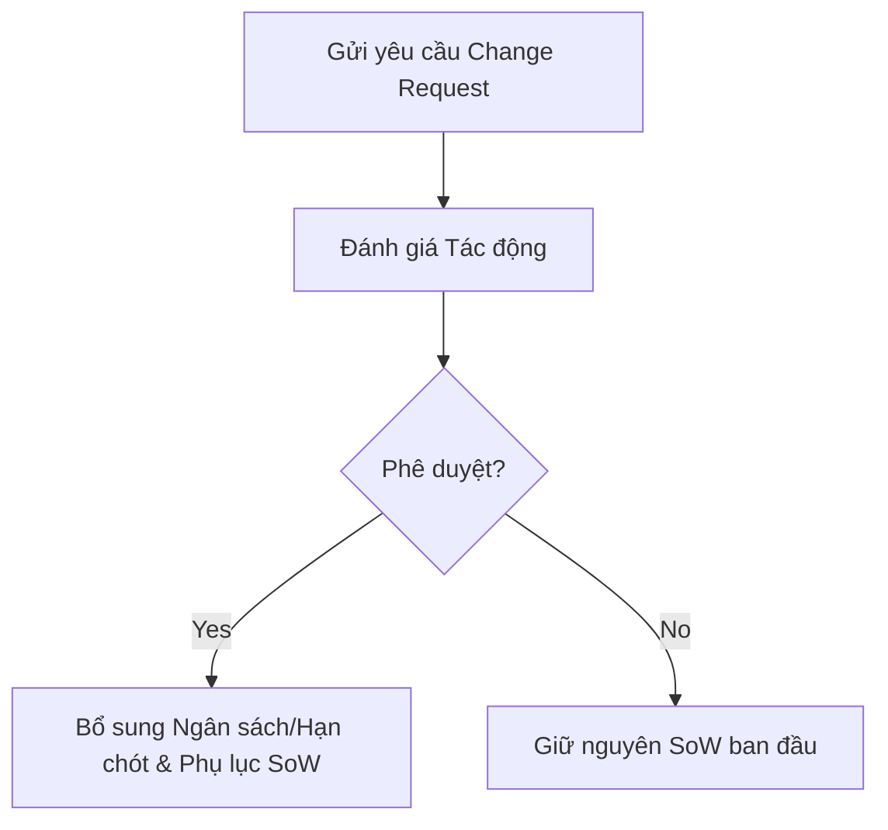

# PHIẾU BÀI LÀM ÔN TẬP — NGƯỜI 2: YÊU CẦU NGHIỆP VỤ, PHẠM VI & SOW

- **Họ và tên thành viên:** Ngô Nguyễn Thế Khoa
- **Mã số sinh viên:** 23127065
- **Phạm vi phụ trách:** **Câu 2, Câu 4, Câu 12**
- **Hạn chót hoàn thành (Bước 1):** **20:00, Thứ Năm (20/08/2026)**
- **Lưu ý quan trọng khi sửa `docs/`:** Nếu bạn chỉnh sửa hoặc tạo mới file (ví dụ soạn file `docs/03-execution-monitoring/04-user-guide.md`), **bắt buộc phải ghi lại bảng Document Revision History** ở đầu file và **ghi 1 dòng log công việc** vào file [`docs/03-execution-monitoring/02-project-log.md`](../../../docs/03-execution-monitoring/02-project-log.md).
- **Tài liệu tham chiếu trong dự án (thực hành):**
  - [`docs/02-planning/01-vision-and-scope.md`](../../../docs/02-planning/01-vision-and-scope.md) (Viễn cảnh và phạm vi dự án)
  - [`docs/02-planning/03-product-backlog.md`](../../../docs/02-planning/03-product-backlog.md) (26 User Stories, MoSCoW & DoD)
  - [`docs/02-planning/05-statement-of-work.md`](../../../docs/02-planning/05-statement-of-work.md) (Phát biểu công việc & Quản lý Thay đổi)
- **Tài liệu lý thuyết tham chiếu (từ bài giảng):**
  - [`materials/03_1_business_requirements.md`](../../../materials/03_1_business_requirements.md) (Phân tích yêu cầu nghiệp vụ, Vision & Scope Document, Use Case, BRD)
  - [`materials/03_2_user_requirements.md`](../../../materials/03_2_user_requirements.md) (Yêu cầu người dùng, User Story, Acceptance Criteria, INVEST)
- **Ghi chú bài giảng trên lớp ([`note.md`](../../../note.md)):**
  - **Buổi 04 & 05:** Vision & Scope trả lời câu hỏi WHAT (Quy trình As-Is thủ công vs To-Be số hóa khép kín); Product Backlog phân rã tính năng từ workflow người dùng thật (thủ thư chụp PDF $\rightarrow$ EPUB, sinh viên tra cứu $\rightarrow$ đọc).
  - **Buổi 05 & 07:** Tiêu chuẩn DoD (Definition of Done) phải chặt chẽ, biết điểm dừng của AI; SoW đóng dấu chốt ràng buộc Tam giác sắt (Scope-Time-Cost) và cơ chế Change Request khi thay đổi yêu cầu.
- **Đọc chéo liên kết:** Nên đọc thêm phần của **Người 1** (Câu 1: Proposal) vì Vision & Scope kế thừa trực tiếp từ Proposal, và phần của **Người 4** (Câu 10: Ước lượng) vì Product Backlog là đầu vào cho UCP.
- **Checklist bản in nộp kèm khi thi:**
  - [ ] Bản in tài liệu Viễn cảnh và phạm vi dự án (`01-vision-and-scope.md`) -- đánh dấu số câu hỏi "2" ở góc trên phải.
  - [ ] Bản in tài liệu Yêu cầu phần mềm (`03-product-backlog.md`) -- đánh dấu số câu hỏi "4" ở góc trên phải.
  - [ ] Bản in tài liệu Hướng dẫn sử dụng hệ thống (User Guide) -- **CẦN TỰ SOẠN** file `docs/03-execution-monitoring/04-user-guide.md` nếu chưa có -- đánh dấu "4" kèm theo.
  - [ ] Bản in tài liệu Phát biểu công việc (`05-statement-of-work.md`) -- đánh dấu số câu hỏi "12" ở góc trên phải.
- **Chiến lược 10 phút viết giấy A4:** Phút 1-2: Viết tiêu đề câu + dàn ý WHAT-HOW-WHY-EVIDENCE. Phút 3-7: Triển khai mỗi mục 3-4 dòng ngắn gọn, ưu tiên HOW (các bước nhóm đã làm) và EVIDENCE (số liệu cụ thể). Phút 8-9: Vẽ 1 sơ đồ nhỏ minh họa. Phút 10: Rà soát, bổ sung từ khóa quan trọng còn thiếu.

---

## CÂU 2: VIỄN CẢNH VÀ PHẠM VI DỰ ÁN (PROJECT VISION & SCOPE)

> **Đề bài:** Trình bày quá trình hình thành và phương pháp đánh giá tài liệu Viễn cảnh và phạm vi dự án (Project Vision and Scope) của nhóm. _(Sinh viên nộp kèm bản in tài liệu Viễn cảnh và phạm vi dự án của nhóm.)_

### 1. Gợi ý định hướng & Từ khóa cốt lõi:

- **Tài liệu đối chiếu:** `01-vision-and-scope.md` (Mã HCMUS-LDMS-06).
- **Từ khóa:** Quy trình As-Is (thủ công, rời rạc, không tìm kiếm) vs Quy trình To-Be (số hóa khép kín, OCR tự động, Split-screen, EPUB DRM), Ranh giới In-Scope vs Out-of-Scope (hoãn audio book, chatbot AI), Chống Scope Creep.

### 2. Không gian tự biên soạn câu trả lời:

#### A. Dàn ý trình bày trên giấy A4 (WHAT - HOW - WHY - EVIDENCE)

- **WHAT (Là gì?):**
  _Viết câu trả lời của bạn vào đây:_

- **HOW (Quá trình nhóm phân tích và thiết lập):**
  _Viết câu trả lời của bạn vào đây:_

- **WHY (Tại sao cần tài liệu Vision & Scope?):**
  _Viết câu trả lời của bạn vào đây:_

- **EVIDENCE (Minh chứng cụ thể trong dự án):**
  _Viết câu trả lời của bạn vào đây:_

#### B. Sơ đồ Quy trình nghiệp vụ As-Is (Cũ) vs To-Be (Mới)

#### C. Trả lời chi tiết 100% Bộ câu hỏi thường gặp của Giảng viên

1. **Các câu hỏi chính cần trả lời trong tài liệu Viễn cảnh và phạm vi dự án là gì?**
   - _Trả lời:_

2. **Các đầu vào cần thiết và các bước nhóm đã thực hiện để tạo tài liệu Viễn cảnh và phạm vi dự án là gì?**
   - _Trả lời:_

3. **Tài liệu Viễn cảnh và phạm vi dự án của nhóm đã được đánh giá thế nào?**
   - _Trả lời:_

4. **Tại sao cần tạo tài liệu Viễn cảnh và phạm vi dự án?**
   - _Trả lời:_

5. **Tài liệu Viễn cảnh và phạm vi dự án của nhóm đã được sử dụng và cập nhật trong quá trình thực hiện dự án như thế nào?**
   - _Trả lời:_

---

## CÂU 4: YÊU CẦU PHẦN MỀM (PRODUCT BACKLOG)

> **Đề bài:** Trình bày quá trình hình thành và phương pháp đánh giá tài liệu Yêu cầu phần mềm (Software Requirements / Product Backlog) của nhóm. _(Sinh viên nộp kèm bản in tài liệu Product Backlog và User Guide.)_

### 1. Gợi ý định hướng & Từ khóa cốt lõi:

- **Tài liệu đối chiếu:** `03-product-backlog.md` (Mã HCMUS-LDMS-08).
- **Từ khóa:** Phân rã 4 Epic $\rightarrow$ 26 User Stories (LDMS-001 đến 026), Cấu trúc User Story (`As a... I want... So that...`), Độ ưu tiên MoSCoW (16 Must, 6 Should, 4 Could), Tiêu chí nghiệm thu (Acceptance Criteria - AC), Định nghĩa hoàn thành DoD 5 tiêu chí.

### 2. Không gian tự biên soạn câu trả lời:

#### A. Dàn ý trình bày trên giấy A4 (WHAT - HOW - WHY - EVIDENCE)

- **WHAT (Là gì?):**
  _Viết câu trả lời của bạn vào đây:_

- **HOW (Cách nhóm hình thành và cấu trúc Backlog):**
  _Viết câu trả lời của bạn vào đây:_

- **WHY (Tại sao cần quản lý yêu cầu bằng Product Backlog?):**
  _Viết câu trả lời của bạn vào đây:_

- **EVIDENCE (Minh chứng trong dự án):**
  _Viết câu trả lời của bạn vào đây:_

#### B. Sơ đồ Cấu trúc phân rã Yêu cầu (Epic -> User Story -> DoD)

#### C. Trả lời chi tiết 100% Bộ câu hỏi thường gặp của Giảng viên

1. **Các câu hỏi chính cần trả lời trong tài liệu Yêu cầu phần mềm là gì?**
   - _Trả lời:_

2. **Các đầu vào cần thiết và các bước nhóm đã thực hiện để tạo tài liệu Yêu cầu phần mềm là gì?**
   - _Trả lời:_

3. **Tài liệu Yêu cầu phần mềm của nhóm đã được đánh giá thế nào?**
   - _Trả lời:_

4. **Tại sao cần tạo tài liệu Yêu cầu phần mềm?**
   - _Trả lời:_

5. **Tài liệu Yêu cầu phần mềm của nhóm đã được sử dụng và cập nhật trong quá trình thực hiện dự án như thế nào?**
   - _Trả lời:_

6. **Giải thích tiêu chuẩn INVEST cho một User Story chất lượng:**
   - _Trả lời:_

---

## CÂU 12: PHÁT BIỂU CÔNG VIỆC (STATEMENT OF WORK — SOW)

> **Đề bài:** Trình bày quá trình hình thành và phương pháp đánh giá tài liệu Phát biểu công việc (Statement of Work) của nhóm. _(Sinh viên nộp kèm bản in tài liệu Phát biểu công việc của nhóm.)_

### 1. Gợi ý định hướng & Từ khóa cốt lõi:

- **Tài liệu đối chiếu:** `05-statement-of-work.md` (Mã HCMUS-LDMS-10).
- **Từ khóa:** Hợp đồng kỹ thuật, Danh mục 6 Deliverables bàn giao, Nguyên tắc Tam giác ràng buộc (Scope-Time-Cost), Quy trình 4 bước xử lý Change Request (CR), Cam kết chữ ký đại diện Thư viện & PM.

### 2. Không gian tự biên soạn câu trả lời:

#### A. Dàn ý trình bày trên giấy A4 (WHAT - HOW - WHY - EVIDENCE)

- **WHAT (Là gì?):**
  _Viết câu trả lời của bạn vào đây:_

- **HOW (Cách nhóm xây dựng và kiểm soát thay đổi):**
  _Viết câu trả lời của bạn vào đây:_

- **WHY (Tại sao cần SoW và quy trình Change Control?):**
  _Viết câu trả lời của bạn vào đây:_

- **EVIDENCE (Minh chứng trong dự án):**
  _Viết câu trả lời của bạn vào đây:_

#### B. Sơ đồ Luồng Kiểm soát Yêu cầu Thay đổi (Change Request Control)

#### C. Trả lời chi tiết 100% Bộ câu hỏi thường gặp của Giảng viên

1. **Các câu hỏi chính cần trả lời trong tài liệu Phát biểu công việc là gì?**
   - _Trả lời:_

2. **Các đầu vào cần thiết và các bước nhóm đã thực hiện để tạo tài liệu Phát biểu công việc là gì?**
   - _Trả lời:_

3. **Tài liệu Phát biểu công việc của nhóm đã được đánh giá thế nào?**
   - _Trả lời:_

4. **Tại sao cần tạo tài liệu Phát biểu công việc?**
   - _Trả lời:_

5. **Tài liệu Phát biểu công việc của nhóm đã được sử dụng và cập nhật trong quá trình thực hiện dự án như thế nào?**
   - _Trả lời:_

6. **Giải thích sự khác nhau về thời gian và chi phí giữa các tài liệu: Đề xuất dự án (Proposal), Ước lượng dự án (Estimate), và Phát biểu công việc (SoW):**
   - _Trả lời:_

7. **Các câu hỏi chính cần trả lời trong tài liệu Hợp đồng dự án phần mềm (Software Contract) là gì?**
   - _Trả lời:_

8. **Giải thích sự khác nhau giữa Hợp đồng giá cố định (Fixed-Price Contract) và Hợp đồng theo nguyên vật liệu và thời gian (Time & Materials Contract):**
   - _Trả lời:_