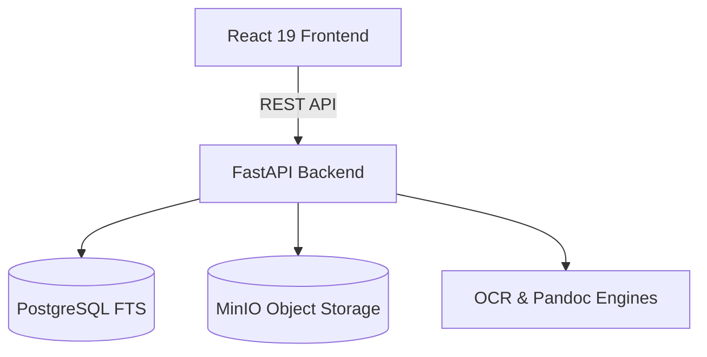
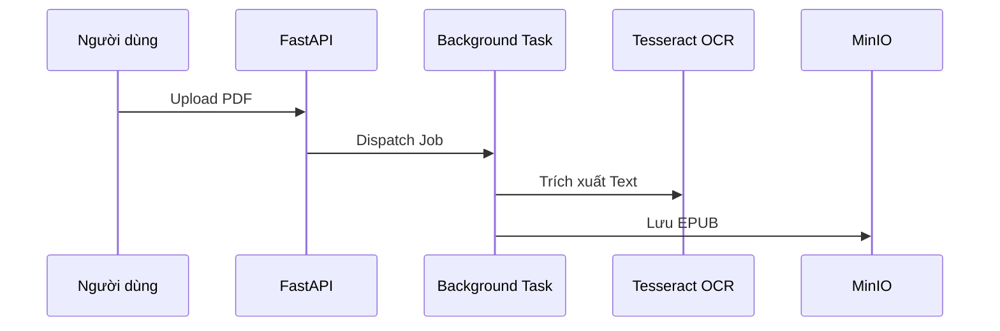
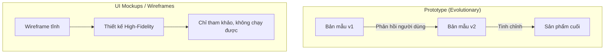

# PHIẾU BÀI LÀM ÔN TẬP — NGƯỜI 3: KIẾN TRÚC, POC & BẢN MẪU PROTOTYPE

- **Họ và tên thành viên:** Nguyễn Lê Hồ Anh Khoa
- **Mã số sinh viên:** 23127211
- **Phạm vi phụ trách:** **Câu 5, Câu 6, Câu 7**
- **Hạn chót hoàn thành (Bước 1):** **20:00, Thứ Năm (20/08/2026)**
- **Lưu ý quan trọng khi sửa `docs/`:** Nếu bạn chỉnh sửa hoặc tạo mới file trong thư mục `docs/`, **bắt buộc phải ghi lại bảng Document Revision History** ở đầu file và **ghi 1 dòng log công việc** vào file [`docs/03-execution-monitoring/02-project-log.md`](../../../docs/03-execution-monitoring/02-project-log.md).
- **Tài liệu tham chiếu trong dự án (thực hành):**
  - [`docs/02-planning/02-architecture.md`](../../../docs/02-planning/02-architecture.md) (Kiến trúc hệ thống, PoC và Pipeline)
  - Ảnh giao diện hệ thống trong [`docs/assets/images/`](../../../docs/assets/images/)
  - Mã nguồn chạy local trong [`src/`](../../../src/)
- **Tài liệu lý thuyết tham chiếu (từ bài giảng):**
  - [`materials/04_01_software_development_models.md`](../../../materials/04_01_software_development_models.md) (Các mô hình phát triển phần mềm, Prototyping, Proof of Concept)
  - [`materials/04_02_scrum_development_process.md`](../../../materials/04_02_scrum_development_process.md) (Quy trình Scrum, Sprint, Incremental Delivery)
- **Ghi chú bài giảng trên lớp ([`note.md`](../../../note.md)):**
  - **Buổi 05 & 10:** Hai loại PoC bắt buộc: (1) Tính năng **khó nhất** chưa từng làm (Pipeline OCR tiếng Việt bất đồng bộ + Pandoc EPUB); (2) Tính năng đơn giản nhất nhưng **bao quát toàn bộ tech stack chủ lực** (OAuth $\rightarrow$ DB $\rightarrow$ MinIO Signed URL $\rightarrow$ Epub.js Reader). PoC không cần UI đẹp, tốn ít token, chỉ cần chứng minh chạy được input $\rightarrow$ output.
  - **Buổi 05:** Prototype thể hiện 1 workflow từ text $\rightarrow$ diagram $\rightarrow$ giao diện tương tác; Modular Monolith sạch ưu tiên tech stack quen thuộc.
- **Đọc chéo liên kết:** Nên đọc thêm phần của **Người 2** (Câu 4: Product Backlog) vì Kiến trúc được thiết kế dựa trên Backlog, và phần của **Người 5** (Câu 13-15: CI/CD) vì Architecture quyết định cách build/deploy.
- **Checklist bản in nộp kèm khi thi:**
  - [ ] Bản in tài liệu Kiến trúc phần mềm (`02-architecture.md`) -- đánh dấu số câu hỏi "5" ở góc trên phải.
  - [ ] Bản in giao diện thể hiện đầu vào và đầu ra khi chạy mã nguồn PoC (log OCR + EPUB) -- **CẦN CHUẨN BỊ**: chạy PoC, screenshot terminal output -- đánh dấu "6".
  - [ ] Bản in phác thảo giao diện ban đầu (Prototype UI: Màn hình Split-screen Editor và Web Reader) -- **CẦN CHUẨN BỊ**: screenshot giao diện thực tế hoặc wireframe ban đầu -- đánh dấu "7".
- **Chiến lược 10 phút viết giấy A4:** Phút 1-2: Viết tiêu đề câu + dàn ý WHAT-HOW-WHY-EVIDENCE. Phút 3-7: Triển khai mỗi mục 3-4 dòng ngắn gọn, ưu tiên HOW (các bước nhóm đã làm) và EVIDENCE (số liệu cụ thể). Phút 8-9: Vẽ 1 sơ đồ nhỏ minh họa. Phút 10: Rà soát, bổ sung từ khóa quan trọng còn thiếu.

---

## CÂU 5: KIẾN TRÚC PHẦN MỀM (SOFTWARE ARCHITECTURE)

> **Đề bài:** Trình bày quá trình hình thành và phương pháp đánh giá tài liệu Kiến trúc phần mềm (Software Architecture) của nhóm. _(Sinh viên nộp kèm bản in tài liệu Kiến trúc phần mềm của nhóm.)_

### 1. Gợi ý định hướng & Từ khóa cốt lõi:

- **Tài liệu đối chiếu:** `02-architecture.md` (Mã HCMUS-LDMS-07).
- **Từ khóa:** Tech Stack (FastAPI, React 19, MinIO, PostgreSQL FTS, Tesseract, Pandoc), Mô hình 4+1 Architectural Views (Logical, Process, Development, Physical + Use Cases), Cơ chế bảo mật DRM (Signed URL 15 phút, RBAC).

### 2. Không gian tự biên soạn câu trả lời:

#### A. Dàn ý trình bày trên giấy A4 (WHAT - HOW - WHY - EVIDENCE)

- **WHAT (Là gì?):**
  _Viết câu trả lời của bạn vào đây:_

- **HOW (Cách nhóm lựa chọn công nghệ và thiết kế tầng):**
  _Viết câu trả lời của bạn vào đây:_

- **WHY (Tại sao cần tài liệu Kiến trúc phần mềm?):**
  _Viết câu trả lời của bạn vào đây:_

- **EVIDENCE (Minh chứng trong dự án):**
  _Viết câu trả lời của bạn vào đây:_

#### B. Sơ đồ Kiến trúc Tổng thể Hệ thống HCMUS-LDMS

#### C. Trả lời chi tiết 100% Bộ câu hỏi thường gặp của Giảng viên

1. **Các câu hỏi chính cần trả lời trong tài liệu Kiến trúc phần mềm là gì?**
   - _Trả lời:_

2. **Các đầu vào cần thiết và các bước nhóm đã thực hiện để tạo tài liệu Kiến trúc phần mềm là gì?**
   - _Trả lời:_

3. **Tài liệu Kiến trúc phần mềm của nhóm đã được đánh giá thế nào?**
   - _Trả lời:_

4. **Tại sao cần tạo tài liệu Kiến trúc phần mềm?**
   - _Trả lời:_

5. **Tài liệu Kiến trúc phần mềm của nhóm đã được sử dụng và cập nhật trong quá trình thực hiện dự án như thế nào?**
   - _Trả lời:_

6. **Giải thích chi tiết 5 góc nhìn trong Mô hình 4+1 Views của Philippe Kruchten:**
   - _Trả lời:_

---

## CÂU 6: CHỨNG MINH Ý TƯỞNG (PROOF OF CONCEPT — POC)

> **Đề bài:** Trình bày quá trình hình thành và phương pháp đánh giá sản phẩm Chứng minh ý tưởng (Proof of Concept) của nhóm. _(Sinh viên nộp kèm bản in giao diện thể hiện đầu vào và đầu ra khi chạy mã nguồn PoC của nhóm.)_

### 1. Gợi ý định hướng & Từ khóa cốt lõi:

- **Tài liệu đối chiếu:** Mục 5 & 6 trong `02-architecture.md`.
- **Từ khóa:** Bài toán khó nhất (Xử lý OCR tiếng Việt và đóng gói EPUB không nghẽn Web API), PoC 1 (Pipeline OCR Async BackgroundTasks), PoC 2 (DRM Reader với Signed URL 15m), Thử nghiệm file mẫu [`samples/two-page.pdf`](../../../samples/two-page.pdf), "Fail fast, learn fast".

### 2. Không gian tự biên soạn câu trả lời:

#### A. Dàn ý trình bày trên giấy A4 (WHAT - HOW - WHY - EVIDENCE)

- **WHAT (Là gì?):**
  _Viết câu trả lời của bạn vào đây:_

- **HOW (Cách nhóm cài đặt và đo đạc PoC):**
  _Viết câu trả lời của bạn vào đây:_

- **WHY (Tại sao cần tạo sản phẩm PoC?):**
  _Viết câu trả lời của bạn vào đây:_

- **EVIDENCE (Minh chứng trong dự án):**
  _Viết câu trả lời của bạn vào đây:_

#### B. Sơ đồ Luồng Kỹ thuật PoC Pipeline OCR

#### C. Trả lời chi tiết 100% Bộ câu hỏi thường gặp của Giảng viên

1. **Sản phẩm Chứng minh ý tưởng (Proof of Concept) là gì?**
   - _Trả lời:_

2. **Giải thích các phương pháp có thể dùng để chứng minh khả năng hoàn thành dự án về mặt kỹ thuật (Spike solution, Tracer bullet, Benchmark...):**
   - _Trả lời:_

3. **Nhóm chọn sản phẩm gì để Chứng minh ý tưởng? Tại sao lại chọn sản phẩm đó?**
   - _Trả lời:_

4. **Các đầu vào cần thiết và các bước nhóm đã thực hiện để tạo sản phẩm Chứng minh ý tưởng là gì?**
   - _Trả lời:_

5. **Tại sao cần tạo sản phẩm Chứng minh ý tưởng?**
   - _Trả lời:_

6. **Sản phẩm Chứng minh ý tưởng của nhóm đã được sử dụng trong quá trình thực hiện dự án như thế nào?**
   - _Trả lời:_

---

## CÂU 7: BẢN MẪU (PROTOTYPE)

> **Đề bài:** Trình bày quá trình hình thành và phương pháp đánh giá sản phẩm Bản mẫu (Prototype) của nhóm. _(Sinh viên nộp kèm bản in phác thảo giao diện ban đầu cho hệ thống của nhóm.)_

### 1. Gợi ý định hướng & Từ khóa cốt lõi:

- **Tài liệu đối chiếu:** Các màn hình React trong `src/frontend/` và tài liệu User Guide.
- **Từ khóa:** Evolutionary Prototype (Bản mẫu tiến hóa trên React + Tailwind), Màn hình Split-screen Editor (ảnh scan song song text OCR), Màn hình Reader với Epub.js, Phản hồi của Thủ thư thực tế.

### 2. Không gian tự biên soạn câu trả lời:

#### A. Dàn ý trình bày trên giấy A4 (WHAT - HOW - WHY - EVIDENCE)

- **WHAT (Là gì?):**
  _Viết câu trả lời của bạn vào đây:_

- **HOW (Cách nhóm xây dựng và đánh giá Prototype):**
  _Viết câu trả lời của bạn vào đây:_

- **WHY (Tại sao cần tạo bản mẫu Prototype?):**
  _Viết câu trả lời của bạn vào đây:_

- **EVIDENCE (Minh chứng trong dự án):**
  _Viết câu trả lời của bạn vào đây:_

#### B. Sơ đồ So sánh Prototype (tiến hóa) vs UI Mockups (tĩnh)

#### C. Trả lời chi tiết 100% Bộ câu hỏi thường gặp của Giảng viên

1. **Sản phẩm Bản mẫu là gì?**
   - _Trả lời:_

2. **Giải thích sự khác nhau giữa Bản mẫu hệ thống (Prototype) và Tập hợp các màn hình giao diện (UI Mockups / Wireframes):**
   - _Trả lời:_

3. **Các đầu vào cần thiết và các bước nhóm đã thực hiện để tạo sản phẩm Bản mẫu là gì?**
   - _Trả lời:_

4. **Sản phẩm Bản mẫu của nhóm đã được đánh giá thế nào?**
   - _Trả lời:_

5. **Tại sao cần tạo sản phẩm Bản mẫu?**
   - _Trả lời:_

6. **Sản phẩm Bản mẫu của nhóm đã được sử dụng trong quá trình thực hiện dự án như thế nào?**
   - _Trả lời:_
