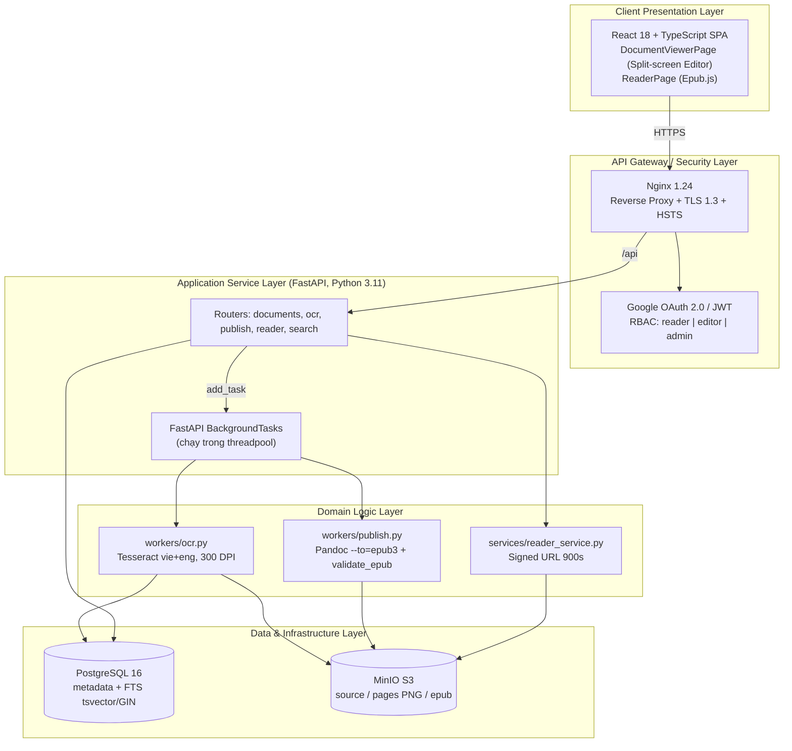
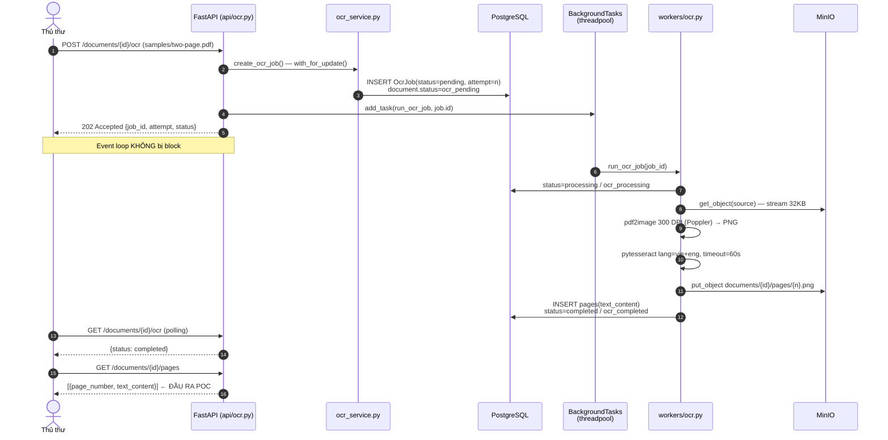
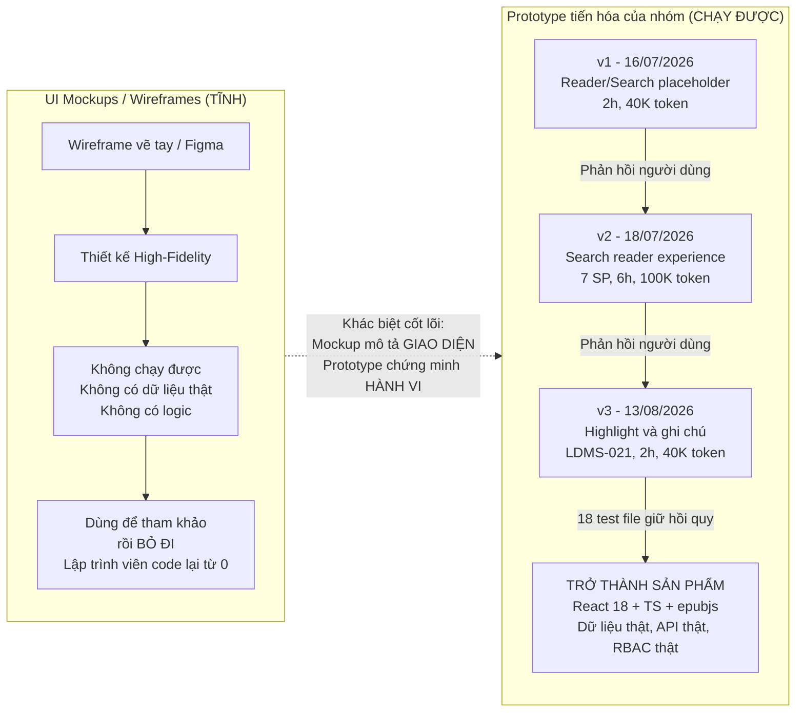

# PHIẾU BÀI LÀM ÔN TẬP — NGƯỜI 3: KIẾN TRÚC, POC & BẢN MẪU PROTOTYPE

- **Họ và tên thành viên:** Nguyễn Lê Hồ Anh Khoa
- **Mã số sinh viên:** 23127211
- **Phạm vi phụ trách:** **Câu 5, Câu 6, Câu 7**
- **Hạn chót hoàn thành (Bước 1):** **20:00, Thứ Năm (20/08/2026)**
- **Lưu ý quan trọng khi sửa `docs/`:** Nếu bạn chỉnh sửa hoặc tạo mới file trong thư mục `docs/`, **bắt buộc phải ghi lại bảng Document Revision History** ở đầu file và **ghi 1 dòng log công việc** vào file [`docs/03-execution-monitoring/02-project-log.md`](../../../docs/03-execution-monitoring/02-project-log.md).
- **Tài liệu tham chiếu trong dự án (thực hành):**
  - [`docs/02-planning/02-architecture.md`](../../../docs/02-planning/02-architecture.md) (Kiến trúc hệ thống, PoC và Pipeline)
  - Ảnh giao diện hệ thống trong [`docs/assets/images/`](../../../docs/assets/images/)
  - Mã nguồn chạy local trong [`src/`](../../../src/)
- **Tài liệu lý thuyết tham chiếu (từ bài giảng):**
  - [`materials/04_01_software_development_models.md`](../../../materials/04_01_software_development_models.md) (Các mô hình phát triển phần mềm, Prototyping, Proof of Concept)
  - [`materials/04_02_scrum_development_process.md`](../../../materials/04_02_scrum_development_process.md) (Quy trình Scrum, Sprint, Incremental Delivery)
- **Ghi chú bài giảng trên lớp ([`note.md`](../../../note.md)):**
  - **Buổi 05 & 10:** Hai loại PoC bắt buộc: (1) Tính năng **khó nhất** chưa từng làm (Pipeline OCR tiếng Việt bất đồng bộ + Pandoc EPUB); (2) Tính năng đơn giản nhất nhưng **bao quát toàn bộ tech stack chủ lực** (OAuth $\rightarrow$ DB $\rightarrow$ MinIO Signed URL $\rightarrow$ Epub.js Reader). PoC không cần UI đẹp, tốn ít token, chỉ cần chứng minh chạy được input $\rightarrow$ output.
  - **Buổi 05:** Prototype thể hiện 1 workflow từ text $\rightarrow$ diagram $\rightarrow$ giao diện tương tác; Modular Monolith sạch ưu tiên tech stack quen thuộc.
- **Đọc chéo liên kết:** Nên đọc thêm phần của **Người 2** (Câu 4: Product Backlog) vì Kiến trúc được thiết kế dựa trên Backlog, và phần của **Người 5** (Câu 13-15: CI/CD) vì Architecture quyết định cách build/deploy.
- **Checklist bản in nộp kèm khi thi:** Xem chi tiết cách thu thập trong [`EVIDENCE_CHECKLIST.md`](./EVIDENCE_CHECKLIST.md).
  - [ ] Bản in tài liệu Kiến trúc phần mềm (`02-architecture.md`) -- đánh dấu số câu hỏi "5" ở góc trên phải.
  - [ ] Bản in giao diện thể hiện đầu vào và đầu ra khi chạy mã nguồn PoC (log OCR + EPUB) -- **CẦN CHUẨN BỊ**: chạy PoC, screenshot terminal output -- đánh dấu "6".
  - [ ] Bản in phác thảo giao diện ban đầu (Prototype UI: Màn hình Split-screen Editor và Web Reader) -- **CẦN CHUẨN BỊ**: screenshot giao diện thực tế hoặc wireframe ban đầu -- đánh dấu "7".
- **Chiến lược 10 phút viết giấy A4:** Phút 1-2: Viết tiêu đề câu + dàn ý WHAT-HOW-WHY-EVIDENCE. Phút 3-7: Triển khai mỗi mục 3-4 dòng ngắn gọn, ưu tiên HOW (các bước nhóm đã làm) và EVIDENCE (số liệu cụ thể). Phút 8-9: Vẽ 1 sơ đồ nhỏ minh họa. Phút 10: Rà soát, bổ sung từ khóa quan trọng còn thiếu.

---

## ⭐ BA ĐIỂM LỆCH ĐÃ PHÁT HIỆN VÀ XỬ LÝ NGÀY 19/08/2026 — KỂ CÂU NÀY KHI VẤN ĐÁP

Khi rà soát chéo tài liệu với mã nguồn để chuẩn bị thi, nhóm phát hiện 3 chỗ tài liệu/mã nguồn không khớp và **đã sửa xong**. Đây không phải điểm yếu mà là **bằng chứng mạnh nhất** cho câu hỏi _"tài liệu đã được đánh giá và cập nhật thế nào?"_ (câu hỏi phụ số 3 và số 5 của Câu 5) — vì nó chứng minh tài liệu là vật sống, được đối chiếu với code thật, chứ không phải viết một lần rồi bỏ.

|  #  | Vấn đề phát hiện                                                                                                                                                                                                                                                              | Đã xử lý thế nào                                                                                                                                                                                                                                                                   | Dùng để trả lời câu nào                                                           |
| :-: | :---------------------------------------------------------------------------------------------------------------------------------------------------------------------------------------------------------------------------------------------------------------------------- | :--------------------------------------------------------------------------------------------------------------------------------------------------------------------------------------------------------------------------------------------------------------------------------- | :-------------------------------------------------------------------------------- |
|  1  | Mục 9.2 ghi cơ chế `loop.run_in_executor` + `ThreadPoolExecutor`, nhưng mã nguồn `app/api/ocr.py:72` dùng `background_tasks.add_task(run_ocr_job, job.id)`                                                                                                                    | Sửa mục 9.2 theo cơ chế thật: `run_ocr_job` là hàm **`def` đồng bộ** nên Starlette tự thực thi tác vụ nền trong **threadpool** (`run_in_threadpool`) — đạt đúng mục tiêu không block Event Loop mà **không cần tự quản executor**. Bổ sung thêm bước 6 về kiểm soát lỗi/chạy trùng | Câu 5 (tài liệu được cập nhật) và Câu 6 (giải thích đúng cơ chế PoC)              |
|  2  | Mục 4.7.1 bị **lặp 2 lần**; bản đầu là tồn dư của v2.0, còn ghi Keycloak SSO, hàng đợi Celery, index Elasticsearch — ba công nghệ đã bị loại từ v3.0                                                                                                                          | Xóa đoạn tồn dư, giữ bản đúng (Google OAuth, BackgroundTasks, PostgreSQL FTS)                                                                                                                                                                                                      | Câu 5 — ví dụ điển hình về **rủi ro tài liệu lệch phiên bản** khi cập nhật cục bộ |
|  3  | `pages/ReaderPage.tsx` có đủ code + test và dùng thật `epubjs`, **nhưng `App.tsx` chưa khai báo route** `/reader/:documentId`; trong khi `DocumentsPage.tsx:164` lại link tới `/reader/{id}` → rơi vào `<Route path="*">` và bị chuyển hướng về trang Tải lên (liên kết hỏng) | Nối route `<Route path="/reader/:documentId" element={<ReaderPage />} />` vào `App.tsx`. Nhờ đó mới chụp được ảnh màn hình Reader để nộp kèm Câu 7                                                                                                                                 | Câu 7 (Prototype), và Câu 19/21 nếu bị hỏi chéo — xem bài học ngay dưới           |

**Cả 3 sửa đổi đều tuân thủ quy chế của nhóm:** tài liệu kiến trúc được nâng lên **v3.1** với dòng mới trong bảng Revision History, và **1 dòng log** đã ghi vào `docs/03-execution-monitoring/02-project-log.md` (2026-08-19, 45 phút, 35K token).

> **Bài học kinh nghiệm rút ra — nói câu này sẽ rất ăn điểm (dùng được cho cả Câu 19 và Câu 21):**
>
> _"Điểm số 3 cho nhóm một bài học về **Definition of Done**: DoD của nhóm coi story xong khi component đã viết và test đã xanh — nhưng thiếu tiêu chí **'người dùng truy cập được tính năng đó từ điều hướng thật'**. Kết quả là màn hình Reader hoàn chỉnh, có kiểm thử tự động đầy đủ, mà thực tế không ai mở được vì thiếu một dòng khai báo route. Đây đúng là loại lỗi mà unit test không bắt được và chỉ kiểm thử end-to-end hoặc UAT mới phát hiện — nên nhóm bổ sung tiêu chí này vào DoD."_
>
> Đây cũng là lý do `SearchPage.tsx` và `DocumentListPage.tsx` vẫn đang trong tình trạng tương tự (chưa nối route) — nếu Thầy hỏi, thừa nhận thẳng và nói đó là hạng mục còn lại đã được ghi nhận.

---

## CÂU 5: KIẾN TRÚC PHẦN MỀM (SOFTWARE ARCHITECTURE)

> **Đề bài:** Trình bày quá trình hình thành và phương pháp đánh giá tài liệu Kiến trúc phần mềm (Software Architecture) của nhóm. _(Sinh viên nộp kèm bản in tài liệu Kiến trúc phần mềm của nhóm.)_

### 1. Gợi ý định hướng & Từ khóa cốt lõi:

- **Tài liệu đối chiếu:** `02-architecture.md` (Mã HCMUS-LDMS-SAD, mã cấu hình `LDMS_SDD_R3.0.md`).
- **Từ khóa:** Tech Stack (FastAPI, React 18, MinIO, PostgreSQL FTS, Tesseract, Pandoc), Mô hình C4 (Context/Container/Deployment) ánh xạ sang 4+1 Architectural Views, Modular Monolith, Cơ chế bảo mật DRM (Signed URL 900 giây, RBAC).

### 2. Không gian tự biên soạn câu trả lời:

#### A. Dàn ý trình bày trên giấy A4 (WHAT - HOW - WHY - EVIDENCE)

- **WHAT (Là gì?):**

  Tài liệu Kiến trúc phần mềm (SAD) trả lời câu hỏi **HOW** của dự án: sau khi Proposal trả lời WHY, Vision & Scope trả lời WHAT, thì SAD mô tả hệ thống **được xây bằng gì và ghép lại thế nào**. Nội dung gồm 4 khối:
  1. **Mục tiêu & ràng buộc kiến trúc** — các yêu cầu phi chức năng (tìm kiếm < 3 giây, xử lý OCR không nghẽn API) và giới hạn cứng (on-premise VMware, ngân sách < 100 triệu VNĐ).
  2. **Các góc nhìn kiến trúc** — nhóm dùng **mô hình C4** (Context → Container → Deployment) cộng Sequence Diagram và Implementation View. Bộ này **ánh xạ đủ 5 góc nhìn của 4+1 Views (Kruchten)**.
  3. **Quyết định kiến trúc và phản biện** — chọn Modular Monolith, 3-tier, technical layering, kèm mục 7.3 tự phản biện từng lựa chọn.
  4. **Minh chứng công nghệ (PoC)** và cấu trúc mã nguồn khung — mục 9.

  Tài liệu này là **CI (Configuration Item)** có mã định danh `LDMS_SDD_R3.0.md` theo quy chuẩn `LDMS_[LOAI_CI]_[TRANG_THAI]X.Y` ở mục 8.1.

- **HOW (Cách nhóm lựa chọn công nghệ và thiết kế tầng):**

  Kể theo đúng trình tự 5 bước đã thực sự xảy ra:
  1. **Đầu vào:** lấy 26 User Stories từ Product Backlog (`03-product-backlog.md`), sơ đồ quy trình To-Be từ `01-vision-and-scope.md`, và 2 ràng buộc cứng từ Charter (ngân sách 100 triệu, hạ tầng VMware có sẵn).
  2. **Chọn phong cách kiến trúc:** loại DSpace (kho lưu trữ tĩnh, không chạy được OCR + biên tập split-screen + biên dịch EPUB), loại Microservices (đội chỉ 4 kỹ sư kiêm nhiệm ≈ 2 full-time), chốt **Modular Monolith**.
  3. **Vẽ các góc nhìn bằng PlantUML** (diagram-as-code, versionable trong Git): Use Case → C4 Context → C4 Container → Sequence → C4 Deployment → cây thư mục.
  4. **Hiệu chỉnh tech stack 2 lần theo phản hồi:** v1.0 (07/07) khởi tạo → v2.0 (14/07) bổ sung toàn bộ sơ đồ C4 và phân tích phản biện → **v3.0 (15/07) hạ quy mô công nghệ cho vừa sức đồ án sinh viên**: Keycloak → Google OAuth 2.0, Elasticsearch → PostgreSQL FTS, Celery + Redis → FastAPI BackgroundTasks. Ba thứ bị loại đều được ghi lại làm **roadmap** chứ không xóa (Elasticsearch nằm ở LDMS-025 trong backlog).
  5. **Chốt quy tắc cấu hình:** mã CI + chiến lược GitFlow (`main` / `develop` / `feature/*` / `release/*` / `hotfix/*`) ở mục 8.

- **WHY (Tại sao cần tài liệu Kiến trúc phần mềm?):**
  - **Đồng bộ 4 người không cần họp liên tục:** cây thư mục và ranh giới tầng ở mục 7 là "hợp đồng kỹ thuật" — mỗi người biết code của mình đặt ở đâu, không đụng nhau.
  - **Là đầu vào bắt buộc của Ước lượng:** không có kiến trúc thì không biết có bao nhiêu module để đếm UCP/KLOC (126 UCP, 10.4 PM COCOMO II của Người 4 dựa trên chính tài liệu này).
  - **Chốt quyết định kèm lý do để không tranh luận lại:** mục 7.3 ghi sẵn phản biện, nên khi có ý kiến "sao không dùng Clean Architecture" thì mở tài liệu ra đọc, không họp lại từ đầu.
  - **Quản trị rủi ro kỹ thuật:** mục 9 (PoC) buộc phải kiểm chứng chỗ khó nhất **trước** khi code toàn hệ thống.

- **EVIDENCE (Minh chứng trong dự án):**
  - Tài liệu `docs/02-planning/02-architecture.md`, mã `HCMUS-LDMS-SAD`, **4 phiên bản** trong Revision History (v1.0 07/07 → v2.0 14/07 → v3.0 15/07 → **v3.1 19/08/2026** đồng bộ tài liệu với mã nguồn).
  - Sơ đồ đã render: `docs/assets/images/system_architecture.svg`, `context_diagram.svg`.
  - Số đo bảo mật/vận hành: Signed URL **900 giây**, TLS 1.3 + HSTS, **RPO 24 giờ / RTO 4 giờ**, retention 30 ngày / 12 tuần / 12 tháng.
  - Kiến trúc đã được hiện thực đúng: `src/backend/app/` có đủ `api/` `services/` `models/` `schemas/` `workers/` như mục 7.2 mô tả; `src/frontend/src/` có `pages/` `components/` `services/` như mục 7.1.
  - Quy mô kiểm thử chứng minh tầng Service tách được ra để test: **19 file test backend, 18 file test frontend**.

#### B. Sơ đồ Kiến trúc Tổng thể Hệ thống HCMUS-LDMS

#### C. Trả lời chi tiết 100% Bộ câu hỏi thường gặp của Giảng viên

1. **Các câu hỏi chính cần trả lời trong tài liệu Kiến trúc phần mềm là gì?**
   - _Trả lời:_ Sáu câu hỏi:
     1. **Ràng buộc nào chi phối kiến trúc?** (ngân sách < 100 triệu, on-premise VMware, đội 4 người kiêm nhiệm, tìm kiếm < 3 giây).
     2. **Chọn phong cách kiến trúc nào và loại phương án nào?** (Modular Monolith; loại DSpace và Microservices).
     3. **Mỗi thành phần dùng công nghệ gì, vì sao?** (bảng Tech Stack 12 dòng ở mục 4.2 — mỗi dòng có cột "Lý do kỹ thuật").
     4. **Các thành phần giao tiếp với nhau thế nào?** (C4 Container + Sequence Diagram luồng đọc sách).
     5. **Triển khai vật lý ở đâu?** (VM-Production + VM-Staging trên VMware vSphere, Docker Compose).
     6. **Dữ liệu được bảo mật, sao lưu, khôi phục thế nào?** (Signed URL, RBAC, PgBackRest + Restic, RPO 24h / RTO 4h).

2. **Các đầu vào cần thiết và các bước nhóm đã thực hiện để tạo tài liệu Kiến trúc phần mềm là gì?**
   - _Trả lời:_
     - **Đầu vào (4 thứ):** (1) 26 User Stories trong `03-product-backlog.md` — quyết định hệ thống cần module gì; (2) sơ đồ quy trình To-Be trong `01-vision-and-scope.md` — quyết định luồng nghiệp vụ; (3) ràng buộc ngân sách và hạ tầng từ `04-project-charter.md`; (4) năng lực thực tế của nhóm (thầy dặn ở Buổi 05: _"ưu tiên các công nghệ quen thuộc"_).
     - **Các bước:** trình tự 5 bước đã ghi ở phần HOW phía trên. Điểm cần nhấn: sơ đồ được viết bằng **PlantUML dạng text ngay trong file Markdown**, nên mọi thay đổi kiến trúc đều nằm trong Git diff và review được qua Pull Request — không dùng ảnh vẽ tay không truy vết được.

3. **Tài liệu Kiến trúc phần mềm của nhóm đã được đánh giá thế nào?**
   - _Trả lời:_ Ba lớp đánh giá:
     - **Lớp 1 — Rà soát nội bộ theo vai trò:** bảng Document Control định rõ Reviewer là Trưởng phòng CNTT & Giám đốc Thư viện, Approver là Ban Giám hiệu; trạng thái tài liệu hiện là **Approved**.
     - **Lớp 2 — Tự phản biện có cấu trúc (mục 7.3):** với mỗi quyết định, tài liệu ghi đủ 3 phần _Lựa chọn thiết kế → Phản biện (Counter-argument) → Giải trình biện hộ (Refutation)_. Ví dụ: có ý kiến nên dùng Hexagonal Architecture, nhóm bác bỏ vì sinh ra 2-3 lần code boilerplate (DTO, Mapper, Interface) trong khi PostgreSQL cố định suốt vòng đời dự án.
     - **Lớp 3 — Đánh giá bằng thực nghiệm (quan trọng nhất):** kiến trúc không chỉ được review trên giấy mà bị **kiểm chứng bằng PoC ở mục 9**. Đây là lý do câu 5 và câu 6 gắn chặt với nhau: PoC chính là **phương pháp đánh giá kiến trúc**. Nếu PoC OCR async thất bại thì mục 4.1 phải viết lại.

4. **Tại sao cần tạo tài liệu Kiến trúc phần mềm?**
   - _Trả lời:_ Xem phần WHY ở trên. Nếu chỉ được nói **một câu**: _"Vì kiến trúc là quyết định đắt nhất và khó đảo ngược nhất của dự án — sai backlog thì sửa 1 story, sai kiến trúc thì viết lại cả hệ thống; nên nó phải được viết ra, phản biện và kiểm chứng bằng PoC trước khi ai đó viết dòng code đầu tiên."_

5. **Tài liệu Kiến trúc phần mềm của nhóm đã được sử dụng và cập nhật trong quá trình thực hiện dự án như thế nào?**
   - _Trả lời:_
     - **Được dùng để sinh mã nguồn:** nhóm làm Spec-Driven Development — cây thư mục ở mục 7.2 được đưa trực tiếp vào prompt cho AI Coding Assistant, nên `src/backend/app/` sinh ra khớp đúng thiết kế.
     - **Được dùng làm đầu vào ước lượng:** Người 4 đếm UCP và KLOC dựa trên số module trong tài liệu này.
     - **Được cập nhật 3 lần thật:** v2.0 thêm sơ đồ C4 và phản biện; **v3.0 hạ 3 công nghệ** (Keycloak, Elasticsearch, Celery) xuống mức khả thi — đây là ví dụ kiến trúc phải thích ứng với nguồn lực thật, đúng tinh thần thầy dặn; **v3.1 (19/08/2026) đồng bộ tài liệu với mã nguồn** sau khi rà soát chéo.
     - **Điểm chưa tốt và cách nhóm xử lý (nên chủ động kể):** khi lên v3.0, nhóm chỉ sửa những chỗ được nhắc tới nên **sót đoạn 4.7.1 cũ** (vẫn còn Keycloak/Celery/Elasticsearch) và **mô tả sai cơ chế bất đồng bộ** ở mục 9.2. Cả hai đã được phát hiện khi rà soát chuẩn bị thi và sửa ở v3.1. **Bài học:** cập nhật tài liệu phải rà **toàn bộ** file và **đối chiếu ngược với mã nguồn**, không chỉ sửa cục bộ chỗ được nhắc tới — xem bảng chi tiết ở đầu phiếu này.

6. **Giải thích chi tiết 5 góc nhìn trong Mô hình 4+1 Views của Philippe Kruchten:**
   - _Trả lời:_ Trả lời song song lý thuyết và ánh xạ vào tài liệu của nhóm — đây là cách ghi điểm cao nhất vì tài liệu nhóm dùng C4 chứ không đặt tên đúng "4+1":

     | Góc nhìn                       | Trả lời cho ai / câu hỏi gì                                                                               | Trong tài liệu nhóm                                                              |
     | :----------------------------- | :-------------------------------------------------------------------------------------------------------- | :------------------------------------------------------------------------------- |
     | **Logical View**               | Người phân tích — hệ thống có những khối chức năng nào                                                    | Mục 4: C4 Context + C4 Container + phân rã Frontend/Backend (mục 4.4)            |
     | **Process View**               | Người vận hành/tích hợp — các tiến trình chạy và tương tác theo thời gian thế nào, xử lý đồng thời ra sao | Mục 4.6 Sequence Diagram luồng đọc sách + luồng bất đồng bộ BackgroundTasks      |
     | **Development View**           | Lập trình viên — mã nguồn tổ chức thành module/thư mục thế nào                                            | Mục 7: cây thư mục Frontend/Backend + mục 8 GitFlow                              |
     | **Physical View** (Deployment) | Kỹ sư hệ thống — chạy trên máy nào, mạng nào                                                              | Mục 6: C4 Deployment, VM-Production + VM-Staging trên VMware vSphere             |
     | **+1 Scenarios** (Use Cases)   | Tất cả — chất keo ràng 4 góc nhìn kia, dùng để kiểm chứng                                                 | Mục 3: Use Case Diagram 3 tác nhân (Độc giả / Thủ thư / Admin) với 10 ca sử dụng |

     **Ý nghĩa của "+1":** Scenarios không phải góc nhìn thứ 5 độc lập mà là **tập ca sử dụng chủ chốt dùng để xác thực 4 góc nhìn còn lại** — mỗi kịch bản phải chạy được xuyên qua cả 4 view. Ví dụ kịch bản "Độc giả đọc sách" đi từ Use Case (mục 3) → Container React/FastAPI/MinIO (mục 4.5) → trình tự gọi Signed URL (mục 4.6) → chạy trên VM-Production (mục 6) → code ở `pages/ReaderPage.tsx` và `services/reader_service.py` (mục 7). Nếu một góc nhìn không đỡ được kịch bản này thì kiến trúc có lỗ.

---

## CÂU 6: CHỨNG MINH Ý TƯỞNG (PROOF OF CONCEPT — POC)

> **Đề bài:** Trình bày quá trình hình thành và phương pháp đánh giá sản phẩm Chứng minh ý tưởng (Proof of Concept) của nhóm. _(Sinh viên nộp kèm bản in giao diện thể hiện đầu vào và đầu ra khi chạy mã nguồn PoC của nhóm.)_

### 1. Gợi ý định hướng & Từ khóa cốt lõi:

- **Tài liệu đối chiếu:** Mục 9 trong `02-architecture.md`. Mã nguồn: `app/workers/ocr.py`, `app/workers/publish.py`, `app/services/reader_service.py`.
- **Từ khóa:** Bài toán khó nhất (OCR tiếng Việt + đóng gói EPUB không nghẽn Web API), PoC 1 (Pipeline OCR async, HTTP 202), PoC 2 (E2E: Auth → DB → MinIO Signed URL 900s → Epub.js), file mẫu [`samples/two-page.pdf`](../../../samples/two-page.pdf), "Fail fast, learn fast".

### 2. Không gian tự biên soạn câu trả lời:

#### A. Dàn ý trình bày trên giấy A4 (WHAT - HOW - WHY - EVIDENCE)

- **WHAT (Là gì?):**

  PoC là **thí nghiệm kỹ thuật thu hẹp** nhằm trả lời một câu hỏi rủi ro dạng có/không: _"công nghệ này có làm được việc này không?"_. Ba đặc điểm phân biệt PoC:
  1. **Phạm vi hẹp tối đa** — chỉ chạm vào đúng chỗ rủi ro, bỏ hết phần đã biết chắc làm được.
  2. **Không quan tâm chất lượng phi chức năng** — không cần UI đẹp, không cần bảo mật đầy đủ, không cần tối ưu. Thầy nói ở Buổi 10: _"PoC không cần giao diện đẹp, tốn ít token, tốn ít thời gian, chỉ cần input PDF ra được cái EPUB."_
  3. **Tiêu chí thành công là nhị phân, đo được** — chạy được input → output đúng, hoặc không.

  PoC nằm ở pha **Requirements + High-level Design** của vòng đời (theo `materials/04_01_software_development_models.md`: _"Yêu cầu cấp cao + Thiết kế cấp cao → Với nguyên mẫu và PoC"_), trước khi ký hợp đồng và trước khi ước lượng chi tiết.

- **HOW (Cách nhóm cài đặt và đo đạc PoC):**

  Nhóm làm **2 PoC theo đúng 2 loại thầy yêu cầu ở Buổi 05**:

  **PoC 1 — Tính năng KHÓ NHẤT: pipeline OCR tiếng Việt bất đồng bộ.**

  Câu hỏi rủi ro: _Tesseract có nhận dạng được tiếng Việt có dấu từ ảnh scan không, và tác vụ OCR ngốn CPU hàng chục giây có làm treo toàn bộ Web API không?_

  Các bước hiện thực (chỉ đúng file, đúng dòng khi trình bày):
  1. `POST /documents` hoặc `POST /documents/{id}/ocr` nhận file, tạo record `OcrJob` trạng thái `pending`, đẩy `document.status = "ocr_pending"` — `app/services/ocr_service.py:34` `create_ocr_job()`.
  2. Trả về **`HTTP 202 Accepted`** ngay lập tức kèm `job_id` và `attempt` — `app/api/ocr.py:63`. Người dùng không phải treo màn hình chờ.
  3. Đẩy việc chạy ngầm: `background_tasks.add_task(run_ocr_job, job.id)` — `app/api/ocr.py:72`. Vì `run_ocr_job` là hàm **sync**, Starlette chạy nó trong **threadpool**, nên event loop của FastAPI không bị block.
  4. Worker `app/workers/ocr.py:101` `run_ocr_job()` thực thi 5 bước: tải source từ MinIO theo stream 32KB → `pdf2image.convert_from_path(dpi=300)` render PDF ra ảnh PNG (dùng Poppler) → `pytesseract.image_to_string(lang="vie+eng", timeout=60)` nhận dạng từng trang → upload ảnh preview lên MinIO theo khóa `documents/{id}/pages/{n}.png` → ghi text vào bảng `pages` và chuyển job sang `completed`.
  5. Frontend **polling** trạng thái qua `GET /documents/{id}/ocr` để cập nhật tiến trình.

  Ba chi tiết kỹ thuật nên chủ động kể vì thể hiện PoC đã lường trước lỗi thật:
  - **Chống chạy trùng:** `create_ocr_job` dùng `select(...).with_for_update()` khóa dòng và chặn bằng `ConflictError` nếu job hiện tại đang `pending`/`processing`/`completed` (`ocr_service.py:44`).
  - **Đếm lần thử lại:** mỗi job có `attempt = latest.attempt + 1` để retry job failed mà vẫn giữ lịch sử.
  - **Khôi phục sau khi API restart:** `recover_interrupted_ocr_jobs()` (`workers/ocr.py:167`) đánh dấu mọi job đang dở thành `failed` kèm thông báo _"OCR interrupted by API restart; retry the job."_ — vì `BackgroundTasks` sống trong tiến trình API, đây chính là **giới hạn đã biết** của lựa chọn MVP, và nhóm xử lý nó tường minh chứ không bỏ qua.

  **PoC 2 — Tính năng đơn giản nhưng BAO QUÁT TOÀN BỘ TECH STACK: luồng xuất bản và đọc sách E2E.**

  Câu hỏi rủi ro: _cả 6 mảnh công nghệ có ghép lại chạy thông suốt từ đầu đến cuối không?_
  1. **Pandoc đóng gói EPUB:** `workers/publish.py:50` gọi `subprocess.run(["pandoc", ..., "--from=html", "--to=epub3", ...], timeout=120)`.
  2. **Tự kiểm định đầu ra (điểm mạnh nhất của PoC này):** `validate_epub()` (`publish.py:87`) mở file EPUB như một ZIP và kiểm 4 điều kiện — `mimetype` phải bằng `application/epub+zip`, phải có `META-INF/container.xml`, `dc:title`/`dc:creator` phải khớp metadata, và **text của từng trang phải xuất hiện đúng thứ tự trong spine**. Nghĩa là PoC không chỉ chứng minh "tạo ra file" mà chứng minh **"tạo ra file EPUB đúng chuẩn và đúng nội dung"**.
  3. **Upload MinIO:** khóa `documents/{id}/epub/{job_id}.epub`, đặt `document.status = "published"`.
  4. **Cấp quyền đọc có thời hạn:** `services/reader_service.py` — chỉ khi RBAC `ensure_readable()` cho phép **và** `status == "published"`, mới sinh Signed URL với `EPUB_URL_EXPIRES_SECONDS = 900` (đúng 15 phút như tài liệu cam kết).
  5. **Render trên trình duyệt:** `pages/ReaderPage.tsx:120` — `const book = ePub(reader.epub_url)`, dùng thật thư viện `epubjs@0.3.93`, không hề giả lập.

- **WHY (Tại sao cần tạo sản phẩm PoC?):**
  - **Rủi ro lớn nhất phải được trả lời sớm nhất và rẻ nhất.** Nếu Tesseract không đọc nổi tiếng Việt có dấu, cả dự án số hóa mất ý nghĩa. Biết điều đó ở tuần 5 tốn vài giờ; biết ở tuần 18 thì mất cả dự án. Thầy dặn ở Buổi 10: _"Xác định PoC — có chắc OCR là 100% chưa"_.
  - **Chống rủi ro hứa hẹn chỉ tiêu không kiểm chứng.** Thầy có cảnh báo về việc hứa đạt bao nhiêu % khi làm RAG. PoC là cách duy nhất để con số cam kết (ví dụ CER < 5%) dựa trên đo đạc thật.
  - **Làm đầu vào cho ước lượng.** Sau PoC mới biết OCR 1 trang mất bao lâu, từ đó ước lượng được throughput và thời gian số hóa (WP4 — đường găng của dự án).
  - **Rẻ hơn prototype và rẻ hơn nhất là rẻ hơn sai kiến trúc.** PoC không cần UI, không cần auth đầy đủ, tốn rất ít token AI.

- **EVIDENCE (Minh chứng trong dự án):**
  - Mục 9.1 – 9.3 trong `02-architecture.md` (thiết kế PoC), mã nguồn `app/workers/ocr.py` (176 dòng) và `app/workers/publish.py` (205 dòng).
  - Tham số cấu hình đo được trong `app/core/config.py`: `ocr_dpi = 300`, `ocr_language = "vie+eng"`, `ocr_timeout_seconds = 60`, `pandoc_timeout_seconds = 120`.
  - File đầu vào thật: `samples/two-page.pdf`.
  - Kiểm thử tự động cho chính PoC: `tests/workers/test_ocr.py`, `tests/api/test_ocr.py` (trong tổng 19 file test backend).
  - Docker image của backend đã đóng gói sẵn **Tesseract + Poppler + Pandoc** (ghi ở `README.md`) — nghĩa là PoC chạy lại được trên máy bất kỳ, không phụ thuộc máy cá nhân.
  - **Bản in nộp kèm:** log terminal khi chạy pipeline với `samples/two-page.pdf` (input) và JSON `pages` + file EPUB sinh ra (output) — xem `EVIDENCE_CHECKLIST.md`.

#### B. Sơ đồ Luồng Kỹ thuật PoC Pipeline OCR

#### C. Trả lời chi tiết 100% Bộ câu hỏi thường gặp của Giảng viên

1. **Sản phẩm Chứng minh ý tưởng (Proof of Concept) là gì?**
   - _Trả lời:_ Xem phần WHAT. Câu chốt nên nói: _"PoC là mã nguồn dùng một lần để mua thông tin, không phải để bán cho khách hàng. Giá trị của nó là câu trả lời có/không, không phải là phần mềm."_ Cần phân biệt rõ 3 khái niệm dễ lẫn:
     - **PoC** — trả lời _"có khả thi về kỹ thuật không?"_ → đối tượng thuyết phục là **nhóm kỹ thuật và người quyết định đầu tư**.
     - **Prototype** — trả lời _"giao diện/luồng làm việc thế này có đúng ý người dùng không?"_ → đối tượng là **người dùng cuối**.
     - **MVP** — sản phẩm thật, tối giản, đã dùng được → đối tượng là **thị trường / khách hàng**.

2. **Giải thích các phương pháp có thể dùng để chứng minh khả năng hoàn thành dự án về mặt kỹ thuật (Spike solution, Tracer bullet, Benchmark...):**
   - _Trả lời:_ Năm phương pháp, kèm nhóm đã dùng cái nào:

     | Phương pháp                                           | Bản chất                                                                                                            | Nhóm có dùng?                                                                                                        |
     | :---------------------------------------------------- | :------------------------------------------------------------------------------------------------------------------ | :------------------------------------------------------------------------------------------------------------------- |
     | **Spike Solution**                                    | Code thử ném đi, thu hẹp vào đúng 1 câu hỏi kỹ thuật, giới hạn thời gian (time-boxed)                               | ✅ **PoC 1** — chỉ hỏi "OCR tiếng Việt async có chạy được không"                                                     |
     | **Tracer Bullet**                                     | Xuyên mỏng qua **toàn bộ** các tầng từ UI xuống storage để chứng minh các mảnh ghép nối được, sau đó "bồi thịt" dần | ✅ **PoC 2** — Auth → DB → MinIO → Epub.js, đúng định nghĩa tracer bullet                                            |
     | **Benchmark / Load test**                             | Đo hiệu năng có đạt yêu cầu phi chức năng không                                                                     | ⚠️ Một phần — có `ocr_timeout_seconds=60` và `pandoc_timeout_seconds=120` làm ngưỡng, chưa chạy load test đúng nghĩa |
     | **Đối chuẩn giải pháp có sẵn (Benchmarking đối thủ)** | Khảo sát sản phẩm sẵn có để biết bài toán đã được giải chưa                                                         | ✅ Khảo sát **DSpace** — kết luận DSpace không làm được OCR + biên tập + EPUB (mục 4.1)                              |
     | **Vertical Slice / Walking Skeleton**                 | Dựng bộ khung chạy được end-to-end rất mỏng rồi phát triển tăng dần                                                 | ✅ Mục 9.4 "Skeleton Project Layout"                                                                                 |

     Điểm nên nhấn: **PoC 1 và PoC 2 là hai phương pháp khác nhau về bản chất** (Spike đào sâu vào 1 điểm rủi ro / Tracer Bullet xuyên mỏng qua tất cả các tầng), đó chính là lý do thầy yêu cầu làm **cả hai loại**.

3. **Nhóm chọn sản phẩm gì để Chứng minh ý tưởng? Tại sao lại chọn sản phẩm đó?**
   - _Trả lời:_
     - **PoC 1 — Pipeline OCR tiếng Việt bất đồng bộ.** Chọn vì đây là **tính năng khó nhất và chưa ai trong nhóm từng làm**, đồng thời là **trái tim của toàn bộ đề án** (mất OCR thì "số hóa" không còn nghĩa). Nó gộp 2 rủi ro riêng biệt: rủi ro _chất lượng_ (Tesseract có đọc nổi tiếng Việt có dấu?) và rủi ro _kiến trúc_ (tác vụ CPU-bound hàng chục giây có làm treo Web API?).
     - **PoC 2 — Luồng xuất bản + đọc sách E2E.** Chọn vì đây là **luồng đơn giản nhất về nghiệp vụ nhưng chạm vào toàn bộ tech stack chủ lực**: xác thực → PostgreSQL → Pandoc → MinIO Signed URL → Epub.js trên browser. Một PoC mà kiểm chứng được 6 mảnh ghép cùng lúc.
     - **Tại sao phải là 2 cái mà không phải 1:** PoC 1 chứng minh _chỗ khó nhất làm được_; PoC 2 chứng minh _mọi chỗ ghép lại được_. Làm một cái thôi thì hoặc là "từng mảnh chạy mà không ghép nổi", hoặc là "ghép được nhưng chỗ khó nhất vẫn chưa biết có làm được".

4. **Các đầu vào cần thiết và các bước nhóm đã thực hiện để tạo sản phẩm Chứng minh ý tưởng là gì?**
   - _Trả lời:_
     - **Đầu vào:** (1) file PDF scan thật `samples/two-page.pdf` — dữ liệu đầu vào tối thiểu nhưng thật; (2) bảng Tech Stack ở mục 4.2 của tài liệu kiến trúc — cần biết thử công nghệ nào; (3) hạ tầng phụ thuộc: PostgreSQL + MinIO chạy bằng `docker compose up -d`, và Docker image backend đã có sẵn Tesseract + Poppler + Pandoc; (4) tiêu chí thành công định trước: _API trả về trong dưới 1 giây, và text tiếng Việt có dấu được trích xuất đúng, và file EPUB sinh ra mở được trên Epub.js_.
     - **Các bước:** đã trình bày ở phần HOW. Nhấn thêm **thứ tự làm PoC**: làm PoC 1 (chỗ khó) trước, PoC 2 (ghép nối) sau — vì nếu PoC 1 thất bại thì PoC 2 không còn ý nghĩa.

5. **Tại sao cần tạo sản phẩm Chứng minh ý tưởng?**
   - _Trả lời:_ Xem phần WHY. Cách nói ngắn nhất: _"Vì rủi ro kỹ thuật càng phát hiện muộn thì càng đắt theo hàm số nhân. PoC là cách rẻ nhất để biến một giả định thành một sự thật đã kiểm chứng, trước khi cả nhóm đặt cược 20 tuần công sức lên giả định đó."_

6. **Sản phẩm Chứng minh ý tưởng của nhóm đã được sử dụng trong quá trình thực hiện dự án như thế nào?**
   - _Trả lời:_ Đây là câu ăn điểm cao, vì trả lời được cả "PoC dùng một lần rồi bỏ hay giữ lại". Trường hợp của nhóm là **PoC được nâng cấp thành mã nguồn production**, và nên nói rõ mình có ý thức về sự khác biệt đó:
     - **Trở thành pattern kiến trúc chính thức:** mô hình _"API trả 202 ngay + đẩy việc nặng vào BackgroundTasks + client polling trạng thái"_ được PoC 1 xác nhận, sau đó áp dụng lại nguyên vẹn cho luồng Publish EPUB (`api/publish.py` cũng dùng `background_tasks.add_task(run_publish_job, ...)`). Một PoC, hai luồng nghiệp vụ dùng chung.
     - **Xác nhận và giữ nguyên tham số đo được:** `dpi=300`, `lang="vie+eng"`, `timeout=60s` là các giá trị chốt từ PoC, hiện vẫn nằm trong `app/core/config.py`.
     - **Được bọc kiểm thử để hết là "code ném đi":** PoC ban đầu không có test; khi nâng lên production, nhóm bổ sung `tests/workers/test_ocr.py` và `tests/api/test_ocr.py`, đồng thời thiết kế worker nhận `session_factory` và `storage_client` qua tham số để **tiêm mock** khi test — đây là điểm PoC được "làm sạch" thay vì copy thô.
     - **Bổ sung phần PoC không quan tâm:** PoC không xử lý lỗi và không xử lý restart. Bản production thêm `_mark_failed()`, cột `attempt`, `ConflictError` chống chạy trùng và `recover_interrupted_ocr_jobs()`. Nói được điều này chứng minh mình hiểu **PoC khác production ở chỗ nào**.
     - **Làm đầu vào cho ước lượng và cho tài liệu:** kết quả PoC được viết lại thành mục 9 của tài liệu kiến trúc, và cung cấp số liệu thời gian xử lý cho ước lượng gói công việc số hóa WP4.

---

## CÂU 7: BẢN MẪU (PROTOTYPE)

> **Đề bài:** Trình bày quá trình hình thành và phương pháp đánh giá sản phẩm Bản mẫu (Prototype) của nhóm. _(Sinh viên nộp kèm bản in phác thảo giao diện ban đầu cho hệ thống của nhóm.)_

### 1. Gợi ý định hướng & Từ khóa cốt lõi:

- **Tài liệu đối chiếu:** Các màn hình React trong `src/frontend/src/pages/` và tài liệu User Guide.
- **Từ khóa:** Evolutionary Prototype (bản mẫu tiến hóa trên React 18 + TypeScript), Màn hình Split-screen Editor (`scan-split-view`: ảnh scan song song text OCR), Web Reader với Epub.js, phản hồi của Thủ thư thực tế.

### 2. Không gian tự biên soạn câu trả lời:

#### A. Dàn ý trình bày trên giấy A4 (WHAT - HOW - WHY - EVIDENCE)

- **WHAT (Là gì?):**

  Prototype là **phiên bản chạy được, chưa hoàn chỉnh, của hệ thống**, dựng ra để người dùng **tương tác thật** và cho phản hồi về yêu cầu — trước khi nhóm cam kết xây dựng đầy đủ. Có 2 loại theo lý thuyết:
  - **Throwaway Prototype** (bản mẫu dùng một lần) — dựng nhanh để lấy yêu cầu rồi **bỏ đi**, viết lại sạch.
  - **Evolutionary Prototype** (bản mẫu tiến hóa) — dựng bằng công nghệ thật, mỗi vòng phản hồi lại tinh chỉnh, **cuối cùng chính nó trở thành sản phẩm**. Theo `materials/04_01_software_development_models.md` (mục 5.4): _"Trình diễn một phần hệ thống cho khách hàng, rồi tiếp tục phát triển bản mẫu dựa trên phản hồi... Tại một thời điểm, khách hàng đồng ý rằng bản mẫu là 'đủ tốt'... Phát hành bản mẫu như sản phẩm cuối cùng."_

  **Nhóm chọn Evolutionary Prototype** trên React 18 + TypeScript + Vite. Lý do: đội nhỏ, thời gian 20 tuần, không đủ nguồn lực để làm một bản mẫu rồi bỏ đi và viết lại từ đầu.

- **HOW (Cách nhóm xây dựng và đánh giá Prototype):**
  1. **Bắt đầu từ workflow dạng text → sơ đồ:** đúng trình tự thầy dặn ở Buổi 05 (_"Prototype thể hiện 1 workflow, biến workflow từ text → diagram"_). Nhóm lấy quy trình To-Be trong `01-vision-and-scope.md` (đã render thành `docs/assets/images/as_is_to_be_workflow.svg` và `submission_workflow.svg`), rồi mới chuyển sơ đồ thành màn hình.
  2. **Chọn đúng 2 màn hình rủi ro cao nhất về UX để làm bản mẫu trước** — không làm bản mẫu cho toàn bộ 26 story:
     - **Split-screen Editor** (`pages/DocumentViewerPage.tsx`): màn hình thủ thư đối soát. Trái là `scan-pane` hiển thị ảnh scan gốc của trang; phải là `processed-pane` chứa `<textarea>` text OCR để sửa trực tiếp, có đếm số ký tự, nút "Lưu trang" và cảnh báo "Có thay đổi chưa lưu". Lưu qua `PUT /documents/{id}/pages/{n}`.
     - **Web Reader** (`pages/ReaderPage.tsx`): màn hình độc giả, dùng thật `epubjs@0.3.93` render EPUB reflowable từ Signed URL, hỗ trợ highlight và ghi chú theo `epubcfi`.
  3. **Tiến hóa qua 3 vòng có ghi nhận trong nhật ký dự án** (`02-project-log.md`) — đây là bằng chứng "evolutionary" mạnh nhất:
     - **v1 — 16/07/2026:** LDMS-008/026 _"Reader/Search placeholder & Document List"_, 2 giờ, 40K token → bản mẫu thô, mới là placeholder.
     - **v2 — 18/07/2026:** LDMS-008/014/015/016/019/020/026 _"Search reader experience"_, 7 story points, 6 giờ, 100K token → hoàn thiện trải nghiệm đọc.
     - **v3 — 13/08/2026:** LDMS-021 _"Highlight và ghi chú"_, 2 giờ, 40K token → bổ sung tính năng theo phản hồi người dùng.
  4. **Phân quyền được đưa vào bản mẫu ngay:** biến `canEdit` trong `DocumentViewerPage.tsx` quyết định hiển thị `<textarea>` (editor) hay khối `page-text-readonly` (độc giả) — nghĩa là bản mẫu phản ánh đúng nghiệp vụ RBAC chứ không chỉ là vỏ giao diện.
  5. **Đánh giá:** (a) demo cho thủ thư và ghi nhận phản hồi thực tế; (b) bọc **18 file test frontend** (`DocumentViewerPage.test.tsx`, `ReaderPage.test.tsx`, ...) để mỗi vòng tiến hóa không làm hỏng vòng trước — điều kiện bắt buộc để một Evolutionary Prototype không mục ra thành đống code không bảo trì được.

- **WHY (Tại sao cần tạo bản mẫu Prototype?):**
  - **Lấy yêu cầu tiềm ẩn mà phỏng vấn không lấy được.** Thủ thư không thể mô tả bằng lời cách họ muốn đối soát ảnh scan với text OCR; nhưng khi thấy màn hình chia đôi chạy thật thì họ nói được ngay chỗ nào bất tiện. Đây đúng là kỹ thuật số 1 trong `materials/04_01_software_development_models.md` để giảm rủi ro yêu cầu: _"Phát triển nguyên mẫu giao diện người dùng"_.
  - **Rủi ro UX ở đây cao bất thường:** biên tập viên sẽ nhìn màn hình này hàng giờ mỗi ngày cho hàng nghìn trang. Sai UX ở đây không phải là "khó dùng" mà là **hệ thống không được dùng** — mà 40% tài liệu hư hỏng vẫn nằm đó chờ số hóa.
  - **Là ngôn ngữ chung với người không đọc tài liệu kỹ thuật.** Ban Giám hiệu và Thủ thư không đọc sơ đồ C4; họ nhìn màn hình chạy được.
  - **Chọn Evolutionary thay Throwaway để không trả giá hai lần** cho cùng một giao diện, trong điều kiện 20 tuần và nhân sự bán thời gian.

- **EVIDENCE (Minh chứng trong dự án):**
  - `src/frontend/src/pages/DocumentViewerPage.tsx` — `<section className="scan-split-view">` với hai `<article>`: `scan-pane` và `processed-pane`.
  - `src/frontend/src/pages/ReaderPage.tsx:3` `import ePub, { type Location, type Rendition } from 'epubjs'`; dòng 120 `const book = ePub(reader.epub_url)`; `package.json` khai báo `"epubjs": "^0.3.93"`.
  - `src/frontend/src/components/HighlightNoteEditor.tsx` và validate `epubcfi(` ở `app/schemas/highlight.py` — bằng chứng highlight là tính năng thật, không phải mockup.
  - **18 file test frontend** đảm bảo tính hồi quy qua các vòng tiến hóa.
  - Nhật ký `02-project-log.md`: 3 mốc tiến hóa (16/07 → 18/07 → 13/08/2026). Tổng dự án **14h05m / 730K token** tính đến 13/08/2026, hiện là **14h50m / 765K token** sau lần cập nhật ngày 19/08. Nếu Thầy hỏi con số, nói mốc **730K tính đến 13/08** cho khớp với các tài liệu khác của nhóm.
  - **Bản in nộp kèm:** ảnh chụp 2 màn hình chạy thật + bản phác thảo wireframe ban đầu — xem `EVIDENCE_CHECKLIST.md`.

#### B. Sơ đồ So sánh Prototype (tiến hóa) vs UI Mockups (tĩnh)

#### C. Trả lời chi tiết 100% Bộ câu hỏi thường gặp của Giảng viên

1. **Sản phẩm Bản mẫu là gì?**
   - _Trả lời:_ Xem phần WHAT. Câu chốt: _"Bản mẫu là phần mềm chạy được nhưng chưa hoàn chỉnh, tồn tại để lấy phản hồi về yêu cầu — nó bán ý tưởng cho người dùng, khác với PoC bán tính khả thi cho nhóm kỹ thuật."_

2. **Giải thích sự khác nhau giữa Bản mẫu hệ thống (Prototype) và Tập hợp các màn hình giao diện (UI Mockups / Wireframes):**
   - _Trả lời:_ Đây là câu hỏi cốt lõi nhất của Câu 7, nên trả lời bằng bảng 5 tiêu chí rồi mới lấy ví dụ của nhóm:

     | Tiêu chí                 | UI Mockups / Wireframes                            | Prototype (bản mẫu hệ thống)                                                           |
     | :----------------------- | :------------------------------------------------- | :------------------------------------------------------------------------------------- |
     | **Bản chất**             | Hình ảnh tĩnh mô tả **giao diện trông thế nào**    | Phần mềm chạy được chứng minh **hệ thống hành xử thế nào**                             |
     | **Tương tác**            | Không, hoặc chỉ giả lập bằng liên kết giữa các ảnh | Có thật: nhập liệu, gọi API, lưu vào cơ sở dữ liệu, báo lỗi                            |
     | **Dữ liệu**              | Dữ liệu bịa cứng trong thiết kế                    | Dữ liệu thật từ PostgreSQL và MinIO                                                    |
     | **Câu hỏi được trả lời** | _"Bố cục, màu sắc, vị trí nút có ổn không?"_       | _"Cả luồng làm việc này có dùng được không? Có nhanh không? Có đúng nghiệp vụ không?"_ |
     | **Số phận**              | Bỏ đi sau khi thống nhất thiết kế                  | Có thể tiến hóa thành sản phẩm cuối (Evolutionary)                                     |

     **Ví dụ cụ thể của nhóm để chứng minh khác biệt là thật:** một mockup của màn hình Split-screen chỉ cho thấy "trái ảnh, phải chữ". Nhưng chỉ khi có Prototype chạy thật mới trả lời được các câu quyết định thành/bại: ảnh scan tải từ MinIO về có kịp không; `<textarea>` sửa 3.000 ký tự có bị giật không; nhấn "Lưu trang" mà mất mạng thì hiện gì; độc giả không có quyền `editor` thì thấy `page-text-readonly` chứ không thấy ô nhập. Không mockup nào trả lời được bốn câu đó.

     **Điểm nhấn nên nói thẳng:** _"Tập hợp màn hình giao diện là điều kiện cần nhưng chưa đủ. Nhóm có cả hai: wireframe phác thảo ban đầu để chốt bố cục, và prototype chạy thật để kiểm chứng hành vi — bản in nộp kèm gồm cả hai loại."_

3. **Các đầu vào cần thiết và các bước nhóm đã thực hiện để tạo sản phẩm Bản mẫu là gì?**
   - _Trả lời:_
     - **Đầu vào (5 thứ):** (1) quy trình To-Be và sơ đồ luồng nghiệp vụ trong `01-vision-and-scope.md`; (2) User Stories kèm Acceptance Criteria trong `03-product-backlog.md` — bản mẫu phải thể hiện được AC; (3) tài liệu kiến trúc mục 7.1 quy định cấu trúc thư mục frontend; (4) **kết quả PoC** — phải biết OCR ra được text thật thì mới dựng được màn hình đối soát có ý nghĩa; (5) phác thảo wireframe ban đầu của 2 màn hình chính.
     - **Các bước:** đã trình bày ở phần HOW (workflow text → diagram → chọn 2 màn hình rủi ro cao → dựng bằng React 18 + TS → 3 vòng tiến hóa → bọc test).
     - **Thứ tự quan trọng cần nhấn:** làm **PoC trước, Prototype sau**. Vì nếu Tesseract không đọc được tiếng Việt thì màn hình Split-screen đối soát không còn lý do tồn tại. PoC quyết định _có làm được không_, Prototype quyết định _làm ra thì có ai dùng không_.

4. **Sản phẩm Bản mẫu của nhóm đã được đánh giá thế nào?**
   - _Trả lời:_ Bốn cách, xếp từ định tính đến định lượng:
     - **Demo trực tiếp cho người dùng thật (định tính):** trình diễn màn hình Split-screen cho thủ thư và ghi nhận phản hồi về sự bất tiện khi đối soát — đây là nguồn gốc của các tinh chỉnh ở v2 và v3.
     - **Đối chiếu với Acceptance Criteria (định lượng):** mỗi story trong backlog có AC; bản mẫu được coi là đạt khi thỏa AC, và story chỉ được ghi vào `02-project-log.md` khi hoàn thành — nhật ký ghi 10 story points đã hoàn tất.
     - **Kiểm thử tự động (định lượng):** 18 file test frontend, chạy bằng Vitest; mỗi vòng tiến hóa phải giữ toàn bộ test cũ xanh.
     - **Kiểm soát chất lượng mã nguồn:** `npm run lint` và `npm run format` theo tiêu chuẩn ghi trong `AGENTS.md`/`CLAUDE.md` — bản mẫu tiến hóa buộc phải sạch vì nó sẽ thành sản phẩm.

5. **Tại sao cần tạo sản phẩm Bản mẫu?**
   - _Trả lời:_ Xem phần WHY. Nếu chỉ nói một câu: _"Vì người dùng không biết mình muốn gì cho đến khi nhìn thấy thứ gì đó chạy được — và với màn hình mà biên tập viên phải nhìn hàng giờ mỗi ngày, phát hiện sai UX sau khi bàn giao thì hệ thống sẽ bị bỏ không, chứ không chỉ là bất tiện."_

6. **Sản phẩm Bản mẫu của nhóm đã được sử dụng trong quá trình thực hiện dự án như thế nào?**
   - _Trả lời:_
     - **Tiến hóa thành chính sản phẩm cuối** — không viết lại. `DocumentViewerPage.tsx` và `ReaderPage.tsx` hiện tại chính là bản mẫu ban đầu sau 3 vòng tinh chỉnh.
     - **Làm công cụ khai thác yêu cầu bổ sung:** chức năng highlight và ghi chú (LDMS-021, hoàn thành 13/08/2026) **không có trong hình dung ban đầu** — nó nảy sinh từ việc dùng thử bản mẫu Reader. Đây là minh chứng bản mẫu tạo ra yêu cầu mới, đúng vai trò của nó.
     - **Làm cơ sở nghiệm thu và viết tài liệu hướng dẫn:** các màn hình bản mẫu là đối tượng của UAT và là ảnh minh họa cho User Guide (phần Người 2 phụ trách ở Câu 4).
     - **Làm khung để gắn tính năng mới:** vì bản mẫu đã có sẵn cấu trúc tầng (`pages/` gọi `services/` gọi API), mỗi story mới chỉ cần cắm vào đúng chỗ — chính điều này giải thích vì sao throughput của nhóm đạt mức ghi trong nhật ký (10 story points trong 14h05m).
     - **Rủi ro đã nhận diện của lựa chọn Evolutionary:** bản mẫu dễ mang nợ kỹ thuật vì được dựng nhanh. Nhóm khống chế bằng 18 file test + lint/format bắt buộc + review qua Pull Request theo GitFlow.
