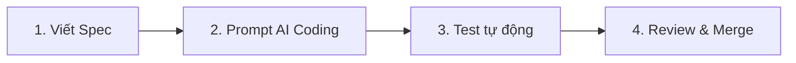
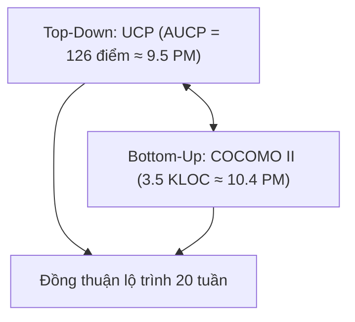
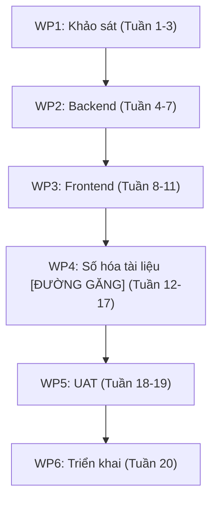

# PHIẾU BÀI LÀM ÔN TẬP — NGƯỜI 4: ƯỚC LƯỢNG, LẬP KẾ HOẠCH & QUY TRÌNH

- **Họ và tên thành viên:** Ân Tiến Nguyên An
- **Mã số sinh viên:** 23127148
- **Phạm vi phụ trách:** **Câu 9, Câu 10, Câu 11**
- **Hạn chót hoàn thành (Bước 1):** **20:00, Thứ Năm (20/08/2026)**
- **Lưu ý quan trọng khi sửa `docs/`:** Nếu bạn chỉnh sửa hoặc tạo mới file trong thư mục `docs/`, **bắt buộc phải ghi lại bảng Document Revision History** ở đầu file và **ghi 1 dòng log công việc** vào file [`docs/03-execution-monitoring/02-project-log.md`](../../../docs/03-execution-monitoring/02-project-log.md).
- **Tài liệu tham chiếu trong dự án (thực hành):**
  - [`docs/02-planning/04-cost-time-resource.md`](../../../docs/02-planning/04-cost-time-resource.md) (Ước lượng UCP & COCOMO II, Chi phí & Lộ trình)
  - [`docs/03-execution-monitoring/01-sprint-plan.md`](../../../docs/03-execution-monitoring/01-sprint-plan.md) (Kế hoạch Sprint 1)
  - [`docs/02-planning/03-product-backlog.md`](../../../docs/02-planning/03-product-backlog.md) (Quy trình Kanban & DoD)
- **Tài liệu lý thuyết tham chiếu (từ bài giảng):**
  - [`materials/04_software_development_life_cycle_model.md`](../../../materials/04_software_development_life_cycle_model.md) (Vòng đời phát triển phần mềm, Waterfall, Iterative, Agile)
  - [`materials/04_01_software_development_models.md`](../../../materials/04_01_software_development_models.md) (Chi tiết các mô hình: Kanban, Scrum, XP, ưu/nhược)
  - [`materials/05_1_work_breakdown_structure.md`](../../../materials/05_1_work_breakdown_structure.md) (WBS, Work Packages, Critical Path)
  - [`materials/05_2_introduction_to_software_estimation.md`](../../../materials/05_2_introduction_to_software_estimation.md) (Giới thiệu Ước lượng, Cone of Uncertainty, Count-Compute-Judge)
  - [`materials/05_3_agile_estimation.md`](../../../materials/05_3_agile_estimation.md) (Planning Poker, Story Points, Velocity)
  - [`materials/05_4_model_based_estimation.md`](../../../materials/05_4_model_based_estimation.md) (Use Case Points, COCOMO II, Function Points)
  - [`materials/06_software_project_planning.md`](../../../materials/06_software_project_planning.md) (Lập kế hoạch dự án, Gantt, PERT, Critical Path Method)
  - [`materials/06_1_agile_planning.md`](../../../materials/06_1_agile_planning.md) (Lập kế hoạch Agile, Sprint Planning, Release Planning)
- **Ghi chú bài giảng trên lớp ([`note.md`](../../../note.md)):**
  - **Buổi 05 & 08:** Mô hình Kanban đo khoảng gap time giữa To-do và Done; quy tắc WIP limit = 1 để tránh quá tải review; phương pháp chia nhỏ và đếm số lượng (Count-Compute-Judge).
  - **Buổi 07 & 10:** Ước lượng 2 phương pháp: Top-down UCP vs Bottom-up COCOMO II (dựa trên mã nguồn tương tự DSpace làm mốc so sánh + phần sai lệch tính năng mới); Fibonacci Planning Poker, tính độ lệch phương sai Var, nhân hệ số an toàn.
  - **Buổi 08 & 09:** WBS phân rã 6 gói công việc; nhận diện đường găng WP4 (Số hóa 6 tuần); đo tiến độ bằng manday/throughput thực tế.
- **Đọc chéo liên kết:** Nên đọc thêm phần của **Người 2** (Câu 4: Backlog) vì Backlog là đầu vào trực tiếp cho ước lượng UCP, và phần của **Người 6** (Câu 17: Theo dõi & Kiểm soát) vì Project Plan được cập nhật qua monitoring.
- **Checklist bản in nộp kèm khi thi:**
  - [ ] Bản in tài liệu Định nghĩa quy trình phát triển phần mềm (Mục 1.1 trong Backlog và Sprint Plan) -- **CẦN CHUẨN BỊ**: trích xuất và in riêng phần mô tả quy trình -- đánh dấu "9".
  - [ ] Bản in tài liệu Ước lượng dự án (`04-cost-time-resource.md`) -- đánh dấu số câu hỏi "10" ở góc trên phải.
  - [ ] Bản in tài liệu Kế hoạch dự án (`01-sprint-plan.md`) và Sơ đồ WBS -- đánh dấu "11".
- **Chiến lược 10 phút viết giấy A4:** Phút 1-2: Viết tiêu đề câu + dàn ý WHAT-HOW-WHY-EVIDENCE. Phút 3-7: Triển khai mỗi mục 3-4 dòng ngắn gọn, ưu tiên HOW (các bước nhóm đã làm) và EVIDENCE (số liệu cụ thể). Phút 8-9: Vẽ 1 sơ đồ nhỏ minh họa (WBS hoặc bảng UCP). Phút 10: Rà soát, bổ sung từ khóa quan trọng còn thiếu.

---

## CÂU 9: ĐỊNH NGHĨA QUY TRÌNH PHÁT TRIỂN PHẦN MỀM

> **Đề bài:** Trình bày quá trình hình thành và phương pháp đánh giá tài liệu Định nghĩa quy trình phát triển phần mềm (Software Process Definition) của nhóm. _(Sinh viên nộp kèm bản in tài liệu Định nghĩa quy trình phát triển phần mềm của nhóm.)_

### 1. Gợi ý định hướng & Từ khóa cốt lõi:

- **Tài liệu đối chiếu:** `03-product-backlog.md` (Mục 1.1) và `01-sprint-plan.md`.
- **Từ khóa:** Mô hình Kanban Spec-driven kết hợp AI Coding, Quy tắc WIP limit = 1, Quy trình 4 bước (Spec $\rightarrow$ Prompt AI $\rightarrow$ Automated Test $\rightarrow$ Human Code Review), DoD 5 tiêu chí.

### 2. Không gian tự biên soạn câu trả lời:

#### A. Dàn ý trình bày trên giấy A4 (WHAT - HOW - WHY - EVIDENCE)

- **WHAT (Là gì?):**
  _Viết câu trả lời của bạn vào đây:_

- **HOW (Cách nhóm thiết lập và vận hành quy trình):**
  _Viết câu trả lời của bạn vào đây:_

- **WHY (Tại sao cần định nghĩa quy trình rõ ràng?):**
  _Viết câu trả lời của bạn vào đây:_

- **EVIDENCE (Minh chứng trong dự án):**
  _Viết câu trả lời của bạn vào đây:_

#### B. Sơ đồ Quy trình Spec-Driven kết hợp AI Coding Assistant

#### C. Trả lời chi tiết 100% Bộ câu hỏi thường gặp của Giảng viên

1. **Các câu hỏi chính cần trả lời trong tài liệu Định nghĩa quy trình phát triển phần mềm là gì?**
   - _Trả lời:_

2. **Mô hình cơ sở được lựa chọn để hiệu chỉnh là gì?**
   - _Trả lời:_

3. **Thời gian dự kiến của từng giai đoạn là bao lâu?**
   - _Trả lời:_

4. **Các vai trò nào từng thành viên trong nhóm sẽ đảm nhiệm?**
   - _Trả lời:_

5. **Các sản phẩm nào dự kiến sẽ khởi tạo?**
   - _Trả lời:_

6. **Quy trình để đưa ra một bản phân phối hoạt động là gì?**
   - _Trả lời:_

7. **Ưu và khuyết điểm của mô hình nhóm lựa chọn là gì?**
   - _Trả lời:_

8. **Tài liệu Định nghĩa quy trình phát triển phần mềm của nhóm đã được đánh giá thế nào?**
   - _Trả lời:_

9. **Tại sao cần tạo tài liệu Định nghĩa quy trình phát triển phần mềm?**
   - _Trả lời:_

10. **Tài liệu Định nghĩa quy trình phát triển phần mềm của nhóm đã được sử dụng và cập nhật trong quá trình thực hiện dự án như thế nào?**
    - _Trả lời:_

---

## CÂU 10: ƯỚC LƯỢNG DỰ ÁN (PROJECT ESTIMATE)

> **Đề bài:** Trình bày quá trình hình thành và phương pháp đánh giá tài liệu Ước lượng dự án (Project Estimate) của nhóm. _(Sinh viên nộp kèm bản in tài liệu Ước lượng dự án của nhóm.)_

### 1. Gợi ý định hướng & Từ khóa cốt lõi:

- **Tài liệu đối chiếu:** `04-cost-time-resource.md` (Mã HCMUS-LDMS-09).
- **Từ khóa:** Đối chuẩn 2 chiều: Top-Down UCP (UAW=12, UUCW=130 $\rightarrow$ AUCP=126 UCP $\rightarrow$ ~9.5 PM) vs Bottom-Up COCOMO II (3.5 KLOC $\rightarrow$ 10.4 PM), Khớp lộ trình 20 tuần của 4 dev (2 FTE), Cone of Uncertainty, Quy tắc Count-Compute-Judge.

### 2. Không gian tự biên soạn câu trả lời:

#### A. Dàn ý trình bày trên giấy A4 (WHAT - HOW - WHY - EVIDENCE)

- **WHAT (Là gì?):**
  _Viết câu trả lời của bạn vào đây:_

- **HOW (Chi tiết cách tính toán UCP và COCOMO II):**
  _Viết câu trả lời của bạn vào đây:_

- **WHY (Tại sao phải ước lượng khoa học kết hợp 2 phương pháp?):**
  _Viết câu trả lời của bạn vào đây:_

- **EVIDENCE (Các con số cụ thể trong dự án):**
  _Viết câu trả lời của bạn vào đây:_

#### B. Sơ đồ Đối chuẩn Ước lượng Hai Chiều

#### C. Trả lời chi tiết 100% Bộ câu hỏi thường gặp của Giảng viên

1. **Các câu hỏi chính cần trả lời trong tài liệu Ước lượng dự án là gì?**
   - _Trả lời:_

2. **Các đầu vào cần thiết và các bước nhóm đã thực hiện để tạo tài liệu Ước lượng dự án là gì?**
   - _Trả lời:_

3. **Tài liệu Ước lượng dự án của nhóm đã được đánh giá thế nào?**
   - _Trả lời:_

4. **Tại sao cần tạo tài liệu Ước lượng dự án?**
   - _Trả lời:_

5. **Tài liệu Ước lượng dự án của nhóm đã được sử dụng trong quá trình thực hiện dự án như thế nào?**
   - _Trả lời:_

6. **Giải thích các phương pháp phân rã một tính năng lớn thành các tính năng nhỏ:**
   - _Trả lời:_

7. **Khi không có khả năng phân rã được các tính năng lớn của dự án, nhóm phải làm thế nào?**
   - _Trả lời:_

8. **Ước lượng có thể sai lệch khoảng bao nhiêu lần ở giai đoạn đầu dự án (Giải thích Cone of Uncertainty)?**
   - _Trả lời:_

9. **Tại sao cần ước lượng ở giai đoạn đầu của dự án?**
   - _Trả lời:_

10. **Ước lượng kích cỡ (Size) mang lại lợi ích gì cho dự án khi mối quan tâm chính của ban quản lý là khoảng thời gian (Duration) và chi phí (Cost)?**
    - _Trả lời:_

11. **Giải thích quy tắc "Đếm, Tính toán và Đánh giá" (Count, Compute, Judge) khi thực hiện ước lượng dự án:**
    - _Trả lời:_

12. **Giải thích các kỹ thuật để tăng độ chính xác khi thực hiện việc ước lượng bằng đánh giá chủ quan:**
    - _Trả lời:_

13. **Giải thích các kỹ thuật để tăng độ chính xác khi ước lượng bằng phương pháp "Phân rã và Kết hợp" ("Decomposition and Recomposition"):**
    - _Trả lời:_

14. **Giải thích kỹ thuật ước lượng bằng các lá bài (Planning Poker) trong Agile:**
    - _Trả lời:_

---

## CÂU 11: KẾ HOẠCH DỰ ÁN (PROJECT PLAN)

> **Đề bài:** Trình bày quá trình hình thành và phương pháp đánh giá tài liệu Kế hoạch dự án (Project Plan) của nhóm. _(Sinh viên nộp kèm bản in tài liệu Kế hoạch dự án và WBS của nhóm.)_

### 1. Gợi ý định hướng & Từ khóa cốt lõi:

- **Tài liệu đối chiếu:** `04-cost-time-resource.md` (Mục 3: WBS) và `01-sprint-plan.md`.
- **Từ khóa:** Phân rã 6 gói công việc WBS (WP1 đến WP6), Nhận diện Đường găng Critical Path (WP4: Số hóa tài liệu 6 tuần), Mốc bàn giao Milestones, Quản lý rủi ro đường găng.

### 2. Không gian tự biên soạn câu trả lời:

#### A. Dàn ý trình bày trên giấy A4 (WHAT - HOW - WHY - EVIDENCE)

- **WHAT (Là gì?):**
  _Viết câu trả lời của bạn vào đây:_

- **HOW (Cách phân rã WBS và xác định đường găng):**
  _Viết câu trả lời của bạn vào đây:_

- **WHY (Tại sao cần bản kế hoạch dự án và theo dõi đường găng?):**
  _Viết câu trả lời của bạn vào đây:_

- **EVIDENCE (Minh chứng trong dự án):**
  _Viết câu trả lời của bạn vào đây:_

#### B. Sơ đồ Tiến độ WBS và Đường găng (Critical Path)

#### C. Trả lời chi tiết 100% Bộ câu hỏi thường gặp của Giảng viên

1. **Các câu hỏi chính cần trả lời trong tài liệu Kế hoạch dự án là gì?**
   - _Trả lời:_

2. **Các đầu vào cần thiết và các bước nhóm đã thực hiện để tạo tài liệu Kế hoạch dự án là gì?**
   - _Trả lời:_

3. **Tài liệu Kế hoạch dự án của nhóm đã được đánh giá thế nào?**
   - _Trả lời:_

4. **Tại sao cần tạo tài liệu Kế hoạch dự án?**
   - _Trả lời:_

5. **Tài liệu Kế hoạch dự án của nhóm đã được sử dụng và cập nhật trong quá trình thực hiện dự án như thế nào?**
   - _Trả lời:_

6. **Một số mô hình cho phép không xác định rõ các kết quả cuối cùng của dự án, vậy có cần tạo tài liệu Kế hoạch dự án trong các trường hợp này hay không?**
   - _Trả lời:_

7. **Tài liệu Kế hoạch dự án khác gì với tài liệu Định nghĩa quy trình phát triển phần mềm?**
   - _Trả lời:_
