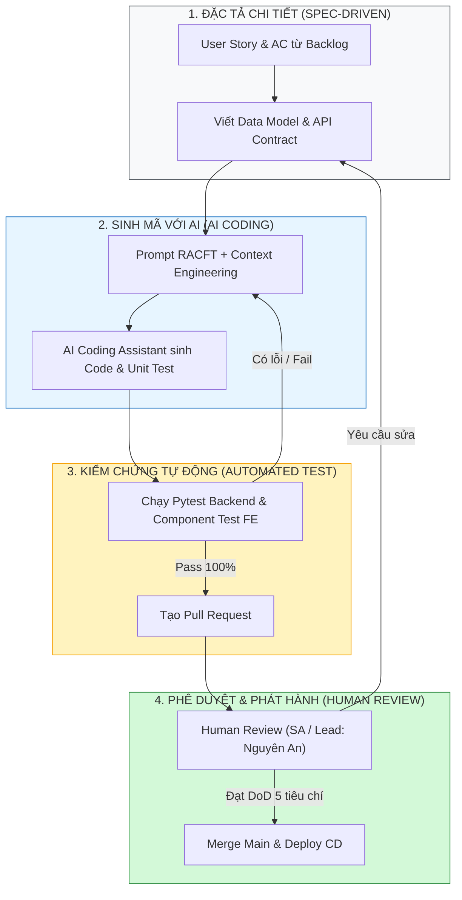
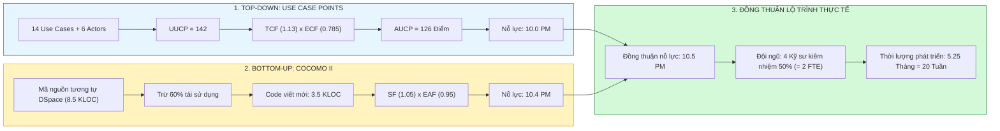

# PHIẾU BÀI LÀM ÔN TẬP — NGƯỜI 4: ƯỚC LƯỢNG, LẬP KẾ HOẠCH & QUY TRÌNH

- **Họ và tên thành viên:** Ân Tiến Nguyên An
- **Mã số sinh viên:** 23127148
- **Phạm vi phụ trách:** **Câu 9, Câu 10, Câu 11**
- **Hạn chót hoàn thành (Bước 1):** **20:00, Thứ Năm (20/08/2026)**
- **Lưu ý quan trọng khi sửa `docs/`:** Nếu bạn chỉnh sửa hoặc tạo mới file trong thư mục `docs/`, **bắt buộc phải ghi lại bảng Document Revision History** ở đầu file và **ghi 1 dòng log công việc** vào file [`docs/03-execution-monitoring/02-project-log.md`](../../../docs/03-execution-monitoring/02-project-log.md).
- **Tài liệu tham chiếu trong dự án (thực hành):**
  - [`docs/02-planning/04-cost-time-resource.md`](../../../docs/02-planning/04-cost-time-resource.md) (Ước lượng UCP & COCOMO II, Chi phí & Lộ trình)
  - [`docs/03-execution-monitoring/01-sprint-plan.md`](../../../docs/03-execution-monitoring/01-sprint-plan.md) (Kế hoạch Sprint 1)
  - [`docs/02-planning/03-product-backlog.md`](../../../docs/02-planning/03-product-backlog.md) (Quy trình Kanban & DoD)
- **Tài liệu lý thuyết tham chiếu (từ bài giảng):**
  - [`materials/04_software_development_life_cycle_model.md`](../../../materials/04_software_development_life_cycle_model.md) (Vòng đời phát triển phần mềm, Waterfall, Iterative, Agile)
  - [`materials/04_01_software_development_models.md`](../../../materials/04_01_software_development_models.md) (Chi tiết các mô hình: Kanban, Scrum, XP, ưu/nhược)
  - [`materials/05_1_work_breakdown_structure.md`](../../../materials/05_1_work_breakdown_structure.md) (WBS, Work Packages, Critical Path)
  - [`materials/05_2_introduction_to_software_estimation.md`](../../../materials/05_2_introduction_to_software_estimation.md) (Giới thiệu Ước lượng, Cone of Uncertainty, Count-Compute-Judge)
  - [`materials/05_3_agile_estimation.md`](../../../materials/05_3_agile_estimation.md) (Planning Poker, Story Points, Velocity)
  - [`materials/05_4_model_based_estimation.md`](../../../materials/05_4_model_based_estimation.md) (Use Case Points, COCOMO II, Function Points)
  - [`materials/06_software_project_planning.md`](../../../materials/06_software_project_planning.md) (Lập kế hoạch dự án, Gantt, PERT, Critical Path Method)
  - [`materials/06_1_agile_planning.md`](../../../materials/06_1_agile_planning.md) (Lập kế hoạch Agile, Sprint Planning, Release Planning)
- **Ghi chú bài giảng trên lớp ([`note.md`](../../../note.md)):**
  - **Buổi 05 & 08:** Mô hình Kanban đo khoảng gap time giữa To-do và Done; quy tắc WIP limit = 1 để tránh quá tải review; phương pháp chia nhỏ và đếm số lượng (Count-Compute-Judge).
  - **Buổi 07 & 10:** Ước lượng 2 phương pháp: Top-down UCP vs Bottom-up COCOMO II (dựa trên mã nguồn tương tự DSpace làm mốc so sánh + phần sai lệch tính năng mới); Fibonacci Planning Poker, tính độ lệch phương sai Var, nhân hệ số an toàn.
  - **Buổi 08 & 09:** WBS phân rã 6 gói công việc; nhận diện đường găng WP4 (Số hóa 6 tuần); đo tiến độ bằng manday/throughput thực tế.
- **Đọc chéo liên kết:** Nên đọc thêm phần của **Người 2** (Câu 4: Backlog) vì Backlog là đầu vào trực tiếp cho ước lượng UCP, và phần của **Người 6** (Câu 17: Theo dõi & Kiểm soát) vì Project Plan được cập nhật qua monitoring.
- **Checklist bản in nộp kèm khi thi:**
  - [ ] Bản in tài liệu Định nghĩa quy trình phát triển phần mềm (Mục 1.1 trong Backlog và Sprint Plan) -- **CẦN CHUẨN BỊ**: trích xuất và in riêng phần mô tả quy trình -- đánh dấu "9".
  - [ ] Bản in tài liệu Ước lượng dự án (`04-cost-time-resource.md`) -- đánh dấu số câu hỏi "10" ở góc trên phải.
  - [ ] Bản in tài liệu Kế hoạch dự án (`01-sprint-plan.md`) và Sơ đồ WBS -- đánh dấu "11".
- **Chiến lược 10 phút viết giấy A4:** Phút 1-2: Viết tiêu đề câu + dàn ý WHAT-HOW-WHY-EVIDENCE. Phút 3-7: Triển khai mỗi mục 3-4 dòng ngắn gọn, ưu tiên HOW (các bước nhóm đã làm) và EVIDENCE (số liệu cụ thể). Phút 8-9: Vẽ 1 sơ đồ nhỏ minh họa (WBS hoặc bảng UCP). Phút 10: Rà soát, bổ sung từ khóa quan trọng còn thiếu.

---

## CÂU 9: ĐỊNH NGHĨA QUY TRÌNH PHÁT TRIỂN PHẦN MỀM

> **Đề bài:** Trình bày quá trình hình thành và phương pháp đánh giá tài liệu Định nghĩa quy trình phát triển phần mềm (Software Process Definition) của nhóm. _(Sinh viên nộp kèm bản in tài liệu Định nghĩa quy trình phát triển phần mềm của nhóm.)_

### 1. Gợi ý định hướng & Từ khóa cốt lõi:

- **Tài liệu đối chiếu:** [`docs/02-planning/03-product-backlog.md`](../../../docs/02-planning/03-product-backlog.md) (Mục 1.1) và [`docs/03-execution-monitoring/01-sprint-plan.md`](../../../docs/03-execution-monitoring/01-sprint-plan.md).
- **Từ khóa:** Mô hình Kanban Spec-driven kết hợp AI Coding, Quy tắc WIP limit = 1, Quy trình 4 bước (Spec $\rightarrow$ Prompt AI $\rightarrow$ Automated Test $\rightarrow$ Human Code Review), DoD 5 tiêu chí.

### 2. Không gian tự biên soạn câu trả lời:

#### A. Dàn ý trình bày trên giấy A4 (WHAT - HOW - WHY - EVIDENCE)

- **WHAT (Là gì?):**
  Tài liệu Định nghĩa Quy trình Phát triển Phần mềm (Software Process Definition) quy định mô hình vòng đời và luồng tác nghiệp kỹ thuật chuẩn của nhóm. HCMUS-LDMS lựa chọn mô hình **Agile Kanban định hướng đặc tả (Spec-Driven) kết hợp Trợ lý Lập trình AI (AI Coding Assistant)**, chuẩn hóa thành luồng 4 bước khép kín với chính sách **WIP limit = 1 card/kỹ sư** và 5 tiêu chuẩn hoàn thành **Definition of Done (DoD)** nghiêm ngặt.

- **HOW (Cách nhóm thiết lập và vận hành quy trình 4 bước):**
  1. **Bước 1: Viết Spec chi tiết (Spec-Driven):** Trước khi code bất kỳ story nào, kỹ sư hoàn thiện đầy đủ Acceptance Criteria (AC), API contract (Pydantic models / FastAPI schema), và Schema DB.
  2. **Bước 2: Prompt AI Coding (Context Engineering):** Sử dụng khung prompt RACFT (Role-Ask-Context-Format-Tone) đưa toàn bộ file Spec, quy tắc kiến trúc và context vào trợ lý AI (Antigravity / Claude) để sinh mã nguồn ban đầu.
  3. **Bước 3: Kiểm thử tự động (Automated Testing):** Chạy ngay bộ test suite (`pytest src/backend/tests/`) và linting/type-check để kiểm chứng logic, đảm bảo 0 lỗi phát sinh.
  4. **Bước 4: Con người Review & Merge (Human-in-the-loop):** Lead Backend / SA (Ân Tiến Nguyên An) thực hiện Code Review độc lập, kiểm tra bảo mật, hiệu năng và đối chiếu DoD trước khi merge Pull Request vào nhánh chính `main`.

- **WHY (Tại sao cần định nghĩa quy trình rõ ràng?):**
  - **Triệt tiêu "Ảo giác AI" (AI Hallucination):** Dùng AI không kiểm soát sẽ gây nợ kỹ thuật (technical debt) khổng lồ; quy trình Spec-driven + Automated Test đóng vai trò là "lưới bảo vệ" giữ code luôn đúng nghiệp vụ.
  - **Tối ưu hóa nguồn lực kiêm nhiệm:** 4 kỹ sư kiêm nhiệm 50% thời gian; quy tắc `WIP limit = 1` giúp triệt tiêu tình trạng nghẽn cổ chai tại khâu Review và giảm thiểu chi phí chuyển đổi ngữ cảnh (context-switching cost).
  - **Tuân thủ bài học quản lý NASA/SEL:** Quy trình được định nghĩa rõ ràng (Well-defined process) giúp duy trì chất lượng và năng suất ổn định, tránh các cuộc họp và thủ tục hành chính vô bổ.

- **EVIDENCE (Minh chứng trong dự án HCMUS-LDMS):**
  - Trích xuất trực tiếp từ [`docs/02-planning/03-product-backlog.md`](../../../docs/02-planning/03-product-backlog.md) (Mục 1.1: Quy trình Kanban 4 bước & DoD 5 tiêu chí).
  - Bản phân công Sprint 1 tại [`docs/03-execution-monitoring/01-sprint-plan.md`](../../../docs/03-execution-monitoring/01-sprint-plan.md) (17 stories phân bổ cho 4 dev, mỗi dev tự làm cả BE FastAPI lẫn FE React).
  - Dữ liệu vận hành thực tế tại [`docs/03-execution-monitoring/02-project-log.md`](../../../docs/03-execution-monitoring/02-project-log.md): Snapshot Tuần 1 hoàn thành 12/26 stories, Cycle Time trung bình 1.5 ngày/story, tiêu thụ 730K token AI (~350K VNĐ).

#### B. Sơ đồ Quy trình Spec-Driven kết hợp AI Coding Assistant

#### C. Trả lời chi tiết 100% Bộ câu hỏi thường gặp của Giảng viên

1. **Các câu hỏi chính cần trả lời trong tài liệu Định nghĩa quy trình phát triển phần mềm là gì?**
   - _Trả lời:_ Theo chuẩn kỹ thuật phần mềm và bài học NASA/SEL, tài liệu phải trả lời 5 câu hỏi quản trị cốt lõi:
     1. **Làm bước nào tiếp theo?** (Xác định rõ trình tự các giai đoạn và luồng trạng thái từ To-Do $\rightarrow$ In Progress $\rightarrow$ Review $\rightarrow$ Done).
     2. **Sẽ mất bao lâu?** (Thời lượng dự kiến của từng giai đoạn và Cycle Time tiêu chuẩn cho từng kích cỡ Story: Size S $\le 2$ ngày, Size M $\le 3$ ngày).
     3. **Thực hiện bước này như thế nào?** (Phương pháp luận Spec-Driven, kỹ thuật Prompt AI RACFT, quy chuẩn GitFlow và viết kiểm thử).
     4. **Tạo ra những sản phẩm/hiện vật gì?** (Spec markdown, mã nguồn FastAPI/React, bộ test Pytest, Docker Compose, Swagger Docs).
     5. **Ai chịu trách nhiệm thực hiện?** (Ma trận phân vai chi tiết cho 6 thành viên trong `05-team-contract.md`).

2. **Mô hình cơ sở được lựa chọn để hiệu chỉnh là gì?**
   - _Trả lời:_ Nhóm lựa chọn **Mô hình Agile Kanban** làm khung cơ sở, sau đó hiệu chỉnh kết hợp với phương pháp **Spec-Driven Development** và tích hợp **AI Coding Assistant** vào vòng lặp phát triển cục bộ. Sự hiệu chỉnh này thay thế việc họp Daily Scrum truyền thống bằng cơ chế *Session Logging tự động* và gán cứng *WIP limit = 1* để tối ưu hóa năng suất lập trình viên.

3. **Thời gian dự kiến của từng giai đoạn là bao lâu?**
   - _Trả lời:_ Dự án triển khai trong **20 tuần** gồm 4 giai đoạn lớn ([`04-cost-time-resource.md`](../../../docs/02-planning/04-cost-time-resource.md) §1.1):
     - **Giai đoạn 0 — Khảo sát & Bản quyền (Tuần 1–2):** Khảo sát thực tế tài liệu thư viện, đánh giá pháp lý và cấu hình hạ tầng.
     - **Giai đoạn 1 — Xây dựng MVP & Thí điểm (Tuần 3–12):** Phát triển phần mềm cốt lõi (FastAPI, React, OCR Tesseract, Pandoc, PostgreSQL FTS) và số hóa thử nghiệm 500 giáo trình CNTT.
     - **Giai đoạn 2 — Số hóa Diện rộng (Tuần 13–18):** Chuyển giao quy trình cho Thủ thư và 15 CTV số hóa 2.000 giáo trình tiếp theo.
     - **Giai đoạn 3 — Nghiệm thu & Chuyển giao (Tuần 19–20):** Kiểm thử chấp nhận (UAT), pentest bảo mật, đào tạo người dùng và Go-Live toàn trường.

4. **Các vai trò nào từng thành viên trong nhóm sẽ đảm nhiệm?**
   - _Trả lời:_ Phân vai chính thức theo Hợp đồng nhóm ([`05-team-contract.md`](../../../docs/01-initiation/05-team-contract.md) §2):
     - **Ân Tiến Nguyên An (`23127148`):** Project Manager, Solution Architect (SA), Lead Backend (FastAPI, DB Optimization, Code Review PR).
     - **Nguyễn Tuấn Anh (`23127152`):** DevOps Engineer & Backend Developer (Docker, CI/CD, Auth OAuth2/JWT).
     - **Nguyễn Quang Thái (`23127116`):** Lead Frontend & Product Owner (UI Portal, Editorial workflow).
     - **Nguyễn Lê Hồ Anh Khoa (`23127211`):** Frontend Developer (Search UX, Trình đọc EPUB Reader).
     - **Ngô Nguyễn Thế Khoa (`23127065`):** Data Engineer & Pipeline Backend (OCR Tesseract, Pandoc EPUB, Worker queue).
     - **Mạch Quốc Tấn (`23127115`):** QA/QC Lead & Monitoring Coordinator (Giám sát chỉ số, Test plan, Quản trị rủi ro).

5. **Các sản phẩm nào dự kiến sẽ khởi tạo?**
   - _Trả lời:_
     - **Tài liệu:** Bộ tài liệu quản lý dự án chuẩn (`docs/01-initiation`, `docs/02-planning`, `docs/03-execution-monitoring`).
     - **Mã nguồn:** Backend Modular Monolith (FastAPI + SQLAlchemy + PostgreSQL FTS + MinIO) và Frontend Web Portal (React + Vite + Tailwind/Vanilla CSS + Epub.js).
     - **Công cụ & Hạ tầng:** File `docker-compose.yml`, pipeline CI/CD GitHub Actions, script backup tự động.
     - **Dữ liệu số hóa:** 500 sách điện tử chuẩn EPUB thí điểm và 2.000 sách số hóa diện rộng.

6. **Quy trình để đưa ra một bản phân phối hoạt động là gì?**
   - _Trả lời:_ Kỹ sư hoàn thiện code trên nhánh `feature/<tên-story>` $\rightarrow$ Chạy test cục bộ đạt 100% $\rightarrow$ Tạo Pull Request $\rightarrow$ Pipeline GitHub Actions tự động kích hoạt (Linting, Type check, Pytest) $\rightarrow$ SA Nguyên An review code theo 5 tiêu chí DoD $\rightarrow$ Merge vào `main` $\rightarrow$ CD deploy tự động container lên môi trường Staging/Production qua Docker Compose.

7. **Ưu và khuyết điểm của mô hình nhóm lựa chọn là gì?**
   - _Trả lời:_
     - **Ưu điểm:** Tốc độ phát triển cực nhanh nhờ trợ lực của AI; luồng công việc mượt mà liên tục (Flow-based) không bị lãng phí thời gian chờ đợi; chất lượng code đồng đều nhờ kiểm thử tự động và review độc lập.
     - **Khuyết điểm:** Phụ thuộc vào chất lượng viết Spec ban đầu (Spec mơ hồ dẫn đến AI sinh code rác); đòi hỏi tính kỷ luật cá nhân cao của từng kỹ sư trong việc cập nhật Session Log và không được bỏ qua bước kiểm thử.

8. **Tài liệu Định nghĩa quy trình phát triển phần mềm của nhóm đã được đánh giá thế nào?**
   - _Trả lời:_ Được đánh giá qua 3 lớp:
     1. *Thẩm định chéo nội bộ:* Họp Sprint 0 giữa SA và 4 dev để rà soát tính khả thi của quy trình 4 bước và tiêu chí DoD.
     2. *Thực nghiệm đo lường:* Thử nghiệm trực tiếp trong Sprint 1 và đo lường qua các chỉ số Throughput (đạt 12 stories/tuần) và Cycle Time ($\le 2$ ngày).
     3. *Đối chuẩn lý thuyết:* Đối chiếu với các thực hành kỹ thuật phần mềm tốt nhất của NASA/SEL và Agile Kanban.

9. **Tại sao cần tạo tài liệu Định nghĩa quy trình phát triển phần mềm?**
   - _Trả lời:_ Để tạo ra một **tiếng nói chung và luật chơi minh bạch** cho toàn đội ngũ; định hướng rõ ràng cho từng thành viên biết phải làm gì, theo chuẩn mực nào; loại bỏ tình trạng code tùy tiện, giảm xung đột khi tích hợp và bảo vệ chất lượng phần mềm không bị suy thoái khi phát triển nhanh.

10. **Tài liệu Định nghĩa quy trình phát triển phần mềm của nhóm đã được sử dụng và cập nhật trong quá trình thực hiện dự án như thế nào?**
    - _Trả lời:_ Tài liệu được đính kèm ở đầu Backlog (`03-product-backlog.md` §1.1) và được mọi dev mở xem khi bắt đầu pick task. Trong quá trình chạy Sprint 1, khi phát hiện kỹ sư có xu hướng prompt AI tràn lan gây lãng phí token, quy trình đã được **cập nhật bổ sung quy định kiểm soát Token Cap ($\le 300\text{K tokens/session}$)** và **bắt buộc ghi log session** vào `02-project-log.md`.

---

## CÂU 10: ƯỚC LƯỢNG DỰ ÁN (PROJECT ESTIMATE)

> **Đề bài:** Trình bày quá trình hình thành và phương pháp đánh giá tài liệu Ước lượng dự án (Project Estimate) của nhóm. _(Sinh viên nộp kèm bản in tài liệu Ước lượng dự án của nhóm.)_

### 1. Gợi ý định hướng & Từ khóa cốt lõi:

- **Tài liệu đối chiếu:** [`docs/02-planning/04-cost-time-resource.md`](../../../docs/02-planning/04-cost-time-resource.md) (Mã HCMUS-LDMS-CTR).
- **Từ khóa:** Đối chuẩn 2 chiều: Top-Down UCP (UAW=12, UUCW=130 $\rightarrow$ AUCP=126 UCP $\rightarrow$ ~9.5 PM) vs Bottom-Up COCOMO II (3.5 KLOC $\rightarrow$ 10.4 PM), Khớp lộ trình 20 tuần của 4 dev (2 FTE), Cone of Uncertainty, Quy tắc Count-Compute-Judge.

### 2. Không gian tự biên soạn câu trả lời:

#### A. Dàn ý trình bày trên giấy A4 (WHAT - HOW - WHY - EVIDENCE)

- **WHAT (Là gì?):**
  Ước lượng dự án (Project Estimation) là hoạt động dự báo kích thước (Size), nỗ lực (Effort), thời gian (Duration) và chi phí (Cost) cần thiết để hoàn thành hệ thống. Nhóm áp dụng phương pháp **Đối chuẩn Ước lượng Hai Chiều (Two-Way Calibration)** kết hợp: **Top-Down Use Case Points (UCP)** (đo lường chức năng nghiệp vụ) và **Bottom-Up COCOMO II** (đo lường mã nguồn kỹ thuật viết mới), tuân thủ nguyên tắc *Đếm — Tính toán — Đánh giá (Count-Compute-Judge)*.

- **HOW (Chi tiết cách tính toán UCP và COCOMO II):**
  1. **Top-Down UCP:**
     - *Đếm Tác nhân (UAW):* 3 Actor hệ thống đơn giản ($\times 1$) + 3 Actor người dùng phức tạp ($\times 3$) $\rightarrow \mathbf{UAW = 12}$.
     - *Đếm Use Case (UUCW):* 6 Simple ($\times 5$) + 4 Average ($\times 10$) + 4 Complex ($\times 15$) $\rightarrow \mathbf{UUCW = 130}$.
     - *Điểm thô:* $\text{UUCP} = 12 + 130 = \mathbf{142}$.
     - *Hệ số kỹ thuật & Môi trường:* $\text{TCF} = 0.6 + (0.01 \times 53) = \mathbf{1.13}$; $\text{ECF} = 1.4 + (-0.03 \times 20.5) = \mathbf{0.785}$.
     - *Điểm đã điều chỉnh:* $\mathbf{AUCP = 142 \times 1.13 \times 0.785 \approx 126\text{ UCP}}$.
     - *Nỗ lực UCP:* $126 \times 20\text{ giờ/UCP} = 2.520\text{ giờ} \approx 15.75\text{ PM}$. Tận dụng thư viện/hạ tầng sẵn có ($40\%$) $\rightarrow \mathbf{Effort = 10.0\text{ PM}}$.
  2. **Bottom-Up COCOMO II:**
     - Tổng quy mô hệ thống: $8.5\text{ KLOC}$; Tái sử dụng $60\%$ qua FastAPI/MinIO/PostgreSQL FTS $\rightarrow$ Quy mô viết mới thực tế: $\mathbf{3.5\text{ KLOC}}$.
     - Hệ số quy mô $B = 1.05$; Hệ số nỗ lực $\text{EAF} = 0.95$.
     - *Nỗ lực COCOMO II:* $\mathbf{Effort = 2.94 \times 0.95 \times (3.5)^{1.05} \approx 10.4\text{ PM}}$.
  3. **Kết luận & Đồng thuận Lộ trình:**
     - Cả hai mô hình độc lập hội tụ hoàn hảo ở mức $\mathbf{\approx 10.5\text{ PM}}$.
     - Với 4 kỹ sư kiêm nhiệm 50% ($= 2\text{ FTE}$): $\text{Thời gian phát triển} = 10.5\text{ PM} / 2 = \mathbf{5.25\text{ tháng} \approx 21\text{ tuần}}$, hoàn toàn khớp với khung **20 tuần** toàn dự án.

- **WHY (Tại sao phải ước lượng khoa học kết hợp 2 phương pháp?):**
  - **Khắc phục "Căn bệnh lạc quan" (Best-Case Syndrome):** Lập trình viên thường chỉ ước lượng trong điều kiện hoàn hảo; kết hợp 2 mô hình giúp nhìn nhận đa chiều từ nghiệp vụ đến dòng code thực tế.
  - **Thu hẹp Hình nón bất định (Cone of Uncertainty):** Việc đếm rõ ràng Use Case và dòng code giúp kiểm soát độ sai lệch từ mức $4\times$ ở đầu dự án xuống dưới $1.25\times$.
  - **Cơ sở bảo vệ cam kết (Commitment):** Cung cấp bằng chứng số liệu vững chắc để bảo vệ ngân sách CapEx (75–95 triệu VNĐ) trước Ban Giám hiệu.

- **EVIDENCE (Các con số cụ thể trong dự án):**
  - Tài liệu chi tiết tại [`docs/02-planning/04-cost-time-resource.md`](../../../docs/02-planning/04-cost-time-resource.md) (Mục 2: Bảng tính UCP 126 điểm, COCOMO II 10.4 PM).
  - Phân bổ ngân sách nhân công 4 kỹ sư trong SOW [`docs/02-planning/05-statement-of-work.md`](../../../docs/02-planning/05-statement-of-work.md) (§8).

#### B. Sơ đồ Đối chuẩn Ước lượng Hai Chiều

#### C. Trả lời chi tiết 100% Bộ câu hỏi thường gặp của Giảng viên

1. **Các câu hỏi chính cần trả lời trong tài liệu Ước lượng dự án là gì?**
   - _Trả lời:_ Tài liệu phải trả lời rõ 4 câu hỏi:
     1. Kích thước phần mềm là bao nhiêu? (126 AUCP / 3.5 KLOC viết mới).
     2. Cần bao nhiêu công sức? (10.5 Person-Months ~ 2.520 giờ làm việc).
     3. Mất bao lâu để hoàn thành? (20–21 tuần với đội ngũ 2 FTE).
     4. Chi phí dự toán là bao nhiêu? (CapEx: 75–95 triệu VNĐ, OpEx: 15–30 triệu VNĐ/năm).

2. **Các đầu vào cần thiết và các bước nhóm đã thực hiện để tạo tài liệu Ước lượng dự án là gì?**
   - _Trả lời:_
     - **Đầu vào:** Danh sách Use Case từ Product Backlog, danh sách Actor, ma trận yêu cầu phi chức năng (TCF), bảng đánh giá năng lực đội ngũ (ECF), và dữ liệu mã nguồn tương đương từ DSpace.
     - **Các bước thực hiện:**
       1. Phân loại và tính điểm UAW, UUCW $\rightarrow$ UUCP.
       2. Chấm điểm 13 yếu tố kỹ thuật (TCF) và 8 yếu tố môi trường (ECF).
       3. Tính điểm AUCP và nhân hệ số năng suất $PF = 20$ giờ/UCP.
       4. Ước tính KLOC mã nguồn và chạy mô hình COCOMO II Early Design để đối chuẩn chéo.
       5. Tổng hợp kết quả và quy đổi ra số tuần làm việc của đội ngũ.

3. **Tài liệu Ước lượng dự án của nhóm đã được đánh giá thế nào?**
   - _Trả lời:_ Được đánh giá thông qua phương pháp **Đối chuẩn Độc lập Hai Chiều (Cross-model validation)** giữa UCP (10.0 PM) và COCOMO II (10.4 PM), với độ lệch cực nhỏ ($< 4\%$). Kết quả sau đó được thẩm định bởi Trưởng phòng CNTT và Giám đốc Thư viện.

4. **Tại sao cần tạo tài liệu Ước lượng dự án?**
   - _Trả lời:_ Để xác định xem mục tiêu kinh doanh (Target) có khả thi và thực tế hay không; thiết lập cơ sở khoa học để cam kết (Commitment) thời gian bàn giao; dự toán và xin cấp ngân sách đầu tư; và làm đường cơ sở (Baseline) để theo dõi tiến độ trong suốt vòng đời dự án.

5. **Tài liệu Ước lượng dự án của nhóm đã được sử dụng trong quá trình thực hiện dự án như thế nào?**
   - _Trả lời:_ Được sử dụng làm kim chỉ nam phân bổ Story vào các Sprint (Sprint 1 pick 17 stories tương ứng nỗ lực 9 ngày); theo dõi năng suất (Throughput) thực tế so với dự toán; và kiểm soát ngân sách chi phí token AI không vượt trần CapEx.

6. **Giải thích các phương pháp phân rã một tính năng lớn thành các tính năng nhỏ:**
   - _Trả lời:_ Có 4 phương pháp phân rã chuẩn:
     1. *Theo luồng nghiệp vụ (Workflow steps):* Phân rã theo từng bước từ Upload $\rightarrow$ OCR $\rightarrow$ Biên tập $\rightarrow$ Xuất bản.
     2. *Theo lớp kiến trúc (Architectural layers):* Tách riêng lớp Data Model/DB $\rightarrow$ Lớp API Backend $\rightarrow$ Lớp Giao diện UI Frontend.
     3. *Theo cấp độ thao tác (CRUD & Business Operations):* Tách các thao tác cơ bản (Xem, Thêm, Sửa, Xóa) khỏi các logic xử lý phức tạp (Tìm kiếm toàn văn FTS, Sinh trích dẫn APA).
     4. *Theo mức độ ưu tiên MoSCoW:* Tách phần lõi Must-have để làm MVP trước, phần Should/Could-have bổ sung sau.

7. **Khi không có khả năng phân rã được các tính năng lớn của dự án, nhóm phải làm thế nào?**
   - _Trả lời:_ Áp dụng 3 kỹ thuật bổ trợ:
     1. **Lập Spike (PoC timebox):** Dành 1–2 ngày nghiên cứu thực nghiệm nhanh (như nhóm đã làm với module OCR Tesseract và Epub.js).
     2. **Ước lượng theo tương tự (Estimation by Analogy):** So sánh tính năng đó với một module tương tự trong hệ thống nguồn mở (DSpace/Calibre).
     3. **Ước lượng theo dải giá trị (Range Estimation):** Đưa ra khoảng biến thiên từ Lạc quan (Optimistic) đến Bi quan (Pessimistic) có dự phòng hệ số an toàn cao.

8. **Ước lượng có thể sai lệch khoảng bao nhiêu lần ở giai đoạn đầu dự án (Giải thích Cone of Uncertainty)?**
   - _Trả lời:_ Ở giai đoạn Khởi tạo ý tưởng ban đầu (Initial Concept), theo mô hình Hình nón bất định (Cone of Uncertainty), ước lượng có thể sai lệch từ **0.25x đến 4.0x (sai lệch tới 400%)**. Khi hoàn thành đặc tả yêu cầu, độ sai lệch giảm xuống $0.67x - 1.5x$, và khi chốt kiến trúc thiết kế, độ sai lệch chỉ còn $0.8x - 1.25x$ (20–25%). Hình nón chỉ thu hẹp khi nhóm đưa ra các quyết định kỹ thuật cụ thể.

9. **Tại sao cần ước lượng ở giai đoạn đầu của dự án?**
   - _Trả lời:_ Dù độ bất định cao, ước lượng sớm là bắt buộc để: (1) Đánh giá tính khả thi kinh tế (TELOS) nhằm quyết định Go/No-Go; (2) Lập hạn mức ngân sách xin phê duyệt vốn; (3) Định hướng phạm vi MVP ban đầu.

10. **Ước lượng kích cỡ (Size) mang lại lợi ích gì cho dự án khi mối quan tâm chính của ban quản lý là khoảng thời gian (Duration) và chi phí (Cost)?**
    - _Trả lời:_ Kích cỡ (Size - như UCP, Story Points, KLOC) là **đại lượng khách quan, cố định** đại diện cho khối lượng công việc, không bị thay đổi bởi ai làm hay dùng công cụ gì. Từ Size, khi kết hợp với Năng suất (Productivity), người quản lý mới tính toán được chính xác $\text{Effort} = \text{Size} / \text{Productivity}$, từ đó suy ra $\text{Duration} = \text{Effort} / \text{Headcount}$ và $\text{Cost} = \text{Effort} \times \text{Labor Rate}$. Không thể tính toán Thời gian và Chi phí đáng tin cậy nếu không đo lường Kích cỡ.

11. **Giải thích quy tắc "Đếm, Tính toán và Đánh giá" (Count, Compute, Judge) khi thực hiện ước lượng dự án:**
    - _Trả lời:_
      - **Đếm (Count):** Đếm mọi thành phần có thể định lượng khách quan sớm nhất (đếm 14 Use Cases, 6 Actors, 4 bảng DB, 8.5 KLOC).
      - **Tính toán (Compute):** Áp dụng công thức toán học và mô hình chuẩn đã được kiểm chứng (công thức UCP, COCOMO II, PERT).
      - **Đánh giá (Judge):** Chỉ dùng nhận định chuyên gia có cấu trúc (Structured Judgment) ở bước cuối cùng để hiệu chỉnh các hệ số phức tạp môi trường (TCF, ECF, EAF) thay vì đoán mò cảm tính ngay từ đầu.

12. **Giải thích các kỹ thuật để tăng độ chính xác khi thực hiện việc ước lượng bằng đánh giá chủ quan:**
    - _Trả lời:_ (1) Cho chính người trực tiếp lập trình tham gia ước lượng; (2) Chia nhỏ công việc xuống mức nhiệm vụ $\le 2$ ngày; (3) Sử dụng kỹ thuật ước tính 3 điểm PERT: $\text{Expected} = (O + 4M + P)/6$; (4) Tận dụng Luật Số Lớn (Law of Large Numbers) bằng cách tổng hợp từ 5–10 hạng mục độc lập để triệt tiêu sai số ngẫu nhiên.

13. **Giải thích các kỹ thuật để tăng độ chính xác khi ước lượng bằng phương pháp "Phân rã và Kết hợp" ("Decomposition and Recomposition"):**
    - _Trả lời:_ Phân rã cấu trúc công việc (WBS) thành các gói nhỏ không quá 2 ngày nỗ lực $\rightarrow$ Thực hiện đếm và tính toán độc lập cho từng phần tử lá $\rightarrow$ Cộng dồn (Recomposition) các giá trị trung bình $\rightarrow$ Bổ sung phần trăm dự phòng (Buffer 15%) cho công việc tích hợp và rủi ro phát sinh.

14. **Giải thích kỹ thuật ước lượng bằng các lá bài (Planning Poker) trong Agile:**
    - _Trả lời:_ Là kỹ thuật ước lượng đồng thuận nhóm dựa trên dãy số Fibonacci (1, 2, 3, 5, 8, 13, 21...). Các thành viên cùng lật bài đồng thời để tránh hiệu ứng tâm lý "mỏ neo" (anchoring bias). Nếu có sự chênh lệch lớn giữa điểm cao nhất và thấp nhất, hai người này giải thích lý do, cả nhóm thảo luận ngắn và bỏ phiếu lại cho đến khi đạt được sự đồng thuận.

---

## CÂU 11: KẾ HOẠCH DỰ ÁN (PROJECT PLAN)

> **Đề bài:** Trình bày quá trình hình thành và phương pháp đánh giá tài liệu Kế hoạch dự án (Project Plan) của nhóm. _(Sinh viên nộp kèm bản in tài liệu Kế hoạch dự án và WBS của nhóm.)_

### 1. Gợi ý định hướng & Từ khóa cốt lõi:

- **Tài liệu đối chiếu:** [`docs/02-planning/04-cost-time-resource.md`](../../../docs/02-planning/04-cost-time-resource.md) (Mục 3: WBS) và [`docs/03-execution-monitoring/01-sprint-plan.md`](../../../docs/03-execution-monitoring/01-sprint-plan.md).
- **Từ khóa:** Phân rã 6 gói công việc WBS (WP1 đến WP6), Nhận diện Đường găng Critical Path (WP4: Số hóa tài liệu 6 tuần), Mốc bàn giao Milestones, Quản lý rủi ro đường găng.

### 2. Không gian tự biên soạn câu trả lời:

#### A. Dàn ý trình bày trên giấy A4 (WHAT - HOW - WHY - EVIDENCE)

- **WHAT (Là gì?):**
  Kế hoạch Dự án (Project Plan) là tài liệu tích hợp định rõ toàn bộ phạm vi công việc, tiến độ thời gian, phân bổ nguồn lực và các mốc kiểm soát chất lượng. Hệ thống HCMUS-LDMS phân rã công việc thành **6 Gói công việc chuẩn WBS (Work Packages: WP1 $\rightarrow$ WP6)** và nhận diện chính xác **Đường găng (Critical Path) tại WP4 (Số hóa tài liệu — 6 tuần)**.

- **HOW (Cách phân rã WBS và xác định đường găng):**
  1. **Phân rã 6 gói công việc WBS:**
     - `WP1:` Khảo sát & Bản quyền (Tuần 1–3) — Thu thập mẫu sách, quy chế số hóa.
     - `WP2:` Cơ sở dữ liệu & Backend (Tuần 4–7) — Dựng PostgreSQL, MinIO, API FastAPI.
     - `WP3:` Giao diện & Trình đọc (Tuần 8–11) — React UI, Trình đọc Epub.js, Tích hợp FTS.
     - `WP4:` Số hóa tài liệu (Tuần 12–17) — **ĐƯỜNG GĂNG**: Quét sách, chạy OCR, soát sửa lỗi, đóng gói EPUB.
     - `WP5:` Kiểm thử & UAT (Tuần 18–19) — Pentest, nghiệm thu với thủ thư/sinh viên.
     - `WP6:` Triển khai & Vận hành (Tuần 20) — Docker Compose production, đào tạo, Go-live.
  2. **Xác định đường găng (Critical Path Analysis):**
     - Tuyến công việc có tổng thời lượng dài nhất và độ trễ bằng không ($\text{Slack} = 0$) là: $\text{WP1} \rightarrow \text{WP2} \rightarrow \text{WP3} \rightarrow \text{WP4} \rightarrow \text{WP5} \rightarrow \text{WP6}$ (Tổng 20 tuần).
     - **WP4 là mắt xích găng nhạy cảm nhất:** Phụ thuộc vào tốc độ quét scan vật lý và nhân công soát lỗi thủ công của sinh viên CTV.

- **WHY (Tại sao cần bản kế hoạch dự án và theo dõi đường găng?):**
  - **Kiểm soát rủi ro trễ hạn:** Bất kỳ sự chậm trễ nào trên đường găng (đặc biệt là WP4) sẽ kéo lùi ngày Go-live của toàn bộ dự án; do đó cần theo dõi sát sao để có biện pháp can thiệp (Crashing / Fast-tracking).
  - **Đồng bộ đa lực lượng:** Phối hợp nhịp nhàng giữa 4 kỹ sư phần mềm, 2 cán bộ thủ thư và 15 sinh viên CTV số hóa.
  - **Thiết lập Baseline đo lường:** Cung cấp mốc chuẩn để đánh giá tiến độ thực tế hàng tuần.

- **EVIDENCE (Minh chứng trong dự án HCMUS-LDMS):**
  - Cấu trúc WBS và phân tích Critical Path tại [`docs/02-planning/04-cost-time-resource.md`](../../../docs/02-planning/04-cost-time-resource.md) (§1.2 & §3).
  - Bản kế hoạch Sprint 1 phân rã 17 stories theo 2 mốc Milestone cụ thể tại [`docs/03-execution-monitoring/01-sprint-plan.md`](../../../docs/03-execution-monitoring/01-sprint-plan.md).

#### B. Sơ đồ Tiến độ WBS và Đường găng (Critical Path)

```mermaid
flowchart LR
    WP1["WP1: Khảo sát & Bản quyền\n(Tuần 1-3)"] --> WP2["WP2: CSDL & Backend\n(Tuần 4-7)"]
    WP2 --> WP3["WP3: Giao diện & Trình đọc\n(Tuần 8-11)"]
    WP3 ==>|ĐƯỜNG GĂNG CHÍNH| WP4["WP4: Số hóa tài liệu [CRITICAL PATH]\n(Tuần 12-17 · 6 Tuần)"]
    WP4 ==> WP5["WP5: Kiểm thử & UAT\n(Tuần 18-19)"]
    WP5 ==> WP6["WP6: Triển khai & Go-Live\n(Tuần 20)"]

    style WP1 fill:#f8f9fa,stroke:#495057
    style WP2 fill:#e7f5ff,stroke:#1971c2
    style WP3 fill:#e7f5ff,stroke:#1971c2
    style WP4 fill:#ffe3e3,stroke:#e03131,stroke-width:3px
    style WP5 fill:#fff3bf,stroke:#f59f00
    style WP6 fill:#d3f9d8,stroke:#2b8a3e
```

#### C. Trả lời chi tiết 100% Bộ câu hỏi thường gặp của Giảng viên

1. **Các câu hỏi chính cần trả lời trong tài liệu Kế hoạch dự án là gì?**
   - _Trả lời:_ Tài liệu Kế hoạch dự án giải quyết 5 câu hỏi cốt lõi:
     1. Những công việc cụ thể nào cần thực hiện? (6 gói công việc WBS từ WP1 đến WP6).
     2. Trình tự thực hiện và mối liên hệ phụ thuộc là gì? (Mạng tiến độ PERT/CPM).
     3. Ai là người phụ trách từng gói công việc? (Ma trận RACI nhân sự).
     4. Khi nào các mốc bàn giao (Milestones) hoàn thành? (Mốc tuần 2, tuần 12, tuần 18, tuần 20).
     5. Ngân sách và trang thiết bị cần phân bổ là gì? (CapEx 75–95 triệu VNĐ, 2 máy scan V-shape, 3 VM servers).

2. **Các đầu vào cần thiết và các bước nhóm đã thực hiện để tạo tài liệu Kế hoạch dự án là gì?**
   - _Trả lời:_
     - **Đầu vào:** Project Charter (Ủy nhiệm dự án), Statement of Work (SoW), Product Backlog, Báo cáo ước lượng UCP/COCOMO II.
     - **Các bước thực hiện:**
       1. Phân rã cấu trúc công việc WBS thành 6 Work Packages.
       2. Ước tính thời lượng và xác định quan hệ trước-sau (Precedence relationships) giữa các gói.
       3. Xây dựng sơ đồ mạng tiến độ và tính toán nhận diện Đường găng (Critical Path).
       4. Gán nguồn lực nhân sự (4 dev, 2 thủ thư, 15 CTV) và cơ sở hạ tầng thiết bị.
       5. Thiết lập các chốt kiểm soát cổng (Gating Checkpoints) và kế hoạch quản trị rủi ro đường găng.

3. **Tài liệu Kế hoạch dự án của nhóm đã được đánh giá thế nào?**
   - _Trả lời:_ Được đánh giá thông qua phương pháp **Phân tích Đường găng (Critical Path Method - CPM)** để đảm bảo tổng thời lượng 20 tuần là khả thi; thẩm định tính cân bằng tải tài nguyên (Resource Leveling) giữa 4 kỹ sư; và được phê duyệt chính thức bởi Trưởng phòng CNTT và Ban Giám hiệu.

4. **Tại sao cần tạo tài liệu Kế hoạch dự án?**
   - _Trả lời:_ Để tạo bản đồ tác chiến thống nhất cho toàn bộ các bên liên quan; kiểm soát và tập trung tối đa nguồn lực vào đường găng; phát hiện sớm các nguy cơ trôi tiến độ (Schedule slippage); và làm cơ sở pháp lý để nghiệm thu giải ngân từng giai đoạn.

5. **Tài liệu Kế hoạch dự án của nhóm đã được sử dụng và cập nhật trong quá trình thực hiện dự án như thế nào?**
   - _Trả lời:_ Được dùng để đối chiếu tiến độ hàng tuần thông qua chỉ số Throughput và Forecast còn lại; được cập nhật chi tiết hóa ở cấp độ ngắn hạn qua các tài liệu Kế hoạch Sprint (như `01-sprint-plan.md`); khi có biến động về thời gian xử lý OCR, kế hoạch WP4 được điều chỉnh tăng cường CTV để bảo vệ ngày Go-live tuần 20.

6. **Một số mô hình cho phép không xác định rõ các kết quả cuối cùng của dự án, vậy có cần tạo tài liệu Kế hoạch dự án trong các trường hợp này hay không?**
   - _Trả lời:_ **Vẫn BẮT BUỘC phải tạo.** Trong các mô hình phát triển linh hoạt (Agile/Iterative) khi phạm vi chi tiết có thể biến đổi, Kế hoạch Dự án không cố định danh sách tính năng vi mô mà tập trung vào: **Kế hoạch phát hành (Release Plan), Chu kỳ lặp (Cadence), Ngân sách trần (Budget Cap), Các mốc kiểm soát đường găng hạ tầng (Milestones)** và cơ chế ưu tiên theo giá trị kinh doanh.

7. **Tài liệu Kế hoạch dự án khác gì với tài liệu Định nghĩa quy trình phát triển phần mềm?**
   - _Trả lời:_
     - **Tài liệu Định nghĩa Quy trình (Process Definition):** Trả lời câu hỏi **LÀM NHƯ THẾ NÀO (HOW)** — Định rõ các bước, tiêu chuẩn kỹ thuật, vai trò, công cụ và quy tắc lặp đi lặp lại (như quy trình Spec-driven 4 bước, DoD). Tài liệu này có tính tái sử dụng cao qua nhiều dự án.
     - **Tài liệu Kế hoạch Dự án (Project Plan):** Trả lời câu hỏi **LÀM CÁI GÌ, KHI NÀO, BỞI AI VÀ TỐN BAO NHIÊU (WHAT, WHEN, WHO, COST)** — Xác định các công việc cụ thể (WBS), lịch trình thời gian 20 tuần, nhân sự cụ thể được gán và ngân sách chi tiết cho riêng dự án HCMUS-LDMS này.

