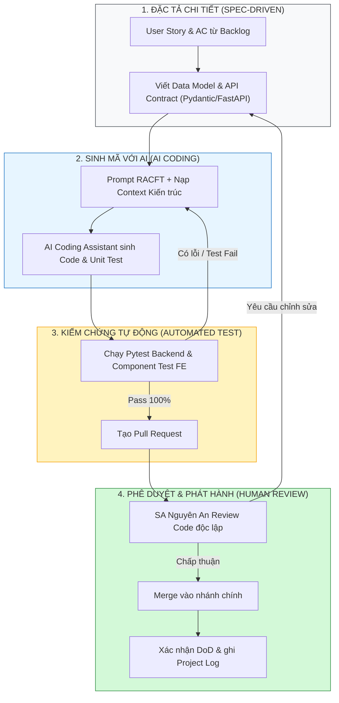
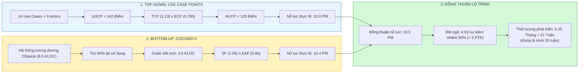

# PHIẾU BÀI LÀM ÔN TẬP — NGƯỜI 4: ƯỚC LƯỢNG, LẬP KẾ HOẠCH & QUY TRÌNH

- **Họ và tên thành viên:** Ân Tiến Nguyên An
- **Mã số sinh viên:** 23127148
- **Vai trò trong dự án:** **Solution Architect (SA) / Backend Developer**
- **Phạm vi phụ trách:** **Câu 9, Câu 10, Câu 11**
- **Hạn chót hoàn thành (Bước 1):** **20:00, Thứ Năm (20/08/2026)**
- **Tài liệu tham chiếu trong dự án (thực hành):**
  - [`docs/02-planning/04-cost-time-resource.md`](../../../docs/02-planning/04-cost-time-resource.md) (Ước lượng UCP & COCOMO II, WBS & Lộ trình 20 tuần)
  - [`docs/03-execution-monitoring/01-sprint-plan.md`](../../../docs/03-execution-monitoring/01-sprint-plan.md) (Kế hoạch Sprint 1 — Phân bổ 17 stories)
  - [`docs/02-planning/03-product-backlog.md`](../../../docs/02-planning/03-product-backlog.md) (Quy trình Kanban Spec-driven, DoD 5 tiêu chí)
  - [`docs/03-execution-monitoring/02-project-log.md`](../../../docs/03-execution-monitoring/02-project-log.md) (Nhật ký thực thi & Đo lường tiến độ)
  - [`docs/01-initiation/05-team-contract.md`](../../../docs/01-initiation/05-team-contract.md) (Phân vai 6 thành viên & Kỷ luật nhóm)
- **Tài liệu lý thuyết tham chiếu (từ bài giảng):**
  - [`materials/04_software_development_life_cycle_model.md`](../../../materials/04_software_development_life_cycle_model.md) (Vòng đời SDLC, Mô hình NASA/SEL, 5 câu hỏi quản lý cốt lõi)
  - [`materials/04_01_software_development_models.md`](../../../materials/04_01_software_development_models.md) (Mô hình Agile Kanban, Scrum, XP)
  - [`materials/05_1_work_breakdown_structure.md`](../../../materials/05_1_work_breakdown_structure.md) (Phân rã WBS, Work Packages, Critical Path)
  - [`materials/05_2_introduction_to_software_estimation.md`](../../../materials/05_2_introduction_to_software_estimation.md) (Cone of Uncertainty, Count-Compute-Judge, Decomposition)
  - [`materials/05_3_agile_estimation.md`](../../../materials/05_3_agile_estimation.md) (Planning Poker, Story Points, Velocity)
  - [`materials/05_4_model_based_estimation.md`](../../../materials/05_4_model_based_estimation.md) (Use Case Points - UCP, COCOMO II Early Design)
  - [`materials/06_software_project_planning.md`](../../../materials/06_software_project_planning.md) (Lập kế hoạch dự án, Gantt, PERT, CPM)
- **Ghi chú bài giảng trên lớp ([`note.md`](../../../note.md)):**
  - **Tự sự thực chiến (Storytelling):** Trình bày như một người quản lý điều hành dự án thực thụ: có bối cảnh bài toán, xung đột nguồn lực, quyết định chỉ huy và số liệu minh chứng thực tế.
- **Con số chứng thực:** 126 AUCP, 10.4 PM COCOMO II, 8.5 KLOC tổng thể (3.5 KLOC tương đương viết mới), 6 gói WBS, WP4 là gói nhạy cảm nhất trên đường găng (Số hóa 6 tuần), Snapshot Tuần 1 (12/26 stories, 440K token AI, ~300K VNĐ).
- **Checklist bản in nộp kèm khi thi:**
  - [ ] Bản in [`06-software-process-definition.md`](../../../docs/02-planning/06-software-process-definition.md) — đã có nhãn **"Câu 9"**.
  - [ ] Bản in [`10-project-estimate.md`](./printouts/10-project-estimate.md) — đã có nhãn **"Câu 10"**.
  - [ ] Bản in [`11-project-plan-wbs.md`](./printouts/11-project-plan-wbs.md) — đã có nhãn **"Câu 11"**.
- **Chiến lược 10 phút viết giấy A4:**
  - *Phút 1–2:* Viết tiêu đề + Khung 4 phần (WHAT - HOW - WHY - EVIDENCE).
  - *Phút 3–7:* Triển khai theo góc nhìn quản lý dự án (Thách thức $\rightarrow$ Quyết định $\rightarrow$ Kết quả số liệu).
  - *Phút 8–9:* Vẽ nhanh sơ đồ Mermaid minh họa (Sơ đồ luồng 4 bước, Sơ đồ đối chuẩn 2 chiều, hoặc Mạng WBS đường găng).
  - *Phút 10:* Rà soát các con số đắt giá và từ khóa kỹ thuật.

---

## CÂU 9: ĐỊNH NGHĨA QUY TRÌNH PHÁT TRIỂN PHẦN MỀM (SOFTWARE PROCESS DEFINITION)

> **Đề bài:** Trình bày quá trình hình thành và phương pháp đánh giá tài liệu Định nghĩa quy trình phát triển phần mềm (Software Process Definition) của nhóm. _(Sinh viên nộp kèm bản in tài liệu Định nghĩa quy trình phát triển phần mềm của nhóm.)_

### 1. Gợi ý định hướng & Từ khóa cốt lõi:
- **Tài liệu đối chiếu:** [`docs/02-planning/03-product-backlog.md`](../../../docs/02-planning/03-product-backlog.md) (Mục 1.1) và [`docs/03-execution-monitoring/01-sprint-plan.md`](../../../docs/03-execution-monitoring/01-sprint-plan.md).
- **Từ khóa:** Mô hình Kanban Spec-driven kết hợp AI Coding, Quy tắc WIP limit = 1, Quy trình 4 bước (Spec $\rightarrow$ Prompt AI $\rightarrow$ Automated Test $\rightarrow$ Human Code Review), DoD 5 tiêu chí.

### 2. Không gian tự biên soạn câu trả lời (Dưới góc nhìn quản lý dự án):

#### A. Dàn ý trình bày trên giấy A4 (WHAT - HOW - WHY - EVIDENCE)

- **WHAT (Là gì? — Góc nhìn quản lý):**
  Khi tham gia thiết kế kiến trúc và quy trình HCMUS-LDMS, tôi cùng nhóm phải trả lời bài toán: Làm sao để 4 kỹ sư kiêm nhiệm 50% thời gian có thể bàn giao hệ thống phức tạp (FastAPI, React, OCR, Pandoc, PostgreSQL FTS) đúng hạn 20 tuần mà vẫn giữ chất lượng mã nguồn? Nhóm thiết lập **Quy trình Phát triển Phần mềm** theo **Agile Kanban định hướng đặc tả (Spec-Driven) kết hợp Trợ lý Lập trình AI (AI Coding Assistant)**, với **WIP limit = 1 card/kỹ sư** và 5 tiêu chí **Definition of Done (DoD)**.

- **HOW (Cách tôi thiết lập và vận hành quy trình 4 bước khép kín):**
  1. **Bước 1: Viết Đặc tả chuẩn trước khi code (Spec-Driven):** Tôi yêu cầu kỹ sư không được nhảy vào code ngay mà phải viết rõ User Story, Acceptance Criteria (AC) dạng Gherkin, Schema CSDL và API Contract (Pydantic models).
  2. **Bước 2: Kỹ thuật Prompt AI có kiểm soát (Context Engineering):** Kỹ sư dùng khung prompt RACFT (Role-Ask-Context-Format-Tone), nạp toàn bộ file Spec và architectural rules vào Trợ lý AI (Antigravity / Claude) để sinh khung mã nguồn và Unit Test ban đầu.
  3. **Bước 3: Lưới kiểm thử tự động (Automated Verification):** Chạy ngay bộ test tự động (`pytest src/backend/tests/`) và type-check. Nếu test fail, lặp lại việc tinh chỉnh prompt cho AI sửa cho đến khi pass 100%.
  4. **Bước 4: Con người chốt chặn Review & Merge (Human-in-the-loop):** SA review Pull Request và Acceptance Criteria. Khi review được chấp thuận, mã nguồn được merge; sau đó nhóm xác nhận đủ 5 tiêu chí DoD trong Backlog và ghi effort vào Project Log.

- **WHY (Tại sao nhóm chọn quy trình này?):**
  - **Triệt tiêu "Ảo giác AI" & Nợ kỹ thuật:** Nếu để kỹ sư tự do dùng AI, code sinh ra sẽ chắp vá và khó bảo trì. Quy trình Spec-Driven + Automated Test là "chiếc đai an toàn" ép AI phải tuân thủ đúng kiến trúc Modular Monolith.
  - **Hạn chế điểm nghẽn Review nhờ `WIP limit = 1`:** Khi mỗi người chỉ làm một việc tại một thời điểm, nhóm dễ phát hiện card bị chờ review và giảm chi phí chuyển đổi ngữ cảnh.
  - **Tuân thủ bài học quản lý NASA/SEL:** Một quy trình được định nghĩa rõ ràng (Well-defined process) giúp đội ngũ duy trì cách làm nhất quán và giảm nhu cầu báo cáo thủ công rườm rà.

- **EVIDENCE (Minh chứng số liệu thực tế trong dự án HCMUS-LDMS):**
  - Product Backlog quy định Kanban và DoR tại §1.1, DoD 5 tiêu chí tại §1.2; luồng bốn bước được tổng hợp trong [`06-software-process-definition.md`](../../../docs/02-planning/06-software-process-definition.md).
  - Bản phân bổ chi tiết 17 stories Sprint 1 tại [`docs/03-execution-monitoring/01-sprint-plan.md`](../../../docs/03-execution-monitoring/01-sprint-plan.md) (mỗi kỹ sư tự làm cả BE FastAPI lẫn FE React cho story của mình).
  - Snapshot Tuần 1 tại [`docs/02-planning/04-cost-time-resource.md`](../../../docs/02-planning/04-cost-time-resource.md): nhóm hoàn thành **12/26 stories** (46% backlog), sử dụng **440K token AI** với chi phí ước tính **~300K VNĐ**. Tổng tích lũy mới hơn trong Project Log phải được trình bày tách biệt với snapshot này.

#### B. Sơ đồ Quy trình Spec-Driven kết hợp AI Coding Assistant

#### C. Trả lời chi tiết 100% Bộ câu hỏi thường gặp của Giảng viên

1. **Các câu hỏi chính cần trả lời trong tài liệu Định nghĩa quy trình phát triển phần mềm là gì?**
   - _Trả lời (Góc nhìn quản lý):_ Theo bài học quản lý NASA/SEL, tài liệu quy trình của nhóm trả lời 5 câu hỏi:
     1. *Làm bước nào tiếp theo?* Luồng chuyển trạng thái card trên Kanban: `To-Do` $\rightarrow$ `In Progress` $\rightarrow$ `Review` $\rightarrow$ `Done`.
     2. *Mất bao lâu?* Định mức kích thước trong Backlog: Story Size S $\le 1$ ngày, Story Size M $\le 2$ ngày.
     3. *Thực hiện như thế nào?* Thực thi kỹ thuật Spec-Driven, Prompt RACFT và Pytest verification.
     4. *Tạo ra hiện vật gì?* Schema DB, Mã nguồn FastAPI/React, File Test, Dockerfile, API Docs Swagger.
     5. *Ai làm?* Ma trận phân công trách nhiệm rõ ràng cho 6 thành viên trong nhóm.

2. **Mô hình cơ sở được lựa chọn để hiệu chỉnh là gì?**
   - _Trả lời:_ Nhóm chọn **Agile Kanban** làm nền tảng vì tính linh hoạt theo dòng chảy (Flow-based), bổ sung **Spec-Driven Development** ở đầu vào và **AI Coding Assistant** ở khâu thực thi. Sau mỗi phiên, thành viên **ghi Session Log thủ công** vào `02-project-log.md` để nhóm tổng hợp effort và token.

3. **Thời gian dự kiến của từng giai đoạn là bao lâu?**
   - _Trả lời:_ Nhóm đã lập kế hoạch tổng thể **20 tuần** chia làm 4 giai đoạn ([`04-cost-time-resource.md`](../../../docs/02-planning/04-cost-time-resource.md) §1.1):
     - *Giai đoạn 0 (Tuần 1–2):* Khảo sát thực tế thư viện, đánh giá bản quyền và thiết lập hạ tầng ảo hóa.
     - *Giai đoạn 1 (Tuần 3–12):* Xây dựng MVP cốt lõi (Auth, Upload, OCR, Pandoc, Reader, Search) và số hóa thí điểm 500 sách CNTT.
     - *Giai đoạn 2 (Tuần 13–18):* Chuyển giao quy trình cho Thủ thư và 15 CTV số hóa diện rộng 2.000 giáo trình.
     - *Giai đoạn 3 (Tuần 19–20):* Kiểm thử UAT, Pentest bảo mật, đào tạo cán bộ và Go-Live toàn trường.

4. **Các vai trò nào từng thành viên trong nhóm sẽ đảm nhiệm?**
   - _Trả lời:_ Theo Hợp đồng nhóm ([`05-team-contract.md`](../../../docs/01-initiation/05-team-contract.md) §3.1), vai trò được phân công như sau:
     - **Mạch Quốc Tấn (`23127115`):** Project Manager.
     - **Ân Tiến Nguyên An (`23127148`):** Solution Architect / Backend Developer.
     - **Nguyễn Tuấn Anh (`23127152`):** Backend Developer / DevOps / System Admin.
     - **Ngô Nguyễn Thế Khoa (`23127065`):** Frontend Developer.
     - **Nguyễn Lê Hồ Anh Khoa (`23127211`):** Frontend Developer.
     - **Nguyễn Quang Thái (`23127116`):** DevOps / System Admin / QA / Tester.

5. **Các sản phẩm nào dự kiến sẽ khởi tạo?**
   - _Trả lời:_ (1) Bộ hồ sơ quản lý dự án 3 giai đoạn; (2) Hệ thống mã nguồn Backend FastAPI Modular Monolith và Frontend React Portal; (3) Hạ tầng container hóa `docker-compose.yml` và pipeline CI/CD; (4) Kho dữ liệu 500 sách điện tử chuẩn EPUB thí điểm và 2.000 sách số hóa diện rộng.

6. **Quy trình để đưa ra một bản phân phối hoạt động là gì?**
   - _Trả lời:_ Kỹ sư triển khai theo Acceptance Criteria $\rightarrow$ chạy local và tự kiểm tra $\rightarrow$ mở Pull Request $\rightarrow$ GitHub Actions kiểm tra lint, build và test $\rightarrow$ review theo DoD $\rightarrow$ merge vào nhánh chính. Repo hiện có CI; triển khai Production là bước vận hành riêng, chưa có workflow CD tự động trong repo.

7. **Ưu và khuyết điểm của mô hình nhóm lựa chọn là gì?**
   - _Trả lời (Đánh giá khách quan):_
     - *Ưu điểm:* AI hỗ trợ tăng tốc các bước phù hợp; WIP=1 giúp lộ điểm nghẽn review; kiểm tra tự động và review của con người tạo hai lớp kiểm soát chất lượng.
     - *Khuyết điểm:* Rất nhạy cảm với chất lượng Spec ban đầu (Spec sai thì AI code sai); đòi hỏi kỹ sư phải có tính kỷ luật cao, không được bỏ qua bước viết test.

8. **Tài liệu Định nghĩa quy trình phát triển phần mềm của nhóm đã được đánh giá thế nào?**
   - _Trả lời:_ Nhóm đánh giá quy trình qua ba nguồn: (1) đối chiếu nội bộ với Backlog và Team Contract; (2) đo Throughput, Cycle Time và token từ Project Log; (3) cập nhật khi AC, tech stack hoặc luồng làm việc thay đổi.

9. **Tại sao cần tạo tài liệu Định nghĩa quy trình phát triển phần mềm?**
   - _Trả lời:_ Để tạo sự minh bạch và thống nhất cách làm trong đội ngũ. Nếu không có quy trình rõ ràng, mã do nhiều người và công cụ AI hỗ trợ dễ thiếu nhất quán, khó review và khó tích hợp. Quy trình là bộ khung bảo vệ kỷ luật và chất lượng dự án.

10. **Tài liệu Định nghĩa quy trình phát triển phần mềm của nhóm đã được sử dụng và cập nhật trong quá trình thực hiện dự án như thế nào?**
    - _Trả lời:_ Tài liệu độc lập được tổng hợp ngày 20/08/2026 từ các quy tắc đã áp dụng trong Backlog, Team Contract và Sprint Plan. Trong Sprint 1, nhóm đã dùng WIP, DoR/DoD và Session Logging; sau đó các thực hành này được hợp nhất thành tài liệu quy trình để dễ đánh giá và in nộp.

---

## CÂU 10: ƯỚC LƯỢNG DỰ ÁN (PROJECT ESTIMATE)

> **Đề bài:** Trình bày quá trình hình thành và phương pháp đánh giá tài liệu Ước lượng dự án (Project Estimate) của nhóm. _(Sinh viên nộp kèm bản in tài liệu Ước lượng dự án của nhóm.)_

### 1. Gợi ý định hướng & Từ khóa cốt lõi:
- **Tài liệu đối chiếu:** [`docs/02-planning/04-cost-time-resource.md`](../../../docs/02-planning/04-cost-time-resource.md) (Mã HCMUS-LDMS-CTR).
- **Từ khóa:** Đối chuẩn 2 chiều: Top-Down UCP (UAW=12, UUCW=130 $\rightarrow$ AUCP=126 UCP $\rightarrow$ 10.0 PM sau điều chỉnh tái sử dụng) vs Bottom-Up COCOMO II (3.5 KLOC tương đương viết mới $\rightarrow$ 10.4 PM), chọn baseline 10.5 PM cho 4 dev kiêm nhiệm (2 FTE), Cone of Uncertainty, Quy tắc Count-Compute-Judge.

### 2. Không gian tự biên soạn câu trả lời (Dưới góc nhìn lập kế hoạch):

#### A. Dàn ý trình bày trên giấy A4 (WHAT - HOW - WHY - EVIDENCE)

- **WHAT (Là gì? — Góc nhìn lập kế hoạch):**
  Ước lượng dự án (Project Estimation) giúp nhóm chuyển một **mục tiêu mong muốn** thành một **cam kết có căn cứ**. Nhóm áp dụng **Đối chuẩn Ước lượng Hai Chiều (Two-Way Calibration)**: **Top-Down Use Case Points (UCP)** và **Bottom-Up COCOMO II**, theo nguyên tắc *Đếm — Tính toán — Đánh giá (Count-Compute-Judge)*.

- **HOW (Chi tiết cách tôi tính toán và đối chuẩn 2 mô hình):**
  1. **Mô hình 1: Top-Down Use Case Points (UCP):**
     - *Đếm Tác nhân (UAW):* 3 Actor hệ thống đơn giản (Keycloak, MinIO, PostgreSQL FTS $\times 1$) + 3 Actor người dùng phức tạp (Độc giả, Thủ thư, Admin $\times 3$) $\rightarrow \mathbf{UAW = 12}$.
     - *Đếm Use Case (UUCW):* 6 Simple ($\times 5$) + 4 Average ($\times 10$) + 4 Complex ($\times 15$) $\rightarrow \mathbf{UUCW = 130}$.
     - *Điểm thô:* $\text{UUCP} = 12 + 130 = \mathbf{142\text{ điểm}}$.
     - *Hệ số phức tạp:* $\text{TCF} = 0.6 + (0.01 \times 53) = \mathbf{1.13}$; $\text{ECF} = 1.4 + (-0.03 \times 20.5) = \mathbf{0.785}$.
     - *Điểm điều chỉnh:* $\mathbf{AUCP = 142 \times 1.13 \times 0.785 \approx 126\text{ UCP}}$.
     - *Nỗ lực UCP:* $126 \times 20\text{ giờ/UCP} = 2.520\text{ giờ} \approx 15.75\text{ PM}$. Giảm 40% nhờ tái sử dụng cho kết quả 9.45 PM; nhóm làm tròn bảo thủ lên $\mathbf{10.0\text{ PM}}$ theo baseline trong tài liệu dự án.
  2. **Mô hình 2: Bottom-Up COCOMO II (Early Design):**
     - Tổng quy mô hệ thống: $8.5\text{ KLOC}$; Tái sử dụng $60\%$ qua thư viện mã nguồn mở $\rightarrow$ Quy mô code viết mới thực tế: $\mathbf{3.5\text{ KLOC}}$.
     - Hệ số quy mô $B = 1.05$; Hệ số nỗ lực $\text{EAF} = 0.95$.
     - *Nỗ lực COCOMO II:* $\mathbf{Effort = 2.94 \times 0.95 \times (3.5)^{1.05} \approx 10.4\text{ PM}}$.
  3. **Kết luận và quy đổi lộ trình:**
     - Hai mô hình độc lập hội tụ kỳ diệu ở mức $\mathbf{\approx 10.5\text{ PM}}$.
     - Với đội ngũ 4 kỹ sư làm việc kiêm nhiệm 50% thời gian ($= 2\text{ FTE}$):
       $$\text{Thời gian phát triển} = \frac{10.5\text{ PM}}{2\text{ FTE}} = 5.25\text{ tháng} \approx \mathbf{21\text{ tuần}}$$
       *Con số này gần khớp với lộ trình 20 tuần và cho thấy kế hoạch đang ở cùng bậc quy mô; chênh lệch một tuần cần được theo dõi khi thực thi.*

- **WHY (Tại sao tôi bắt buộc phải làm đối chuẩn 2 chiều?):**
  - **Triệt tiêu "Căn bệnh lạc quan" (Best-Case Estimation Syndrome):** Kỹ sư thường ước tính trong điều kiện lý tưởng không bug, không trễ mạng; việc đối chuẩn 2 mô hình độc lập giúp tôi có góc nhìn đa chiều khách quan.
  - **Thu hẹp Hình nón bất định (Cone of Uncertainty):** Ở giai đoạn đầu, sai số có thể lên đến $400\%$ ($4\times$). Nhờ việc đếm chi tiết Use Case và phân tích dòng code, tôi đã ép độ sai lệch xuống dưới $20\%$.
  - **Bảo vệ ngân sách đầu tư:** Là căn cứ thuyết phục nhất để bảo vệ dự toán **CapEx 75–95 triệu VNĐ** và **OpEx 15–30 triệu VNĐ/năm** trước Ban Giám hiệu.

- **EVIDENCE (Minh chứng số liệu cụ thể trong dự án):**
  - Bảng tính chi tiết UCP và COCOMO II tại [`docs/02-planning/04-cost-time-resource.md`](../../../docs/02-planning/04-cost-time-resource.md) (§2).
  - Phân bổ ngân sách tiền công kỹ sư (5.5M/người) trong SoW [`docs/02-planning/05-statement-of-work.md`](../../../docs/02-planning/05-statement-of-work.md) (§8).

#### B. Sơ đồ Đối chuẩn Ước lượng Hai Chiều

#### C. Trả lời chi tiết 100% Bộ câu hỏi thường gặp của Giảng viên

1. **Các câu hỏi chính cần trả lời trong tài liệu Ước lượng dự án là gì?**
   - _Trả lời (Góc nhìn lập kế hoạch):_ Tài liệu phải trả lời 4 câu hỏi cho nhà đầu tư: (1) Kích thước phần mềm là bao nhiêu? (126 AUCP / 3.5 KLOC tương đương viết mới); (2) Tốn bao nhiêu công sức? (10.5 Person-Months); (3) Mất bao lâu để bàn giao? (20–21 tuần với 2 FTE); (4) Ngân sách cần cấp là bao nhiêu? (CapEx: 75–95 triệu VNĐ).

2. **Các đầu vào cần thiết và các bước nhóm đã thực hiện để tạo tài liệu Ước lượng dự án là gì?**
   - _Trả lời:_
     - *Đầu vào:* Danh mục Use Case từ Backlog, bảng phân tích Actor, yêu cầu phi chức năng kỹ thuật, đánh giá kỹ năng đội ngũ và dữ liệu đối chuẩn từ hệ thống nguồn mở DSpace.
     - *Các bước tôi chỉ đạo nhóm thực hiện:* (1) Phân loại và tính điểm UAW, UUCW $\rightarrow$ UUCP; (2) Chấm điểm 13 tiêu chí TCF và 8 tiêu chí ECF; (3) Tính AUCP và quy đổi ra PM; (4) Ước tính KLOC viết mới và tính COCOMO II; (5) Đối chiếu 2 kết quả và lập kế hoạch nhân sự.

3. **Tài liệu Ước lượng dự án của nhóm đã được đánh giá thế nào?**
   - _Trả lời:_ Được đánh giá bằng phương pháp **Đối chuẩn Độc lập Hai Chiều (Cross-model calibration)**. Sự chênh lệch giữa UCP (10.0 PM) và COCOMO II (10.4 PM) khoảng $3.8\%$, cho thấy hai cách tính hội tụ gần nhau. Tài liệu hiện ở trạng thái **Under Review** bởi Trưởng phòng CNTT và Giám đốc Thư viện; chưa có bằng chứng phê duyệt chính thức.

4. **Tại sao cần tạo tài liệu Ước lượng dự án?**
   - _Trả lời:_ Để chuyển từ mong muốn chủ quan sang kế hoạch khả thi; bảo vệ cam kết bàn giao với khách hàng; và làm căn cứ xin cấp phát ngân sách CapEx/OpEx.

5. **Tài liệu Ước lượng dự án của nhóm đã được sử dụng trong quá trình thực hiện dự án như thế nào?**
   - _Trả lời:_ Tôi dùng tài liệu này để định mức khối lượng công việc cho từng Sprint; theo dõi vận tốc hoàn thành (Throughput) thực tế để kịp thời phát hiện nguy cơ trôi tiến độ; và kiểm soát không cho chi phí token AI vượt trần ngân sách.

6. **Giải thích các phương pháp phân rã một tính năng lớn thành các tính năng nhỏ:**
   - _Trả lời:_ Tôi hướng dẫn nhóm 4 kỹ thuật phân rã: (1) *Theo quy trình nghiệp vụ* (Upload $\rightarrow$ OCR $\rightarrow$ Biên tập $\rightarrow$ Xuất bản); (2) *Theo lớp kiến trúc* (DB $\rightarrow$ API Backend $\rightarrow$ UI Frontend); (3) *Theo thao tác* (CRUD cơ bản tách khỏi xử lý nâng cao); (4) *Theo độ ưu tiên MoSCoW* (Must-have làm trước, Should-have làm sau).

7. **Khi không có khả năng phân rã được các tính năng lớn của dự án, nhóm phải làm thế nào?**
   - _Trả lời:_ Tôi áp dụng 3 giải pháp quản lý: (1) **Tạo Spike PoC:** Cho 1 kỹ sư làm thử nghiệm nhanh trong khung thời gian 1–2 ngày; (2) **Ước lượng theo tương tự (Analogy):** So sánh với module tương đương của DSpace/Calibre; (3) **Ước lượng theo dải giá trị (Range Estimation):** Dùng khoảng biến thiên an toàn với hệ số dự phòng rủi ro cao.

8. **Ước lượng có thể sai lệch khoảng bao nhiêu lần ở giai đoạn đầu dự án (Giải thích Cone of Uncertainty)?**
   - _Trả lời:_ Theo lý thuyết Hình nón bất định, ở giai đoạn Khởi tạo sơ khai, ước lượng có thể sai lệch từ **0.25x đến 4.0x (sai lệch tới 400%)**. Khi chốt xong yêu cầu và kiến trúc, độ sai lệch giảm còn $0.8x - 1.25x$ (20–25%). Hình nón không tự thu hẹp mà chỉ thu hẹp khi PM đưa ra các quyết định kỹ thuật cụ thể.

9. **Tại sao cần ước lượng ở giai đoạn đầu của dự án?**
   - _Trả lời:_ Bắt buộc phải ước lượng sớm để đánh giá tính khả thi kinh tế (TELOS), quyết định có nên rót vốn đầu tư dự án hay không (Go/No-Go Decision) và xác định khung phạm vi MVP ban đầu.

10. **Ước lượng kích cỡ (Size) mang lại lợi ích gì cho dự án khi mối quan tâm chính của ban quản lý là khoảng thời gian (Duration) và chi phí (Cost)?**
    - _Trả lời:_ Kích cỡ (Size) là **thước đo khách quan, bất biến** của khối lượng phần mềm. Thời gian và Chi phí không tự sinh ra mà phụ thuộc vào Size: $\text{Effort} = \text{Size} / \text{Productivity}$, từ đó tính ra $\text{Duration} = \text{Effort} / \text{Headcount}$ và $\text{Cost} = \text{Effort} \times \text{Labor Rate}$. Không thể quản lý được Thời gian và Chi phí nếu không đo lường được Kích cỡ.

11. **Giải thích quy tắc "Đếm, Tính toán và Đánh giá" (Count, Compute, Judge) khi thực hiện ước lượng dự án:**
    - _Trả lời:_ (1) *Đếm (Count):* Đếm những gì cụ thể sớm nhất (14 Use Cases, 6 Actors, 8.5 KLOC); (2) *Tính toán (Compute):* Dùng công thức toán học mô hình chuẩn (UCP, COCOMO II); (3) *Đánh giá (Judge):* Chỉ dùng phán đoán chuyên gia có cấu trúc ở bước cuối cùng để tinh chỉnh hệ số phức tạp, loại bỏ hoàn toàn đoán mò cảm tính.

12. **Giải thích các kỹ thuật để tăng độ chính xác khi thực hiện việc ước lượng bằng đánh giá chủ quan:**
    - _Trả lời:_ Cho chính lập trình viên trực tiếp làm task tham gia ước lượng; chia nhỏ nhiệm vụ $\le 2$ ngày; áp dụng công thức 3 điểm PERT: $\text{Expected} = (O + 4M + P)/6$; và dựa vào Luật Số Lớn từ 5–10 hạng mục để triệt tiêu sai số.

13. **Giải thích các kỹ thuật để tăng độ chính xác khi ước lượng bằng phương pháp "Phân rã và Kết hợp" ("Decomposition and Recomposition"):**
    - _Trả lời:_ Phân rã WBS xuống cấp nhiệm vụ nhỏ $\le 2$ ngày $\rightarrow$ Tính toán độc lập từng phần tử $\rightarrow$ Cộng dồn (Recomposition) $\rightarrow$ Thêm 15% Buffer dự phòng cho công việc tích hợp và rủi ro phát sinh.

14. **Giải thích kỹ thuật ước lượng bằng các lá bài (Planning Poker) trong Agile:**
    - _Trả lời:_ Nhóm tôi dùng Planning Poker với dãy Fibonacci (1, 2, 3, 5, 8, 13...). Các thành viên lật bài cùng lúc để tránh bị ảnh hưởng tâm lý mỏ neo. Người chấm điểm cao nhất và thấp nhất giải thích quan điểm, nhóm thảo luận và bỏ phiếu lại đến khi đạt đồng thuận.

---

## CÂU 11: KẾ HOẠCH DỰ ÁN (PROJECT PLAN)

> **Đề bài:** Trình bày quá trình hình thành và phương pháp đánh giá tài liệu Kế hoạch dự án (Project Plan) của nhóm. _(Sinh viên nộp kèm bản in tài liệu Kế hoạch dự án và WBS của nhóm.)_

### 1. Gợi ý định hướng & Từ khóa cốt lõi:
- **Tài liệu đối chiếu:** [`docs/02-planning/04-cost-time-resource.md`](../../../docs/02-planning/04-cost-time-resource.md) (Mục 1.2: WBS) và [`docs/03-execution-monitoring/01-sprint-plan.md`](../../../docs/03-execution-monitoring/01-sprint-plan.md).
- **Từ khóa:** Phân rã 6 gói công việc WBS (WP1 đến WP6), Nhận diện Đường găng Critical Path (WP4: Số hóa tài liệu 6 tuần), Mốc bàn giao Milestones, Quản lý rủi ro đường găng.

### 2. Không gian tự biên soạn câu trả lời (Dưới góc nhìn lập kế hoạch):

#### A. Dàn ý trình bày trên giấy A4 (WHAT - HOW - WHY - EVIDENCE)

- **WHAT (Là gì? — Góc nhìn lập kế hoạch):**
  Kế hoạch Dự án (Project Plan) là bản đồ điều phối nguồn lực, tiến độ và rủi ro của HCMUS-LDMS. Nhóm phân rã dự án thành **6 Gói công việc WBS (WP1 $\rightarrow$ WP6)**; tài liệu nguồn xác định **WP4 — Số hóa tài liệu, kéo dài 6 tuần** là gói công việc găng và nhạy cảm nhất.

- **HOW (Cách tôi phân rã WBS và chỉ huy kiểm soát Đường găng):**
  1. **Phân rã 6 gói công việc WBS logic:**
     - `WP1:` Khảo sát & Bản quyền (Tuần 1–3) — Thu thập mẫu sách, quy chế số hóa.
     - `WP2:` Cơ sở dữ liệu & Backend (Tuần 4–7) — Dựng PostgreSQL, MinIO, API FastAPI.
     - `WP3:` Giao diện & Trình đọc (Tuần 8–11) — React UI, Trình đọc Epub.js, Tích hợp FTS.
     - `WP4:` Số hóa tài liệu (Tuần 12–17) — **ĐƯỜNG GĂNG (CRITICAL PATH)**: Quét sách scan, OCR, soát sửa lỗi, đóng gói EPUB.
     - `WP5:` Kiểm thử & UAT (Tuần 18–19) — Pentest, nghiệm thu thực tế với thủ thư và sinh viên mẫu.
     - `WP6:` Triển khai & Vận hành (Tuần 20) — Cài đặt Docker Compose Production, đào tạo, Go-live.
  2. **Phân tích gói công việc găng:**
     - Kế hoạch xếp WP1 đến WP6 theo thứ tự tuần 1–20 và đánh dấu WP4 là gói công việc găng. Tài liệu chưa có bảng tính earliest/latest time và slack để chứng minh một phép tính CPM đầy đủ.
     - **Tại sao WP4 nhạy cảm nhất?** Khâu scan sách giấy và soát lỗi OCR là công việc thủ công, phụ thuộc lớn vào năng suất con người. Trễ WP4 sẽ kéo lùi WP5, WP6 và ngày go-live.

- **WHY (Tại sao nhóm phải tập trung kiểm soát gói công việc găng?):**
  - **Bảo vệ ngày Go-Live:** Nhận diện gói việc nhạy cảm giúp nhóm biết nơi cần ưu tiên theo dõi nguồn lực.
  - **Điều phối nhịp nhàng đa lực lượng:** Đồng bộ hoạt động giữa 4 kỹ sư CNTT, 2 cán bộ thủ thư vận hành máy scan chữ V và 15 sinh viên CTV biên tập dữ liệu.
  - **Quản trị rủi ro chủ động:** Nếu tiến độ quét sách bị chậm, nhóm có thể đề xuất tăng cường CTV như một phương án rút ngắn WP4; đây là phương án dự kiến, chưa phải sự kiện đã thực hiện.

- **EVIDENCE (Minh chứng số liệu thực tế trong dự án):**
   - Cấu trúc WBS và việc đánh dấu WP4 là gói công việc găng tại [`docs/02-planning/04-cost-time-resource.md`](../../../docs/02-planning/04-cost-time-resource.md) (§1.2).
  - Bản kế hoạch Sprint 1 phân rã 17 stories theo 2 mốc Milestone cụ thể tại [`docs/03-execution-monitoring/01-sprint-plan.md`](../../../docs/03-execution-monitoring/01-sprint-plan.md).

#### B. Sơ đồ Tiến độ WBS và Gói công việc găng

```mermaid
flowchart LR
    WP1["WP1: Khảo sát & Bản quyền\n(Tuần 1-3)"] --> WP2["WP2: CSDL & Backend\n(Tuần 4-7)"]
    WP2 --> WP3["WP3: Giao diện & Trình đọc\n(Tuần 8-11)"]
    WP3 -->|GÓI CÔNG VIỆC GĂNG| WP4["WP4: Số hóa tài liệu [CRITICAL]\n(Tuần 12-17 · 6 Tuần)"]
    WP4 --> WP5["WP5: Kiểm thử & UAT\n(Tuần 18-19)"]
    WP5 --> WP6["WP6: Triển khai & Go-Live\n(Tuần 20)"]

    style WP1 fill:#f8f9fa,stroke:#495057
    style WP2 fill:#e7f5ff,stroke:#1971c2
    style WP3 fill:#e7f5ff,stroke:#1971c2
    style WP4 fill:#ffe3e3,stroke:#e03131,stroke-width:3px
    style WP5 fill:#fff3bf,stroke:#f59f00
    style WP6 fill:#d3f9d8,stroke:#2b8a3e
```

#### C. Trả lời chi tiết 100% Bộ câu hỏi thường gặp của Giảng viên

1. **Các câu hỏi chính cần trả lời trong tài liệu Kế hoạch dự án là gì?**
   - _Trả lời (Góc nhìn lập kế hoạch):_ Tài liệu Kế hoạch Dự án trả lời 5 câu hỏi: (1) Cần làm những gói việc gì? (6 gói WBS); (2) Trình tự dự kiến ra sao và gói nào nhạy cảm nhất? (WP4); (3) Ai làm việc gì? (Ma trận RACI 6 thành viên); (4) Khi nào hoàn thành các mốc quan trọng? (Milestones tuần 2, 12, 18, 20); (5) Cần bao nhiêu chi phí và máy móc? (CapEx 75–95M VNĐ, 2 máy scan V-shape, 3 máy chủ ảo hóa).

2. **Các đầu vào cần thiết và các bước nhóm đã thực hiện để tạo tài liệu Kế hoạch dự án là gì?**
   - _Trả lời:_
     - *Đầu vào:* Project Charter, Statement of Work (SoW), Product Backlog, Báo cáo ước lượng UCP/COCOMO II.
     - *Các bước thực hiện:* (1) Phân rã công việc WBS thành 6 Work Packages; (2) Sắp xếp thứ tự và thời lượng dự kiến; (3) Đánh dấu WP4 là gói nhạy cảm nhất theo kế hoạch nguồn; (4) Phân bổ nguồn lực nhân sự và thiết bị; (5) Thiết lập các cổng kiểm soát (Gating checkpoints).

3. **Tài liệu Kế hoạch dự án của nhóm đã được đánh giá thế nào?**
   - _Trả lời:_ Kế hoạch được đánh giá bằng cách đối chiếu lộ trình bốn giai đoạn, WBS, Sprint Plan và nguồn lực để kiểm tra tính khả thi của 20 tuần. Tài liệu nguồn đánh dấu WP4 là gói công việc găng nhưng chưa có đủ earliest/latest time và slack để gọi là một phép tính CPM hoàn chỉnh. Tài liệu tổng thể hiện ở trạng thái **Under Review**.

4. **Tại sao cần tạo tài liệu Kế hoạch dự án?**
   - _Trả lời:_ Để tạo sự thống nhất hành động cho toàn bộ đội ngũ kỹ sư và cán bộ thư viện; tập trung nguồn lực kiểm soát đường găng; phát hiện sớm nguy cơ trễ hạn; và làm căn cứ pháp lý để nghiệm thu giải ngân theo từng giai đoạn.

5. **Tài liệu Kế hoạch dự án của nhóm đã được sử dụng và cập nhật trong quá trình thực hiện dự án như thế nào?**
   - _Trả lời:_ Nhóm dùng bản kế hoạch làm baseline và chi tiết hóa ngắn hạn qua Sprint Plan (`01-sprint-plan.md`), đồng thời theo dõi Throughput và Cycle Time. Nếu WP4 chậm trong giai đoạn số hóa, tăng số lượng CTV là phương án điều chỉnh được đề xuất; Project Log hiện chưa ghi nhận việc này đã xảy ra.

6. **Một số mô hình cho phép không xác định rõ các kết quả cuối cùng của dự án, vậy có cần tạo tài liệu Kế hoạch dự án trong các trường hợp này hay không?**
   - _Trả lời:_ **Vẫn cần tạo.** Trong mô hình Agile, Kế hoạch dự án không cố định danh sách tính năng chi tiết mà xác định: **Kế hoạch phát hành (Release Plan), Nhịp độ Sprint (Cadence), Hạn mức ngân sách (Budget Cap)** và các mốc kiểm soát tiến độ.

7. **Tài liệu Kế hoạch dự án khác gì với tài liệu Định nghĩa quy trình phát triển phần mềm?**
   - _Trả lời (Phân biệt dứt khoát):_
     - **Tài liệu Định nghĩa Quy trình (Process Definition):** Trả lời câu hỏi **LÀM NHƯ THẾ NÀO (HOW)** — Quy định các bước, tiêu chuẩn kỹ thuật, vai trò, công cụ và quy tắc lặp lại (như quy trình Spec-driven 4 bước, DoD). Có tính tái sử dụng cho nhiều dự án.
     - **Tài liệu Kế hoạch Dự án (Project Plan):** Trả lời câu hỏi **LÀM CÁI GÌ, KHI NÀO, BỞI AI VÀ TỐN BAO NHIÊU (WHAT, WHEN, WHO, COST)** — Xác định các công việc cụ thể (WBS), lịch trình 20 tuần, nhân sự cụ thể được gán và ngân sách chi tiết cho riêng dự án HCMUS-LDMS này.
