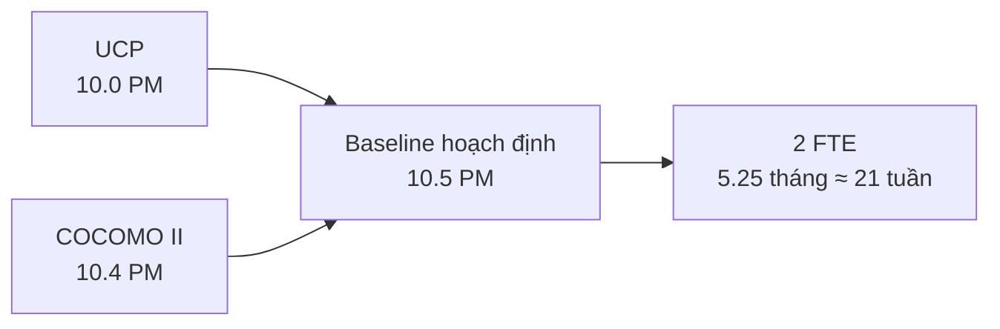

<strong>[CÂU 10]</strong>

# BẢN IN ƯỚC LƯỢNG DỰ ÁN — UCP VÀ COCOMO II

- **Dự án:** HCMUS-LDMS
- **Người phụ trách:** Ân Tiến Nguyên An
- **Tài liệu nguồn:** [`04-cost-time-resource.md`](../../../../docs/02-planning/04-cost-time-resource.md) — trạng thái `Under Review`

## Mục lục

- [1. Kết quả hoạch định](#1-kết-quả-hoạch-định)
- [2. Ước lượng Use Case Points](#2-ước-lượng-use-case-points)
- [3. Đối chuẩn COCOMO II](#3-đối-chuẩn-cocomo-ii)
- [4. Đối chiếu và quyết định](#4-đối-chiếu-và-quyết-định)

---

## 1. Kết quả hoạch định

> **UCP 10.0 PM → COCOMO II 10.4 PM → Chọn baseline 10.5 PM**

Với bốn kỹ sư làm việc 50% thời gian, năng lực tương đương **2 FTE**:

> **10.5 PM / 2 FTE = 5.25 tháng ≈ 21 tuần**

Baseline này được dùng để kiểm tra tính khả thi của lộ trình dự án 20 tuần.

## 2. Ước lượng Use Case Points

### 2.1. Trọng lượng tác nhân

| Nhóm tác nhân | Số lượng | Trọng số | Điểm |
| :--- | ---: | ---: | ---: |
| Hệ thống/API đơn giản | 3 | 1 | 3 |
| Người dùng qua giao diện | 3 | 3 | 9 |
| **UAW** |  |  | **12** |

### 2.2. Trọng lượng Use Case

| Loại Use Case | Số lượng | Trọng số | Điểm |
| :--- | ---: | ---: | ---: |
| Simple | 6 | 5 | 30 |
| Average | 4 | 10 | 40 |
| Complex | 4 | 15 | 60 |
| **UUCW** |  |  | **130** |

### 2.3. Công thức

| Đại lượng | Phép tính | Kết quả |
| :--- | :--- | ---: |
| UUCP | `UAW + UUCW = 12 + 130` | 142 |
| TCF | `0.6 + 0.01 × 53` | 1.13 |
| ECF | `1.4 − 0.03 × 20.5` | 0.785 |
| AUCP | `142 × 1.13 × 0.785` | ≈ 126 UCP |
| Nỗ lực thô | `126 × 20 giờ/UCP` | 2.520 giờ |
| Quy đổi | `2.520 / 160 giờ/tháng` | 15.75 PM |
| Sau giảm 40% nhờ tái sử dụng | `15.75 × 60%` | 9.45 PM |
| Baseline UCP bảo thủ | Làm tròn lên theo tài liệu dự án | **10.0 PM** |

## 3. Đối chuẩn COCOMO II

| Đầu vào | Giá trị |
| :--- | ---: |
| Quy mô tổng thể trước điều chỉnh tái sử dụng | 8.5 KLOC |
| Hệ số quy mô `B` | 1.05 |
| Hệ số nhân nỗ lực `EAF` | 0.95 |
| Nỗ lực trên quy mô tổng thể | ≈ 26.3 PM |
| Mã tương đương viết mới sau điều chỉnh tái sử dụng | 3.5 KLOC |
| Nỗ lực phần viết mới | **≈ 10.4 PM** |

Công thức đối chuẩn phần viết mới:

> `Effort = 2.94 × 0.95 × 3.5^1.05 ≈ 10.4 PM`

## 4. Đối chiếu và quyết định

- Hai phương pháp độc lập cho kết quả gần nhau; độ chênh là khoảng 3.8%.
- Nhóm chọn 10.5 PM làm baseline thay vì hạ thấp cam kết về 10.0 PM.
- Tài liệu nguồn đang ở trạng thái `Under Review`; các chức danh reviewer/approver trong Document Control không phải bằng chứng đã phê duyệt.
