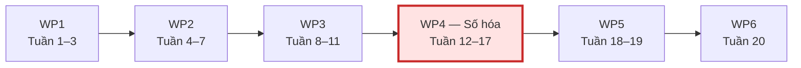

<strong>[CÂU 11]</strong>

# BẢN IN KẾ HOẠCH DỰ ÁN VÀ WBS

- **Dự án:** HCMUS-LDMS
- **Người phụ trách:** Ân Tiến Nguyên An
- **Nguồn:** [`04-cost-time-resource.md`](../../../../docs/02-planning/04-cost-time-resource.md) và [`01-sprint-plan.md`](../../../../docs/03-execution-monitoring/01-sprint-plan.md)

## Mục lục

- [1. Lộ trình dự án 20 tuần](#1-lộ-trình-dự-án-20-tuần)
- [2. Work Breakdown Structure](#2-work-breakdown-structure)
- [3. Gói công việc găng](#3-gói-công-việc-găng)
- [4. Kế hoạch thực thi Sprint 1](#4-kế-hoạch-thực-thi-sprint-1)

---

## 1. Lộ trình dự án 20 tuần

| Giai đoạn | Thời gian | Kết quả chính |
| :--- | :---: | :--- |
| 0 — Khảo sát và bản quyền | Tuần 1–2 | Ràng buộc pháp lý, khảo sát và hạ tầng ban đầu |
| 1 — Xây dựng MVP và thí điểm | Tuần 3–12 | Phần mềm cốt lõi, 500 sách thí điểm |
| 2 — Số hóa diện rộng | Tuần 13–18 | Chuyển giao quy trình, 2.000 giáo trình tiếp theo |
| 3 — Nghiệm thu và chuyển giao | Tuần 19–20 | UAT, pentest, đào tạo và go-live |

## 2. Work Breakdown Structure

| Gói công việc | Thời gian | Nội dung chính |
| :--- | :---: | :--- |
| WP1 — Khảo sát và bản quyền | Tuần 1–3 | Phỏng vấn độc giả, hoàn thành quy chế số hóa |
| WP2 — Cơ sở dữ liệu và Backend | Tuần 4–7 | PostgreSQL, MinIO, xác thực và API CRUD |
| WP3 — Giao diện và trình đọc | Tuần 8–11 | React UI, Epub.js, OCR/Pandoc và tìm kiếm |
| WP4 — Số hóa tài liệu | Tuần 12–17 | Quét, OCR, hiệu chỉnh và đóng gói EPUB |
| WP5 — Kiểm thử và UAT | Tuần 18–19 | Pentest và nghiệm thu với người dùng mẫu |
| WP6 — Triển khai và vận hành | Tuần 20 | Docker Compose, đào tạo và ra mắt |

> Lộ trình bốn giai đoạn và WBS là hai cách phân rã khác nhau. Vì vậy, ranh giới tuần của giai đoạn không bắt buộc trùng hoàn toàn với ranh giới Work Package.

## 3. Gói công việc găng

Tài liệu nguồn xác định **WP4 — Số hóa tài liệu** là gói công việc găng vì đây là gói dài nhất và phụ thuộc nhiều nhất vào năng suất con người. Scan sách và hiệu chỉnh OCR chậm sẽ trực tiếp làm trễ WP5, WP6 và ngày go-live.

Sơ đồ trên thể hiện thứ tự kế hoạch WP1–WP6 và làm nổi bật WP4. Tài liệu nguồn chưa có bảng quan hệ phụ thuộc, thời điểm sớm/muộn và độ dự trữ để chứng minh một phép tính CPM đầy đủ; vì vậy bản in không khẳng định toàn chuỗi có độ dự trữ bằng 0.

## 4. Kế hoạch thực thi Sprint 1

| Hạng mục | Kế hoạch |
| :--- | :--- |
| Thời lượng | 9 ngày |
| Phạm vi cam kết | 16 Must-have + 1 Should-have = **17 stories** |
| Nhân sự thực thi | 4 kỹ sư; mỗi người làm cả FastAPI và React cho story của mình |
| WIP | 1 card/người |
| Mốc Ngày 2 | Bản chạy được đơn giản cho luồng cơ bản |
| Mốc Ngày 9 | Hoàn thiện AC/DoD cho phạm vi Sprint |

Tài liệu tổng thể [`04-cost-time-resource.md`](../../../../docs/02-planning/04-cost-time-resource.md) đang ở trạng thái `Under Review`; [`01-sprint-plan.md`](../../../../docs/03-execution-monitoring/01-sprint-plan.md) ở trạng thái `Ready for Sprint`.
