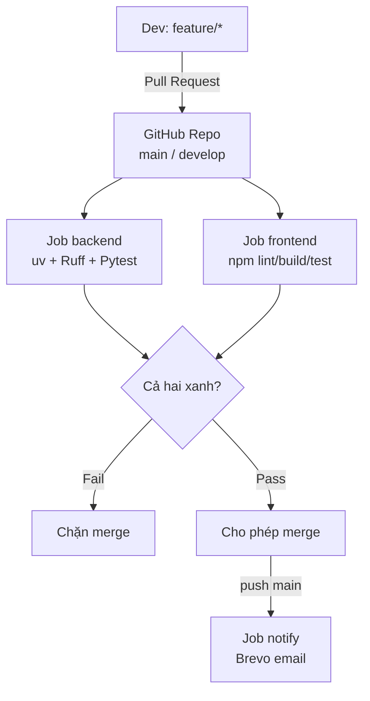
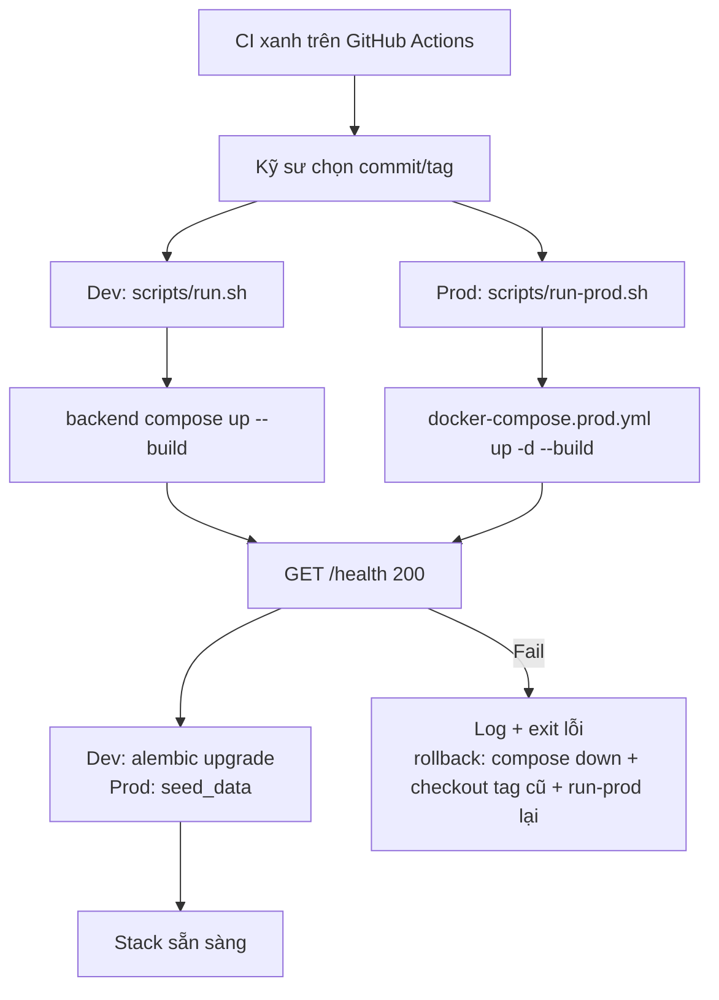
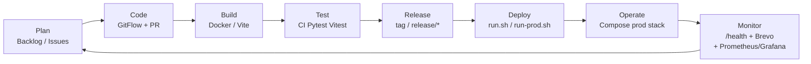
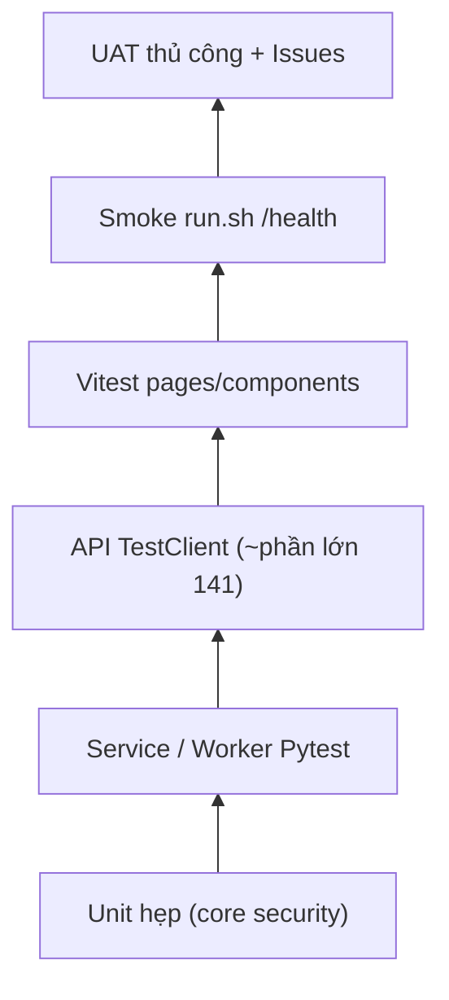

# PHIẾU BÀI LÀM ÔN TẬP — NGƯỜI 5: CI/CD, DEVOPS & KẾ HOẠCH KIỂM THỬ

- **Họ và tên thành viên:** Nguyễn Tuấn Anh
- **Mã số sinh viên:** 23127152
- **Phạm vi phụ trách:** **Câu 13, Câu 14, Câu 15, Câu 20**
- **Hạn chót hoàn thành (Bước 1):** **20:00, Thứ Năm (20/08/2026)**
- **Lưu ý quan trọng khi sửa `docs/`:** Nếu bạn chỉnh sửa hoặc tạo mới file (ví dụ soạn `docs/02-planning/09-test-plan.md`), **bắt buộc phải ghi lại bảng Document Revision History** ở đầu file và **ghi 1 dòng log công việc** vào file [`docs/03-execution-monitoring/02-project-log.md`](../../../docs/03-execution-monitoring/02-project-log.md).
- **Tài liệu tham chiếu trong dự án (thực hành):**
  - [`docs/02-planning/02-architecture.md`](../../../docs/02-planning/02-architecture.md) (Mục 8.2: GitFlow; §5–6 backup & deploy)
  - [`docs/02-planning/09-test-plan.md`](../../../docs/02-planning/09-test-plan.md)
  - [`docs/03-execution-monitoring/06-developer-guide.md`](../../../docs/03-execution-monitoring/06-developer-guide.md)
  - [`docs/03-execution-monitoring/07-deployment-guide.md`](../../../docs/03-execution-monitoring/07-deployment-guide.md)
  - Cấu hình Docker & Docker Compose (`src/backend/docker-compose.yml`, `src/backend/Dockerfile`)
  - Bộ test suite trong [`src/backend/tests/`](../../../src/backend/tests/)
  - File CI workflow: [`.github/workflows/ci.yml`](../../../.github/workflows/ci.yml)
  - Scripts: [`scripts/run.sh`](../../../scripts/run.sh), [`scripts/run-prod.sh`](../../../scripts/run-prod.sh), [`docker-compose.prod.yml`](../../../docker-compose.prod.yml), [`scripts/backup-postgres.sh`](../../../scripts/backup-postgres.sh), [`scripts/backup-minio.sh`](../../../scripts/backup-minio.sh)
- **Tài liệu lý thuyết tham chiếu (từ bài giảng):**
  - [`materials/07_software_configuration_management.md`](../../../materials/07_software_configuration_management.md)
  - [`materials/11_software_quality_management.md`](../../../materials/11_software_quality_management.md)
  - [`materials/11_1_agile_quality_management.md`](../../../materials/11_1_agile_quality_management.md)
- **Ghi chú bài giảng trên lớp ([`note.md`](../../../note.md)):**
  - **Buổi 06:** CI chạy tự động kiểm thử lint/test khi mở PR → gửi email thông báo kết quả.
  - **Buổi 08:** 5 bài toán CD/DevOps — nhóm có `run-prod.sh` (1), Prometheus/Grafana trong compose prod (3), backup scripts (5); gap chính: (2) auto release URL / `cd.yml`.
  - **Buổi 10:** AI sinh test; Pytest/Vitest; ngưỡng coverage 80–90% là khuyến nghị — **CI hiện chưa bắt coverage %**.
- **Đọc chéo liên kết:** Người 3 (Câu 5 Kiến trúc), Người 6 (Câu 19 Chất lượng).
- **Checklist bản in nộp kèm khi thi:**
  - [ ] Bản in [`.github/workflows/ci.yml`](../../../.github/workflows/ci.yml) + screenshot PR checks — "13"
  - [ ] Bản in email Brevo / Actions notify — "13"
  - [ ] Bản in [`06-developer-guide.md`](../../../docs/03-execution-monitoring/06-developer-guide.md) — "13"
  - [ ] Bản in [`scripts/run-prod.sh`](../../../scripts/run-prod.sh) + [`docker-compose.prod.yml`](../../../docker-compose.prod.yml) — "14" _(chưa có `cd.yml` auto — nói rõ Continuous Delivery thủ công)_
  - [ ] Bản in [`07-deployment-guide.md`](../../../docs/03-execution-monitoring/07-deployment-guide.md) — "14"
  - [ ] Bản in cấu hình CSDL / seed + Postgres trong compose prod — "14"
  - [ ] Bản in `scripts/backup-*.sh` + sơ đồ hạ tầng prod — "15"
  - [ ] Bản in [`09-test-plan.md`](../../../docs/02-planning/09-test-plan.md) — "20"
  - [ ] Bản in `pytest -v` output — "20"
  - [ ] Screenshot GitHub Issues + PR review — "19"/"20"
  - [ ] Biên bản UAT — phối hợp Người 6 — "19"/"20"
- **Chiến lược 10 phút viết giấy A4:** Phút 1–2 khung WHAT-HOW-WHY-EVIDENCE; 3–7 triển khai + sơ đồ; 8–9 ghi tool trên sơ đồ; 10 rà từ khóa. **Nói đúng gap** (không có `cd.yml` auto-deploy VMware).

---

## CÂU 13: MÔ HÌNH TÍCH HỢP LIÊN TỤC (CONTINUOUS INTEGRATION — CI)

> **Đề bài:** Vẽ và giải thích mô hình tích hợp liên tục (CI) của nhóm. Ghi chú trên mô hình các công cụ nhóm đã dùng cho từng thành phần. Tại sao cần sử dụng hệ thống tích hợp liên tục cho dự án? _(Sinh viên nộp kèm bản in kịch bản build, thông báo kết quả build và hướng dẫn cài đặt/biên dịch.)_

### 1. Gợi ý định hướng & Từ khóa cốt lõi:

- **Tài liệu đối chiếu:** GitFlow §8.2, `.github/workflows/ci.yml`, Developer Guide.
- **Từ khóa:** PR vào `main`/`develop`, Ruff, ESLint, Pytest (~141), Vitest, gating, Brevo notify khi push `main`.

### 2. Không gian tự biên soạn câu trả lời:

#### A. Sơ đồ Luồng Tích hợp Liên tục (CI Workflow)

#### B. Dàn ý giải thích trên giấy A4 & Trả lời các câu hỏi

- **Giải thích luồng hoạt động CI:**
  _Trả lời:_ Nhóm theo GitFlow. Khi mở PR vào `main` hoặc `develop` (hoặc push các nhánh `main`/`develop`/`release/**`/`hotfix/**`), GitHub Actions chạy file `.github/workflows/ci.yml`. Hai job song song: **backend** (`uv sync` → `ruff format --check` → `ruff check` → `pytest`) và **frontend** (`npm ci` → `lint` → `build` → `npm test` / Vitest). Chỉ khi cả hai thành công thì PR mới nên được merge. Riêng sau **push lên `main`**, job `notify` (luôn chạy `if: always()` khi điều kiện nhánh đúng) gọi `app.scripts.send_merge_notification` gửi email HTML qua Brevo tới danh sách trong `.github/ci-notify-recipients.txt`, kèm trạng thái từng job.

- **Danh mục các công cụ nhóm đã sử dụng cho từng khâu:**
  _Trả lời:_ VCS/PR: GitHub. Orchestration: GitHub Actions. Python lint/format: Ruff. Backend test: Pytest + FastAPI TestClient. Frontend: Node 20, ESLint, Vite build, Vitest. Thông báo: Brevo API + secrets `BREVO_API_KEY`, `BREVO_SENDER_EMAIL`. Hướng dẫn cài/biên dịch: `docs/03-execution-monitoring/06-developer-guide.md` và `./scripts/run.sh`.

- **Tại sao cần sử dụng hệ thống Tích hợp liên tục cho dự án?**
  _Trả lời:_ Sáu thành viên (và AI coding) merge song song; OCR/auth/publish dễ regression. Không có CI thì lỗi format/test chỉ lộ khi ai đó chạy local — muộn và khó quy trách nhiệm. CI tạo **cổng chung**: cùng bộ Ruff/Pytest/Vitest trên `ubuntu-latest` trước khi vào `develop`/`main`. Email khi merge `main` giúp cả nhóm biết bản ổn định vừa vào nhánh production-ready mà không cần mở tab Actions mỗi ngày. Điều này khớp DoD “Code merge qua PR” trong team contract.

---

## CÂU 14: MÔ HÌNH CHUYỂN GIAO LIÊN TỤC (CONTINUOUS DELIVERY — CD)

> **Đề bài:** Vẽ và giải thích mô hình chuyển giao liên tục (CD) của nhóm. Ghi chú trên mô hình các công cụ nhóm đã dùng cho từng thành phần. Tại sao cần sử dụng hệ thống chuyển giao liên tục cho dự án? _(Sinh viên nộp kèm bản in kịch bản triển khai, cấu hình CSDL và hướng dẫn vận hành.)_

### 1. Gợi ý định hướng & Từ khóa cốt lõi:

- **Đối chiếu:** `scripts/run-prod.sh`, `docker-compose.prod.yml`, `scripts/run.sh`, Deployment Guide.
- **Từ khóa:** Continuous **Delivery** thủ công (`./scripts/run-prod.sh`); **chưa** Continuous Deployment (`cd.yml` lên VMware). Stack prod gồm Web/Nginx, API, Postgres, MinIO, MailHog, Prometheus, Grafana.

### 2. Không gian tự biên soạn câu trả lời:

#### A. Sơ đồ Luồng Chuyển giao Liên tục (CD Workflow)

#### B. Dàn ý giải thích trên giấy A4 & Trả lời các câu hỏi

- **Giải thích luồng hoạt động CD:**
  _Trả lời:_ Sau khi CI xác nhận build/test xanh, nhóm **chưa** tự động đẩy lên máy chủ VMware. Continuous Delivery thủ công: trên máy có Docker chạy `./scripts/run.sh` (dev) hoặc `./scripts/run-prod.sh` (prod one-click qua `docker-compose.prod.yml`: Web/Nginx TLS, API, Postgres, MinIO, MailHog, Prometheus, Grafana). Script prod chờ `GET /health`, rồi seed dữ liệu demo. Rollback MVP: `docker compose -f docker-compose.prod.yml down`, checkout bản ổn định, chạy lại `run-prod.sh`; khôi phục data từ backup nếu cần. **Không có** `.github/workflows/cd.yml` — gap khi thầy hỏi “commit xong user đã có URL production chưa?”.

- **Danh mục các công cụ nhóm đã sử dụng:**
  _Trả lời:_ Docker & Docker Compose; `docker-compose.prod.yml`; Dockerfile API; Nginx (`web`); MailHog; Prometheus; Grafana; `curl` health check; Bash/PowerShell `run-prod.sh` / `run-prod.ps1`; hướng dẫn [`07-deployment-guide.md`](../../../docs/03-execution-monitoring/07-deployment-guide.md).

- **Tại sao cần sử dụng hệ thống Chuyển giao liên tục cho dự án?**
  _Trả lời:_ Stack LDMS nhiều thành phần (API, DB, object storage, reverse proxy, mail, monitoring). Script one-click giúp **máy bất kỳ có Docker** dựng đủ hệ thống (bài toán 1 buổi 08). CD đầy đủ (tag → auto URL production) là bước tiếp theo; hiện nhóm đã có Delivery tái lập được + Monitor trong compose prod.

---

## CÂU 15: MÔ HÌNH DEVOPS

> **Đề bài:** Vẽ và giải thích mô hình DevOps của nhóm. Ghi chú trên mô hình các công cụ nhóm đã dùng cho từng thành phần. Tại sao cần sử dụng quy trình DevOps cho dự án? Giải thích quy trình phát triển, triển khai và vận hành liên tục đồng thời nhiều phiên bản. _(Sinh viên nộp kèm bản in cấu hình hạ tầng.)_

### 1. Gợi ý định hướng & Từ khóa cốt lõi:

- **Đối chiếu:** `scripts/`, `docker-compose.prod.yml`, backup MVP, CI, GitFlow.
- **Từ khóa:** 8 giai đoạn DevOps; Dev (`run.sh`) vs Prod (`run-prod.sh`); Monitor Grafana/Prometheus; backup `pg_dump`/`mc mirror`.

### 2. Không gian tự biên soạn câu trả lời:

#### A. Sơ đồ Vòng lặp DevOps 8 giai đoạn

#### B. Dàn ý giải thích trên giấy A4 & Trả lời các câu hỏi

- **Chi tiết 8 giai đoạn và công cụ tương ứng:**
  _Trả lời:_ (1) **Plan** — Product Backlog, Sprint plan, GitHub Issues. (2) **Code** — GitFlow `feature/*`→`develop`→`release/*`→`main`, PR review. (3) **Build** — Docker build API/Web; `npm run build` trên CI. (4) **Test** — Ruff/ESLint + Pytest + Vitest trên Actions. (5) **Release** — quy ước tag/`release/*` (architecture §8.2); CI chạy trên nhánh release. (6) **Deploy** — `run.sh` (dev) / `run-prod.sh` (prod compose). (7) **Operate** — stack `docker-compose.prod.yml`; backup `backup-postgres.sh` / `backup-minio.sh`. (8) **Monitor** — health lúc deploy, email merge `main` (Brevo), Prometheus `:9090` + Grafana `:3000` trong prod stack.

- **Tại sao cần sử dụng quy trình DevOps cho dự án?**
  _Trả lời:_ DevOps rút ngắn vòng từ story đến stack chạy được, có seed demo, có giám sát và sao lưu. Với thư viện số hóa, mất DB/MinIO là mất công biên tập; Compose + scripts giảm rủi ro “chỉ chạy trên máy người viết”.

- **Giải thích quy trình phát triển, triển khai và vận hành đồng thời nhiều môi trường (Dev vs Staging vs Prod):**
  _Trả lời:_ **Dev:** `run.sh` + compose backend + Vite 5173. **Prod-like:** `run-prod.sh` + `docker-compose.prod.yml` (Web 8080/8443, MailHog, Grafana…). **Staging/Prod VMware:** mô tả trong Deployment View — thiết kế mục tiêu, chưa gắn CD pipeline. Không dùng chung secret yếu của dev trên máy production.

---

## CÂU 20: KẾ HOẠCH KIỂM THỬ (TEST PLAN)

> **Đề bài:** Trình bày quá trình hình thành và phương pháp đánh giá tài liệu Kế hoạch kiểm thử (Test Plan) của nhóm. _(Sinh viên nộp kèm bản in tài liệu Kế hoạch kiểm thử và kết quả Unit Tests.)_

### 1. Gợi ý định hướng & Từ khóa cốt lõi:

- **Đối chiếu:** [`09-test-plan.md`](../../../docs/02-planning/09-test-plan.md), `src/backend/tests/`, CI, DoD team contract.
- **Từ khóa:** Test Pyramid, Pytest fixtures, Vitest, gating CI, GitHub Issues; **chưa** E2E Playwright / coverage gate.

### 2. Không gian tự biên soạn câu trả lời:

#### A. Dàn ý trình bày trên giấy A4 (WHAT - HOW - WHY - EVIDENCE)

- **WHAT (Là gì?):**
  _Trả lời:_ Test Plan (`LDMS_TSP_B1.0`) là thỏa thuận của nhóm về phạm vi kiểm thử, cấp độ (unit → API → FE → smoke → UAT), môi trường, tiêu chí pass/fail, công cụ và cách theo dõi defect — phản ánh **suite và CI đã có**, không mô tả hệ QA doanh nghiệp chưa tồn tại.

- **HOW (Cách nhóm xây dựng test suite và chạy kiểm thử tự động):**
  _Trả lời:_ Đầu vào từ AC backlog + ràng buộc bảo mật (JWT/RBAC) + tech stack. Backend: Pytest với `conftest.py` (SQLite in-memory, `InMemoryStorage`, stub worker). Frontend: Vitest + Testing Library (~18 file). Cổng: mỗi PR chạy `ci.yml`. Local trùng lệnh trong Developer Guide. Smoke: `run.sh` chờ `/health`. UAT thủ công + Issues.

- **WHY (Tại sao cần kế hoạch kiểm thử đa tầng?):**
  _Trả lời:_ AI và nhiều người sửa OCR/auth nhanh; chỉ test tay không đủ. Kim tự tháp: nhiều test rẻ ở đáy (CI), ít kiểm đắt ở đỉnh (UAT). Test Plan giúp thống nhất “Done” với DoD và tránh phóng đại khi thi vấn đáp.

- **EVIDENCE (Minh chứng kết quả test thực tế trong dự án):**
  _Trả lời:_ `uv run pytest --collect-only` → **141 tests**; in output `pytest -v`; screenshot PR Checks xanh; file `09-test-plan.md`; PR review comments; Issues. Signed URL 15’ đã implement (README) nhưng **chưa** có test expiry riêng — nêu nếu bị hỏi sâu.

#### B. Sơ đồ Kim tự tháp Kiểm thử (Test Pyramid)

#### C. Trả lời chi tiết 100% Bộ câu hỏi thường gặp của Giảng viên

1. **Các câu hỏi chính cần trả lời trong tài liệu Kế hoạch kiểm thử là gì?**
   - _Trả lời:_ Kiểm gì (phạm vi in/out)? Cấp độ nào? Trên môi trường nào? Ai chạy? Dùng công cụ gì? Pass/fail thế nào? Defect theo dõi ở đâu? Rủi ro/khoảng trống?

2. **Các đầu vào cần thiết và các bước nhóm đã thực hiện để tạo tài liệu Kế hoạch kiểm thử là gì?**
   - _Trả lời:_ Đầu vào: Product Backlog AC, DoD team contract, architecture §5.1/§8.2, cấu trúc `tests/`, file `ci.yml`. Bước: đối chiếu codebase → phân tầng pyramid → ghi công cụ/tiêu chí → liệt kê gap (E2E, coverage %, signed-URL test) → peer review với Người 6.

3. **Tài liệu Kế hoạch kiểm thử của nhóm đã được đánh giá thế nào?**
   - _Trả lời:_ Tự đối chiếu với suite/CI thật (không viết yêu cầu không có trong repo); chờ cross-review nhóm; cổng đánh giá vận hành hàng ngày là **CI đỏ/xanh** và review PR.

4. **Tại sao cần tạo tài liệu Kế hoạch kiểm thử?**
   - _Trả lời:_ Tránh “Done” chủ quan; onboard thành viên mới biết chạy test thế nào; phục vụ nghiệm thu và vấn đáp có evidence; tách rõ đã làm vs roadmap.

5. **Tài liệu Kế hoạch kiểm thử của nhóm đã được sử dụng và cập nhật trong quá trình thực hiện dự án như thế nào?**
   - _Trả lời:_ Trước 20/08 chiến lược nằm rải trong DoD + test code + CI. Từ v1.0, mỗi đợt thêm loại test hoặc đóng gap (E2E/coverage) sẽ cập nhật Revision History và mục khoảng trống trong `09-test-plan.md`; suite cập nhật theo từng PR feature.

6. **Giải thích mô hình Kim tự tháp kiểm thử (Test Pyramid) và cách áp dụng trong dự án:**
   - _Trả lời:_ Đáy rộng = unit/service/API Pytest (nhanh, không cần Postgres/MinIO thật trên CI). Giữa = Vitest UI. Đỉnh hẹp = smoke Compose + UAT. Không đảo ngược pyramid (không lấy E2E thay cho hầu hết unit) vì chi phí và độ flaky cao với đồ án nhỏ.
