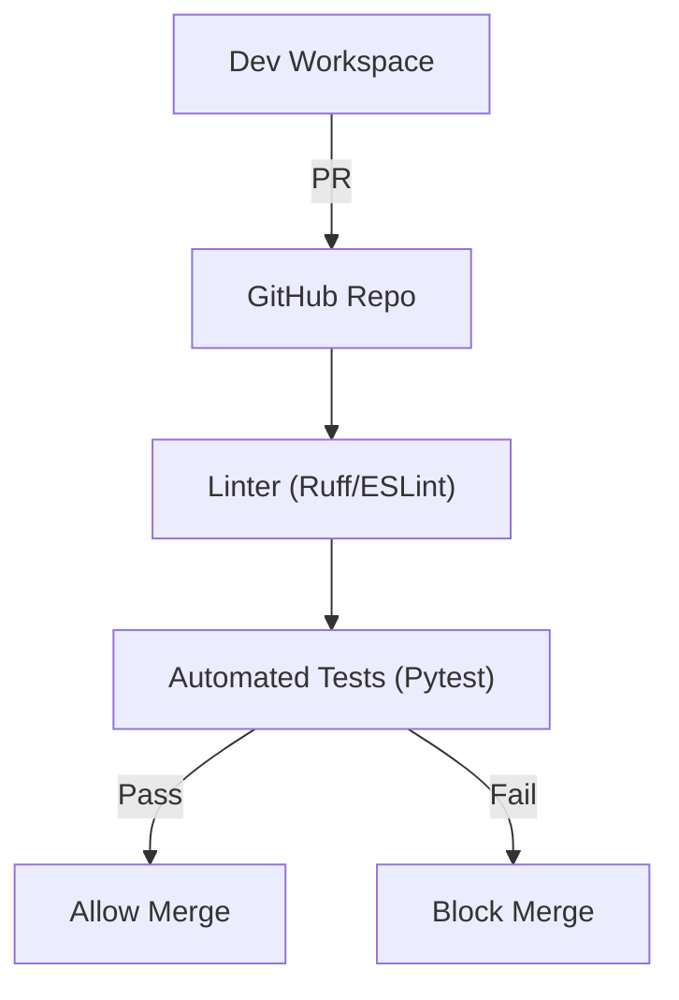
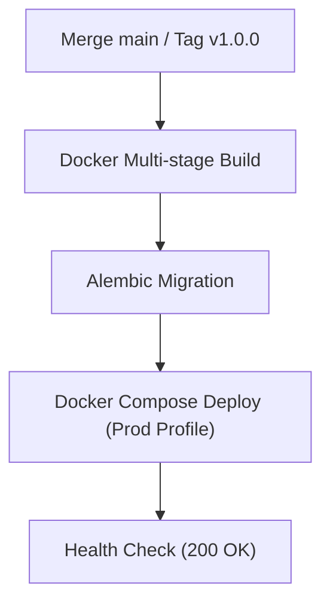
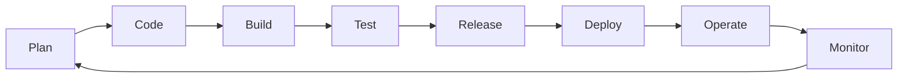
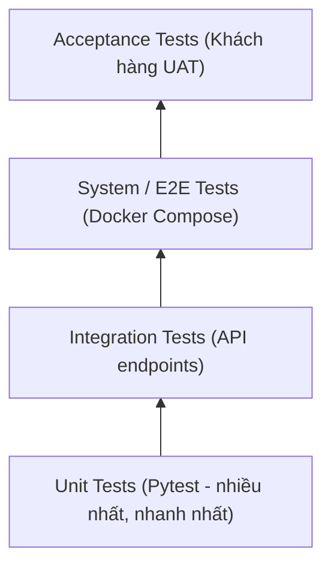

# PHIẾU BÀI LÀM ÔN TẬP — NGƯỜI 5: CI/CD, DEVOPS & KẾ HOẠCH KIỂM THỬ

- **Họ và tên thành viên:** Nguyễn Tuấn Anh
- **Mã số sinh viên:** 23127152
- **Phạm vi phụ trách:** **Câu 13, Câu 14, Câu 15, Câu 20**
- **Hạn chót hoàn thành (Bước 1):** **20:00, Thứ Năm (20/08/2026)**
- **Lưu ý quan trọng khi sửa `docs/`:** Nếu bạn chỉnh sửa hoặc tạo mới file (ví dụ soạn `docs/02-planning/09-test-plan.md`), **bắt buộc phải ghi lại bảng Document Revision History** ở đầu file và **ghi 1 dòng log công việc** vào file [`docs/03-execution-monitoring/02-project-log.md`](../../../docs/03-execution-monitoring/02-project-log.md).
- **Tài liệu tham chiếu trong dự án (thực hành):**
  - [`docs/02-planning/02-architecture.md`](../../../docs/02-planning/02-architecture.md) (Mục 8.2: CI/CD & Deploy)
  - Cấu hình Docker & Docker Compose (`src/backend/docker-compose.yml`, `src/backend/Dockerfile`)
  - Bộ test suite trong [`src/backend/tests/`](../../../src/backend/tests/)
  - File CI workflow: [`.github/workflows/ci.yml`](../../../.github/workflows/ci.yml) (GitHub Actions: Ruff, ESLint, Pytest, Email notify)
  - Scripts vận hành: [`scripts/backup-postgres.sh`](../../../scripts/backup-postgres.sh), [`scripts/backup-minio.sh`](../../../scripts/backup-minio.sh)
- **Tài liệu lý thuyết tham chiếu (từ bài giảng):**
  - [`materials/07_software_configuration_management.md`](../../../materials/07_software_configuration_management.md) (Quản lý cấu hình, Version Control, Build Automation, CI/CD, DevOps)
  - [`materials/11_software_quality_management.md`](../../../materials/11_software_quality_management.md) (Kiểm thử phần mềm, Test Pyramid, Unit/Integration/System/Acceptance Test, Code Inspection)
  - [`materials/11_1_agile_quality_management.md`](../../../materials/11_1_agile_quality_management.md) (Kiểm thử trong Agile, TDD, Continuous Testing)
- **Ghi chú bài giảng trên lớp ([`note.md`](../../../note.md)):**
  - **Buổi 06:** CI chạy tự động kiểm thử lint/test khi mở PR $\rightarrow$ tự động gửi email thông báo kết quả build cho các thành viên.
  - **Buổi 08:** Giải quyết 5 bài toán CD/DevOps: (1) Deployment script chạy trên máy dev bất kỳ triển khai toàn bộ hệ thống; (2) Release tag triển khai cho user; (3) Monitoring; (4) Multi-environments Dev/Prod; (5) Script sao lưu DB & Storage.
  - **Buổi 10:** AI Quality Management & Testing: Tận dụng AI sinh test cases, ngưỡng Test Coverage tối thiểu 80-90%, Kim tự tháp kiểm thử Pytest.
- **Đọc chéo liên kết:** Nên đọc thêm phần của **Người 3** (Câu 5: Kiến trúc) vì CI/CD build/deploy dựa trên architecture, và phần của **Người 6** (Câu 19: Chất lượng) vì Test Plan là một phần của Quality Management.
- **Checklist bản in nộp kèm khi thi:**
  - [ ] Bản in kịch bản CI build tự động ([`.github/workflows/ci.yml`](../../../.github/workflows/ci.yml)) và kết quả kiểm thử tự động -- đánh dấu "13".
  - [ ] Bản in email/notification thông báo kết quả build -- **CẦN CHUẨN BỊ**: screenshot email từ Brevo/GitHub Actions -- đánh dấu "13".
  - [ ] Bản in Hướng dẫn cài đặt công cụ và biên dịch mã nguồn cho Dev -- **CẦN TỰ SOẠN** file `docs/03-execution-monitoring/06-developer-guide.md` -- đánh dấu "13".
  - [ ] Bản in kịch bản CD triển khai tự động (`.github/workflows/cd.yml`) -- **CẦN TỰ TRIỂN KHAI THÊM** pipeline CD trên GitHub Actions (khi push `main` hoặc tạo Git Tag `v*`) -- đánh dấu "14".
  - [ ] Bản in kịch bản triển khai thủ công Production (`scripts/deploy-prod.sh` hoặc `scripts/deploy.sh`) -- **CẦN TỰ VIẾT THÊM SCRIPT DEPLOY MANUAL** (bao gồm: pull/build image, migrate DB Alembic, health check 200 OK, rollback khi lỗi) -- đánh dấu "14".
  - [ ] Bản in kịch bản triển khai containerized (`src/backend/docker-compose.yml` prod profile) và script migration CSDL (Alembic) -- đánh dấu "14".
  - [ ] Bản in Hướng dẫn triển khai hệ thống cho Kỹ sư vận hành -- **CẦN TỰ SOẠN** file `docs/03-execution-monitoring/07-deployment-guide.md` (hướng dẫn chạy script deploy manual) -- đánh dấu "14".
  - [ ] Bản in sơ đồ cấu trúc thư mục hạ tầng và kịch bản sao lưu (`scripts/backup-*.sh`) -- đánh dấu "15".
  - [ ] Bản in tài liệu Kế hoạch kiểm thử (Test Plan) -- **CẦN TỰ SOẠN** file `docs/02-planning/09-test-plan.md` -- đánh dấu "20".
  - [ ] Bản in báo cáo kết quả Unit Tests (`pytest` output) -- **CẦN CHUẨN BỊ**: chạy `pytest -v` và screenshot -- đánh dấu "20".
  - [ ] Bản in giao diện Bug Tracker (GitHub Issues) -- **CẦN CHUẨN BỊ**: screenshot -- đánh dấu "20".
  - [ ] Bản in biên bản thanh tra mã nguồn (Code Inspection / PR Review) -- **CẦN CHUẨN BỊ**: screenshot 1 PR review có comment -- đánh dấu "19" và "20".
  - [ ] Bản in biên bản phản hồi khách hàng (UAT feedback) -- phối hợp với **Người 6** -- đánh dấu "19" và "20".
- **Chiến lược 10 phút viết giấy A4:** Phút 1-2: Viết tiêu đề câu + dàn ý WHAT-HOW-WHY-EVIDENCE. Phút 3-7: Triển khai mỗi mục 3-4 dòng ngắn gọn, ưu tiên vẽ sơ đồ (CI/CD/DevOps là câu hỏi vẽ mô hình). Phút 8-9: Ghi chú công cụ trên sơ đồ. Phút 10: Rà soát, bổ sung từ khóa.

---

## CÂU 13: MÔ HÌNH TÍCH HỢP LIÊN TỤC (CONTINUOUS INTEGRATION — CI)

> **Đề bài:** Vẽ và giải thích mô hình tích hợp liên tục (CI) của nhóm. Ghi chú trên mô hình các công cụ nhóm đã dùng cho từng thành phần. Tại sao cần sử dụng hệ thống tích hợp liên tục cho dự án? _(Sinh viên nộp kèm bản in kịch bản build, thông báo kết quả build và hướng dẫn cài đặt/biên dịch.)_

### 1. Gợi ý định hướng & Từ khóa cốt lõi:

- **Tài liệu đối chiếu:** Mục 8.2 trong `02-architecture.md` và GitHub PR checks (`.github/workflows/ci.yml`).
- **Từ khóa:** Luồng CI tự động khi mở PR vào `develop`, Ruff linter (Python), ESLint (Frontend), Format check, Pytest (100% pass mới cho merge), Gating check.

### 2. Không gian tự biên soạn câu trả lời:

#### A. Sơ đồ Luồng Tích hợp Liên tục (CI Workflow)

#### B. Dàn ý giải thích trên giấy A4 & Trả lời các câu hỏi

- **Giải thích luồng hoạt động CI:**
  _Viết câu trả lời của bạn vào đây:_

- **Danh mục các công cụ nhóm đã sử dụng cho từng khâu:**
  _Viết câu trả lời của bạn vào đây:_

- **Tại sao cần sử dụng hệ thống Tích hợp liên tục cho dự án?**
  _Viết câu trả lời của bạn vào đây:_

---

## CÂU 14: MÔ HÌNH CHUYỂN GIAO LIÊN TỤC (CONTINUOUS DELIVERY — CD)

> **Đề bài:** Vẽ và giải thích mô hình chuyển giao liên tục (CD) của nhóm. Ghi chú trên mô hình các công cụ nhóm đã dùng cho từng thành phần. Tại sao cần sử dụng hệ thống chuyển giao liên tục cho dự án? _(Sinh viên nộp kèm bản in kịch bản triển khai, cấu hình CSDL và hướng dẫn vận hành.)_

### 1. Gợi ý định hướng & Từ khóa cốt lõi:

- **Tài liệu đối chiếu:** Kịch bản triển khai thủ công `scripts/deploy-prod.sh` (cần tự viết), file `.github/workflows/cd.yml` (cần tự triển khai), file `src/backend/docker-compose.yml`, Dockerfile, Alembic migrations.
- **Từ khóa:** Script deploy manual (Pull code $\rightarrow$ Docker build $\rightarrow$ Up container $\rightarrow$ Migrate DB $\rightarrow$ Health check $\rightarrow$ Rollback if fail), Tự động hóa khi merge `main` / gán Git tag release (`v1.0.0-MVP`), Docker Multi-stage build, Alembic database migration, Nginx reverse proxy, Health check (`GET /health`).

### 2. Không gian tự biên soạn câu trả lời:

#### A. Sơ đồ Luồng Chuyển giao Liên tục (CD Workflow)

#### B. Dàn ý giải thích trên giấy A4 & Trả lời các câu hỏi

- **Giải thích luồng hoạt động CD:**
  _Viết câu trả lời của bạn vào đây:_

- **Danh mục các công cụ nhóm đã sử dụng:**
  _Viết câu trả lời của bạn vào đây:_

- **Tại sao cần sử dụng hệ thống Chuyển giao liên tục cho dự án?**
  _Viết câu trả lời của bạn vào đây:_

---

## CÂU 15: MÔ HÌNH DEVOPS

> **Đề bài:** Vẽ và giải thích mô hình DevOps của nhóm. Ghi chú trên mô hình các công cụ nhóm đã dùng cho từng thành phần. Tại sao cần sử dụng quy trình DevOps cho dự án? Giải thích quy trình phát triển, triển khai và vận hành liên tục đồng thời nhiều phiên bản. _(Sinh viên nộp kèm bản in cấu hình hạ tầng.)_

### 1. Gợi ý định hướng & Từ khóa cốt lõi:

- **Tài liệu đối chiếu:** Thư mục `scripts/`, cấu hình Docker, MinIO console.
- **Từ khóa:** Vòng lặp 8 giai đoạn (Plan $\rightarrow$ Code $\rightarrow$ Build $\rightarrow$ Test $\rightarrow$ Release $\rightarrow$ Deploy $\rightarrow$ Operate $\rightarrow$ Monitor), Công cụ tương ứng từng khâu, Multi-environment (Dev vs Prod profile), Sao lưu tự động (pg_dump, MinIO mirror).

### 2. Không gian tự biên soạn câu trả lời:

#### A. Sơ đồ Vòng lặp DevOps 8 giai đoạn

#### B. Dàn ý giải thích trên giấy A4 & Trả lời các câu hỏi

- **Chi tiết 8 giai đoạn và công cụ tương ứng:**
  _Viết câu trả lời của bạn vào đây:_

- **Tại sao cần sử dụng quy trình DevOps cho dự án?**
  _Viết câu trả lời của bạn vào đây:_

- **Giải thích quy trình phát triển, triển khai và vận hành đồng thời nhiều môi trường (Dev vs Staging vs Prod):**
  _Viết câu trả lời của bạn vào đây:_

---

## CÂU 20: KẾ HOẠCH KIỂM THỬ (TEST PLAN)

> **Đề bài:** Trình bày quá trình hình thành và phương pháp đánh giá tài liệu Kế hoạch kiểm thử (Test Plan) của nhóm. _(Sinh viên nộp kèm bản in tài liệu Kế hoạch kiểm thử và kết quả Unit Tests.)_

### 1. Gợi ý định hướng & Từ khóa cốt lõi:

- **Tài liệu đối chiếu:** Test suite `src/backend/tests/` và tài liệu Kiểm thử.
- **Từ khóa:** Các cấp độ test (Unit Test, Integration Test, Security Test JWT/DRM signed URL 15m, Smoke Test), Thư viện Pytest fixtures, Kim tự tháp kiểm thử (Test Pyramid), Đạt 100% pass test suite.

### 2. Không gian tự biên soạn câu trả lời:

#### A. Dàn ý trình bày trên giấy A4 (WHAT - HOW - WHY - EVIDENCE)

- **WHAT (Là gì?):**
  _Viết câu trả lời của bạn vào đây:_

- **HOW (Cách nhóm xây dựng test suite và chạy kiểm thử tự động):**
  _Viết câu trả lời của bạn vào đây:_

- **WHY (Tại sao cần kế hoạch kiểm thử đa tầng?):**
  _Viết câu trả lời của bạn vào đây:_

- **EVIDENCE (Minh chứng kết quả test thực tế trong dự án):**
  _Viết câu trả lời của bạn vào đây:_

#### B. Sơ đồ Kim tự tháp Kiểm thử (Test Pyramid)

#### C. Trả lời chi tiết 100% Bộ câu hỏi thường gặp của Giảng viên

1. **Các câu hỏi chính cần trả lời trong tài liệu Kế hoạch kiểm thử là gì?**
   - _Trả lời:_

2. **Các đầu vào cần thiết và các bước nhóm đã thực hiện để tạo tài liệu Kế hoạch kiểm thử là gì?**
   - _Trả lời:_

3. **Tài liệu Kế hoạch kiểm thử của nhóm đã được đánh giá thế nào?**
   - _Trả lời:_

4. **Tại sao cần tạo tài liệu Kế hoạch kiểm thử?**
   - _Trả lời:_

5. **Tài liệu Kế hoạch kiểm thử của nhóm đã được sử dụng và cập nhật trong quá trình thực hiện dự án như thế nào?**
   - _Trả lời:_

6. **Giải thích mô hình Kim tự tháp kiểm thử (Test Pyramid) và cách áp dụng trong dự án:**
   - _Trả lời:_
