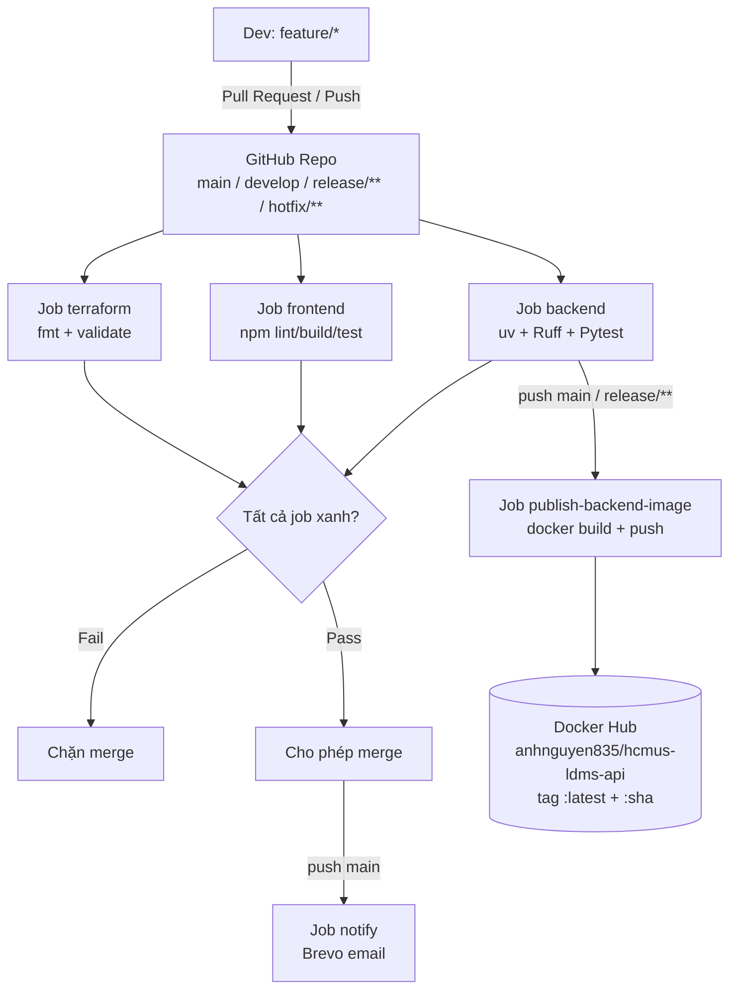
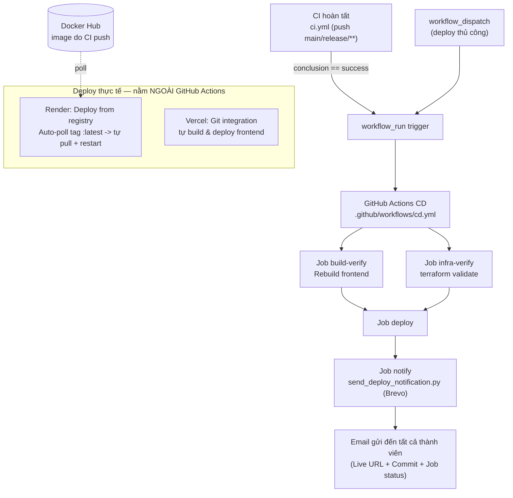
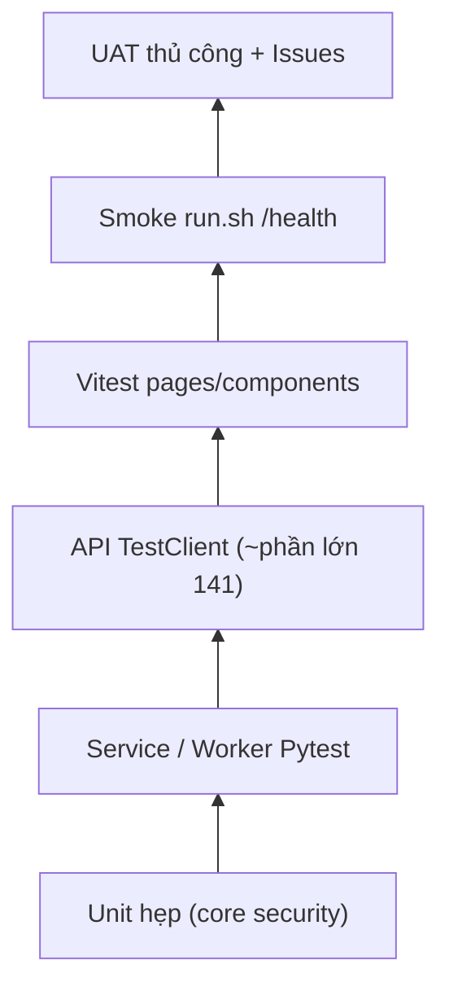

# PHIẾU BÀI LÀM ÔN TẬP — NGƯỜI 5: CI/CD, DEVOPS & KẾ HOẠCH KIỂM THỬ

- **Họ và tên thành viên:** Nguyễn Tuấn Anh
- **Mã số sinh viên:** 23127152
- **Phạm vi phụ trách:** **Câu 13, Câu 14, Câu 15, Câu 20**
- **Hạn chót hoàn thành (Bước 1):** **20:00, Thứ Năm (20/08/2026)**
- **Lưu ý quan trọng khi sửa `docs/`:** Nếu bạn chỉnh sửa hoặc tạo mới file (ví dụ soạn `docs/02-planning/09-test-plan.md`), **bắt buộc phải ghi lại bảng Document Revision History** ở đầu file và **ghi 1 dòng log công việc** vào file [`docs/03-execution-monitoring/02-project-log.md`](../../../docs/03-execution-monitoring/02-project-log.md).
- **Tài liệu tham chiếu trong dự án (thực hành):**
  - [`docs/02-planning/02-architecture.md`](../../../docs/02-planning/02-architecture.md) (Mục 8.2: GitFlow; §5–6 backup & deploy)
  - [`docs/02-planning/09-test-plan.md`](../../../docs/02-planning/09-test-plan.md)
  - [`docs/03-execution-monitoring/06-developer-guide.md`](../../../docs/03-execution-monitoring/06-developer-guide.md)
  - [`docs/03-execution-monitoring/07-deployment-guide.md`](../../../docs/03-execution-monitoring/07-deployment-guide.md)
  - Cấu hình Docker & Docker Compose (`src/backend/docker-compose.yml`, `src/backend/Dockerfile`)
  - Bộ test suite trong [`src/backend/tests/`](../../../src/backend/tests/)
  - File CI/CD workflows: [`.github/workflows/ci.yml`](../../../.github/workflows/ci.yml), [`.github/workflows/cd.yml`](../../../.github/workflows/cd.yml)
  - Scripts: [`scripts/run.sh`](../../../scripts/run.sh), [`scripts/run-prod.sh`](../../../scripts/run-prod.sh), [`docker-compose.prod.yml`](../../../docker-compose.prod.yml), [`scripts/backup-postgres.sh`](../../../scripts/backup-postgres.sh), [`scripts/backup-minio.sh`](../../../scripts/backup-minio.sh)
- **Tài liệu lý thuyết tham chiếu (từ bài giảng):**
  - [`materials/07_software_configuration_management.md`](../../../materials/07_software_configuration_management.md)
  - [`materials/11_software_quality_management.md`](../../../materials/11_software_quality_management.md)
  - [`materials/11_1_agile_quality_management.md`](../../../materials/11_1_agile_quality_management.md)
- **Ghi chú bài giảng trên lớp ([`note.md`](../../../note.md)):**
  - **Buổi 06:** CI chạy tự động kiểm thử lint/test khi mở PR → gửi email thông báo kết quả.
  - **Buổi 08:** 5 bài toán CD/DevOps — nhóm có `cd.yml` tự động build/deploy xuất live URL + Brevo notify (2), `run-prod.sh` (1), Prometheus/Grafana trong compose prod (3), backup scripts (5).
  - **Buổi 10:** AI sinh test; Pytest/Vitest; ngưỡng coverage 80–90% là khuyến nghị — **CI hiện chưa bắt coverage %**.
- **Đọc chéo liên kết:** Người 3 (Câu 5 Kiến trúc), Người 6 (Câu 19 Chất lượng).
- **Checklist bản in nộp kèm khi thi:**
  - [ ] Bản in [`.github/workflows/ci.yml`](../../../.github/workflows/ci.yml) + screenshot PR checks — "13"
  - [ ] Bản in email Brevo / Actions notify — "13"
  - [ ] Bản in [`.github/workflows/cd.yml`](../../../.github/workflows/cd.yml) + screenshot CD email notify & Live URL — "14"
  - [ ] Bản in cấu hình Terraform IaaC ([`terraform/main.tf`](../../../terraform/main.tf), [`terraform/outputs.tf`](../../../terraform/outputs.tf)) + terminal plan — "15"
  - [ ] Bản in [`06-developer-guide.md`](../../../docs/03-execution-monitoring/06-developer-guide.md) — "13"
  - [ ] Bản in [`scripts/run-prod.sh`](../../../scripts/run-prod.sh) + [`docker-compose.prod.yml`](../../../docker-compose.prod.yml) — "14"
  - [ ] Bản in [`07-deployment-guide.md`](../../../docs/03-execution-monitoring/07-deployment-guide.md) — "14"
  - [ ] Bản in cấu hình CSDL / seed + Postgres trong compose prod — "14"
  - [ ] Bản in `scripts/backup-*.sh` + sơ đồ hạ tầng prod — "15"
  - [ ] Bản in [`09-test-plan.md`](../../../docs/02-planning/09-test-plan.md) — "20"
  - [ ] Bản in `pytest -v` output — "20"
  - [ ] Screenshot GitHub Issues + PR review — "19"/"20"
  - [ ] Biên bản UAT — phối hợp Người 6 — "19"/"20"
- **Chiến lược 10 phút viết giấy A4:** Phút 1–2 khung WHAT-HOW-WHY-EVIDENCE; 3–7 triển khai + sơ đồ; 8–9 ghi tool trên sơ đồ; 10 rà từ khóa.

---

## CÂU 13: MÔ HÌNH TÍCH HỢP LIÊN TỤC (CONTINUOUS INTEGRATION — CI)

> **Đề bài:** Vẽ và giải thích mô hình tích hợp liên tục (CI) của nhóm. Ghi chú trên mô hình các công cụ nhóm đã dùng cho từng thành phần. Tại sao cần sử dụng hệ thống tích hợp liên tục cho dự án? _(Sinh viên nộp kèm bản in kịch bản build, thông báo kết quả build và hướng dẫn cài đặt/biên dịch.)_

### 1. Gợi ý định hướng & Từ khóa cốt lõi:

- **Tài liệu đối chiếu:** GitFlow §8.2, `.github/workflows/ci.yml`, Developer Guide.
- **Từ khóa:** PR vào `main`/`develop`, Ruff, ESLint, Pytest (~141), Vitest, gating, publish Docker image lên Docker Hub, Brevo notify khi push `main`.

### 2. Không gian tự biên soạn câu trả lời:

#### A. Sơ đồ Luồng Tích hợp Liên tục (CI Workflow)

```mermaid
flowchart TD
    Dev["Dev: feature/*"] -->|Pull Request / Push| GH["GitHub Repo<br/>main / develop / release/** / hotfix/**"]
    GH --> BE["Job backend<br/>uv + Ruff + Pytest"]
    GH --> FE["Job frontend<br/>npm lint/build/test"]
    GH --> TF["Job terraform<br/>fmt + validate"]
    BE --> Gate{Tất cả job xanh?}
    FE --> Gate
    TF --> Gate
    Gate -->|Fail| Block["Chặn merge"]
    Gate -->|Pass| Merge["Cho phép merge"]
    BE -->|push main / release/**| Publish["Job publish-backend-image<br/>docker build + push"]
    Publish --> Hub[("Docker Hub<br/>anhnguyen835/hcmus-ldms-api<br/>tag :latest + :sha")]
    Merge -->|push main| Mail["Job notify<br/>Brevo email"]
```

#### B. Dàn ý giải thích trên giấy A4 & Trả lời các câu hỏi

- **Giải thích luồng hoạt động CI:**
  _Trả lời:_ Nhóm theo GitFlow. Khi mở PR vào `main` hoặc `develop` (hoặc push các nhánh `main`/`develop`/`release/**`/`hotfix/**`), GitHub Actions chạy file `.github/workflows/ci.yml`. Ba job song song: **backend** (`uv sync` → `ruff format --check` → `ruff check` → `pytest`), **frontend** (`npm ci` → `lint` → `build` → `npm test` / Vitest), và **terraform** (`fmt -check` → `init -backend=false` → `validate`). Chỉ khi cả ba thành công thì PR mới nên được merge. Riêng khi **push thật sự** (không phải PR) lên `main` hoặc `release/**` và job `backend` đã pass, job **`publish-backend-image`** build image từ `src/backend/Dockerfile`, login Docker Hub bằng secret `DOCKERHUB_TOKEN`, rồi push 2 tag: `anhnguyen835/hcmus-ldms-api:latest` và `:<commit-sha>` — đây chính là **artifact** mà CD sẽ dùng để deploy. Link Docker Hub + digest được ghi vào GitHub Actions Step Summary để dễ tra cứu. Sau **push lên `main`**, job `notify` gọi `app.scripts.send_merge_notification` gửi email HTML qua Brevo tới danh sách trong `.github/ci-notify-recipients.txt`, kèm trạng thái từng job.

- **Danh mục các công cụ nhóm đã sử dụng cho từng khâu:**
  _Trả lời:_ VCS/PR: GitHub. Orchestration: GitHub Actions. Python lint/format: Ruff. Backend test: Pytest + FastAPI TestClient. Frontend: Node 20, ESLint, Vite build, Vitest. IaaC lint: `terraform fmt`/`validate`. Đóng gói & phân phối artifact: Docker + Docker Hub (`docker/login-action`, `docker/build-push-action`). Thông báo: Brevo API + secrets `BREVO_API_KEY`, `BREVO_SENDER_EMAIL`. Hướng dẫn cài/biên dịch: `docs/03-execution-monitoring/06-developer-guide.md` và `./scripts/run.sh`.

- **Tại sao cần sử dụng hệ thống Tích hợp liên tục cho dự án?**
  _Trả lời:_ Sáu thành viên (và AI coding) merge song song; OCR/auth/publish dễ regression. Không có CI thì lỗi format/test chỉ lộ khi ai đó chạy local — muộn và khó quy trách nhiệm. CI tạo **cổng chung**: cùng bộ Ruff/Pytest/Vitest trên `ubuntu-latest` trước khi vào `develop`/`main`. Ngoài ra CI còn là điểm **sinh artifact** duy nhất (Docker image) để CD/production tiêu thụ, tránh mỗi người build image thủ công khác nhau. Email khi merge `main` giúp cả nhóm biết bản ổn định vừa vào nhánh production-ready mà không cần mở tab Actions mỗi ngày. Điều này khớp DoD “Code merge qua PR” trong team contract.

---

## CÂU 14: MÔ HÌNH CHUYỂN GIAO LIÊN TỤC (CONTINUOUS DELIVERY — CD)

> **Đề bài:** Vẽ và giải thích mô hình chuyển giao liên tục (CD) của nhóm. Ghi chú trên mô hình các công cụ nhóm đã dùng cho từng thành phần. Tại sao cần sử dụng hệ thống chuyển giao liên tục cho dự án? _(Sinh viên nộp kèm bản in kịch bản triển khai, cấu hình CSDL và hướng dẫn vận hành.)_

### 1. Gợi ý định hướng & Từ khóa cốt lõi:

- **Đối chiếu:** `.github/workflows/cd.yml`, `.github/workflows/ci.yml` (nguồn artifact), `scripts/run-prod.sh`, `docker-compose.prod.yml`, `docs/03-execution-monitoring/07-deployment-guide.md`.
- **Từ khóa:** CD chạy **tuần tự sau CI** qua trigger `workflow_run` (không còn chạy song song); `docker pull` xác minh artifact từ Docker Hub; deploy thật diễn ra **ngoài** GitHub Actions (Render auto-pull image, Vercel auto-deploy frontend); gửi email thông báo Brevo; hỗ trợ triển khai on-premise one-click qua `./scripts/run-prod.sh` (`docker-compose.prod.yml`).

### 2. Không gian tự biên soạn câu trả lời:

#### A. Sơ đồ Luồng Chuyển giao Liên tục (CD Workflow)

```mermaid
flowchart TD
    CIrun["CI hoàn tất<br/>ci.yml (push main/release/**)"] -->|conclusion == success| Trigger["workflow_run trigger"]
    Manual["workflow_dispatch<br/>(deploy thủ công)"] --> Trigger
    Trigger --> CD["GitHub Actions CD<br/>.github/workflows/cd.yml"]
    CD --> Build["Job build-verify<br/>Rebuild frontend"]
    CD --> Infra["Job infra-verify<br/>terraform validate"]
    Build --> Deploy["Job deploy"]
    Infra --> Deploy
    Deploy --> Mail["Job notify<br/>send_deploy_notification.py (Brevo)"]
    Mail --> Inbox["Email gửi đến tất cả thành viên<br/>(Live URL + Commit + Job status)"]

    subgraph Ngoai["Deploy thực tế — nằm NGOÀI GitHub Actions"]
        Render["Render: Deploy from registry<br/>Auto-poll tag :latest -> tự pull + restart"]
        Vercel["Vercel: Git integration<br/>tự build & deploy frontend"]
    end
    Hub[("Docker Hub<br/>image do CI push")] -.->|poll| Render
```

#### B. Dàn ý giải thích trên giấy A4 & Trả lời các câu hỏi

- **Giải thích luồng hoạt động CD:**
  _Trả lời:_ `cd.yml` **không còn** trigger song song trên `push` như trước — giờ dùng `workflow_run: workflows: ["CI"], types: [completed]`, nghĩa là CD chỉ khởi chạy **sau khi CI hoàn tất**, và các job chính (`build-verify`, `infra-verify`) có điều kiện `github.event.workflow_run.conclusion == 'success'` nên tự động **skip toàn bộ nếu CI fail**. Ngoài ra vẫn giữ `workflow_dispatch` để deploy thủ công, chọn môi trường Production/Staging. Vì trigger qua `workflow_run` không tự kế thừa đúng SHA/branch của commit gây ra CI, pipeline phải dùng `github.event.workflow_run.head_sha` / `head_branch` (thay vì `github.sha`/`github.ref` mặc định) ở mọi bước checkout, `docker pull`, và tên môi trường — nếu không sẽ deploy nhầm commit.
  Pipeline có 4 job: (1) **build-verify** rebuild frontend để double-check; (2) **infra-verify** re-validate Terraform; (3) **deploy**: checkout đúng commit CI đã build, chạy `docker pull anhnguyen835/hcmus-ldms-api:<sha>` để **xác minh** image mà CI vừa push lên Docker Hub thực sự pull được, rồi ghi link Docker Hub + tên image vào GitHub Step Summary; (4) **notify** gọi `send_deploy_notification.py` gửi email Brevo tới `.github/ci-notify-recipients.txt` kèm Live URL và trạng thái từng job.
  **Điểm quan trọng:** job `deploy` trong `cd.yml` **không tự SSH hay tự đẩy code vào server** — nó chỉ verify + thông báo. Deploy thật sự diễn ra **bên ngoài GitHub Actions**: (a) **Backend** — Render được cấu hình "Deploy an existing image from a registry" trỏ tới `anhnguyen835/hcmus-ldms-api:latest` với Auto-Deploy bật, nên Render tự poll Docker Hub và tự pull khi phát hiện digest mới (mô hình **pull-based CD**, artifact do CI publish); (b) **Frontend** — Vercel dùng Git integration để tự build & deploy khi có push mới (độc lập với `cd.yml`). Ngoài ra, nhóm còn duy trì script one-click `./scripts/run-prod.sh` cho môi trường máy chủ on-premise / Docker cục bộ, không phụ thuộc Render/Vercel.

- **Danh mục các công cụ nhóm đã sử dụng:**
  _Trả lời:_ GitHub Actions (`cd.yml`, trigger `workflow_run`); Docker Hub (artifact registry, image do `ci.yml` push); Node 20 / Vite build (verify); Terraform (verify); Brevo API (gửi email thông báo triển khai); Render (deploy backend, pull-based từ Docker Hub); Vercel (deploy frontend); Docker & Docker Compose (`docker-compose.prod.yml`) cho phương án on-premise; hướng dẫn vận hành [`07-deployment-guide.md`](../../../docs/03-execution-monitoring/07-deployment-guide.md).

- **Tại sao cần sử dụng hệ thống Chuyển giao liên tục cho dự án?**
  _Trả lời:_ Tách bạch rõ ràng CI (build + test + publish artifact) khỏi CD (verify + trigger delivery) giúp CD **không bao giờ chạy trên code chưa qua kiểm thử** — CD chỉ kích hoạt khi CI đã pass, loại bỏ rủi ro deploy song song với lúc image còn đang build. Việc xuất Live URL và gửi email lập tức cho toàn đội ngũ giúp các bên liên quan (Product Owner, QA/Tester, Developers) kiểm thử nghiệm thu (UAT) ngay mà không cần can thiệp thủ công hoặc chờ đợi kỹ sư DevOps dựng môi trường.

---

## CÂU 15: MÔ HÌNH DEVOPS

> **Đề bài:** Vẽ và giải thích mô hình DevOps của nhóm. Ghi chú trên mô hình các công cụ nhóm đã dùng cho từng thành phần. Tại sao cần sử dụng quy trình DevOps cho dự án? Giải thích quy trình phát triển, triển khai và vận hành liên tục đồng thời nhiều phiên bản. _(Sinh viên nộp kèm bản in cấu hình hạ tầng.)_

### 1. Gợi ý định hướng & Từ khóa cốt lõi:

- **Đối chiếu:** `terraform/`, `.github/workflows/ci.yml`, `.github/workflows/cd.yml`, `docker-compose.prod.yml`, `scripts/`.
- **Từ khóa:** **$\text{DevOps} = \text{IaaC (Terraform)} + \text{CI (GitHub Actions, publish artifact)} + \text{CD (GitHub Actions, verify)} + \text{Deploy (Render/Vercel, pull-based)}$**; 8 giai đoạn DevOps; Dev (`run.sh`) vs Prod (`run-prod.sh` / Terraform); Giám sát Prometheus/Grafana; backup `pg_dump`/`mc mirror`. **Lưu ý:** Terraform chỉ provision hạ tầng phụ trợ (DB/storage/monitoring), **không** quản lý container API/Web — 2 service này deploy trên Render/Vercel.

### 2. Không gian tự biên soạn câu trả lời:

#### A. Sơ đồ Vòng lặp DevOps & Khung IaaC + CI + CD

```mermaid
flowchart LR
    subgraph IaaC["IaaC (Terraform) — hạ tầng phụ trợ"]
        TF["terraform apply<br/>terraform/"] --> Infra["Postgres, MinIO, MailHog,<br/>Prometheus, Grafana<br/>(container local/VM)"]
    end
    subgraph CICD["CI/CD Pipeline (GitHub Actions, tuần tự)"]
        Plan["Plan<br/>Backlog"] --> Code["Code<br/>GitFlow"]
        Code --> Test["Test (CI)<br/>Ruff + Pytest + ESLint + Vitest"]
        Test --> Publish["Publish (CI)<br/>docker push -> Docker Hub"]
        Publish --> CDTrig["CD trigger<br/>workflow_run — chỉ khi CI pass"]
        CDTrig --> Verify["Verify (CD)<br/>rebuild FE + terraform validate + docker pull"]
    end
    subgraph Ops["Operate & Monitor (ngoài GitHub Actions)"]
        Verify --> Operate["Operate<br/>Render auto-pull image (BE)<br/>Vercel auto-deploy (FE)"]
        Operate --> Monitor["Monitor<br/>Brevo notify + Prometheus/Grafana"]
        Monitor --> Plan
    end
    Infra -. Cung cấp DB/Storage cho .-> Operate
```

#### B. Dàn ý giải thích trên giấy A4 & Trả lời các câu hỏi

- **Chi tiết các thành phần và công cụ tương ứng (DevOps = IaaC + CI + CD + Deploy):**
  _Trả lời:_ Mô hình DevOps của nhóm gồm 4 mảnh ghép:
  1. **IaaC (Infrastructure as Code)**: Dùng **Terraform** (`terraform/main.tf`, `variables.tf`, `outputs.tf`), provider `kreuzwerker/docker`, khai báo hạ tầng mạng (`ldms_network`), persistent volume (`postgres_data`, `minio_data`, `grafana_data`), và 5 container **hạ tầng phụ trợ**: PostgreSQL 16, MinIO, MailHog, Prometheus, Grafana. Terraform **không** tạo container cho backend API hay frontend Web — 2 service ứng dụng này nằm ngoài phạm vi Terraform, deploy riêng qua Render/Vercel.
  2. **CI (Continuous Integration)**: GitHub Actions (`ci.yml`) tự động hóa kiểm thử tĩnh (Ruff, ESLint), kiểm thử động (Pytest 141 tests, Vitest), validate Terraform, và **publish artifact**: build + push Docker image backend lên Docker Hub (`anhnguyen835/hcmus-ldms-api`) khi push vào `main`/`release/**`.
  3. **CD (Continuous Delivery)**: GitHub Actions (`cd.yml`), trigger **tuần tự sau khi CI pass** (`workflow_run`, không còn song song), rebuild frontend + re-validate Terraform + `docker pull` xác minh image, rồi gửi email thông báo Brevo cho toàn nhóm.
  4. **Deploy thực tế (pull-based, ngoài GitHub Actions)**: **Render** cấu hình deploy từ registry, auto-poll tag `:latest` trên Docker Hub và tự pull khi có digest mới cho backend; **Vercel** dùng Git integration tự build/deploy frontend. Đây là lý do CD job `deploy` chỉ cần "verify" chứ không cần tự SSH/push.

- **Tại sao cần sử dụng quy trình DevOps cho dự án?**
  _Trả lời:_ Tự động hóa toàn diện từ mã nguồn, kiểm thử, đóng gói artifact (Docker image), cấp phát hạ tầng (IaaC) đến chuyển giao (CD) và vận hành pull-based (Render/Vercel). Loại bỏ sai sót thủ công, đảm bảo hạ tầng phụ trợ tái lập được 100% trên máy bất kỳ (`terraform apply` / `./scripts/run-prod.sh`), và phát hiện lỗi hồi quy sớm qua CI trước khi artifact được publish.

- **Giải thích quy trình phát triển, triển khai và vận hành đồng thời các môi trường (Dev vs Prod):**
  _Trả lời:_
  - **Dev:** `scripts/run.sh` + SQLite/Docker backend + Vite dev server (`:5173`) phục vụ lập trình nhanh, bật mock auth.
  - **Production:** Hạ tầng phụ trợ (DB/storage/monitoring) quản trị qua Terraform IaaC (`terraform/`) hoặc one-click `run-prod.sh` + `docker-compose.prod.yml` (Nginx TLS `:8080`/`:8443`, PostgreSQL, MinIO, MailHog, Grafana `:3000`) cho phương án on-premise. Bản live web (Render backend + Vercel frontend) tự động cập nhật theo mô hình pull-based: CI publish artifact lên Docker Hub → CD verify → Render/Vercel tự pull & deploy.

---

## CÂU 20: KẾ HOẠCH KIỂM THỬ (TEST PLAN)

> **Đề bài:** Trình bày quá trình hình thành và phương pháp đánh giá tài liệu Kế hoạch kiểm thử (Test Plan) của nhóm. _(Sinh viên nộp kèm bản in tài liệu Kế hoạch kiểm thử và kết quả Unit Tests.)_

### 1. Gợi ý định hướng & Từ khóa cốt lõi:

- **Đối chiếu:** [`09-test-plan.md`](../../../docs/02-planning/09-test-plan.md), `src/backend/tests/`, CI, DoD team contract.
- **Từ khóa:** Test Pyramid, Pytest fixtures, Vitest, gating CI, GitHub Issues; **chưa** E2E Playwright / coverage gate.

### 2. Không gian tự biên soạn câu trả lời:

#### A. Dàn ý trình bày trên giấy A4 (WHAT - HOW - WHY - EVIDENCE)

- **WHAT (Là gì?):**
  _Trả lời:_ Test Plan (`LDMS_TSP_B1.0`) là thỏa thuận của nhóm về phạm vi kiểm thử, cấp độ (unit → API → FE → smoke → UAT), môi trường, tiêu chí pass/fail, công cụ và cách theo dõi defect — phản ánh **suite và CI đã có**, không mô tả hệ QA doanh nghiệp chưa tồn tại.

- **HOW (Cách nhóm xây dựng test suite và chạy kiểm thử tự động):**
  _Trả lời:_ Đầu vào từ AC backlog + ràng buộc bảo mật (JWT/RBAC) + tech stack. Backend: Pytest với `conftest.py` (SQLite in-memory, `InMemoryStorage`, stub worker). Frontend: Vitest + Testing Library (~18 file). Cổng: mỗi PR chạy `ci.yml`. Local trùng lệnh trong Developer Guide. Smoke: `run.sh` chờ `/health`. UAT thủ công + Issues.

- **WHY (Tại sao cần kế hoạch kiểm thử đa tầng?):**
  _Trả lời:_ AI và nhiều người sửa OCR/auth nhanh; chỉ test tay không đủ. Kim tự tháp: nhiều test rẻ ở đáy (CI), ít kiểm đắt ở đỉnh (UAT). Test Plan giúp thống nhất “Done” với DoD và tránh phóng đại khi thi vấn đáp.

- **EVIDENCE (Minh chứng kết quả test thực tế trong dự án):**
  _Trả lời:_ `uv run pytest --collect-only` → **141 tests**; in output `pytest -v`; screenshot PR Checks xanh; file `09-test-plan.md`; PR review comments; Issues. Signed URL 15’ đã implement (README) nhưng **chưa** có test expiry riêng — nêu nếu bị hỏi sâu.

#### B. Sơ đồ Kim tự tháp Kiểm thử (Test Pyramid)

```mermaid
flowchart BT
    Unit["Unit hẹp (core security)"] --> Svc["Service / Worker Pytest"]
    Svc --> API["API TestClient (~phần lớn 141)"]
    API --> FE["Vitest pages/components"]
    FE --> Smoke["Smoke run.sh /health"]
    Smoke --> UAT["UAT thủ công + Issues"]
```

#### C. Trả lời chi tiết 100% Bộ câu hỏi thường gặp của Giảng viên

1. **Các câu hỏi chính cần trả lời trong tài liệu Kế hoạch kiểm thử là gì?**
   - _Trả lời:_ Kiểm gì (phạm vi in/out)? Cấp độ nào? Trên môi trường nào? Ai chạy? Dùng công cụ gì? Pass/fail thế nào? Defect theo dõi ở đâu? Rủi ro/khoảng trống?

2. **Các đầu vào cần thiết và các bước nhóm đã thực hiện để tạo tài liệu Kế hoạch kiểm thử là gì?**
   - _Trả lời:_ Đầu vào: Product Backlog AC, DoD team contract, architecture §5.1/§8.2, cấu trúc `tests/`, file `ci.yml`. Bước: đối chiếu codebase → phân tầng pyramid → ghi công cụ/tiêu chí → liệt kê gap (E2E, coverage %, signed-URL test) → peer review với Người 6.

3. **Tài liệu Kế hoạch kiểm thử của nhóm đã được đánh giá thế nào?**
   - _Trả lời:_ Tự đối chiếu với suite/CI thật (không viết yêu cầu không có trong repo); chờ cross-review nhóm; cổng đánh giá vận hành hàng ngày là **CI đỏ/xanh** và review PR.

4. **Tại sao cần tạo tài liệu Kế hoạch kiểm thử?**
   - _Trả lời:_ Tránh “Done” chủ quan; onboard thành viên mới biết chạy test thế nào; phục vụ nghiệm thu và vấn đáp có evidence; tách rõ đã làm vs roadmap.

5. **Tài liệu Kế hoạch kiểm thử của nhóm đã được sử dụng và cập nhật trong quá trình thực hiện dự án như thế nào?**
   - _Trả lời:_ Trước 20/08 chiến lược nằm rải trong DoD + test code + CI. Từ v1.0, mỗi đợt thêm loại test hoặc đóng gap (E2E/coverage) sẽ cập nhật Revision History và mục khoảng trống trong `09-test-plan.md`; suite cập nhật theo từng PR feature.

6. **Giải thích mô hình Kim tự tháp kiểm thử (Test Pyramid) và cách áp dụng trong dự án:**
   - _Trả lời:_ Đáy rộng = unit/service/API Pytest (nhanh, không cần Postgres/MinIO thật trên CI). Giữa = Vitest UI. Đỉnh hẹp = smoke Compose + UAT. Không đảo ngược pyramid (không lấy E2E thay cho hầu hết unit) vì chi phí và độ flaky cao với đồ án nhỏ.
