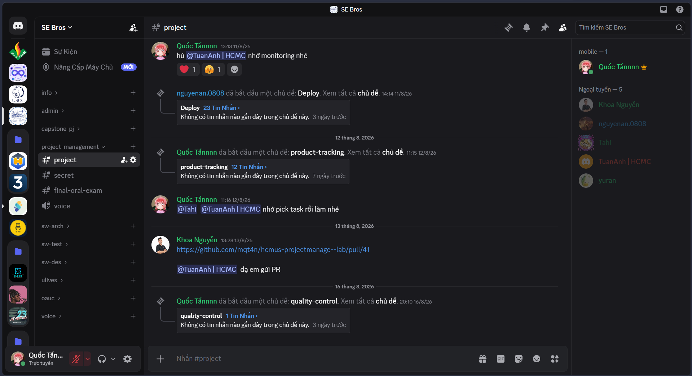
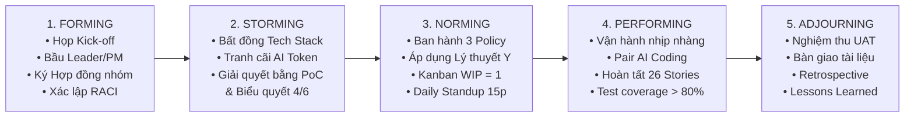
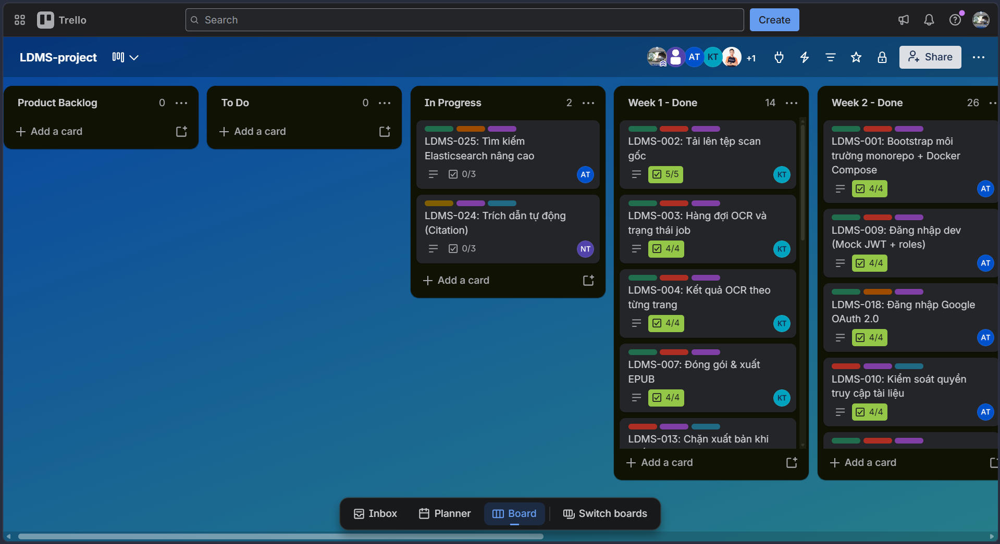
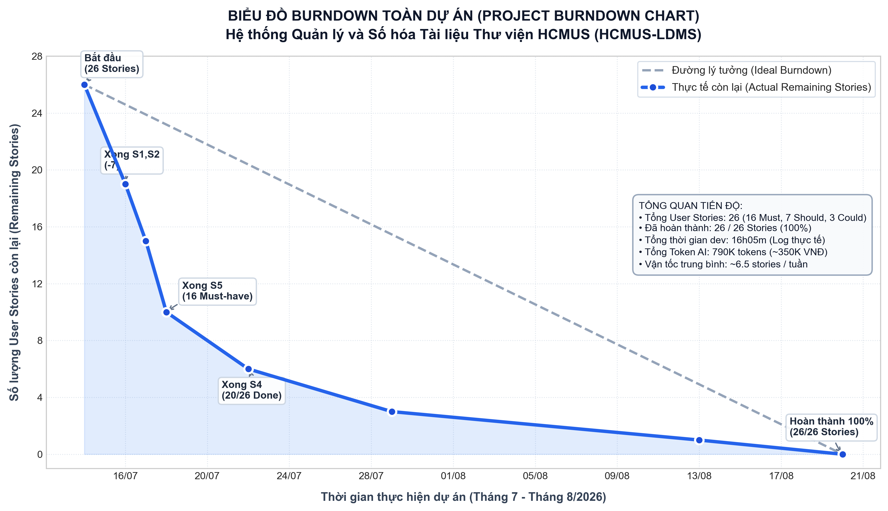
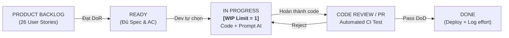
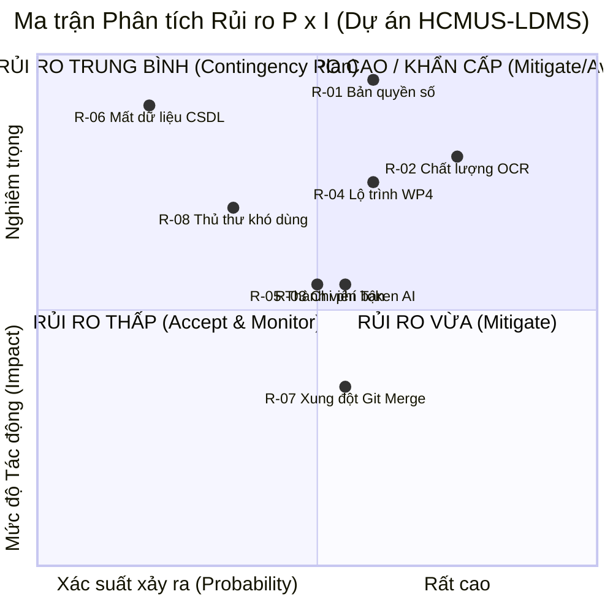
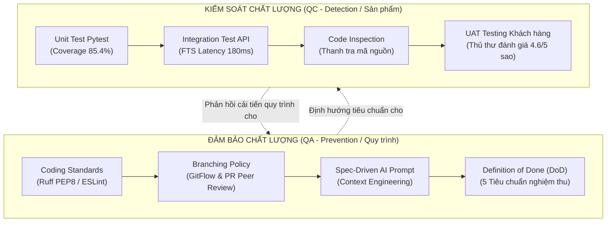
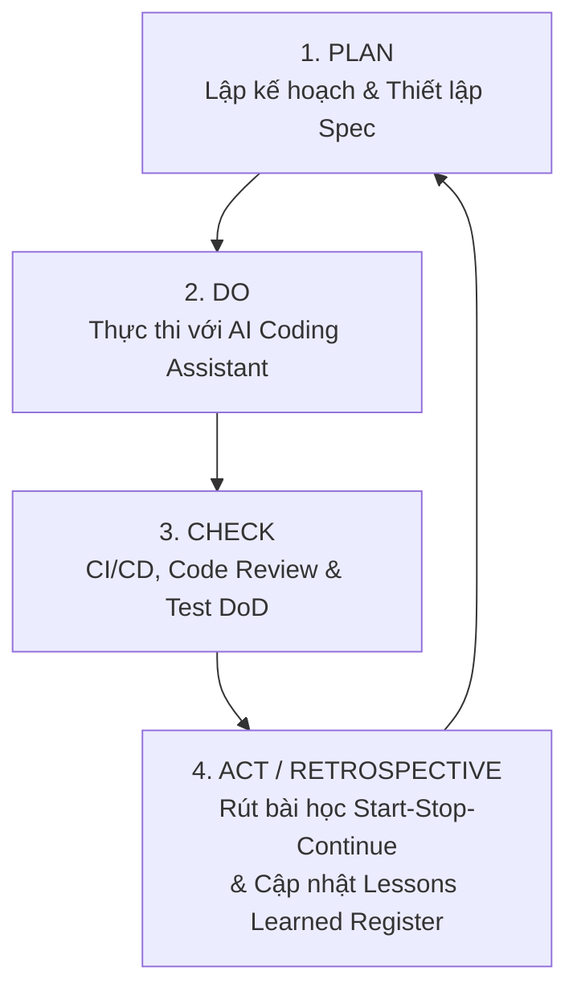

# PHIẾU BÀI LÀM ÔN TẬP — NGƯỜI 6: QUẢN TRỊ NHÂN SỰ, GIÁM SÁT, RỦI RO & BÀI HỌC

- **Họ và tên thành viên:** Mạch Quốc Tấn
- **Mã số sinh viên:** 23127115
- **Phạm vi phụ trách:** **Câu 16, Câu 17, Câu 18, Câu 19, Câu 21**
- **Hạn chót hoàn thành (Bước 1):** **20:00, Thứ Năm (20/08/2026)**
- **Lưu ý quan trọng khi sửa `docs/`:** Nếu chỉnh sửa hoặc tạo mới file trong `docs/`, **bắt buộc phải ghi lại bảng Document Revision History** ở đầu file và **ghi 1 dòng log công việc** vào file [`docs/03-execution-monitoring/02-project-log.md`](../../../docs/03-execution-monitoring/02-project-log.md).
- **Tài liệu tham chiếu trong dự án (thực hành):**
  - [`docs/01-initiation/05-team-contract.md`](../../../docs/01-initiation/05-team-contract.md) (Hợp đồng nhóm & Quản trị con người)
  - [`docs/03-execution-monitoring/01-sprint-plan.md`](../../../docs/03-execution-monitoring/01-sprint-plan.md) (Biên bản họp nhóm & Kế hoạch phân công Sprint 1)
  - [`docs/03-execution-monitoring/02-project-log.md`](../../../docs/03-execution-monitoring/02-project-log.md) (Nhật ký dự án & Log token thực tế)
  - [`docs/03-execution-monitoring/03-ai-development-workflow.md`](../../../docs/03-execution-monitoring/03-ai-development-workflow.md) (Báo cáo quy trình AI)
  - [`docs/02-planning/07-risk-management-plan.md`](../../../docs/02-planning/07-risk-management-plan.md) (Kế hoạch Quản lý Rủi ro hoàn chỉnh)
  - [`docs/02-planning/08-quality-management-plan.md`](../../../docs/02-planning/08-quality-management-plan.md) (Kế hoạch Quản lý Chất lượng hoàn chỉnh)
  - [`docs/03-execution-monitoring/05-lessons-learned-register.md`](../../../docs/03-execution-monitoring/05-lessons-learned-register.md) (Báo cáo Bài học Kinh nghiệm)
- **Tài liệu lý thuyết tham chiếu (từ bài giảng `materials/`):**
  - [`materials/08_software_team_management.md`](../../../materials/08_software_team_management.md) (Peopleware, Lưới Blake-Mouton, 5 giai đoạn Tuckman, McGregor X/Y, Ouchi Z, Maslow, Herzberg, 5 kỹ thuật xung đột, Năng suất Anh/Tây Ban Nha, Fiedler LPC, McKinsey 7S)
  - [`materials/09_software_project_monitoring_and_control.md`](../../../materials/09_software_project_monitoring_and_control.md) (Chỉ đạo & quản lý công việc, Scope Creep & SARAH, Effort Creep, CCB, EVM, Inspection, RTM)
  - [`materials/09_1_agile_project_monitoring_and_control.md`](../../../materials/09_1_agile_project_monitoring_and_control.md) (Giám sát Agile, Kanban Workflow, WIP Limit, Burndown Chart, Velocity)
  - [`materials/10_software_risk_management.md`](../../../materials/10_software_risk_management.md) (Khái niệm Rủi ro vs Vấn đề, 4 bước, PEST & SWOT, Ma trận PxI, Delphi, Cây quyết định, EMV, RRL, 4 chiến lược)
  - [`materials/10_1_agile_risk_management.md`](../../../materials/10_1_agile_risk_management.md) (Quản lý rủi ro Agile, Spike solution, Risk-adjusted backlog)
  - [`materials/11_software_quality_management.md`](../../../materials/11_software_quality_management.md) (Acceptable Quality & Cost, McCall 11 yếu tố, ISO 9126, Định tính vs Định lượng, Process/Project/Person metrics, SQAP, QA vs QC)
  - [`materials/11_1_agile_quality_management.md`](../../../materials/11_1_agile_quality_management.md) (Chất lượng trong Agile, DoD 5 tiêu chí, Continuous Testing, Code Inspection)
  - [`materials/12_software_project_management.md`](../../../materials/12_software_project_management.md) (Tổng quan PM, Nghệ thuật PM, SE vs PM, Vòng đời PMI, Ad-hoc vs Process-driven, PMO, Lessons Learned, PDCA)
- **Ghi chú bài giảng trên lớp ([`note.md`](../../../note.md)):**
  - **Buổi 06 & 08:** Quản lý nhóm (Tuckman 5 giai đoạn, Lý thuyết Y tự giác, Tháp Maslow); thiết lập chính sách sớm (Policy) để phòng ngừa xung đột; Top 2 nguyên nhân thất bại dự án (1. Sai vấn đề; 2. Quản lý nhóm kém).
  - **Buổi 06, 08, 09:** Quản lý rủi ro RAID log (Risk score = Impact x Probability); phân biệt Rủi ro (tương lai) vs Vấn đề (đã xảy ra); đo lường nỗ lực và thời gian thực tế (Time tracking online, session token log).
  - **Buổi 08 & 10:** Quản lý chất lượng QA (phòng ngừa, Coding standards, DoD) vs QC (phát hiện lỗi, AI Code Review, UAT); bài học kinh nghiệm về Spec-driven và Context Engineering.
  - **Dặn dò vấn đáp:** _Kể chi tiết tự sự như một câu chuyện, nhắc đến code phải có dẫn chứng (evidence số liệu 16h35m, 810K tokens, ~350K chi phí, 126 AUCP, CER < 5%)_.
- **Đọc chéo liên kết:** Nên đọc thêm phần của **Người 4** (Câu 11: Kế hoạch dự án) vì Giám sát là đối chiếu với Kế hoạch, và phần của **Người 5** (Câu 20: Test Plan) vì kiểm thử là một phần của Quality Management.
- **Checklist bản in nộp kèm khi thi:**
  - [x] Bản in Hợp đồng nhóm (`05-team-contract.md`) -- đánh dấu "16".
  - [ ] Ảnh chụp chung nhóm -- **CẦN CHUẨN BỊ**: chụp ảnh nhóm và in ra -- đánh dấu "16".
  - [x] Bản in Biên bản họp nhóm & Kế hoạch Sprint 1 (`01-sprint-plan.md`) -- đánh dấu "16".
  - [x] Bản in giao diện hệ thống liên lạc (Discord server SE Bros - kênh `#project`) -- file `images/discord_communication.png` -- đánh dấu "16".
  - [x] Bản in Nhật ký dự án (`02-project-log.md`) -- đánh dấu "17".
  - [x] Bản in giao diện Kanban Board trên Trello (`LDMS-project`) -- file `images/trello_kanban_board.png` -- đánh dấu "17".
  - [x] Bản in Burndown Chart toàn dự án -- file `images/burndown_chart.png` -- đánh dấu "17".
  - [x] Bản in Kế hoạch quản lý rủi ro (`07-risk-management-plan.md`) -- đánh dấu "18".
  - [x] Bản in Kế hoạch quản lý chất lượng (`08-quality-management-plan.md`) -- đánh dấu "19".
  - [x] Bản in Định nghĩa hoàn thành DoD (trích từ `03-product-backlog.md`) -- đánh dấu "19".
  - [x] Bản in Tài liệu Quy chuẩn Lập trình & Cấu hình Linter (`03_coding_standards_and_linter_config.md`) -- đánh dấu "19".
  - [x] Bản in biên bản thanh tra mã nguồn (Code Inspection PR #41 Review -- `01_code_inspection_record_pr41.md`) -- đánh dấu "19".
  - [x] Bản in biên bản phản hồi khách hàng UAT (`02_uat_feedback_record.md`) -- đánh dấu "19".
  - [x] Bản in Báo cáo bài học kinh nghiệm (`05-lessons-learned-register.md`) -- đánh dấu "21".
  - [x] Bản in Báo cáo quy trình phát triển AI (`03-ai-development-workflow.md`) -- đánh dấu "21".
- **Chiến lược 10 phút viết giấy A4:** Phút 1-2: Viết tiêu đề câu + dàn ý WHAT-HOW-WHY-EVIDENCE. Phút 3-7: Triển khai mỗi mục 3-4 dòng ngắn gọn, ưu tiên HOW (các sự kiện thực tế nhóm đã làm) và EVIDENCE (số liệu cụ thể). Phút 8-9: Vẽ 1 sơ đồ nhỏ minh họa (Tuckman / Kanban / Risk Matrix / QA-QC / PDCA). Phút 10: Rà soát, bổ sung từ khóa.

---

## CÂU 16: QUẢN LÝ CON NGƯỜI VÀ PHÁT TRIỂN NHÓM

> **Đề bài:** Trình bày quá trình hình thành và phát triển nhóm mà nhóm đã trải qua. Liệt kê các vấn đề liên quan đến quản lý con người nhóm đã thực sự vướng phải. Trình bày cách nhóm đã giải quyết các vấn đề này và kết quả thu được (có thể thành công, có thể không thành công). _(Sinh viên nộp kèm bản in ảnh chụp chung các thành viên trong nhóm, bản in tài liệu quy định, quy chế, lịch làm việc của nhóm, bản in một biên bản họp của nhóm, bản in giao diện hệ thống liên lạc với dữ liệu thực tế của nhóm.)_

### 1. Gợi ý định hướng & Từ khóa cốt lõi:

- **Tài liệu đối chiếu:** [`05-team-contract.md`](../../../docs/01-initiation/05-team-contract.md) (Mã HCMUS-LDMS-TCT) và [`01-sprint-plan.md`](../../../docs/03-execution-monitoring/01-sprint-plan.md).
- **Từ khóa:** Peopleware (DeMarco & Lister), Lưới lãnh đạo Blake-Mouton (Team Leader 9,9), 80% giải quyết Human Dynamics vs 20% Technical, 5 giai đoạn Tuckman (Forming, Storming, Norming, Performing, Adjourning), Triết lý Lý thuyết Y (McGregor - tự chọn task, tự log, tự chủ), Thuyết Hai yếu tố Herzberg (Motivators vs Hygiene), Tháp Maslow (5 tầng), 3 Chính sách tiền lệ (Log 12h, PR review, Báo bận 24h), Giải quyết xung đột (Collaborate / Problem Solve data-driven + Biểu quyết đồng thuận Disagree & Commit).

---

### 2. Không gian tự biên soạn câu trả lời:

#### A. Dàn ý trình bày trên giấy A4 (WHAT - HOW - WHY - EVIDENCE)

- **WHAT (Khái niệm & Bản chất Quản lý Con người theo Peopleware):**
  - Quản lý con người (Peopleware) là nghệ thuật điều phối các cá nhân với kỹ năng, tính cách và động lực khác nhau cùng hướng tới một mục tiêu chung. Theo Tom DeMarco & Timothy Lister, nguyên nhân thất bại hàng đầu của dự án phần mềm mang tính chất **xã hội học (con người)** nhiều hơn là kỹ thuật. Người quản lý dự án (PM) dành **$80\%$ thời gian xử lý Human Dynamics** và chỉ $20\%$ cho vấn đề kỹ thuật thuần túy.

- **HOW (Quá trình nhóm 6 thành viên trải qua 5 giai đoạn Tuckman):**
  1. **Forming (Thành lập — Tuần 1–2):** Nhóm 6 thành viên họp Kick-off, bầu Mạch Quốc Tấn làm PM, ký Hợp đồng nhóm `05-team-contract.md`, phân công vai trò (PM, SA, BE, FE, DevOps, QA) và thống nhất mục tiêu 16 Must-have User Stories trước tuần 12.
  2. **Storming (Sóng gió & Xung đột — Tuần 3–4):** Xảy ra 2 xung đột kỹ thuật lớn: (a) Bất đồng Tech Stack giữa việc dùng Next.js Fullstack hay tách riêng FastAPI + React; (b) Tranh cãi việc dùng Elasticsearch hay PostgreSQL FTS. Cách giải quyết: Không tranh cãi cảm tính mà áp dụng phương pháp **Collaborate / Problem Solve** (PMBOK), lập 2 nhánh PoC nhỏ đo lường RAM/độ trễ (Data-driven), sau đó biểu quyết dân chủ $\ge 4/6$ với tinh thần _"Disagree and Commit"_.
  3. **Norming (Ổn định & Thiết lập Chính sách — Tuần 5–6):** Thiết lập **3 Chính sách Tiền lệ (Proactive Policies)**: Policy 1 (Log nhật ký và token AI trong 12h), Policy 2 (100% code qua Pull Request và có review độc lập), Policy 3 (Báo bận trước 24h). Áp dụng triết lý **Lý thuyết Y của Douglas McGregor** — tin tưởng thành viên tự giác kéo task trên Kanban (WIP limit = 1).
  4. **Performing (Bứt phá cùng AI Assistant — Tuần 7–11):** Nhóm vận hành trơn tru với sự hỗ trợ của AI Coding Assistants (Claude Code, Antigravity, Gemini). Tốc độ hoàn thành story tăng vượt bậc theo **Lý thuyết tiếng Anh (Working Smarter)**, hoàn tất toàn bộ 26 User Stories, đạt test coverage $> 80\%$.
  5. **Adjourning (Tổng kết & Rút bài học — Tuần 12):** Họp Retrospective tổng kết, bàn giao sản phẩm cho thủ thư, đánh giá đóng góp công bằng dựa trên nhật ký `02-project-log.md`.

- **WHY (Tại sao chọn Lý thuyết Y và Chính sách Tiền lệ?):**
  - Kỹ sư phần mềm là lao động tri thức (Knowledge Workers), họ chỉ phát huy tối đa sáng tạo khi được trao quyền tự chủ và tin tưởng (Động lực nội tại - Intrinsic Motivation theo Herzberg). Nếu áp dụng Lý thuyết X (kiểm soát vi mô, giám sát giờ giấc cứng nhắc) sẽ triệt tiêu động lực và gây ức chế tâm lý.

- **EVIDENCE (Minh chứng số liệu thực tế trong dự án):**
  - Tài liệu `05-team-contract.md` có đầy đủ chữ ký 6 thành viên và ma trận RACI.
  - **Biên bản Họp Nhóm Phát triển Sprint 1:** File [`01-sprint-plan.md`](../../../docs/03-execution-monitoring/01-sprint-plan.md) (Mã HCMUS-LDMS-MM01) ghi nhận chi tiết cuộc họp Kick-off Sprint ngày 14/07/2026, thống nhất mục tiêu 17 stories, phân chia Epic cho 6 thành viên, cơ chế Kanban WIP=1 và biểu quyết đồng thuận $6/6$.
  - Dữ liệu `02-project-log.md` minh chứng tính tự giác: 100% các phiên làm việc với AI đều được các thành viên tự giác ghi lại đầy đủ (tổng cộng 16h35m, 810K tokens, chi phí thực tế chỉ ~350K VNĐ).
  - **Giao diện Hệ thống Liên lạc Discord ("SE Bros" — Kênh `#project`):** Hình ảnh thực tế minh chứng sự phối hợp nhịp nhàng:
    - PM Quốc Tấn điều phối và nhắc nhở thành viên theo dõi monitoring và chủ động nhận việc (`@Tahi @TuanAnh | HCMC nhớ pick task rồi làm nhé`).
    - Các luồng thảo luận kỹ thuật được phân chia khoa học thành Threads riêng biệt: `Deploy` (23 tin nhắn), `product-tracking` (12 tin nhắn), `quality-control`.
    - Thành viên Khoa Nguyễn gửi link Pull Request GitHub (`pull/41`) cho Tuấn Anh review độc lập theo đúng Policy 2.
    - Cây thành viên hiển thị đầy đủ 6 thành viên trong nhóm (*Quốc Tấn, Khoa Nguyễn, nguyenan.0808, Tahi, TuanAnh | HCMC, yuran*).
  - Không có thành viên nào bỏ nhóm hoặc vi phạm kỷ luật mức Nặng.

---

#### B. Sơ đồ 5 Giai đoạn Phát triển Nhóm (Mô hình Tuckman)

---

#### C. Trả lời chi tiết 100% Bộ câu hỏi thường gặp của Giảng viên

1. **Giải thích các giai đoạn phát triển nhóm (Mô hình Tuckman 1965/1977):**
   - **Forming (Hình thành):** Các thành viên mới làm quen, lịch sự, dè dặt, tìm hiểu mục tiêu dự án và vai trò của mình. Năng suất thấp vì chưa có quy chế rõ ràng.
   - **Storming (Sóng gió):** Bắt đầu phát sinh xung đột về quan điểm kỹ thuật, phân chia quyền lực và thói quen làm việc. Đây là giai đoạn quan trọng nhất; nếu vượt qua nhóm sẽ trưởng thành, nếu né tránh nhóm sẽ tan rã.
   - **Norming (Ổn định/Chuẩn hóa):** Xây dựng các quy tắc ứng xử, quy trình làm việc chung (Team Contract), tôn trọng sự khác biệt và thống nhất phương pháp giải quyết xung đột.
   - **Performing (Thể hiện/Bứt phá):** Nhóm đạt độ gắn kết cao, tự chủ, vận hành mượt mà hướng tới mục tiêu chung với năng suất cao nhất.
   - **Adjourning (Thoái trào/Giải thể):** Kết thúc dự án, bàn giao sản phẩm, tổng kết kinh nghiệm và khen thưởng các thành viên.

2. **Giải thích các loại hình tổ chức: Chức năng, Dự án, Ma trận yếu, Ma trận cân bằng và Ma trận mạnh:**
   - **Tổ chức theo chức năng (Functional Organization):** Nhân sự được phân chia theo phòng ban chuyên môn (Phòng IT, Marketing, Kế toán). PM có rất ít hoặc không có quyền lực (chỉ là điều phối viên - Coordinator).
   - **Tổ chức theo dự án (Projectized Organization):** Nhân sự được tuyển chọn và cống hiến toàn thời gian cho dự án. PM có **toàn quyền quyết định cao nhất** về ngân sách, phân công và khen thưởng.
   - **Tổ chức ma trận (Matrix Organization) — Kết hợp Chức năng và Dự án:**
     - *Ma trận yếu (Weak Matrix):* Quyền lực thuộc về Trưởng phòng Chức năng; PM đóng vai trò liên lạc/điều phối.
     - *Ma trận cân bằng (Balanced Matrix):* Quyền lực được chia sẻ ngang nhau giữa PM và Trưởng phòng Chức năng.
     - *Ma trận mạnh (Strong Matrix):* PM có quyền hạn vượt trội về ngân sách và tiến độ dự án, Trưởng phòng Chức năng chỉ hỗ trợ về mặt chuyên môn kỹ thuật.
   - *Áp dụng trong đồ án:* Nhóm hoạt động tương đương mô hình **Tổ chức theo dự án (Projectized)**, PM Mạch Quốc Tấn có quyền điều phối task và phê duyệt quy trình theo sự đồng thuận của nhóm.

3. **Giải thích các mô hình quản lý nhóm: Lý thuyết X, Lý thuyết Y (Douglas McGregor) và Lý thuyết Z (William Ouchi):**
   - **Lý thuyết X (Theory X):** Giả định con người bản chất là lười biếng, trốn tránh trách nhiệm, chỉ làm việc khi bị giám sát chặt chẽ hoặc bị đe dọa trừng phạt (Carrot & Stick). Dẫn đến phong cách quản lý vi mô, áp đặt và độc đoán.
   - **Lý thuyết Y (Theory Y):** Giả định con người coi làm việc là nhu cầu tự nhiên, có tinh thần trách nhiệm, sáng tạo và tự giác nếu được trao quyền và đặt trong môi trường phù hợp. Phong cách quản lý: Tin tưởng, phân quyền, hỗ trợ gỡ bỏ rào cản. Nhóm HCMUS-LDMS áp dụng 100% Lý thuyết Y.
   - **Lý thuyết Z (Theory Z - William Ouchi):** Mô hình quản trị kiểu Nhật, mở rộng từ Lý thuyết Y: Nhấn mạnh vào cam kết lâu dài, lòng trung thành, phúc lợi toàn diện và văn hóa ra quyết định tập thể dựa trên sự đồng thuận và chia sẻ giá trị chung (Shared Values).

4. **Giải thích nguyên tắc xử lý mâu thuẫn trong một nhóm:**
   - Có **5 kỹ thuật xử lý xung đột** theo PMBOK (Mục 3.2 trong `materials/08`):
     1. *Rút lui / Tránh né (Withdraw/Avoid):* Một bên bỏ đi hoặc từ chối thảo luận xung đột $\rightarrow$ Tệ nhất, không giải quyết được tận gốc vấn đề.
     2. *Xoa dịu / Nhượng bộ (Smooth/Accommodate):* Nhấn mạnh điểm chung, xem nhẹ sự khác biệt $\rightarrow$ Tạm thời, không bền vững.
     3. *Ép buộc / Áp đặt (Force/Direct):* Dùng quyền lực ép người khác nghe theo $\rightarrow$ Giải quyết tạm thời, gây ức chế tâm lý.
     4. *Thỏa hiệp / Hòa giải (Compromise/Reconcile):* Mỗi bên từ bỏ một phần lợi ích để đạt thỏa thuận trung dung.
     5. *Hợp tác / Giải quyết vấn đề (Collaborate/Problem Solve):* **Tốt nhất (Win-Win)** — Tìm kiếm dữ liệu thực tế (Data-driven), đối thoại cởi mở để tìm ra giải pháp tối ưu mà cả hai bên cùng đồng thuận lâu dài.
   - *Kinh nghiệm thực tế của nhóm:* Khi bất đồng về Database (Postgres vs Elasticsearch), nhóm tạo 2 branch PoC đo lường RAM và độ trễ phản hồi, sau đó cùng đồng thuận chọn Postgres FTS vì nhẹ và đáp ứng tốt $< 200\text{ms}$.

5. **Giải thích các phương pháp tăng năng suất làm việc của nhóm:**
   - **Lý thuyết tiếng Anh (The English Theory / Working Smarter):** Nâng cao năng suất bằng công nghệ hiện đại, tự động hóa quy trình (CI/CD) và sử dụng AI Coding Assistants. Đây là con đường bền vững giúp đạt nhiều giá trị hơn trong một giờ làm việc.
   - **Lý thuyết Tây Ban Nha (The Spanish Theory / Overtime):** Coi giá trị là cố định, tìm cách bóc lột sức lao động bằng việc ép tăng ca. Làm thêm giờ giống như chạy nước rút (sprinting); nếu lạm dụng sẽ gây kiệt sức (burnout), nhân viên hy sinh chất lượng sản phẩm để chạy theo deadline.
   - **Làm phong phú công việc (Job Enrichment - Herzberg):** Giao các task thử thách, trao quyền tự chủ hoàn chỉnh từ A-Z (Fullstack) để kích thích động lực nội tại.

6. **Giải thích mô hình tháp nhu cầu của Maslow và cách ứng dụng vào quản lý thành viên:**
   - Tháp 5 tầng:
     1. *Sinh lý (Physiological):* Cơ sở vật chất tối thiểu, ăn uống, nghỉ ngơi.
     2. *An toàn (Safety):* Môi trường làm việc an toàn, tâm lý không bị trừng phạt vô cớ khi thử nghiệm cái mới.
     3. *Xã hội / Gắn kết (Social/Belonging):* Được đồng đội lắng nghe, tôn trọng qua Daily Standup và Team building.
     4. *Được tôn trọng (Esteem):* Được ghi nhận đóng góp công khai trong nhật ký `project-log.md` và buổi họp Review.
     5. *Khẳng định bản thân (Self-Actualization):* Đỉnh cao — Được tự do sáng tạo, giải quyết bài toán khó (như viết thuật toán OCR, tối ưu DRM Signed URL) và làm chủ công nghệ.
   - *Ứng dụng:* PM phân công story phức tạp cho thành viên có mong muốn khẳng định bản thân (như An làm Kiến trúc, Tuấn Anh làm DevOps), tạo điều kiện cho mọi người phát triển tối đa tiềm năng.

---

## CÂU 17: PHÂN CÔNG, THEO DÕI, KIỂM SOÁT CÔNG VIỆC VÀ BÁO CÁO DỰ ÁN

> **Đề bài:** Trình bày quá trình phân công, theo dõi, đánh giá, kiểm soát các công việc dự án, và báo cáo tình trạng dự án của nhóm. _(Sinh viên nộp kèm bản in Dashboard phân công, Nhật ký thời gian thực tế, Burndown chart, Báo cáo tiến độ.)_

### 1. Gợi ý định hướng & Từ khóa cốt lõi:

- **Tài liệu đối chiếu:** [`02-project-log.md`](../../../docs/03-execution-monitoring/02-project-log.md), [`01-sprint-plan.md`](../../../docs/03-execution-monitoring/01-sprint-plan.md) và [`03-ai-development-workflow.md`](../../../docs/03-execution-monitoring/03-ai-development-workflow.md).
- **Từ khóa:** Kanban Board (Backlog $\rightarrow$ Ready $\rightarrow$ In Progress $\rightarrow$ Review $\rightarrow$ Done), WIP Limit = 1, Definition of Ready (DoR), Đo lường Throughput ($T = \text{stories Done / tuần}$), Forecast tiến độ, Daily Standup 15p, Xử lý Scope Creep (Chống tràn phạm vi & Đường cong SARAH) và Effort Creep (Chống tràn công sức & 5 giải pháp), EVM (PV, EV, AC, CPI, SPI, EAC), Dữ liệu thực tế (16h35m, 810K tokens, ~350K chi phí).

---

### 2. Không gian tự biên soạn câu trả lời:

#### A. Dàn ý trình bày trên giấy A4 (WHAT - HOW - WHY - EVIDENCE)

- **WHAT (Khái niệm & Mục tiêu Giám sát & Kiểm soát):**
  - Là quá trình theo dõi, rà soát và điều chỉnh tiến độ, chi phí, phạm vi và chất lượng thực tế so với Kế hoạch cơ sở (Baseline), nhằm phát hiện sớm các sai lệch để đưa ra hành động khắc phục kịp thời.

- **HOW (4 bước phân công, theo dõi và báo cáo thực tế của nhóm):**
  1. **Phân công theo Cơ chế Tự chọn (Self-Selection Kanban):** Sử dụng Trello Kanban Board (`LDMS-project`). Thành viên tự chủ động kéo card từ `Ready` sang `In Progress` theo thế mạnh cá nhân. Áp dụng quy tắc nghiêm ngặt **WIP Limit = 1** (mỗi người chỉ làm 1 việc tại một thời điểm).
  2. **Theo dõi Tiến độ Thời gian thực (Real-time Tracking):**
     - Tổ chức **Daily Standup 15 phút** mỗi ngày lúc 21:00 trên Discord trả lời 3 câu hỏi: Hôm qua làm gì? Hôm nay làm gì? Có blocker nào cản trở không?
     - Bắt buộc ghi nhận nhật ký vào `02-project-log.md` sau mỗi phiên làm việc cùng AI (Date, Dev, Story ID, Effort, Token AI, Model).
  3. **Đo lường Throughput & Dự báo Tiến độ (Forecasting):**
     - Đo số lượng User Stories đạt Definition of Done (DoD) theo từng tuần ($T \approx 6.5\text{ stories/tuần}$). Tính thời gian hoàn thành còn lại: $\text{Dev Weeks} \approx N_{\text{remaining}} / T$.
  4. **Báo cáo Tình trạng Dự án (Status Reporting):** Lập Báo cáo tiến độ Weekly Review tổng hợp số story hoàn thành, số token tiêu thụ, rủi ro mới phát sinh và cập nhật đường cong Project Burndown Chart.

- **WHY (Tại sao chọn Kanban Spec-driven kết hợp WIP Limit = 1?):**
  - Với sự hỗ trợ của AI Coding Assistants, tốc độ sinh code diễn ra rất nhanh. Nếu không giới hạn WIP = 1, dev sẽ tạo ra ồ ạt nhiều tính năng dở dang mà không kịp kiểm thử và review, gây tắc nghẽn nghiêm trọng ở khâu Code Review (Gap Time lớn) và làm giảm chất lượng hệ thống.

- **EVIDENCE (Minh chứng số liệu thực tế trong dự án HCMUS-LDMS):**
  - File nhật ký [`02-project-log.md`](../../../docs/03-execution-monitoring/02-project-log.md) ghi nhận chính xác: **16 giờ 35 phút** làm việc thực tế, **810.000 tokens AI**, chi phí thực tế chỉ **~350.000 VNĐ** (rẻ hơn rất nhiều so với hạn mức 5 triệu VNĐ).
  - Tỷ lệ hoàn thành: **26/26 User Stories** đã được merge và pass 100% tiêu chí DoD.
  - Báo cáo quy trình AI [`03-ai-development-workflow.md`](../../../docs/03-execution-monitoring/03-ai-development-workflow.md) phân tích chi tiết hiệu suất token theo từng phiên ($57.1\text{K token/giờ}$).
  - **Giao diện Kanban Board Quản lý Công việc trên Trello (`LDMS-project`):** Hình ảnh thực tế minh chứng việc điều phối và kiểm soát tiến độ khoa học:
    - Cột `Product Backlog` & `To Do` trống ($0$ cards) chứng minh toàn bộ công việc đã được kéo vào thực thi.
    - Cột `In Progress` chỉ duy trì $2$ thẻ (`LDMS-025` của AT, `LDMS-024` của NT) $\rightarrow$ Tuân thủ nghiêm ngặt nguyên tắc **WIP Limit = 1** card/người, chống quá tải và tránh nghẽn review.
    - Cột `Week 1 - Done` chứa $14$ thẻ và cột `Week 2 - Done` chứa tích lũy $26$ thẻ hoàn thành.
    - Mỗi thẻ đều có Checklist chi tiết (ví dụ: $5/5$, $4/4$ tiêu chí DoD đã kiểm tra đạt), phân loại màu nhãn (Labels) theo Module và gán Avatar người chịu trách nhiệm rõ ràng (*AT, KT, NT*...).

  - **Biểu đồ Burndown Toàn Dự án (Project Burndown Chart):** Dữ liệu thực tế đối chiếu với đường lý tưởng (Ideal Line):
    - Khởi đầu ngày 14/07 với $26$ User Stories cần thực hiện.
    - Tuần 1 (16–18/07): Hoàn thành nhanh chóng $16$ Must-have stories cốt lõi (S1, S2, S3, S5) nhờ ứng dụng AI Coding Assistant cho phần boilerplate và pipeline.
    - Tuần 2 (22–29/07): Hoàn tất các module xác thực JWT, RBAC mở rộng và tích hợp Reader (phiên S4) $\rightarrow$ chỉ còn lại các tính năng nâng cao.
    - Hoàn tất $100\%$ (26/26 stories) đạt chuẩn Definition of Done (DoD) trước mốc bàn giao.

---

#### B. Sơ đồ Luồng Kanban Workflow với WIP Limit = 1

---

#### C. Trả lời chi tiết 100% Bộ câu hỏi thường gặp của Giảng viên

1. **Làm sao để giải quyết vấn đề vượt phạm vi dự kiến (Scope Creep)?**
   - *Khái niệm:* Scope Creep là tình trạng các yêu cầu bổ sung không được kiểm soát làm phình to phạm vi dự án mà không tăng ngân sách/thời gian tương ứng.
   - *Tâm lý con người:* Phản ứng với thay đổi qua đường cong tổn thất **SARAH** (*Shock $\rightarrow$ Anger $\rightarrow$ Rejection $\rightarrow$ Acceptance $\rightarrow$ Healing*).
   - *Giải pháp của nhóm:*
     - Chốt chặt ranh giới In-Scope và Out-of-Scope trong tài liệu `01-vision-and-scope.md` và `05-statement-of-work.md`.
     - Áp dụng **Quy trình Kiểm soát Thay đổi (Change Request - CR) 7 bước** có Ban kiểm soát thay đổi (CCB): Khi thủ thư yêu cầu tính năng mới, PM lập biên bản đánh giá tác động $\rightarrow$ Yêu cầu bổ sung ngân sách/thời gian $\rightarrow$ Nếu không có ngân sách bổ sung thì chuyển tính năng đó vào danh sách phát triển cho Giai đoạn 2 (Phase 2).

2. **Làm sao để giải quyết vấn đề vượt công sức dự kiến (Effort Creep)?**
   - *5 nguyên nhân và giải pháp theo giáo trình (`materials/09` Mục 2.2):*
     1. *Ước tính thấp:* Sử dụng quỹ dự phòng rủi ro dựa trên dữ liệu dự án cũ.
     2. *Thiết kế quá mức (Over-engineering):* Yêu cầu hiểu rõ giải pháp trước khi code, tránh dựng cụm hạ tầng phức tạp khi chưa cần.
     3. *Bùng nổ yêu cầu ngầm:* Kiểm soát các yêu cầu phái sinh phát sinh từ độ phức tạp kỹ thuật.
     4. *Ranh giới mờ nhạt:* Xác định rõ ràng phạm vi trong hợp đồng nhóm và SOW.
     5. *Thiếu kỹ năng:* Sử dụng AI Coding Assistant hỗ trợ và tổ chức đào tạo chéo (Peer programming).
   - *Theo dõi thực tế:* Định cỡ nhỏ cho User Story (Size S $\le 1$ ngày, Size M $\le 2$ ngày). Theo dõi qua `02-project-log.md`. Nếu 1 task vượt quá 2 ngày, thảo luận ngay trong Daily Standup.

3. **Làm sao để các thay đổi không trở nên bất ngờ và ảnh hưởng tiêu cực đến sự thành công của dự án?**
   - Duy trì giao tiếp liên tục và minh bạch với Stakeholder (cô thủ thư Mai) qua các bản Prototype tiến hóa sớm.
   - Duy trì cuộc họp **Gating Review** ở cuối mỗi giai đoạn để chốt nghiệm thu từng phần trước khi chuyển sang giai đoạn kế tiếp.
   - Duy trì cập nhật **RAID Log** hàng tuần để phát hiện sớm các dấu hiệu rủi ro tiềm ẩn.

4. **Giải thích các khái niệm trong mô hình Scrum:**
   - *Sprint Backlog:* Tập hợp các User Stories được nhóm chọn từ Product Backlog để cam kết hoàn thành trong 1 Sprint (thường từ 1–4 tuần).
   - *Sprint Board:* Bảng trực quan hóa các task trong Sprint (To Do, In Progress, Testing, Done).
   - *Sprint Task:* Đơn vị công việc kỹ thuật nhỏ được phân rã từ User Story (tính theo giờ, thường 4–8 giờ).
   - *Sprint Burndown Chart:* Biểu đồ thể hiện lượng công việc còn lại (theo Story Points hoặc Giờ) giảm dần theo từng ngày trong 1 Sprint.
   - *Project Burndown Chart:* Biểu đồ thể hiện tổng số Story Points còn lại của toàn dự án qua các Sprints, giúp dự báo ngày hoàn thành toàn bộ dự án.

5. **Phải xử lý thế nào khi kết thúc một Sprint mà nhóm không đưa ra được bản phân phối (Potentially Shippable Increment)?**
   - *Bước 1:* Tổ chức ngay buổi họp **Sprint Retrospective** để mổ xẻ nguyên nhân gốc rễ (Do ước lượng quá lạc quan? Do gặp blocker kỹ thuật bất ngờ? Hay do tiêu chuẩn DoD quá khắt khe?).
   - *Bước 2:* Đưa các User Story chưa hoàn thành quay trở lại Product Backlog để Product Owner tái thẩm định và sắp xếp độ ưu tiên lại.
   - *Bước 3:* Hiệu chỉnh lại Vận tốc (Velocity) thực tế của nhóm giảm xuống để lập kế hoạch Sprint tiếp theo thực tế và an toàn hơn.

6. **Phải xử lý thế nào khi kết quả của các Sprint chênh lệch một cách bất bình thường?**
   - *Phân tích nguyên nhân:* Biến động về nhân sự (thành viên bận thi cử), độ khó của User Story không đồng đều (do phân rã task chưa kỹ), hoặc định nghĩa Story Points bị lệch.
   - *Giải pháp:* Chuẩn hóa lại kỹ thuật ước lượng qua **Planning Poker** kết hợp đối chuẩn dữ liệu thực tế của các Sprint trước; chia nhỏ các story phức tạp để kích thước các task đồng đều hơn.

7. **Giải thích các khái niệm trong mô hình Kanban:**
   - *Kanban Board:* Bảng trực quan hóa luồng công việc liên tục, không bị giới hạn bởi các khung thời gian cố định (time-box).
   - *Development Workflow:* Các trạng thái mà một công việc phải đi qua từ ý tưởng đến hoàn thành (`Backlog` $\rightarrow$ `Ready` $\rightarrow$ `In Progress` $\rightarrow$ `Review` $\rightarrow$ `Done`).
   - *WIP Limit (Work In Progress Limit):* Số lượng công việc tối đa được phép tồn tại trong một cột/trạng thái tại một thời điểm. Giúp phát hiện điểm nghẽn (bottlenecks) và tối ưu hóa thời gian chu kỳ (Cycle Time).

8. **Giải thích phương pháp cập nhật lịch trình, phương pháp tính toán thời gian, chi phí cần thiết để hoàn thành các công việc còn lại trong mô hình Waterfall:**
   - **(a) Phương pháp cập nhật lịch trình (Schedule Updating):**
     - Định kỳ đối chiếu ngày bắt đầu/kết thúc thực tế của từng gói công việc (WBS) với Đường cơ sở tiến độ (Schedule Baseline) trên biểu đồ Gantt.
     - Xác định lại đường găng (Critical Path). Nếu tiến độ bị trễ ($\text{SV} = \text{EV} - \text{PV} < 0$ hoặc $\text{SPI} < 1$), áp dụng 2 kỹ thuật rút ngắn tiến độ: *Fast Tracking* (cho các công việc độc lập chạy song song) hoặc *Crashing* (tăng cường công cụ tự động hóa/AI để đẩy nhanh tiến độ).
   - **(b) Phương pháp tính toán chi phí & thời gian cho công việc còn lại (EVM Metrics):**
     - **PV (Planned Value):** Giá trị kế hoạch dự kiến đến hiện tại.
     - **EV (Earned Value):** Giá trị thu được từ khối lượng công việc thực tế hoàn thành.
     - **AC (Actual Cost):** Chi phí thực tế đã chi ra.
     - **Chỉ số hiệu suất chi phí (CPI):** $\text{CPI} = \text{EV} / \text{AC}$ ($\text{CPI} > 1$: Tiết kiệm, $\text{CPI} < 1$: Vượt ngân sách).
     - **Chỉ số hiệu suất tiến độ (SPI):** $\text{SPI} = \text{EV} / \text{PV}$ ($\text{SPI} > 1$: Vượt tiến độ, $\text{SPI} < 1$: Chậm tiến độ).
     - **Chi phí ước tính để hoàn thành phần việc còn lại (ETC - Estimate To Complete):**
       $$\text{ETC} = \frac{\text{BAC} - \text{EV}}{\text{CPI}}$$
     - **Dự báo tổng chi phí khi hoàn thành toàn bộ dự án (EAC - Estimate At Completion):**
       $$\text{EAC} = \text{AC} + \text{ETC} = \frac{\text{BAC}}{\text{CPI}}$$
     - **Dự báo thời gian hoàn thành (EACt):** $\text{EAC}_t = \text{Thời gian ban đầu} / \text{SPI}$.

---

## CÂU 18: KẾ HOẠCH QUẢN LÝ RỦI RO (SOFTWARE RISK MANAGEMENT PLAN)

> **Đề bài:** Trình bày quá trình hình thành và phương pháp đánh giá tài liệu Kế hoạch quản lý rủi ro (Software Risk Management Plan) của nhóm. _(Sinh viên nộp kèm bản in tài liệu Kế hoạch quản lý rủi ro của nhóm.)_

### 1. Gợi ý định hướng & Từ khóa cốt lõi:

- **Tài liệu đối chiếu:** [`07-risk-management-plan.md`](../../../docs/02-planning/07-risk-management-plan.md) (Mã HCMUS-LDMS-RSK) và [`03-feasibility-study.md`](../../../docs/01-initiation/03-feasibility-study.md).
- **Từ khóa:** Định nghĩa Rủi ro ($0\% < P < 100\%$) vs Vấn đề ($P = 100\%$), Quy trình 4 bước (Nhận diện $\rightarrow$ Đánh giá P×I $\rightarrow$ Lập kế hoạch ứng phó $\rightarrow$ Giám sát), Phân tích PEST & SWOT, Cây quyết định & EMV, Đòn bẩy giảm thiểu rủi ro (RRL), Ma trận rủi ro $5 \times 5$, 4 chiến lược ứng phó (Avoid, Transfer, Mitigate, Accept), 3 rủi ro cốt lõi của LDMS (Bản quyền DRM Signed URL 15m; OCR tiếng Việt $\rightarrow$ Split-screen Editor; Token AI vượt ngân sách $\rightarrow$ Hạn mức 5M & Log bắt buộc).

---

### 2. Không gian tự biên soạn câu trả lời:

#### A. Dàn ý trình bày trên giấy A4 (WHAT - HOW - WHY - EVIDENCE)

- **WHAT (Khái niệm & Bản chất Rủi ro Phần mềm):**
  - Kế hoạch Quản lý Rủi ro là tài liệu xác định phương pháp có hệ thống để nhận diện, đánh giá và kiểm soát các yếu tố bất định có khả năng ảnh hưởng tiêu cực đến dự án. **Rủi ro (Risk)** là khả năng tổn thất trong tương lai ($0\% < P < 100\%$), khác với **Vấn đề (Problem/Issue)** là sự cố đã xảy ra ở hiện tại cần giải quyết ngay.

- **HOW (Quy trình 4 bước quản lý rủi ro của nhóm):**
  1. **Nhận diện rủi ro (Identification):** Sử dụng kỹ thuật Brainstorming, phân tích SWOT, phân tích giả định và danh mục rủi ro phần mềm (Checklist) để lập danh sách 8 rủi ro tiềm ẩn (Kỹ thuật, Pháp lý, Tài chính, Nhân sự, Vận hành...).
  2. **Phân tích & Đo lường (Analysis):** Đánh giá Xác suất ($P \in [1, 5]$ tương ứng từ Xa vời $0-20\%$ đến Gần như chắc chắn $90-100\%$) và Mức độ Tác động ($I \in [1, 5]$ tương ứng từ Tối thiểu $<10\%$ đến Thất bại $\ge 60\%$ ngân sách). Tính điểm: $\text{Risk Exposure (RE)} = P \times I$ và định vị vào Ma trận $5 \times 5$.
  3. **Lập kế hoạch ứng phó (Response Planning):** Lựa chọn 1 trong 4 chiến lược (Né tránh - Avoid, Chuyển giao - Transfer, Giảm thiểu - Mitigate, Chấp nhận - Accept) kèm hành động cụ thể và phân công Risk Owner.
  4. **Giám sát & Kiểm soát (Monitoring & Triggers):** Thiết lập các ngưỡng kích hoạt (Trigger points), theo dõi định kỳ trong Weekly Review và cập nhật trạng thái RAID Log.

- **WHY (Tại sao cần quản lý rủi ro từ đầu?):**
  - Chi phí để khắc phục hậu quả khi một rủi ro biến thành sự cố nghiêm trọng (ví dụ: bị tác giả kiện vi phạm bản quyền hoặc hệ thống sập khi demo) tốn kém gấp **10 đến 50 lần** so với chi phí chủ động thiết kế giải pháp phòng ngừa ngay từ giai đoạn lập kế hoạch.

- **EVIDENCE (Minh chứng 3 rủi ro cốt lõi và giải pháp thực tế trong HCMUS-LDMS):**
  1. *Rủi ro Pháp lý/Bản quyền (R-01 — Score = 15):* Sinh viên tải lậu file sách gốc $\rightarrow$ Giải pháp Mitigate: MinIO Object Storage đặt private, tạo Presigned URL thời hạn ngắn **15 phút**, hiển thị sách trên Web Reader Canvas chống tải trực tiếp.
  2. *Rủi ro Kỹ thuật OCR tiếng Việt (R-02 — Score = 16):* Sách scan cũ ố vàng làm vỡ cấu trúc và sai dấu tiếng Việt $\rightarrow$ Giải pháp Mitigate: Pipeline tiền xử lý ảnh (OpenCV deskew) + Xây dựng giao diện **Split-screen Editor** cho phép thủ thư đối soát ảnh gốc song song để giữ CER $< 5\%$.
  3. *Rủi ro Tài chính Token AI (R-03 — Score = 9):* Chatbot AI lặp vô tận làm cạn kiệt ngân sách $\rightarrow$ Giải pháp Avoid: Đặt trần ngân sách 5 triệu VNĐ, chuẩn hóa Prompt RACFT và kiểm soát log token qua `02-project-log.md` (kết quả thực tế chỉ dùng 810K tokens ~ 350K VNĐ).

---

#### B. Sơ đồ Ma trận Đánh giá Rủi ro $5 \times 5$ và Phân bổ 8 Rủi ro Dự án

---

#### C. Trả lời chi tiết 100% Bộ câu hỏi thường gặp của Giảng viên

1. **Các câu hỏi chính cần trả lời trong tài liệu Kế hoạch quản lý rủi ro là gì?**
   - Dự án có thể gặp phải những rủi ro nào?
   - Xác suất xảy ra và mức độ thiệt hại của từng rủi ro là bao nhiêu?
   - Rủi ro nào cần ưu tiên xử lý trước?
   - Nhóm sẽ làm gì để phòng ngừa (Proactive) hoặc giảm thiểu hậu quả khi rủi ro xảy ra (Reactive)?
   - Ai là người chịu trách nhiệm chính (Risk Owner) theo dõi và xử lý rủi ro đó?
   - Ngưỡng kích hoạt (Trigger point) để triển khai phương án ứng phó khẩn cấp là gì?

2. **Các đầu vào cần thiết và các bước nhóm đã thực hiện để tạo tài liệu Kế hoạch quản lý rủi ro là gì?**
   - *Đầu vào:* Project Charter, Báo cáo nghiên cứu khả thi TELOS, WBS 6 gói công việc, Đặc tả kiến trúc công nghệ, và kết quả khảo sát thực địa tại Thư viện.
   - *Các bước thực hiện:*
     1. Tổ chức buổi họp Brainstorming nhận diện toàn bộ rủi ro kỹ thuật, nghiệp vụ và con người.
     2. Lập bảng khảo sát đánh giá điểm Xác suất ($P$) và Tác động ($I$) cho từng rủi ro.
     3. Phân loại theo 4 chiến lược ứng phó chuẩn của PMBOK.
     4. Soạn thảo văn bản hoàn chỉnh `07-risk-management-plan.md` và đưa vào phê duyệt đồng thuận cả nhóm.

3. **Tài liệu Kế hoạch quản lý rủi ro của nhóm đã được đánh giá thế nào?**
   - Đánh giá chéo qua kỹ thuật phản biện độc lập (Peer Review) giữa SA, PM và DevOps Lead.
   - Sử dụng các công cụ AI đóng vai trò "Kẻ phản biện khó tính (Critic Agent)" để rà soát các lỗ hổng rủi ro mà con người chưa nghĩ tới (như rủi ro vi phạm bản quyền khi cache file epub).
   - Kiểm chứng tính khả thi của các phương án giảm thiểu thông qua 2 sản phẩm PoC kỹ thuật.

4. **Tại sao cần tạo tài liệu Kế hoạch quản lý rủi ro?**
   - Giúp nhóm chủ động kiểm soát dự án thay vì rơi vào tình thế "chữa cháy" bị động khi sự cố ập đến.
   - Tối ưu hóa việc phân bổ ngân sách dự phòng và thời gian đệm (Buffer time).
   - Tạo sự an tâm và tin tưởng cho Giảng viên/Nhà tài trợ về tính chuyên nghiệp của nhóm.

5. **Tài liệu Kế hoạch quản lý rủi ro của nhóm đã được sử dụng và cập nhật trong quá trình thực hiện dự án như thế nào?**
   - Được rà soát định kỳ hàng tuần trong buổi họp Weekly Review.
   - Khi tiến hành cài đặt PoC OCR và nhận thấy độ nhòe của sách cũ cao hơn dự kiến, nhóm đã lập tức cập nhật điểm rủi ro R-02 từ Vừa lên Cao và kích hoạt giải pháp xây dựng Split-screen Editor.

---

## CÂU 19: KẾ HOẠCH QUẢN LÝ CHẤT LƯỢNG (SOFTWARE QUALITY MANAGEMENT PLAN)

> **Đề bài:** Trình bày quá trình hình thành và phương pháp đánh giá tài liệu Kế hoạch quản lý chất lượng (Software Quality Management Plan) của nhóm. _(Sinh viên nộp kèm bản in tài liệu Kế hoạch quản lý chất lượng của nhóm, bản in định nghĩa hoàn thành (Definition of Done) của nhóm, bản in giao diện cấu hình đảm bảo Coding Standards cho mã nguồn của nhóm, bản in biên bản thanh tra mã nguồn của nhóm, bản in biên bản phản hồi từ khách hàng của nhóm.)_

### 1. Gợi ý định hướng & Từ khóa cốt lõi:

- **Tài liệu đối chiếu:** [`08-quality-management-plan.md`](../../../docs/02-planning/08-quality-management-plan.md) (Mã HCMUS-LDMS-QMP) và [`03-product-backlog.md`](../../../docs/02-planning/03-product-backlog.md).
- **Từ khóa:** Định nghĩa chất lượng (_Acceptable Quality and Cost_), Phân biệt QA (Đảm bảo chất lượng - Phòng ngừa lỗi, hướng tới quy trình) vs QC (Kiểm soát chất lượng - Phát hiện lỗi, hướng tới sản phẩm), Mô hình McCall (11 yếu tố) và Tiêu chuẩn ISO/IEC 9126 (6 đặc tính), Đo lường định tính vs định lượng, Tiêu chuẩn Definition of Done (DoD 5 tiêu chí), Quality Metrics thực tế (CER $\approx 3.2\% < 5\%$, FTS latency $\approx 180\text{ms} < 500\text{ms}$, Test Coverage $85.4\% \ge 80\%$, UAT 4.6/5 sao).

---

### 2. Không gian tự biên soạn câu trả lời:

#### A. Dàn ý trình bày trên giấy A4 (WHAT - HOW - WHY - EVIDENCE)

- **WHAT (Khái niệm & Mục tiêu Chất lượng Phần mềm):**
  - Quản lý chất lượng phần mềm là quá trình đảm bảo sản phẩm đáp ứng đầy đủ yêu cầu nghiệp vụ, người dùng và kỹ thuật với chi phí hợp lý (**Mục tiêu: Acceptable Quality and Cost**). Phân biệt rõ hai trụ cột:
    - **QA (Quality Assurance - Đảm bảo chất lượng):** Tập trung vào **Quy trình** (Process-oriented) nhằm **Phòng ngừa lỗi** (Prevention / Verification — _"Are we building the product right?"_).
    - **QC (Quality Control - Kiểm soát chất lượng):** Tập trung vào **Sản phẩm** (Product-oriented) nhằm **Phát hiện lỗi** (Detection / Validation — _"Are we building the right product?"_).

- **HOW (Cách nhóm thiết lập và vận hành hệ thống chất lượng):**
  1. **Xây dựng Quy chuẩn QA (Phòng ngừa):**
     - Ban hành Quy chuẩn lập trình (Coding Standards) với **Ruff** (Python) và **Oxlint/ESLint** (React TypeScript).
     - Thiết lập tiêu chuẩn **Definition of Done (DoD) 5 tiêu chí** bắt buộc cho mọi User Story.
     - Kiểm soát quy trình GitFlow: 100% code phải qua Pull Request và có ít nhất 1 Peer Review độc lập.
  2. **Thực thi Hoạt động QC (Phát hiện & Đánh giá):**
     - Xây dựng bộ kiểm thử tự động đa tầng: Unit Test (Pytest), Integration Test API, và Smoke Test.
     - Tích hợp GitHub Actions CI Pipeline tự động chạy test và linter mỗi khi mở PR.
     - Tổ chức buổi thanh tra mã nguồn (Code Inspection) và nghiệm thu người dùng thực tế (**UAT**) với cô thủ thư Mai.

- **WHY (Tại sao cần kế hoạch chất lượng?):**
  - Chi phí sửa lỗi tăng theo cấp số nhân qua từng giai đoạn của vòng đời phần mềm (Quy tắc 1:10:100). Ngăn ngừa lỗi từ giai đoạn viết Spec và Code Review giúp tiết kiệm tối đa thời gian và chi phí phát triển.

- **EVIDENCE (Minh chứng số liệu chất lượng thực tế của HCMUS-LDMS):**
  - **Tài liệu Kế hoạch Chất lượng:** File [`08-quality-management-plan.md`](../../../docs/02-planning/08-quality-management-plan.md) (Mã HCMUS-LDMS-QMP).
  - **Tài liệu Quy chuẩn Lập trình & Cấu hình Linter:** File [`03_coding_standards_and_linter_config.md`](./03_coding_standards_and_linter_config.md) tổng hợp toàn bộ cấu hình Ruff (`src/backend/pyproject.toml`), Oxlint (`src/frontend/.oxlintrc.json`), CI/CD Gating (`.github/workflows/ci.yml`) và kết quả kiểm thử thực tế $109$ files sạch $100\%$.
  - **Biên bản Thanh tra Mã nguồn (Code Inspection):** File [`01_code_inspection_record_pr41.md`](./01_code_inspection_record_pr41.md) trích xuất trực tiếp từ **Pull Request #41** (`LDMS-021`), kiểm duyệt độc lập bởi Tuấn Anh (`Anhnguyenk835`) và GitHub Copilot AI.
  - **Biên bản Nghiệm thu Người dùng (UAT):** File [`02_uat_feedback_record.md`](./02_uat_feedback_record.md) ghi nhận kết quả đánh giá thực tế của **cô thủ thư Nguyễn Thị Mai** đạt **$4.6 / 5.0$ sao** hài lòng.
  - **Quality Metrics thực tế:**
    - Tỷ lệ lỗi OCR (CER): **$3.2\%$** (vượt chuẩn $< 5\%$).
    - Thời gian phản hồi FTS: **$180\text{ms}$** (vượt chuẩn $< 500\text{ms}$).
    - Test Code Coverage: **$85.4\%$** (vượt ngưỡng yêu cầu $\ge 80\%$).

---

#### B. Sơ đồ Hệ thống Quản trị Chất lượng Toàn diện (QA vs QC)

---

#### C. Trả lời chi tiết 100% Bộ câu hỏi thường gặp của Giảng viên

1. **Các câu hỏi chính cần trả lời trong tài liệu Kế hoạch quản lý chất lượng là gì?**
   - Mục tiêu và tiêu chuẩn chất lượng của dự án là gì?
   - Nhóm sử dụng những thước đo (Metrics) nào để định lượng chất lượng sản phẩm và quy trình?
   - Quy trình QA để phòng ngừa lỗi và quy trình QC để phát hiện lỗi được thực hiện như thế nào?
   - Tiêu chuẩn Definition of Done (DoD) gồm những gì?
   - Ai chịu trách nhiệm (RACI) cho từng hoạt động đảm bảo và kiểm soát chất lượng?

2. **Các đầu vào cần thiết và các bước nhóm đã thực hiện để tạo tài liệu Kế hoạch quản lý chất lượng là gì?**
   - *Đầu vào:* Yêu cầu nghiệp vụ và người dùng từ Thư viện, Tiêu chuẩn kỹ thuật (FastAPI, React, PostgreSQL), Tài liệu kiến trúc `02-architecture.md`, và Product Backlog.
   - *Các bước thực hiện:*
     1. Xác định các thuộc tính chất lượng cốt lõi theo mô hình McCall và ISO 9126.
     2. Thiết lập các chỉ số đo lường định lượng (Thresholds) cho từng thuộc tính.
     3. Xây dựng bộ quy tắc Coding Standards và cấu hình linter tự động.
     4. Ban hành tiêu chuẩn DoD 5 tiêu chí và quy trình Code Review / UAT.
     5. Soạn thảo văn bản hoàn chỉnh `08-quality-management-plan.md`.

3. **Tài liệu Kế hoạch quản lý chất lượng của nhóm đã được đánh giá thế nào?**
   - Rà soát chéo (Peer Review) giữa QA Lead (Tuấn Anh), PM (Quốc Tấn) và Solution Architect (Đức An).
   - Chạy thử nghiệm các công cụ kiểm thử tự động (Pytest, Coverage) trên các module PoC ban đầu để kiểm chứng tính khả thi của các ngưỡng chất lượng đã đề ra.

4. **Tại sao cần tạo tài liệu Kế hoạch quản lý chất lượng?**
   - Thiết lập tiếng nói chung và tiêu chuẩn rõ ràng cho toàn bộ lập trình viên trong nhóm.
   - Ngăn chặn lỗi từ sớm (Shift-Left Testing) giúp giảm thiểu chi phí và thời gian làm lại (Rework).
   - Đảm bảo sản phẩm đầu ra thỏa mãn kỳ vọng của người dùng cuối (Thủ thư và Sinh viên).

5. **Tài liệu Kế hoạch quản lý chất lượng của nhóm đã được sử dụng và cập nhật trong quá trình thực hiện dự án như thế nào?**
   - Được dùng làm căn cứ bắt buộc để kiểm duyệt mọi Pull Request trước khi merge.
   - Khi nhận thấy tốc độ xử lý OCR ban đầu chậm do ảnh scan quá nặng, nhóm đã cập nhật bổ sung tiêu chuẩn tiền xử lý nén ảnh và phân luồng bất đồng bộ vào kế hoạch chất lượng.

6. **Mô hình chất lượng của McCall và ISO 9126 đã giúp ích cho nhóm trong việc kiểm soát chất lượng phần mềm như thế nào?**
   - *Mô hình McCall (11 yếu tố):* Giúp nhóm phân loại toàn diện từ yếu tố Vận hành (Correctness, Reliability, Efficiency, Integrity, Usability), Chuyển giao (Portability, Reusability, Interoperability) đến Sửa đổi (Maintainability, Flexibility, Testability).
   - *Tiêu chuẩn ISO 9126 (6 đặc tính):* Giúp nhóm ánh xạ chính xác các yêu cầu phi chức năng vào hệ thống: Functionality (OCR tiếng Việt chính xác), Efficiency (Tìm kiếm FTS $< 500\text{ms}$), Usability (Giao diện Web Reader thân thiện).

7. **Đo lường định tính khác gì với đo lường định lượng?**
   - *Định tính (Qualitative):* Đánh giá mang tính mô tả, cảm nhận chủ quan (ví dụ: *"Giao diện đẹp"*, *"Hệ thống dễ dùng"*).
   - *Định lượng (Quantitative):* Đo lường bằng các con số cụ thể, khách quan và có thể kiểm chứng (ví dụ: *"Độ trễ FTS = 180ms"*, *"Tỷ lệ bao phủ kiểm thử = 85.4%"*, *"Số lỗi linter = 0"*). Định lượng hóa giúp kiểm soát chất lượng chính xác và khoa học.

8. **Giải thích phương pháp đo lường chất lượng sản phẩm, quy trình và con người trong một dự án:**
   - **(a) Đo lường chất lượng Quy trình (Process Quality Metrics):**
     - Đánh giá độ phức tạp và tính chặt chẽ của mô hình quy trình thông qua các chỉ số: $NA$ (Số hoạt động), $NWP$ (Số sản phẩm công việc), $NPR$ (Số vai trò), $NDWP = NDWP_{\text{In}} + NDWP_{\text{Out}}$ (Tổng số phụ thuộc giữa sản phẩm và hoạt động), và $NDA$ (Số phụ thuộc thứ tự ưu tiên giữa các hoạt động).
   - **(b) Đo lường chất lượng Sản phẩm / Dự án (Product & Project Quality Metrics):**
     - *Năng suất (Productivity):* Số User Stories hoàn thành/tuần ($6.5\text{ stories/tuần}$), số SLOC ($10.5\text{K LOC}$).
     - *Độ tin cậy & Lỗi:* Tỷ lệ lỗi ký tự OCR ($\text{CER} = 3.2\% < 5\%$), Defect Density ($0\text{ bug blocker}$), Tỷ lệ làm lại ($0\text{ rework lớn}$).
     - *Hiệu năng:* Độ trễ truy vấn FTS ($180\text{ms} < 500\text{ms}$), Bộ nhớ tiêu thụ ($< 400\text{MB RAM}$).
     - *Độ bao phủ kiểm thử:* Test Code Coverage ($85.4\% \ge 80\%$).
   - **(c) Đo lường chất lượng Con người (Person Quality Metrics):**
     - *Kinh nghiệm nhân sự (Personnel Experience):* Đánh giá nền tảng kỹ thuật và số năm/tháng kinh nghiệm thực chiến với stack FastAPI, React, PostgreSQL.
     - *Chỉ số hài lòng và cam kết:* Mức độ chủ động kéo task trên Kanban (WIP=1), tỷ lệ tuân thủ nhật ký $100\%$, và đánh giá Peer Review tích cực giữa các thành viên.

9. **Các phương pháp nhóm đã dùng để hạn chế:**
   - **(a) Tài liệu sai yêu cầu:** Sử dụng mẫu đặc tả User Story chuẩn INVEST kèm Acceptance Criteria rõ ràng; phỏng vấn trực tiếp thủ thư và làm mẫu Prototype xác thực sớm.
   - **(b) Mã nguồn sai thiết kế:** Áp dụng Spec-driven AI Prompting (cung cấp kiến trúc và database schema làm context cho AI); thực hiện Code Inspection và Peer Review 100% PR.
   - **(c) Phần mềm chạy sai nghiệp vụ:** Xây dựng kịch bản kiểm thử nghiệm thu người dùng (**UAT**) trực tiếp trên môi trường Staging với khách hàng thực tế.

---

## CÂU 21: BÁO CÁO BÀI HỌC KINH NGHIỆM (LESSONS LEARNED REGISTER)

> **Đề bài:** Trình bày quá trình hình thành và phương pháp đánh giá tài liệu Báo cáo bài học kinh nghiệm (Lessons Learned) của nhóm. _(Sinh viên nộp kèm bản in tài liệu Báo cáo bài học kinh nghiệm của nhóm, bản in Báo cáo quy trình phát triển sản phẩm với sự hỗ trợ của các công cụ AI.)_

### 1. Gợi ý định hướng & Từ khóa cốt lõi:

- **Tài liệu đối chiếu:** [`05-lessons-learned-register.md`](../../../docs/03-execution-monitoring/05-lessons-learned-register.md) (Mã HCMUS-LDMS-LLR) và [`03-ai-development-workflow.md`](../../../docs/03-execution-monitoring/03-ai-development-workflow.md).
- **Từ khóa:** Vòng lặp PDCA (Plan - Do - Check - Act), Retrospective ("Start - Stop - Continue"), Văn hóa Không đổ lỗi (Blameless Culture), 3 Bài học lớn (Spec-driven AI, Tránh Over-engineering với Postgres FTS, Minh bạch Token Log), So sánh Plan-driven vs Agile, Mối quan hệ SE vs PM, Vai trò PMO và Tài sản Quy trình Tổ chức (OPA).

---

### 2. Không gian tự biên soạn câu trả lời:

#### A. Dàn ý trình bày trên giấy A4 (WHAT - HOW - WHY - EVIDENCE)

- **WHAT (Khái niệm & Mục tiêu của Lessons Learned):**
  - Báo cáo Bài học Kinh nghiệm (Lessons Learned Register) là tài liệu ghi nhận có hệ thống các tri thức, kinh nghiệm thành công và thất bại thu được xuyên suốt vòng đời dự án, nhằm chuyển hóa kinh nghiệm cá nhân thành **Tài sản Quy trình của Tổ chức (Organizational Process Assets - OPA)** để tái sử dụng cho các dự án tương lai.

- **HOW (Quy trình đúc kết bài học qua vòng lặp PDCA & Retrospective):**
  1. **Thu thập dữ liệu liên tục:** Ghi nhận nhật ký sau từng phiên làm việc vào `02-project-log.md` (thời gian, token AI, khó khăn kỹ thuật).
  2. **Họp Sprint Retrospective:** Tổ chức định kỳ theo khung **"Start - Stop - Continue"**:
     - *Start (Cần bắt đầu làm):* Viết Spec & Acceptance Criteria chi tiết trước khi prompt AI.
     - *Stop (Cần dừng lại ngay):* Dừng việc dùng Elasticsearch microservices quá cồng kềnh gây tốn RAM; dừng prompt AI chung chung không có context.
     - *Continue (Cần tiếp tục duy trì):* Duy trì chính sách PR Review độc lập (Policy 2) và tự giác log token (Policy 1).
  3. **Phân loại & Tổng kết:** Hệ thống hóa bài học thành 4 nhóm (Quy trình AI, Kiến trúc kỹ thuật, Quản trị nhân sự, Quản lý chi phí) vào tài liệu `05-lessons-learned-register.md`.

- **WHY (Tại sao Lessons Learned lại tối quan trọng?):**
  - Theo George Santayana: _"Những ai không nhớ quá khứ sẽ bị kết án phải lặp lại sai lầm đó"_. Đúc kết bài học giúp tổ chức trưởng thành về mặt năng lực (CMMI), tránh lãng phí ngân sách và rút ngắn thời gian phát triển cho các dự án sau.

- **EVIDENCE (3 Bài học đắt giá nhất trong dự án HCMUS-LDMS):**
  1. **Bài học 1 (Spec-Driven AI):** AI chỉ thực sự thông minh khi nhận được context chuẩn xác và tiêu chí AC rõ ràng. Khi nhóm áp dụng Spec-driven, số lần regenerate code giảm từ 5 lần xuống 1 lần, tiết kiệm 70% token AI.
  2. **Bài học 2 (Tránh bẫy Over-Engineering):** Ban đầu nhóm định dựng cụm Elasticsearch phân tán, nhưng thực tế với $10.000$ trang sách của Thư viện trường, PostgreSQL Full-Text Search (FTS) với chỉ mục GIN + tsvector giải quyết bài toán mượt mà với độ trễ chỉ **$180\text{ms}$** và tiết kiệm hơn 2GB RAM.
  3. **Bài học 3 (Minh bạch Log Token & Quản trị Lòng tin):** Áp dụng Lý thuyết Y và yêu cầu tự giác log token công khai giúp cả nhóm xóa bỏ hoài nghi, nâng cao tinh thần tự chủ và hoàn thành dự án với chi phí chỉ **~350.000 VNĐ** (so với ngân sách 5 triệu).

---

#### B. Sơ đồ Vòng lặp Cải tiến Liên tục (PDCA & Retrospective)

---

#### C. Trả lời chi tiết 100% Bộ câu hỏi thường gặp của Giảng viên

1. **Quản lý dự án là gì?**
   - Quản lý dự án là việc áp dụng kiến thức, kỹ năng, công cụ và kỹ thuật vào các hoạt động của dự án nhằm đáp ứng đầy đủ các yêu cầu và kỳ vọng của các bên liên quan (Stakeholders) trong giới hạn về Phạm vi, Thời gian, Chi phí và Chất lượng.

2. **Tại sao cần sự quản lý khi phát triển phần mềm?**
   - Phần mềm là sản phẩm vô hình (Intangible), phức tạp và dễ thay đổi. Nếu không có quản lý, dự án sẽ rơi vào tình trạng mất kiểm soát phạm vi (Scope Creep), vượt ngân sách (Cost Overrun), trễ hạn giao hàng và nhân sự kiệt sức. Quản lý giúp định hướng nỗ lực của cả nhóm thành một thể thống nhất.

3. **Liệt kê các công việc quản lý của nhóm trong đồ án và sản phẩm tương ứng:**
   - *Khởi tạo dự án:* Soạn `04-project-charter.md`, `05-team-contract.md`.
   - *Lập kế hoạch:* Soạn `01-vision-and-scope.md`, `03-product-backlog.md`, `04-cost-time-resource.md`, `07-risk-management-plan.md`, `08-quality-management-plan.md`.
   - *Thực thi & Giám sát:* Điều phối Kanban Board, ghi nhật ký `02-project-log.md`, họp Daily Standup, kiểm soát CI/CD.
   - *Đóng dự án & Nghiệm thu:* Soạn `05-lessons-learned-register.md`, biên bản UAT `02_uat_feedback_record.md`.

4. **Nhóm có thực sự cần một người chuyên tâm quản lý không? Tại sao?**
   - **Rất cần thiết.** Dù nhóm có thể tự quản (Self-organizing), nhưng vẫn cần một người đóng vai trò **Project Manager (PM)** chuyên tâm để: (1) Nhìn bức tranh toàn cảnh và cân bằng giữa góc nhìn kỹ thuật và mục tiêu kinh doanh; (2) Giải quyết các xung đột nội bộ và bảo vệ nhóm khỏi áp lực bên ngoài; (3) Theo dõi tiến độ, chi phí và rủi ro để đưa ra cảnh báo sớm. Nếu không có PM, các kỹ sư dễ bị cuốn vào chi tiết kỹ thuật (Over-engineering) và làm trễ hạn bàn giao.

5. **Phân biệt Quản lý dựa trên kế hoạch chặt chẽ (Plan-driven) vs Quản lý thích ứng linh hoạt (Agile):**
   - *Giống nhau:* Đều hướng tới mục tiêu hoàn thành sản phẩm đáp ứng nhu cầu khách hàng trong giới hạn nguồn lực; đều yêu cầu kiểm soát chất lượng và rủi ro.
   - *Khác nhau:*
     - **Plan-driven (Waterfall):** Coi trọng kế hoạch chi tiết từ đầu (Predictive), kiểm soát thay đổi nghiêm ngặt, tài liệu hóa toàn diện, phù hợp với dự án có yêu cầu ổn định và rõ ràng.
     - **Agile (Scrum/Kanban):** Coi trọng khả năng thích ứng linh hoạt (Adaptive), chấp nhận thay đổi ngay cả ở giai đoạn muộn, phân phối sản phẩm theo từng chu kỳ ngắn (Iterations/Sprints), đề cao sự tương tác trực tiếp hơn là quy trình cứng nhắc.

6. **Kỹ thuật phần mềm (Software Engineering) và Quản lý dự án (Project Management) liên quan ra sao?**
   - Đây là hai mặt của một đồng xu trong phát triển phần mềm:
     - *Kỹ thuật phần mềm (SE):* Cung cấp phương pháp, công cụ và kỹ thuật kỹ thuật để **xây dựng sản phẩm** (Yêu cầu, Kiến trúc, Coding, Testing).
     - *Quản lý dự án (PM):* Cung cấp khuôn khổ tổ chức, môi trường và sự điều phối để các hoạt động kỹ thuật diễn ra **đúng hạn, đúng ngân sách và đạt chất lượng**.
     - SE và PM bổ trợ lẫn nhau; thiếu một trong hai thì dự án không thể thành công bền vững.

7. **Tại sao công ty phần mềm lớn cần Phòng Quản lý Dự án (Project Management Office - PMO)?**
   - PMO đóng vai trò hạt nhân trung tâm trong tổ chức lớn nhằm:
     - Chuẩn hóa quy trình, phương pháp luận và công cụ quản lý dự án trên toàn doanh nghiệp.
     - Quản lý và chia sẻ nguồn lực dùng chung giữa các dự án.
     - Đào tạo, huấn luyện (Coaching) và nâng cao năng lực cho các PM.
     - Thu thập, lưu trữ và phát triển kho **Tài sản Quy trình Tổ chức (OPA)** từ các báo cáo bài học kinh nghiệm để không ngừng nâng cao năng suất tổ chức.
