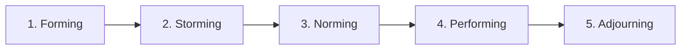
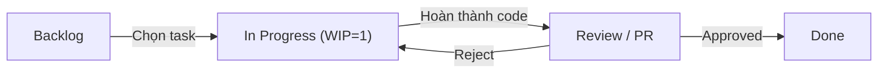
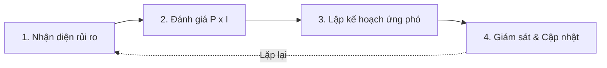
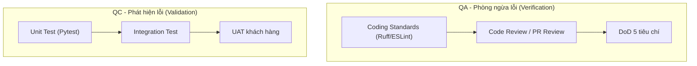
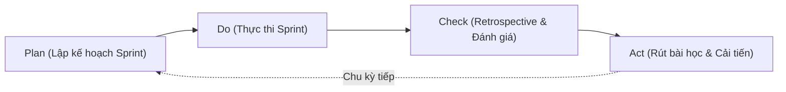

# PHIẾU BÀI LÀM ÔN TẬP — NGƯỜI 6: QUẢN TRỊ NHÂN SỰ, GIÁM SÁT, RỦI RO & BÀI HỌC

- **Họ và tên thành viên:** Mạch Quốc Tấn
- **Mã số sinh viên:** 23127115
- **Phạm vi phụ trách:** **Câu 16, Câu 17, Câu 18, Câu 19, Câu 21**
- **Hạn chót hoàn thành (Bước 1):** **20:00, Thứ Năm (20/08/2026)**
- **Lưu ý quan trọng khi sửa `docs/`:** Nếu bạn chỉnh sửa hoặc tạo mới file (ví dụ soạn `docs/02-planning/07-risk-management-plan.md`, `08-quality-management-plan.md`, `05-lessons-learned-register.md`), **bắt buộc phải ghi lại bảng Document Revision History** ở đầu file và **ghi 1 dòng log công việc** vào file [`docs/03-execution-monitoring/02-project-log.md`](../../../docs/03-execution-monitoring/02-project-log.md).
- **Tài liệu tham chiếu trong dự án (thực hành):**
  - [`docs/01-initiation/05-team-contract.md`](../../../docs/01-initiation/05-team-contract.md) (Hợp đồng nhóm & Quản trị con người)
  - [`docs/03-execution-monitoring/02-project-log.md`](../../../docs/03-execution-monitoring/02-project-log.md) (Nhật ký dự án & Log token)
  - [`docs/03-execution-monitoring/03-ai-development-workflow.md`](../../../docs/03-execution-monitoring/03-ai-development-workflow.md) (Báo cáo quy trình AI)
  - [`docs/02-planning/03-product-backlog.md`](../../../docs/02-planning/03-product-backlog.md) (DoD 5 tiêu chí cho Câu 19)
  - [`docs/01-initiation/03-feasibility-study.md`](../../../docs/01-initiation/03-feasibility-study.md) (Phân tích rủi ro trong TELOS cho Câu 18)
- **Tài liệu lý thuyết tham chiếu (từ bài giảng):**
  - [`materials/08_software_team_management.md`](../../../materials/08_software_team_management.md) (Quản lý nhóm, Tuckman, McGregor X/Y, Ouchi Z, Maslow, Xử lý mâu thuẫn, Năng suất nhóm)
  - [`materials/09_software_project_monitoring_and_control.md`](../../../materials/09_software_project_monitoring_and_control.md) (Giám sát & Kiểm soát dự án, Scope Creep, Effort Creep, EVM, Status Report)
  - [`materials/09_1_agile_project_monitoring_and_control.md`](../../../materials/09_1_agile_project_monitoring_and_control.md) (Giám sát Agile, Burndown Chart, Velocity, Sprint Review)
  - [`materials/10_software_risk_management.md`](../../../materials/10_software_risk_management.md) (Quản lý rủi ro, Nhận diện, Đánh giá P\*I, Ứng phó, Giám sát)
  - [`materials/10_1_agile_risk_management.md`](../../../materials/10_1_agile_risk_management.md) (Quản lý rủi ro trong Agile)
  - [`materials/11_software_quality_management.md`](../../../materials/11_software_quality_management.md) (Quản lý chất lượng, McCall, ISO 9126, QA vs QC, Code Inspection, UAT)
  - [`materials/11_1_agile_quality_management.md`](../../../materials/11_1_agile_quality_management.md) (Chất lượng trong Agile, DoD, Continuous Testing)
  - [`materials/12_software_project_management.md`](../../../materials/12_software_project_management.md) (Tổng kết Quản lý dự án, PMO, Lessons Learned, Plan-driven vs Agile)
- **Ghi chú bài giảng trên lớp ([`note.md`](../../../note.md)):**
  - **Buổi 06 & 08:** Quản lý nhóm (Tuckman 5 giai đoạn, Lý thuyết Y tự giác, Tháp Maslow); thiết lập chính sách sớm (Policy) để phòng ngừa xung đột; Top 2 nguyên nhân thất bại dự án (1. Sai vấn đề; 2. Quản lý nhóm kém).
  - **Buổi 06, 08, 09:** Quản lý rủi ro RAID log (Risk score = Impact x Probability); phân biệt Rủi ro (tương lai) vs Vấn đề (đã xảy ra); đo lường nỗ lực và thời gian thực tế (Time tracking online, session token log).
  - **Buổi 08 & 10:** Quản lý chất lượng QA (phòng ngừa, Coding standards, DoD) vs QC (phát hiện lỗi, AI Code Review, UAT); bài học kinh nghiệm về Spec-driven và Context Engineering.
  - **Dặn dò vấn đáp:** _Kể chi tiết tự sự như một câu chuyện, nhắc đến code phải có dẫn chứng (evidence số liệu 14h05m, 730K tokens, 350K chi phí)_.
- **Đọc chéo liên kết:** Nên đọc thêm phần của **Người 4** (Câu 11: Kế hoạch dự án) vì Giám sát là đối chiếu với Kế hoạch, và phần của **Người 5** (Câu 20: Test Plan) vì kiểm thử là một phần của Quality Management.
- **Checklist bản in nộp kèm khi thi:**
  - [ ] Bản in Hợp đồng nhóm (`05-team-contract.md`) -- đánh dấu "16".
  - [ ] Ảnh chụp chung nhóm -- **CẦN CHUẨN BỊ**: chụp ảnh nhóm và in ra -- đánh dấu "16".
  - [ ] Bản in biên bản 1 buổi họp nhóm -- **CẦN CHUẨN BỊ**: soạn lại từ lịch sử họp -- đánh dấu "16".
  - [ ] Bản in giao diện hệ thống liên lạc (Slack/Discord/Zalo) -- **CẦN CHUẨN BỊ**: screenshot chat đồng đội -- đánh dấu "16".
  - [ ] Bản in Nhật ký dự án (`02-project-log.md`) -- đánh dấu "17".
  - [ ] Bản in giao diện Kanban Board / GitHub Project Board -- **CẦN CHUẨN BỊ**: screenshot -- đánh dấu "17".
  - [ ] Bản in Burndown Chart toàn dự án -- **CẦN CHUẨN BỊ**: tạo biểu đồ từ dữ liệu log -- đánh dấu "17".
  - [ ] Bản in Báo cáo tình trạng dự án (Status Report) -- **CẦN TỰ SOẠN** -- đánh dấu "17".
  - [ ] Bản in Kế hoạch quản lý rủi ro -- **CẦN TỰ SOẠN** file `docs/02-planning/07-risk-management-plan.md` -- đánh dấu "18".
  - [ ] Bản in Kế hoạch quản lý chất lượng -- **CẦN TỰ SOẠN** file `docs/02-planning/08-quality-management-plan.md` -- đánh dấu "19".
  - [ ] Bản in Định nghĩa hoàn thành DoD (trích từ `03-product-backlog.md`) -- đánh dấu "19".
  - [ ] Bản in giao diện Coding Standards (cấu hình Ruff/ESLint) -- **CẦN CHUẨN BỊ**: screenshot linter config -- đánh dấu "19".
  - [ ] Bản in biên bản thanh tra mã nguồn (Code Inspection / PR Review) -- phối hợp với **Người 5** -- đánh dấu "19".
  - [ ] Bản in biên bản phản hồi khách hàng UAT -- **CẦN CHUẨN BỊ** -- đánh dấu "19".
  - [ ] Bản in Báo cáo bài học kinh nghiệm -- **CẦN TỰ SOẠN** file `docs/03-execution-monitoring/05-lessons-learned-register.md` -- đánh dấu "21".
  - [ ] Bản in Báo cáo quy trình phát triển AI (`03-ai-development-workflow.md`) -- đánh dấu "21".
- **Chiến lược 10 phút viết giấy A4:** Phút 1-2: Viết tiêu đề câu + dàn ý WHAT-HOW-WHY-EVIDENCE. Phút 3-7: Triển khai mỗi mục 3-4 dòng ngắn gọn, ưu tiên HOW (các sự kiện thực tế nhóm đã làm) và EVIDENCE (số liệu cụ thể). Phút 8-9: Vẽ 1 sơ đồ nhỏ minh họa (Tuckman / Kanban / Risk Matrix). Phút 10: Rà soát, bổ sung từ khóa.

---

## CÂU 16: QUẢN LÝ CON NGƯỜI VÀ PHÁT TRIỂN NHÓM

> **Đề bài:** Trình bày quá trình hình thành và phát triển nhóm mà nhóm đã trải qua. Liệt kê các vấn đề liên quan đến quản lý con người nhóm đã thực sự vướng phải. Trình bày cách nhóm đã giải quyết và kết quả thu được. _(Sinh viên nộp kèm bản in ảnh chụp chung nhóm, tài liệu quy định nhóm, biên bản họp.)_

### 1. Gợi ý định hướng & Từ khóa cốt lõi:

- **Tài liệu đối chiếu:** `05-team-contract.md`.
- **Từ khóa:** 5 giai đoạn Tuckman (Forming, Storming, Norming, Performing, Adjourning), Triết lý Lý thuyết Y (McGregor - tự chọn task, tự log), 3 Chính sách tiền lệ (Log 12h, PR review, Báo bận 24h), Giải quyết xung đột tech stack (PoC data-driven + Biểu quyết).

### 2. Không gian tự biên soạn câu trả lời:

#### A. Dàn ý trình bày trên giấy A4 & Chi tiết 5 giai đoạn Tuckman

- **Forming (Thành lập):**
  _Viết câu trả lời của bạn vào đây:_

- **Storming (Sóng gió & Xung đột thực tế):**
  _Viết câu trả lời của bạn vào đây:_

- **Norming (Ổn định & Thiết lập quy chế):**
  _Viết câu trả lời của bạn vào đây:_

- **Performing (Bứt phá cùng AI Assistant):**
  _Viết câu trả lời của bạn vào đây:_

- **Adjourning (Tổng kết & Bàn giao):**
  _Viết câu trả lời của bạn vào đây:_

#### B. Sơ đồ 5 Giai đoạn Phát triển Nhóm (Mô hình Tuckman)

#### C. Trả lời chi tiết 100% Bộ câu hỏi thường gặp của Giảng viên

1. **Giải thích các giai đoạn phát triển nhóm (Mô hình Tuckman):**
   - _Trả lời:_

2. **Giải thích các loại hình tổ chức: Theo chức năng (Functional), Theo dự án (Projectized), Ma trận yếu (Weak Matrix), Ma trận cân bằng (Balanced Matrix) và Ma trận mạnh (Strong Matrix):**
   - _Trả lời:_

3. **Giải thích các mô hình quản lý nhóm: Lý thuyết X, Lý thuyết Y (Douglas McGregor) và Lý thuyết Z (William Ouchi):**
   - _Trả lời:_

4. **Giải thích nguyên tắc xử lý mâu thuẫn trong một nhóm:**
   - _Trả lời:_

5. **Giải thích các phương pháp tăng năng suất làm việc của nhóm:**
   - _Trả lời:_

6. **Giải thích mô hình tháp nhu cầu của Maslow và cách ứng dụng vào quản lý thành viên:**
   - _Trả lời:_

---

## CÂU 17: PHÂN CÔNG, THEO DÕI, KIỂM SOÁT CÔNG VIỆC VÀ BÁO CÁO DỰ ÁN

> **Đề bài:** Trình bày quá trình phân công, theo dõi, đánh giá, kiểm soát các công việc dự án, và báo cáo tình trạng dự án của nhóm. _(Sinh viên nộp kèm bản in Dashboard phân công, Nhật ký thời gian thực tế, Burndown chart, Báo cáo tiến độ.)_

### 1. Gợi ý định hướng & Từ khóa cốt lõi:

- **Tài liệu đối chiếu:** `02-project-log.md` và `03-ai-development-workflow.md`.
- **Từ khóa:** Kanban board, Gap time, Số liệu thực tế (14h05m, 730K tokens, ~350K VNĐ), Xử lý blocker qua Daily Standup 10 phút, Chống Scope Creep và Effort Creep.

### 2. Không gian tự biên soạn câu trả lời:

#### A. Dàn ý trình bày trên giấy A4 (WHAT - HOW - WHY - EVIDENCE)

- **WHAT (Là gì?):**
  _Viết câu trả lời của bạn vào đây:_

- **HOW (Cách nhóm theo dõi tiến độ và ghi nhận nhật ký làm việc):**
  _Viết câu trả lời của bạn vào đây:_

- **WHY (Tại sao cần theo dõi sát sao và ghi log thời gian/token?):**
  _Viết câu trả lời của bạn vào đây:_

- **EVIDENCE (Minh chứng số liệu thực tế trong dự án):**
  _Viết câu trả lời của bạn vào đây:_

#### B. Sơ đồ Luồng Kanban Workflow với WIP Limit

#### C. Trả lời chi tiết 100% Bộ câu hỏi thường gặp của Giảng viên

1. **Làm sao để giải quyết vấn đề vượt phạm vi dự kiến (Scope Creep)?**
   - _Trả lời:_

2. **Làm sao để giải quyết vấn đề vượt công sức dự kiến (Effort Creep)?**
   - _Trả lời:_

3. **Làm sao để các thay đổi không trở nên bất ngờ và ảnh hưởng tiêu cực đến sự thành công của dự án?**
   - _Trả lời:_

4. **Giải thích các khái niệm trong Scrum: Sprint Backlogs, Sprint Boards, Sprint Tasks, Sprint Burndown Charts, Project Burndown Charts:**
   - _Trả lời:_

5. **Phải xử lý thế nào khi kết thúc một Sprint mà nhóm không đưa ra được bản phân phối?**
   - _Trả lời:_

6. **Phải xử lý thế nào khi kết quả của các Sprint chênh lệch một cách bất bình thường?**
   - _Trả lời:_

7. **Giải thích các khái niệm trong Kanban: Kanban Board, Development Workflow, WIP Limit:**
   - _Trả lời:_

8. **Giải thích phương pháp cập nhật lịch trình và chi phí hoàn thành công việc còn lại trong mô hình Waterfall (EVM - Earned Value Management):**
   - _Trả lời:_

---

## CÂU 18: KẾ HOẠCH QUẢN LÝ RỦI RO (RISK MANAGEMENT PLAN)

> **Đề bài:** Trình bày quá trình hình thành và phương pháp đánh giá tài liệu Kế hoạch quản lý rủi ro (Software Risk Management Plan) của nhóm. _(Sinh viên nộp kèm bản in tài liệu Kế hoạch quản lý rủi ro của nhóm.)_

### 1. Gợi ý định hướng & Từ khóa cốt lõi:

- **Tài liệu đối chiếu:** `03-feasibility-study.md` và Kế hoạch rủi ro.
- **Từ khóa:** Quy trình 4 bước (Nhận diện $\rightarrow$ Đánh giá P×I $\rightarrow$ Lập kế hoạch ứng phó $\rightarrow$ Giám sát), 3 rủi ro lớn nhất (Bản quyền học liệu $\rightarrow$ DRM Signed URL 15m; OCR sai sót $\rightarrow$ Split-screen; Token AI vượt ngân sách $\rightarrow$ Hạn mức 5M & Prompt Spec-driven).

### 2. Không gian tự biên soạn câu trả lời:

#### A. Dàn ý trình bày trên giấy A4 (WHAT - HOW - WHY - EVIDENCE)

- **WHAT (Là gì?):**
  _Viết câu trả lời của bạn vào đây:_

- **HOW (Quy trình 4 bước và 3 rủi ro cụ thể):**
  _Viết câu trả lời của bạn vào đây:_

- **WHY (Tại sao cần quản lý rủi ro từ đầu?):**
  _Viết câu trả lời của bạn vào đây:_

- **EVIDENCE (Minh chứng trong dự án):**
  _Viết câu trả lời của bạn vào đây:_

#### B. Sơ đồ Quy trình 4 bước Quản lý Rủi ro

#### C. Trả lời chi tiết 100% Bộ câu hỏi thường gặp của Giảng viên

1. **Các câu hỏi chính cần trả lời trong tài liệu Kế hoạch quản lý rủi ro là gì?**
   - _Trả lời:_

2. **Các đầu vào cần thiết và các bước nhóm đã thực hiện để tạo tài liệu Kế hoạch quản lý rủi ro là gì?**
   - _Trả lời:_

3. **Tài liệu Kế hoạch quản lý rủi ro của nhóm đã được đánh giá thế nào?**
   - _Trả lời:_

4. **Tại sao cần tạo tài liệu Kế hoạch quản lý rủi ro?**
   - _Trả lời:_

5. **Tài liệu Kế hoạch quản lý rủi ro của nhóm đã được sử dụng và cập nhật trong quá trình thực hiện dự án như thế nào?**
   - _Trả lời:_

---

## CÂU 19: KẾ HOẠCH QUẢN LÝ CHẤT LƯỢNG (QUALITY MANAGEMENT PLAN)

> **Đề bài:** Trình bày quá trình hình thành và phương pháp đánh giá tài liệu Kế hoạch quản lý chất lượng (Software Quality Management Plan) của nhóm. _(Sinh viên nộp kèm bản in tài liệu Kế hoạch quản lý chất lượng, DoD, Coding Standards, biên bản UAT.)_

### 1. Gợi ý định hướng & Từ khóa cốt lõi:

- **Tài liệu đối chiếu:** DoD trong Backlog, Coding style linter, Test suite.
- **Từ khóa:** Quality Metrics (CER < 5%, API FTS < 500ms, Test coverage >= 80%), QA (phòng ngừa lỗi) vs QC (phát hiện lỗi), Mô hình McCall, Chuẩn ISO 9126, Đo lường định tính vs định lượng.

### 2. Không gian tự biên soạn câu trả lời:

#### A. Dàn ý trình bày trên giấy A4 (WHAT - HOW - WHY - EVIDENCE)

- **WHAT (Là gì?):**
  _Viết câu trả lời của bạn vào đây:_

- **HOW (Cách đo lường và quy trình QA/QC):**
  _Viết câu trả lời của bạn vào đây:_

- **WHY (Tại sao cần kế hoạch quản lý chất lượng?):**
  _Viết câu trả lời của bạn vào đây:_

- **EVIDENCE (Các chỉ số chất lượng thực tế trong dự án):**
  _Viết câu trả lời của bạn vào đây:_

#### B. Sơ đồ Quy trình Đảm bảo Chất lượng: QA (Phòng ngừa) vs QC (Phát hiện)

#### C. Trả lời chi tiết 100% Bộ câu hỏi thường gặp của Giảng viên

1. **Các câu hỏi chính cần trả lời trong tài liệu Kế hoạch quản lý chất lượng là gì?**
   - _Trả lời:_

2. **Các đầu vào cần thiết và các bước nhóm đã thực hiện để tạo tài liệu Kế hoạch quản lý chất lượng là gì?**
   - _Trả lời:_

3. **Tài liệu Kế hoạch quản lý chất lượng của nhóm đã được đánh giá thế nào?**
   - _Trả lời:_

4. **Tại sao cần tạo tài liệu Kế hoạch quản lý chất lượng?**
   - _Trả lời:_

5. **Tài liệu Kế hoạch quản lý chất lượng của nhóm đã được sử dụng và cập nhật trong quá trình thực hiện dự án như thế nào?**
   - _Trả lời:_

6. **Giải thích sự hỗ trợ của các mô hình McCall và ISO 9126 trong việc kiểm soát chất lượng sản phẩm dự án:**
   - _Trả lời:_

7. **Phân biệt Đo lường định tính (Qualitative) và Đo lường định lượng (Quantitative):**
   - _Trả lời:_

8. **Giải thích các phương pháp giúp hạn chế việc: (a) Tài liệu sai yêu cầu khách hàng, (b) Mã nguồn sai thiết kế, (c) Phần mềm chạy sai nghiệp vụ:**
   - _Trả lời:_

---

## CÂU 21: BÁO CÁO BÀI HỌC KINH NGHIỆM (LESSONS LEARNED REGISTER)

> **Đề bài:** Trình bày quá trình hình thành và phương pháp đánh giá tài liệu Báo cáo bài học kinh nghiệm (Lessons Learned Register) của nhóm. _(Sinh viên nộp kèm bản in Báo cáo bài học kinh nghiệm của nhóm.)_

### 1. Gợi ý định hướng & Từ khóa cốt lõi:

- **Tài liệu đối chiếu:** `03-ai-development-workflow.md` và Báo cáo tổng kết.
- **Từ khóa:** 3 bài học đắt giá (Ứng dụng AI cần Spec & Context Engineering, Lựa chọn công nghệ đơn giản đủ tốt Postgres FTS vs ES, Minh bạch log token loại bỏ nghi ngờ), Vai trò của PMO (Project Management Office).

### 2. Không gian tự biên soạn câu trả lời:

#### A. Dàn ý trình bày trên giấy A4 (WHAT - HOW - WHY - EVIDENCE)

- **WHAT (Là gì?):**
  _Viết câu trả lời của bạn vào đây:_

- **HOW (Cách nhóm tổng kết và rút ra bài học):**
  _Viết câu trả lời của bạn vào đây:_

- **WHY (Tại sao cần lưu trữ Báo cáo bài học kinh nghiệm?):**
  _Viết câu trả lời của bạn vào đây:_

- **EVIDENCE (3 bài học thực tế từ dự án):**
  _Viết câu trả lời của bạn vào đây:_

#### B. Sơ đồ Vòng lặp Cải tiến Liên tục (PDCA - Plan Do Check Act)

#### C. Trả lời chi tiết 100% Bộ câu hỏi thường gặp của Giảng viên

1. **Quản lý dự án là gì?**
   - _Trả lời:_

2. **Tại sao cần sự quản lý khi phát triển một dự án phần mềm?**
   - _Trả lời:_

3. **Liệt kê các công việc cần thực hiện để quản lý một dự án và các sản phẩm tương ứng được tạo ra bởi từng công việc:**
   - _Trả lời:_

4. **Một nhóm phát triển phần mềm có thực sự cần một người chỉ chuyên tâm vào các công việc quản lý trong dự án hay không? Tại sao?**
   - _Trả lời:_

5. **Quản lý một dự án dựa trên việc lên kế hoạch chặt chẽ có điểm gì giống và khác với quản lý dựa trên kinh nghiệm tích lũy và thích ứng hoàn cảnh (Plan-driven vs Agile)?**
   - _Trả lời:_

6. **Quản lý dự án và Kỹ nghệ phần mềm liên quan với nhau như thế nào?**
   - _Trả lời:_

7. **Tại sao các công ty có quy mô lớn lại cần có Phòng Quản lý Dự án (PMO - Project Management Office)?**
   - _Trả lời:_
