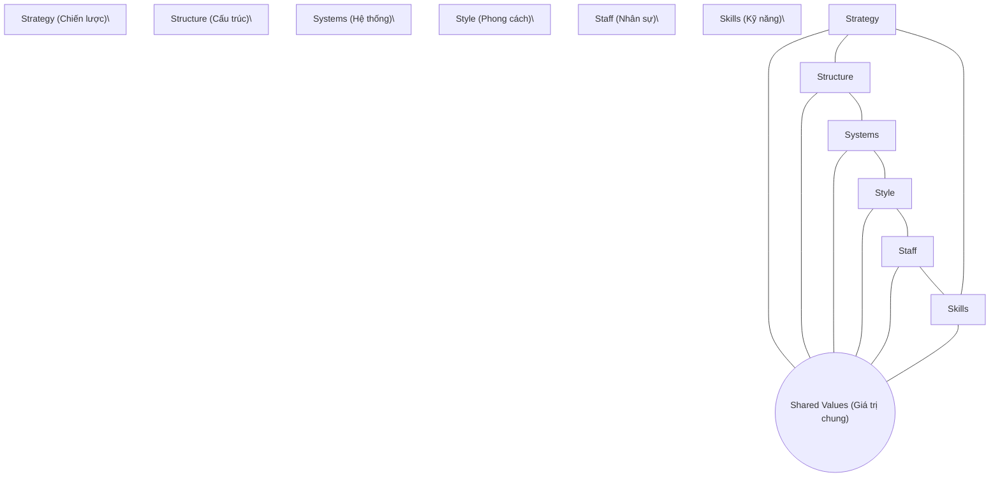

# Nhóm phần mềm (Software Team)

**Giảng viên / Lecturer:** Ngô Huy Biên (Ngo Huy Bien) — nhbien@fit.hcmus.edu.vn
**Đơn vị / Department:** Bộ môn Kỹ thuật phần mềm, Khoa Công nghệ thông tin, Trường Đại học Khoa học Tự nhiên, ĐHQG-HCM
**Môn học / Course:** Quản lý Dự án Phần mềm (Software Project Management)

---

## 1. Mục tiêu bài học (Learning Objectives)

Sau bài học, người học có thể:

- Xây dựng một nhóm phần mềm hiệu quả.
  _(Build a software team.)_
- Quản lý và vận hành một nhóm làm việc.
  _(Manage a team.)_
- Giải quyết các xung đột phát sinh trong nhóm.
  _(Resolve conflicts.)_
- Tăng năng suất của nhóm phần mềm.
  _(Increase team productivity.)_
- Tạo động lực thúc đẩy các thành viên trong nhóm.
  _(Motivate team members.)_
- Ngăn chặn và giải quyết tình trạng hiệu suất kém.
  _(Prevent poor performance.)_
- Dẫn dắt và lãnh đạo một nhóm phần mềm.
  _(Lead a team.)_
- Phân tích và đánh giá các phương pháp tiếp cận quản lý.
  _(Analyze and evaluate a management approach.)_

## 2. Nội dung (Contents Overview)

| #    | Chủ đề (VI)                                   | Topic (EN)                                 |
| ---- | --------------------------------------------- | ------------------------------------------ |
| I    | Nhóm phần mềm & Yếu tố con người (Peopleware) | Software Team & Human Factors (Peopleware) |
| II   | Quản lý đội ngũ                               | Team Management                            |
| III  | Giao tiếp và Giải quyết xung đột              | Communication & Conflict Resolution        |
| IV   | Năng suất nhóm                                | Team Productivity                          |
| V    | Động lực làm việc                             | Team Motivation                            |
| VI   | Quản lý và Cải thiện hiệu suất                | Performance Management                     |
| VII  | Phong cách lãnh đạo                           | Leadership Styles                          |
| VIII | Đánh giá tổ chức & Khung 7S                   | Organization Assessment & 7S Framework     |

---

## I. Nhóm phần mềm & Yếu tố con người (Peopleware)

### 1.1 Nguyên nhân thực sự của sự thất bại dự án \[1\]

> Đối với đại đa số các dự án bị đổ vỡ, không phải do một vấn đề công nghệ duy nhất giải thích sự thất bại đó. Những vấn đề chính trong công việc của chúng ta mang tính chất xã hội học (con người) nhiều hơn là công nghệ.
> _(For the overwhelming majority of the bankrupt projects, there was not a single technological issue to explain the failure. The major problems of our work are not so much technological as sociological in nature.)_

- **Yếu tố con người (Peopleware):** Đề cập đến bất kỳ khía cạnh nào liên quan đến vai trò của con người trong việc phát triển hoặc sử dụng hệ thống phần mềm và phần cứng máy tính (năng suất, làm việc nhóm, động lực, tâm lý lập trình, quản lý dự án, yếu tố tổ chức, thiết kế giao diện người-máy).
- Lý do chính khiến chúng ta có xu hướng tập trung vào khía cạnh kỹ thuật hơn là con người không phải vì nó quan trọng hơn, mà vì nó **dễ giải quyết hơn**.
  _(We focus on the technical rather than the human side not because it's more crucial, but because it's easier to do.)_

### 1.2 Thành lập nhóm phần mềm

- **Với người quản lý:** Tuyển dụng thành viên (hoặc làm việc với quản lý chức năng); phân tích kỹ năng, kinh nghiệm, năng lực trong nhóm để sắp xếp vai trò phù hợp.
- **Với kỹ sư phần mềm:** Đánh giá kỹ lưỡng công ty/nhóm trước khi gia nhập; hiểu rõ vai trò và mục tiêu của nhóm.

---

## II. Quản lý đội ngũ (Team Management)

### 2.1 Lựa chọn người quản lý dự án qua Lưới Lãnh đạo (The Leadership Grid)

Mô hình lưới lãnh đạo được phát triển bởi Robert Blake và Jane Mouton (1960s) để đo lường _Mối quan tâm đến sản xuất (concern for production)_ so với _Mối quan tâm đến con người (concern for people)_.

Lưới xác định 5 loại nhà lãnh đạo:

1. **Nghèo nàn (Impoverished)**
2. **Sản xuất hoặc Chết (Produce or Perish)**
3. **Giữa đường (Middle of the Road)**
4. **Câu lạc bộ đồng quê (Country Club)**
5. **Đội ngũ (Team)** — được xem là hình thức lãnh đạo hiệu quả nhất.

> **Phân bổ thời gian của PM:** 80% giải quyết các vấn đề về Động lực con người (Human Dynamics); chỉ có 20% thời gian dành cho các vấn đề Kỹ thuật (Technical Issues).
> _(Project Manager/Leader's time: 20% on Technical issues, 80% on Human Dynamics issues.)_

### 2.2 Cuộc họp khởi động dự án (Kick-off Meeting)

- Giới thiệu các thành viên.
- Làm rõ các thuật ngữ dự án, bài toán, giải pháp và sản phẩm bàn giao.
- Xác định ma trận RACI (Responsible, Accountable, Consulted, Informed).
- Bắt đầu xây dựng kế hoạch dự án.

### 2.3 Quá trình ra quyết định & Chia sẻ công việc \[2\]

- **Tính toàn vẹn về mặt khái niệm (Conceptual Integrity):** Quyết định tính dễ sử dụng của một hệ thống. Tính toàn vẹn này đạt được tốt nhất bằng cách giới hạn việc phát triển thông số kỹ thuật cho một nhóm nhỏ đại diện (Tầng lớp quý tộc - Aristocracy / Vua - Monarch) thay vì dân chủ hóa hoàn toàn (Nền dân chủ - Democracy) dễ gây loãng thiết kế.
- **Mô hình Nhóm phẫu thuật (Surgical Team):** Thay vì tổ chức theo kiểu "đồ tể" (mỗi người tự cắt xẻo một phần của bài toán), nhóm được tổ chức như một kíp mổ. Một người đóng vai trò là "bác sĩ phẫu thuật chính" thực hiện công việc cốt lõi (coding/design chính), các thành viên khác hỗ trợ hết mình để nâng cao hiệu quả và năng suất của người đó.

### 2.4 Cách tiến hành cuộc họp hiệu quả

- **Xác định mục tiêu rõ ràng:** Giải quyết vấn đề? Ra quyết định? Hay chia sẻ kiến thức/báo cáo?
- **Phân công vai trò:** Chủ tịch (Chairman - điều phối), Thư ký (Secretary - ghi chép), Người tham dự (Attendees).
- **Chuẩn bị:** Chương trình nghị sự (agenda), khung thời gian (timeframe), nội dung và dữ liệu.
- **Biên bản họp (Meeting Minutes):** Phải ghi nhận: Ai tham gia? Mục tiêu là gì? Quyết định/nghị quyết nào được thông qua? Ai chịu trách nhiệm thực hiện nhiệm vụ nào? Khi nào các quyết định có hiệu lực?

### 2.5 Các mô hình cơ cấu tổ chức \[3\]

Cơ cấu tổ chức là yếu tố môi trường doanh nghiệp ảnh hưởng đến sự sẵn có của nguồn lực và cách tiến hành dự án.

| Loại tổ chức                       | Đặc điểm                                                                                                                                                                                     |
| ---------------------------------- | -------------------------------------------------------------------------------------------------------------------------------------------------------------------------------------------- |
| **Tổ chức chức năng (Functional)** | Tập trung vào chuyên môn hóa, nhân sự được nhóm theo các phòng ban chức năng.                                                                                                                |
| **Tổ chức dự án (Projectized)**    | Nhân sự được phân bổ toàn thời gian vào dự án, PM có toàn quyền quyết định.                                                                                                                  |
| **Tổ chức ma trận (Matrix)**       | Kết hợp giữa chức năng và dự án. Chia làm: Ma trận yếu (Weak matrix - PM đóng vai trò điều phối), Ma trận cân bằng (Balanced matrix), và Ma trận mạnh (Strong matrix - PM có quyền lực cao). |

---

## III. Giao tiếp và Giải quyết xung đột (Communication & Conflict Resolution)

### 3.1 Giao tiếp trong nhóm dự án \[3, 7\]

**Các hình thức giao tiếp:**

- **Giao tiếp bằng lời nói (Verbal):** Dễ dàng, ít phức tạp, tốc độ truyền đạt nhanh.
- **Giao tiếp bằng văn bản (Written):** Phù hợp để truyền đạt các thông điệp phức tạp, chi tiết.
- **Giao tiếp theo chiều ngang (Horizontal):** Trao đổi giữa các đồng nghiệp cùng cấp (peers).
- **Giao tiếp theo chiều dọc (Vertical):** Trao đổi xuống cấp dưới hoặc lên cấp quản lý điều hành.
- **Giao tiếp mặt đối mặt (Face-to-Face):** Tốt nhất vì tận dụng được ngôn ngữ cơ thể (body language) và giọng nói (tone of voice).

**10 nguyên tắc giao tiếp hiệu quả:**

1. Lắng nghe.
2. Chuẩn bị trước khi giao tiếp.
3. Cần có người hỗ trợ (facilitator) điều phối hoạt động.
4. Giao tiếp mặt đối mặt là tốt nhất.
5. Ghi chép và ghi lại các quyết định.
6. Phấn đấu hợp tác.
7. Luôn tập trung; mô-đun hóa cuộc thảo luận.
8. Nếu có điều gì chưa rõ, hãy vẽ hình.
9. Đồng ý thì tiếp tục (move on); không đồng ý cũng tiếp tục; chưa rõ thì tạm gác lại và tiếp tục.
10. Đàm phán không phải là một cuộc thi; nó hoạt động tốt nhất khi cả hai bên cùng thắng (Win-Win).

**Lắng nghe tích cực (Active Listening):**

- Tránh các rào cản: Cho rằng chủ đề không thú vị; đánh giá người nói thay vì nội dung; bị cuốn theo cảm xúc; chỉ nghe sự thật vụn vặt thay vì ý tưởng trung tâm; tránh chủ đề khó; ghi chép quá nhiều.
- Cách thực hiện: Nhìn trực tiếp người nói; giảm thiểu phiền nhiễu; gật đầu/phản hồi nhẹ nhàng; định kỳ tóm tắt lại ý người nói; hỏi để làm rõ; để người nói nói hết câu.

### 3.2 Kỹ thuật quản lý xung đột (Conflict Management Techniques) \[3\]

| Kỹ thuật                                                      | Mô tả                                                                                                                | Hiệu quả                                                     |
| ------------------------------------------------------------- | -------------------------------------------------------------------------------------------------------------------- | ------------------------------------------------------------ |
| **Rút lui / Tránh né** _(Withdraw/Avoid)_                     | Một bên bỏ đi hoặc từ chối thảo luận xung đột.                                                                       | Không bao giờ giải quyết được tận gốc vấn đề.                |
| **Xoa dịu / Nhượng bộ** _(Smooth/Accommodate)_                | Nhấn mạnh vào điểm chung, xem nhẹ sự khác biệt hoặc làm giảm tầm quan trọng của xung đột.                            | Không tạo ra giải pháp lâu dài.                              |
| **Ép buộc / Áp đặt** _(Force/Direct)_                         | Một người dùng quyền lực áp đặt giải pháp lên bên kia.                                                               | Giải quyết tạm thời, nhưng không phải là giải pháp tốt nhất. |
| **Thỏa hiệp / Hòa giải** _(Compromise/Reconcile)_             | Mỗi bên từ bỏ một phần lợi ích để đạt được thỏa hiệp.                                                                | Giải pháp mang tính trung dung.                              |
| **Hợp tác / Giải quyết vấn đề** _(Collaborate/Problem Solve)_ | Tìm kiếm sự thật và các dữ liệu liên quan, trình bày cho các bên để đưa ra giải pháp rõ ràng dựa trên sự đồng thuận. | Đạt được sự đồng thuận thực sự và lâu dài (Win-Win).         |

- **Xử lý xung đột cá nhân (Members' Conflict):** Gặp riêng từng bên (one-to-one); xem lại mục tiêu, cam kết và chính sách; mỗi cuộc họp kết thúc bằng các mục hành động rõ ràng và yêu cầu các bên chịu trách nhiệm về sản phẩm bàn giao.
- **Xử lý xung đột giữa các nhóm (Intergroup Conflicts):** Xem xét động lực, mục tiêu của mỗi nhóm, các chính sách, quy định; rà soát các cơ sở của quyền lực (_coercive power, legitimate power, reward power, referent power, expert power_).

---

## IV. Năng suất nhóm (Team Productivity)

### 4.1 Định nghĩa năng suất

Năng suất thực sự nghĩa là **đạt được nhiều hơn trong một giờ làm việc** (achieving more in an hour of work), chứ không phải tìm cách bóc lột nhiều hơn từ một giờ trả lương (extracting more for an hour of pay).

### 4.2 Hai học thuyết về giá trị

- **Lý thuyết Tây Ban Nha (The Spanish Theory):** Coi giá trị trên thế giới là cố định. Con đường duy nhất để giàu lên là bóc lột và khai thác hiệu quả hơn từ tài nguyên đất đai hoặc sức lao động của con người. (Tương ứng với việc **bắt nhân viên làm thêm giờ — Overtime**).
- **Lý thuyết tiếng Anh (The English Theory):** Giá trị có thể được tạo ra liên tục thông qua **sự khéo léo, sáng tạo và công nghệ**. (Tương ứng với việc **làm việc thông minh hơn — Working Smarter**).

### 4.3 Tác hại của việc làm thêm giờ (Overtime)

- Làm thêm giờ giống như chạy nước rút (sprinting). Nó có ích trong 100 mét cuối của cuộc marathon, nhưng nếu chạy nước rút ngay từ dặm đầu tiên, bạn đang lãng phí sức lực.
- Ép buộc làm thêm giờ làm mất đi sự tôn trọng của nhân viên đối với quản lý. Nhân viên dưới áp lực thời gian không làm việc tốt hơn, họ chỉ làm nhanh hơn bằng cách **hy sinh chất lượng sản phẩm và sự hài lòng trong công việc**.
- Làm thêm giờ đối với nhân viên hưởng lương cố định chỉ là ảo tưởng của những nhà quản lý ngây thơ.

---

## V. Động lực làm việc (Team Motivation)

### 5.1 Tháp nhu cầu của Maslow (Maslow's Hierarchy of Needs) \[8\]

Hiểu nhu cầu nhân viên để áp dụng động lực phù hợp:

1. **Nhu cầu sinh lý & An toàn (Physiological & Safety):** Mức độ để sinh tồn (_Survive_).
2. **Nhu cầu xã hội, Tôn trọng & Khẳng định bản thân (Social, Esteem, Self-actualization):** Mức độ để phát triển mạnh mẽ (_Thrive_).

### 5.2 Động lực bên ngoài: Học thuyết Củ cà rốt và Cây gậy (Carrot and Stick) \[9\]

- Quản lý kiểm soát nhân viên thông qua lương, thưởng, phúc lợi (củ cà rốt) hoặc phạt, đe dọa (cây gậy).
- **Hạn chế:** Phương pháp này hoàn toàn không hiệu quả khi con người đã đạt mức đủ sống và bắt đầu được thúc đẩy bởi các nhu cầu bậc cao hơn (tự chủ, sáng tạo).

### 5.3 Động lực nội tại (Intrinsic Motivation) \[10\]

Con người được thúc đẩy mạnh mẽ nhất bởi phần thưởng nội tại: công việc thú vị, đầy thử thách, cơ hội thành đạt và tự chủ nhận trách nhiệm lớn hơn.
_(Forget praise. Forget punishment. Forget cash. You need to make their jobs more interesting.)_

**Các nguyên tắc làm phong phú công việc (Job Enrichment):**

- Cho phép đảm nhận nhiệm vụ mới, thử thách hơn.
- Giao nhiệm vụ chuyên môn hóa để họ trở thành chuyên gia.
- Tăng tính chịu trách nhiệm bằng cách giảm bớt kiểm soát hành vi.
- Cung cấp thông tin trực tiếp cho nhân viên thay vì chuyển qua quản lý trung gian.
- Giao trách nhiệm quản lý một quy trình hoặc một đơn vị công việc hoàn chỉnh.

### 5.4 Thuyết Hai yếu tố của Herzberg (Hygiene & Motivators) \[3\]

- **Yếu tố vệ sinh (Hygiene factors):** Giải quyết môi trường làm việc (lương, phúc lợi, điều kiện làm việc, quan hệ đồng nghiệp). Chúng chỉ giúp **ngăn ngừa sự bất mãn** (prevent dissatisfaction) chứ không tạo ra động lực thực sự.
- **Yếu tố động lực (Motivators):** Giải quyết bản chất công việc (cơ hội thăng tiến, học kỹ năng mới, thử thách công việc). Chúng trực tiếp tạo ra **sự thỏa mãn và động lực** (lead to satisfaction).

### 5.5 Lý thuyết kỳ vọng của Vroom (Expectancy Theory)

Động lực được thúc đẩy bởi kỳ vọng về kết quả tích cực. Mọi người hành động theo cách nhất định nếu họ tin sẽ nhận được phần thưởng xứng đáng. Lý thuyết này cũng chỉ ra: con người sẽ trở thành những gì bạn kỳ vọng ở họ (Hiệu ứng Pygmalion).

---

## VI. Quản lý và Cải thiện hiệu suất (Performance Management)

### 6.1 Ngăn chặn hiệu suất kém

Đảm bảo người thực hiện nhiệm vụ hiểu rõ 4 điều:

1. Tại sao nhiệm vụ của họ lại quan trọng.
2. Họ cần làm gì và bàn giao sản phẩm nào.
3. Khi nào họ cần nộp kết quả.
4. Họ sẽ nhận được sự hỗ trợ nào.

### 6.2 Yêu cầu cam kết (Commitment)

Mọi người cam kết với nhóm khi họ nhận lại được giá trị quan trọng từ sự tham gia đó. Hãy cởi mở về sứ mệnh và chọn mức độ thử thách phù hợp cho từng cá nhân.

### 6.3 Đào tạo nhân sự (Training) \[9\]

Đào tạo cải thiện tinh thần nhân viên và năng lực dự án. Để tránh rủi ro nhân viên rời đi sau đào tạo, cần có hợp đồng thỏa thuận lao động hợp lý. Tối đa hóa giá trị đào tạo bằng cách yêu cầu chuyển giao kiến thức lại cho nhóm.

### 6.4 Đánh giá hiệu suất (Performance Reviews)

Đánh giá dựa trên: Chất lượng công việc, tính linh hoạt, sáng tạo giải quyết vấn đề, kỹ năng giao tiếp, đổi mới sáng tạo, trách nhiệm giải trình (hoàn thành đúng hạn), khả năng tự học, và đóng góp nâng cao năng lực cho các thành viên khác.

### 6.5 Giải quyết vấn đề hiệu suất

Hiệu suất kém thường do 3 nguyên nhân:

1. **Thiếu tài nguyên:** Hãy cung cấp đủ công cụ, tài nguyên.
2. **Thiếu động lực:** Khen thưởng và kỷ luật liên kết rõ ràng với hiệu suất; giúp họ tập trung vào thành công trong quá khứ và công việc.
3. **Thiếu kỹ năng:** Cung cấp đào tạo và vật liệu cần thiết.

> **Định luật Brooks (Tháng con người thần thoại):**
> "Việc bổ sung nhân lực vào một dự án phần mềm muộn sẽ càng khiến dự án đó bị chậm trễ hơn."
> _("Adding manpower to a late software project makes it later.")_
> Do chi phí giao tiếp và đào tạo nhân sự mới tăng lên nhanh chóng đối với các nhiệm vụ có sự tương quan phức tạp.

---

## VII. Phong cách lãnh đạo (Leadership Styles)

### 7.1 Huấn luyện bằng sự khuyến khích (Coach by Encouragement)

- Huấn luyện nhằm định hướng lại hành vi và thử thách trí tuệ, **không** nhằm mục đích làm hộ, đổ lỗi hay chỉ trích sai lầm.
- Thay vì chỉ trích, hãy dùng các câu hỏi gợi mở: _"Bạn có thể làm điều đó bằng cách nào khác?", "Để tôi đưa ra gợi ý...", "Nếu không làm bước đó thì điều gì sẽ xảy ra?"_
- **Tuyệt đối không bao giờ chỉ trích nhân viên ở nơi công cộng.**
  _(Never criticize people in public.)_

### 7.2 Đưa ra phản hồi nâng cao lòng tự trọng

Phản hồi phải cụ thể, tích cực, tập trung vào thế mạnh, thể hiện sự tin tưởng và ghi nhận nỗ lực cải tiến: _"Bạn đang tiến bộ, cố gắng lên!", "Nhìn xem lần này mọi việc đã tốt hơn thế nào."_

### 7.3 Lý thuyết thành tích của McClelland (Achievement Theory)

Mọi người được thúc đẩy bởi 3 nhu cầu cơ bản:

- **Nhu cầu thành tích (Achievement):** Nhu cầu đạt được thành công.
- **Nhu cầu quyền lực (Power):** Mong muốn ảnh hưởng và tác động đến người khác.
- **Nhu cầu liên kết (Affiliation):** Hướng tới xây dựng các mối quan hệ xã hội.

### 7.4 Lý thuyết ngẫu nhiên của Fiedler (Contingency Theory)

Không có phong cách lãnh đạo nào là hoàn hảo cho mọi trường hợp. Hiệu quả lãnh đạo phụ thuộc vào tình huống (sự kiểm soát tình huống), dựa trên:

1. **Quan hệ Lãnh đạo - Thành viên:** Mức độ tin cậy của nhóm đối với lãnh đạo.
2. **Cấu trúc nhiệm vụ:** Nhiệm vụ rõ ràng, có cấu trúc hay mơ hồ, không cấu trúc.
3. **Quyền lực vị thế của người lãnh đạo:** Quyền lực định hướng, thưởng phạt của PM.

**Thang đo đồng nghiệp ít được ưa thích nhất (LPC - Least-Preferred Coworker):**

- **LPC thấp (Định hướng nhiệm vụ):** Nhìn nhận LPC tiêu cực. Rất hiệu quả trong việc hoàn thành công việc nhanh chóng dưới các tình huống cực đoan (rất thuận lợi hoặc rất khó khăn). Xây dựng mối quan hệ là ưu tiên thấp.
- **LPC cao (Định hướng mối quan hệ):** Nhìn nhận LPC tích cực. Tập trung vào kết nối cá nhân, quản lý xung đột tốt, ra quyết định phức tạp tốt trong các tình huống trung bình (thuận lợi vừa phải).

---

## VIII. Đánh giá tổ chức & Khung 7S (McKinsey 7S Framework) \[11\]

Được phát triển bởi Tom Peters và Robert Waterman (McKinsey & Company) vào đầu những năm 1980, mô hình chỉ ra 7 yếu tố nội bộ của tổ chức cần được liên kết và phối hợp hài hòa để đạt thành công:

1. **Chiến lược (Strategy):** Kế hoạch xây dựng lợi thế cạnh tranh.
2. **Cấu trúc (Structure):** Cách thức tổ chức sơ đồ báo cáo nhân sự.
3. **Hệ thống (Systems):** Các quy trình, thủ tục, hoạt động hàng ngày của nhân viên.
4. **Giá trị chung (Shared Values):** Các giá trị cốt lõi, đạo đức làm việc chung thể hiện qua văn hóa doanh nghiệp. (Đóng vai trò trung tâm liên kết 6 yếu tố còn lại).
5. **Phong cách (Style):** Phong cách lãnh đạo được áp dụng.
6. **Nhân sự (Staff):** Đội ngũ nhân viên và năng lực chung.
7. **Kỹ năng (Skills):** Các kỹ năng chuyên môn thực tế của nhân viên.

---

## Tài liệu tham khảo (References)

1. Tom DeMarco & Timothy Lister (2013). _Peopleware: Productive Projects and Teams_. Addison-Wesley Professional.
2. Frederick P. Brooks, Jr. (1995). _The Mythical Man-Month: Essays on Software Engineering_. Addison-Wesley Professional.
3. Kim Heldman (2018). _PMP Project Management Professional Study Guide_. John Wiley & Sons.
4. BW Boehm & R Ross (1989). _Theory-W Software Project Management: Principles and Examples_.
5. Douglas McGregor (1966). _The Human Side of Enterprise_.
6. Bruce W. Tuckman & Mary Ann C. Jensen (1977). _Stages of Small-Group Development Revisited_.
7. Roger S. Pressman (2010). _Software Engineering: A Practitioner's Approach_.
8. A. H. Maslow (1943). _A Theory of Human Motivation_.
9. William Holtsnider & Brian D. Jaffe (2012). _IT Manager's Handbook_.
10. Frederick Herzberg (2003). _One More Time: How Do You Motivate Employees?_.
11. Tom Peters & Robert Waterman (1980). _Structure Is Not Organization_.
