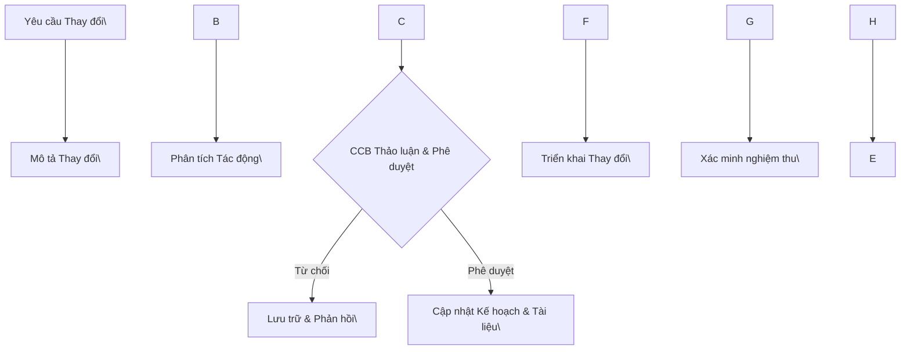

# Giám sát và Kiểm soát Dự án Phần mềm (Software Project Monitoring and Control)

**Giảng viên / Lecturer:** Ngô Huy Biên (Ngo Huy Bien) — nhbien@fit.hcmus.edu.vn
**Đơn vị / Department:** Bộ môn Kỹ thuật phần mềm, Khoa Công nghệ thông tin, Trường Đại học Khoa học Tự nhiên, ĐHQG-HCM
**Môn học / Course:** Quản lý Dự án Phần mềm (Software Project Management)

---

## 1. Mục tiêu bài học (Learning Objectives)

Sau bài học, người học có thể:

- Chỉ đạo và quản lý hiệu quả công việc dự án.
  *(Direct and manage project work.)*
- Kiểm soát và xử lý các yêu cầu thay đổi trong dự án.
  *(Control project changes.)*
- Báo cáo tình trạng dự án một cách khoa học.
  *(Report project status.)*

## 2. Nội dung (Contents Overview)

| # | Chủ đề (VI) | Topic (EN) |
|---|---|---|
| I | Chỉ đạo và Quản lý công việc dự án | Direct and Manage Project Work |
| II | Dữ liệu & Thông tin hiệu suất làm việc | Work Performance Data & Information |
| III | Kiểm soát thay đổi & Quản trị phạm vi | Change Control & Scope Management |
| IV | Kiểm soát tiến độ | Control Schedule |
| V | Quản lý giá trị thu được (EVM) | Earned Value Management (EVM) |
| VI | Báo cáo trạng thái & Đóng dự án | Status Reporting & Project Closure |

---

## I. Chỉ đạo và Quản lý công việc dự án (Direct and Manage Project Work)

### 1.1 Khái niệm
Chỉ đạo và quản lý công việc dự án là quá trình dẫn dắt và thực hiện các công việc được xác định trong kế hoạch quản lý dự án, đồng thời triển khai các thay đổi đã được phê duyệt để đạt được mục tiêu của dự án.
*(Direct and Manage Project Work is the process of leading and performing the work defined in the project management plan and implementing approved changes to achieve the project’s objectives.)*

- **Đầu vào:** Kế hoạch quản lý dự án, các yêu cầu thay đổi đã được phê duyệt.
- **Kỹ thuật:** Phán quyết của chuyên gia, hệ thống thông tin quản lý dự án (PMIS), các cuộc họp.
- **Đầu ra:** Sản phẩm bàn giao (Deliverables), dữ liệu hiệu suất làm việc, yêu cầu thay đổi.

### 1.2 Vấn đề ủy quyền công việc (Delegation)

**Tại sao người quản lý khó ủy quyền?**
- Thiếu tin tưởng vào năng lực hoàn thành công việc của thành viên.
- Không muốn dành thời gian đào tạo nhân sự.
- Tính tự cao tự đại (egotistical) của người quản lý.

**Tại sao thành viên không muốn nhận ủy quyền?**
- Không có phần thưởng xứng đáng.
- Thiếu kỹ năng và không có tinh thần học hỏi.
- Nhiệm vụ nhàm chán, tẻ nhạt.
- Thiếu tôn trọng người quản lý dự án.
- Quá bận rộn với các công việc khác.

**Đánh giá thành viên trước khi ủy quyền:** Xem xét các yếu tố: nhiệm vụ hàng ngày, kỹ năng đặc biệt, nền tảng giáo dục, lịch sử và tinh thần sẵn sàng nhận việc/đào tạo, kinh nghiệm dự án, sự tự tin, thái độ khi bị giám sát, và tham vọng cá nhân.

### 1.3 Hướng dẫn giao nhiệm vụ (Tasking Guidelines)
Khi giao việc, luôn xác định rõ 4 yếu tố:
1. **Mục tiêu/Vấn đề** cần giải quyết. *(A purpose/objective/problem.)*
2. **Giải pháp** được khuyến nghị. *(A recommended solution.)*
3. **Đầu ra mong đợi** (mã nguồn, tài liệu, phần mềm triển khai). *(An expected output/result.)*
4. **Thời hạn** dự kiến hoàn thành. *(An expected deadline.)*

> **Lời khuyên:** *"Hãy tin tưởng nhưng không mù quáng."* Người quản lý cần hiểu ít nhất các nguyên tắc cơ bản của kỹ nghệ yêu cầu, thiết kế/kiến trúc, lập trình và kiểm thử để định hướng dự án thành công qua mọi giai đoạn.
> *(Do trust your team but do not blindly trust. Understand basic software engineering principles.)*

---

## II. Dữ liệu & Thông tin hiệu suất làm việc (Work Performance Data & Information)

### 2.1 Thu thập dữ liệu hiệu suất công việc (Work Performance Data)
Dữ liệu hiệu suất là các quan sát và phép đo thô thu thập được trong quá trình thực hiện công việc (ví dụ: công việc đã xong, ngày bắt đầu/kết thúc thực tế, số yêu cầu thay đổi, chi phí và thời lượng thực tế, số lượng lỗi, chỉ số KPI).
*(Work performance data are raw observations and measurements identified during activities being performed.)*

- Thường được ghi nhận qua các công cụ quản trị (Jira, Confluence, Basecamp, Bitrix24, Trello, MS Project) và Timesheet (bảng chấm công) của nhân sự.

### 2.2 Ngăn chặn nỗ lực leo thang (Prevent Effort Creep)
Tình trạng công việc tốn nhiều thời gian hơn dự kiến do các nguyên nhân và giải pháp tương ứng:

| Nguyên nhân | Giải pháp |
|---|---|
| **Ước tính thấp** | Sử dụng quỹ dự phòng rủi ro dựa trên dữ liệu dự án cũ. |
| **Thiết kế quá mức (Over-engineering)** | Yêu cầu hiểu rõ giải pháp trước khi triển khai, tăng tính trực quan của trạng thái dự án. |
| **Bùng nổ yêu cầu ngầm** | Kiểm soát các "yêu cầu phái sinh" phát sinh do độ phức tạp của giải pháp. |
| **Ranh giới mờ nhạt giữa khách hàng - nhà cung cấp** | Xác định rõ ràng phạm vi công việc trong hợp đồng. |
| **Thiếu kỹ năng** | Tuyển dụng hoặc đào tạo nhân sự có kỹ năng phù hợp. |

---

## III. Kiểm soát thay đổi & Quản trị phạm vi (Change Control & Scope Management)

### 3.1 Yêu cầu thay đổi (Change Requests) \[4\]
Là đề xuất chính thức để sửa đổi bất kỳ tài liệu, sản phẩm bàn giao hoặc đường cơ sở nào của dự án (như chính sách, phạm vi, chi phí, tiến độ hoặc chất lượng).
*(A change request is a formal proposal to modify any document, deliverable, or baseline.)*

- Thay đổi thường đi kèm với sự mất mát lợi ích. Con người phản ứng với thay đổi qua "Đường cong tổn thất" — **SARAH** (*Shock* — Sốc, *Anger* — Giận dữ, *Rejection* — Từ chối, *Acceptance* — Chấp nhận, *Healing* — Phục hồi).
- **Phòng ngừa phình to phạm vi (Scope Creep):** Tránh các thay đổi không được kiểm soát đối với phạm vi của dự án.

### 3.2 Ban kiểm soát thay đổi (Change Control Board — CCB)
- Thành phần: Quản lý cấp cao, Quản lý dự án, Khách hàng/Stakeholder, Người dùng, Trưởng nhóm kỹ thuật, Kiến trúc sư, Người thử nghiệm.
- Danh sách thành viên phải được thống nhất bằng văn bản trước khi dự án bắt đầu. Tất cả thành viên phải hiểu rõ quy trình và vai trò của mình trong ban.

### 3.3 Quy trình kiểm soát thay đổi (Change Control Process)
Mục tiêu là chỉ thực hiện các thay đổi đáng giá và ngăn các thay đổi không cần thiết hoặc quá tốn kém làm chệch hướng dự án.

- **Phân tích thay đổi (Change Analysis):** Đánh giá tác động của thay đổi đối với: Yêu cầu, Các use case bị ảnh hưởng, Thiết kế/Mã nguồn, Nỗ lực (Effort/WBS), Chi phí (Cost), Lợi ích (Benefit), và Tiến độ (Schedule).

---

## IV. Kiểm soát tiến độ (Control Schedule)

### 4.1 Kiểm soát tiến độ và phạm vi
- **Kiểm soát phạm vi (Control Scope):** Theo dõi trạng thái của phạm vi dự án/sản phẩm và quản lý các thay đổi đối với phạm vi cơ sở (Scope Baseline).
- **Kiểm soát tiến độ (Control Schedule):** Theo dõi trạng thái các hoạt động để cập nhật tiến độ và quản lý các thay đổi đối với tiến độ cơ sở (Schedule Baseline). Giúp sớm nhận diện sai lệch để đưa ra hành động khắc phục/phòng ngừa.
- **Xác thực phạm vi (Validate Scope):** Quy trình chính thức hóa việc chấp nhận các sản phẩm bàn giao đã hoàn thành.

### 4.2 Kỹ thuật kiểm tra (Inspection) \[2, 4\]
Bao gồm đo lường, kiểm tra và xác nhận để xác định xem sản phẩm bàn giao có đáp ứng tiêu chí chấp nhận hay không (thường gọi là *reviews, audits, walkthroughs*).
- *"Sửa lỗi trên giấy luôn dễ dàng và rẻ hơn nhiều so với việc xây dựng xong rồi mới sửa lỗi."* Do đó, việc kiểm thử phải được lập kế hoạch và hỗ trợ xuyên suốt dự án.
- Thực hiện kiểm tra bằng cách ngồi lại với stakeholders và rà soát trực tiếp sản phẩm bàn giao.

### 4.3 Ma trận truy xuất nguồn gốc yêu cầu (Requirements Traceability Matrix)
Mạng lưới liên kết các yêu cầu sản phẩm từ nguồn gốc của chúng đến các sản phẩm bàn giao thực tế nhằm đảm bảo mỗi yêu cầu đều đóng góp trực tiếp vào giá trị kinh doanh.
*(A grid that links product requirements from their origin to the deliverables that satisfy them.)*

### 4.4 Kỹ thuật ra quyết định nhóm (Group Decision-Making)
Khi nghiệm thu hoặc giải quyết vấn đề, nhóm có thể áp dụng các hình thức:
- **Nhất trí (Unanimity):** 100% mọi người đồng ý.
- **Đa số (Majority):** Trên 50% số người đồng ý.
- **Số đông (Plurality):** Ý tưởng có nhiều phiếu bầu nhất sẽ thắng (dù không quá bán).
- **Độc tài (Dictatorship):** Một người đưa ra quyết định cho cả nhóm.

---

## V. Quản lý giá trị thu được (Earned Value Management — EVM)

EVM là kỹ thuật quản lý dự án dùng để đo lường hiệu suất và tiến độ của dự án một cách khách quan dựa trên các chỉ số tài chính/nỗ lực.
*(EVM is a project management technique for measuring project performance and progress in an objective manner.)*

### 5.1 Các thông số cơ bản

- **Giá trị kế hoạch — PV (Planned Value):** Giá trị ngân sách của công việc dự kiến thực hiện tính đến thời điểm báo cáo. Còn gọi là *BCWS (Budgeted Cost of Work Scheduled)*.
- **Giá trị kiếm được — EV (Earned Value):** Giá trị ngân sách của phần công việc thực tế đã hoàn thành tính đến thời điểm báo cáo. Còn gọi là *BCWP (Budgeted Cost of Work Performed)*.
- **Chi phí thực tế — AC (Actual Cost):** Chi phí thực tế đã chi trả để hoàn thành công việc tính đến thời điểm báo cáo. Còn gọi là *ACWP (Actual Cost of Work Performed)*.
- **Ngân sách khi hoàn thành — BAC (Budget at Completion):** Tổng ngân sách được phê duyệt ban đầu cho toàn bộ dự án.

### 5.2 Các chỉ số đo lường hiệu suất

| Chỉ số | Công thức | Ý nghĩa |
|---|---|---|
| **Chênh lệch tiến độ (Schedule Variance — SV)** | $$SV = EV - PV$$ | **SV > 0:** Nhanh hơn tiến độ kế hoạch. **SV < 0:** Trễ hơn tiến độ kế hoạch. |
| **Chỉ số hiệu suất tiến độ (Schedule Performance Index — SPI)** | $$SPI = \frac{EV}{PV}$$ | Đo lường hiệu quả sử dụng thời gian của nhóm. **SPI > 1:** Hiệu quả tốt. **SPI < 1:** Hiệu quả kém. |
| **Chênh lệch chi phí (Cost Variance — CV)** | $$CV = EV - AC$$ | **CV > 0:** Tiết kiệm chi phí (dưới ngân sách). **CV < 0:** Vượt ngân sách. |
| **Chỉ số hiệu suất chi phí (Cost Performance Index — CPI)** | $$CPI = \frac{EV}{AC}$$ | Đo lường hiệu quả sử dụng tài nguyên tài chính. **CPI > 1:** Hiệu quả cao. **CPI < 1:** Hiệu quả kém (lãng phí). |

### 5.3 Dự báo tiến độ và chi phí tương lai

- **Thời gian hoàn thành ước tính (Time Estimate at Completion):**
  $$\text{Thời gian ước tính mới} = \frac{\text{Thời gian ước tính ban đầu}}{SPI}$$
- **Ước tính chi phí khi hoàn thành (Estimate at Completion — EAC):** Dự báo tổng chi phí cuối cùng của dự án nếu xu hướng hiệu suất hiện tại tiếp tục:
  $$EAC = \frac{BAC}{CPI}$$

---

## VI. Báo cáo trạng thái & Đóng dự án (Status Reporting & Project Closure)

### 6.1 Báo cáo trạng thái định kỳ (Weekly Status Report)
Mẫu báo cáo tuần cần cung cấp đầy đủ thông tin:
- Tên dự án, ngày bắt đầu, ngày kết thúc dự kiến.
- Tổng nỗ lực (ngày công), thời lượng (ngày), chi phí (USD).
- Ngày kết thúc tuần báo cáo.
- Các chỉ số EVM: Chênh lệch lịch trình (SV), Chênh lệch chi phí (CV).
- Trạng thái tiến độ: % hoàn thành, nỗ lực còn lại để hoàn thành công việc.
- Các vấn đề phát sinh và giải pháp xử lý.
- Các thay đổi trong tuần.
- Cột mốc tiếp theo và mục tiêu cam kết.
- Hoạt động dự kiến cho tuần tới.
- Rủi ro tồn tại và phương án phòng ngừa.

### 6.2 Yêu cầu nỗ lực bổ sung (Additional Effort Request)
Khi dự án gặp sự cố cần thêm thời gian/nỗ lực, PM phải gửi yêu cầu chính thức gồm: Tên dự án, số ngày yêu cầu thêm, vấn đề/lý do cụ thể, danh sách công việc cần hoàn thành bằng nỗ lực bổ sung này, tổng nỗ lực và ngày kết thúc mới so với ban đầu.

> **Nguyên tắc đạo đức quản lý:** *"Hãy nói cho mọi người biết sự thật."* \[3\]
> Khi dự án bị trễ hạn, **KHÔNG ĐƯỢC**:
> - Ép buộc nhóm làm thêm giờ quá mức để bù thời gian.
> - Cắt bớt phạm vi một cách tùy tiện, loại bỏ các nhiệm vụ chất lượng (kiểm thử, reviews) và tài liệu.
> - Ngừng cập nhật tiến độ.
> - Giấu giếm thông tin và đợi đến phút chót mới thông báo dự án bị trễ.

### 6.3 Tài liệu Bài học kinh nghiệm (Lessons Learned)
Kiến thức hoặc sự hiểu biết thu được từ các trải nghiệm thực tế trong dự án (cả tích cực lẫn tiêu cực) để làm giàu kho tri thức tổ chức và phục vụ cho các dự án tương lai.

### 6.4 Danh sách sửa lỗi/hoàn thiện (Punch List / Snag List)
Tài liệu được lập ở giai đoạn cuối của dự án (do chủ đầu tư, kiến trúc sư và nhà thầu phối hợp kiểm tra thực tế) nhằm liệt kê các lỗi nhỏ, vết xước hoặc các hạng mục chưa hoàn thiện đúng đặc tả cần phải sửa chữa/làm lại trước khi dự án được nghiệm thu hoàn toàn và giải ngân thanh toán.

---

## Tài liệu tham khảo (References)

1. Roger S. Pressman (2010). *Software Engineering: A Practitioner's Approach*. 7th Edition. McGraw-Hill.
2. Project Management Institute (2017). *A Guide to the Project Management Body of Knowledge*. 6th Edition.
3. Jennifer Greene & Andrew Stellman (2005). *Applied Software Project Management*.
4. Andrew Stellman & Jennifer Greene (2014). *Head First PMP*. 3rd Edition. O'Reilly Media.
5. Project Management Institute (2005). *Practice Standard for Earned Value Management*.
