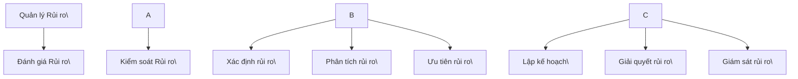

# Quản lý rủi ro phần mềm (Software Risk Management)

**Giảng viên / Lecturer:** Ngô Huy Biên (Ngo Huy Bien) — nhbien@fit.hcmus.edu.vn
**Đơn vị / Department:** Bộ môn Kỹ thuật phần mềm, Khoa Công nghệ thông tin, Trường Đại học Khoa học Tự nhiên, ĐHQG-HCM
**Môn học / Course:** Quản lý Dự án Phần mềm (Software Project Management)

---

## 1. Mục tiêu bài học (Learning Objectives)

Sau bài học, người học có thể:

- Xác định rủi ro dự án.
  _(Identify project risks.)_
- Phân tích rủi ro dự án.
  _(Analyze project risks.)_
- Đề xuất và lựa chọn các phản ứng rủi ro phù hợp.
  _(Propose and select risk responses.)_
- Lập kế hoạch quản lý rủi ro.
  _(Create a risk management plan.)_
- Theo dõi và giám sát rủi ro dự án.
  _(Monitor and track project risks.)_

## 2. Nội dung (Contents Overview)

| #   | Chủ đề (VI)                           | Topic (EN)                     |
| --- | ------------------------------------- | ------------------------------ |
| I   | Khái niệm & Xác định rủi ro           | Risk Concept & Identification  |
| II  | Phân tích rủi ro                      | Risk Analysis                  |
| III | Lập kế hoạch ứng phó & Cây quyết định | Risk Response & Decision Trees |
| IV  | Kế hoạch quản lý rủi ro mẫu           | Model Risk Management Plan     |
| V   | Giám sát & Kiểm soát rủi ro           | Monitor & Control Risks        |

---

## I. Khái niệm & Xác định rủi ro (Risk Concept & Identification)

### 1.1 Rủi ro là gì? \[1\]

> Rủi ro là khả năng xảy ra điều gì đó xấu ở một thời điểm nào đó trong tương lai.
> _(Risk is the possibility of something bad happening at some time in the future.)_
> Rủi ro là xác suất gánh chịu tổn thất trong quá trình theo đuổi mục tiêu do các yếu tố không thể dự đoán trước hoặc vượt quá khả năng kiểm soát.
> _(Risk is the probability of suffering loss while pursuing goals due to factors that are unpredictable or beyond control.)_

- **Rủi ro (Risk):** Sự kiện chưa xảy ra ở hiện tại nhưng có khả năng xảy ra trong tương lai (ẩn số tương lai).
- **Vấn đề (Problem):** Sự kiện đã xảy ra ở hiện tại và đang trực tiếp gây ra hậu quả xấu cho dự án.

### 1.2 Phân loại rủi ro phần mềm

Hệ thống rủi ro phần mềm bao gồm: Rủi ro kỹ thuật, rủi ro quản lý, rủi ro tài chính, rủi ro hợp đồng và pháp lý, rủi ro chấp nhận từ người dùng, và rủi ro bảo trì.

### 1.3 Cách xác định rủi ro (Risk Identification)

Nhằm tạo ra danh sách các hạng mục rủi ro cụ thể của dự án có khả năng làm tổn hại đến kết quả.
_(Producing lists of the project-specific risk items likely to compromise a project's satisfactory outcome.)_

- **Các phương pháp:** Động não (Brainstorming), Phân loại rủi ro (Risk taxonomies), Phân rã công việc (Decomposition), Phân tích đường găng (Critical path analysis), Phỏng vấn (Interviewing), Phân tích giả định (Assumption analysis), Báo cáo tự nguyện (Voluntary reporting), So sánh các dự án trước đây.

### 1.4 Danh sách kiểm tra rủi ro phần mềm (Software Risk Checklist) \[4\]

- **Danh sách I:** Thiếu sự lãnh đạo, yêu cầu không rõ ràng, quá nhiều thay đổi yêu cầu, lịch trình không thực tế, làm việc trên công nghệ mới, làm việc trên quy trình mới, tiêu hao nhân lực, hiệu suất hệ thống chậm.
- **Danh sách II:** Điều chỉnh giữa khóa (mid-course correction), ước tính đệm tạo ra sự ngờ vực (padded estimates), lời tiên tri tự ứng nghiệm (self-fulfilling prophecy), làm việc lùi từ thời hạn (working backward from a deadline), người tiền nhiệm bị hiểu lầm, lạm dụng lặp lại (iteration abuse), vấn đề được phát hiện quá muộn, các cuộc họp lớn và vô ích, "anh hùng" không thể thiếu trong nhóm.

### 1.5 Phân tích chiến lược: PEST & SWOT

- **Phân tích PEST (Political, Economic, Social, Technological):** Phương pháp hoạch định chiến lược dùng để xem xét vị trí, định hướng của công ty hoặc một ý tưởng lớn trong dự án dưới các tác động vĩ mô (Chính trị, Kinh tế, Xã hội, Công nghệ).
- **Phân tích SWOT (Strengths, Weaknesses, Opportunities, Threats):** Đánh giá các yếu tố nội tại và ngoại cảnh của dự án:
  - Điểm mạnh (Strengths): Kỹ năng, giá cả cạnh tranh, động lực tốt, nguồn tài nguyên dồi dào.
  - Điểm yếu (Weaknesses): Thiếu kinh nghiệm, thiếu kỹ năng, thiếu thời gian.
  - Cơ hội (Opportunities): Cơ hội học tập, nâng cao kiến thức, cải thiện kỹ năng.
  - Mối đe dọa (Threats): Đối thủ cạnh tranh, thay đổi nhân sự, vấn đề làm việc nhóm.

---

## II. Phân tích rủi ro (Risk Analysis)

Phân tích rủi ro là phép đo khoa học về mức độ nguy hiểm hoặc tổn hại liên quan đến bất kỳ hoạt động nào của dự án.
_(Risk analysis is the scientific measurement of the degree of danger or hazard involved in any operation or activity.)_

### 2.1 Đặc tính rủi ro (Risk Characterization)

**Xác suất xảy ra (Probability):**

| Cấp độ                             | Khoảng xác suất |
| ---------------------------------- | --------------- |
| Xa vời (Remote)                    | 0% – 20%        |
| Khó xảy ra (Unlikely)              | 20% – 40%       |
| Có thể xảy ra (Likely)             | 40% – 70%       |
| Rất có thể xảy ra (Highly likely)  | 70% – 90%       |
| Gần như chắc chắn (Nearly certain) | 90% – 100%      |

**Tác động (Impact) — Thể hiện qua sự trượt tiến độ và ngân sách:**

| Cấp độ tác động                  | Phạm vi ảnh hưởng ngân sách |
| -------------------------------- | --------------------------- |
| Tối thiểu hoặc không có tác động | < 10% tổng ngân sách        |
| Nhỏ, chấp nhận được              | < 15% tổng ngân sách        |
| Tổn hại hệ thống vừa phải        | < 50% tổng ngân sách        |
| Tác động đáng kể tới dự án       | < 60% tổng ngân sách        |
| Thất bại trong vận hành dự án    | $\ge$ 60% tổng ngân sách    |

**Thời gian xảy ra (Time of Occurrence):** Trong tháng tới; 1 đến 2 tháng tới; hoặc trên 3 tháng kể từ bây giờ.

### 2.2 Phương pháp Delphi trong phân tích rủi ro

Quy trình giao tiếp nhóm có cấu trúc để cho phép một nhóm chuyên gia giải quyết vấn đề phức tạp một cách độc lập:

1. Xây dựng bảng câu hỏi ban đầu và gửi cho các chuyên gia.
2. Các chuyên gia độc lập đưa ra ý kiến phản hồi.
3. Người điều hành tóm tắt các câu trả lời và phát triển báo cáo phản hồi cùng bảng câu hỏi thứ hai.
4. Chuyên gia nhận báo cáo phản hồi, đánh giá độc lập các ý kiến khác và tiếp tục bỏ phiếu cho bảng câu hỏi thứ hai.
5. Người điều hành tổng hợp và gửi báo cáo cuối cùng cho người ra quyết định.

### 2.3 Phân tích cây rủi ro (Risk Tree Analysis) \[3\]

Mô hình đồ họa kết hợp các rủi ro dẫn đến một sự kiện không mong muốn xác định trước (như thất bại của hệ thống/hệ thống con).

- Thiết lập trạng thái thất bại ở trên cùng (Top event - hình chữ nhật).
- Liệt kê các sự kiện cơ bản ở dưới (Basic event - hình tròn).
- Liên kết các sự kiện qua các cổng logic (như cổng OR: đầu ra được tạo ra nếu tồn tại ít nhất một đầu vào).

### 2.4 Mức độ phơi bày rủi ro (Risk Exposure)

Là mức độ ưu tiên của rủi ro, thể hiện tác động trung bình:
$$\text{Risk Exposure (RE)} = \text{Xác suất (Probability)} \times \text{Tác động (Impact)}$$

---

## III. Lập kế hoạch ứng phó & Cây quyết định (Risk Response & Decision Trees)

### 3.1 Các chiến lược ứng phó rủi ro \[4\]

- **Chấp nhận (Acceptance):** Thừa nhận sự tồn tại của rủi ro nhưng không hành động phủ đầu, chỉ xây dựng kế hoạch dự phòng nếu rủi ro xảy ra.
- **Tránh né (Avoidance):** Loại bỏ hoàn toàn các điều kiện cho phép rủi ro xuất hiện (như hủy bỏ nhiệm vụ hoặc dự án).
- **Chuyển giao / Làm chệch hướng (Deflection/Transfer):** Chuyển giao rủi ro (toàn bộ hoặc một phần) cho bên thứ ba (mua bảo hiểm, thuê ngoài).
- **Giảm thiểu (Mitigation):** Chủ động giảm xác suất xảy ra hoặc giảm thiểu tác động của rủi ro.

_Khả năng chấp nhận rủi ro (Risk Tolerance)_ là mức độ sẵn lòng chấp nhận hoặc né tránh rủi ro của một cá nhân hoặc tổ chức.

### 3.2 Bảng ví dụ thực tế về giảm thiểu rủi ro

| Sự kiện rủi ro                     | Hoạt động giảm thiểu rủi ro                                                                                                                                                                                          |
| ---------------------------------- | -------------------------------------------------------------------------------------------------------------------------------------------------------------------------------------------------------------------- |
| **Thiếu kinh nghiệm về công nghệ** | - Ước tính tiến độ kèm khoảng đệm thời gian học. - Duy trì nguồn tài nguyên bổ sung. - Thiết lập chương trình đào tạo chuyên biệt và đào tạo chéo.                                                             |
| **Yêu cầu không rõ ràng**          | - Phát triển nguyên mẫu (prototype) để khách hàng xem xét. - Đưa ra giả định logic dựa trên kinh nghiệm và yêu cầu khách hàng ký xác nhận (sign-off).                                                             |
| **Thay đổi yêu cầu quá nhiều**     | - Lấy sign-off cho đặc tả yêu cầu ban đầu. - Thuyết phục khách hàng về tác động tiến độ khi thay đổi yêu cầu. - **Ước tính lại và thông báo ngay** khi nhận yêu cầu thay đổi, không đợi đến ngày cuối mới báo. |
| **Lịch trình không thực tế**       | - Đàm phán lại lịch trình; thiết lập các nhiệm vụ chạy song song. - Xác định các phần việc có thể tự động hóa hoặc dùng thành phần COTS sẵn có.                                                                   |
| **Hiệu suất hệ thống kém**         | - Xác định rõ chỉ số hiệu suất để khách hàng duyệt. - Mô phỏng/tạo mẫu các giao dịch quan trọng. - Tiến hành kiểm thử tải và kiểm thử căng thẳng (stress test) với lượng dữ liệu lớn.                          |

### 3.3 Phân tích phản phó bằng Cây quyết định (Decision Tree Analysis) \[5\]

Biểu diễn theo trình tự thời gian của quá trình ra quyết định dưới dạng sơ đồ mạng:

- **Nút quyết định (Decision nodes):** Biểu diễn bằng hình vuông (lựa chọn của PM).
- **Nút cơ hội (Chance nodes):** Biểu diễn bằng hình tròn (sự không chắc chắn của môi trường).

**Các bước sử dụng cây quyết định:**

1. Vẽ cây từ trái sang phải với các nút quyết định và cơ hội.
2. Gán chi phí cho mỗi quyết định và xác suất/tác động tài chính cho mỗi nhánh cơ hội.
3. Tính toán giá trị cây từ phải sang trái.
4. Tại các nút cơ hội, tính giá trị kỳ vọng (Expected Monetary Value — EMV) bằng cách nhân giá trị kết quả với xác suất của nó.

**Đòn bẩy giảm thiểu rủi ro (Risk Reduction Leverage — RRL):**
Phân tích lợi ích chi phí của các phương án giảm thiểu rủi ro (1 USD chi ra làm giảm bao nhiêu USD tác động trung bình):
$$RRL = \frac{RE_{\text{trước}} - RE_{\text{sau}}}{\text{Chi phí giảm thiểu}}$$

### 3.4 Sơ đồ ảnh hưởng (Influence Diagram) \[6\]

Biểu đồ mô hình hóa các biến không chắc chắn và quyết định, thể hiện rõ ràng các phụ thuộc xác suất và dòng thông tin thông qua:

- Nút quyết định (Decision nodes).
- Nút cơ hội (Chance nodes).
- Nút giá trị/tiện ích (Value/Utility nodes): Biến tóm tắt kết quả cuối cùng.

---

## IV. Kế hoạch quản lý rủi ro mẫu (Model Risk Management Plan)

Kế hoạch quản lý rủi ro được tổ chức theo tiêu chuẩn để trả lời các câu hỏi: _Tại sao, Cái gì, Khi nào, Ai, Ở đâu, Như thế nào và Bao nhiêu_ \[IEEE Std 1540-2001\].

**Ví dụ Kế hoạch quản lý rủi ro: Tạo mẫu chịu lỗi hệ thống (Fault Tolerance Prototyping):**

1. **Mục tiêu (Objectives — "Tại sao"):** Xác định và giảm thiểu mức độ rủi ro của tính năng chịu lỗi gây ảnh hưởng đến hiệu suất hệ thống; thiết lập kế hoạch phát triển cho các tính năng chịu lỗi rủi ro thấp.
2. **Sản phẩm & Cột mốc (Deliverables & Milestones — "Cái gì" & "Khi nào"):**
   - Tuần 3: Báo cáo đánh giá tùy chọn chịu lỗi; đánh giá thành phần tái sử dụng; kế hoạch đánh giá bài tập mẫu; mô tả nguyên mẫu.
   - Tuần 7: Nguyên mẫu hoạt động chịu lỗi; mô phỏng tải; đo đạc dữ liệu; dự thảo kế hoạch.
   - Tuần 10: Đánh giá và lặp lại nguyên mẫu; sửa đổi mô tả kế hoạch.
3. **Trách nhiệm (Responsibilities — "Ai" & "Ở đâu"):**
   - Kỹ sư hệ thống (G. Smith): Thực hiện nhiệm vụ 1, 3, 4, 9, 11; hỗ trợ nhiệm vụ 5, 10.
   - Lập trình viên chính (C. Lee): Thực hiện nhiệm vụ 5, 6, 7, 10; hỗ trợ nhiệm vụ 1, 3.
   - Lập trình viên (J. Wilson): Thực hiện nhiệm vụ 2, 8; hỗ trợ nhiệm vụ 5, 6, 7, 10.
4. **Cách tiếp cận (Approach — "Làm thế nào"):** Nỗ lực tạo mẫu theo sát lịch trình (Design-to-Schedule); sử dụng hệ điều hành thời gian thực; đánh giá hiệu suất dưới tải giả lập; tinh chỉnh nguyên mẫu dựa trên kết quả.
5. **Nguồn lực (Resources — "Bao nhiêu"):**
   - Lương nhân sự: $60K (3 người $\times$ 10 tuần $\times$ $2K/người-tuần).
   - Thiết bị: 3 workstation, 2 target processor, 1 test co-processor (tận dụng từ dự án): $0K.
   - Quỹ dự phòng: $10K.
   - **Tổng chi phí: $70K.**

---

## V. Giám sát & Kiểm soát rủi ro (Monitor and Control Risks)

Giám sát rủi ro liên quan đến việc theo dõi tiến trình giải quyết các hạng mục rủi ro của dự án và thực hiện hành động khắc phục khi cần thiết.

### 5.1 Tại sao phải quản lý rủi ro?

- Cải thiện quản trị và kiểm soát dự án.
- Giảm thiểu tổn thất và tác động của rủi ro đối với mục tiêu dự án.
- Tuân thủ các quy định pháp luật và tiêu chuẩn quy trình.
- > _"Nếu bạn không chủ động tấn công rủi ro, rủi ro sẽ chủ động tấn công bạn."_ — Tom Gilb.
  > _(If you don't actively attack the risks, they will actively attack you.)_

---

## Tài liệu tham khảo (References)

1. C. Ravindranath Pandian (2007). _Applied Software Risk Management: A Guide for Software Project Managers_.
2. Kathy Schwalbe (2017). _An Introduction to Project Management_. 6th Edition. Schwalbe Publishing.
3. Hooman Hoodat & Hassan Rashidi (2009). _Classification and Analysis of Risks in Software Engineering_.
4. Barry W. Boehm (1991). _Software Risk Management: Principles and Practices_.
5. M. T. Taghavifard et al. (2009). _Decision Making Under Uncertain and Risky Situations_.
6. R. D. Shachter (1986). _Evaluating Influence Diagrams_.
